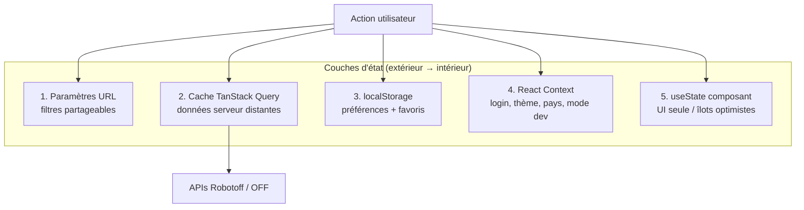

# Phase 10 — TanStack Query et état frontend

> **Open Food Facts Hunger Games — Onboarding contributeur**
>
> Suite de [Phase 9 — Frontière API Open Food Facts](./phase-9-open-food-facts-api-boundary.md)
>
> Preuves : `src/App.jsx`, `src/hooks/useQuestions.ts`, `src/hooks/useFilterState/`, `src/hooks/useUrlParams.js`, `src/localeStorageManager.ts`, `src/contexts/`, `src/hooks/useProduct.ts`, `src/pages/ingredients/useData.tsx`, `src/pages/packaging/useBuffer.ts`, grep sur `useQuery` / `useMutation` / `setQueryData`.

---

## Pourquoi cette phase existe

La phase 7 a parcouru le **runtime du jeu Questions** — flux de réponse, file optimiste, rechargement. La phase 10 recule : **comment Hunger Games stocke, synchronise et met à jour l'état dans toute la SPA**.

Hunger Games n'est pas une app Redux. L'état vit dans **cinq couches qui se chevauchent** :



**FAIT :** Il n'y a **pas de store global Redux/Zustand**. TanStack Query est la couche d'état serveur partagée la plus proche.

---

## Configuration QueryClient

**FAIT** (`App.jsx`) :

```javascript
const queryClient = new QueryClient();
// ...
<QueryClientProvider client={queryClient}>
```

| Paramètre | Valeur | Implication |
|---|---|---|
| `defaultOptions` personnalisées | **Aucune** | Les défauts TanStack Query v5 s'appliquent (`staleTime: 0`, refetch au focus fenêtre, etc.) |
| `invalidateQueries` | **Jamais utilisé** dans `src/` | Les mises à jour cache sont manuelles via `setQueryData` ou refetch naturel au changement de clé |
| `prefetchQuery` | **Jamais utilisé** | Pas de préchauffage proactif au-delà des montages `useQuery` parallèles |
| Devtools | **Non branchées** | Pas de panneau React Query Devtools dans l'app |

**INFÉRENCE :** Le code préfère la **chirurgie explicite du cache** (`setQueryData`) à l'orchestration invalidation/refetch — surtout dans la file Questions.

Ordre d'imbrication des providers (pertinent pour déboguer contexte vs requête) :

```text
CountryProvider
  → ColorModeContext
    → ThemeProvider
      → LoginContext
        → DevModeContext
          → QueryClientProvider
            → Routes (pages lazy)
```

---

## Patterns TanStack Query dans ce dépôt

| Pattern | Où | Objectif |
|---|---|---|
| **`useQuery`** | La plupart des lectures | Produit, questions, compteurs, autocomplétion, insight debug |
| **`useInfiniteQuery`** | `useData.tsx`, `Opportunities.tsx` | Listes produit/opportunité paginées |
| **`useQueries`** | Green Score, stats accueil, traductions catégories | Fetches indépendants parallèles |
| **`useMutation`** | rechargement `useQuestions`, enregistrement ingrédient | Effets de bord + fusion cache au succès |
| **`setQueryData`** | `useQuestions.answerQuestion` | File optimiste + réponses récentes |
| **`enabled: false`** | `useRobotoffPrediction` | Fetch manuel via `refetch()` |
| **`placeholderData`** | `InsightsGrid` | Garder la page précédente visible pendant la pagination |
| **Seed query avec fn vide** | `["recent-answers"]` | Liste côté client soutenue par le cache de requête |

**FAIT :** Seulement **deux** sites d'appel `useMutation` : `useQuestions.ts` (rechargement) et `IngeredientDisplay.tsx` (enregistrement ingrédient).

---

## La file Questions — clés de requête et contrat de cache

La phase 7 couvrait le comportement ; la phase 10 verrouille **l'identité du cache**.

### Clé de requête principale

```typescript
const getQuestionKeys = (params: FilterState) => [
  "questions",
  params.insightType,
  params.valueTag,
  params.sorted !== "false",   // booléen dans la clé — chaîne "false" → false
  params.brand,
  params.country,
  params.campaign,
  params.predictor,
];
```

| Segment de clé | Param URL | Notes |
|---|---|---|
| `"questions"` | — | Préfixe d'espace de noms |
| `insightType` | `type` | ex. `label`, `category` |
| `valueTag` | `value_tag` | Tag taxonomie ou vide |
| `sorted !== "false"` | `sorted` | Tri popularité par défaut sauf `sorted=false` |
| `brand` | `brand` | |
| `country` | `country` | Normalisé dans `getFilterParams` |
| `campaign` | `campaign` | |
| `predictor` | `predictor` | |

**FAIT :** Changer un filtre dans l'URL crée une **nouvelle entrée de cache** — la file précédente est conservée jusqu'au garbage collection, pas explicitement vidée.

### Forme de la valeur en cache

```typescript
{
  questions: QuestionInterface[];
  count: number;
}
```

**FAIT :** Question courante = `questions[0]`. Pas d'état d'index séparé.

### `["recent-answers"]` — cache de requête comme mémoire de session

```typescript
useQuery({
  queryKey: ["recent-answers"],
  queryFn: (): AnsweredQuestion[] => [],
});
```

| | |
|---|---|
| **Objectif** | 25 dernières réponses Oui/Non (Passer exclu) pour sidebar/historique |
| **Fetch initial** | Retourne `[]` une fois ; ne refetch jamais depuis le serveur |
| **Mises à jour** | Uniquement via `setQueryData` dans `answerQuestion` |
| **Persistance** | **Perdu au rechargement complet de page** — pas dans localStorage |

**INFÉRENCE :** Exploite TanStack Query comme **liste typée en mémoire**, pas comme un vrai état distant.

### Mutation de rechargement

Quand la longueur de file ≤ 5 et que le `count` serveur suggère qu'il en reste :

```typescript
mutation.mutate(keys);  // relance fetchQuestions()
// onSuccess : ajoute les nouvelles questions, déduplique par insight_id
```

**FAIT :** Le rechargement est déclenché **à l'intérieur** du callback `setQueryData` — pattern inhabituel, fonctionne car il lit le garde `mutation.isPending`.

### Mode d'échec (rappel)

**FAIT :** Les erreurs `robotoff.annotate` sont seulement loguées. La suppression optimiste **n'est jamais annulée**.

---

## Catalogue complet des clés de requête

| Clé de requête | Fonction de requête | Activée quand | Consommateur principal |
|---|---|---|---|
| `["questions", …filters]` | `robotoff.questions()` | Toujours (page montée) | `useQuestions`, `QuestionDisplay` |
| `["recent-answers"]` | retourne `[]` | Toujours | `useQuestions` → historique sidebar |
| `["product", barcode]` | `off.getProduct()` | barcode truthy | `useProductData`, `ProductInformation` |
| `["product-question", barcode]` | `robotoff.questionsByProductCode()` | barcode truthy | `ProductOtherQuestions` |
| `["potential-question-count", filterState, type, tag]` | `getNbOfQuestionForValue()` | pas de `valueTag` dans filtre mais question a tag | badge `QuestionDisplay` |
| `["questionCount", filterState]` | `robotoff.questions(,1,1)` | Toujours | `QuestionCard` (favoris accueil) |
| `["question-count", filterState]` | idem | sauf si count pré-fourni | `SmallQuestionCard`, Green Score |
| `["question-count", filterState]` (batch Green Score) | idem | par carte | `useQueries` page green-score |
| `["opportunities", type, campaign, country]` | `robotoff.getUnansweredValues()` | Toujours | défilement infini `Opportunities` |
| `["category-translations", lang, categories[]]` | `off.getCategoriesTranslations()` | catégories non vides | `Opportunities` |
| `["insights", filterState, page]` | `robotoff.getInsights()` | Page Insights | `InsightsGrid` |
| `["insight-details", insightId]` | `robotoff.insightDetail()` + fallback logo | insightId défini | `DebugQuestion` |
| `["taxonomy", insightType, valueTag]` | `getTaxonomy()` | SimilarQuestions visible | `SimilarQuestions` |
| `["autocomplete", insightType, input, lang]` | `SearchApi.autocomplete()` | longueur input ≥ 2 | `LabelFilter` |
| `["ingredient-products", countryCode]` | `off.searchProducts()` + pages | Jeu Ingrédients | infini `useData.tsx` |
| `["robotoff-prediction", fetchUrl]` | GET URL predict Robotoff | **`enabled: false`** | OCR Ingrédients par image |
| `["userStat", facet, userName]` | `offClient.getFacetValue()` | Accueil + username | `home/UserData.tsx` |
| `["nutriments-translations", lc]` | `GET /cgi/nutrients.pl` | Helper nutrition | `useNutrimentTranslations` |

**FAIT :** `useQuestionsQuery(valueTag)` duplique la logique de fetch avec une forme de clé qui se chevauche — utilisé par les compteurs label de `SimilarQuestions`.

---

## État synchronisé URL — deux hooks différents

Hunger Games a **deux systèmes de paramètres URL**. Ils se comportent différemment.

### `useFilterState` — React Router natif (jeu Questions)

**Fichiers :** `hooks/useFilterState/useFilterState.ts`, `getFilterParams.ts`

```typescript
const [filterParams, setFilterParams] = useFilterState();
// lit URLSearchParams via useSearchParams()
// écrit via setSearchParams()
```

| Param URL | Champ `FilterState` |
|---|---|
| `type` | `insightType` |
| `value_tag` | `valueTag` |
| `country` | `country` |
| `brand` | `brand` |
| `campaign` | `campaign` |
| `predictor` | `predictor` |
| `sorted` | `sorted` (défaut `"true"`) |

**FAIT :** `normalizeCountryFilter` convertit `en:world` → `""` et mappe les ids taxonomie vers `countryCode` via `countries.json`.

**Utilisé par :** Page Questions, liens Green Score (`getQuestionSearchParams`), cartes Opportunities.

---

### `useUrlParams` — `history.pushState` manuel (legacy)

**Fichier :** `hooks/useUrlParams.js`

```javascript
setUrlParams(newParams, defaultParams);  // window.history.pushState
```

| Comportement | |
|---|---|
| Lit | `window.location.search` au montage + quand `useLocation().search` change |
| Écrit | **`pushState`** — met à jour l'URL sans événement navigation React Router dans tous les cas |
| Défauts | Les params correspondant aux défauts sont **retirés** de la chaîne URL |

**Utilisé par :** Filtres page Insights, page Emballage (`creator`, `code`).

**INFÉRENCE :** Pattern plus ancien ; Insights + Emballage encore dessus. Questions migré vers `useSearchParams`.

**Piège :** Mélanger `useUrlParams` et `useSearchParams` sur la même page pourrait désynchroniser — **FAIT :** aucune page fait les deux actuellement.

---

## Pays — pont URL + localStorage

**Fichier :** `contexts/CountryProvider/CountryProvider.tsx`

Ordre de résolution :

1. `?country=` dans l'URL (si code valide dans `countries.json`)
2. sinon clé `localStorage` `"country"`
3. sinon `""` (world)

```typescript
setCountry(newCountry, "global" | "page")
// "global" → écrit aussi localStorage
// toujours → met à jour URL ?country=
```

**FAIT :** Les filtres Questions utilisent `useFilterState().country`. Green Score / Nutrition utilisent `useCountry()`. Les deux peuvent définir le param URL `country` — ils doivent rester alignés quand l'utilisateur change de pays dans l'une ou l'autre UI.

---

## localStorage — préférences et favoris

**Clé de stockage :** `"hunger-game-settings"` (notez l'orthographe : `hunger-game`, pas `hunger-games`)

| Clé | Objectif | API de lecture |
|---|---|---|
| `lang` | Langue UI | `getLang()` — `?language=` URL prime |
| `colorMode` | clair/sombre | `getColor()` |
| `devMode` | ignorer login / gardes écriture logo | `getIsDevMode()` |
| `visiblePages` | afficher/masquer entrées nav | `getVisiblePages()` |
| `questions_hideImages` | grille images sidebar | `getHideImages()` |
| `showTour`, `showDatabase`, `showNutriscore` | bascules fonctionnalités | divers |
| `pageCustomization` | panneaux debug/autres-questions | `getPageCustomization()` |

**Clé séparée :** `"hunger-game-favorites"` — presets de filtre question sauvegardés (`localFavorites`).

**FAIT :** Les favoris utilisent un cache en mémoire (`localFavorites.mem`) + lodash `isEqual` pour la correspondance de filtres. `useFavorite` force le re-render via un tick `useReducer` — **pas** connecté à TanStack Query.

**FAIT :** `getPageCustomization()` **ignore actuellement** les paramètres stockés et retourne toujours `{ showDebug: true, showOtherQuestions: true }` — chemin de lecture mort.

---

## React Context — état UI transversal

| Context | État | Persisté ? | Défini dans |
|---|---|---|---|
| **`LoginContext`** | `userName`, `isLoggedIn`, `refresh()` | Cookie session (OFF) | `App.jsx` |
| **`DevModeContext`** | `devMode`, `visiblePages`, `pageCustomization` | localStorage au changement | `App.jsx` + page paramètres |
| **`ColorModeContext`** | bascule thème MUI | localStorage | `App.jsx` |
| **`CountryContext`** | `country`, `setCountry` | URL + localStorage optionnel | `CountryProvider` |
| **`MatomoContext`** | tracker analytics | — | `MatomoProvider` dans `index.tsx` |

**FAIT :** Les routes logo sont conditionnées par `userState.isLoggedIn` de LoginContext — pas par TanStack Query.

**FAIT :** Le mode dev dans localStorage peut désactiver les appels mutation logo (vérifications `IS_DEVELOPMENT_MODE` et devMode dans les pages logo — voir phase 8).

---

## État local composant (volontairement hors Query)

Certains flux **évitent délibérément** TanStack Query :

### `ProductOtherQuestions` — sidebar pessimiste

| État | Mécanisme |
|---|---|
| Liste autres questions | `useProductQuestions` (Query) |
| Sélection oui/non en attente | `useState<Record<insight_id, …>>` |
| Confirmation envoi | `robotoff.annotate().then()` — **attend** le serveur |

**FAIT :** La sidebar **ne mute pas** le cache principal `["questions", …]`.

### Jeu Ingrédients — hybride

| Préoccupation | Mécanisme |
|---|---|
| Pages produit | `useInfiniteQuery` |
| Produits ignorés | `useState` Set de codes-barres (session seulement) |
| Prédiction OCR | `useQuery` avec `enabled: false` + `refetch` manuel |
| Aperçu parsing ingrédients | `useState` simple + axios dans `useIngredientParsing` |
| Enregistrement | `useMutation` → `off.setIngedrient` — **pas d'invalidation de requête** |

Avancement file = `removeHead()` ajoute le code-barres au set ignoré ; ne PATCH pas les pages du cache.

### Jeu Emballage — pas de TanStack Query

**Fichier :** `pages/packaging/useBuffer.ts`

| État | Mécanisme |
|---|---|
| File produit | `useState` + `useEffect` axios GET |
| Pagination | page initiale aléatoire 1–100, puis séquentielle |
| Avancement | slice du tableau local ou fetch page suivante |

**INFÉRENCE :** Pattern fetch impératif plus ancien ; fonctionne mais incohérent avec l'approche infinite query des ingrédients.

### Jeux Logo — surtout impératif

Les pages logo (`LogoAnnotation`, `LogoDeepSearch`, etc.) utilisent **`useState` + handlers async**, pas TanStack Query.

---

## Collision de nommage FilterState

**FAIT :** Deux concepts `FilterState` différents existent :

| Type | Défini dans | Champs |
|---|---|---|
| **Filtre Robotoff** | `robotoff.ts` | `insightType`, `valueTag`, `country`, `brand`, `sorted`, … |
| **Local QuestionCard** | `QuestionCard.tsx` | `countryFilter`, `brandFilter`, `sortByPopularity`, … |

`getQuestionSearchParams` fait le pont entre filtres au format Robotoff et l'URL. En lisant le code, vérifiez **quel FilterState** s'applique aux imports.

---

## Résumé stratégie d'état par jeu

| Jeu / page | Cache distant | URL | localStorage | useState local |
|---|---|---|---|---|
| **Questions** | `useQuestions` + requêtes produit | `useFilterState` | masquer images, favoris | focus clavier |
| **Green Score** | requêtes count + infini opportunities | pays via `useCountry` | — | UI ordre de tri |
| **Insights** | requête insights + pagination placeholder | `useUrlParams` | — | modèle pagination DataGrid |
| **Ingrédients** | produits infinis | pays (global) | — | set ignorés, texte édité |
| **Emballage** | aucun (useBuffer) | `useUrlParams` | — | lignes tableau |
| **Logos** | aucun | params route / formulaires | — | état UI annotation |
| **Nutrition** | interne webcomponents | `?code=` | — | autocomplétion pays |
| **Accueil** | requêtes stats utilisateur | — | cartes filtre sauvegardées | — |

---

## Diagramme de flux de données — page Questions (toutes les couches)

```mermaid
sequenceDiagram
    participant URL as URL ?type=&value_tag=
    participant FS as useFilterState
    participant UQ as useQuestions
    participant QC as Cache QueryClient
    participant RO as Robotoff
    participant OFF as API OFF
    participant PI as ProductInformation

    URL->>FS: parse searchParams
    FS->>UQ: FilterState
    UQ->>QC: queryKey ["questions", …]
    QC->>RO: fetch si stale
    RO-->>QC: { questions, count }
    UQ->>PI: question.barcode
    PI->>QC: ["product", barcode]
    QC->>OFF: getProduct
    Note over UQ,QC: answerQuestion → setQueryData (optimiste)
    UQ->>RO: annotate (fire-and-forget)
```

---

## Patterns contributeur — à faire / à ne pas faire

### À faire

- **Respecter les formes de clés de requête existantes** en ajoutant un fetch lié — surtout le tuple `getQuestionKeys`.
- **Utiliser `useFilterState`** pour tout ce qui est sur la barre de filtres de la route Questions.
- **Utiliser `setQueryData`** en reprenant le pattern de file optimiste.
- **Utiliser `enabled`** pour différer les fetches coûteux jusqu'à ce que l'entrée soit significative (`LabelFilter` ≥ 2 caractères).

### À ne pas faire

- **Ne pas ajouter `invalidateQueries`** sans discussion d'équipe — rien ne l'utilise aujourd'hui ; le comportement serait inhabituel.
- **Ne pas supposer que sidebar et file principale partagent le cache** — clés et stratégies de mise à jour différentes.
- **Ne pas stocker l'état de filtre uniquement dans React state** sur Questions — l'URL est la source de vérité partageable.
- **Ne pas confondre `useUrlParams` avec `useSearchParams`** — choisissez celui que la page utilise déjà.

---

## Protection de l'espace mental

### À COMPRENDRE MAINTENANT

1. **Clé de requête `useQuestions`** — sept dimensions de filtre + préfixe `"questions"` ; pilote tout le cache de file.
2. **Mises à jour optimistes via `setQueryData`** — pas de mutations avec rollback.
3. **`useFilterState` = URL** pour Questions ; changer l'URL = nouveau bucket de cache.
4. **`["recent-answers"]`** — mémoire côté client dans le cache de requête ; les Passer ne sont pas stockés.
5. **Tout n'utilise pas TanStack Query** — buffer emballage et pages logo sont impératifs.

### UTILE PLUS TARD

- `placeholderData` sur pagination insights
- param page `useInfiniteQuery` = `pages.length` (ingrédients)
- favoris + astuce refresh `useReducer`
- `useLocalStorageState` avec sync inter-onglets
- Défauts globaux QueryClient (staleTime 0 → refetch au focus)

### IGNORER POUR L'INSTANT

- Configuration React Query Devtools
- Design de cache d'entités normalisé
- Patterns requête SSR/hydratation (non applicable — SPA CSR)
- Plugins persist-query

---

## Résumé phase 10 — cinq choses à retenir

1. **TanStack Query = état serveur** — file Questions, produits, compteurs, insights ; pas les préfs UI.
2. **L'URL est la source de filtre partageable** sur `/questions` — les clés de requête reflètent les champs URL.
3. **`setQueryData` est la principale API d'écriture** — pas de culture d'invalidation dans ce dépôt.
4. **localStorage + Context** détiennent préfs, login, thème, pays — pas les données d'annotation.
5. **Les patterns hybrides sont normaux** — infinite query + Set ignorés + axios manuel sur des pages différentes.

### Incertitudes

- **INCONNU :** Si emballage/logos migreront vers TanStack Query.
- **INFÉRENCE :** Le `staleTime: 0` par défaut peut provoquer des refetch supplémentaires en revenant sur l'onglet Questions.
- **FAIT :** La lecture stockage de `getPageCustomization` est actuellement contournée.

---

## Et ensuite

**Phase 11 — Algorithmes et transformations de données**

Formatage code-barres, construction URL image, reformatage value tag, affichage parsing ingrédients, normalisation paramètres filtre — les fonctions pures et transformations entre payloads API et UI.

---

*Arrêtez-vous ici. Changez un filtre sur `/questions` et observez l'URL, puis imaginez le tableau de clé de requête qui change — c'est la colonne vertébrale de l'état client Hunger Games. Passez à la phase 11 quand vous êtes prêt.*
