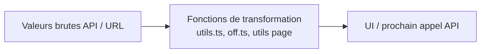
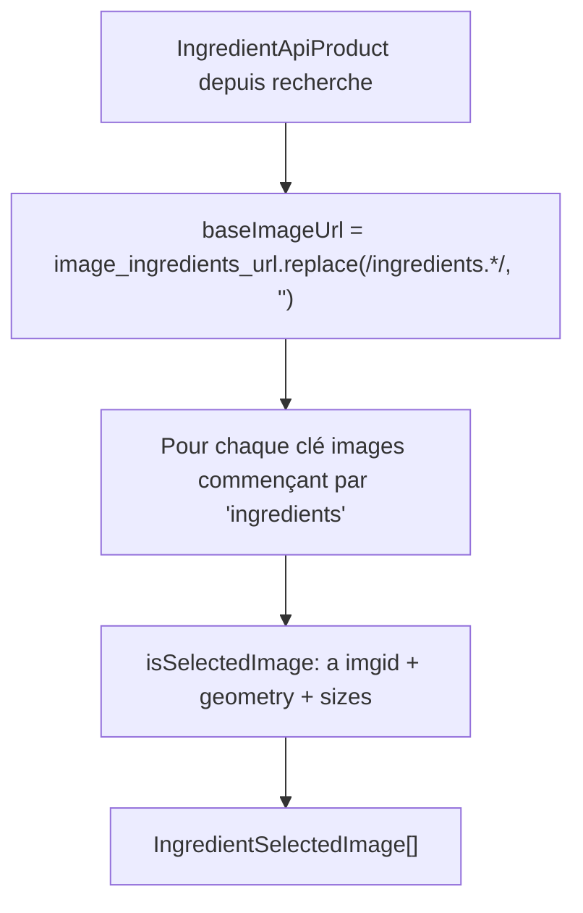

# Phase 11 — Algorithmes et transformations de données

> **Open Food Facts Hunger Games — Onboarding contributeur**
>
> Suite de [Phase 10 — TanStack Query et état frontend](./phase-10-tanstack-query-and-frontend-state.md)
>
> Preuves : `src/utils.ts`, `src/off.ts`, `src/robotoff.ts`, `src/pages/questions/utils.ts`, `src/hooks/useFilterState/getFilterParams.ts`, `src/components/QuestionFilter/`, `src/pages/ingredients/`, `src/pages/packaging/`, `src/pages/nutrition/utils.ts`, `src/utils/getCountryId.ts`, `src/l10n-shortcuts.ts`.

---

## Ce que couvre cette phase

Les phases 7–10 ont expliqué **les flux et l'état**. La phase 11 cartographie les **transformations pures** entre les payloads API et l'UI — les petites fonctions qui déterminent silencieusement si un filtre fonctionne, une image se charge ou un tag correspond à Robotoff.



**FAIT :** Il n'y a pas de package `transforms/` partagé. La logique est **distribuée** — `src/utils.ts` est l'outil global le plus proche, mais beaucoup de transformations vivent dans les fichiers de page (`questions/utils.ts`, `ingredients/useData.tsx`, `packaging/index.tsx`).

---

## La boîte à outils globale — `src/utils.ts`

| Fonction | Entrée → sortie | Utilisé pour |
|---|---|---|
| **`reformatValueTag`** | string → tag slugifié | params Robotoff `value_tag` / `brands`, URL facettes OFF |
| **`removeEmptyKeys`** | object → même objet, mute | Retirer params requête null/vides avant HTTP |
| **`capitaliseName`** | `en:france` → `France` | Helper d'affichage (retire préfixe langue 3 car.) |
| **`sleep`** | ms → Promise | Tests uniquement |

### `reformatValueTag` — le slugificateur de tag

```typescript
// Comportement simplifié :
trim → toLowerCase → remplace accents/espaces/& → réduit "--"
```

**Correspondance de caractères (FAIT) :**

| Remplacé | Par |
|---|---|
| espace, `'` | `-` |
| `&` | supprimé |
| `àâä`, `éèêë`, `îï`, `ôö`, `ûùü` | voyelle ASCII |

Puis : `output.replace(/-{2,}/g, "-")`

**Exemples (INFÉRENCE depuis l'algorithme) :**

| Entrée | Sortie |
|---|---|
| `en:Organic` | `en:organic` |
| `Ben & Jerry's` | `ben-jerrys` |
| `Crème Brûlée` | `crème-brûlée` → passe accents → `creme-brulee` |

**Sites d'appel :**

- `robotoff.questions()` — params `value_tag` et `brands`
- `getValueTagExamplesURL()` — lien page exemples OFF

**Piège :** Les liens facettes dans `ADDITIONAL_INFO_TRANSLATION` utilisent une **transformation différente** (`toLowerCase().replaceAll(" ", "-")`) — **pas** `reformatValueTag`. Les URL facettes catégorie/label peuvent diverger des règles slug Robotoff pour les caractères limites.

---

### `removeEmptyKeys` — hygiène des paramètres de requête

```typescript
Object.keys(obj).forEach(
  (key) => (obj[key] == null || obj[key] === "") && delete obj[key],
);
return obj;
```

**FAIT :** Mute l'objet sur place, puis le retourne.

**Utilisé par :** `robotoff.questions`, `getInsights`, `searchLogos`, `updateLogo`, `getUnansweredValues`.

**INFÉRENCE :** Évite d'envoyer des chaînes vides `value_tag=` ou `brands=` qui pourraient perturber le filtrage Robotoff.

---

## Code-barres → chemin CDN

### `getFormatedBarcode` (`off.ts`)

```typescript
const BARCODE_REGEX = /(...)(...)(...)(.*)$/;
// Groupes de 3 chiffres, puis reste → joint avec "/"
```

| Code-barres | Chemin dossier CDN |
|---|---|
| `0049000532258` | `004/900/053/2258` |
| Codes courts | Groupes partiels correspondent toujours à la regex |

**FAIT :** Utilisé avant de construire les chemins `OFF_IMAGE_URL/...` dans `getImagesUrls`, images signalées, et partout où les photos produit sont adressées par code-barres.

**FAIT :** `getImageUrl(imagePath)` retire seulement un `/` initial et préfixe `https://images.openfoodfacts.org/images/products/`.

---

## Pipeline URL image

Hunger Games construit les URL d'image dans **trois contextes** — même CDN, points d'entrée différents.

```mermaid
flowchart TB
    subgraph Questions["Sidebar Questions"]
        IMG1["clés numériques product.images"]
        FMT1["getFormatedBarcode"]
        GU1["getImagesUrls"]
        OUT1[".../key.400.jpg + .../key.jpg"]
    end

    subgraph Logos["Jeux Logo"]
        SRC["chemin logo.image.source_image"]
        GI["off.getImageUrl(source_image)"]
        CROP["robotoff.getCroppedImageUrl(url, bbox)"]
        OUT2["Robotoff /images/crop?..."]
    end

    subgraph Ingredients["Jeu Ingrédients"]
        BASE["image_ingredients_url retire /ingredients.*"]
        STATIC["remplace images. → static."]
        OCR[".../predict/ingredient_list?ocr_url=...json"]
    end

    IMG1 --> FMT1 --> GU1 --> OUT1
    SRC --> GI --> CROP --> OUT2
    BASE --> STATIC --> OCR
```



### `getImagesUrls` (`pages/questions/utils.ts`)

1. Filtrer les clés `images` qui se parsent en entiers (entrées `imgid` numériques).
2. Construire la racine : `OFF_IMAGE_URL/{formattedBarcode}/`
3. Pour chaque clé :
   - `imageUrl` : `{root}/{key}.400.jpg` (vignette)
   - `imageUrlFull` : `{root}/{key}.jpg`
   - `uploaded_t` : secondes Unix → chaîne date locale, ou `"Unknown"`

**FAIT :** `ProductInformation` appelle `.reverse()` sur le résultat — images les plus récentes supposées en fin d'ordre de clés.

---

### `getFullSizeImage` — zoom image héro question

```typescript
if (!src) → PNG placeholder sur images.openfoodfacts.org
if matches /\/[a-z_]+.[0-9]*.400.jpg$/ → remplace 400.jpg par full.jpg
else → remplace 400.jpg par jpg
```

**Utilisé par :** `QuestionDisplay` → vue pleine résolution `ZoomableImage`.

---

### `getImageId` — implémentations dupliquées

| Emplacement | Retourne | Utilisé pour |
|---|---|---|
| `questions/utils.ts` | `Number` depuis nom de fichier | signalement NutriPatrol (`ProductInformation`) |
| `nutrition/utils.ts` | `string` depuis dernier segment de chemin | helpers nutrition |
| `flaggedImages/index.tsx` | constructeur URL inline | tableau images signalées |

**FAIT :** Même nom, types de retour différents — vérifiez le chemin d'import avant réutilisation.

---

### URL recadrage logo — ordre bounding box

**FAIT** (`robotoff.getCroppedImageUrl`) :

```typescript
const [y_min, x_min, y_max, x_max] = boundingBox;
// URLSearchParams: image_url, y_min, x_min, y_max, x_max
```

Les coordonnées sont des **fractions normalisées** (0–1), pas des pixels. Les pages logo passent `logo.bounding_box` de Robotoff inchangé.

Chaîne : `off.getImageUrl(logo.image.source_image)` → URL CDN complète → requête crop sur Robotoff.

---

## Transformations filtre et paramètres URL

Deux schémas de nommage parallèles existent pour les filtres Questions — les transformations font le pont.

### Mapping URL ↔ champ app

**FAIT** (`QuestionFilter/const.ts`) :

| Champ app (`FilterState`) | Param URL |
|---|---|
| `insightType` | `type` |
| `valueTag` | `value_tag` |
| `brandFilter` | `brand` |
| `countryFilter` | `country` |
| `sortByPopularity` | `sorted` |
| `campaign` | `campaign` |

**FAIT :** `robotoff.FilterState` utilise **`country`** et **`brand`** (depuis `getFilterParams`). `QuestionFilter/const.FilterState` utilise **`countryFilter`** / **`brandFilter`**. `robotoff.questions()` lit les noms de paramètres `countryFilter` et `brandFilter` dans sa déstructuration — mais le parsing URL remplit `country` / `brand`. Ça fonctionne car le type robotoff fusionne les deux styles de nommage.

---

### `normalizeCountryFilter` (`getFilterParams.ts`)

```text
"en:world" → ""
id taxonomie nu "en:france" → lookup countries.json → countryCode "fr"
déjà "fr" → inchangé
```

**FAIT :** Le chip pays Questions s'affiche seulement quand `filterState.country` correspond à un `countryCode` de la liste déroulante — les ids taxonomie dans l'URL peuvent filtrer Robotoff sans afficher le chip.

---

### Flag de tri — chaîne, pas booléen

| Couche | Représentation |
|---|---|
| URL | `sorted=true` ou `sorted=false` (chaîne) |
| Clé de requête | `params.sorted !== "false"` → **booléen** |
| Robotoff | `order_by: sortByPopularity ? "popularity" : "random"` |

**FAIT :** Param `sorted` absent par défaut → `"true"` dans `getFilterParams` → tri par popularité.

---

### Pont legacy `useFilterSearch`

**FAIT :** `useFilterSearch.js` mappe encore `FilterState` ↔ URL via `useUrlParams` + `key2urlParam`, avec le synonyme `value_tag` / `value`.

La page Questions active utilise **`useFilterState`** (React Router) dans `QuestionFilter.tsx` et `FilterDialog.tsx`. Les favoris accueil / liens `QuestionCard` utilisent **`getQuestionSearchParams`** du module legacy.

**INFÉRENCE :** Les liens profonds doivent garder `value_tag` (pas seulement `value`) pour la compatibilité inter-apps.

---

### `getValueTagQuestionsURL`

Construit `/questions?{searchParams}` au clic sur un chip value tag — fusionne le `filterState` courant avec `insight_type` + `value_tag` de la question.

---

### Repli tag sans préfixe (`SimilarQuestions`)

```typescript
const prefixlessTag = valueTag.includes(":")
  ? valueTag.substring(valueTag.indexOf(":") + 1)
  : null;
// ex. "en:organic" → "organic" pour bouton recherche élargie
```

**INFÉRENCE :** Aide quand le tag taxonomie exact épuise la file mais que le slug sans préfixe pourrait matcher plus de questions Robotoff.

---

## Helpers pays

| Fonction | Fichier | Transformation |
|---|---|---|
| **`getCountryId`** | `utils/getCountryId.ts` | `fr` 2 lettres → id taxonomie `en:france` via `countries.json` |
| **`getCountryName`** | `utils/getCountryName.ts` | `fr` → libellé affichage `"France"` |
| **`capitaliseName`** | `utils.ts` | `en:france` → `France` (slice après 3 car.) |
| **`getCountryLanguageCode`** | `nutrition/utils.ts` | `countryCode` → `languageCode` pour CGI nutriments |

**FAIT :** Page emballage : `getCountryId(country) || "en:france"` pour le tag facette recherche OFF.

---

## Recherche produit OFF — expansion index filtre

**FAIT** (`off.searchProducts`) :

Chaque objet filtre `{ tagtype, tag_contains, tag }` devient des params CGI indexés :

```text
tagtype_0, tag_contains_0, tag_0
tagtype_1, tag_contains_1, tag_1
...
```

**Filtres jeu Ingrédients :**

```javascript
{ tag: "en:ingredients-to-be-completed" }      // index 0
{ tag: "en:ingredients-photo-selected" }       // index 1
```

**Buffer emballage** (`useBuffer.ts`) construit sa propre URL avec tags d'état fixes `packaging-to-be-completed` + `packaging-photo-selected` — même pattern d'indexation, fait à la main.

---

## Fetch question Robotoff — FilterState → params HTTP

**FAIT** (mapping `robotoff.questions`) :

| Champ FilterState | Param HTTP | Transformation |
|---|---|---|
| `insightType` | `insight_types` | direct |
| `valueTag` | `value_tag` | **`reformatValueTag`** |
| `brandFilter` | `brands` | **`reformatValueTag`** |
| `countryFilter` | `countries` | direct |
| `campaign` | `campaign` | direct |
| `predictor` | `predictor` | direct |
| `with_image` | `with_image` | direct |
| `sortByPopularity` | `order_by` | `"popularity"` ou `"random"` |
| — | `lang` | **`getLang()`** |

---

### Filtre post-fetch — questions produit

**FAIT** (`questionsByProductCode`) :

```typescript
Number(code)  // le code-barres doit se parser en nombre pour le SDK
.filter(q => q.source_image_url)  // retire les questions sans image
```

---

## Transformations jeu Ingrédients

### `formatData` (`useData.tsx`) — produit OFF → modèle jeu



| Champ sortie | Comment construit |
|---|---|
| `imageUrl` | `{baseImageUrl}{imgid}.jpg` |
| `fetchDataUrl` | URL predict Robotoff avec `ocr_url={staticBase}{imgid}.json` |
| `countryCode` | suffixe après `ingredients_` dans la clé image |
| `ingredients_text_*` | copié depuis champs produit correspondant au préfixe |

**FAIT :** `images.openfoodfacts.org` → `static.openfoodfacts.org` pour le chemin JSON OCR uniquement.

---

### `ColorText` — aligner ingrédients parsés au texte brut

Algorithme (`IngeredientDisplay.tsx`) :

1. Aplatir `ingredients[]` imbriqués depuis la réponse parse OFF.
2. Pour chaque ingrédient parsé, trouver `text.toLowerCase().indexOf(ingredientText, lastIndex)`.
3. Remplacer `‚` → `,` dans le texte ingrédient (caractère spécifique OFF).
4. Émettre `<span>` coloré avec tooltip selon métadonnées ingrédient :
   - vert = a code CIQUAL
   - vert clair = végétarien reconnu
   - bleu = sous-ingrédients
   - orange = inconnu

**Sans parsing :** repli découpe sur `,` avec spans gris/noir alternés.

**Piège :** La correspondance est une **recherche de sous-chaîne sur texte en minuscules** — échoue si l'utilisateur modifie le texte après parse ; sensible à l'ordre via `lastIndex`.

---

## Transformations jeu Emballage

### API → lignes éditables (`toEditablePackaging`)

```typescript
product.packagings.map((p, id) => ({
  id,
  material: p.material?.id ?? null,
  shape: p.shape?.id ?? null,
  recycling: p.recycling?.id ?? null,
  number: p.number_of_units?.toString() ?? "",
}))
```

### Lignes éditables → PATCH v3 (`formatData`)

```typescript
{ product: { fields: "updated", packagings: [
  { number_of_units?, shape: { id }, material: { id }, recycling: { id } }
]}}
```

**FAIT :** Lignes vides (aucun champ défini) filtrées. Tout vide → `{}` (le bouton valider appelle encore PATCH avec objet vide — probablement no-op).

---

### Correspondance taxonomie floue (`packaging/Row.tsx`)

```typescript
motif.normalize("NFD").replace(/[\u0300-\u036f]/g, "")  // retire accents
synonym.includes(normalizedMotif)  // sous-chaîne insensible à la casse
```

**Objectif :** Le filtre autocomplétion et le libellé d'affichage choisissent le meilleur synonyme correspondant à la saisie utilisateur.

---

### Taxonomie statique → options liste déroulante (`useOptions`)

```typescript
Object.keys(taxonomyJson).map(key => ({
  value: key,                              // ex. "en:plastic"
  synonyms: data[key].synonyms[lang] ?? xx ?? en,
  label: synonyms[0],
})).sort by label localeCompare
```

---

## Helpers nutrition (`nutrition/utils.ts`)

| Fonction | Rôle |
|---|---|
| **`structurePredictions`** | Filtrer la liste `NUTRIMENTS` aux lignes avec flag affichage, prédiction ou valeur produit existante |
| **`isValidUnit`** | Imposer `FORCED_UNITS` pour les champs énergie |
| **`postRobotoff`** | Filtrer les clés de données formulaire contenant `"100g"` ou `"serving"`, construire corps POST `annotation=2` |
| **`getImageId`** | Id chaîne depuis chemin URL (doublon du helper questions) |
| **`getCountryLanguageCode`** | Mapper pays → langue pour `/cgi/nutrients.pl` |

**FAIT / bizarrerie :** Dans `postRobotoff`, la ligne `const nutriId = type.replace(\`_${type}\`, "")` ne retire pas les suffixes comme le commentaire suggère (`type` est `"100g"`, pas une clé nutriment). La recherche `FORCED_UNITS` via cette variable est effectivement cassée ; les clés dans `filteredValues` utilisent encore les noms de champs nutriment complets.

---

## Transformations affichage et UX

### `ADDITIONAL_INFO_TRANSLATION` — champ produit → ligne sidebar

Mappe les clés JSON produit (`brands`, `categories_tags`, …) vers :

- clé i18n
- nom de champ traduit optionnel sur le produit
- `#anchor` Product Opener
- constructeur URL facette OFF optionnel

---

### Raccourcis clavier (`l10n-shortcuts.ts`)

| Lang | Oui | Non | Passer |
|---|---|---|---|
| défaut / en | `y` | `n` | `k` |
| fr | `o` | `n` | `k` |

**FAIT :** `useKeyboardShortcuts` ignore les raccourcis quand le focus est dans INPUT/TEXTAREA/SELECT/contentEditable.

---

### URL signalement NutriPatrol (`externalApi.ts`)

```typescript
NUTRI_PATROL_URL + ?barcode=&image_id=&source=web&flavor=off
```

Ouvre un nouvel onglet — pas de gestion de valeur de retour.

---

## Catalogue de transformations — référence rapide

| Transformation | Emplacement | Quand elle s'exécute |
|---|---|---|
| `reformatValueTag` | `utils.ts` | Avant requêtes tag/marque Robotoff |
| `removeEmptyKeys` | `utils.ts` | Avant la plupart des params Robotoff GET/PUT |
| `getFormatedBarcode` | `off.ts` | Chemins image CDN |
| `getImagesUrls` | `questions/utils.ts` | Galerie sidebar produit |
| `getFullSizeImage` | `questions/utils.ts` | Zoom question |
| `getCroppedImageUrl` | `robotoff.ts` | Toutes les UI logo |
| `normalizeCountryFilter` | `getFilterParams.ts` | URL → filtre au chargement |
| `getFilterParams` / `setFilterParams` | `getFilterParams.ts` | URL ↔ FilterState |
| `getQuestionSearchParams` | `useFilterSearch.js` | Construction de liens vers `/questions` |
| `formatData` (ingrédients) | `useData.tsx` | Réponse recherche → éléments de file |
| `ColorText` | `IngeredientDisplay.tsx` | Surlignage ingrédients parsés |
| `formatData` (emballage) | `packaging/index.tsx` | Formulaire → corps PATCH v3 |
| `firstSynonymMatching` | `packaging/Row.tsx` | Filtre autocomplétion taxonomie |
| `structurePredictions` | `nutrition/utils.ts` | Lignes tableau nutriments |

---

## Protection de l'espace mental

### À COMPRENDRE MAINTENANT

1. **`reformatValueTag`** s'exécute sur les tags/marques de filtre Robotoff — pas sur tous les liens OFF.
2. **Les chemins CDN code-barres** utilisent le regroupement par 3 chiffres via `getFormatedBarcode`.
3. **Images logo** = URL image complète OFF + crop Robotoff avec `[y_min, x_min, y_max, x_max]`.
4. **URL `sorted=false`** est la chaîne qui désactive le tri par popularité.
5. **Les valeurs pays URL** peuvent être `fr` (chip) ou id taxonomie (recherche) selon le chemin d'entrée.

### UTILE PLUS TARD

- Implémentations `getImageId` dupliquées
- Limites de correspondance sous-chaîne `ColorText`
- Incohérence URL facette vs `reformatValueTag`
- Ingrédients `images.` → `static.` pour OCR
- Bizarrerie ligne nutriId `postRobotoff`

### IGNORER POUR L'INSTANT

- Grammaire exacte du parseur ingrédients OFF
- Règles d'attribution code CIQUAL
- Internes prédicteur Robotoff
- Format URL Azure `getTableExtractionAI` (code mort)

---

## Résumé phase 11 — cinq choses à retenir

1. **`src/utils.ts` est petit mais porteur** — slugification de tag et nettoyage de params alimentent Robotoff.
2. **La gestion d'image est trois pipelines** — galerie produit, crop logo, OCR ingrédients.
3. **Les transformations de filtre sont séparées** — parsing URL, alias de noms et mapping params Robotoff sont des étapes distinctes.
4. **Les fonctions `formatData` locales aux pages** façonnent le JSON OFF en modèles spécifiques au jeu (ingrédients, emballage).
5. **Les mêmes noms de fonction peuvent différer** — vérifiez le chemin de fichier avant de réutiliser `getImageId`, `FilterState`, `formatData`.

### Incertitudes

- **INCONNU :** Si `reformatValueTag` correspond exactement à la normalisation côté serveur Robotoff pour tous les cas limites Unicode.
- **INFÉRENCE :** `capitaliseName` suppose un préfixe langue 3 caractères (`en:`) — casse pour des préfixes de tag inhabituels.
- **FAIT :** Deux constructeurs d'URL facette utilisent des règles slug différentes (voir `ADDITIONAL_INFO_TRANSLATION` vs `reformatValueTag`).

---

## Et ensuite

**Phase 12 — Lancer en local + investigation CORS**

Installer les dépendances, démarrer le serveur dev Vite, observer le comportement réseau navigateur contre les cookies cross-origin Robotoff/OFF, et documenter ce qui fonctionne en localhost vs production.

---

*Arrêtez-vous ici. Prenez une URL de filtre, tracez-la via `getFilterParams` → `getQuestionKeys` → `reformatValueTag` dans `robotoff.questions`, et un code-barres via `getFormatedBarcode` → `getImagesUrls`. Ces deux chaînes couvrent la moitié du débogage contributeur. Passez à la phase 12 quand vous êtes prêt.*
