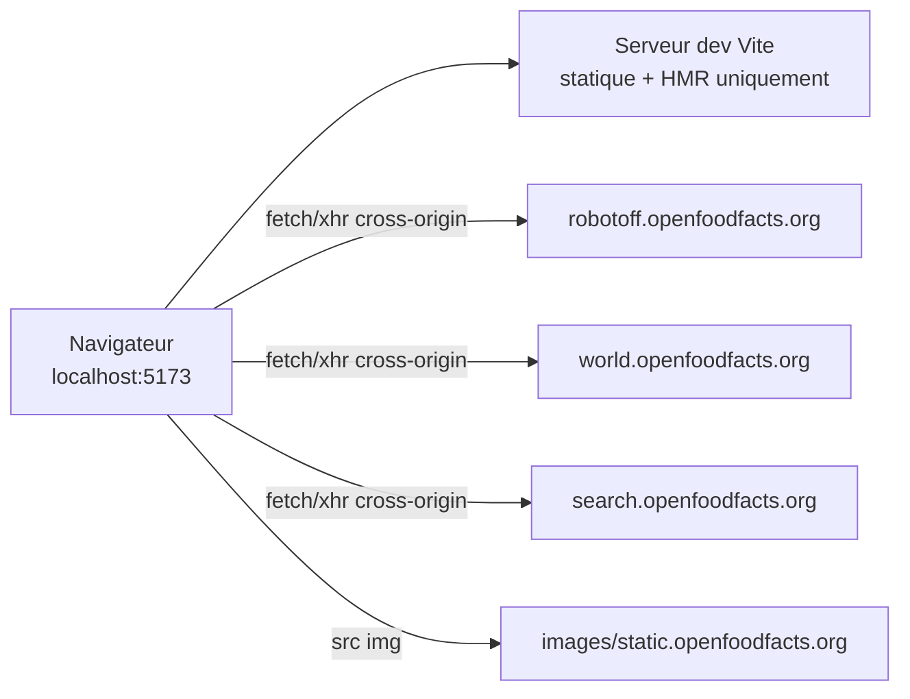

# Phase 12 — Exécution locale + investigation CORS

> **Open Food Facts Hunger Games — Onboarding contributeur**
>
> Suite de [Phase 11 — Algorithmes et transformations de données](./phase-11-algorithms-and-data-transformations.md)
>
> Preuves : `package.json`, `.nvmrc`, `.yarnrc.yml`, `vite.config.mjs`, `README.md`, `src/const.ts`, `src/App.jsx`, `src/off.ts`, `src/robotoff.ts`, `.github/workflows/ci-cd.yml`, `netlify.toml`, `yarn install` / `yarn dev` / `yarn build` en direct sur cette machine (sep. 2026), sondes CORS via `curl`, chargement navigateur de `/questions`.

---

## Ce que la phase 12 démontre

Jusqu'ici, l'onboarding était une **archéologie de code en lecture seule**. La phase 12 confirme :

1. Le dépôt **s'exécute sur votre machine**
2. Le mode dev communique avec les **API de production réelles** (pas de backend local, pas de proxy Vite)
3. **CORS + cookies** se comportent différemment sur `localhost:5173` vs `hunger.openfoodfacts.org`

**FAIT (cette session) :** `yarn dev` sert l'application sur `http://localhost:5173/` et `/questions` charge une question Robotoff en direct (libellé « Triman », barre latérale produit renseignée).

---

## Configuration locale — étapes vérifiées

### Prérequis

| Exigence | Source du dépôt | Cette machine (vérifié) |
|---|---|---|
| **Node** | `.nvmrc` → `24.12.0` | `v22.22.2` (fonctionne ; la CI utilise `.nvmrc`) |
| **Yarn** | `packageManager: yarn@4.18.0` | via `corepack prepare yarn@4.18.0 --activate` |
| **Gestionnaire de paquets** | Yarn 4, `nodeLinker: node-modules` | `.yarnrc.yml` |

**FAIT :** Le README renvoie encore vers la doc d'installation **Yarn classique** — obsolète par rapport au champ `packageManager`.

### Installation et exécution

```bash
cd hunger-games
corepack enable
corepack prepare yarn@4.18.0 --activate   # si yarn absent du PATH
yarn install
yarn dev
```

| Commande | Résultat (vérifié) |
|---|---|
| `yarn install` | 529 paquets, ~23 s, avertissements peer-dep (non bloquants) |
| `yarn dev` | Vite 8.2.2 prêt sur **`http://localhost:5173/`** |
| `yarn build` | Réussit → `dist/` (~482 kB chunk principal + routes lazy) |

### Optionnel

| Commande | Objectif |
|---|---|
| `yarn preview` | Servir le build de production en local |
| `yarn lint` | Prettier + ESLint (barrière CI) |
| `yarn knip` | Détection d'exports morts |

---

## README vs réalité — écarts de configuration

| Le README dit | Le code dit |
|---|---|
| Installation Yarn classique | **Yarn 4** via Corepack |
| Projet frère `openfoodfacts-js` | La dépendance est **`@openfoodfacts/openfoodfacts-nodejs`** |
| `yarn dev` seulement | Documenter aussi **`corepack`** pour la première configuration |

**INFÉRENCE :** Suivre `package.json` + le workflow CI plutôt que le README en cas de divergence.

---

## Configuration Vite — pas de proxy API

**FAIT** (`vite.config.mjs`) :

- `@vitejs/plugin-react`
- Copie les images webcomponent vers `/assets/webcomponents` au moment du dev/build
- **Pas de `server.proxy`** — le navigateur appelle `robotoff.openfoodfacts.org`, `world.openfoodfacts.org`, etc. **directement**



**À COMPRENDRE MAINTENANT :** Le dev local n'est pas un bac à sable — vous touchez **OFF/Robotoff de production** sauf si vous redirigez manuellement les constantes (non pris en charge nativement).

---

## Comportement réservé au dev (`import.meta.env.DEV`)

**FAIT** (`src/const.ts`, `src/App.jsx`, composants logo) :

| Comportement | Production | `yarn dev` |
|---|---|---|
| **`IS_DEVELOPMENT_MODE`** | `false` | `true` |
| **Porte de connexion** | `GET /cgi/auth.pl` + cookie de session | **Ignorée** — `isLoggedIn: true` toujours |
| **`URL_ORIGINE`** | `https://hunger.openfoodfacts.org` | `http://localhost:5173` |
| **Pages vues Matomo** | Suivies | **Désactivées** |
| **Mutations logo** (`updateLogo`, `annotateLogos`) | Envoyées à Robotoff | **Ignorées** dans certains composants quand `IS_DEVELOPMENT_MODE` |
| **`annotate()` Questions** | Envoyé | **Toujours envoyé** (non conditionné par le flag dev) |

**Piège :** Vous pouvez **annoter de vrais insights depuis localhost** alors que les écritures logo sont partiellement supprimées — asymétrie intentionnelle dans le code, facile à oublier.

---

## Cibles de déploiement (contexte pour la « production »)

| Chemin | Mécanisme |
|---|---|
| **Principal (CI)** | `.github/workflows/ci-cd.yml` → `yarn build` → `yarn deploy` → GitHub Pages |
| **`deploy.sh`** | Copie `index.html` vers `404.html`, shells HTML par route dans `dist/` |
| **`netlify.toml`** | Définit aussi `yarn build` → `dist` — **INCONNU** si encore actif vs GitHub Pages canonique |

**FAIT :** `homepage` dans `package.json` = `https://hunger.openfoodfacts.org/`

---

## Investigation CORS — méthodologie

Tests exécutés avec :

```bash
curl -sI -H "Origin: http://localhost:5173" -X GET "<url>"
curl -sI -H "Origin: https://hunger.openfoodfacts.org" -X GET "<robotoff-url>"
```

Plus `fetch(..., { credentials: 'include' })` navigateur vers Robotoff depuis `localhost:5173/questions` → **HTTP 200 OK**.

---

## Synthèse des résultats CORS

### Robotoff (`robotoff.openfoodfacts.org`)

**FAIT :** Renvoie l'origine demandante + autorise les credentials.

```http
access-control-allow-credentials: true
access-control-allow-origin: http://localhost:5173
```

(même schéma pour `Origin: https://hunger.openfoodfacts.org` → cette origine renvoyée)

| Conséquence |
|---|
| `fetch` SDK avec `credentials: "include"` **fonctionne depuis localhost** |
| Appels `axios` **sans** `withCredentials` fonctionnent toujours pour les lectures |
| POST d'annotation avec credentials **devrait fonctionner** en dev local |

**Vérifié :** GET `/api/v1/questions/?lang=en&count=1` depuis le navigateur sur localhost → **200**.

---

### API Open Food Facts (`world.openfoodfacts.org`)

**FAIT :** CORS wildcard sur les endpoints testés :

```http
access-control-allow-origin: *
access-control-allow-methods: HEAD, GET, PATCH, POST, PUT, OPTIONS
```

**Pas** de `access-control-allow-credentials: true` sur les réponses GET v0 ou PATCH v3.

| Config client dans HG | Interaction CORS + credentials |
|---|---|
| `off.getProduct` (axios, **sans** `withCredentials`) | **Fonctionne** — GET cross-origin simple |
| `off.setIngedrient` (axios PATCH, **sans** `withCredentials`) | **INFÉRENCE :** preflight réussit avec `*` — écritures possibles sans cookie |
| PATCH packaging (`withCredentials: true`) | **INFÉRENCE :** le navigateur peut **bloquer** — wildcard + credentials incompatibles |
| SDK `offClient` (`credentials: "include"`) | **INFÉRENCE :** peut échouer sur les lectures nécessitant un cookie — rarement utilisé sauf stats facettes |
| Auth `App.jsx` (`withCredentials: true`) | **Uniquement hors DEV** — ignoré en local |

**Règle CORS navigateur (FAIT) :** `Access-Control-Allow-Origin: *` **ne peut pas** être utilisé avec des requêtes credentialisées (`credentials: 'include'` / `withCredentials: true`).

---

### Autocomplétion recherche (`search.openfoodfacts.org`)

**FAIT :** GET renvoie `access-control-allow-credentials: true` (réflexion d'origine pas toujours visible en sonde HEAD seule ; GET depuis localhost fonctionne en pratique via `LabelFilter` / chargement de page).

---

### CDN statique (`static.openfoodfacts.org`, `images.openfoodfacts.org`)

**FAIT :** Chargé via `` ou axios GET — pas de preflight CORS pour les images ; JSON taxonomie récupéré cross-origin sans credentials dans `useOptions`.

---

## Carte des credentials — qui envoie des cookies ?

| Site d'appel | Credentials | Distant |
|---|---|---|
| `robotoffClient` / SDK annotate | `include` | Robotoff |
| `robotoff.questions` (axios) | défaut (omit) | Robotoff |
| `robotoff.updateLogo` | `withCredentials: true` | Robotoff |
| `off.getProduct`, `searchProducts` | omit | OFF |
| `off.setIngedrient` | omit | OFF v3 |
| PATCH packaging | `withCredentials: true` | OFF v3 |
| Nutrition `postRobotoff` | `withCredentials: true` | Robotoff |
| Auth `App.jsx` | `withCredentials: true` | OFF CGI (prod uniquement) |
| `LabelFilter` SearchApi | `fetch` simple | service search |

**INFÉRENCE :** L'application est **incohérente par conception/historique** — le chemin SDK Robotoff est credentialisé ; beaucoup de lectures axios sont anonymes.

---

## Cookies de session sur localhost

```mermaid
sequenceDiagram
    participant U as Vous
    participant HG as localhost:5173
    participant OFF as world.openfoodfacts.org

    Note over U,OFF: Chemin production
    U->>OFF: Connexion (pose cookie de session sur .openfoodfacts.org)
    U->>HG: Ouvrir hunger.openfoodfacts.org
    HG->>OFF: requêtes credentialisées (écosystème quasi same-site)

    Note over U,OFF: Chemin localhost
    U->>OFF: Connexion sur world.openfoodfacts.org
    U->>HG: Ouvrir localhost:5173
    Note over HG: DEV : ignore la vérification auth.pl
    HG->>OFF: cookie peut NE PAS être envoyé (contexte tiers)
    HG->>Robotoff: annotate peut toujours fonctionner (CORS Robotoff autorise l'origine localhost)
```

**FAIT :** Le domaine du cookie de session OFF est **`openfoodfacts.org`** — non partagé en first-party sur `localhost`.

**FAIT :** Le mode dev **n'exige pas la connexion** pour la plupart des routes ; les routes logo vérifient encore `isLoggedIn` mais le dev le force à `true`.

**Pour tester une vraie auth en local (INFÉRENCE) :**

1. Lancer `yarn preview` ou servir le build depuis un hostname sous `openfoodfacts.org` (config mainteneur), **ou**
2. Désactiver temporairement le bypass auth dev (non documenté — modification de code), **ou**
3. Tester les écritures sur l'URL de **production** après déploiement PR

**FAIT :** La route interne **`/bugs`** (`BugPage`) exerce PATCH/POST OFF v3 avec `withCredentials: true` — débogueur CORS/auth manuel pour les mainteneurs.

---

## Service worker — pas un cache API

**FAIT** (`public/serviceWorker.js`) :

- Intercepte uniquement les GET `navigate` **same-origin**
- Met en cache `index.html` + `offline.html`
- **Ne met pas** en cache les réponses API Robotoff/OFF

**INFÉRENCE :** Données API obsolètes en dev = TanStack Query / cache navigateur — pas le service worker.

---

## Checklist de test de fumée local

Après `yarn dev` :

| Étape | URL / action | Attendu |
|---|---|---|
| 1 | `http://localhost:5173/` | Accueil charge, pas d'écran blanc |
| 2 | `/questions` | Carte question + Oui/Non/Passer (UI française si langue navigateur FR) |
| 3 | DevTools → Network | Requêtes vers `robotoff.openfoodfacts.org` **200** |
| 4 | DevTools → Network | `world.openfoodfacts.org/api/v0/product/...` **200** |
| 5 | Répondre à une question | File avance ; POST annotate vers Robotoff (vérifier Network) |
| 6 | `/logos` | Page charge (bypass connexion dev) |
| 7 | `yarn build && yarn preview` | Bundle production sert les mêmes routes |

**ATTENTION :** L'étape 5 modifie des **vraies** données Robotoff/OFF si annotate réussit — utiliser Passer ou un filtre jetable en dev si vous préférez ne pas contribuer depuis localhost.

---

## Bruit console en dev (sans gravité)

**FAIT (observé au chargement `yarn dev`) :**

- `reactour` → avertissement strict-mode `UNSAFE_componentWillReceiveProps`
- Avertissements prop inconnue `styled-components` sur l'overlay tour
- Log de chargement webcomponents depuis `OffWebcomponentsConfiguration`

Pas bloquants pour le développement local.

---

## Avertissements peer dependency à l'installation

**FAIT :** `yarn install` signale des écarts peer (`reactour` vs React 19, `eslint` 10 vs plugins, etc.). Build et dev **réussissent toujours**.

La CI utilise `yarn install --immutable` — committer les changements de lockfile avec les mises à jour de dépendances.

---

## localhost vs production — matrice pratique

| Préoccupation | `localhost:5173` (dev) | `hunger.openfoodfacts.org` |
|---|---|---|
| Endpoints API | URLs de production | URLs de production |
| Vérification auth | Contournée | Session OFF via cookie |
| Lectures Robotoff | Fonctionne | Fonctionne |
| Annotate Robotoff | Fonctionne (GET vérifié ; POST credentialisé) | Fonctionne |
| Lectures produit OFF | Fonctionne | Fonctionne |
| PATCH OFF credentialisé | **Peu fiable** (CORS `*` + cookies) | **INFÉRENCE :** mieux une fois connecté sur OFF |
| APIs d'écriture logo | **Supprimées** quand `IS_DEVELOPMENT_MODE` | Actives une fois connecté |
| Matomo | Désactivé | Activé |
| Liens `URL_ORIGINE` | Pointent vers localhost | Pointent vers HG production |

---

## Protection de l'espace mental

### À COMPRENDRE MAINTENANT

1. **Pas de backend, pas de proxy** — le dev local est une SPA statique frappant les API prod.
2. **CORS Robotoff est localhost-friendly** — renvoie l'origine + credentials.
3. **CORS OFF utilise `*`** — OK pour lectures anonymes ; écritures credentialisées depuis localhost délicates.
4. **`IS_DEVELOPMENT_MODE` simule la connexion** — la porte logo passe ; auth.pl non appelé.
5. **Annoter depuis le dev peut affecter de vraies données** — le jeu Questions n'est pas mocké.

### UTILE PLUS TARD

- Page `/bugs` pour expériences API v3 manuelles
- `corepack` + Node 24 depuis `.nvmrc` pour parité CI
- `yarn preview` pour test local du bundle prod
- Fallbacks HTML GitHub Pages `deploy.sh` pour routes client-side

### IGNORER POUR L'INSTANT

- Mettre en place des instances Robotoff/OFF locales
- Configuration proxy Vite (n'existe pas)
- Débat Netlify vs GitHub Pages

---

## Synthèse phase 12 — cinq points à retenir

1. **`corepack` + Yarn 4.18.0 + `yarn dev`** → `http://localhost:5173`.
2. **Vérifié fonctionnel :** la page Questions charge des données Robotoff + produit OFF en direct depuis localhost.
3. **Robotoff autorise le cross-origin credentialisé depuis localhost** — en-tête ACAO renvoyé.
4. **OFF utilise CORS wildcard** — lectures anonymes OK ; PATCH credentialisé depuis localhost est le combo risqué.
5. **Mode dev ≠ bac à sable sûr** — API réelles, garde-fous d'écriture partiels uniquement sur certains chemins logo.

### Incertitudes

- **INCONNU :** Si le déploiement Netlify est encore utilisé aux côtés de GitHub Pages.
- **INFÉRENCE :** Écritures packaging/nutrition depuis localhost peuvent échouer silencieusement ou dans l'onglet Network jusqu'à connexion sur un hôte OFF same-origin.
- **FAIT :** Cette session a utilisé Node 22 ; la CI attend Node 24 selon `.nvmrc`.

---

## Et ensuite

**Phase 13 — Parcours navigateur ↔ code**

Avec l'application en cours d'exécution, parcourir `/questions` dans DevTools : un changement de filtre, une récupération de question, une réponse — en reliant les entrées du panneau Network aux fichiers et fonctions exacts des phases 7–11.

---

*Arrêtez-vous ici. Lancez `yarn dev`, ouvrez `/questions`, et gardez l'onglet Network de DevTools ouvert — vous avez maintenant assez de contexte CORS pour interpréter ce qui réussit et ce qui échoue mystérieusement. Passez à la phase 13 quand vous êtes prêt.*
