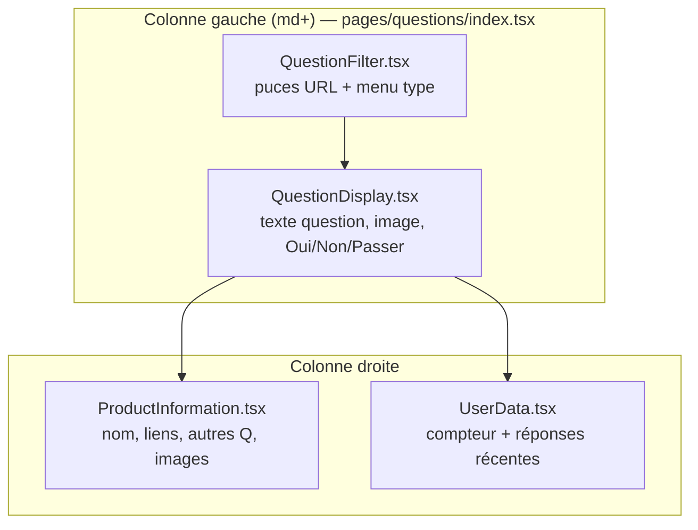
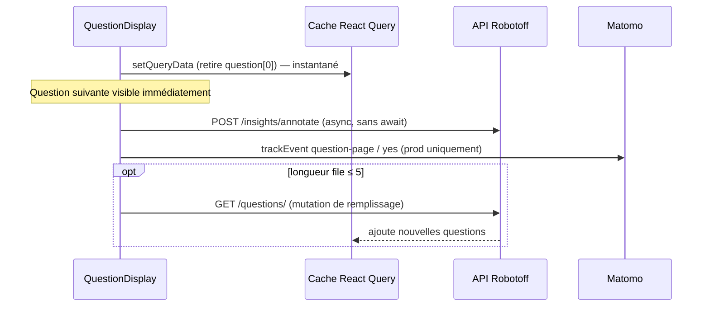

# Phase 13 — Parcours navigateur ↔ code

> **Open Food Facts Hunger Games — Onboarding contributeur**
>
> Suite de [Phase 12 — Exécution locale + CORS](./phase-12-run-locally-and-cors.md)
>
> Preuves : `/questions?type=label&sorted=true` en direct sur `localhost:5173` (sep. 2026), `QuestionDisplay.tsx`, `ProductInformation.tsx`, `useQuestions.ts`, `useProduct.ts`, `ProductOtherQuestions.tsx`, `CroppedLogo.tsx`, `QuestionFilter.tsx`, traces des phases 7–11.

---

## Objectif de cette phase

La phase 7 expliquait **l'ordre d'exécution dans le code**. La phase 13 relie cela à **ce que vous voyez dans Chrome DevTools** en utilisant `/questions` — pour qu'une ligne Network devienne un chemin de fichier dans votre tête.

**Prérequis :** `yarn dev` en cours d'exécution, application ouverte sur `http://localhost:5173/questions`.

---

## Configuration DevTools (à faire une fois)

1. Ouvrir **DevTools** → **Network**
2. Cocher **Preserve log** (survit aux re-renders React / navigations douces)
3. Filtre : **`Fetch/XHR`** pour les appels API ; désactiver le filtre pour voir aussi les chargements **Img** CDN
4. Filtre optionnel : `robotoff` ou `openfoodfacts`

**Colonnes utiles à activer :** Name, Status, Type, Initiator, Size, Time.

**FAIT :** Hunger Games n'a **pas de panneau React Query Devtools** branché — l'état du cache est invisible sauf inférence par le comportement ou ajout du plugin vous-même.

---

## Disposition de la page ↔ composants React

Quand une question est à l'écran, l'UI correspond aux fichiers ainsi :



| Ce que vous voyez | Composant | Hook clé |
|---|---|---|
| « Ne montre que » / menu type d'insight | `QuestionFilter.tsx` | lit `getFilterParams(searchParams)` |
| Texte de question + image principale | `QuestionDisplay.tsx` | `useQuestions(filterState)` |
| Boutons Oui / Non / Passer | `QuestionAnswerButtons` dans le même fichier | `answerQuestion` |
| « Questions restantes : 100+ » | `UserData.tsx` | `useQuestions()` → `questionsCount` |
| Nom produit + Voir/Modifier | `ProductInformation.tsx` | `useProductData(barcode)` |
| « Autres questions » | `ProductOtherQuestions.tsx` | `useProductQuestions(barcode)` |
| Petit logo en overlay (desktop) | `CroppedLogo.tsx` | `insightDetail` + crop `` |

**FAIT :** `QuestionDisplay`, `ProductInformation` et `UserData` appellent chacun **`useQuestions()`** — ils partagent un cache React Query (fetch dédupliqué).

---

## Parcours A — Chargement initial de la page

**Exemple d'URL :** `/questions?type=label&sorted=true`

### Chronologie (ce qui se passe dans l'ordre)

| Étape | Visible utilisateur | Chemin code | Network (typique) |
|---|---|---|---|
| **A1** | Vide → shell app | `index.tsx` → `App.jsx` → lazy `pages/questions/index.tsx` | modules JS `localhost` (Vite) |
| **A2** | Barre filtre affiche `label` | `QuestionFilter` lit URL → `getFilterParams` | *(pas d'API)* |
| **A3** | Spinner « Veuillez patienter… » | `useQuestions` → `useQuery` pending | — |
| **A4** | Question apparaît | `robotoff.questions()` résout | **GET** `robotoff.openfoodfacts.org/api/v1/questions/?...` |
| **A5** | Nom produit se remplit | `useProductData(barcode)` | **GET** `world.openfoodfacts.org/api/v0/product/{barcode}.json?fields=...` |
| **A6** | Image principale charge | `question.source_image_url` sur `` | **GET** `images.openfoodfacts.org/...` (souvent `.400.jpg`) |
| **A7** | « Autres questions » barre latérale | `useProductQuestions` | **GET** SDK Robotoff `questionsByProductCode` |
| **A8** | Petit logo bas-droite (desktop) | effet `CroppedLogo` | **GET** `.../insights/detail/{insight_id}` peut-être **GET** `.../images/logos?logo_ids=` puis **GET** `.../images/crop?...` |
| **A9** | Script Matomo | `MatomoProvider` au mount | **GET** `analytics.openfoodfacts.org/matomo.js` |

**FAIT (Phase 12) :** En `yarn dev`, **les pages vues Matomo ne sont pas envoyées** (`App.jsx` ignore `trackPageView` quand `IS_DEVELOPMENT_MODE`). Le script peut quand même charger.

### Décoder la requête Questions principale

**Chaîne Initiator :**

```text
useQuestions.ts → useQuery queryFn → robotoff.questions()
  → axios.get(`${ROBOTOFF_API_URL}/questions/`, { params })
```

**Paramètres de requête à reconnaître dans Network :**

| Param | Source |
|---|---|
| `insight_types` | URL `type=label` |
| `order_by` | `popularity` (car `sorted` ≠ `false`) |
| `lang` | `getLang()` — navigateur / localStorage / `?language=` |
| `count` | `20` (défaut `pageSize`) |
| `with_image` | `true` |
| `value_tag`, `brands`, `countries`, … | uniquement si définis dans l'URL |

**Transformation avant le fil :** `value_tag` / `brands` passent par **`reformatValueTag`** (Phase 11).

**Forme de réponse :** `{ count, questions: [...] }` — l'UI utilise **`questions[0]`** uniquement au départ.

---

## Parcours B — Changer un filtre

**Action :** Dans la barre de filtre, changer le type d'insight de `label` à `brand`.

| Étape | Ce qui change | Code |
|---|---|---|
| **B1** | URL met à jour `?type=brand&...` | `QuestionFilter` → `setSearchParams` |
| **B2** | Nouvelle clé React Query | `getQuestionKeys` — premier segment après `"questions"` change |
| **B3** | Nouveau fetch (dédupliqué) | `useQuestions` `queryFn` → `robotoff.questions()` à nouveau |
| **B4** | UI repasse en chargement → nouvelle question | branche `question === null && status === pending` |

**Vérification DevTools :**

- Nouveau **GET** `/questions/` avec `insight_types=brand`
- L'entrée cache ancienne **reste en mémoire** (non invalidée) — revenir à l'URL précédente pour revoir la file si encore chaude

**Ouvrir le dialogue Filtre** (`FilterDialog.tsx`) : applique une mise à jour groupée via le **setter `useFilterState`** → même mécanisme URL que les puces.

---

## Parcours C — Répondre « Oui »

**Action :** Cliquer **Oui** (ou appuyer sur `o` en FR / `y` en EN).

### Ordre Network (important)



| # | Requête | Quand | Code |
|---|---|---|---|
| **C1** | *(aucune requise pour la mise à jour UI)* | **Immédiat** | `answerQuestion` → `setQueryData` |
| **C2** | **POST** `robotoff.../insights/annotate` | Millisecondes après le clic | `robotoff.annotate` via SDK `fetch` + `credentials: include` |
| **C3** | **GET** `/questions/` | Uniquement si file ≤ 5 et le serveur en a plus | mutation de remplissage dans `useQuestions.ts` |
| **C4** | **GET** `/product/{newBarcode}.json` | Quand le code-barres de tête change | `useProductData` |
| **C5** | Nouvelles requêtes **img** | Nouveau `source_image_url` | `<QuestionImage>` |

**Corps annotate (SDK) :** `insight_id`, `annotation: 1`, `update: 1`.

**Ce que DevTools ne montrera PAS :**

- Pas d'appel « toast succès » — échecs uniquement **`console.error`**
- Pas de requête de rollback si annotate échoue

**`UserData` barre latérale :** après Oui/Non (pas Passer), le cache **`recent-answers`** préfixe localement — **pas de HTTP**.

---

## Parcours D — File vide

Quand le tableau `questions` est vide après succès :

| UI | Composant |
|---|---|
| « Aucune question restante » + tags similaires | `SimilarQuestions.tsx` |
| Récupération parent/enfant taxonomie | **GET** `world.openfoodfacts.org/api/v2/taxonomy?...` via `getTaxonomy` |

Déclenché depuis `QuestionDisplay` quand `question === null && status !== pending && !== error`.

---

## Catalogue Network — table de référence `/questions`

| Motif de requête | Type | Fichier déclencheur | Objectif |
|---|---|---|---|
| `/api/v1/questions/?` | xhr/fetch | `useQuestions.ts` | File principale |
| `/api/v0/product/{code}.json` | xhr | `useProduct.ts` | Contexte produit barre latérale |
| `/questions/{barcode}` (SDK) | fetch | `useProductQuestions.ts` | Liste autres questions |
| `/insights/detail/{id}` | fetch | `CroppedLogo.tsx`, `DebugQuestion.tsx` | Métadonnées bbox logo |
| `/images/logos?logo_ids=` | xhr | `CroppedLogo.tsx` | Bbox de repli |
| `/images/crop?` | img | `CroppedLogo`, jeux logo | Aperçu recadré |
| `images.openfoodfacts.org/...` | img | `source_image_url`, `getImagesUrls` | Photos |
| `/api/v2/taxonomy?` | xhr | `SimilarQuestions.tsx` | Suggestions état vide |
| `search.openfoodfacts.org/autocomplete` | fetch | `LabelFilter.tsx` | Saisie dialogue filtre (≥2 car.) |
| `analytics.openfoodfacts.org/matomo` | script/img | `MatomoProvider` | Analytics |

**Pas au chargement page Questions :** PATCH OFF v3, recherche packaging, prédiction ingrédient — autres routes.

---

## Colonne Initiator — comment trouver le fichier source

1. Cliquer la ligne Network → onglet **Initiator**
2. Pour axios : la pile montre souvent `robotoff.ts` → `useQuestions.ts`
3. Pour SDK fetch : `@openfoodfacts/openfoodfacts-nodejs` → `robotoff.ts`
4. Pour images : initiator est **Parse HTML** ou **commit React** — remonter depuis le composant :
   - Image principale → `QuestionDisplay` → `question.source_image_url`
   - Vignettes galerie → `ProductInformation` → `getImagesUrls`

**Modules Vite** (`/@fs/`, `/src/`) sont du HMR local — ignorer pour déboguer les bugs API.

---

## Éléments ↔ attributs data (carte mentale)

| Élément | Champ source de données |
|---|---|
| Titre question | `question.question` |
| Puce / lien valeur | `question.value`, `question.value_tag` |
| URL image principale | `question.source_image_url` (fourni par Robotoff, pas JSON produit OFF) |
| Vignette logo référence | `question.ref_image_url` |
| Compteur restant | `data.count` de l'API questions (affichage plafonné « 100+ ») |
| Titre produit | `product.product_name` depuis OFF v0 |

**Accordéon debug** (personnalisation dev) : `DebugQuestion.tsx` → requête `["insight-details", insightId]`.

---

## Chemin clavier (identique au clic)

**Fichier :** `useKeyboardShortcuts.ts` → `getShortcuts()` depuis `l10n-shortcuts.ts`

| Locale | Oui | Non | Passer |
|---|---|---|---|
| EN | `y` | `n` | `k` |
| FR | `o` | `n` | `k` |

Raccourcis **désactivés** quand le focus est dans INPUT / TEXTAREA / SELECT.

Résultat Network **identique** au clic bouton — même `answerQuestion`.

---

## Barre latérale produit — fetches parallèles par question

Quand code-barres = `X`, attendez **jusqu'à trois lectures Robotoff/OFF** :

```text
1. useQuestions        → question déjà disponible
2. useProductData(X)   → produit OFF v0
3. useProductQuestions(X) → questions Robotoff par produit
4. CroppedLogo         → insightDetail(insight_id de X)  [desktop]
```

**FAIT :** `ProductOtherQuestions` garde un **état React local** pour les réponses en attente — envoyer une réponse barre latérale déclenche **un autre** POST `annotate` mais **ne retire pas** les éléments du cache de la file principale.

---

## Exercices de débogage guidés

À faire vous-même avec Network + Sources ouverts :

### Exercice 1 — Filtre → clé → URL

1. Définir l'URL sur `/questions?type=category&value_tag=en:organic&country=fr`
2. Trouver les params GET `/questions/` : `insight_types=category`, `value_tag=...` (reformaté), `countries=fr`
3. Dans Sources, poser un breakpoint dans `getFilterParams` — recharger, confirmer le parsing URL

### Exercice 2 — Réponse optimiste

1. Limiter Network à **Slow 3G**
2. Cliquer **Passer**
3. **Observer :** l'UI avance **avant** la fin du POST annotate
4. Breakpoint dans `useQuestions.ts` dans le callback `setQueryData`

### Exercice 3 — Remplissage

1. Filtrer un tag étroit avec peu de questions ; répondre jusqu'à file petite
2. Surveiller un **second** GET `/questions/` sans rechargement complet
3. Faire correspondre à la garde `mutation.mutate(keys)` (`length <= 5`)

### Exercice 4 — Annotate échoué

1. Bloquer `robotoff.openfoodfacts.org` dans **Request blocking** Network (un onglet)
2. Répondre à une question — l'UI avance toujours
3. Console : `Error while answering question`

---

## Différences production vs localhost (DevTools)

| Signal | `yarn dev` | Production |
|---|---|---|
| Requête `auth.pl` au chargement | **Absente** | Présente quand le cookie change |
| Matomo `trackPageView` | **Ignoré** | Au changement de route |
| Matomo `trackEvent` à la réponse | Déclenché si script chargé | Déclenché |
| POST annotate | **Réel** | Réel |
| Chemins Initiator | sources `.tsx` | `assets/*.js` bundlé |

---

## Explications courantes « Network semble incorrect »

| Symptôme | Cause probable | Où regarder |
|---|---|---|
| Deux `/questions/` identiques au chargement | double mount Strict Mode **ou** deux composants montant la même requête | React 19 StrictMode ; dédupe normale |
| `/questions/` mais UI vide | `questions: []` renvoyé | Essayer filtre plus large ; voir `SimilarQuestions` |
| Produit 404 dans Network | Code-barres invalide sur la question | `useProduct` lève ; squelette barre latérale |
| Erreur CORS sur PATCH OFF | Pas page Questions — mauvaise route | Matrice phase 12 |
| annotate 401/403 | Non connecté session Robotoff/OFF | Attendu pour éditions attribuées ; pas de rollback UI |
| Images 404 | Mauvais `source_image_url` ou chemin CDN | Comparer avec chemins `getFormatedBarcode` |

---

## Protection de l'espace mental

### À COMPRENDRE MAINTENANT

1. **Un GET `/questions/`** par clé de filtre — pilote toute la page.
2. **Réponse = cache d'abord, réseau ensuite** — annotate est fire-and-forget.
3. **L'URL image principale vient de la question Robotoff**, le fetch produit OFF est séparé.
4. **Plusieurs hooks partagent le cache `useQuestions`** — le compteur barre latérale correspond à la colonne principale.
5. **Initiator + params URL de requête** suffisent pour localiser le fichier responsable dans la plupart des cas.

### UTILE PLUS TARD

- Trafic `insightDetail` supplémentaire `CroppedLogo` desktop uniquement
- `/questions/?count=1` supplémentaire `usePotentialQuestionNumber` quand badge activé
- Request blocking pour tests de mode échec

### IGNORER POUR L'INSTANT

- Web Vitals (`reportWebVitals.ts`) — pas central au flux d'annotation
- Service worker — shell hors ligne navigation uniquement

---

## Synthèse phase 13 — cinq points à retenir

1. **Changement URL filtre → nouvelle clé requête → nouveau GET `/questions/`**.
2. **Changement code-barres → nouveau GET produit OFF v0**.
3. **Clic Oui → UI instantanée via `setQueryData`, POST annotate async**.
4. **Autres questions barre latérale = endpoint Robotoff séparé + état local**.
5. **Initiator DevTools + cette table ≈ stack trace pour contributeurs frontend**.

---

## Et ensuite

**Phase 14 — Une expérience d'apprentissage contrôlée**

Un petit changement de code approuvé par vous (ex. logging, tweak UI, ou correction filtre) pour pratiquer la boucle complète édition → lint → vérification navigateur — uniquement après votre approbation explicite de modifier le dépôt.

---

*Arrêtez-vous ici. Avec DevTools ouvert sur `/questions`, répondez à une question et nommez trois lignes Network sans regarder ce doc. Si vous y arrivez, les phases 7–12 sont intégrées. Passez à la phase 14 uniquement quand vous voulez des changements de code pratiques.*
