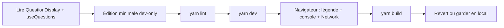

# Phase 14 — Expérience d'apprentissage contrôlée

> **Open Food Facts Hunger Games — Onboarding contributeur**
>
> Suite de [Phase 13 — Parcours navigateur ↔ code](./phase-13-browser-code-walkthrough.md)
>
> C'est la **première phase qui modifie le code applicatif** — volontairement petite, réservée au dev, et réversible.

---

## Objectif

Les phases 1–13 ont construit un modèle mental **sans toucher au dépôt**. La phase 14 exécute une **boucle contributeur bout en bout** :

```text
lire le code → petit changement → yarn lint → yarn dev → vérification navigateur → (optionnel) revert
```

Le changement **n'est pas destiné à être fusionné upstream** — il existe pour que vous pratiquiez la mémoire musculaire avant les vrais tickets.

---

## Expérience choisie : bandeau debug question réservé au dev

### Pourquoi cette expérience

| Critère | Comment cette expérience s'y prête |
|---|---|
| Touche la **colonne vertébrale Questions** | `QuestionDisplay.tsx` + `useQuestions.ts` |
| Correspond à la phase 13 | Vous voyez `insight_id` à l'écran en faisant correspondre le POST annotate Network |
| **Zéro impact production** | Conditionné par `IS_DEVELOPMENT_MODE` (`import.meta.env.DEV`) |
| Petit diff | ~15 lignes sur 2 fichiers |
| Revert facile | Supprimer les blocs ajoutés |

### Ce qui a été ajouté (FAIT — dans votre working tree)

**1. `src/pages/questions/QuestionDisplay.tsx`**

Sous l'image de question, en dev uniquement :

```text
dev: {insight_id} · {barcode}
```

Légende monospace — corrèle UI ↔ payload annotate Robotoff.

**2. `src/hooks/useQuestions.ts`**

À chaque réponse en dev :

```javascript
console.info("[hunger-games] answerQuestion", { insight_id, answer, barcode })
```

Corrèle clic → mise à jour cache optimiste → POST en arrière-plan.

---

## Votre checklist de parcours

### 1. Confirmer le diff

```bash
git diff src/pages/questions/QuestionDisplay.tsx src/hooks/useQuestions.ts
```

Vous ne devriez voir que les imports `IS_DEVELOPMENT_MODE` et les ajouts debug.

### 2. Lint

```bash
yarn lint
```

**Attendu :** passe (ou corriger les détails Prettier/ESLint avant de continuer).

### 3. Lancer le dev

```bash
yarn dev
```

Ouvrir : `http://localhost:5173/questions?type=label`

### 4. Vérification visuelle

| Vérification | Attendu |
|---|---|
| Légende debug visible | `dev: <uuid> · <barcode>` sous l'image |
| Légende masquée sur `yarn preview` / build prod | `IS_DEVELOPMENT_MODE === false` |

### 5. Vérification Console + Network

1. DevTools → **Console** — filtrer `hunger-games`
2. DevTools → **Network** → preserve log
3. Cliquer **Oui** / **Yes**

| Signal | Ordre attendu |
|---|---|
| Log Console `answerQuestion` | **Immédiatement** avec le bon `insight_id` |
| UI passe à la question suivante | **Avant** la fin d'annotate |
| POST Network `.../insights/annotate` | Même `insight_id` que log + légende |
| Log Console sur question suivante | Nouveau `insight_id` |

**Vous venez de vérifier la file optimiste de la phase 7 avec votre propre instrumentation.**

### 6. Test de fumée build

```bash
yarn build
```

Garantit que TypeScript + Vite compilent toujours. L'UI debug ne doit **pas** apparaître dans le comportement `dist/` (bundle prod a `DEV=false`).

---

## Revert une fois l'apprentissage terminé

```bash
git checkout -- src/pages/questions/QuestionDisplay.tsx src/hooks/useQuestions.ts
```

Ou garder les aides debug en local sur une branche personnelle — **ne pas ouvrir de PR** avec logging dev-only vers upstream sauf demande des mainteneurs.

---

## Ce que vous avez pratiqué



| Compétence | Où |
|---|---|
| Trouver le chemin réponse | `QuestionAnswerButtons` → `answerQuestion` |
| Conditionnement dev | `IS_DEVELOPMENT_MODE` depuis `const.ts` |
| UX optimiste | Log avant la fin du POST |
| Discipline ID | `insight_id` ≠ `barcode` |
| Barrière qualité | `yarn lint` avant de partager le travail |

---

## Expériences alternatives (si vous voulez plus de pratique)

Choisir **une** — même boucle, ne pas tout empiler :

| Expérience | Fichier | Apprentissage |
|---|---|---|
| Logger les **erreurs** annotate vers snackbar UI | `useQuestions.ts` | Gestion d'erreurs (touche le comportement produit — en discuter d'abord) |
| Afficher la clé de requête dans la légende dev | `useQuestions.ts` | Clés cache phase 10 |
| Corriger lien facette pour utiliser `reformatValueTag` | `questions/utils.ts` | Cohérence transform phase 11 |
| Ajouter `enabled: question?.barcode` à la requête produit | `useProduct.ts` | Gardes TanStack Query |

---

## Pièges courants (cette expérience)

| Problème | Cause |
|---|---|
| Pas de légende | Pas en `yarn dev` (utilise preview/build prod) |
| Pas de log console | Console filtrée ; ou clic dans champ input (raccourcis bloqués aussi) |
| Lint échoue | Lancer `yarn prettier` sur les fichiers touchés |
| `insight_id` ne correspond pas à Network | Répondu trop vite — utiliser Preserve log, comparer le dernier POST |

---

## Protection de l'espace mental

### À COMPRENDRE MAINTENANT

1. **`insight_id`** est ce que Robotoff annotate envoie — pas le code-barres.
2. **Les gardes dev-only** utilisent `IS_DEVELOPMENT_MODE`, pas le toggle devMode utilisateur.
3. **Lint + build** sont la barre minimale avant toute vraie PR.
4. **Ce diff est un échafaudage d'apprentissage** — revert avant les PR de contribution sauf intention contraire.

### IGNORER POUR L'INSTANT

- Ouvrir une PR pour ce bandeau debug
- Hooks pre-commit Husky (s'exécutent automatiquement au commit)
- Traduire les chaînes debug en i18n

---

## Synthèse phase 14

1. Vous avez exécuté une boucle **vraie édition → lint → dev → vérification**.
2. Légende dev + log console **prouvent** le flux de réponse optimiste.
3. Les builds production **excluent** l'UI debug.
4. Revert avec `git checkout --` une fois terminé.
5. Prêt pour la **phase 15** (réalité tests/CI) sans avoir besoin de fusionner ce changement.

---

## Et ensuite

**Phase 15 — Réalité tests et CI**

Ce que `yarn lint`, GitHub Actions et Knip imposent réellement — et ce que Hunger Games **ne teste pas** automatiquement.

---

*Arrêtez-vous ici. Complétez la checklist ci-dessus sur votre machine. Revertez l'expérience quand vous n'avez plus besoin des aides debug, puis passez à la phase 15.*
