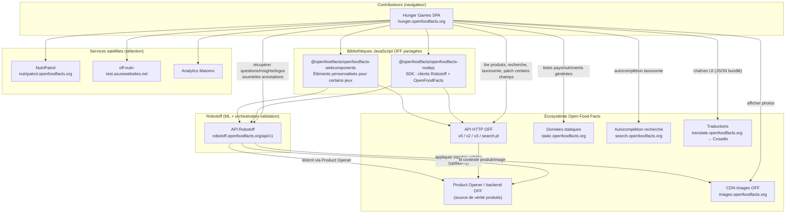

# Phase 2 — L'écosystème Open Food Facts

> **Open Food Facts Hunger Games — Onboarding contributeur**
>
> Suite de [Phase 1 — Quel problème concret Hunger Games résout-il ?](./phase-1-real-world-problem.md)
>
> Sources de preuves : `src/const.ts`, `src/robotoff.ts`, `src/off.ts`, `src/offSearch.ts`, `src/offTaxonomy.ts`, `src/components/OffWebcomponents.tsx`, `package.json`, `README.md`, `.github/workflows/ci-cd.yml`, `.github/workflows/crowdin.yml`, [Robotoff API Reference](https://openfoodfacts.github.io/robotoff/references/api/).

---

## La phrase à retenir en premier

> **Hunger Games est un frontend navigateur. Il lit depuis Open Food Facts et Robotoff, envoie des jugements humains surtout à Robotoff, et écrit parfois directement des champs produit dans Open Food Facts — mais il ne possède jamais la base produit ni le pipeline ML.**

Si la Phase 1 vous a enseigné l'histoire humain-dans-la-boucle, la Phase 2 vous enseigne **où sont les murs**.

---

## Diagramme de contexte système



### Comment lire ce diagramme

- **Les flèches pleines depuis Hunger Games** sont des appels HTTP runtime que l'app fait aujourd'hui (directement ou via SDK/webcomponents).
- **Robotoff → Product Opener** est le chemin aval critique pour les insights ML validés. Hunger Games ne se trouve pas sur cette flèche ; il s'arrête à Robotoff pour la plupart des jeux d'annotation.
- **Les bibliothèques partagées** ne sont pas des serveurs séparés. Ce sont des paquets npm que Hunger Games importe ; ils appellent toujours les mêmes API distantes.
- **Les services satellites** n'apparaissent que dans des mini-jeux spécifiques (extraction table nutrition, signalement d'images). Ils font partie de l'écosystème étendu mais pas du flux Questions central.

---

## Les trois systèmes — et où Hunger Games s'arrête

| Système | Ce que c'est | Source de vérité pour… | Relation Hunger Games |
|---|---|---|---|
| **Open Food Facts (Product Opener + DB)** | Base produit collaborative | Fiches produit publiées, métadonnées images, taxonomies stockées sur les produits | **Lit** massivement ; **écrit** dans certains jeux (ingrédients, emballage) |
| **Robotoff** | Inférence ML + API insight/question/annotation | Cycle de vie insight, votes annotation, détections logo, sorties prédicteur | **Lit** questions/insights/logos ; **écrit** annotations (chemin validation principal) |
| **Hunger Games** | SPA React (ce dépôt) | Rien de faisant autorité — seulement état UI et caches | **Consommateur** des API OFF + Robotoff |

### Affirmations de frontière (à mémoriser)

> **Hunger Games n'est pas Robotoff.**  
> Il n'exécute pas les prédicteurs, ne stocke pas les insights, ne décide pas des seuils de vote.

> **Hunger Games n'est pas le backend Open Food Facts.**  
> Il n'héberge pas les données produit. Au maximum il envoie des modifications via les API OFF ou via le pipeline annotate→update de Robotoff.

> **Hunger Games est une application frontend dans un écosystème plus large.**  
> Son rôle est de présenter les données Robotoff/OFF et de renvoyer rapidement les décisions humaines.

---

## Analyse dépendance par dépendance

Pour chaque intégration : **source de vérité**, **direction d'appel**, **données traversant la frontière**, et **ce que Hunger Games est autorisé à faire**.

---

### 1. API Robotoff

**FAIT** (`src/const.ts`) : URL de base `https://robotoff.openfoodfacts.org/api/v1`

**Wrapper :** `src/robotoff.ts`

| Aspect | Détail |
|---|---|
| **Source de vérité** | Robotoff possède insights, questions, annotations logo, métadonnées prédicteur, statut annotation |
| **Qui appelle qui** | Hunger Games → Robotoff (toujours). Robotoff → backend OFF lors de l'application d'insights confirmés |
| **Lectures principales** | `/questions/`, `/insights/`, recherche/chargement/recadrage logo, détail insight, statistiques utilisateur, comptages non répondus |
| **Écritures principales** | `/insights/annotate` (via SDK `annotate`, axios `post`, endpoints annotate logo) |
| **Rôle HG** | **Annoter** (chemin principal). **Afficher** seulement — ne génère jamais d'insights |

**FAIT :** La plupart des validations binaires utilisent :

```typescript
robotoffClient.annotate({ insight_id, annotation, update: 1 })
```

**FAIT :** Le jeu nutrition utilise un annotate plus riche avec `annotation=2` et JSON `data` (`src/pages/nutrition/utils.ts`).

**INFÉRENCE :** Robotoff est l'**orchestrateur de validation**. OFF reste la **fiche produit publiée**.

---

### 2. API HTTP Open Food Facts

**FAIT** (`src/const.ts`) :

| Constante | URL | Usage typique dans le dépôt |
|---|---|---|
| `OFF_URL` | `https://world.openfoodfacts.org` | Pages produit, config webcomponent |
| `OFF_API_URL` | `…/api/v0` | Lire JSON produit (`getProduct`) |
| `OFF_API_URL_V2` | `…/api/v2` | Traductions taxonomie |
| `OFF_API_URL_V3` | `…/api/v3` | **Patch** champs produit (ingrédients, emballage) |
| `OFF_SEARCH` | `…/cgi/search.pl` | Files de recherche produit (nutrition, emballage) |
| `OFF_IMAGE_URL` | `https://images.openfoodfacts.org/…` | URLs images (affichage lecture seule) |

**Wrapper :** `src/off.ts` (export par défaut `offService`)

| Aspect | Détail |
|---|---|
| **Source de vérité** | Base de données produit Open Food Facts |
| **Qui appelle qui** | Hunger Games → API OFF. OFF n'appelle pas Hunger Games |
| **Lectures typiques** | Nom produit, marques, texte ingrédients, catégories, labels, images, nutriments |
| **Écritures typiques** | `PATCH /api/v3/product/{code}` pour ingrédients (`setIngedrient`) et emballage (`packaging/index.tsx`) |
| **Rôle HG** | **Lire** pour panneaux contexte ; **muter** dans jeux éditeur spécialisés — pas dans le flux Oui/Non Questions central |

**Distinction importante par rapport à la Phase 1 :**

| Type d'action | Va vers | Exemple |
|---|---|---|
| « Ce label est-il sur le produit ? » Oui/Non | **annotate Robotoff** | Jeu Questions |
| « Corriger l'orthographe de cet ingrédient » enregistrer | **patch API OFF v3** | Jeu ingrédients |
| « Confirmer les valeurs nutritionnelles » soumettre | **annotate Robotoff avec data** | Jeu nutrition |

Ne supposez pas **appel API = Robotoff**. Ce dépôt parle aux deux backends.

---

### 3. `@openfoodfacts/openfoodfacts-nodejs`

**FAIT** (`package.json`) : `"@openfoodfacts/openfoodfacts-nodejs": "2.0.0-alpha.29"`

**FAIT** utilisé dans :

| Fichier | Classe SDK | Objectif |
|---|---|---|
| `src/robotoff.ts` | `Robotoff` | annotate, questionsByProductCode, insightDetail, logos, insights |
| `src/off.ts` | `OpenFoodFacts` (`offClient`) | exporté ; utilisé pour autocomplétion |
| `src/components/QuestionFilter/LabelFilter.tsx` | `SearchApi` / `offClient.autocomplete` | autocomplétion filtre label |

**Pourquoi SDK et Axios brut coexistent (FAIT + INFÉRENCE) :**

| Mécanisme | Utilisé pour | Raison probable |
|---|---|---|
| **SDK (`Robotoff`, `OpenFoodFacts`)** | Méthodes typées, wrapper fetch partagé avec `credentials: "include"` | Code client OFF plus récent/partagé |
| **Axios direct** | `robotoff.questions()`, certaines mises à jour logo, posts annotate nutrition, nombreuses méthodes `offService` | Code historique, endpoints pas encore dans le SDK, ou patterns POST form-urlencoded |

**INFÉRENCE :** C'est une adoption incrémentale, pas une couche API unifiée terminée. Les contributeurs doivent étendre les patterns existants dans le fichier qu'ils éditent — ne pas tout refactoriser vers un seul client sans accord des mainteneurs.

**Comportement credentials (FAIT) :** Les deux clients SDK utilisent :

```typescript
fetch(input, { ...init, credentials: "include" })
```

Les cookies session OFF circulent vers Robotoff/OFF lorsque l'utilisateur est connecté sur `openfoodfacts.org` dans le même navigateur.

**Décalage documentation :**

| Document | Dit | Réalité du code |
|---|---|---|
| `README.md` | Lie `openfoodfacts-js` | **POSSIBLEMENT OBSOLÈTE** — la dépendance est `openfoodfacts-nodejs` |

---

### 4. `@openfoodfacts/openfoodfacts-webcomponents`

**FAIT** (`package.json`) : `"@openfoodfacts/openfoodfacts-webcomponents": "^1.16.0"`

**FAIT** (`src/components/OffWebcomponents.tsx`) :

- Importe dynamiquement le paquet au runtime
- Configure `<off-webcomponents-configuration>` avec URL Robotoff, URL image OFF, URL API OFF, langue
- Enveloppe les éléments personnalisés :
  - `<robotoff-nutrient-extraction>`
  - `<robotoff-ingredient-spellcheck>`
  - `<robotoff-ingredient-detection>`

| Aspect | Détail |
|---|---|
| **Source de vérité** | Identique aux API Robotoff + OFF sous-jacentes |
| **Qui appelle qui** | Web components (dans shadow DOM) → Robotoff/OFF. Hunger Games les héberge et les configure |
| **Données traversant la frontière** | Codes produit, codes pays, langue ; fetches internes gérés par webcomponents |
| **Rôle HG** | **Héberger + configurer**. La logique vit dans le dépôt séparé `openfoodfacts-webcomponents` |

**INFÉRENCE :** Corriger un bug dans le correcteur orthographique d'ingrédients peut nécessiter une PR vers **webcomponents**, pas Hunger Games — même si le jeu apparaît sur le site Hunger Games.

**FAIT** (README) : Le dev local peut symlink `file:../openfoodfacts-webcomponents/web-components` pour le travail cross-repo.

---

### 5. Services taxonomie / données statiques

#### `static.openfoodfacts.org`

**FAIT** (`update-countries.js`) : `yarn countries` fetch `https://static.openfoodfacts.org/data/taxonomies/countries.json` et écrit `src/assets/countries.json` (+ languages).

**FAIT :** `src/assets/nutriments.json` maintenu via `yarn nutriments` (`update-nutriments.js`).

| Aspect | Détail |
|---|---|
| **Source de vérité** | Mainteneurs taxonomie OFF / exports données statiques |
| **Rôle HG** | **Snapshots** taxonomie en JSON bundlé au build — pas autorité taxonomie live |
| **Quand mettre à jour** | Quand les listes pays/nutriments dérivent ; lancer les scripts générateurs, committer les assets |

#### API taxonomie live

**FAIT** (`src/offTaxonomy.ts`) : fetch runtime vers `world.openfoodfacts.org/api/v2/taxonomy`

**FAIT** (`src/offSearch.ts`) : autocomplétion via `search.openfoodfacts.org/autocomplete`

| Service | Usage HG |
|---|---|
| API taxonomie OFF v2 | Traduire/afficher tags taxonomie (labels, catégories, marques) |
| Autocomplétion Search-a-licious | UI filtres, sélecteurs taxonomie |

**Rôle HG :** **Lecture seule** pour navigation et affichage taxonomie.

---

### 6. Infrastructure de traduction

**FAIT** (`src/i18n.ts`) : chaînes UI chargées depuis `src/i18n/{language}.json` via i18next.

**FAIT** (`.github/workflows/crowdin.yml`) : sync traductions depuis Crowdin (écosystème `translate.openfoodfacts.org`) vers branche `l10n_master` → PR vers `master`.

| Couche | Ce qu'elle traduit | Possédée par |
|---|---|---|
| UI Hunger Games (`src/i18n/*.json`) | Labels boutons, textes jeux, filtres | Ce dépôt (+ workflow Crowdin) |
| API taxonomie OFF (params `lc=`) | Noms affichage catégorie/label/marque | Taxonomie Open Food Facts |
| Questions Robotoff (param query `lang`) | Texte question et valeurs | Robotoff (côté serveur) |

**Rôle HG :** Bundle ses propres traductions UI ; passe `lang` à Robotoff/OFF pour **leur** contenu localisé.

**INFÉRENCE :** Une **phrase de question** mal traduite n'est probablement pas corrigeable dans Hunger Games — elle vient de Robotoff. Un label **Passer** mal traduit est corrigeable ici ou dans Crowdin.

---

### 7. Authentification et identité

**FAIT** (`src/off.ts` `getUsername`) : parse le cookie OFF `session` depuis `document.cookie`.

**FAIT** (`src/contexts/login.tsx` + `App.jsx`) : `LoginContext` expose `isLoggedIn`, `userName`, `refresh`.

| État identité | Effet |
|---|---|
| Anonyme | Peut annoter ; Robotoff traite comme votes (**FAIT**, Robotoff API) |
| Utilisateur OFF connecté | Même cookie envoyé avec `credentials: "include"` ; votes peuvent s'appliquer directement |

**Rôle HG :** **Détecter** la session ; **transmettre** les credentials. N'implémente pas de serveur auth.

---

### 8. Analytics, signalement et autres satellites

| Service | Emplacement FAIT | Objectif |
|---|---|---|
| **Matomo** | `src/hooks/matomo/` | Suivre vues page, événements réponse |
| **NutriPatrol** | `src/externalApi.ts`, `NUTRI_PATROL_URL` | Ouvre UI signalement image dans nouvel onglet |
| **off-nutri-test.azurewebsites.net** | `src/off.ts` `getTableExtractionAI` | Assistant OCR table nutrition |

**Rôle HG :** **Intégrer** — pas propriétaire. Les bugs peuvent appartenir en amont.

---

## Table maîtresse : donnée / action → backend propriétaire

| Donnée ou action | Backend propriétaire | Wrapper frontend | Consommateur typique |
|---|---|---|---|
| Fiche produit (nom, nutriments, emballages) | **OFF** | `offService` (`src/off.ts`) | Barre latérale Questions, nutrition, emballage |
| Images produit (URLs) | CDN **OFF** | `offService.getImageUrl` | Tous les jeux image |
| File insight / question | **Robotoff** | `robotoff.questions` (`src/robotoff.ts`) | Questions, validateurs logo |
| Annotation binaire Oui/Non/Passer | **Robotoff** | `robotoff.annotate` | Questions, dashboards |
| Annotation + payload structuré (`annotation=2`) | **Robotoff** | axios dans `nutrition/utils.ts` | Jeu nutrition |
| Recherche / annotation logo | **Robotoff** | `robotoff.searchLogos`, `annotateLogos` | Jeux logos |
| Liste insight / navigation admin | **Robotoff** | `robotoff.getInsights` | Page Insights |
| Édition texte ingrédient | **OFF** v3 | `offService.setIngedrient` | Jeu ingrédients |
| Édition structure emballage | **OFF** v3 | patch direct dans `packaging/index.tsx` | Jeu emballage |
| Labels tags taxonomie | **OFF** v2 / search | `getTaxonomy`, `offSearch` | Filtres, affichages |
| Listes déroulantes pays/nutriment | **Snapshot statique** dans le dépôt | `src/assets/*.json` | Filtres, UI nutrition |
| UI correcteur orthographe / détection ingrédient | **Webcomponents → Robotoff/OFF** | `OffWebcomponents.tsx` | Pages dédiées |
| Statistiques utilisateur | **Robotoff** | `robotoff.getUserStatistics` | Barre latérale UserData |
| Signalement qualité image | **NutriPatrol** | `externalApi.addImageFlag` | Panneau info produit |

---

## Déploiement : où vit Hunger Games

| Affirmation | Preuve | Classification |
|---|---|---|
| URL production | README + `package.json` homepage : `https://hunger.openfoodfacts.org` | **FAIT** |
| Sortie build | Vite → `dist/` | **FAIT** |
| CI sur `master` | lint + build + deploy (`ci-cd.yml`) | **FAIT** |
| Upload artifact GitHub Pages | job deploy `ci-cd.yml` | **FAIT** |
| Config Netlify présente | `netlify.toml` | **FAIT** — peut être legacy/alternatif ; **INCONNU** quel hébergeur prod est canonique aujourd'hui |

**INFÉRENCE :** La production est une SPA statique. Aucune API serveur Hunger Games n'existe dans ce dépôt. Toute logique métier qui persiste des données s'exécute sur les serveurs Robotoff ou OFF.

---

## Comment cela correspond à votre modèle mental React/Firebase

| Idée façon Firebase | Équivalent Hunger Games |
|---|---|
| Firestore = base app | **Aucun équivalent dans ce dépôt.** OFF + Robotoff sont les bases |
| Cloud Functions triggers | **Robotoff** applique les insights à OFF côté serveur |
| Client SDK | `@openfoodfacts/openfoodfacts-nodejs` + axios + webcomponents |
| UI optimiste sur écritures | Mises à jour cache React Query avant fin annotate (Phase 1) |
| Token auth sur requêtes | Cookie `session` OFF via `credentials: "include"` |

La différence cruciale : **vous ne construisez pas une app full-stack**. Vous construisez un **client multi-backend fin** où choisir le mauvais backend pour un correctif est une erreur contributeur fréquente.

---

## Routage contribution cross-dépôt (aperçu)

Quand vous trouvez un problème, demandez **qui possède la source de vérité** :

| Symptôme | Propriétaire probable | Pas Hunger Games si… |
|---|---|---|
| Mauvaise prédiction ML / insight jamais créé | **Robotoff** | HG affiche seulement ce que Robotoff retourne |
| Annotation non appliquée au produit après nombreux votes | **Robotoff** + Product Opener OFF | HG a déjà envoyé annotate avec succès |
| Mauvaise chaîne tag taxonomie sur page produit | Taxonomie **OFF** / Product Opener | HG a seulement envoyé `value_tag` via Robotoff |
| Widget correcteur orthographe ingrédient cassé | **openfoodfacts-webcomponents** | Internes de `<robotoff-ingredient-spellcheck>` |
| Décalage type SDK / endpoint manquant | **openfoodfacts-nodejs** | La méthode devrait exister dans le SDK |
| Label bouton Passer incorrect en français | **Hunger Games** / Crowdin | `src/i18n/fr.json` |

La Phase 18 développera cela en carte de contribution. Pour l'instant, apprenez le réflexe : **tracez l'appel API avant d'ouvrir une PR**.

---

## Protection de l'espace mental

### À COMPRENDRE MAINTENANT

1. Trois autorités : **OFF** (produits), **Robotoff** (validation ML), **Hunger Games** (UI seulement).
2. La plupart des jeux d'annotation **écrivent vers Robotoff**, pas directement vers OFF.
3. Certains jeux **patchent aussi** OFF v3 directement — consultez la table maîtresse avant de déboguer.
4. `openfoodfacts-nodejs` et axios **coexistent** dans `robotoff.ts` / `off.ts` — histoire intentionnelle, pas votre cible de refactor.
5. Les webcomponents intègrent **des dépôts séparés** avec leurs propres appels Robotoff/OFF.

### UTILE PLUS TARD

- Couverture SDK exacte vs lacunes axios (Phases 8–9)
- Workflow contributeur Crowdin pour chaînes UI
- Setup symlink local pour développement webcomponents
- Rôles NutriPatrol et service test nutrition Azure
- Historique hébergement GitHub Pages vs Netlify

### À IGNORER POUR L'INSTANT

- Implémentations pages mini-jeux individuelles
- Fichiers définition logo dashboard (`dashboardDefinition.ts` — centaines d'entrées logo)
- Workflows automatisation projet GitHub
- Configuration CodeQL / Dependabot

---

## Résumé Phase 2 — cinq points à retenir

1. **Hunger Games est en haut du diagramme** — un client navigateur, pas un backend.
2. **Robotoff se situe entre humains et mises à jour produit** pour les faits dérivés ML ; OFF est derrière tout comme source de vérité produit.
3. **Deux chemins d'écriture existent :** annotate Robotoff (courant) et patch API OFF v3 (éditeurs spécialisés).
4. **Les paquets npm partagés** (SDK nodejs, webcomponents) sont wrappers/hébergement — pas des stores de données séparés.
5. **Avant de corriger un bug, identifiez quel système distant possède la mauvaise donnée.**

### Incertitudes

- **INCONNU :** Si l'hébergement production est Netlify, GitHub Pages, ou les deux (les deux configs existent).
- **INCONNU :** Liste complète des types d'insight et quel chemin d'écriture chacun utilise (nécessite source Robotoff — Phases 3/9).
- **INFÉRENCE :** Le lien README vers `openfoodfacts-js` est un nom obsolète ; la dépendance active est `openfoodfacts-nodejs`.

---

## Suite

**Phase 3 — Modèle de domaine**

Nous définirons le vocabulaire du dépôt avec précision :

- product, barcode, predictor, prediction, insight, question, annotation, logo, value_tag, campaign, …

Pour chaque terme : signification réelle, système créateur, identifiant, si Hunger Games peut le modifier, et où il va après interaction.

---

*Arrêtez-vous ici. Esquissez le diagramme de mémoire. Quand vous pouvez placer Robotoff entre Hunger Games et OFF sans hésitation, passez à la Phase 3.*
