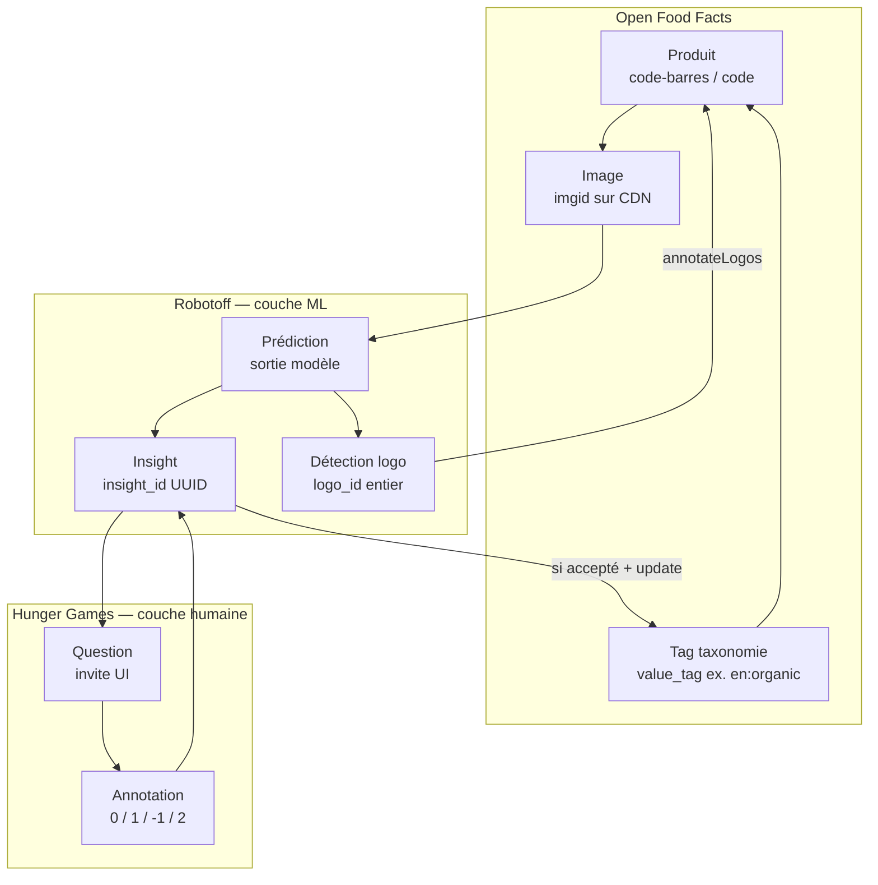
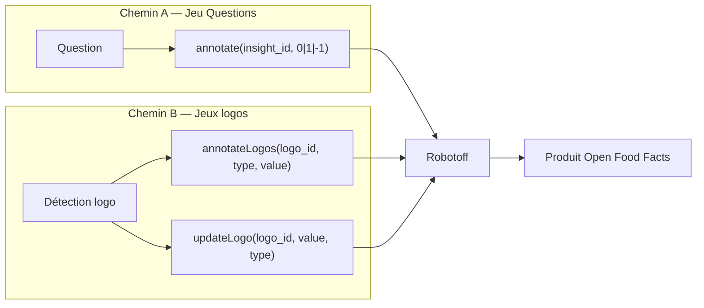

# Phase 3 — Modèle de domaine

> **Open Food Facts Hunger Games — Onboarding contributeur**
>
> Suite de [Phase 2 — L'écosystème Open Food Facts](./phase-2-ecosystem.md)
>
> Preuves : `src/robotoff.ts`, `src/const.ts`, `src/hooks/useQuestions.ts`, `src/components/QuestionFilter/const.ts`, `src/pages/insights/InsightsGrid.jsx`, `src/pages/insights/FilterInsights.jsx`, `src/pages/questions/DebugQuestion.tsx`, `src/components/logoTypeOptions.js`, `src/pages/logosValidator/dashboardDefinition.ts`, [Robotoff API Reference](https://openfoodfacts.github.io/robotoff/references/api/).

---

## Pourquoi le vocabulaire compte ici

Dans le langage courant, on dit « l'IA a deviné bio » ou « répondre à la question » de façon interchangeable. Dans ce codebase et dans les API Robotoff, ce sont **des objets différents avec des IDs et endpoints différents**.

Si vous les mélangez, vous allez :

- annoter le mauvais identifiant (`logo_id` vs `insight_id`)
- filtrer la mauvaise API (`/questions/` vs `/insights/` vs `/predictions/`)
- ouvrir une PR dans Hunger Games alors que le bug est la génération d'insight dans Robotoff

La Phase 3 vous donne un **dictionnaire partagé** que le dépôt et les API utilisent réellement.

---

## Le modèle en couches (gardez cette image)



**FAIT :** Hunger Games interagit le plus souvent avec **Question** et **Annotation** en haut, qui référencent **Insight** en dessous.

**INFÉRENCE :** Les prédictions sont en amont ; beaucoup ne deviennent jamais des questions si filtrées ou auto-traitées.

---

## Termes centraux — glossaire complet

Pour chaque terme : signification réelle, créateur, identifiant, permissions Hunger Games, et destination ensuite.

---

### Product

| | |
|---|---|
| **Monde réel** | Un article vendable en magasin, identifié globalement par code-barres (EAN/UPC). |
| **Créé par** | Contributeurs Open Food Facts / importateurs via Product Opener. |
| **Identifiant** | `barcode` ou `code` (chaîne de chiffres, ex. `"5410041040807"`). |
| **HG peut modifier ?** | **Lire** partout ; **écrire** seulement dans jeux spécifiques (`offService.setIngedrient`, PATCH emballage). |
| **Après interaction** | Reste dans la DB OFF ; peut gagner labels, marques, nutriments, emballages, etc. |

**FAIT** (`QuestionInterface`) : chaque question porte un `barcode`.

**FAIT** (`src/off.ts`) : `getProduct(barcode)` lit un sous-ensemble de champs pour panneaux contexte.

**Comparaison :** Comme un document Firestore indexé par code-barres — sauf que le document vit sur les serveurs OFF, pas dans votre app.

---

### Barcode

| | |
|---|---|
| **Monde réel** | Identité produit scannable. |
| **Créé par** | Fabricant / GS1 ; assigné quand le produit entre dans OFF. |
| **Identifiant** | Identique au `code` produit. |
| **HG peut modifier ?** | **Jamais** — utilisé seulement dans URLs, filtres, chemins API. |
| **Après interaction** | Inchangé. |

**FAIT :** Les URLs image OFF découpent les codes-barres (`325/039/017/2185`) via `getFormatedBarcode()` dans `src/off.ts`.

**À IGNORER POUR L'INSTANT :** Codes-barres réservés, types multi-serveur (`off`, `obf`, …) — l'API Robotoff les supporte ; Hunger Games utilise OFF par défaut.

---

### Image

| | |
|---|---|
| **Monde réel** | Photo d'emballage produit uploadée par un contributeur. |
| **Créé par** | Uploadée vers Open Food Facts ; stockée sur `images.openfoodfacts.org`. |
| **Identifiant** | Chemin image / `imgid` (clé numérique dans l'objet `images` produit) ; URL complète dans `source_image_url`. |
| **HG peut modifier ?** | **Affichage seulement** (zoom, recadrage via API crop Robotoff). Signalement ouvre NutriPatrol (**FAIT**, `externalApi.ts`). |
| **Après interaction** | Fichier image inchangé ; annotations attachent métadonnées aux insights/logos dérivés de l'image. |

**FAIT** (`QuestionInterface.source_image_url`) : l'UI question montre la photo preuve.

**FAIT** (`DebugQuestion.tsx`) : le détail insight expose `source_image` + `bounding_box` pour aperçu logo recadré.

---

### Predictor

| | |
|---|---|
| **Monde réel** | Le modèle ML ou pipeline de règles qui a produit une supposition (détecteur logo, OCR, regex, …). |
| **Créé par** | Configuration / imports Robotoff. |
| **Identifiant** | Nom chaîne, ex. `universal-logo-detector`, `ocr`, `regex`. |
| **HG peut modifier ?** | **Filtrer seulement** — ne change jamais le prédicteur. |
| **Après interaction** | Inchangé ; utilisé pour analytics et campagnes d'annotation ciblées. |

**FAIT** (Robotoff API) : « A predictor refers to the model/method that was used to generate the prediction. »

**FAIT** (tableau `predictors` dans `src/components/QuestionFilter/const.ts`) : l'UI expose une liste fixe pour filtrage.

**FAIT** (`DebugQuestion.tsx`) : le détail insight affiche `data.predictor` comme « generator model ».

**INFÉRENCE :** Filtrer par prédicteur permet aux contributeurs de se concentrer sur les erreurs d'une famille de modèles (ex. seulement les erreurs universal-logo-detector).

---

### Prediction

| | |
|---|---|
| **Monde réel** | Sortie machine brute avant ou sans workflow complet de validation humaine. |
| **Créé par** | Prédicteurs Robotoff (`/predictions`, `/predict/...`, endpoints prédiction image). |
| **Identifiant** | IDs spécifiques prédiction dans Robotoff (**forme exacte INCONNU** dans le dépôt HG). |
| **HG peut modifier ?** | **N'annote pas les prédictions directement** dans la plupart des jeux. |
| **Après interaction** | **INFÉRENCE :** Robotoff promeut/consolide en insights ou logos en interne. |

**FAIT :** L'API Robotoff a des sections **Prediction Management** et **Insight Management** séparées.

**FAIT** (`src/pages/ingredients/useData.tsx`) : appelle `${ROBOTOFF_API_URL}/predict/ingredient_list?ocr_url=...` — endpoint prédiction live, pas la file Questions.

**FAIT** (`src/pages/nutrition/insight.types.ts`) : les insights nutrition embarquent des entités `NutrimentPrediction` dans `data` insight.

**Ne dites pas « j'ai annoté une prédiction »** quand vous avez cliqué Oui sur le jeu Questions — vous avez annoté un **insight** via `insight_id` (**FAIT**, `useQuestions.ts`).

---

### Insight

| | |
|---|---|
| **Monde réel** | Un **fait candidat** sur un produit (« cette photo suggère le label en:organic », « la marque est Danone »). |
| **Créé par** | Robotoff depuis prédictions/OCR/détection logo. |
| **Identifiant** | `insight_id` — chaîne UUID (ex. `a5e4397a-f14b-444f-972d-504a04e1cd7a`). |
| **HG peut modifier ?** | **Indirectement** — en soumettant des annotations. Ne peut pas créer/supprimer des insights. |
| **Après interaction** | Robotoff stocke l'annotation ; peut appliquer à OFF si accepté. |

**FAIT** (Robotoff API) : « An insight is a fact about a product that has been either extracted or inferred from the product pictures, characteristics,… If the insight is correct, the Openfoodfacts DB can be updated accordingly. »

**FAIT** (`InsightsGrid.jsx`) : les lignes insight ont `id`, `type`, `value`, `value_tag`, `barcode`, `annotation`, `timestamp`, `completed_at`, `automatic_processing`.

**FAIT** (affichage annotation `InsightsGrid.jsx`) : valeurs annotation `1` accepté, `0` rejeté, `-1` passé, vide = non annoté.

---

### Insight type (`insight_type` / `type`)

| | |
|---|---|
| **Monde réel** | Quel **type de champ produit** l'insight prétend affecter. |
| **Créé par** | Typage insight Robotoff (voir Robotoff `insights/dataclass.py` selon doc API). |
| **Identifiant** | Enum chaîne — **pas** la même liste sur chaque écran HG. |

**Listes trouvées dans ce dépôt (FAIT) :**

| Contexte | Types d'insight exposés |
|---|---|
| Filtre Questions (`insightTypesNames`) | `label`, `category`, `brand`, `product_weight`, `packaging` |
| Filtre grille admin Insights | ci-dessus + `expiration_date`, `packager_code`, `qr_code` |
| Types annotation logo (`logoTypeOptions`) | `label`, `brand`, `packager_code`, `packaging`, `qr_code`, `category`, `nutrition_label`, `store`, `no_logo` |
| Dashboards logo (`dashboardDefinition.ts`) | `label`, `brand`, `category`, `product_weight`, `packaging`, `packager_code`, `expiration_date`, `qr_code` |

**INFÉRENCE :** Le jeu Questions montre un **sous-ensemble** adapté à la validation binaire oui/non ; l'outillage logo utilise une liste **plus riche**.

**FAIT** (`TYPE_WITHOUT_VALUE` dans `src/const.ts`) : `packager_code`, `qr_code`, `no_logo` — types qui peuvent ne pas exiger de valeur taxonomie dans l'UI recherche logo.

---

### Question

| | |
|---|---|
| **Monde réel** | Une invite lisible : « Ce produit a-t-il ce label ? » plus image + valeur proposée. |
| **Créé par** | Robotoff (`GET /questions/` ou `/questions/{barcode}`). |
| **Identifiant** | **Pas d'ID question séparé dans HG** — indexé par `insight_id` en pratique. |
| **HG peut modifier ?** | **Afficher + répondre seulement.** |
| **Après interaction** | Disparaît de la file quand répondue ; Robotoff cesse d'afficher les insights passés à cet utilisateur. |

**FAIT** (`QuestionInterface` dans `src/robotoff.ts`) :

```typescript
{
  barcode, insight_id, insight_type, question,
  source_image_url?, ref_image_url?,
  type,        // question interaction type, e.g. "add-binary"
  value,       // display string
  value_tag,   // taxonomy tag for Product Opener
}
```

**FAIT** (Robotoff API) : questions triées par priorité (category → label → brand → autres).

**Distinction critique :**

| Objet | Question | Insight |
|---|---|---|
| Objectif | Demander rapidement à un humain | Stocker candidat ML + état validation |
| ID utilisé dans annotate | `insight_id` | `insight_id` |
| A champ texte `question` | Oui | Pas forcément dans les vues liste |
| API pour récupérer la file | `/questions/` | `/insights/` |

**Vous répondez à une question en annotant son insight.**

---

### Question `type` (pas insight type)

| | |
|---|---|
| **Monde réel** | Comment l'UI doit traiter l'interaction de réponse. |
| **Exemple** | **FAIT** (échantillon Robotoff API) : `"type": "add-binary"` pour questions label Oui/Non. |
| **Usage HG** | Pilote le pattern d'interaction ; boutons binaires dans le jeu Questions. |

**Ne confondez pas** `question.type` (schéma d'interaction) avec `question.insight_type` (champ domaine : label, brand, …).

---

### Annotation

| | |
|---|---|
| **Monde réel** | Décision humaine sur un insight (ou correction structurée). |
| **Créé par** | Contributeur via Hunger Games → API Robotoff. |
| **Identifiant** | Pas d'UUID autonome dans HG — stocké sur insight comme valeur `annotation`. |
| **HG peut modifier ?** | **Créer** (soumettre). Ne peut pas éditer les annotations des autres. |
| **Après interaction** | Robotoff met à jour l'état insight ; peut déclencher mise à jour OFF. |

**FAIT** (`src/const.ts`) :

| Constante | Valeur | UI |
|---|---|---|
| `CORRECT_INSIGHT` | `1` | Oui |
| `WRONG_INSIGHT` | `0` | Non |
| `SKIPPED_INSIGHT` | `-1` | Passer |

**FAIT** (Robotoff API) : `2` = accepter **et** fournir `data` supplémentaire (tables nutrition, correcteur orthographe, etc.).

**FAIT** (`src/pages/nutrition/utils.ts`) : nutrition utilise `annotation=2` avec JSON `data: { nutrients: ... }`.

**FAIT** (`robotoff.annotate`) : passe toujours `update: 1` pour que Robotoff pousse vers OFF si approprié.

---

### Annotation status / annotation value

| | |
|---|---|
| **Monde réel** | Si/quand/comment un insight a été décidé. |
| **Créé par** | Robotoff après une ou plusieurs annotations/votes. |
| **Identifiant** | Entier sur insight : `1`, `0`, `-1`, ou non défini. |
| **HG peut modifier ?** | **Lire** sur page Insights ; **écrire** via endpoints annotate. |
| **Après interaction** | Pilote filtres comme « not_annotated » dans grille Insights. |

**FAIT** (`FilterInsights.jsx`) : valeurs filtre `not_annotated`, `-1`, `0`, `1`.

**FAIT** (`InsightsGrid.jsx`) : booléen `automatic_processing` — icône robot vs humain requis.

---

### Logo (objet détection)

| | |
|---|---|
| **Monde réel** | Région rectangulaire sur image produit ressemblant à un logo/label/marque. |
| **Créé par** | Détecteur logo Robotoff (souvent `universal-logo-detector`). |
| **Identifiant** | `logo_id` — **numérique** (ex. `id: 0` dans échantillons API). Distinct de `insight_id`. |
| **HG peut modifier ?** | **Annoter** via `robotoff.annotateLogos()`, `updateLogo()` ; rechercher via `searchLogos()`. |
| **Après interaction** | Annotation logo associe `annotation_type` + `annotation_value` / valeur taxonomie à la région. |

**FAIT** (interface `Logo` dans `src/robotoff.ts`) : `bounding_box`, `annotation_type`, `annotation_value`, `image` imbriquée.

**FAIT** (objet logo Robotoff API) : champs incluent `annotation_type`, `annotation_value_tag`, `taxonomy_value`, `score`.

**FAIT** (`DebugQuestion.tsx`) : insight peut référencer `data.logo_id` liant insight ↔ géométrie logo.

**Deux chemins d'annotation parallèles :**

| Chemin | API | ID |
|---|---|---|
| Validation insight binaire | `robotoff.annotate(insight_id, ±1\|0)` | UUID `insight_id` |
| Labeling batch logo | `robotoff.annotateLogos([{ logo_id, type, value }])` | `logo_id` numérique |

---

### Taxonomy value / `value` / `value_tag`

| | |
|---|---|
| **Monde réel** | Tag normalisé dans la taxonomie Open Food Facts (multilingue, hiérarchique). |
| **Créé par** | Éditeurs taxonomie OFF ; ML propose tags via insights. |
| **Identifiant** | `value_tag` — format habituel `language:id`, ex. `en:organic`, `fr:ab-agriculture-biologique`. |
| **HG peut modifier ?** | **Affiche** `value` (convivial) et renvoie `value_tag` via Robotoff ; formulaires logo acceptent choix taxonomie. |
| **Après interaction** | Si insight accepté, tag appliqué au champ produit approprié dans OFF. |

**FAIT** (Robotoff API sur `value_tag`) : « the value that is going to be sent to Product Opener ».

**FAIT** (`question.value` vs `question.value_tag`) : l'UI montre `value` (« Nutriscore Grade A ») ; machine/OFF utilise `value_tag` (`en:nutriscore-grade-a`).

**FAIT** (`reformatValueTag` dans `src/utils.ts`) : normalise l'entrée filtre (minuscules, pliage accents, espaces → tirets) avant requêtes API — **pas** la même chose que validation taxonomie OFF.

**FAIT** (`getValueTagExamplesURL` dans `questions/utils.ts`) : lie vers `https://world.openfoodfacts.org/{insight_type}/{value_tag}`.

**Comparaison :** Comme une clé enum canonique dans votre app (`en:organic`) séparée du label affiché (« Organic »).

---

### Campaign (`campaign` / `campaigns`)

| | |
|---|---|
| **Monde réel** | Lot ou poussée d'annotation thématique (« seulement insights catégorie Agribalyse », drive Green Score, …). |
| **Créé par** | Import insight Robotoff / configuration ops. |
| **Identifiant** | Nom campagne chaîne, ex. `agribalyse-category`. |
| **HG peut modifier ?** | **Filtrer** questions/insights/opportunities par campagne. |
| **Après interaction** | Inchangé — campagne est métadonnée sur insights. |

**FAIT** (Robotoff API) : « An annotation campaign allows to only retrieve questions or insights based on arbitrary criteria defined during insight import. »

**FAIT** (`campagnes` dans `QuestionFilter/const.ts`) : inclut `"agribalyse-category"`.

**FAIT** (`Opportunities.tsx`, pages Green Score) : passe `campaign` dans requêtes comptage questions et liens profonds vers `/questions?...&campaign=...`.

---

### Country filter

| | |
|---|---|
| **Monde réel** | Limiter questions aux produits vendus dans / tagués avec un pays. |
| **Créé par** | `countries_tags` produit OFF. |
| **Identifiant** | Conventions mixtes dans HG : URL peut utiliser `en:france` ou code 2 lettres après normalisation. |
| **HG peut modifier ?** | **Filtrer seulement.** |
| **Après interaction** | N/A |

**FAIT** (`getFilterParams.ts`) : lit URL `country`, normalise via `src/assets/countries.json` vers `countryCode`.

**FAIT** (`robotoff.questions`) : envoie `countries: countryFilter` à Robotoff.

**FAIT** (`countryNames` dans QuestionFilter) : sous-ensemble codé en dur pour filtres rapides ; liste complète dans `countries.json` généré.

---

### Language (`lang`)

| | |
|---|---|
| **Monde réel** | Langue pour texte question, traductions valeur, UI. |
| **Créé par** | Préférence utilisateur + localisation OFF/Robotoff. |
| **Identifiant** | Code ISO-ish depuis `getLang()` (`localeStorageManager`). |
| **HG peut modifier ?** | UI HG via i18next ; questions Robotoff via param query `lang`. |
| **Après interaction** | N/A |

**FAIT** (`robotoff.questions`) : ajoute `lang` depuis `getLang()` aux params API.

**FAIT** (`offService.getProduct`) : demande champs localisés comme `categories_tags_{lang}`.

**Trois couches de traduction** (depuis Phase 2) : chaînes UI HG, noms taxonomie OFF, phrases question Robotoff.

---

### Filter state (composite spécifique HG)

Pas un objet domaine Robotoff — mais central pour récupérer les bonnes questions.

**FAIT** (`FilterState` dans `src/robotoff.ts`) :

```typescript
{
  insightType?, brandFilter?, country?, brand?, valueTag?,
  countryFilter?, sortByPopularity?, campaign?, predictor?,
  with_image?, sorted?,
}
```

**FAIT** (mapping URL dans `getFilterParams.ts` / `key2urlParam`) :

| Param URL | Champ FilterState |
|---|---|
| `type` | `insightType` |
| `value_tag` | `valueTag` |
| `country` | `country` / `countryFilter` |
| `brand` | `brand` |
| `campaign` | `campaign` |
| `predictor` | `predictor` |
| `sorted` | popularity sort (`sorted !== "false"`) |

---

## Côte à côte : les quatre termes facilement confondus

| | **Prediction** | **Insight** | **Question** | **Annotation** |
|---|---|---|---|---|
| **Métaphore** | Sortie modèle | Fait candidat classé | Carte quiz | Votre vote |
| **Créé par** | ML Robotoff | Robotoff | Robotoff (depuis insight) | Humain |
| **ID principal** | spécifique modèle | `insight_id` (UUID) | utilise `insight_id` | valeur sur insight |
| **HG fetch via** | `/predict/...`, rarement `/predictions` | `/insights/` | `/questions/` | POST annotate |
| **HG crée ?** | Non | Non | Non | **Oui** |
| **Endpoint typique** | `predict/ingredient_list` | `getInsights` | `robotoff.questions` | `robotoff.annotate` |

**Règle empirique pour le jeu Questions :**

> Récupérer **questions** → afficher **question** → soumettre **annotation** sur **insight_id** → Robotoff met à jour **insight** et peut-être **product**.

---

## Annotation logo vs annotation insight



**FAIT** (`AnnotateLogoModal.tsx`) : annotation batch logo entièrement ignorée en mode dev (`IS_DEVELOPMENT_MODE`) pour éviter écritures production accidentelles.

**INFÉRENCE :** Les workflows logo et insight peuvent converger vers les mêmes champs produit (ex. tag label) via différents chemins code Robotoff.

---

## Valeurs sentinelles spéciales (HG uniquement)

| Constante | Valeur | Signification |
|---|---|---|
| `NO_QUESTION_LEFT` | `"NO_QUESTION_LEFT"` | **FAIT** — placeholder insight_id quand le produit n'a plus de questions (`ProductInformation.tsx`) |

---

## Où les termes apparaissent dans le code (carte rapide)

| Terme | Types / fichiers principaux |
|---|---|
| Question | `QuestionInterface` — `src/robotoff.ts` |
| Insight | Lignes grille Insights — `InsightsGrid.jsx` ; détail — `DebugQuestion.tsx` |
| Annotation | `useQuestions.ts`, `const.ts` |
| Logo | `Logo` — `src/robotoff.ts` ; UI — `LogoGrid.jsx`, `AnnotateLogoModal.tsx` |
| Predictor | filtres — `QuestionFilter/const.ts` ; détail — `DebugQuestion.tsx` |
| Campaign | filtres, `Opportunities.tsx`, cartes Green Score |
| value_tag | questions, insights, recherche logo |
| Product | `src/off.ts`, `useProduct.ts` |

---

## Protection de l'espace mental

### À COMPRENDRE MAINTENANT

1. **`insight_id`** est ce que vous annotez dans le jeu Questions — pas `logo_id`, pas code-barres.
2. **Question ≠ insight** — question est l'enveloppe UI ; insight est le candidat ML persisté.
3. **Prediction** est en amont ; les contributeurs interagissent généralement avec **insights/questions**.
4. **`value`** est texte affiché ; **`value_tag`** est ce qui intéresse la taxonomie OFF/Product Opener.
5. **Workflows logo** utilisent **`logo_id`** numérique et méthodes API différentes.
6. Valeurs annotation : **`1` oui, `0` non, `-1` passer, `2` oui+data**.

### UTILE PLUS TARD

- Catalogue complet types insight dans dataclass Python Robotoff
- Pipeline prédiction image → import insight
- Seuils vote anonymes
- `server_type` pour projets Beauty/Pet Food
- Suggestions logo plus proches voisins (`nearest_neighbors` dans API)

### À IGNORER POUR L'INSTANT

- Chaque entrée logo dans `dashboardDefinition.ts`
- Liste complète noms taxonomie dans `offSearch.ts`
- Offsets caractères entités nutrition dans `NutrimentPrediction`

---

## Résumé Phase 3 — cinq points à retenir

1. **Product + barcode + image** = monde OFF ; **insight + question + annotation** = monde validation.
2. **Predictor** explique *qui a deviné* ; **insight type** explique *quel champ* est deviné.
3. **`value_tag`** est le pont vers la taxonomie Open Food Facts — protégez sa justesse.
4. **Questions** sont récupérées depuis `/questions/` mais répondues via annotate **`insight_id`**.
5. **Logos** sont un domaine parallèle avec **`logo_id`** — ne les fusionnez pas mentalement avec les UUID insight.

### Incertitudes

- **INCONNU :** Règles Robotoff exactes pour quand une prédiction devient insight vs insight auto-appliqué (flag `automatic_processing` existe mais logique serveur pas dans ce dépôt).
- **INCONNU :** Liste autoritaire complète types insight (HG montre différents sous-ensembles par page).
- **INFÉRENCE :** Valeurs `question.type` au-delà de `add-binary` peuvent exister pour jeux non binaires (webcomponents).

---

## Suite

**Phase 4 — Modèle mental d'architecture**

Nous reconstruirons Hunger Games depuis le code checkout :

- bootstrap, routing, React Query, contexts, wrappers API, i18n, build/deploy

Puis un **diagramme d'architecture Mermaid** et **les cinq choses à retenir sur l'architecture Hunger Games**.

---

*Arrêtez-vous ici. Choisissez mentalement une vraie question de production : identifiez son barcode, insight_id, insight_type, value_tag, et quel appel API répondre déclencherait. Quand cela semble naturel, passez à la Phase 4.*
