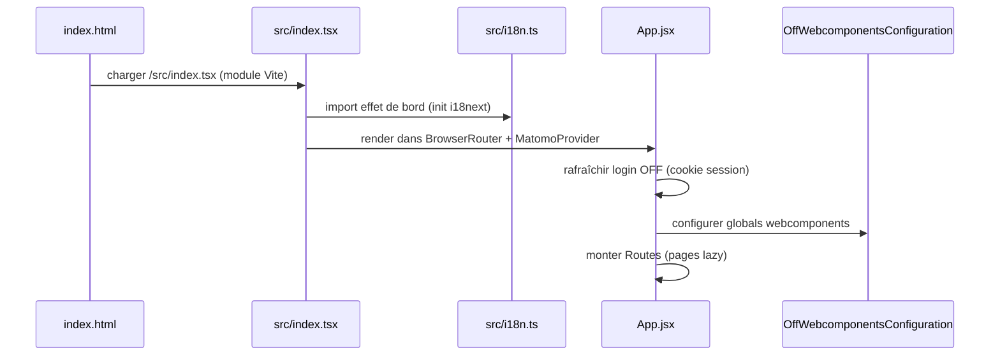
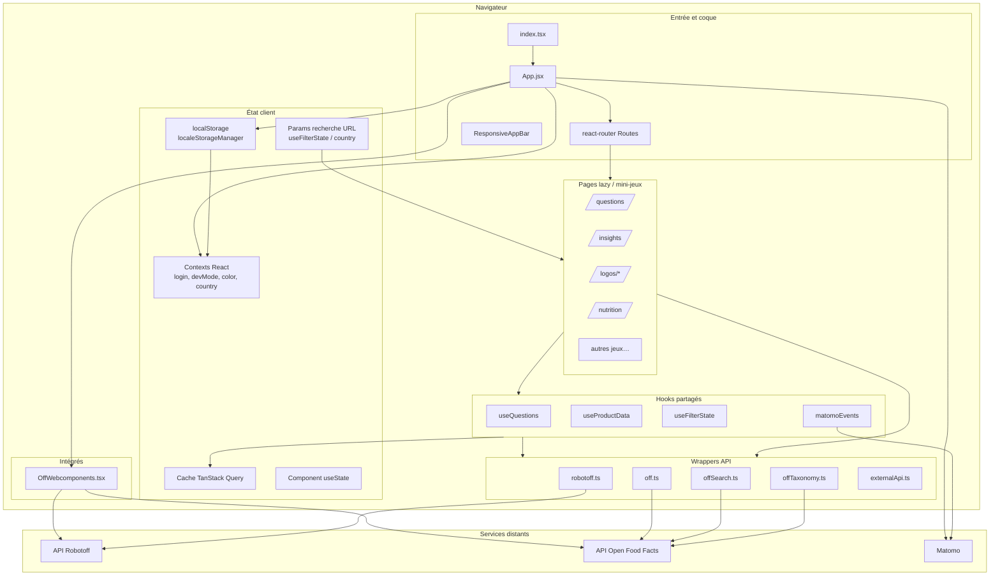

# Phase 4 — Modèle mental d'architecture

> **Open Food Facts Hunger Games — Onboarding contributeur**
>
> Suite de [Phase 3 — Modèle de domaine](./phase-3-domain-model.md)
>
> Preuves : `index.html`, `src/index.tsx`, `src/App.jsx`, `src/robotoff.ts`, `src/off.ts`, `src/localeStorageManager.ts`, `src/hooks/useQuestions.ts`, `src/hooks/useFilterState/`, `vite.config.mjs`, `package.json`, `.github/workflows/ci-cd.yml`.

---

## Avant l'arborescence de fichiers

Hunger Games est une **SPA React construite avec Vite** **sans backend propre**. L'architecture s'organise autour de trois idées :

1. **Les routes** chargent des mini-jeux lazy (pages).
2. **TanStack Query** possède les données distantes en cache (questions, produits, insights).
3. **Des wrappers API fins** (`robotoff.ts`, `off.ts`) isolent les frontières HTTP.

Tout le reste — thème MUI, i18n, Matomo, contexts, params URL, localStorage — existe pour rendre l'annotation rapide et configurable.

---

## Bootstrap application (séquence de démarrage)



### Couche 0 — Coque HTML

**FAIT** (`index.html`) :

- Point de montage `#root`
- Enregistre `/serviceWorker.js` (cache style PWA — **INFÉRENCE** : coque offline seulement ; annotation nécessite toujours le réseau)
- Charge `src/index.tsx` comme module ES

### Couche 1 — Entrée (`src/index.tsx`)

| | |
|---|---|
| **Responsabilité** | Créer la racine React, câbler les providers globaux |
| **Entrées** | DOM `#root`, config Matomo |
| **Sorties** | Arbre app rendu |
| **État possédé** | Aucun |
| **Appels** | `BrowserRouter`, `MatomoProvider`, `App` |
| **Effets de bord** | `reportWebVitals()` (logging perf optionnel) |

**FAIT :** Site id Matomo `3` sur `https://analytics.openfoodfacts.org/`.

### Couche 2 — Coque app (`src/App.jsx`)

| | |
|---|---|
| **Responsabilité** | Providers globaux, thème, auth, table de routage |
| **Entrées** | Emplacement router, paramètres localStorage, cookie session OFF |
| **Sorties** | Composants page par route |
| **État possédé** | `devMode`, `visiblePages`, `userState`, `color mode` |
| **Appels** | Toutes pages lazy, `off.getCookie`, `auth.pl`, Matomo `trackPageView` |
| **Effets de bord** | Meta tag thème, refresh login au mount |

**Imbrication providers (extérieur → intérieur) — FAIT :**

```
CountryProvider
  → ColorModeContext
    → MUI ThemeProvider
      → LoginContext
        → DevModeContext
          → QueryClientProvider (client unique)
            → CssBaseline + OffWebcomponentsConfiguration + AppBar + Routes
```

**FAIT :** Un `QueryClient()` au niveau module — pas de `defaultOptions` global configuré dans le dépôt (defaults Query s'appliquent).

**FAIT :** Presque chaque page est `React.lazy()` — code-split par route.

**FAIT :** `IS_DEVELOPMENT_MODE` (`import.meta.env.DEV`) traite l'utilisateur comme connecté localement sans vérif cookie.

---

## Diagramme d'architecture



---

## Routage et structure des pages

### Pattern

Chaque mini-jeu est un dossier **`src/pages/<name>/`** avec une entrée index et composants/utils locaux.

| | |
|---|---|
| **Responsabilité** | Une expérience d'annotation utilisateur par route |
| **Entrées** | Params URL, contexts, hooks |
| **Sorties** | UI + mutations distantes |
| **État possédé** | Mix : filtres URL, React Query, état formulaire local |
| **Modifié quand** | Ajout/changement d'un jeu |

**FAIT** (`App.jsx`) : routes représentatives :

| Chemin | Page | Login requis ? |
|---|---|---|
| `/` | Accueil | Non |
| `/questions` | Questions (central) | Non |
| `/insights` | Navigateur insights | Non (gating menu devMode) |
| `/logos/*` | Outils logo | **Oui** |
| `/nutrition` | Webcomponent nutriments | **Oui** |
| `/packaging` | Éditeur emballage | **Oui** |
| `/ingredient-*` | Jeux webcomponent | Non |
| `/dashboard/:id` | Dashboards questions logo | Non |
| `/settings` | Préférences utilisateur | Non |

**FAIT :** La porte login utilise `userState.isLoggedIn` → sinon `<ShouldLoggedinPage />`.

**FAIT :** `/flagged-images` enregistré seulement pour noms d'utilisateur admin codés en dur dans `ADMINS`.

**INFÉRENCE :** L'auth au niveau route est grossière — pas de permission par annotation.

### Layout page Questions (modèle architectural)

**FAIT** (`src/pages/questions/index.tsx`) :

```
QuestionFilter  →  filtres pilotés par URL
QuestionDisplay →  useQuestions + UI réponse
ProductInformation → useProductData (lecture OFF)
UserData        →  comptages + réponses récentes
```

Ce **layout deux colonnes** (tâche principale + barre latérale contexte) se répète dans plusieurs jeux.

---

## Composants partagés (`src/components/`)

| | |
|---|---|
| **Responsabilité** | UI réutilisable entre jeux — filtres, logos, images, footer, app bar |
| **Appartient ici** | Widgets cross-page (`QuestionCard`, `CroppedLogo`, `ZoomableImage`, `AnnotateLogoModal`) |
| **N'appartient PAS** | Logique métier spécifique jeu (garder dans `pages/`) |
| **En dépend** | Pages et autres composants |
| **Modifier quand** | UX partagée, accessibilité, UI filtres |

**FAIT :** `components/QuestionFilter/index.js` réexporte depuis `pages/questions/QuestionFilter.tsx` — légère confusion page-spécifique vs partagé (structure historique).

**À IGNORER POUR L'INSTANT :** Composants page one-off dupliqués sous `pages/`.

---

## Hooks (`src/hooks/`)

| Hook | Responsabilité | État distant ? |
|---|---|---|
| `useQuestions` | File questions, réponse, remplissage, cache réponses récentes | **Oui** (React Query) |
| `useProductData` | Contexte produit par code-barres | **Oui** |
| `useProductQuestions` | Questions pour un produit | **Oui** |
| `useFilterState` | Lire/écrire params filtre URL | État URL |
| `useOptions` | Chargeurs options divers | Variable |
| `matomo/*` + `matomoEvents` | Analytics | Non |

| | |
|---|---|
| **Appartient ici** | Logique stateful réutilisable par 2+ pages |
| **N'appartient PAS** | Effets page one-off (garder dans fichier page) |
| **Modifier quand** | Changer sémantique file questions, patterns fetch partagés |

**FAIT :** `getQuestionKeys()` dans `useQuestions.ts` définit l'identité React Query — doit rester synchronisé avec `useQuestionsQuery`.

---

## Contexts (`src/contexts/`)

| Context | État | Persisté ? |
|---|---|---|
| `LoginContext` | `userName`, `isLoggedIn`, `refresh()` | Cookie session (OFF) |
| `DevModeContext` | `devMode`, `visiblePages` | localStorage |
| `ColorModeContext` | `toggleColorMode` | localStorage |
| `CountryProvider` | `country`, `setCountry(scope)` | URL + localStorage (`scope=global`) |

| | |
|---|---|
| **Responsabilité** | Préférences transverses et signaux auth |
| **Pas utilisé pour** | Données file questions (c'est React Query) |
| **Effets de bord** | Page settings écrit via `localSettings.update` |

---

## TanStack React Query (couche état serveur)

| | |
|---|---|
| **Responsabilité** | Cacher réponses Robotoff/OFF, dédupliquer fetches, alimenter mutations |
| **Entrées** | Clés query + fonctions fetch dans hooks/pages |
| **Sorties** | `{ data, status }` aux composants |
| **État possédé** | Cache mémoire indexé par queryKey |
| **Appels** | `robotoff.*`, `offService.*` |
| **Effets de bord** | `setQueryData` pour file optimiste ; `useMutation` remplissage |

**Clés query représentatives (FAIT) :**

| Préfixe clé | Source |
|---|---|
| `["questions", insightType, valueTag, …]` | `useQuestions` |
| `["recent-answers"]` | Mémoire seulement (`queryFn` retourne `[]`) |
| `["product", barcode]` | `useProductData` |
| `["insights", filterState, page]` | Grille Insights |
| `["insight-details", insightId]` | Panneau debug |
| `["potential-question-count", …]` | Comptages badges |

**INFÉRENCE :** Pas de React Query Devtools dans le dépôt ; débogage via Network navigateur + React DevTools.

**Comparaison (votre parcours) :** Comme TanStack Query remplaçant collections MobX manuelles de résultats API — sauf que les mutations **patchent souvent le cache directement** (`setQueryData`) plutôt que d'invalider.

---

## État URL vs localStorage vs UI transitoire

| Type d'état | Mécanisme | Exemples | Survit au refresh ? |
|---|---|---|---|
| **URL / search params** | `useFilterState`, partie URL `CountryProvider` | `?type=label&value_tag=…&country=fr` | Oui (lien partageable) |
| **Persisté local** | `localeStorageManager`, `useLocalStorageState` | langue, mode sombre, dev mode, favoris | Oui |
| **Distant en cache** | React Query | file questions, JSON produit | Jusqu'à stale/refetch |
| **Context** | React context | login, devMode | Session / jusqu'au reload |
| **UI transitoire** | `useState` | dialogs ouverts, flag image chargée, accordion | Non |

**FAIT** (priorité `getLang()`) : URL `?language=` → localStorage → langue navigateur.

**FAIT** (clé unique `localSettings`) : blob JSON `hunger-game-settings`.

**FAIT** (clé séparée favoris) : `hunger-game-favorites`.

**Intention design (INFÉRENCE) :** Les filtres sont des **URLs partageables** pour que les contributeurs se lient mutuellement une campagne. Les préférences sont **locales** pour que l'UI se souvienne de votre langue et thème.

---

## Couche wrapper API

### `src/robotoff.ts`

| | |
|---|---|
| **Responsabilité** | Tout accès HTTP Robotoff depuis HG |
| **Entrées** | Params filtre, IDs, valeurs annotation |
| **Sorties** | Promesses (axios ou fetch SDK) |
| **Appels** | API REST Robotoff |
| **Consommateurs** | Questions, logos, insights, dashboards, green-score |

**Double client (FAIT) :** classe `@openfoodfacts/openfoodfacts-nodejs` `Robotoff` + axios pour certains endpoints (`questions`, `updateLogo`, statistics).

### `src/off.ts`

| | |
|---|---|
| **Responsabilité** | Lecture produit OFF, recherche, helpers patch v3, builders URL |
| **Appels** | OFF v0/v2/v3, search.pl, parsing cookie auth |
| **Consommateurs** | Barres latérales, emballage, ingrédients, liens insights |

### `src/offSearch.ts` / `src/offTaxonomy.ts`

| | |
|---|---|
| **Responsabilité** | Autocomplétion taxonomie et métadonnées tags |
| **Appels** | search.openfoodfacts.org, taxonomie OFF v2 |
| **Consommateurs** | Filtres, formulaires logo, sélecteurs taxonomie |

### `src/externalApi.ts`

| | |
|---|---|
| **Responsabilité** | Ouvrir outils externes (NutriPatrol) |
| **Effets de bord** | `window.open` |

**Règle de frontière :** Les pages devraient appeler les wrappers, pas disperser URLs brutes — mais **FAIT :** certaines pages axios directement encore (annotate nutrition, patch emballage).

---

## Intégration webcomponents

**FAIT** (`OffWebcomponents.tsx`) :

- Chargé une fois à la racine app
- Définit `<off-webcomponents-configuration robotoff-configuration=… openfoodfacts-api-url=…>`
- Vite copie images webcomponent vers `dist/assets/webcomponents`

| | |
|---|---|
| **Responsabilité** | Héberger jeux Robotoff autonomes (extraction nutrition, correcteur orthographe/détection ingrédient) |
| **État possédé** | Interne au shadow DOM / web component |
| **HG modifie** | Pages wrapper seulement (filtre pays, layout) |

---

## i18n

**FAIT** (`src/i18n.ts`) :

- i18next + `react-i18next`
- Backend lazy : `import(\`./i18n/${language}.json\`)` par langue
- Vite émet chunks langue comme `assets/lang-[name]-[hash].js`

| | |
|---|---|
| **Responsabilité** | Chaînes UI Hunger Games seulement |
| **Pas responsable de** | Texte question Robotoff (param API `lang`) |

**FAIT** (workflow Crowdin) : traductions maintenues via PRs automatisation séparées vers `src/i18n/*.json`.

---

## MUI / thème

**FAIT** (`App.jsx` `getToken`) : palette OFF « coffee » personnalisée (latte, chocolate, cappuccino…), modes clair/sombre.

| | |
|---|---|
| **Responsabilité** | Cohérence visuelle, layout responsive |
| **État** | `mode` dans App + `ColorModeContext` |
| **Effets de bord** | Met à jour `<meta name="theme-color">` |

Les pages utilisent MUI Grid v2 (`size={{ xs: 12, md: 7 }}`), Stack, Paper — patterns layout Material standard.

---

## Analytics

| | |
|---|---|
| **MatomoProvider** | Charge script tracker, expose `trackPageView` / `trackEvent` |
| **App.jsx** | Vues page au changement route (prod seulement) |
| **matomoEvents.ts** | Événements question oui/non/passer, annotation logo |

**Effets de bord :** Appels réseau vers `analytics.openfoodfacts.org` — pas d'impact sur justesse annotation.

---

## Assets et données générées

| Asset | Source | Script |
|---|---|---|
| `src/assets/countries.json` | taxonomie static.openfoodfacts.org | `yarn countries` |
| `src/assets/nutriments.json` | taxonomie nutriment OFF | `yarn nutriments` |
| `src/assets/brands.json` | Données référence bundlées | — |
| `public/` | favicon, service worker, manifest | — |

| | |
|---|---|
| **Responsabilité** | Listes déroulantes filtres rapides offline, listes champs nutrition |
| **Pas taxonomie live** | Régénérer scripts quand obsolète |

---

## Build et déploiement

| Étape | Outil | Sortie |
|---|---|---|
| Serveur dev | `yarn dev` → Vite | `localhost:5173` (**FAIT**, défaut Vite) |
| Build production | `yarn build` | fichiers statiques `dist/` |
| Post-build | `deploy.sh` | Copie `index.html` → `404.html`, `questions.html`, … pour deep links SPA |
| CI | `.github/workflows/ci-cd.yml` | `yarn lint` + `yarn build` + deploy artifact |
| Hébergement | job GitHub Pages + `netlify.toml` présent | **INCONNU** quel hôte prod est canonique |

**FAIT** (husky pre-commit) : exécute `yarn prettier` seulement — pas lint.

**FAIT** (CI lint) : `prettier --check . && eslint .`

---

## Mix TypeScript vs JavaScript

**FAIT :** Coexistence de `.jsx`, `.tsx`, `.ts` sans séparation stricte par répertoire.

| Pattern | Interprétation |
|---|---|
| Hooks, contexts, certaines pages plus récents | `.ts` / `.tsx` |
| Pages logo plus anciennes, grille insights, accueil | `.jsx` |
| `robotoff.ts`, `off.ts` | Wrappers typés |

**INFÉRENCE :** Migration incrémentale — **pas** « JS pour jeux, TS pour utils ». Correspondre au fichier que vous éditez.

**Ne pas** convertir en masse JS → TS comme exercice d'onboarding.

---

## Pattern gestion d'erreurs

**FAIT :** Composant classe `ErrorBoundary` — logue dans console, fallback minimal (pas d'UI récupération utilisateur).

**FAIT :** Erreurs annotate `useQuestions` → `console.error` seulement.

**INFÉRENCE :** Les échecs sont souvent **visibles seulement dans DevTools** — important pour contributeurs testant localement.

---

## Narration du diagramme (flux données pour une annotation)

1. L'utilisateur ouvre `/questions?type=label&country=fr` → **`useFilterState`** parse l'URL.
2. **`useQuestions`** React Query fetch **`robotoff.questions()`** → clé cache inclut filtres.
3. **`QuestionDisplay`** rend première question en cache ; **`useProductData`** fetch produit OFF en parallèle.
4. L'utilisateur clique Oui → **`answerQuestion`** :
   - fire-and-forget **`robotoff.annotate`**
   - **`queryClient.setQueryData`** retire la question
   - **`mutation.mutate`** optionnel remplit la file
   - **`matomoEvents`** suit l'événement
5. Pas de mise à jour état App — la file vit entièrement dans React Query.

L'état distant s'arrête au cache React Query ; la progression UI est mutation cache locale, pas confirmée serveur.

---

## Les cinq choses à retenir sur l'architecture Hunger Games

1. **SPA unique, nombreuses routes lazy** — chaque mini-jeu est un module page ; coque partagée est `App.jsx` + AppBar.

2. **React Query est la file questions** — pas context, pas Redux ; params filtre font partie des clés query.

3. **Les params URL sont l'API filtre partageable** — `useFilterState` fait le pont entre liens bookmarkables et requêtes Robotoff.

4. **Deux modules API dominent** — `robotoff.ts` (valider ML) et `off.ts` (lire/enrichir produits) ; garder frontières propres en contribuant.

5. **Pas de serveur dans ce dépôt** — auth = cookies OFF, persistance = API Robotoff/OFF, sortie build = fichiers statiques.

---

## Protection de l'espace mental

### À COMPRENDRE MAINTENANT

- Chaîne bootstrap : `index.tsx` → providers dans `App.jsx` → page route lazy.
- Où vivent les données questions : **React Query**, indexées par filtres.
- Où vivent les filtres : **params recherche URL** (+ pays dans localStorage).
- Wrappers API : **`robotoff.ts`** vs **`off.ts`**.
- Login : cookie **session OFF**, pas auth Hunger Games.

### UTILE PLUS TARD

- Duplicatas HTML `deploy.sh` pour routage SPA sur hôtes statiques
- Dev mode + toggles menu `visiblePages`
- Copie assets webcomponents dans config Vite
- Comportement service worker
- Routes admin-only

### À IGNORER POUR L'INSTANT

- Définitions dashboard individuelles
- Automatisation workflow GitHub au-delà lint/build
- Outil dead-code `knip`
- Pages Brandinator / Gala / bug

---

## Résumé Phase 4

| Couche | Retenir |
|---|---|
| Entrée | Vite + React 19 + react-router |
| Coque | Providers imbriqués, un QueryClient |
| Pages | Mini-jeux lazy-loaded |
| État serveur | TanStack Query + wrappers |
| État partageable | Filtres URL |
| État personnel | paramètres localStorage |
| Style | MUI + thème OFF |
| Observabilité | Matomo |

### Incertitudes

- **INCONNU :** Hôte production (Netlify vs GitHub Pages) — les deux configurés.
- **INCONNU :** Si le service worker affecte cache API pendant dev — tester localement en Phase 12.
- **INFÉRENCE :** Comportement stale/refetch default React Query s'applique ; pas de politique retry globale custom visible.

---

## Suite

**Phase 5 — Visite du dépôt**

Carte ciblée de `src/pages/`, `src/components/`, hooks, wrappers, i18n, assets — ce qui va où, quand les contributeurs touchent chaque zone, et l'histoire convention JSX/TSX.

---

*Arrêtez-vous ici. Sans ouvrir de fichiers, tracez : route `/questions` → pile providers → hook → wrapper API → URL distante. Quand vous pouvez le faire, passez à la Phase 5.*
