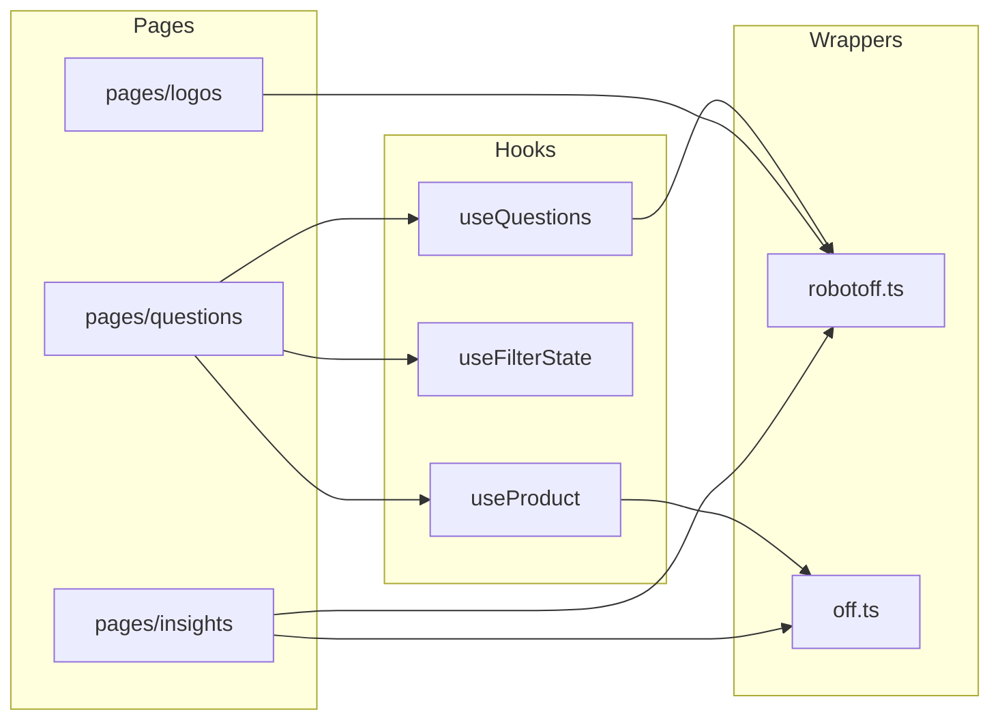

# Phase 5 — Visite du dépôt

> **Open Food Facts Hunger Games — Onboarding contributeur**
>
> Suite de [Phase 4 — Modèle mental d'architecture](./phase-4-architecture.md)
>
> Cette phase cartographie **où vit le code**, **ce qui va où**, et **comment le nommage fonctionne réellement** dans ce dépôt — pas un dump exhaustif de l'arborescence.

---

## La carte en un coup d'œil

```
hunger-games/
├── public/              # Enveloppe statique (favicon, service worker, manifest)
├── src/
│   ├── index.tsx        # Point d'entrée React
│   ├── App.jsx          # Providers + routes (enveloppe)
│   ├── const.ts         # URLs API + constantes d'annotation
│   ├── robotoff.ts      # Wrapper API Robotoff
│   ├── off.ts           # Wrapper API Open Food Facts
│   ├── offSearch.ts     # Autocomplétion taxonomie
│   ├── offTaxonomy.ts   # Helper de récupération taxonomie
│   ├── externalApi.ts   # Outils externes (NutriPatrol)
│   ├── localeStorageManager.ts  # Paramètres localStorage + favoris
│   ├── i18n.ts          # Bootstrap i18next
│   ├── utils.ts         # Helpers partagés (formatage value_tag)
│   ├── pages/           # Mini-jeux (un dossier ≈ une route)
│   ├── components/      # UI partagée
│   ├── hooks/           # Logique d'état partagée
│   ├── contexts/        # Contexte React transversal
│   ├── assets/          # Images bundlées + JSON générés
│   ├── i18n/            # JSON de traduction UI (Crowdin)
│   ├── types/           # Déclarations TS ambiantes
│   └── utils/           # Utilitaires ciblés
├── update-countries.js  # Régénère countries.json
├── update-nutriments.js # Régénère nutriments.json
├── vite.config.mjs
├── package.json
└── docs/onboarding/     # Cette série (docs contributeur locales)
```

**FAIT :** Sous `src/`, les extensions se comptent approximativement **59 `.tsx`**, **44 `.ts`**, **19 `.jsx`**, **5 `.js`** — majoritairement TypeScript avec des enclaves JS délibérées.

---

## Fichiers `src/` de premier niveau — la colonne vertébrale

Ces fichiers constituent **l'épine dorsale**. La plupart des travaux sur les fonctionnalités touchent `pages/` ou `hooks/`, mais vous importerez constamment depuis ici.

### `src/index.tsx`

| | |
|---|---|
| **Pourquoi il existe** | Monter React, envelopper router + Matomo |
| **Ce qui va ici** | Câblage d'entrée uniquement |
| **Ce qui n'y va PAS** | Logique de jeu, appels API |
| **Dépend de lui** | Vite via `index.html` |
| **Modifier quand** | Ajout de providers globaux (rare ; préférer `App.jsx`) |

### `src/App.jsx`

| | |
|---|---|
| **Pourquoi il existe** | Pile de providers, thème MUI, table de routes, rafraîchissement login |
| **Ce qui va ici** | Routage et enveloppe applicatifs |
| **Ce qui n'y va PAS** | UI par jeu |
| **Dépend de lui** | Chaque route |
| **Modifier quand** | Nouvelle route de premier niveau, garde d'authentification, provider global |

**Note :** Toujours en `.jsx` malgré son rôle central — **enveloppe legacy / stable**, pas un signal que les nouvelles routes doivent être en JSX.

### `src/const.ts`

| | |
|---|---|
| **Pourquoi il existe** | Source unique pour les URLs de base API et les entiers d'annotation |
| **Ce qui va ici** | Constantes de niveau environnement (`ROBOTOFF_API_URL`, `CORRECT_INSIGHT`, …) |
| **Ce qui n'y va PAS** | Config spécifique à une fonctionnalité |
| **Modifier quand** | Nouveau endpoint API global ou constante partagée entre jeux |

**CONTRAT-EXTERNE :** Les constantes d'URL reflètent les services de production — traiter les modifications comme à fort impact.

### `src/robotoff.ts`

| | |
|---|---|
| **Pourquoi il existe** | **Toute l'intégration Robotoff** — types + méthodes client |
| **Ce qui va ici** | Formes requête/réponse Robotoff, appels SDK + axios |
| **Ce qui n'y va PAS** | Lectures produit OFF, hooks React |
| **Dépend de lui** | Questions, logos, insights, dashboards, green-score |
| **Modifier quand** | Nouveau endpoint Robotoff, extension de `QuestionInterface`, paramètres de filtre |

Exporte aussi `FilterState` utilisé dans les hooks et le parsing d'URL.

### `src/off.ts`

| | |
|---|---|
| **Pourquoi il existe** | **Helpers lecture/écriture Open Food Facts** |
| **Ce qui va ici** | Récupération produit, requêtes search.pl, helpers patch v3, constructeurs d'URL |
| **Ce qui n'y va PAS** | Annotations Robotoff |
| **Modifier quand** | Nouveau champ OFF nécessaire dans les barres latérales, recherche produit, mutations OFF directes |

Export par défaut : instance `offService`. Export nommé : `offClient` (SDK) pour l'autocomplétion.

### `src/offSearch.ts` & `src/offTaxonomy.ts`

| | |
|---|---|
| **Pourquoi ils existent** | Autocomplétion taxonomie + métadonnées de tags |
| **Ce qui va ici** | Wrappers axios légers vers search-a-licious / taxonomie OFF v2 |
| **Modifier quand** | Sélecteurs de filtre, affichage taxonomie |

### `src/externalApi.ts`

| | |
|---|---|
| **Pourquoi il existe** | Actions qui quittent Hunger Games (onglets NutriPatrol) |
| **Ce qui va ici** | Intégrations hors OFF/hors Robotoff |
| **Modifier quand** | Nouveau schéma de lien vers un outil externe |

### `src/localeStorageManager.ts`

| | |
|---|---|
| **Pourquoi il existe** | Persister les paramètres utilisateur + filtres de questions sauvegardés |
| **Ce qui va ici** | Clés `localStorage`, `getLang()`, favoris |
| **Ce qui n'y va PAS** | Cache serveur (utiliser React Query) |
| **Modifier quand** | Nouveau toggle de paramètres, ordre de résolution de langue |

**FAIT :** Paramètres stockés sous la clé `hunger-game-settings` (« game » au singulier).

### `src/i18n.ts` + `src/i18n/*.json`

| | |
|---|---|
| **Pourquoi ils existent** | Textes UI Hunger Games en plusieurs langues |
| **Ce qui va ici** | Config i18next + fichiers de traduction |
| **Ce qui n'y va PAS** | Chaînes de questions Robotoff |
| **Modifier quand** | Labels UI ; ajouts de locales volumineux via workflow Crowdin |

**FAIT :** ~150+ fichiers JSON de locale — ne pas éditer manuellement toutes les langues pour de petits changements ; anglais + Crowdin est le workflow habituel.

### `src/utils.ts` vs `src/utils/`

| Emplacement | Rôle |
|---|---|
| `src/utils.ts` | `reformatValueTag`, `removeEmptyKeys` — utilisés par les wrappers API |
| `src/utils/` | Modules ciblés (`useLocalStorageState`, `getCountryName`, …) |

**INFÉRENCE :** Préférer `src/utils/` pour les nouveaux helpers autonomes ; étendre `utils.ts` uniquement pour rejoindre le cluster existant d'helpers API.

---

## `src/pages/` — mini-jeux

**Convention :** Un dossier par expérience de route, généralement avec `index.tsx` ou `index.jsx`.

| | |
|---|---|
| **Pourquoi il existe** | Jeux d'annotation orientés utilisateur |
| **Ce qui va ici** | Layout spécifique à la route, composants locaux, utils de jeu |
| **Ce qui n'y va PAS** | Widgets partagés utilisés par 3+ jeux (→ `components/`) |
| **Modifier quand** | Construction ou correction d'un jeu spécifique |

### Nommage des dossiers

| Motif | Exemples | Classification |
|---|---|---|
| **kebab-case** | `green-score/`, `ingredient-spellcheck/`, `not-found/` | **Dominant pour les routes multi-mots** |
| **mot unique** | `home/`, `logos/`, `questions/`, `nutrition/` | Courant |
| **fichier PascalCase à la racine** | `GalaPage.tsx` | **INCOHÉRENT** — one-off legacy |

### Motif de fichier d'entrée

| Motif | Exemples |
|---|---|
| `index.tsx` / `index.jsx` | `questions/`, `home/`, `insights/` |
| Page nommée à la racine de `pages/` | `GalaPage.tsx` |

**RECOMMANDATION pour les nouvelles pages :** `src/pages/<kebab-name>/index.tsx` + import lazy dans `App.jsx`.

### Pages par rôle architectural

| Dossier | Route(s) | Rôle | Priorité d'apprentissage |
|---|---|---|---|
| **`questions/`** | `/questions` | File d'attente oui/non Robotoff centrale | **Commencer ici** |
| **`home/`** | `/` | Page d'accueil, favoris, cartes | Secondaire |
| **`insights/`** | `/insights` | Parcourir les enregistrements d'insights (admin-ish) | Plus tard |
| **`logos/`** | `/logos/*` | Recherche/annotation de logos (JSX) | Après questions |
| **`logosValidator/`** | `/dashboard/:id` | Dashboards de questions logo de campagne | Plus tard |
| **`green-score/`** | `/green-score` | Lanceur de questions eco-score | Variante du motif questions |
| **`nutrition/`** | `/nutrition` | Hôte de webcomponent | Motif embarqué |
| **`ingredient-*`** | spellcheck, detection | Hôtes de webcomponents | Motif embarqué |
| **`ingredients/`** | `/ingredients` | Édition ingrédients OFF v3 | Écriture OFF directe |
| **`packaging/`** | `/packaging` | Édition emballage OFF v3 | Écriture OFF directe |
| **`settings/`** | `/settings` | localStorage + toggles dev | UX contributeur |
| **`loader/`** | (partagé) | Composant page spinner | Utilitaire |
| **`shouldLoggedinPage/`** | (garde) | Invite de connexion | Utilitaire |
| **`bug/`**, **`Brandinator/`**, **`GalaPage.tsx`** | divers | Expériences / événements | **IGNORER POUR L'INSTANT** |

### `questions/` — l'implémentation de référence

```
questions/
├── index.tsx              # Grille de layout
├── QuestionDisplay.tsx    # UI de jeu principale + useQuestions
├── QuestionFilter.tsx     # Puces de filtre (spécifique page mais réexporté)
├── FilterDialog.tsx
├── ProductInformation.tsx # Barre latérale OFF
├── UserData.tsx           # Compteurs + réponses récentes
├── SimilarQuestions.tsx   # Navigation état vide
├── DebugQuestion.tsx      # Accordéon détail insight dev
├── useKeyboardShortcuts.ts
├── utils.ts
└── utils/getValueTagQuestionsURL.ts
```

**Lors d'une contribution à l'UX d'annotation centrale, attendez-vous à toucher ce dossier en premier.**

---

## `src/components/` — UI partagée

| | |
|---|---|
| **Pourquoi il existe** | Réutilisation entre plusieurs pages |
| **Ce qui va ici** | AppBar, Footer, widgets image, modales, blocs de construction de filtres |
| **Ce qui n'y va PAS** | Flux de jeu complets |
| **Modifier quand** | Changement UX partagé (accessibilité, layout, contrôles de filtre) |

### Composants notables

| Fichier / dossier | Objectif |
|---|---|
| `ResponsiveAppBar.tsx` | Menu nav + pays + login |
| `QuestionCard.tsx`, `SmallQuestionCard.tsx` | Cartes accueil / green-score liant vers questions filtrées |
| `CroppedLogo.tsx` | URL crop Robotoff pour bounding box d'insight |
| `ZoomableImage.tsx` | Photos produit pinch/zoom |
| `AnnotateLogoModal.tsx` | Dialogue d'annotation de logos en lot |
| `OffWebcomponents.tsx` | Chargeur de web components + wrappers |
| `QuestionFilter/` | Constantes de filtre, filtres marque/label, favoris |
| `Footer/` | Liens communauté |
| `welcome/` | Tour d'onboarding |

### Frontière floue (FAIT)

`components/QuestionFilter/index.js` réexporte **`pages/questions/QuestionFilter.tsx`**.

**INFÉRENCE :** Déplacement historique — l'UI de filtre a commencé dans la page questions et a été partiellement partagée. Lors de l'édition des filtres, vérifier **les deux** chemins.

### Enclave JSX dans components

Toujours en JSX : `LogoForm.jsx`, `LogoGrid.jsx`, `LogoSearchForm.jsx`, certains liens Footer, `welcome/Welcome.jsx`.

**INFÉRENCE :** Le sous-système logo a migré plus lentement que questions/nutrition.

---

## `src/hooks/` — logique partagée

| | |
|---|---|
| **Pourquoi il existe** | État réutilisable + récupération de données |
| **Ce qui va ici** | `useQuestions`, `useProductData`, `useFilterState`, Matomo |
| **Ce qui n'y va PAS** | Effets de page ponctuels |
| **Modifier quand** | Changement de clés de cache, comportement de fetch partagé |

```
hooks/
├── useQuestions.ts          # File d'attente de questions centrale
├── useProduct.ts            # Produit OFF par code-barres
├── useProductQuestions.ts   # Questions par produit
├── useOptions.ts
├── matomoEvents.ts
├── useUrlParams.js          # JS legacy
├── useFilterState/
│   ├── useFilterState.ts
│   └── getFilterParams.ts   # Mapping URL ↔ FilterState
└── matomo/
```

**Convention de nommage (confiance ÉLEVÉE) :** hooks **`use` + PascalCase** → `useQuestions`, `useFilterState`.

---

## `src/contexts/`

| | |
|---|---|
| **Pourquoi il existe** | État non-URL applicatif (auth, toggle thème, mode dev, pays) |
| **Ce qui n'y va PAS** | Données Robotoff/OFF récupérées |

| Fichier / dossier | Motif d'export |
|---|---|
| `login.tsx` | Contexte par défaut |
| `devMode.tsx` | Contexte par défaut |
| `colorMode.tsx` | Contexte par défaut |
| `CountryProvider/` | Dossier avec barrel `index.ts` |

**Convention :** noms de fichiers contexte en minuscules (`login.tsx`) sauf providers en dossier (`CountryProvider/`).

---

## `src/assets/` — données statiques bundlées

| | |
|---|---|
| **Pourquoi il existe** | Images pour la page d'accueil + listes JSON **générées** |
| **Ce qui va ici** | `countries.json`, `nutriments.json`, SVG/PNG marketing |
| **Ce qui n'y va PAS** | Taxonomie maintenue manuellement de tous les labels OFF (trop volumineuse) |
| **Modifier quand** | Art UI ; exécuter `yarn countries` / `yarn nutriments` pour rafraîchir les données |

**FAIT :** `countries.json` / `languages.json` proviennent de `static.openfoodfacts.org` via les scripts racine.

---

## `src/types/`

| Fichier | Objectif |
|---|---|
| `openfoodfacts-webcomponents.d.ts` | Shim de module (`declare module "…"`) |
| `off-webcomponents.d.ts` | (si présent) Éléments intrinsèques JSX |

**Ce qui va ici :** déclarations ambiantes uniquement — pas de code runtime.

---

## Fichiers d'outillage racine (pas `src/`)

| Fichier | Rôle |
|---|---|
| `vite.config.mjs` | Build, copie assets webcomponents, nommage chunks i18n |
| `eslint.config.mjs` | TS strict pour `.ts/.tsx` ; JS utilise recommended uniquement |
| `tsconfig.json` | `"allowJs": true`, `"strict": true`, pas d'émission |
| `tslint.json` | **OBSOLÈTE ?** — ESLint est actif en CI ; tslint probablement legacy |
| `knip.json` | Détection de code mort (`yarn knip`) |
| `netlify.toml` | Config hébergement statique |
| `deploy.sh` | Copies HTML fallback SPA post-build |

---

## Audit des conventions de nommage du codebase (condensé)

*Audit en lecture seule selon les preuves du dépôt. Aucun renommage effectué.*

### Matrice des conventions de nommage

| Catégorie | Convention prouvée | Preuve | Confiance |
|---|---|---|---|
| Dossiers de pages | kebab-case | `green-score/`, `ingredient-spellcheck/` | **ÉLEVÉE** |
| Composants React | Fichier PascalCase | `QuestionDisplay.tsx`, `LogoGrid.jsx` | **ÉLEVÉE** |
| Hooks | `use` + camelCase | `useQuestions.ts`, `useFilterState.ts` | **ÉLEVÉE** |
| Wrappers API | camelCase minuscule à la racine `src/` | `robotoff.ts`, `off.ts` | **ÉLEVÉE** |
| Fichier de constantes | `const.ts`, exporte `SCREAMING_SNAKE` | `CORRECT_INSIGHT`, `OFF_API_URL` | **ÉLEVÉE** |
| Modules contexte | mot unique minuscule | `login.tsx`, `devMode.tsx` | **MOYENNE** |
| Paramètres query URL | snake_case | `value_tag`, `type` via `getFilterParams` | **ÉLEVÉE** |
| Champs TS FilterState | camelCase | `insightType`, `valueTag` | **ÉLEVÉE** |
| Fichiers i18n | JSON code locale | `en.json`, `pt_BR.json` | **ÉLEVÉE** |
| Champs Robotoff/API | snake_case | `insight_id`, `value_tag` dans les interfaces | **CONTRAT-EXTERNE** |

### TypeScript vs JavaScript — ce que cela signifie

| Observation | Classification |
|---|---|
| ~63 % TS/TSX vs ~24 % JS/JSX | Migration incrémentale, orienté TS |
| ESLint strict uniquement sur `{ts,tsx}` | Le nouveau code typé a des vérifications plus strictes |
| `allowJs: true` dans tsconfig | Les fichiers JS restent de première classe |
| Enveloppe centrale `App.jsx` toujours en JS | **Legacy stable** — pas un motif à copier |
| Îlots entiers `logos/*.jsx`, `insights/*.jsx` | **Sous-systèmes historiques** |
| Jeux plus récents (`questions`, `packaging`, `nutrition`, `settings`) en TSX | **Direction actuelle** |

**Verdict : MAJORITAIREMENT ALIGNÉ** — les extensions mixtes sont une **migration incrémentale intentionnelle**, pas une dérive aléatoire.

**Règle contributeur :** **Correspondre au fichier que vous éditez.** Nouvelles pages substantielles → préférer **`.tsx`**. Ne pas convertir en masse JSX → TSX dans l'onboarding ou des PRs opportunistes.

### Incohérences notables (comprendre, ne pas « corriger » pour l'instant)

| Nom | Emplacement | Problème | Priorité |
|---|---|---|---|
| `IngeredientDisplay.tsx` | `pages/ingredients/` | Faute « Ingredient » | POLISH OPTIONNEL |
| `setIngedrient` | `off.ts` | Faute dans méthode publique | **CONTRAT-EXTERNE** — nombreux appelants |
| `campagnes` | `QuestionFilter/const.ts` | Orthographe française vs `campaign` anglais ailleurs | VARIANTE ACCEPTABLE |
| `dasboardId` | param route `App.jsx` | Faute « dashboard » | Param URL incohérent |
| `hunger-game-settings` | clé localStorage | « game » singulier vs dépôt « hunger-games » | **CONTRAT-EXTERNE — NE PAS RENOMMER** |
| `GalaPage.tsx` à la racine pages | vs motif dossier | Incohérence structurelle | BASELINE |
| `google-could-vision` | valeur filtre predictor | Probable faute pour « cloud » | **CONTRAT-EXTERNE** — correspond à la chaîne predictor Robotoff ? vérifier avant changement |

### Noms trompeurs à surveiller (sécurité contributeur)

| Symbole | Risque |
|---|---|
| `robotoff.questions()` vs SDK `questionsByProductCode` | Deux endpoints différents — similarité de nom |
| `FilterState` dans `robotoff.ts` vs `QuestionFilter/const.ts` | **Types différents** avec noms qui se chevauchent |
| import par défaut `off` vs `offClient` | Instance service vs client SDK |

---

## Qui dépend de quoi (navigation contributeur)



---

## Quand modifier chaque zone ?

| Vous voulez… | Commencer ici |
|---|---|
| Corriger file oui/non / recharge / cache | `hooks/useQuestions.ts`, `pages/questions/` |
| Changer les paramètres URL de filtre | `hooks/useFilterState/getFilterParams.ts`, `QuestionFilter/` |
| Ajouter une méthode API Robotoff | `robotoff.ts` |
| Afficher plus de champs produit dans la barre latérale | `off.ts` (champs `getProduct`), `ProductInformation.tsx` |
| Nouvelle route de jeu de premier niveau | `pages/<name>/`, `App.jsx`, `ResponsiveAppBar.tsx`, `i18n/en.json` |
| Garde de connexion | `App.jsx`, `contexts/login.tsx`, `shouldLoggedinPage/` |
| Traduction UI | `src/i18n/en.json` (+ Crowdin pour les autres locales) |
| Comportement filtre pays | `CountryProvider/`, `assets/countries.json` |
| UX annotation logo | `pages/logos/`, `components/LogoGrid.jsx`, `AnnotateLogoModal.tsx` |
| Table admin insights | `pages/insights/` |
| Thème global | `App.jsx` `getToken` |
| Problème CI/build | `vite.config.mjs`, `.github/workflows/ci-cd.yml` |

---

## Protection de l'espace mental

### À COMPRENDRE MAINTENANT

1. **`src/robotoff.ts` + `src/hooks/useQuestions.ts` + `src/pages/questions/`** = chemin d'annotation central.
2. **`pages/` = jeux**, **`components/` = partagé**, **`hooks/` = logique de données partagée**.
3. Les filtres vivent dans l'**URL** (`getFilterParams`) + **`FilterState` dans robotoff.ts**.
4. Nouveau code → **TSX** ; respecter les **îlots JSX** (logos, insights).
5. **`components/QuestionFilter` ↔ `pages/questions/QuestionFilter`** particularité de réexport.

### UTILE PLUS TARD

- `logosValidator/dashboardDefinition.ts` (fichier config volumineux)
- Pages `Brandinator/`, `GalaPage`, `bug/`
- `knip` pour les exports inutilisés
- `l10n-shortcuts.ts` localisation clavier

### IGNORER POUR L'INSTANT

- Fichiers individuels dans `src/i18n/` sauf `en.json` pour référence
- Chaque asset SVG de la page d'accueil
- `pages/data.json`
- `tslint.json`

---

## Résumé Phase 5 — cinq choses à retenir

1. **Fichiers colonne vertébrale à la racine `src/`** — `App.jsx`, `robotoff.ts`, `off.ts`, `const.ts`, `localeStorageManager.ts`.
2. **`pages/<game>/`** est où vit le travail orienté utilisateur ; **`questions/` est le modèle**.
3. **UI partagée → `components/`**, **fetch partagé → `hooks/`** — ne pas dupliquer la logique de file dans les pages.
4. **TypeScript est la direction**, mais **les pages JSX logo/insights restent critiques en production**.
5. **Le nommage a des fautes legacy et des chaînes verrouillées par contrat** — corriger le comportement d'abord, renommer uniquement avec accord des mainteneurs.

### Incertitudes

- **INCONNU :** Si la faute `google-could-vision` correspond à l'id predictor stocké par Robotoff (doit être vérifié contre l'API avant renommage).
- **INFÉRENCE :** `tslint.json` est legacy inutilisé — ESLint l'a remplacé en CI.

---

## Et ensuite

**Phase 6 — Cartographier les mini-jeux**

Identifier les jeux actifs depuis les routes + nav de production, les regrouper en familles (questions génériques, logos, ingrédients, nutrition, nettoyage données produit), et choisir **un ou deux jeux** à apprendre en premier — ignorer le reste temporairement.

---

*Arrêtez-vous ici. Prenez un chemin de fichier depuis une URL de production (ex. `/questions?type=brand`) et tracez quels dossiers vous ouvririez. Quand cela prend moins de 30 secondes mentalement, continuez vers la Phase 6.*
