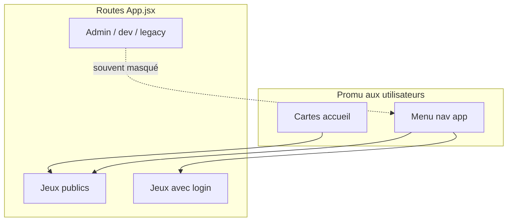
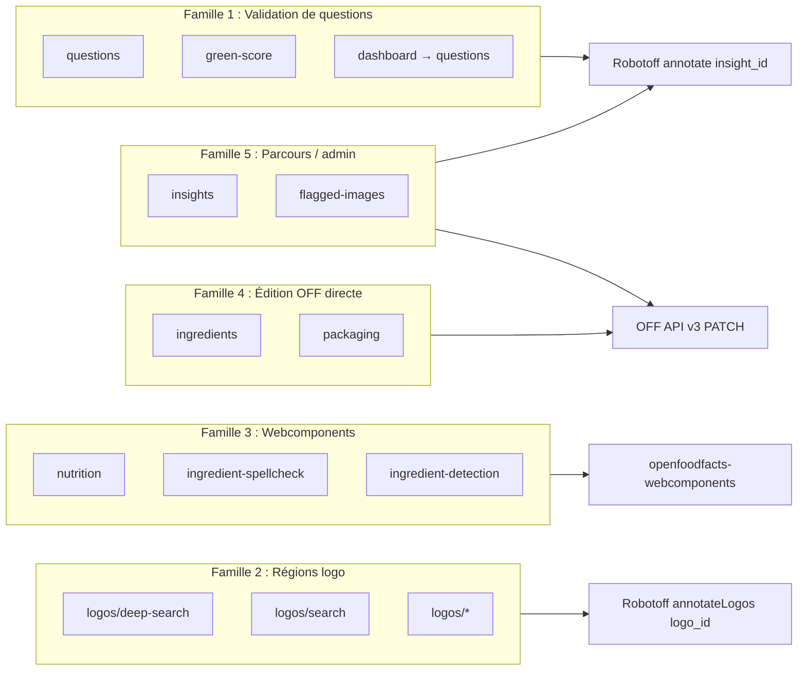
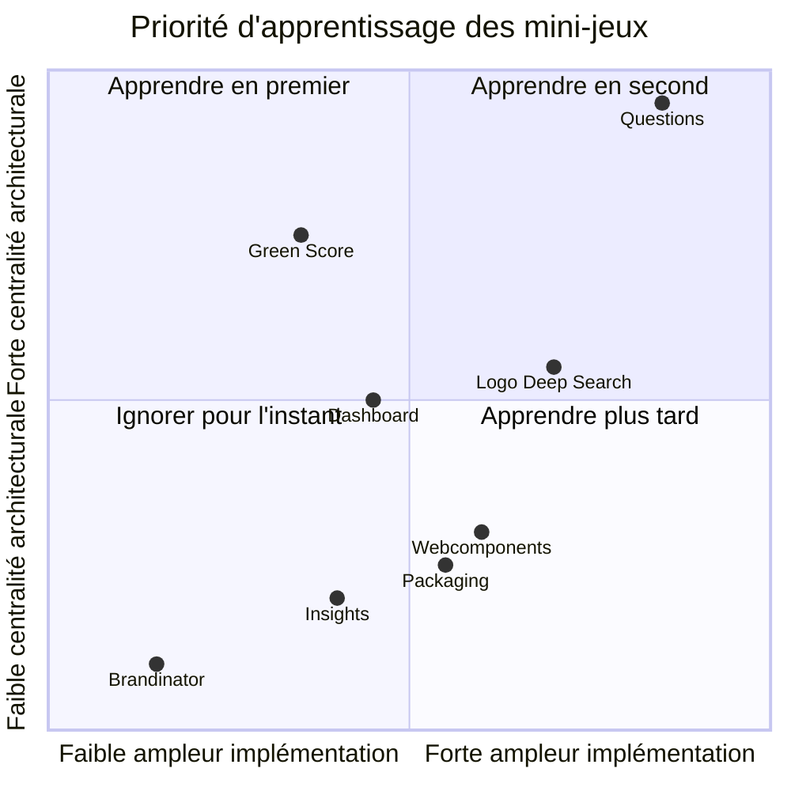

# Phase 6 — Cartographier les mini-jeux

> **Open Food Facts Hunger Games — Onboarding contributeur**
>
> Suite de [Phase 5 — Visite du dépôt](./phase-5-repository-tour.md)
>
> Preuves : `src/App.jsx`, `src/pages/home/homeCards.jsx`, `src/components/ResponsiveAppBar.tsx`, implémentations par page, homepage `package.json`.

---

## Ce que signifie « mini-jeu » ici

Chaque route sous `src/pages/` est une **expérience d'annotation ciblée** — pas une application déployée séparément. Elles partagent :

- la même enveloppe React (`App.jsx`)
- les mêmes cookies de session OFF
- souvent les mêmes wrappers `robotoff.ts` / `off.ts`

Mais elles ciblent **des problèmes de données différents** et utilisent **des mécaniques d'interaction différentes**.

Cette phase répond à :

1. Quels jeux sont **réellement routés et promus** aujourd'hui ?
2. À quelle **famille** appartient chacun ?
3. Lesquels **un ou deux** enseignent l'architecture centrale ?

---

## Qu'est-ce qui est « actif » en production ?

**FAIT :** L'URL de production est `https://hunger.openfoodfacts.org` (homepage `package.json`).

Un jeu est **actif** s'il a :

- une **Route** dans `App.jsx`, et/ou
- une **carte page d'accueil** dans `homeCards.jsx`, et/ou
- une **entrée menu nav** dans `ResponsiveAppBar.tsx`

Certaines routes existent mais sont **masquées** (mode dev, admin uniquement, expérimental, ou legacy).



---

## Table maîtresse des routes

| Route | Dossier page | Sur accueil ? | Dans nav ? | Login ? | Statut |
|---|---|---|---|---|---|
| `/` | `home/` | — | logo → accueil | Non | **Actif** |
| `/questions` | `questions/` | Mis en avant | Oui | Non | **Actif — central** |
| `/questions?type=…` | (même) | Nombreuses cartes | via liens | Non | **Actif — variantes filtrées** |
| `/green-score` | `green-score/` | Mis en avant | Oui | Non | **Actif — lanceur** |
| `/eco-score` | → green-score | — | — | Non | Route alias |
| `/logos/deep-search` | `logos/LogoDeepSearch.jsx` | Mis en avant | Oui | **Oui** | **Actif** |
| `/logos/search` | `logos/LogoSearch.jsx` | — | Oui | **Oui** | **Actif** |
| `/logos/product-search` | `logos/ProductLogoAnnotations.jsx` | — | Oui | **Oui** | **Actif** |
| `/logos` | `logos/LogoAnnotation.jsx` | — | Oui (devMode) | **Oui** | **Menu dev uniquement** |
| `/logos/:logoId` | `logos/LogoUpdate.jsx` | — | — | **Oui** | **Actif** (lien profond) |
| `/nutrition` | `nutrition/` | Mis en avant | Oui (desktop) | **Oui** | **Actif — webcomponent** |
| `/ingredient-spellcheck` | `ingredient-spellcheck/` | Mis en avant | Oui | Non | **Actif — webcomponent** |
| `/ingredient-detection` | `ingredient-detection/` | Mis en avant | Oui | Non | **Actif — webcomponent** |
| `/ingredients` | `ingredients/` | — | **Pas dans nav** | Non | **Actif mais faible découvrabilité** |
| `/packaging` | `packaging/` | — | **Pas dans nav** | **Oui** | **Actif mais masqué** |
| `/dashboard`, `/dashboard/:id` | `logosValidator/` | — | Oui | Non | **Actif — hub campagne** |
| `/nutriscore`, `/inao` | → DashBoard | — | — | Non | **Redirections legacy** |
| `/insights` | `insights/` | — | Oui (devMode) | Non | **Power-user / dev** |
| `/settings` | `settings/` | — | Nav mobile | Non | **Actif** |
| `/flagged-images` | `flaggedImages/` | — | — | Utilisateur admin | **Admin uniquement** |
| `/brandinator` | `Brandinator/` | — | — | Non | **Expérimental** |
| `/gala` | `GalaPage.tsx` | — | — | Non | **Page événement** |
| `/bugs` | `bug/` | — | — | Non | **Test API interne** |
| `/logoQuestion` | `LogoQuestionValidator/` | — | — | — | **Route commentée** |

**Externe (pas Hunger Games) :** les cartes accueil lient vers Open Prices (`prices.openfoodfacts.org`) — projet séparé.

---

## Familles conceptuelles

Ne traitez pas chaque dossier comme une architecture unique. La plupart des jeux tombent dans **cinq familles** plus des utilitaires.



---

## Famille 1 — Validation générique de questions / insights Robotoff

**Mécanisme partagé :** `useQuestions` → `robotoff.questions()` → Oui/Non/Passer → `robotoff.annotate(insight_id, …)`.

### 1. Questions (`/questions`) — **LE jeu de référence**

| | |
|---|---|
| **Problème de données** | Valider les affirmations ML : labels, marques, catégories, emballage, poids, … |
| **L'utilisateur voit** | Phrase de question, photo produit, puce valeur, Oui/Non/Passer |
| **Consomme** | Robotoff `/questions/` ; barre latérale produit OFF |
| **Produit** | Annotation `0` / `1` / `-1` sur `insight_id` |
| **Mécanisme** | **Générique** — `useQuestions.ts` |
| **Représentatif ?** | **Oui — apprendre ceci en premier** |

**FAIT :** Filtre via URL (`type`, `value_tag`, `country`, `campaign`, `predictor`).

### 2. Variantes de questions filtrées (même page)

Les cartes accueil lient vers **`/questions?type=…`** — pas d'implémentations séparées.

| Carte accueil | Filtre | Type d'insight |
|---|---|---|
| Marques | `?type=brand` | brand |
| Labels | `?type=label` | label |
| Poids | `?type=product_weight` | product_weight |
| Emballage | `?type=packaging` | packaging |
| Projets sœurs | `?type=category&value_tag=en:open-beauty-facts` etc. | category |

**Architecturalement :** identique à Questions — seuls les paramètres query diffèrent.

### 3. Green Score (`/green-score`)

| | |
|---|---|
| **Problème de données** | Validation de **labels** liés à l'éco (bio, Fairtrade, MSC, …) |
| **L'utilisateur voit** | Grille de cartes label + filtre pays + liste `Opportunities` |
| **Consomme** | `robotoff.questions()` pour les compteurs ; liens vers `/questions` filtrées |
| **Produit** | Mêmes annotations une fois l'utilisateur dans Questions |
| **Mécanisme** | **Lanceur uniquement** — réutilise Questions + `SmallQuestionCard` / `Opportunities` |
| **Représentatif ?** | Bon **deuxième** pas — montre la composition de filtres sans nouvelle logique de réponse |

**FAIT** (`green-score/cards.tsx`) : chaque carte est un `filterState` prédéfini (`insightType: "label"`, `valueTag` spécifique).

### 4. Dashboards logo (`/dashboard`, `/dashboard/:dasboardId`)

| | |
|---|---|
| **Problème de données** | Validation en lot pour **de nombreux logos de certification** (Nutri-Score, AB Bio, …) |
| **L'utilisateur voit** | Dashboard à onglets de cartes logo avec compteurs de questions |
| **Consomme** | `dashboardDefinition.ts` (centaines de presets logo) ; `robotoff.questions()` |
| **Produit** | Liens vers `/questions?type=…&value_tag=…` ou `/logos/deep-search?…` |
| **Mécanisme** | **Lanceur campagne + config** — pas un pipeline d'annotation séparé |
| **Représentatif ?** | Utile pour comprendre les **campagnes** et le focus `value_tag` — ignorer la taille de config initialement |

**FAIT** (`DashboardCard.tsx`) : CTA principal → `/questions?…` ; secondaire → logo deep search.

**FAIT :** `LogoQuestionValidator` réutilise `useQuestions` avec `forcedParams` depuis la config logo du dashboard — mais sa **route est commentée** dans `App.jsx`. Le code reste comme UI alternative pour les mêmes données.

---

## Famille 2 — Annotation de régions logo / image

**Mécanisme partagé :** `robotoff.searchLogos()` → l'utilisateur sélectionne des logos bounding-box → `robotoff.annotateLogos()` ou `updateLogo()`.

Utilise **`logo_id` (numérique)**, pas `insight_id`.

### Logo Deep Search (`/logos/deep-search`) — **mis en avant sur l'accueil**

| | |
|---|---|
| **Problème de données** | Confirmer/infirmer les correspondances du détecteur de logo pour une valeur taxonomie |
| **L'utilisateur voit** | Grille de régions logo recadrées + formulaire d'annotation |
| **Consomme** | `robotoff.searchLogos(barcode, value, type)` |
| **Produit** | Annotations logo `{ logo_id, type, value }` |
| **Mécanisme** | **Spécialisé** — `LogoGrid`, `AnnotateLogoModal` |
| **Login** | Requis |
| **Représentatif ?** | Meilleur **deuxième chemin architectural** après Questions |

### Logo Search (`/logos/search`)

Même motif recherche/annotation avec requêtes pilotées par formulaire (`useUrlParams`).

### Product Logo Annotations (`/logos/product-search`)

Workflow d'annotation logo centré produit (JSX).

### Logo Annotation (`/logos`) — menu dev uniquement

**FAIT :** `devModeOnly: true` dans nav — masqué sauf mode dev + toggle visiblePages.

### Logo Update (`/logos/:logoId`)

Éditer un logo détecté spécifique via `robotoff.updateLogo`.

---

## Famille 3 — Jeux Robotoff hébergés par webcomponent

**Mécanisme partagé :** `OffWebcomponents.tsx` charge `@openfoodfacts/openfoodfacts-webcomponents` ; les appels Robotoff/OFF se font **à l'intérieur** de l'élément custom.

| Jeu | Route | Composant | Login |
|---|---|---|---|
| Nutrition | `/nutrition` | `<robotoff-nutrient-extraction>` | Oui |
| Correction orthographe ingrédients | `/ingredient-spellcheck` | `<robotoff-ingredient-spellcheck>` | Non |
| Détection ingrédients | `/ingredient-detection` | `<robotoff-ingredient-detection>` | Non |

| | |
|---|---|
| **Problème de données** | Extraction structurée : nutriments, OCR ingrédients, correction orthographique |
| **L'utilisateur voit** | UI de jeu complète dans le web component |
| **Consomme** | Robotoff + OFF (interne aux webcomponents) |
| **Produit** | Souvent `annotation=2` avec payload (API Robotoff) |
| **Mécanisme** | **Dépôt externe** — Hunger Games est hôte + filtre pays |
| **Représentatif ?** | Apprendre **après** Questions — les corrections peuvent nécessiter une **PR webcomponents** |

**FAIT** (`nutrition/index.tsx`) : enveloppe uniquement le webcomponent + autocomplétion pays.

---

## Famille 4 — Édition directe de produits Open Food Facts

**Mécanisme partagé :** Rechercher OFF pour produits incomplets → édition humaine des champs → **`PATCH /api/v3/product/{code}`**.

| Jeu | Route | Écrit |
|---|---|---|
| Ingrédients | `/ingredients` | `ingredients_text_{lang}` via `off.setIngedrient` |
| Emballage | `/packaging` | Structure `packagings` via axios PATCH |

| | |
|---|---|
| **Problème de données** | Produits sans texte ingrédients ou données emballage |
| **L'utilisateur voit** | File produit, images zoomables, tables/texte éditables |
| **Consomme** | Files OFF `search.pl` (`useData`, `useBuffer`) |
| **Produit** | Mutations OFF directes — **contourne annotate Robotoff** pour la sauvegarde |
| **Mécanisme** | **Éditeurs spécialisés** — différent de la validation d'insights |
| **Représentatif ?** | Important pour la littératie intégration OFF — **pas** le motif Questions central |

**FAIT :** Ingrédients appelle aussi Robotoff **`/predict/ingredient_list`** pour suggestions OCR (`useData.tsx`) — lecture hybride depuis Robotoff, écriture vers OFF.

---

## Famille 5 — Parcours / admin / modération

### Insights (`/insights`)

| | |
|---|---|
| **Problème de données** | Inspecter les enregistrements d'insights (type, état annotation, code-barres) |
| **L'utilisateur voit** | MUI DataGrid d'insights Robotoff |
| **Consomme** | `robotoff.getInsights()` |
| **Produit** | **Lecture seule** dans l'UI — liens vers édition produit / questions |
| **Nav** | devModeOnly |
| **Représentatif ?** | Débogage power-user — pas le chemin contributeur par défaut |

### Images signalées (`/flagged-images`)

| | |
|---|---|
| **Problème de données** | Modérer les mauvaises images signalées par les utilisateurs |
| **L'utilisateur voit** | Liste depuis l'API externe `amathjourney.com` |
| **Route** | Uniquement si username ∈ `ADMINS` dans `App.jsx` |
| **Représentatif ?** | **Ignorer pour l'onboarding** |

---

## Utilitaires & expériences (ignorer pour l'instant)

| Route | Objectif |
|---|---|
| `/settings` | Langue, thème, mode dev, pays |
| `/brandinator` | Liens leaderboard fun vers questions filtrées — pas de logique d'annotation |
| `/gala` | Tableau spécifique événement |
| `/bugs` | Boutons test manuel API OFF v3 |
| `/shouldLoggedinPage` | Garde invite de connexion |

---

## Table comparative — ce que chaque famille enseigne

| Famille | ID principal | API principale | Hub code HG | Cross-repo ? |
|---|---|---|---|---|
| Validation questions | `insight_id` | `robotoff.annotate` | `useQuestions.ts` | Rarement |
| Annotation logo | `logo_id` | `annotateLogos` | `LogoGrid.jsx` | Parfois Robotoff |
| Webcomponents | (interne) | (interne) | `OffWebcomponents.tsx` | **Souvent webcomponents** |
| Éditeurs OFF | `barcode` | OFF v3 PATCH | `off.ts`, buffers page | Sémantique API OFF |
| Parcours insights | `insight_id` | `getInsights` | `InsightsGrid.jsx` | Filtres Robotoff |

---

## Quels jeux apprendre en premier (recommandation explicite)

### Principal : **`/questions`**

**Pourquoi :**

- Utilise le **hook central** (`useQuestions`) et le **wrapper central** (`robotoff.annotate`)
- Montre **l'état filtre URL**, **file React Query**, **UI optimiste**, **barre latérale produit OFF**
- La plupart des issues contributeur touchent ce flux ou ses filtres
- La trace runtime Phase 7 suivra ce chemin

**Fichiers à étudier :**

```
src/pages/questions/QuestionDisplay.tsx
src/hooks/useQuestions.ts
src/hooks/useFilterState/
src/robotoff.ts
```

### Secondaire (choisir un) : **`/green-score`** OU **`/logos/deep-search`**

| Option | Apprendre quoi |
|---|---|
| **Green Score** | Comment les **lanceurs** composent les filtres et lient vers Questions — code minimal nouveau |
| **Logo Deep Search** | Deuxième pipeline d'annotation (`logo_id`, `searchLogos`, `annotateLogos`) |

**RECOMMANDATION :** Après Questions, faire **Green Score** si vous voulez plus de motifs questions Robotoff ; faire **Logo Deep Search** si vous voulez de la couverture sur les surfaces API.

### Ignorer temporairement

| Jeu | Raison |
|---|---|
| Toutes les entrées `/dashboard` logo | Bruit config — comprendre le motif lanceur depuis une carte |
| Nutrition / spellcheck / detection | Logique dans webcomponents |
| Éditeurs packaging / ingrédients | Chemin PATCH OFF — arbre de compétences différent |
| Insights | Parcours admin — pas UX annotation |
| Brandinator, Gala, bugs, flagged-images | Non central |

---

## Comment accueil vs nav vs routes peuvent diverger

| Observation | Classification |
|---|---|
| L'accueil promeut `/logos/deep-search` mais pas `/logos/search` | **INFÉRENCE :** deep search est le jeu logo citoyen principal |
| `/ingredients` routé mais pas dans nav | **FAIT :** écart de découvrabilité — la page fonctionne toujours |
| `/packaging` avec login, pas sur accueil | **FAIT :** outil contributeur avancé |
| Insights + annotate logo dans nav uniquement avec devMode | **FAIT :** activé dans Paramètres |
| Cartes Open Prices sur accueil | **Externe** — pas ce dépôt |

Activez le **mode dev** dans Paramètres pour voir Insights et `/logos` annotate dans nav lors de l'exploration locale.

---

## Résumé représentatif architectural



*(Graphique qualitatif — pour l'intuition, pas des métriques.)*

---

## Protection de l'espace mental

### À COMPRENDRE MAINTENANT

1. **La plupart des « jeux » sont soit Questions avec filtres soit l'une des quatre familles mécaniques.**
2. **`/questions` est le cœur architectural** — tout dans la Famille 1 passe par lui ou copie ses hooks.
3. **Les jeux logo utilisent un ID et une API différents** des questions Oui/Non.
4. **Les jeux webcomponents sont hébergés, pas implémentés, dans ce dépôt.**
5. **Packaging/ingrédients écrivent directement vers OFF** — différent de `robotoff.annotate`.

### UTILE PLUS TARD

- `LogoQuestionValidator` (route désactivée, même `useQuestions`)
- Config campagne `dashboardDefinition.ts`
- Hybride predict Robotoff + écriture OFF dans ingrédients
- Pipeline admin flagged-images

### IGNORER POUR L'INSTANT

- Entrées dashboard logo individuelles (100+)
- Brandinator, Gala, bugs
- Cartes externes Open Prices
- Routes legacy `/nutriscore`, `/inao`

---

## Résumé Phase 6 — cinq choses à retenir

1. **~15 expériences routées**, mais seulement **~5 motifs mécaniques**.
2. **Questions + URLs filtrées** sont l'UX de validation Robotoff par défaut.
3. **Green Score / Dashboard** sont des lanceurs — pas des moteurs d'annotation séparés.
4. **Logo deep search** est le principal chemin API Robotoff alternatif (`logo_id`).
5. **Apprendre Questions en premier**, puis soit Green Score (même famille) soit Logo Deep Search (deuxième famille).

### Incertitudes

- **INCONNU :** Quels jeux les mainteneurs priorisent pour l'investissement UX (README mentionne la charge cognitive globalement).
- **INFÉRENCE :** `LogoQuestionValidator` peut revenir si l'UX grille batch est à nouveau nécessaire — route actuellement désactivée.

---

## Et ensuite

**Phase 7 — Flux runtime central : répondre à une question Robotoff**

Trace approfondie depuis l'ouverture de `/questions` à travers filtres → fetch → rendu → annotate → mises à jour React Query → recharge → Matomo — avec fonctions exactes, clés query, et classification optimiste/pessimiste.

---

*Arrêtez-vous ici. Ouvrez mentalement https://hunger.openfoodfacts.org/questions : identifiez dans quelle famille vous êtes, quel type d'ID vous annoteriez, et quelle API recevrait votre clic. Puis continuez vers la Phase 7.*
