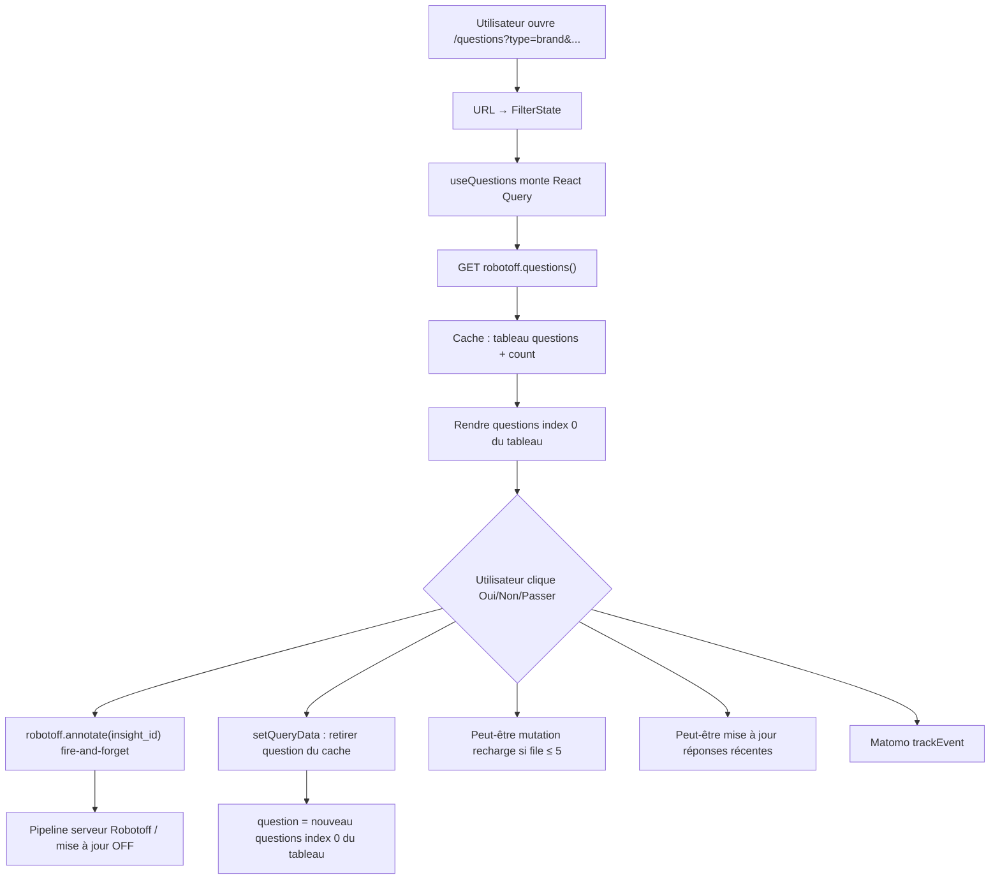
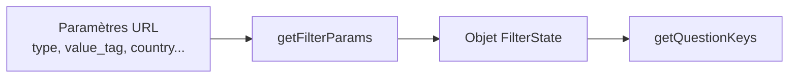
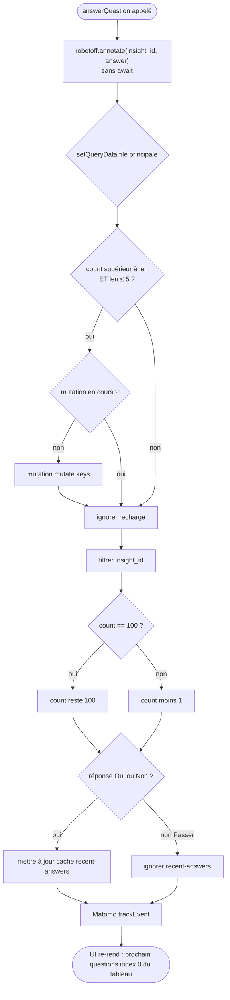

# Phase 7 — Flux runtime central : répondre à une question Robotoff

> **Open Food Facts Hunger Games — Onboarding contributeur**
>
> Suite de [Phase 6 — Cartographier les mini-jeux](./phase-6-mini-games.md)
>
> Preuves : tracé via `QuestionDisplay.tsx`, `useQuestions.ts`, `useFilterState`, `getFilterParams.ts`, `robotoff.ts`, `const.ts`, `useKeyboardShortcuts.ts`, `UserData.tsx`, `ProductOtherQuestions.tsx`, `matomoEvents.ts`.

---

## Ce que fait cette phase

Vous savez déjà *ce qu'est* Questions. Cette phase parcourt **l'ordre d'exécution exact** lorsque vous ouvrez `/questions` et cliquez **Oui**, **Non**, ou **Passer** — avec de vrais noms de fonctions, clés query, frontières HTTP, et une classification honnête du comportement optimiste vs pessimiste.

**Jeu tracé :** `/questions` (Famille 1 — validation d'insight générique).

---

## Niveau 1 — Vue d'ensemble de bout en bout



### Parcours à voix haute

Vous arrivez sur la page. React Router donne les paramètres de recherche URL à `getFilterParams`, qui devient l'état de filtre. `useQuestions` enregistre une entrée React Query cléée par ces filtres et récupère jusqu'à vingt questions depuis Robotoff. L'UI affiche toujours le **premier élément** du tableau en cache. Quand vous répondez, l'app **retire immédiatement** cet élément du cache et affiche le suivant, tout en envoyant l'annotation à Robotoff en arrière-plan sans attendre le succès.

---

## Niveau 2 — Trace étape par étape

### Étape A — Route → montage page

| Étape | Ce qui s'exécute | Preuve |
|---|---|---|
| 1 | `App.jsx` correspond à `/questions` → lazy `pages/questions/index.tsx` | FAIT |
| 2 | Le layout rend `QuestionFilter`, `QuestionDisplay`, `ProductInformation`, `UserData` | FAIT |
| 3 | Plusieurs enfants appellent les hooks indépendamment | FAIT |

**Important :** `QuestionDisplay` et `UserData` **appellent tous deux** `useQuestions()`. Ils partagent la **même clé cache React Query**, pas des fetchs réseau dupliqués (Query déduplique). Seule l'instance qui gère `answerQuestion` déclenche la mutation de recharge.

---

### Étape B — URL → identité de filtre

**Entrée :** URL navigateur, ex. `/questions?type=label&value_tag=en:organic&country=fr&sorted=true`

**Fonction :** `getFilterParams(searchParams)` dans `src/hooks/useFilterState/getFilterParams.ts`

```typescript
// Pseudocode — aligné FAIT
function getFilterParams(searchParams):
  country = normalizeCountryFilter(searchParams.get("country") ?? "")
  return {
    insightType: searchParams.get("type") ?? "",
    valueTag: searchParams.get("value_tag") ?? "",
    country,
    brand: searchParams.get("brand") ?? "",
    campaign: searchParams.get("campaign") ?? "",
    predictor: searchParams.get("predictor") ?? "",
    sorted: searchParams.get("sorted") ?? "true",
  }
```

**Normalisation pays (FAIT) :** id taxonomie comme `en:france` → ISO `fr` via `assets/countries.json` ; `en:world` → chaîne vide.

**L'UI filtre écrit l'URL :** `QuestionFilter.tsx` met à jour les paramètres de recherche directement ; `FilterDialog` utilise le setter `useFilterState` → `setFilterParams`.

Quand les filtres changent → **la clé query change** → React Query le traite comme une **nouvelle entrée cache** → nouveau fetch.



---

### Étape C — Identité React Query (clé query)

**Fonction :** `getQuestionKeys(params)` dans `src/hooks/useQuestions.ts`

```typescript
[
  "questions",
  params.insightType,
  params.valueTag,
  params.sorted !== "false",   // boolean : popularité vs aléatoire
  params.brand,
  params.country,
  params.campaign,
  params.predictor,
]
```

**FAIT :** La clé **n'inclut pas** `pageSize`, `lang`, ou `with_image`. Changer la langue dans les paramètres affecte la requête HTTP mais **peut ne pas invalider** cette clé si les autres champs sont inchangés — **INFÉRENCE :** cas limite potentiel de langue périmée jusqu'à bascule de filtre ou remontage.

**Forme de valeur en cache :**

```typescript
{
  questions: QuestionInterface[],
  count: number   // total restant-ish rapporté par le serveur
}
```

---

### Étape D — Récupérer les questions depuis Robotoff

**Hook :** `useQuery({ queryKey: keys, queryFn: fetchQuestions })`

**Fonction :** `fetchQuestions` dans `useQuestions`

| Paramètre | Source | Param HTTP |
|---|---|---|
| `insightType` | `params.insightType` | `insight_types` |
| `valueTag` | `params.valueTag` | `value_tag` (via `reformatValueTag`) |
| `brandFilter` | `params.brand` | `brands` |
| `countryFilter` | `params.country` | `countries` |
| `campaign` | `params.campaign` | `campaign` |
| `predictor` | `params.predictor` | `predictor` |
| `sortByPopularity` | `params.sorted !== "false"` | `order_by` : `popularity` ou `random` |
| `with_image` | codé en dur `true` | `with_image` |
| `lang` | `getLang()` dans `robotoff.questions` | `lang` |
| `count` | `pageSize` défaut **20** | `count` |
| `page` | codé en dur **1** | `page` |

**HTTP (FAIT) :**

```
GET https://robotoff.openfoodfacts.org/api/v1/questions/
  ?insight_types=...
  &value_tag=...
  &countries=...
  &lang=...
  &count=20
  &page=1
  &with_image=true
  &order_by=popularity|random
```

**Wrapper :** `robotoff.questions()` dans `src/robotoff.ts` — **axios GET**, pas SDK.

**Réponse utilisée :** `data.questions`, `data.count`.

---

### Étape E — Dériver la « question courante »

**FAIT** (`useQuestions.ts`) :

```typescript
const questions = data?.questions ?? [];
const question = questions[0] ?? null;
```

Il n'y a **pas d'index curseur séparé**. La question courante est **toujours la tête du tableau**. Répondre = retirer la tête → l'élément suivant devient l'index 0.

**Branches de rendu `QuestionDisplay` (FAIT) :**

| Condition | UI |
|---|---|
| `question === null` && `status === "pending"` | Message chargement + spinner |
| `question === null` && `status === "error"` | Message erreur |
| `question === null` && succès | `<SimilarQuestions />` état vide |
| `question !== null` | Texte question, image, Oui/Non/Passer |

**Fetchs parallèles pendant l'affichage d'une question :**

| Hook | Clé query | Objectif |
|---|---|---|
| `useProductData(barcode)` | `["product", barcode]` | JSON produit barre latérale OFF |
| `usePotentialQuestionNumber` | `["potential-question-count", ...]` | Badge sur puce valeur |
| `useProductQuestions(barcode)` | `["product-question", barcode]` | « Autres questions » barre latérale |

---

### Étape F — L'utilisateur déclenche une réponse

**Déclencheurs (FAIT) :**

1. `QuestionAnswerButtons` → `onAnswerQuestion(CORRECT_INSIGHT | WRONG_INSIGHT | SKIPPED_INSIGHT)`
2. `useKeyboardShortcuts` → même `answerQuestion({ question, answer })` sur `y` / `n` / `k` (localisé via `getShortcuts()`)

**Constantes (`src/const.ts`) :**

| UI | Constante | Entier envoyé à Robotoff |
|---|---|---|
| Oui | `CORRECT_INSIGHT` | `1` |
| Non | `WRONG_INSIGHT` | `0` |
| Passer | `SKIPPED_INSIGHT` | `-1` |

---

## Niveau 3 — Algorithme `answerQuestion` (critique)

**Fonction :** `answerQuestion` dans `src/hooks/useQuestions.ts`

### Pseudocode

```text
function answerQuestion({ question, answer }):

  // Étape 1 — Distant (non bloquant)
  robotoff.annotate(question.insight_id, answer)
    .catch(err => console.error(...))   // pas de rollback

  // Étape 2 — Mise à jour cache optimiste (file principale)
  setQueryData(queryKey, prev => {
    if prev is null: return prev

    if prev.count > prev.questions.length
       AND prev.questions.length <= 5
       AND mutation recharge not pending:
         mutation.mutate(queryKey)     // recharge arrière-plan

    return {
      questions: prev.questions.filter(q => q.insight_id !== question.insight_id),
      count: prev.count !== 100 ? prev.count - 1 : 100
    }
  })

  // Étape 3 — Barre latérale réponses récentes (Oui/Non uniquement, pas Passer)
  if answer is 1 or 0:
    setQueryData(["recent-answers"], prepend up to 25 items)

  // Étape 4 — Analytics
  matomoTrackAnswerQuestions(answer)
```



### Parcours à voix haute

L'appel annotate démarre immédiatement mais rien n'attend. Le mise à jour du cache s'exécute de façon synchrone : si la file locale est basse (cinq éléments ou moins) mais le serveur indique qu'il en reste, elle déclenche un fetch de recharge. Quoi qu'il arrive, elle retire la question répondue du tableau. Le count affiché décrémente de un sauf s'il était plafonné à cent. Les réponses Passer n'apparaissent pas dans la barre latérale réponses récentes, mais Oui et Non oui. Matomo tire en dernier ; React re-rend avec la question suivante en tête de file.

---

### Étape G — HTTP annotation distante

**Fonction :** `robotoff.annotate(insightId, annotation)` → SDK `robotoffClient.annotate`

**Payload FAIT :**

```typescript
{
  insight_id: insightId,
  annotation: -1 | 0 | 1,
  update: 1,
}
```

**Transport :** classe `Robotoff` de `@openfoodfacts/openfoodfacts-nodejs` avec `fetch(..., { credentials: "include" })`.

**INFÉRENCE :** POST vers Robotoff `/insights/annotate` (form-encoded selon docs API).

**Côté serveur (FAIT, API Robotoff) :**

- `1` → accepter insight ; avec `update=1`, peut pousser vers Open Food Facts
- `0` → rejeter insight
- `-1` → passer pour cet utilisateur/appareil
- Session OFF connectée → peut s'appliquer directement ; anonyme → agrégation de votes

**Hunger Games n'attend pas cette promesse dans le chemin UI.**

---

### Étape H — Mutation recharge de file

**Quand :** dans `setQueryData`, si `count > questions.length` ET `questions.length <= 5` après retrait.

**Fonction :** `useMutation` avec `mutationFn: () => fetchQuestions()` (identique à l'initial — page 1, count 20).

**En succès (`onSuccess`) :**

```typescript
seenIds = Set(existing insight_ids)
newQuestions = [
  ...existing,
  ...fetched.filter(q => !seenIds.has(q.insight_id))
]
count = fetched.count  // remplace count depuis serveur
```

**Objectif (INFÉRENCE) :** Maintenir la file locale approvisionnée sans refetch complet du cache à chaque clic ; la déduplication évite les cartes dupliquées si Robotoff retourne des résultats page-1 qui se chevauchent.

---

### Étape I — Mémoire réponses récentes

**Clé query :** `["recent-answers"]`

**FAIT :** `queryFn` retourne toujours `[]` — les données existent **uniquement** via mutations `setQueryData`, pas fetch serveur.

**Comportement :**

- Max **25** entrées (`ANSWERS_MEMORY_SIZE`)
- **Passer exclu**
- Préfixe `{ ...question, answer }`
- Affiché dans `UserData.tsx` avec lien vers édition produit OFF

**Nudge login (FAIT) :** Après **>3** réponses Oui/Non récentes, si non connecté, modale invite connexion OFF — les votes comptent plus quand authentifié.

---

### Étape J — Analytics

**Fonction :** `useMatomoTrackAnswerQuestion().answerQuestions(answer)`

**FAIT :** `trackEvent({ category: "question-page", action: "yes"|"no"|"skip" })`

Tire **après** mise à jour cache ; l'échec n'affecte pas la file.

---

## Classification UI : optimiste ou pessimiste ?

| Préoccupation | Classification | Preuve |
|---|---|---|
| Retirer question de l'UI | **Optimiste** | `setQueryData` avant fin annotate |
| Décrémenter affichage count | **Optimiste** | `count - 1` local |
| Barre latérale réponses récentes | **Optimiste** | mis à jour indépendamment du résultat annotate |
| Événement Matomo | **Optimiste** | tire indépendamment |
| Persistance Robotoff | **Pessimiste / async** | uniquement sur réponse serveur |
| Mise à jour produit OFF | **En aval de Robotoff** | non attendu dans HG |
| Fetch recharge | **Finalement réconcilié** | fusionne page serveur dans cache |
| Rollback sur échec annotate | **Aucun** | `.catch(console.error)` uniquement |

**Label résumé :** **Progression de file optimiste + mutation distante fire-and-forget + réconciliation recharge éventuelle.**

---

## Gestion d'erreurs — investiguée, pas supposée

> **Question :** Si annotate échoue mais l'UI a déjà retiré la question, que se passe-t-il ?

### FAIT (depuis le code)

1. La question **reste retirée** du cache React Query — **pas de rollback**.
2. Erreur loguée : `"Error while answering question"`.
3. `recent-answers` **contient toujours** la réponse si Oui/Non.
4. L'utilisateur voit la **question suivante** — semble réussir.
5. Robotoff peut **ne pas avoir** enregistré l'annotation — l'insight peut réapparaître à une future session/rafraîchissement filtre.
6. La recharge peut récupérer des questions incluant le **même insight** si le serveur le considère encore non répondu — déduplication uniquement dans la fusion cache courante, pas historique session globale.

### INFÉRENCE

C'est un **compromis connu** : débit plutôt que cohérence stricte. Pas nécessairement un bug — mais les contributeurs corrigeant des rapports « ma réponse n'a pas été sauvegardée » doivent vérifier l'onglet Network pour échecs annotate avant de blâmer les filtres.

### Contraste : `ProductOtherQuestions.tsx` (barre latérale)

**FAIT :** Les questions secondaires utilisent un motif **pessimiste** :

```typescript
robotoff.annotate(insight_id, pendingAnswer)
  .then(() => setAnswers(... sent: true))
  .catch(() => {});
```

Attend le succès avant de marquer envoyé ; **ne retire pas** l'élément de la file principale `useQuestions`.

**INFÉRENCE :** Deux motifs UX d'annotation coexistent sur une page — jeu principal optimiste, barre latérale prudente.

---

## Chemin secondaire — raccourcis clavier

**Fichier :** `src/pages/questions/useKeyboardShortcuts.ts`

**Gardes (FAIT) :**

- Uniquement quand `question?.insight_id` existe
- Ignoré quand le focus est dans `INPUT`, `TEXTAREA`, `SELECT`, ou contentEditable

**Effet :** appelle le même `answerQuestion` — chemin runtime identique aux boutons.

---

## Comportement file vide

Quand la dernière question en cache est répondue :

1. Tableau `questions` vide → `question === null`
2. Si fetch/recharge encore en cours → loader
3. Sinon → `SimilarQuestions` suggère des tags taxonomie liés ou effacer les filtres

**FAIT :** `SimilarQuestions` utilise `useQuestionsQuery(tag)` pour compteurs value_tag frères — clés query séparées de la file principale.

---

## Table de référence complète des fonctions

| Fonction | Fichier | Rôle |
|---|---|---|
| `getFilterParams` | `hooks/useFilterState/getFilterParams.ts` | URL → FilterState |
| `useFilterState` | `hooks/useFilterState/useFilterState.ts` | Wrapper hook React |
| `getQuestionKeys` | `hooks/useQuestions.ts` | Identité React Query |
| `fetchQuestions` | `hooks/useQuestions.ts` | Fonction query |
| `useQuestions` | `hooks/useQuestions.ts` | Hook principal |
| `answerQuestion` | `hooks/useQuestions.ts` | Annotate + cache |
| `robotoff.questions` | `robotoff.ts` | GET `/questions/` |
| `robotoff.annotate` | `robotoff.ts` | SDK annotate + `update:1` |
| `reformatValueTag` | `utils.ts` | Normaliser tags filtre |
| `removeEmptyKeys` | `utils.ts` | Retirer params query vides |
| `QuestionDisplay` | `pages/questions/QuestionDisplay.tsx` | UI + câblage |
| `useKeyboardShortcuts` | `pages/questions/useKeyboardShortcuts.ts` | Chemin clavier |
| `useProductData` | `hooks/useProduct.ts` | Barre latérale OFF |
| `useProductQuestions` | `hooks/useProductQuestions.ts` | Liste autres questions |
| `matomoTrackAnswerQuestions` | `hooks/matomoEvents.ts` | Analytics |

---

## Simulation mentale — clic **Oui** sur une question

**Donné :** cache a `[Q1, Q2, … Q20]`, `count = 500`, filtres `{ type: label, value_tag: en:organic }`

1. Clic Oui sur Q1 (`insight_id = abc`).
2. `annotate(abc, 1)` démarre (réseau en vol).
3. Cache devient `[Q2, … Q20]`, `count = 499`.
4. `len = 19` → pas de recharge (nécessite `<= 5`).
5. Réponses récentes préfixe Q1+Oui.
6. Matomo `question-page / yes`.
7. UI affiche texte et image de Q2.
8. Robotoff accepte éventuellement ; peut mettre à jour label produit OFF — **hors HG**.

**Donné :** cache a `[Q1, Q2, Q3, Q4, Q5]`, `count = 200`

1. Réponse Q1 → len devient 4 → **mutation recharge** tire.
2. UI affiche immédiatement Q2.
3. Quand recharge retourne, Q6…Q25 s'ajoutent (dédupliquées) en préservant l'ordre de la file locale restante.

---

## Protection de l'espace mental

### À COMPRENDRE MAINTENANT

1. Question courante = **`questions[0]`** dans le cache React Query.
2. Clé query = **`["questions", insightType, valueTag, sortedBool, brand, country, campaign, predictor]`**.
3. `answerQuestion` = **annotate async + chirurgie cache synchrone**.
4. L'UI est **optimiste** ; échec annotate **ne rollback pas**.
5. Recharge déclenchée quand **≤5 éléments locaux** et `count` serveur suggère qu'il en reste.

### UTILE PLUS TARD

- Annotate pessimiste `ProductOtherQuestions`
- Repli taxonomie `SimilarQuestions`
- Comportement plafond count à 100
- Langue vs péremption clé query

### IGNORER POUR L'INSTANT

- Sélection batch LogoQuestionValidator (même hook, UI extra)
- Accordéon détail insight `DebugQuestion`
- Code prefetch image commenté dans `questions/index.tsx`

---

## Résumé Phase 7 — cinq choses à retenir

1. **Filtres dans URL → clé query → une file en cache par ensemble de filtres.**
2. **Répondre retire `questions[0]` immédiatement** — pas de pointeur d'index.
3. **`robotoff.annotate(insight_id, 0|1|-1, update=1)`** est le seul write Robotoff dans le flux principal.
4. **UI optimiste, réseau fire-and-forget, recharge optionnelle** — connaître le mode d'échec.
5. **« Autres questions » barre latérale** utilise un **motif annotate différent** des boutons principaux.

### Incertitudes

- **INCONNU :** Comportement Robotoff exact quand le même insight revient après annotate échoué (état serveur).
- **INFÉRENCE :** `count === 100` peut signifier plafond affichage « 100+ » — aligné avec `UserData` affichant `100+` quand `>= 99`.

---

## Et ensuite

**Phase 8 — Wrapper API Robotoff**

Plongée dans `src/robotoff.ts` : chaque méthode, partage axios vs SDK, credentials, et quels jeux consomment quels endpoints.

---

*Arrêtez-vous ici. Dans DevTools Network, répondez à une question et confirmez que vous voyez (1) GET `/questions/` plus tôt et (2) requête annotate au clic — sans attendre annotate avant que l'UI avance. Puis continuez vers la Phase 8.*
