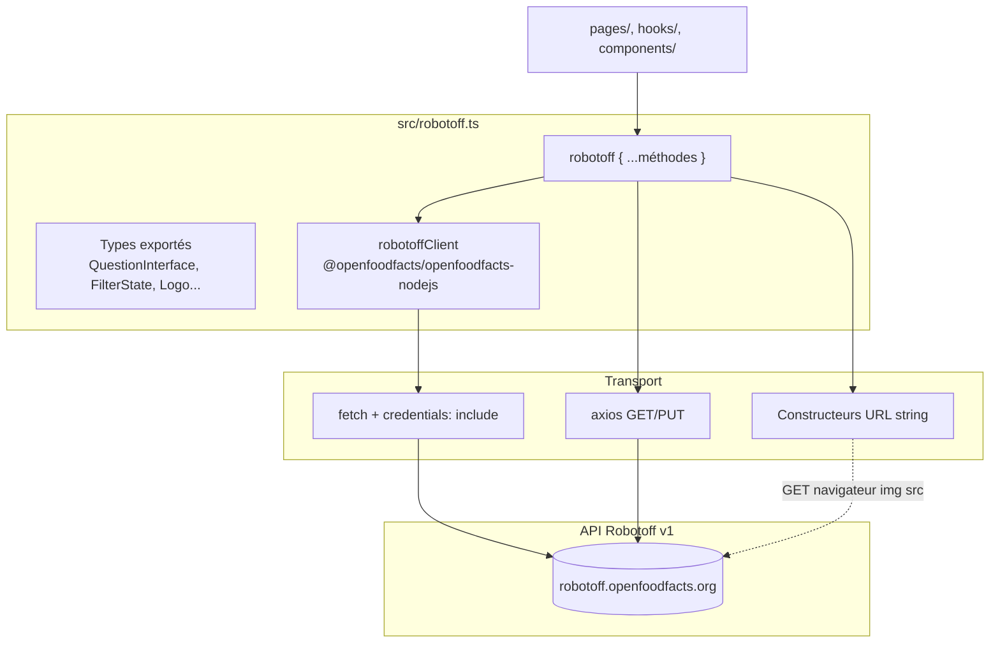
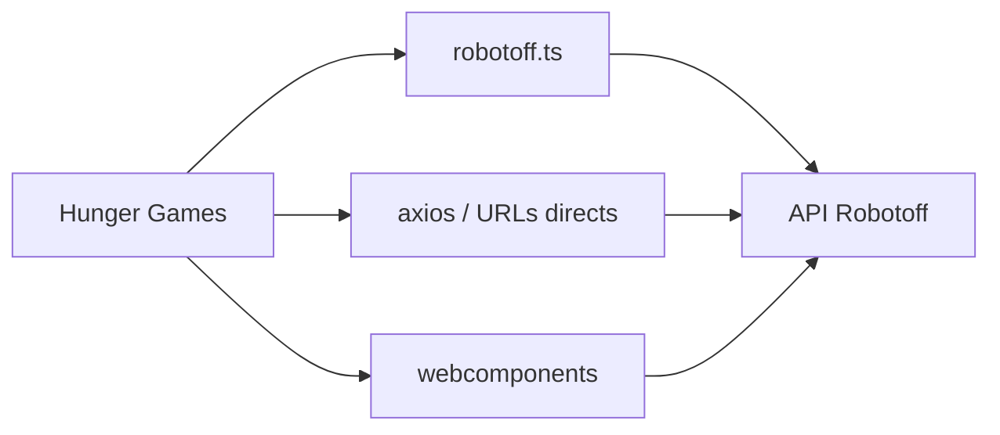

# Phase 8 — Wrapper API Robotoff

> **Open Food Facts Hunger Games — Onboarding contributeur**
>
> Suite de [Phase 7 — Flux runtime central](./phase-7-core-runtime-flow.md)
>
> Preuves : `src/robotoff.ts`, tous les sites d'appel `robotoff.*`, usage direct de `ROBOTOFF_API_URL` hors wrapper, [Référence API Robotoff](https://openfoodfacts.github.io/robotoff/references/api/).

---

## De quoi `src/robotoff.ts` est responsable

Ce fichier est la **frontière d'intégration centrale de Hunger Games avec Robotoff**. Ce n'est pas une bibliothèque HTTP générique — c'est **l'adaptateur du projet** entre les mini-jeux et `https://robotoff.openfoodfacts.org/api/v1`.

Il possède :

1. **Types TypeScript partagés** (`QuestionInterface`, `Logo`, `FilterState`, …)
2. **Une instance client SDK** (`robotoffClient`)
3. **Un objet simple** (`robotoff`) exposant des méthodes orientées jeux
4. **Deux piles HTTP** (SDK `fetch` + `axios`) utilisées côte à côte

**FAIT :** Hunger Games n'importe jamais `Robotoff` en dehors de ce fichier.

---

## Structure du module



### Export par défaut

```typescript
export default robotoff;
```

**Convention (FAIT) :** presque tous les consommateurs `import robotoff from "../robotoff"`. Types importés comme exports nommés depuis le même fichier.

---

## URL de base et authentification

**FAIT** (`src/const.ts`) :

```typescript
export const ROBOTOFF_API_URL = "https://robotoff.openfoodfacts.org/api/v1";
```

### Comportement des credentials

| Client | Configuration | Utilisé par |
|---|---|---|
| **SDK `robotoffClient`** | Fetch custom : `{ ...init, credentials: "include" }` | `annotate`, `questionsByProductCode`, `insightDetail`, méthodes logos SDK, `getInsights` |
| **axios** | Mixte — voir table par méthode | `questions`, `updateLogo`, `getLogosImages`, `getUserStatistics`, `getUnansweredValues` |

**INFÉRENCE :** Les cookies de session de `openfoodfacts.org` sont transmis sur les appels SDK et certains appels axios, permettant des annotations authentifiées (sémantique Basic Auth / session API Robotoff).

**FAIT :** Tous les appels axios ne définissent pas `withCredentials: true` — incohérence potentielle pour le comportement cookie cross-origin (dépendant du navigateur).

---

## Pourquoi SDK et axios coexistent

**FAIT :** Les deux sont actifs dans le code de production aujourd'hui — ce n'est **pas** un refactor inachevé à « corriger » sans discussion avec les mainteneurs.

| Raison probable | Preuve |
|---|---|
| Le SDK couvre les méthodes client OFF plus récentes/partagées | Classe `Robotoff` de `@openfoodfacts/openfoodfacts-nodejs` `2.0.0-alpha.29` |
| Les endpoints axios historiques restent | `questions()`, logo PUT, statistics, unanswered |
| Besoins payload différents | Nutrition utilise POST manuel `URLSearchParams` ailleurs |
| Helpers construction URL | `getCroppedImageUrl` retourne string, pas un appel client |

**RECOMMANDATION pour les contributeurs :** ajouter de nouvelles méthodes Robotoff dans `robotoff.ts` en utilisant la pile déjà utilisée pour des endpoints similaires — SDK pour la famille insight/logo/annotate, axios uniquement si correspondant aux motifs axios existants.

---

## Référence complète des méthodes

### Table résumé

| Méthode | Transport | HTTP (API Robotoff) | Mutant ? | Consommateurs principaux |
|---|---|---|---|---|
| `annotate` | SDK fetch | POST `/insights/annotate` | **Oui** | `useQuestions`, `ProductOtherQuestions` |
| `questions` | axios GET | GET `/questions/` | Non | `useQuestions`, cartes, compteurs |
| `questionsByProductCode` | SDK | GET `/questions/{barcode}` | Non | `useProductQuestions` |
| `getInsights` | SDK | GET `/insights/` | Non | `InsightsGrid` |
| `insightDetail` | SDK | GET `/insights/detail/{id}` | Non | `DebugQuestion`, `CroppedLogo`, `LogoQuestionCard` |
| `searchLogos` | SDK | Endpoint recherche logo | Non | Logo deep search, search, product-search |
| `annotateLogos` | SDK | Annotate logo bulk (JSON) | **Oui** | `AnnotateLogoModal` |
| `loadLogo` | SDK | GET `/images/logos/{logo_id}` | Non | `LogoUpdate` |
| `getLogoAnnotations` | SDK | GET `/annotation/collection` | Non | `LogoAnnotation`, `LogoDeepSearch` |
| `getLogosImages` | axios GET | GET `/images/logos?logo_ids=` | Non | Pages logo, helpers debug/crop |
| `updateLogo` | axios PUT | PUT `/images/logos/{logo_id}` | **Oui** | `LogoGrid`, `LogoUpdate` |
| `getCroppedImageUrl` | Constructeur URL | GET `/images/crop?...` | Non | Toutes UIs logo (img `src`) |
| `getUnansweredValues` | axios GET | GET `/questions/unanswered/` | Non | `Opportunities` (Green Score) |
| `getUserStatistics` | axios GET | GET `/users/statistics/{username}` | Non | **Aucun — wrapper mort** |

---

## Plongée méthode par méthode

### `annotate(insightId, annotation)`

```typescript
robotoffClient.annotate({
  insight_id: insightId,
  annotation: -1 | 0 | 1,
  update: 1,
});
```

| | |
|---|---|
| **Objectif** | Soumettre Oui / Non / Passer sur un **insight** |
| **Paramètres** | `insight_id` UUID ; `annotation` 1/0/-1 |
| **Effet de bord** | Robotoff enregistre le vote ; avec `update: 1`, peut mettre à jour produit OFF |
| **Jeux** | Questions (principal), ProductOtherQuestions (barre latérale) |
| **Attendu ?** | File principale : **non** ; barre latérale : **oui** (`.then`) |

**FAIT :** Ne **supporte pas** `annotation=2` avec données extra — nutrition utilise POST axios séparé.

---

### `questions(filterState, count?, page?)`

```typescript
axios.get(`${ROBOTOFF_API_URL}/questions/`, {
  params: removeEmptyKeys({ ...searchParams, lang, count, page }),
});
```

| Param requête | Source |
|---|---|
| `insight_types` | `insightType` |
| `value_tag` | `reformatValueTag(valueTag)` |
| `brands` | `reformatValueTag(brandFilter)` |
| `countries` | `countryFilter` |
| `campaign`, `predictor`, `with_image` | direct |
| `order_by` | `popularity` ou `random` |
| `lang` | `getLang()` |
| `count`, `page` | args (défauts 10, 1) |

| | |
|---|---|
| **Réponse** | `{ count, questions: QuestionInterface[] }` |
| **Jeux** | Questions, compteurs Green Score, QuestionCard, DashboardCard, badge utils |
| **Pourquoi axios** | **INCONNU** historique exact ; le SDK a questions produit mais le fetch bulk filtré utilise axios |

---

### `questionsByProductCode(code)`

| | |
|---|---|
| **SDK** | `robotoffClient.questionsByProductCode(Number(code))` |
| **Post-traitement** | **FAIT :** filtre les questions sans `source_image_url` |
| **Jeux** | `useProductQuestions` → barre latérale ProductOtherQuestions |

---

### `getInsights(barcode, insightType, valueTag, annotation, page, count, campaigns, country)`

| | |
|---|---|
| **Objectif** | Navigateur d'insights paginé pour grille admin |
| **Spécial** | `annotation === "not_annotated"` → mappe vers `annotated: false` |
| **Jeux** | `pages/insights/InsightsGrid.jsx` |
| **Effet de bord** | Lecture seule |

---

### `insightDetail(insight_id)`

| | |
|---|---|
| **Objectif** | Métadonnées debug : predictor, timestamp, bounding box, `logo_id` optionnel |
| **Jeux** | DebugQuestion, CroppedLogo, cartes LogoQuestionValidator |
| **Effet de bord** | Lecture seule |

---

### Cluster méthodes logo

#### `searchLogos(barcode, value, type, count?, random?)`

| | |
|---|---|
| **Formatage valeur** | Si valeur correspond à `/^[a-z][a-z]:/` → `taxonomy_value` ; sinon `value` |
| **Jeux** | LogoSearch, LogoDeepSearch, ProductLogoAnnotations |
| **Effet de bord** | Lecture seule |

#### `annotateLogos(annotations)`

| | |
|---|---|
| **Payload** | Tableau de `{ logo_id, type, value }` |
| **Jeux** | `AnnotateLogoModal` (annotation logo en lot) |
| **Garde dev** | **FAIT :** ignoré quand `IS_DEVELOPMENT_MODE` |
| **Effet de bord** | **Mutant** annotations logo dans Robotoff |

#### `updateLogo(logoId, value, type)`

| | |
|---|---|
| **Transport** | `axios.put` + `withCredentials: true` |
| **Jeux** | Édition inline LogoGrid, page LogoUpdate |
| **Garde dev** | ignoré en mode dev dans LogoGrid |
| **Effet de bord** | **Mutant** annotation logo unique |

#### `loadLogo(logoId)` / `getLogosImages(logoIds)` / `getLogoAnnotations(...)`

| Méthode | Rôle |
|---|---|
| `loadLogo` | Détail logo unique |
| `getLogosImages` | Récupération batch enregistrements logo par id |
| `getLogoAnnotations` | Collection annotations paginée (logos référence dans deep search) |

#### `getCroppedImageUrl(imageUrl, boundingBox)`

| | |
|---|---|
| **Pas un appel réseau en TS** | Retourne string URL |
| **Le navigateur fetch** | `` → GET `/images/crop` |
| **Coords** | `[y_min, x_min, y_max, x_max]` relatif 0–1 |
| **FAIT (docs Robotoff)** | « currently only used to generate cropped logos on Hunger Games » |

---

### `getUnansweredValues({ type, countryCode, campaign, page, count })`

| | |
|---|---|
| **Objectif** | Lister tuples `[value_tag, count]` pour cartes opportunités |
| **Jeux** | `Opportunities.tsx` sur page Green Score |
| **Transport** | axios ; jointure manuelle query string |
| **Effet de bord** | Lecture seule |

---

### `getUserStatistics(username)`

| | |
|---|---|
| **Statut** | **Défini mais inutilisé** dans `src/**` (FAIT via recherche dépôt) |
| **Classification** | Wrapper mort / fonctionnalité future — ne pas supposer qu'une UI existe |

---

## Appels Robotoff **hors** `robotoff.ts`

Frontière importante : tout ne passe pas par le wrapper.

| Emplacement | Endpoint | Pourquoi séparé |
|---|---|---|
| `pages/nutrition/utils.ts` | POST `/insights/annotate` avec `annotation=2` + JSON `data` | Payload nutriment riche |
| `pages/ingredients/useData.tsx` | GET `/predict/ingredient_list?ocr_url=...` | Lecture prédiction OCR |
| `pages/logosValidator/dashboardDefinition.ts` | URLs statiques `/images/crop?...` | Miniatures config |
| `components/OffWebcomponents.tsx` | Passe `ROBOTOFF_API_URL` aux webcomponents | Le package externe possède les appels |



**Règle contributeur :** si vous ajoutez un appel Robotoff, **préférez étendre `robotoff.ts`** sauf si vous correspondez à un motif direct existant (annotate style nutrition) ou travaillez dans le dépôt webcomponents.

---

## Carte consommateurs par jeu

| Jeu / zone | Méthodes utilisées |
|---|---|
| **Questions** | `questions`, `annotate` |
| **Green Score / Opportunities** | `questions`, `getUnansweredValues` |
| **Accueil / QuestionCard** | `questions` (compteurs) |
| **Admin insights** | `getInsights` |
| **Logo deep search / search** | `searchLogos`, `getLogoAnnotations`, `getLogosImages`, `getCroppedImageUrl`, `annotateLogos` (modal) |
| **Logo update / grid** | `loadLogo`, `updateLogo`, `getCroppedImageUrl` |
| **Page annotation logo** | `getLogoAnnotations`, `getLogosImages`, `getCroppedImageUrl` |
| **Barre latérale produit** | `questionsByProductCode`, `annotate` |
| **Debug / crops** | `insightDetail`, `getLogosImages`, `getCroppedImageUrl` |
| **Nutrition** | POST annotate direct (`annotation=2`) dans `nutrition/utils.ts` |
| **Ingrédients** | GET direct `predict/ingredient_list` |

---

## Effets de bord — qu'est-ce qui mute les données de production ?

| Appel | État Robotoff | Peut mettre à jour produit OFF ? |
|---|---|---|
| `annotate(..., 1, update:1)` | Insight accepté | **Oui** (via Robotoff) |
| `annotate(..., 0)` | Insight rejeté | Non |
| `annotate(..., -1)` | Passé pour l'utilisateur | Non |
| `annotateLogos` | Labels logo sur régions | **INFÉRENCE :** alimente pipeline insight/produit |
| `updateLogo` | Type/valeur logo changé | **INFÉRENCE :** idem |
| Toutes méthodes GET | Aucun | Non |

---

## Gardes de sécurité mode dev

**FAIT :** Certaines mutations sont désactivées localement pour éviter des annotations production accidentelles :

| Emplacement | Garde |
|---|---|
| `AnnotateLogoModal` | Ignore `annotateLogos` si `IS_DEVELOPMENT_MODE` |
| `LogoGrid` | Ignore `updateLogo` si mode dev |

**FAIT :** `annotate` principal `useQuestions` **N'EST PAS gardé en dev** — le dev local peut encore envoyer de vraies annotations sauf si Robotoff rejette localhost/origine.

**INFÉRENCE :** Les contributeurs testant localement doivent préférer le mode dev pour les outils logo batch mais traiter annotate Questions comme potentiellement impactant la production si CORS autorise la requête.

---

## Helpers partagés utilisés par le wrapper

| Helper | Fichier | Rôle |
|---|---|---|
| `reformatValueTag` | `utils.ts` | Normaliser tags filtre avant API |
| `removeEmptyKeys` | `utils.ts` | Omettre params query vides |
| `getLang` | `localeStorageManager.ts` | Param `lang` sur `questions()` |

---

## Exports de types utilisés dans l'app

| Type | Utilisé pour |
|---|---|
| `QuestionInterface` | Éléments file de questions |
| `FilterState` | Filtres URL + params query Robotoff (note : champs duaux `country` / `countryFilter`) |
| `Logo`, `BoundingBox`, `LogoImage` | Jeux logo |
| `FilterState` dans hooks | Clés query + mapping API |

**FAIT :** `FilterState` est défini dans `robotoff.ts` mais chevauche conceptuellement `QuestionFilter/const.ts` — types différents partageant un motif de nom (voir audit nommage Phase 5).

---

## Mapping méthode SDK → endpoint Robotoff

**INFÉRENCE** alignée avec [Référence API Robotoff](https://openfoodfacts.github.io/robotoff/references/api/) :

| Méthode SDK (nodejs) | Endpoint Robotoff |
|---|---|
| `annotate` | POST `/insights/annotate` |
| `questionsByProductCode` | GET `/questions/{barcode}` |
| `insights` | GET `/insights/` |
| `insightDetail` | GET `/insights/detail/{insight_id}` |
| `searchLogos` | Recherche logo (critères universal-logo-detector) |
| `annotateLogos` | Annotation logo bulk (corps JSON) |
| `loadLogo` | GET `/images/logos/{logo_id}` |
| `getLogoAnnotations` | GET `/annotation/collection` |

La construction exacte des chemins SDK vit dans `@openfoodfacts/openfoodfacts-nodejs` — monter la version SDK avec prudence.

---

## Protection de l'espace mental

### À COMPRENDRE MAINTENANT

1. **`robotoff.ts` est le point d'intégration par défaut** — mais pas le seul.
2. **Annotations insight** → `annotate()` SDK ; **annotations logo** → `annotateLogos` / `updateLogo`.
3. **`questions()` utilise axios** ; la plupart des autres lectures utilisent le SDK.
4. **`getCroppedImageUrl` construit des URLs image**, pas des APIs JSON.
5. **`update: 1` est toujours envoyé** sur annotate insight depuis Hunger Games.

### UTILE PLUS TARD

- Code mort `getUserStatistics`
- Chemin nutrition `annotation=2` dans fichier séparé
- `predict/ingredient_list` pour jeu ingrédients
- Pin version SDK alpha (`2.0.0-alpha.29`)

### IGNORER POUR L'INSTANT

- Endpoints dump CSV / import batch (non utilisés dans HG)
- Endpoints recherche nearest-neighbor ANN
- Surface complète API prédiction Robotoff

---

## Résumé Phase 8 — cinq choses à retenir

1. **Un fichier, deux clients HTTP** — SDK `fetch` + `axios`, historique intentionnel.
2. **Trois canaux d'annotation** — insight `annotate`, logo `annotateLogos`, logo `updateLogo`.
3. **`questions()` est l'exception axios** parmi les opérations de file centrales.
4. **Certains trafics Robotoff contournent le wrapper** — nutrition, ingrédients, webcomponents.
5. **Credentials : `include` sur SDK** — lie les annotations au login OFF quand cookies présents.

### Incertitudes

- **INCONNU :** Si le SDK remplacera éventuellement tous les appels axios Robotoff.
- **INCONNU :** Mapping complet `annotateLogos` → champs OFF (logique serveur Robotoff).
- **INFÉRENCE :** `getLogosImages` sans `withCredentials` explicite peut encore fonctionner pour métadonnées logo publiques.

---

## Et ensuite

**Phase 9 — Frontière API Open Food Facts**

Quelles données viennent d'OFF vs Robotoff, quelles mutations vont où, usage taxonomie, et une **table données/action → backend** centrée sur `off.ts`, `offSearch.ts`, `offTaxonomy.ts`.

---

*Arrêtez-vous ici. Parcourez `src/robotoff.ts` une fois avec cette table ouverte — vous devriez reconnaître chaque méthode et au moins un consommateur. Puis continuez vers la Phase 9.*
