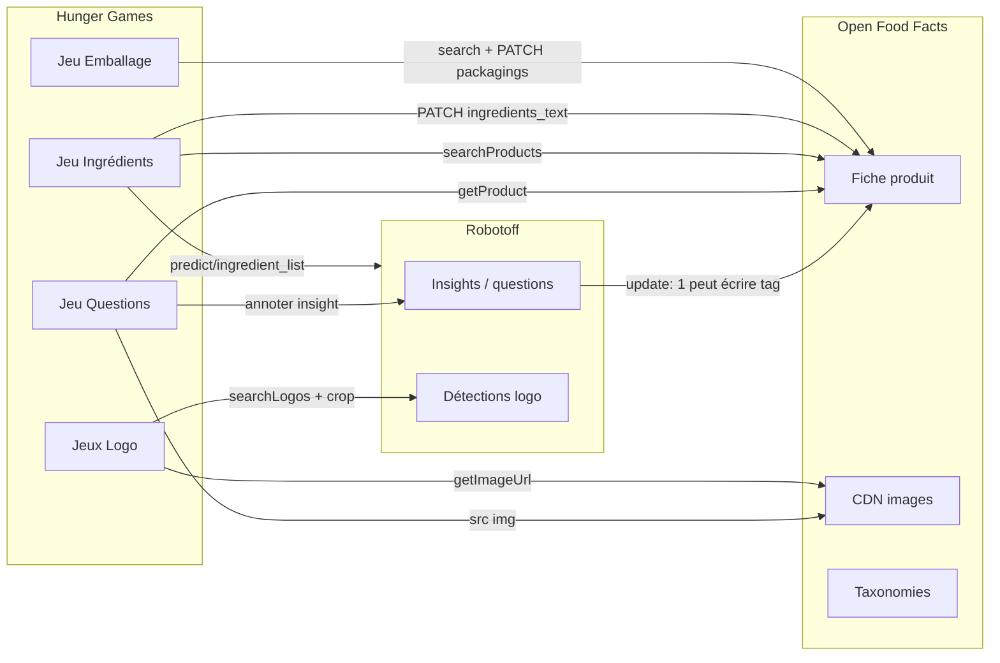
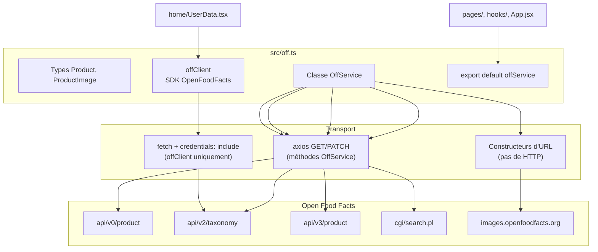
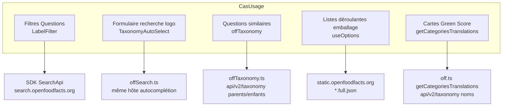

# Phase 9 — Frontière API Open Food Facts

> **Open Food Facts Hunger Games — Onboarding contributeur**
>
> Suite de [Phase 8 — Wrapper API Robotoff](./phase-8-robotoff-api-wrapper.md)
>
> Preuves : `src/off.ts`, `src/offSearch.ts`, `src/offTaxonomy.ts`, `src/const.ts`, `src/hooks/useProduct.ts`, `src/hooks/useOptions.ts`, `src/components/QuestionFilter/LabelFilter.tsx`, `src/pages/packaging/`, `src/pages/ingredients/`, `src/App.jsx`, `src/components/OffWebcomponents.tsx`.

---

## Ce que Hunger Games lit dans OFF vs écrit dans OFF

La phase 8 couvrait **Robotoff** — questions ML, insights, logos. La phase 9 couvre **Open Food Facts lui-même** — la base de données produits que Hunger Games enrichit, affiche et modifie parfois directement.

La distinction mentale :



**FAIT :** La plupart des mini-jeux **lisent** OFF et **écrivent** via Robotoff. Deux jeux **PATCHent OFF directement** : ingrédients et emballage.

**INFÉRENCE :** Les jeux Logo et Questions modifient les données produit OFF **indirectement** (le serveur Robotoff applique les insights acceptés / annotations logo). Emballage et ingrédients contournent ce chemin pour les modifications de champs structurés.

---

## Les trois fichiers wrapper OFF (+ un export SDK)

| Fichier | Rôle | Export par défaut |
|---|---|---|
| **`src/off.ts`** | Adaptateur OFF principal — lectures produit, recherche, écritures, constructeurs d'URL, helpers cookie de session | `offService` (importé comme `off` ou `offService`) |
| **`src/offSearch.ts`** | Fabrique d'autocomplétion pour 28 types de taxonomie | enregistrement `searchTaxonomy` |
| **`src/offTaxonomy.ts`** | Recherche parent/enfant pour un tag dans catégories/labels/marques | fonction `getTaxonomy()` |
| **`offClient`** (dans `off.ts`) | Instance SDK `OpenFoodFacts` pour les stats de facettes | export nommé |

**FAIT :** Contrairement à Robotoff, l'intégration OFF **n'est pas entièrement centralisée**. Plusieurs pages appellent `axios` directement contre `OFF_API_URL_V3` ou des URL CDN statiques, et `LabelFilter` instancie son propre `SearchApi`.

---

## Constantes d'URL (`src/const.ts`)

Tous les endpoints OFF en dérivent :

| Constante | Valeur | Usage typique |
|---|---|---|
| `OFF_DOMAIN` | `openfoodfacts.org` | Construction de liens |
| `OFF_URL` | `https://world.openfoodfacts.org` | Auth, facettes, config webcomponents |
| `OFF_API_URL` | `{OFF_URL}/api/v0` | Lecture produit (`getProduct`) |
| `OFF_API_URL_V2` | `{OFF_URL}/api/v2` | Traductions taxonomie |
| `OFF_API_URL_V3` | `{OFF_URL}/api/v3` | PATCH produit (ingrédients, emballage) |
| `OFF_IMAGE_URL` | `https://images.openfoodfacts.org/images/products` | Photos produit |
| `OFF_SEARCH` | `{OFF_URL}/cgi/search.pl` | Recherche produit à facettes |
| `OFF_SEARCH_A_LISIOUS` | `https://search.openfoodfacts.org/autocomplete` | Autocomplétion taxonomie |

**FAIT :** La recherche par pays remplace `world` dans l'URL : `OFF_SEARCH.replace("world", countryCode)`.

---

## Structure du module — `src/off.ts`



### Imports dans le code

**FAIT :** Les consommateurs utilisent des noms incohérents pour le même export par défaut :

```typescript
import off from "../off";
import offService from "../off";
```

Les deux référencent le même singleton `OffService`.

---

## Référence des méthodes `OffService`

### Tableau récapitulatif

| Méthode | Transport | HTTP | Mutation ? | Consommateurs principaux |
|---|---|---|---|---|
| `getCookie` | DOM | `document.cookie` | Non | `App.jsx` détection login |
| `getUsername` | DOM | parse le cookie `session` | Non | `App.jsx` après auth |
| `getFormatedBarcode` | local | regex split `(...)(...)(...)(.*)` | Non | URL images, images signalées |
| `getProduct` | axios GET | `api/v0/product/{code}.json?fields=...` | Non | `useProductData` |
| `getCategoriesTranslations` | axios GET | `api/v2/taxonomy?tagtype=categories&...` | Non | `Opportunities` (Green Score) |
| `searchProducts` | axios GET | `cgi/search.pl` (à facettes) | Non | ingrédients, recherche produit logo |
| `setIngedrient` | axios PATCH | `api/v3/product/{code}` | **Oui** | jeu ingrédients |
| `getIngredientParsing` | axios PATCH | `api/v3/product/test` | Non (dry-run) | aperçu parsing ingrédients |
| `getProductUrl` | constructeur URL | world.openfoodfacts.org/product/… | Non | liens partout |
| `getProductEditUrl` | constructeur URL | lien édition Product Opener | Non | boutons édition |
| `getLogoCropsByBarcodeUrl` | constructeur URL | Hunger Games `/logos/search?barcode=` | Non | liens sidebar Questions |
| `getImageUrl` | constructeur URL | `OFF_IMAGE_URL/{path}` | Non | images source recadrage logo |
| `getNutritionToFillUrl` | constructeur URL | recherche ou URL produit v0 | Non | **Aucun consommateur dans src/** |
| `getTableExtractionAI` | constructeur URL | endpoint Azure nutri-test | Non | **Aucun consommateur dans src/** |

---

## Notes méthode par méthode

### `getProduct(barcode)`

```typescript
axios.get(`${OFF_API_URL}/product/${barcode}.json?fields=...`)
```

| | |
|---|---|
| **Objectif** | Charger le contexte produit pour l'UI Questions (nom, marques, extrait ingrédients, images, tags) |
| **Champs** | Liste curatée incluant les variantes localisées `*_tags_{lang}` |
| **Hook** | `useProductData` → clé TanStack Query `["product", barcode]` |
| **Auth** | **FAIT :** pas de `withCredentials` sur cet appel |

Utilisé quand une question est affichée pour montrer **ce que le produit dit déjà** à côté de la proposition ML.

---

### `searchProducts({ filters, countryCode, fields, page, pageSize, signal })`

```typescript
axios.get(`${OFF_SEARCH.replace("world", countryCode)}?${urlParams}`)
```

| | |
|---|---|
| **Objectif** | Découverte produit à facettes — trouver des produits dans un **état** donné (tag workflow) |
| **Forme du filtre** | Les clés `{ tagtype, tag_contains, tag }` deviennent `tagtype_0`, `tag_0`, … dans la query string |
| **Jeux** | **Ingrédients** (`ingredients-to-be-completed` + `ingredients-photo-selected`) ; **ProductLogoAnnotations** |

**FAIT :** Le jeu ingrédients utilise `fields: "all"` et le défilement infini. Le jeu emballage construit sa propre URL de recherche dans `useBuffer.ts` (même endpoint CGI, tags d'état différents).

---

### `setIngedrient({ code, text, lang? })` — écriture OFF directe

```typescript
axios.patch(`${OFF_API_URL_V3}/product/${code}`, {
  product: { [`ingredients_text${lang ? `_${lang}` : ""}`]: text },
});
```

| | |
|---|---|
| **Objectif** | Enregistrer le texte corrigé de la liste d'ingrédients dans OFF |
| **Typo conservée** | Le nom de méthode est `setIngedrient` (pas `setIngredient`) |
| **Auth** | **FAIT :** pas de `withCredentials: true` explicite — s'appuie sur le comportement axios/cookie par défaut |
| **Jeu** | `IngeredientDisplay.tsx` → bouton Enregistrer |

C'est une **vraie modification produit**, pas un vote d'insight. Il faut être connecté à OFF pour que ça persiste.

---

### `getIngredientParsing({ text, lang })` — aperçu de parsing uniquement

```typescript
axios.patch(`${OFF_API_URL_V3}/product/test`, {
  fields: "ingredients",
  lc: lang,
  product: { [`ingredients_text_${lang}`]: text },
});
```

| | |
|---|---|
| **Objectif** | Demander à OFF de parser le texte ingrédients en `ingredients[]` structuré **sans enregistrer** |
| **Endpoint** | `/product/test` — dry-run OFF v3 |
| **UI** | Le bouton « Parsing » affiche l'aperçu structuré avant l'enregistrement |

---

### Constructeurs d'URL (pas de réseau depuis le constructeur lui-même)

| Méthode | Retourne |
|---|---|
| `getProductUrl(barcode)` | Page produit publique (sous-domaine selon locale) |
| `getProductEditUrl(barcode)` | Formulaire d'édition Product Opener |
| `getLogoCropsByBarcodeUrl(barcode)` | Route HG interne pour pré-filtre recherche logo |
| `getImageUrl(imagePath)` | Chemin CDN sous `images.openfoodfacts.org` |

**FAIT :** Les jeux logo combinent `off.getImageUrl(source_image)` + `robotoff.getCroppedImageUrl(...)` — OFF héberge l'image complète ; Robotoff recadre la bounding box.

---

### Helpers morts dans `off.ts`

**FAIT :** `getNutritionToFillUrl` et `getTableExtractionAI` sont **définis mais jamais importés** ailleurs dans `src/`. Le jeu nutrition utilise désormais `@openfoodfacts/openfoodfacts-webcomponents`.

---

## `offClient` — usage SDK (minimal mais important)

```typescript
export const offClient = new OpenFoodFacts(
  (input, init) => fetch(input, { ...init, credentials: "include" }),
);
```

| Consommateur | Appel SDK | Objectif |
|---|---|---|
| `pages/home/UserData.tsx` | `offClient.getFacetValue(apiFacet, userName, {})` | Compteurs contributeur/éditeur/photographe pour l'utilisateur connecté |

**FAIT :** C'est le **seul** usage de `offClient` dans le dépôt. Les filtres Questions utilisent une instance **`SearchApi` séparée** (voir ci-dessous).

---

## Taxonomie — quatre systèmes différents

Hunger Games touche aux taxonomies OFF de **quatre façons**. Elles ne sont pas interchangeables.



### 1. `offSearch.ts` — fabrique d'autocomplétion

**FAIT :** Au chargement du module, construit 28 fonctions indexées par nom de taxonomie (`brand`, `category`, `label`, `packaging_material`, …) :

```typescript
axios.get(`${OFF_SEARCH_A_LISIOUS}?taxonomy_names=${taxonomy}&q=${query}&lang=${lang}`)
```

| Consommateur | Taxonomies utilisées |
|---|---|
| `TaxonomyAutoSelect.tsx` | Passé en prop — ex. recherche logo `brand` |
| `LogoSearchForm.jsx` | Filtre marque |

Retourne `{ options?: { id, text, taxonomy_name }[] }`.

---

### 2. `offTaxonomy.ts` — recherche hiérarchique

**FAIT :** Mappe les types d'insight UI vers les types de tag OFF :

| param `taxonomy` | `tagtype` OFF |
|---|---|
| `label` | `labels` |
| `category` | `categories` |
| `brand` | `brands` |

```typescript
GET api/v2/taxonomy?tagtype={tagtype}&tags={tag}&lc={languages}
```

| Consommateur | Objectif |
|---|---|
| `SimilarQuestions.tsx` | Quand la file est vide, suggérer des tags parent/enfant pour élargir la recherche |

Retourne `{ [tag]: { parents?, children? } }`.

---

### 3. `LabelFilter.tsx` — SDK SearchApi (pile dupliquée)

```typescript
const offClient = new SearchApi(window.fetch.bind(window));
await offClient.autocomplete({ q, taxonomy_names: insightType, lang, size: 20 });
```

**FAIT :** Ce n'est **pas** le `offClient` de `off.ts`. Même service d'autocomplétion que `offSearch.ts`, wrapper client différent et **sans** `credentials: "include"`.

Utilisé dans l'UI des filtres Questions pour l'autocomplétion value-tag, marque, pays.

---

### 4. `useOptions.ts` — taxonomies complètes statiques

```typescript
axios.get(`https://static.${OFF_DOMAIN}/data/taxonomies/${fileName}.full.json`)
```

| Fichier | Utilisé par |
|---|---|
| `packaging_materials.full.json` | Liste déroulante matériau jeu emballage |
| `packaging_shapes.full.json` | Liste déroulante forme |
| `packaging_recycling.full.json` | Liste déroulante recyclage |

**INFÉRENCE :** Choisi pour des listes complètes compatibles hors ligne ; l'autocomplétion serait mal adaptée à l'UX des listes déroulantes.

---

## Authentification et session

Hunger Games **n'a pas de formulaire de connexion**. Il s'appuie sur les cookies de session OFF définis lors de la connexion sur `world.openfoodfacts.org`.

```mermaid
sequenceDiagram
    participant App as App.jsx
    participant Cookie as document.cookie
    participant OFF as world.openfoodfacts.org

    App->>Cookie: off.getCookie("session")
    alt pas de cookie
        App->>App: isLoggedIn = false
    else cookie modifié
        App->>OFF: GET /cgi/auth.pl (withCredentials)
        OFF-->>App: valide la session
        App->>Cookie: off.getUsername() depuis payload session
    end
    Note over App: mode DEV ignore l'auth — toujours « connecté »
```

| Opération | Credentials |
|---|---|
| `offClient.getFacetValue` | SDK fetch `credentials: "include"` |
| `setIngedrient` | **FAIT :** pas de `withCredentials` explicite |
| PATCH emballage | **FAIT :** `withCredentials: true` |
| `getProduct`, `searchProducts` | Pas de credentials explicites |
| Vérification auth `App.jsx` | `withCredentials: true` |

**INFÉRENCE :** Les écritures OFF directes (ingrédients, emballage) nécessitent une session OFF valide. Les annotations d'insight Robotoff nécessitent aussi l'auth pour l'attribution, mais ce chemin est la phase 8.

---

## Appels **en dehors** de `off.ts` qui touchent encore OFF

| Emplacement | Endpoint | Objectif |
|---|---|---|
| `packaging/useBuffer.ts` | `cgi/search.pl` ou `api/v3/product/{code}` | Charger les produits nécessitant emballage |
| `packaging/index.tsx` | `PATCH api/v3/product/{code}` | Enregistrer `packagings[]` |
| `nutrition/useNutrimentTranslations.ts` | `GET /cgi/nutrients.pl?lc=` | Traductions labels nutriments |
| `OffWebcomponents.tsx` | passe `openfoodfacts-api-url={OFF_URL}` | Les webcomponents appellent OFF/Robotoff en interne |
| `questions/utils.ts` | URL facettes codées en dur | Liens facettes catégorie/label |
| `App.jsx` | `GET /cgi/auth.pl` | Validation session |

**FAIT :** Forme du payload d'écriture emballage :

```typescript
{ product: { fields: "updated", packagings: [{ shape, material, recycling, number_of_units }] } }
```

---

## Endpoint tiers (pas OFF)

**FAIT :** `pages/flaggedImages/index.tsx` lit/supprime depuis `https://amathjourney.com/api/off-annotation/flag-image/` — utilise `off.getProductEditUrl` et `OFF_IMAGE_URL` uniquement pour les liens d'affichage. Ce n'est **pas** une API OFF officielle.

---

## Tableau maître — donnée / action → backend

### Lectures

| Donnée nécessaire | Backend | Wrapper / fichier | Jeu / fonctionnalité |
|---|---|---|---|
| Nom produit, tags, images | OFF v0 | `off.getProduct` | Questions (`useProductData`) |
| Produits par état workflow | Recherche CGI OFF | `off.searchProducts` ou URL `useBuffer` | Ingrédients, emballage, recherche produit logo |
| Produit unique par code (champs v3) | OFF v3 GET | axios direct `useBuffer` | Emballage |
| Noms d'affichage catégories | Taxonomie OFF v2 | `off.getCategoriesTranslations` | Opportunités Green Score |
| Autocomplétion tag (filtres) | search.openfoodfacts.org | `LabelFilter` SearchApi | Filtres Questions |
| Autocomplétion tag (formulaire logo) | search.openfoodfacts.org | `offSearch.ts` | Formulaire recherche approfondie logo |
| Suggestions tag parent/enfant | Taxonomie OFF v2 | `offTaxonomy.getTaxonomy` | État vide questions similaires |
| Options enum emballage | JSON CDN statique | `useOptions` | Listes déroulantes emballage |
| Noms nutriments | CGI OFF | `useNutrimentTranslations` | Nutrition (helper legacy dans le dépôt) |
| Compteurs contribution utilisateur | API facettes OFF | `offClient.getFacetValue` | Tableau de bord accueil |
| Images produit (CDN) | images.openfoodfacts.org | `getImageUrl`, `getImagesUrls` | Questions, logos, emballage |
| Questions ML / insights | Robotoff | `robotoff.ts` | La plupart des jeux (phase 8) |
| Prédictions OCR ingrédients | Robotoff | GET direct `useData.tsx` | Ingrédients |

### Écritures

| Action utilisateur | Backend | Chemin | Met à jour produit OFF ? |
|---|---|---|---|
| Oui / Non / Passer sur question | Annotation Robotoff | `robotoff.annotate` | **Peut-être** (via Robotoff `update: 1`) |
| Accepter valeurs nutrition | Annotation Robotoff `annotation=2` | `nutrition/utils.ts` | **Peut-être** (Robotoff applique) |
| Label/type logo | APIs logo Robotoff | `annotateLogos` / `updateLogo` | **Peut-être** (Robotoff applique) |
| Enregistrer texte ingrédients | PATCH OFF v3 | `off.setIngedrient` | **Oui — direct** |
| Enregistrer lignes emballage | PATCH OFF v3 | axios `packaging/index.tsx` | **Oui — direct** |
| Correction orthographique ingrédients / détection / extraction nutriments | Webcomponents → OFF/Robotoff | `OffWebcomponents.tsx` | **Oui** (dans le webcomponent) |

**À COMPRENDRE MAINTENANT :** Si vous déboguez « ma réponse n'a pas modifié le produit », demandez-vous d'abord **quel chemin d'écriture** le jeu utilise. Questions → Robotoff. Ingrédients/emballage → OFF v3.

---

## Comment les données OFF apparaissent dans le jeu Questions

Pile typique pour une carte question :

1. **Robotoff** fournit `QuestionInterface` (barcode, insight_id, value_tag, source_image_url, …).
2. **`useProductData(barcode)`** charge le produit OFF pour le contexte sidebar.
3. **`getImagesUrls(product.images, barcode)`** construit les vignettes CDN depuis les métadonnées images OFF.
4. **Liens** (`getProductUrl`, `getProductEditUrl`, URL facettes) ouvrent OFF dans de nouveaux onglets — pas d'appel API au clic.

**FAIT :** L'image de la question provient souvent de **`source_image_url` sur la question Robotoff**, pas d'un re-fetch des images OFF — mais les vignettes de la galerie utilisent l'objet `images` OFF quand disponible.

---

## Surface du package SDK

**FAIT** (`package.json`) : `@openfoodfacts/openfoodfacts-nodejs` `2.0.0-alpha.29`

| Classe | Utilisée où |
|---|---|
| `OpenFoodFacts` | `off.ts` → `offClient` |
| `SearchApi` | `LabelFilter.tsx` uniquement |
| `Robotoff` | `robotoff.ts` (phase 8) |
| Types (`Product`, `ProductV3`) | `off.ts`, `packaging/useBuffer.ts` |

Le package webcomponents (`@openfoodfacts/openfoodfacts-webcomponents`) encapsule du trafic OFF/Robotoff supplémentaire que Hunger Games ne wrappe pas.

---

## Protection de l'espace mental

### À COMPRENDRE MAINTENANT

1. **Export par défaut `off.ts`** = lectures produit, recherche, PATCH ingrédients, helpers URL.
2. **Deux chemins d'écriture OFF directe** — `setIngedrient` (PATCH v3) et PATCH axios page emballage (pas dans `off.ts`).
3. **Quatre mécanismes de taxonomie** — autocomplétion (`offSearch` / SearchApi), hiérarchie (`offTaxonomy`), JSON statique (`useOptions`), noms catégories (`getCategoriesTranslations`).
4. **La plupart des jeux lisent OFF, écrivent Robotoff** — ingrédients et emballage sont les exceptions.
5. **Connexion = cookie session OFF** — parsé dans `App.jsx`, pas une API auth Hunger Games.

### UTILE PLUS TARD

- Dry-run `getIngredientParsing` sur `/product/test`
- `getNutritionToFillUrl` / `getTableExtractionAI` morts dans `off.ts`
- Incohérence `withCredentials` entre les appels axios
- Code pays dans l'URL de recherche (motif `world` vs `fr.openfoodfacts.org`)
- API tiers images signalées

### IGNORER POUR L'INSTANT

- Schéma OFF v3 complet pour tous les champs produit
- Internes CGI Product Opener au-delà des URL d'édition
- APIs import/export batch
- MongoDB / infrastructure OFF interne

---

## Résumé phase 9 — cinq choses à retenir

1. **`off.ts` est orienté lecture** — un export SDK (`offClient`), une classe de service axios.
2. **Les taxonomies sont fragmentées** — quatre piles ; choisissez celle que votre fonctionnalité utilise déjà.
3. **Les écritures OFF directes sont rares mais critiques** — texte ingrédients + tableaux emballage.
4. **Robotoff reste le chemin d'écriture par défaut** pour les jeux de validation (phase 8).
5. **Les cookies de session relient HG et OFF** — le mode dev simule la connexion ; la production nécessite une auth OFF réelle pour les modifications.

### Incertitudes

- **INCONNU :** Si `setIngedrient` fonctionne de manière fiable sans `withCredentials` explicite dans tous les navigateurs.
- **INCONNU :** Plan à long terme pour consolider les clients taxonomie (`offSearch` vs `SearchApi`).
- **INFÉRENCE :** `getNutritionToFillUrl` est un legacy d'un flux nutrition pré-webcomponents.

---

## Et ensuite

**Phase 10 — TanStack Query et état frontend**

Comment les clés de requête, mises à jour du cache, files optimistes, filtres synchronisés URL et contextes se composent entre les jeux — plus en profondeur que la visite runtime Questions de la phase 7.

---

*Arrêtez-vous ici. Ouvrez `src/off.ts` et tracez une lecture (`getProduct`) et une écriture (`setIngedrient`) jusqu'à leurs consommateurs. Puis notez le PATCH axios direct d'emballage — trois fichiers, deux backends, une SPA. Passez à la phase 10 quand vous êtes prêt.*
