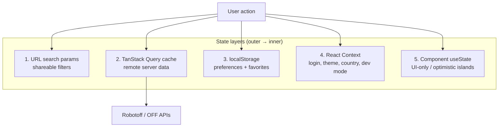

# Phase 10 — TanStack Query & Frontend State

> **Open Food Facts Hunger Games — Contributor Onboarding**
>
> Continues from [Phase 9 — Open Food Facts API Boundary](./phase-9-open-food-facts-api-boundary.md)
>
> Evidence: `src/App.jsx`, `src/hooks/useQuestions.ts`, `src/hooks/useFilterState/`, `src/hooks/useUrlParams.js`, `src/localeStorageManager.ts`, `src/contexts/`, `src/hooks/useProduct.ts`, `src/pages/ingredients/useData.tsx`, `src/pages/packaging/useBuffer.ts`, grep across `useQuery` / `useMutation` / `setQueryData`.

---

## Why this phase exists

Phase 7 walked the **Questions game runtime** — answer flow, optimistic queue, refill. Phase 10 zooms out: **how Hunger Games stores, syncs, and updates state across the whole SPA**.

Hunger Games is not a Redux app. State lives in **five overlapping layers**:



**FACT:** There is **no global Redux/Zustand store**. TanStack Query is the closest thing to a shared server-state layer.

---

## QueryClient setup

**FACT** (`App.jsx`):

```javascript
const queryClient = new QueryClient();
// ...
<QueryClientProvider client={queryClient}>
```

| Setting | Value | Implication |
|---|---|---|
| Custom `defaultOptions` | **None** | TanStack Query v5 defaults apply (`staleTime: 0`, refetch on window focus, etc.) |
| `invalidateQueries` | **Never used** in `src/` | Cache updates are manual via `setQueryData` or natural refetch on key change |
| `prefetchQuery` | **Never used** | No proactive warming beyond parallel `useQuery` mounts |
| Devtools | **Not wired** | No in-app React Query Devtools panel |

**INFERENCE:** The codebase prefers **explicit cache surgery** (`setQueryData`) over invalidation/refetch orchestration — especially in the Questions queue.

Provider nesting order (relevant when debugging context vs query):

```text
CountryProvider
  → ColorModeContext
    → ThemeProvider
      → LoginContext
        → DevModeContext
          → QueryClientProvider
            → Routes (lazy pages)
```

---

## TanStack Query patterns in this repo

| Pattern | Where | Purpose |
|---|---|---|
| **`useQuery`** | Most reads | Product, questions, counts, autocomplete, debug insight |
| **`useInfiniteQuery`** | `useData.tsx`, `Opportunities.tsx` | Paginated product/opportunity lists |
| **`useQueries`** | Green Score, home stats, category translations | Parallel independent fetches |
| **`useMutation`** | `useQuestions` refill, ingredient save | Side effects + cache merge on success |
| **`setQueryData`** | `useQuestions.answerQuestion` | Optimistic queue + recent answers |
| **`enabled: false`** | `useRobotoffPrediction` | Manual fetch via `refetch()` |
| **`placeholderData`** | `InsightsGrid` | Keep previous page visible while paginating |
| **Seed query with empty fn** | `["recent-answers"]` | Client-only list backed by query cache |

**FACT:** Only **two** `useMutation` call sites exist: `useQuestions.ts` (refill) and `IngeredientDisplay.tsx` (save ingredient).

---

## The Questions queue — query keys and cache contract

Phase 7 covered behavior; Phase 10 locks down **cache identity**.

### Primary query key

```typescript
const getQuestionKeys = (params: FilterState) => [
  "questions",
  params.insightType,
  params.valueTag,
  params.sorted !== "false",   // boolean in key — "false" string → false
  params.brand,
  params.country,
  params.campaign,
  params.predictor,
];
```

| Key segment | URL param | Notes |
|---|---|---|
| `"questions"` | — | Namespace prefix |
| `insightType` | `type` | e.g. `label`, `category` |
| `valueTag` | `value_tag` | Taxonomy tag or empty |
| `sorted !== "false"` | `sorted` | Default popularity sort unless `sorted=false` |
| `brand` | `brand` | |
| `country` | `country` | Normalized in `getFilterParams` |
| `campaign` | `campaign` | |
| `predictor` | `predictor` | |

**FACT:** Changing any filter in the URL creates a **new cache entry** — previous queue is preserved until garbage-collected, not explicitly cleared.

### Cached value shape

```typescript
{
  questions: QuestionInterface[];
  count: number;
}
```

**FACT:** Current question = `questions[0]`. No separate index state.

### `["recent-answers"]` — query cache as session memory

```typescript
useQuery({
  queryKey: ["recent-answers"],
  queryFn: (): AnsweredQuestion[] => [],
});
```

| | |
|---|---|
| **Purpose** | Last 25 Yes/No answers (Skip excluded) for sidebar/history |
| **Initial fetch** | Returns `[]` once; never refetches from server |
| **Updates** | Only via `setQueryData` inside `answerQuestion` |
| **Persistence** | **Lost on full page reload** — not in localStorage |

**INFERENCE:** This exploits TanStack Query as a **typed in-memory list**, not true remote state.

### Refill mutation

When queue length ≤ 5 and server `count` suggests more exist:

```typescript
mutation.mutate(keys);  // re-runs fetchQuestions()
// onSuccess: append new questions, dedupe by insight_id
```

**FACT:** Refill is triggered **inside** `setQueryData` callback — unusual pattern, works because it reads `mutation.isPending` guard.

### Failure mode (recap)

**FACT:** `robotoff.annotate` errors are logged only. Optimistic removal **never rolls back**.

---

## Complete query key catalog

| Query key | Query function | Enabled when | Primary consumer |
|---|---|---|---|
| `["questions", …filters]` | `robotoff.questions()` | Always (page mounted) | `useQuestions`, `QuestionDisplay` |
| `["recent-answers"]` | returns `[]` | Always | `useQuestions` → sidebar history |
| `["product", barcode]` | `off.getProduct()` | barcode truthy | `useProductData`, `ProductInformation` |
| `["product-question", barcode]` | `robotoff.questionsByProductCode()` | barcode truthy | `ProductOtherQuestions` |
| `["potential-question-count", filterState, type, tag]` | `getNbOfQuestionForValue()` | no `valueTag` in filter but question has tag | `QuestionDisplay` badge |
| `["questionCount", filterState]` | `robotoff.questions(,1,1)` | Always | `QuestionCard` (home favorites) |
| `["question-count", filterState]` | same | unless count pre-provided | `SmallQuestionCard`, Green Score |
| `["question-count", filterState]` (Green Score batch) | same | per card | `useQueries` in green-score page |
| `["opportunities", type, campaign, country]` | `robotoff.getUnansweredValues()` | Always | `Opportunities` infinite scroll |
| `["category-translations", lang, categories[]]` | `off.getCategoriesTranslations()` | categories non-empty | `Opportunities` |
| `["insights", filterState, page]` | `robotoff.getInsights()` | Insights page | `InsightsGrid` |
| `["insight-details", insightId]` | `robotoff.insightDetail()` + logo fallback | insightId set | `DebugQuestion` |
| `["taxonomy", insightType, valueTag]` | `getTaxonomy()` | SimilarQuestions visible | `SimilarQuestions` |
| `["autocomplete", insightType, input, lang]` | `SearchApi.autocomplete()` | input length ≥ 2 | `LabelFilter` |
| `["ingredient-products", countryCode]` | `off.searchProducts()` + pages | Ingredients game | `useData.tsx` infinite |
| `["robotoff-prediction", fetchUrl]` | GET Robotoff predict URL | **`enabled: false`** | Ingredients OCR per image |
| `["userStat", facet, userName]` | `offClient.getFacetValue()` | Home + username | `home/UserData.tsx` |
| `["nutriments-translations", lc]` | `GET /cgi/nutrients.pl` | Nutrition helper | `useNutrimentTranslations` |

**FACT:** `useQuestionsQuery(valueTag)` duplicates fetch logic with a overlapping key shape — used by `SimilarQuestions` label counts.

---

## URL-synced state — two different hooks

Hunger Games has **two URL parameter systems**. They behave differently.

### `useFilterState` — React Router native (Questions game)

**Files:** `hooks/useFilterState/useFilterState.ts`, `getFilterParams.ts`

```typescript
const [filterParams, setFilterParams] = useFilterState();
// reads URLSearchParams via useSearchParams()
// writes via setSearchParams()
```

| URL param | `FilterState` field |
|---|---|
| `type` | `insightType` |
| `value_tag` | `valueTag` |
| `country` | `country` |
| `brand` | `brand` |
| `campaign` | `campaign` |
| `predictor` | `predictor` |
| `sorted` | `sorted` (default `"true"`) |

**FACT:** `normalizeCountryFilter` converts `en:world` → `""` and maps taxonomy ids to `countryCode` via `countries.json`.

**Used by:** Questions page, Green Score links (`getQuestionSearchParams`), Opportunities cards.

---

### `useUrlParams` — manual `history.pushState` (legacy)

**File:** `hooks/useUrlParams.js`

```javascript
setUrlParams(newParams, defaultParams);  // window.history.pushState
```

| Behavior | |
|---|---|
| Reads | `window.location.search` on mount + when `useLocation().search` changes |
| Writes | **`pushState`** — updates URL without React Router navigation event in all cases |
| Defaults | Params matching defaults are **removed** from URL string |

**Used by:** Insights page filters, Packaging page (`creator`, `code`).

**INFERENCE:** Older pattern; Insights + Packaging still on it. Questions migrated to `useSearchParams`.

**Pitfall:** Mixing `useUrlParams` and `useSearchParams` on the same page could desync — **FACT:** no page currently does both.

---

## Country — URL + localStorage bridge

**File:** `contexts/CountryProvider/CountryProvider.tsx`

Resolution order:

1. `?country=` in URL (if valid code in `countries.json`)
2. else `localStorage` key `"country"`
3. else `""` (world)

```typescript
setCountry(newCountry, "global" | "page")
// "global" → also writes localStorage
// always → updates URL ?country=
```

**FACT:** Questions filters use `useFilterState().country`. Green Score / Nutrition use `useCountry()`. Both can set `country` URL param — they should stay aligned when user changes country in either UI.

---

## localStorage — preferences and favorites

**Storage key:** `"hunger-game-settings"` (note spelling: `hunger-game`, not `hunger-games`)

| Key | Purpose | Read API |
|---|---|---|
| `lang` | UI language | `getLang()` — URL `?language=` overrides |
| `colorMode` | light/dark | `getColor()` |
| `devMode` | skip login / logo write guards | `getIsDevMode()` |
| `visiblePages` | show/hide nav entries | `getVisiblePages()` |
| `questions_hideImages` | sidebar image grid | `getHideImages()` |
| `showTour`, `showDatabase`, `showNutriscore` | feature toggles | various |
| `pageCustomization` | debug/other-questions panels | `getPageCustomization()` |

**Separate key:** `"hunger-game-favorites"` — saved question filter presets (`localFavorites`).

**FACT:** Favorites use in-memory cache (`localFavorites.mem`) + lodash `isEqual` for filter matching. `useFavorite` forces re-render via `useReducer` tick — **not** connected to TanStack Query.

**FACT:** `getPageCustomization()` currently **ignores** stored settings and always returns `{ showDebug: true, showOtherQuestions: true }` — dead read path.

---

## React Context — cross-cutting UI state

| Context | State | Persisted? | Set in |
|---|---|---|---|
| **`LoginContext`** | `userName`, `isLoggedIn`, `refresh()` | Session cookie (OFF) | `App.jsx` |
| **`DevModeContext`** | `devMode`, `visiblePages`, `pageCustomization` | localStorage on change | `App.jsx` + settings page |
| **`ColorModeContext`** | MUI theme toggle | localStorage | `App.jsx` |
| **`CountryContext`** | `country`, `setCountry` | URL + optional localStorage | `CountryProvider` |
| **`MatomoContext`** | analytics tracker | — | `MatomoProvider` in `index.tsx` |

**FACT:** Logo routes gate on `userState.isLoggedIn` from LoginContext — not on TanStack Query.

**FACT:** Dev mode in localStorage can disable logo mutation calls (`IS_DEVELOPMENT_MODE` and devMode checks in logo pages — see Phase 8).

---

## Component-local state (intentionally outside Query)

Some flows **deliberately avoid** TanStack Query:

### `ProductOtherQuestions` — pessimistic sidebar

| State | Mechanism |
|---|---|
| Other questions list | `useProductQuestions` (Query) |
| Pending yes/no selection | `useState<Record<insight_id, …>>` |
| Send confirmation | `robotoff.annotate().then()` — **awaits** server |

**FACT:** Sidebar does **not** mutate main `["questions", …]` cache.

### Ingredients game — hybrid

| Concern | Mechanism |
|---|---|
| Product pages | `useInfiniteQuery` |
| Dismissed products | `useState` Set of barcodes (session-only) |
| OCR prediction | `useQuery` with `enabled: false` + manual `refetch` |
| Ingredient parsing preview | plain `useState` + axios in `useIngredientParsing` |
| Save | `useMutation` → `off.setIngedrient` — **no query invalidation** |

Queue advance = `removeHead()` adds barcode to dismissed set; does not PATCH cache pages.

### Packaging game — no TanStack Query

**File:** `pages/packaging/useBuffer.ts`

| State | Mechanism |
|---|---|
| Product queue | `useState` + `useEffect` axios GET |
| Pagination | random initial page 1–100, then sequential |
| Advance | slice local array or fetch next page |

**INFERENCE:** Older imperative fetch pattern; works but inconsistent with ingredients infinite query approach.

### Logo games — mostly imperative

Logo pages (`LogoAnnotation`, `LogoDeepSearch`, etc.) use **`useState` + async handlers**, not TanStack Query.

---

## FilterState naming collision

**FACT:** Two different `FilterState` concepts exist:

| Type | Defined in | Fields |
|---|---|---|
| **Robotoff filter** | `robotoff.ts` | `insightType`, `valueTag`, `country`, `brand`, `sorted`, … |
| **QuestionCard local** | `QuestionCard.tsx` | `countryFilter`, `brandFilter`, `sortByPopularity`, … |

`getQuestionSearchParams` bridges Robotoff-shaped filters to URL. When reading code, check **which FilterState** imports apply.

---

## Per-game state strategy summary

| Game / page | Remote cache | URL | localStorage | Local useState |
|---|---|---|---|---|
| **Questions** | `useQuestions` + product queries | `useFilterState` | hide images, favorites | keyboard focus |
| **Green Score** | count queries + opportunities infinite | country via `useCountry` | — | sort order UI |
| **Insights** | insights query + placeholder pagination | `useUrlParams` | — | DataGrid pagination model |
| **Ingredients** | infinite products | country (global) | — | dismissed set, edited text |
| **Packaging** | none (useBuffer) | `useUrlParams` | — | table rows |
| **Logos** | none | route params / forms | — | annotation UI state |
| **Nutrition** | webcomponents internal | `?code=` | — | country autocomplete |
| **Home** | user stats queries | — | saved filter cards | — |

---

## Data flow diagram — Questions page (all layers)

```mermaid
sequenceDiagram
    participant URL as URL ?type=&value_tag=
    participant FS as useFilterState
    participant UQ as useQuestions
    participant QC as QueryClient cache
    participant RO as Robotoff
    participant OFF as OFF API
    participant PI as ProductInformation

    URL->>FS: parse searchParams
    FS->>UQ: FilterState
    UQ->>QC: queryKey ["questions", …]
    QC->>RO: fetch if stale
    RO-->>QC: { questions, count }
    UQ->>PI: question.barcode
    PI->>QC: ["product", barcode]
    QC->>OFF: getProduct
    Note over UQ,QC: answerQuestion → setQueryData (optimistic)
    UQ->>RO: annotate (fire-and-forget)
```

---

## Contributor patterns — do / don't

### Do

- **Match existing query key shapes** when adding a related fetch — especially the `getQuestionKeys` tuple.
- **Use `useFilterState`** for anything on the Questions route filter bar.
- **Use `setQueryData`** when mirroring the optimistic queue pattern.
- **Use `enabled`** to defer expensive fetches until input is meaningful (`LabelFilter` ≥ 2 chars).

### Don't

- **Don't add `invalidateQueries`** without team discussion — nothing uses it today; behavior would be unfamiliar.
- **Don't assume sidebar and main queue share cache** — they use different keys and update strategies.
- **Don't store filter state only in React state** on Questions — URL is the shareable source of truth.
- **Don't confuse `useUrlParams` with `useSearchParams`** — pick the one the page already uses.

---

## Headspace protection

### MUST UNDERSTAND NOW

1. **`useQuestions` query key** — seven filter dimensions + `"questions"` prefix; drives all queue caching.
2. **Optimistic updates via `setQueryData`** — not mutations with rollback.
3. **`useFilterState` = URL** for Questions; changing URL = new cache bucket.
4. **`["recent-answers"]`** — client-only memory in query cache; skips not stored.
5. **Not everything uses TanStack Query** — packaging buffer and logo pages are imperative.

### USEFUL LATER

- `placeholderData` on insights pagination
- `useInfiniteQuery` page param = `pages.length` (ingredients)
- Favorites + `useReducer` refresh trick
- `useLocalStorageState` with cross-tab sync
- Global QueryClient defaults (staleTime 0 → refetch on focus)

### IGNORE FOR NOW

- React Query Devtools setup
- Normalized entity cache design
- SSR/hydration query patterns (not applicable — CSR SPA)
- Persist-query plugins

---

## Phase 10 summary — five things to remember

1. **TanStack Query = server state** — Questions queue, products, counts, insights; not UI prefs.
2. **URL is the shareable filter source** on `/questions` — query keys mirror URL fields.
3. **`setQueryData` is the main write API** — no invalidation culture in this repo.
4. **localStorage + Context** hold prefs, login, theme, country — not annotation data.
5. **Hybrid patterns are normal** — infinite query + dismissed Set + manual axios on different pages.

### Uncertainties

- **UNKNOWN:** Whether packaging/logos will migrate to TanStack Query.
- **INFERENCE:** Default `staleTime: 0` may cause extra refetches when switching tabs back to Questions.
- **FACT:** `getPageCustomization` storage read is currently bypassed.

---

## What comes next

**Phase 11 — Algorithms & data transformations**

Barcode formatting, image URL construction, value tag reformatting, ingredient parsing display, filter param normalization — the pure functions and transforms between API payloads and UI.

---

*Stop here. Change a filter on `/questions` and watch the URL, then imagine the query key array changing — that is the spine of Hunger Games client state. Continue to Phase 11 when ready.*
