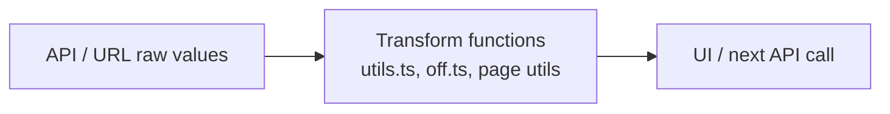
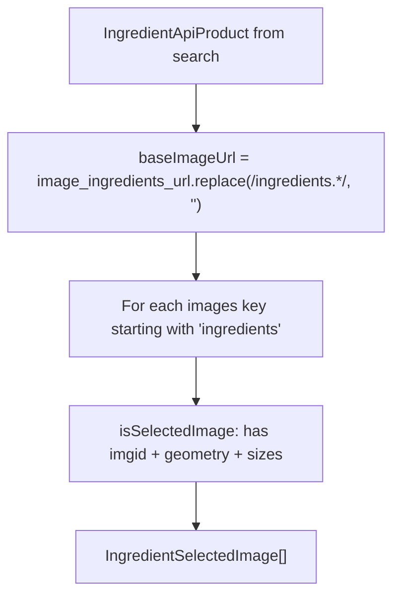

# Phase 11 — Algorithms & Data Transformations

> **Open Food Facts Hunger Games — Contributor Onboarding**
>
> Continues from [Phase 10 — TanStack Query & Frontend State](./phase-10-tanstack-query-and-frontend-state.md)
>
> Evidence: `src/utils.ts`, `src/off.ts`, `src/robotoff.ts`, `src/pages/questions/utils.ts`, `src/hooks/useFilterState/getFilterParams.ts`, `src/components/QuestionFilter/`, `src/pages/ingredients/`, `src/pages/packaging/`, `src/pages/nutrition/utils.ts`, `src/utils/getCountryId.ts`, `src/l10n-shortcuts.ts`.

---

## What this phase covers

Phases 7–10 explained **flows and state**. Phase 11 maps the **pure transforms** sitting between API payloads and UI — the small functions that silently determine whether a filter works, an image loads, or a tag matches Robotoff.



**FACT:** There is no shared `transforms/` package. Logic is **distributed** — `src/utils.ts` is the closest thing to a global toolkit, but many transforms live in page files (`questions/utils.ts`, `ingredients/useData.tsx`, `packaging/index.tsx`).

---

## The global toolkit — `src/utils.ts`

| Function | Input → output | Used for |
|---|---|---|
| **`reformatValueTag`** | string → slugified tag | Robotoff `value_tag` / `brands` params, OFF facet URLs |
| **`removeEmptyKeys`** | object → same object, mutates | Strip null/empty query params before HTTP |
| **`capitaliseName`** | `en:france` → `France` | Display helper (strip 3-char lang prefix) |
| **`sleep`** | ms → Promise | Testing only |

### `reformatValueTag` — the tag slugifier

```typescript
// Simplified behavior:
trim → toLowerCase → replace accents/spaces/& → collapse "--"
```

**Character mapping (FACT):**

| Replaced | With |
|---|---|
| space, `'` | `-` |
| `&` | removed |
| `àâä`, `éèêë`, `îï`, `ôö`, `ûùü` | ASCII vowel |

Then: `output.replace(/-{2,}/g, "-")`

**Examples (INFERENCE from algorithm):**

| Input | Output |
|---|---|
| `en:Organic` | `en:organic` |
| `Ben & Jerry's` | `ben-jerrys` |
| `Crème Brûlée` | `crème-brûlée` → accent pass → `creme-brulee` |

**Call sites:**

- `robotoff.questions()` — `value_tag` and `brands` params
- `getValueTagExamplesURL()` — OFF examples page link

**Pitfall:** Facet links in `ADDITIONAL_INFO_TRANSLATION` use a **different** transform (`toLowerCase().replaceAll(" ", "-")`) — **not** `reformatValueTag`. Category/label facet URLs may disagree with Robotoff slug rules for edge characters.

---

### `removeEmptyKeys` — query param hygiene

```typescript
Object.keys(obj).forEach(
  (key) => (obj[key] == null || obj[key] === "") && delete obj[key],
);
return obj;
```

**FACT:** Mutates the object in place, then returns it.

**Used by:** `robotoff.questions`, `getInsights`, `searchLogos`, `updateLogo`, `getUnansweredValues`.

**INFERENCE:** Prevents sending `value_tag=` or `brands=` empty strings that might confuse Robotoff filtering.

---

## Barcode → CDN path

### `getFormatedBarcode` (`off.ts`)

```typescript
const BARCODE_REGEX = /(...)(...)(...)(.*)$/;
// Groups of 3 digits, then remainder → join with "/"
```

| Barcode | CDN folder path |
|---|---|
| `0049000532258` | `004/900/053/2258` |
| Short codes | Partial groups still match regex |

**FACT:** Used before building `OFF_IMAGE_URL/...` paths in `getImagesUrls`, flagged images, and anywhere product photos are addressed by barcode.

**FACT:** `getImageUrl(imagePath)` only strips a leading `/` and prefixes `https://images.openfoodfacts.org/images/products/`.

---

## Image URL pipeline

Hunger Games builds image URLs in **three contexts** — same CDN, different entry points.

```mermaid
flowchart TB
    subgraph Questions["Questions sidebar"]
        IMG1["product.images numeric keys"]
        FMT1["getFormatedBarcode"]
        GU1["getImagesUrls"]
        OUT1[".../key.400.jpg + .../key.jpg"]
    end

    subgraph Logos["Logo games"]
        SRC["logo.image.source_image path"]
        GI["off.getImageUrl(source_image)"]
        CROP["robotoff.getCroppedImageUrl(url, bbox)"]
        OUT2["Robotoff /images/crop?..."]
    end

    subgraph Ingredients["Ingredients game"]
        BASE["image_ingredients_url strip /ingredients.*"]
        STATIC["replace images. → static."]
        OCR[".../predict/ingredient_list?ocr_url=...json"]
    end

    IMG1 --> FMT1 --> GU1 --> OUT1
    SRC --> GI --> CROP --> OUT2
    BASE --> STATIC --> OCR
```



### `getImagesUrls` (`pages/questions/utils.ts`)

1. Filter `images` keys that parse as integers (numeric `imgid` entries).
2. Build root: `OFF_IMAGE_URL/{formattedBarcode}/`
3. For each key:
   - `imageUrl`: `{root}/{key}.400.jpg` (thumbnail)
   - `imageUrlFull`: `{root}/{key}.jpg`
   - `uploaded_t`: Unix seconds → locale date string, or `"Unknown"`

**FACT:** `ProductInformation` calls `.reverse()` on the result — newest images assumed last in key order.

---

### `getFullSizeImage` — question hero image zoom

```typescript
if (!src) → placeholder PNG on images.openfoodfacts.org
if matches /\/[a-z_]+.[0-9]*.400.jpg$/ → replace 400.jpg with full.jpg
else → replace 400.jpg with jpg
```

**Used by:** `QuestionDisplay` → `ZoomableImage` full-resolution view.

---

### `getImageId` — duplicate implementations

| Location | Returns | Used for |
|---|---|---|
| `questions/utils.ts` | `Number` from filename | NutriPatrol flag (`ProductInformation`) |
| `nutrition/utils.ts` | `string` from last path segment | Nutrition helpers |
| `flaggedImages/index.tsx` | inline URL builder | Flagged image table |

**FACT:** Same name, different return types — check import path before reuse.

---

### Logo crop URL — bounding box order

**FACT** (`robotoff.getCroppedImageUrl`):

```typescript
const [y_min, x_min, y_max, x_max] = boundingBox;
// URLSearchParams: image_url, y_min, x_min, y_max, x_max
```

Coordinates are **normalized fractions** (0–1), not pixels. Logo pages pass `logo.bounding_box` from Robotoff unchanged.

Chain: `off.getImageUrl(logo.image.source_image)` → full CDN URL → crop query on Robotoff.

---

## Filter & URL param transforms

Two parallel naming schemes exist for Questions filters — transforms bridge them.

### URL ↔ app field mapping

**FACT** (`QuestionFilter/const.ts`):

| App field (`FilterState`) | URL param |
|---|---|
| `insightType` | `type` |
| `valueTag` | `value_tag` |
| `brandFilter` | `brand` |
| `countryFilter` | `country` |
| `sortByPopularity` | `sorted` |
| `campaign` | `campaign` |

**FACT:** `robotoff.FilterState` uses **`country`** and **`brand`** (from `getFilterParams`). `QuestionFilter/const.FilterState` uses **`countryFilter`** / **`brandFilter`**. `robotoff.questions()` reads `countryFilter` and `brandFilter` parameter names in its destructuring — but URL parsing fills `country` / `brand`. This works because robotoff's type merges both naming styles.

---

### `normalizeCountryFilter` (`getFilterParams.ts`)

```text
"en:world" → ""
bare taxonomy id "en:france" → lookup countries.json → countryCode "fr"
already "fr" → unchanged
```

**FACT:** Questions country chip only displays when `filterState.country` matches a dropdown `countryCode` — taxonomy ids in URL may filter Robotoff but not show the chip.

---

### Sort flag — string, not boolean

| Layer | Representation |
|---|---|
| URL | `sorted=true` or `sorted=false` (string) |
| Query key | `params.sorted !== "false"` → **boolean** |
| Robotoff | `order_by: sortByPopularity ? "popularity" : "random"` |

**FACT:** Default missing `sorted` param → `"true"` in `getFilterParams` → popularity sort.

---

### Legacy `useFilterSearch` bridge

**FACT:** `useFilterSearch.js` still maps `FilterState` ↔ URL via `useUrlParams` + `key2urlParam`, with synonym `value_tag` / `value`.

The live Questions page uses **`useFilterState`** (React Router) in `QuestionFilter.tsx` and `FilterDialog.tsx`. Home favorites / `QuestionCard` links use **`getQuestionSearchParams`** from the legacy module.

**INFERENCE:** Deep links must keep `value_tag` (not only `value`) for cross-app compatibility.

---

### `getValueTagQuestionsURL`

Builds `/questions?{searchParams}` when clicking a value tag chip — merges current `filterState` with question's `insight_type` + `value_tag`.

---

### Prefixless tag fallback (`SimilarQuestions`)

```typescript
const prefixlessTag = valueTag.includes(":")
  ? valueTag.substring(valueTag.indexOf(":") + 1)
  : null;
// e.g. "en:organic" → "organic" for broader search button
```

**INFERENCE:** Helps when exact taxonomy tag exhausts the queue but unprefixed slug might match more Robotoff questions.

---

## Country helpers

| Function | File | Transform |
|---|---|---|
| **`getCountryId`** | `utils/getCountryId.ts` | 2-letter `fr` → taxonomy id `en:france` via `countries.json` |
| **`getCountryName`** | `utils/getCountryName.ts` | `fr` → display label `"France"` |
| **`capitaliseName`** | `utils.ts` | `en:france` → `France` (slice after 3 chars) |
| **`getCountryLanguageCode`** | `nutrition/utils.ts` | `countryCode` → `languageCode` for nutrient CGI |

**FACT:** Packaging page: `getCountryId(country) || "en:france"` for OFF search facet tag.

---

## OFF product search — filter index expansion

**FACT** (`off.searchProducts`):

Each filter object `{ tagtype, tag_contains, tag }` becomes indexed CGI params:

```text
tagtype_0, tag_contains_0, tag_0
tagtype_1, tag_contains_1, tag_1
...
```

**Ingredients game filters:**

```javascript
{ tag: "en:ingredients-to-be-completed" }      // index 0
{ tag: "en:ingredients-photo-selected" }       // index 1
```

**Packaging buffer** (`useBuffer.ts`) builds its own URL with fixed state tags `packaging-to-be-completed` + `packaging-photo-selected` — same indexing pattern, hand-rolled.

---

## Robotoff question fetch — FilterState → HTTP params

**FACT** (`robotoff.questions` mapping):

| FilterState field | HTTP param | Transform |
|---|---|---|
| `insightType` | `insight_types` | direct |
| `valueTag` | `value_tag` | **`reformatValueTag`** |
| `brandFilter` | `brands` | **`reformatValueTag`** |
| `countryFilter` | `countries` | direct |
| `campaign` | `campaign` | direct |
| `predictor` | `predictor` | direct |
| `with_image` | `with_image` | direct |
| `sortByPopularity` | `order_by` | `"popularity"` or `"random"` |
| — | `lang` | **`getLang()`** |

---

### Post-fetch filter — product questions

**FACT** (`questionsByProductCode`):

```typescript
Number(code)  // barcode must parse as number for SDK
.filter(q => q.source_image_url)  // drop image-less questions
```

---

## Ingredients game transforms

### `formatData` (`useData.tsx`) — OFF product → game model



| Output field | How built |
|---|---|
| `imageUrl` | `{baseImageUrl}{imgid}.jpg` |
| `fetchDataUrl` | Robotoff predict URL with `ocr_url={staticBase}{imgid}.json` |
| `countryCode` | suffix after `ingredients_` in image key |
| `ingredients_text_*` | copied from product fields matching prefix |

**FACT:** `images.openfoodfacts.org` → `static.openfoodfacts.org` for OCR JSON path only.

---

### `ColorText` — align parsed ingredients to raw text

Algorithm (`IngeredientDisplay.tsx`):

1. Flatten nested `ingredients[]` from OFF parse response.
2. For each parsed ingredient, find `text.toLowerCase().indexOf(ingredientText, lastIndex)`.
3. Replace `‚` → `,` in ingredient text (OFF-specific character).
4. Emit colored `<span>` with tooltip by ingredient metadata:
   - green = has CIQUAL code
   - lightgreen = vegetarian recognized
   - blue = sub-ingredients
   - orange = unknown

**Without parsing:** fallback splits on `,` with alternating gray/black spans.

**Pitfall:** Matching is **substring search on lowercased text** — fails if user edits text after parse; order-sensitive via `lastIndex`.

---

## Packaging game transforms

### API → editable rows (`toEditablePackaging`)

```typescript
product.packagings.map((p, id) => ({
  id,
  material: p.material?.id ?? null,
  shape: p.shape?.id ?? null,
  recycling: p.recycling?.id ?? null,
  number: p.number_of_units?.toString() ?? "",
}))
```

### Editable rows → v3 PATCH (`formatData`)

```typescript
{ product: { fields: "updated", packagings: [
  { number_of_units?, shape: { id }, material: { id }, recycling: { id } }
]}}
```

**FACT:** Empty rows (no fields set) filtered out. All-empty → `{}` (validate button still calls PATCH with empty object — likely no-op).

---

### Fuzzy taxonomy match (`packaging/Row.tsx`)

```typescript
motif.normalize("NFD").replace(/[\u0300-\u036f]/g, "")  // strip accents
synonym.includes(normalizedMotif)  // case-insensitive substring
```

**Purpose:** Autocomplete filter and display label pick best synonym matching user typing.

---

### Static taxonomy → dropdown options (`useOptions`)

```typescript
Object.keys(taxonomyJson).map(key => ({
  value: key,                              // e.g. "en:plastic"
  synonyms: data[key].synonyms[lang] ?? xx ?? en,
  label: synonyms[0],
})).sort by label localeCompare
```

---

## Nutrition helpers (`nutrition/utils.ts`)

| Function | Role |
|---|---|
| **`structurePredictions`** | Filter `NUTRIMENTS` list to rows with display flag, prediction, or existing product value |
| **`isValidUnit`** | Enforce `FORCED_UNITS` for energy fields |
| **`postRobotoff`** | Filter form data keys containing `"100g"` or `"serving"`, build `annotation=2` POST body |
| **`getImageId`** | String id from URL path (duplicate of questions helper) |
| **`getCountryLanguageCode`** | Map country → language for `/cgi/nutrients.pl` |

**FACT / quirk:** In `postRobotoff`, line `const nutriId = type.replace(\`_${type}\`, "")` does not strip suffixes as the comment suggests (`type` is `"100g"`, not a nutriment key). `FORCED_UNITS` lookup via that variable is effectively broken; keys in `filteredValues` still use full nutriment field names.

---

## Display & UX transforms

### `ADDITIONAL_INFO_TRANSLATION` — product field → sidebar row

Maps product JSON keys (`brands`, `categories_tags`, …) to:

- i18n key
- optional translated field name on product
- Product Opener `#anchor`
- optional OFF facet URL builder

---

### Keyboard shortcuts (`l10n-shortcuts.ts`)

| Lang | Yes | No | Skip |
|---|---|---|---|
| default / en | `y` | `n` | `k` |
| fr | `o` | `n` | `k` |

**FACT:** `useKeyboardShortcuts` ignores shortcuts when focus is in INPUT/TEXTAREA/SELECT/contentEditable.

---

### NutriPatrol flag URL (`externalApi.ts`)

```typescript
NUTRI_PATROL_URL + ?barcode=&image_id=&source=web&flavor=off
```

Opens new tab — no return value handling.

---

## Transform catalog — quick reference

| Transform | Location | When it runs |
|---|---|---|
| `reformatValueTag` | `utils.ts` | Before Robotoff tag/brand queries |
| `removeEmptyKeys` | `utils.ts` | Before most Robotoff GET/PUT params |
| `getFormatedBarcode` | `off.ts` | CDN image paths |
| `getImagesUrls` | `questions/utils.ts` | Product sidebar gallery |
| `getFullSizeImage` | `questions/utils.ts` | Question zoom |
| `getCroppedImageUrl` | `robotoff.ts` | All logo UIs |
| `normalizeCountryFilter` | `getFilterParams.ts` | URL → filter on load |
| `getFilterParams` / `setFilterParams` | `getFilterParams.ts` | URL ↔ FilterState |
| `getQuestionSearchParams` | `useFilterSearch.js` | Link building to `/questions` |
| `formatData` (ingredients) | `useData.tsx` | Search response → queue items |
| `ColorText` | `IngeredientDisplay.tsx` | Parsed ingredient highlighting |
| `formatData` (packaging) | `packaging/index.tsx` | Form → v3 PATCH body |
| `firstSynonymMatching` | `packaging/Row.tsx` | Taxonomy autocomplete filter |
| `structurePredictions` | `nutrition/utils.ts` | Nutrient table rows |

---

## Headspace protection

### MUST UNDERSTAND NOW

1. **`reformatValueTag`** runs on Robotoff filter tags/brands — not on all OFF links.
2. **Barcode CDN paths** use 3-digit grouping via `getFormatedBarcode`.
3. **Logo images** = OFF full image URL + Robotoff crop with `[y_min, x_min, y_max, x_max]`.
4. **URL `sorted=false`** is the string that disables popularity sort.
5. **Country URL values** may be `fr` (chip) or taxonomy id (search) depending on entry path.

### USEFUL LATER

- Duplicate `getImageId` implementations
- `ColorText` substring matching limitations
- Facet URL vs `reformatValueTag` inconsistency
- Ingredients `images.` → `static.` for OCR
- `postRobotoff` nutriId line quirk

### IGNORE FOR NOW

- Exact OFF ingredients parser grammar
- CIQUAL code assignment rules
- Robotoff predictor internals
- Azure `getTableExtractionAI` URL format (dead code)

---

## Phase 11 summary — five things to remember

1. **`src/utils.ts` is small but load-bearing** — tag slugging and param cleanup feed Robotoff.
2. **Image handling is three pipelines** — product gallery, logo crop, ingredient OCR.
3. **Filter transforms are split** — URL parsing, name aliasing, and Robotoff param mapping are separate steps.
4. **Page-local `formatData` functions** shape OFF JSON into game-specific models (ingredients, packaging).
5. **Same function names can differ** — verify file path before reusing `getImageId`, `FilterState`, `formatData`.

### Uncertainties

- **UNKNOWN:** Whether `reformatValueTag` matches Robotoff server-side normalization exactly for all Unicode edge cases.
- **INFERENCE:** `capitaliseName` assumes 3-char language prefix (`en:`) — breaks for unusual tag prefixes.
- **FACT:** Two facet URL builders use different slug rules (see `ADDITIONAL_INFO_TRANSLATION` vs `reformatValueTag`).

---

## What comes next

**Phase 12 — Run locally + CORS investigation**

Install deps, start Vite dev server, observe browser network behavior against Robotoff/OFF cross-origin cookies, and document what works on localhost vs production.

---

*Stop here. Pick one filter URL, trace it through `getFilterParams` → `getQuestionKeys` → `reformatValueTag` in `robotoff.questions`, and one barcode through `getFormatedBarcode` → `getImagesUrls`. Those two chains cover half of contributor debugging. Continue to Phase 12 when ready.*
