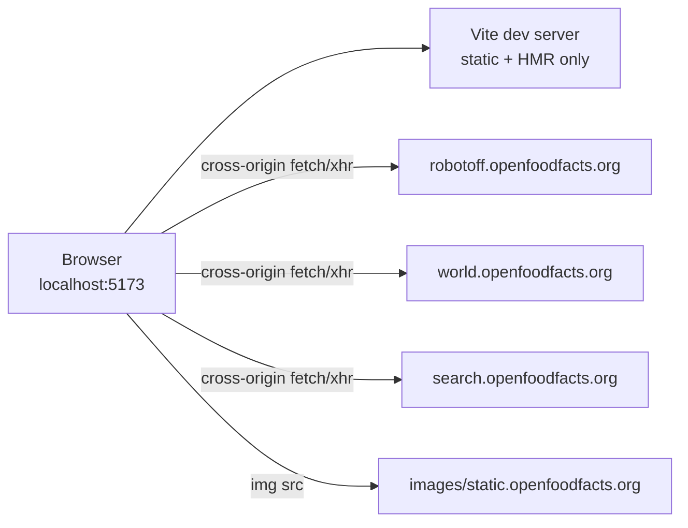

# Phase 12 — Run Locally + CORS Investigation

> **Open Food Facts Hunger Games — Contributor Onboarding**
>
> Continues from [Phase 11 — Algorithms & Data Transformations](./phase-11-algorithms-and-data-transformations.md)
>
> Evidence: `package.json`, `.nvmrc`, `.yarnrc.yml`, `vite.config.mjs`, `README.md`, `src/const.ts`, `src/App.jsx`, `src/off.ts`, `src/robotoff.ts`, `.github/workflows/ci-cd.yml`, `netlify.toml`, live `yarn install` / `yarn dev` / `yarn build` on this machine (Sep 2026), `curl` CORS probes, browser load of `/questions`.

---

## What Phase 12 proves

Until now, onboarding was **read-only code archaeology**. Phase 12 confirms:

1. The repo **runs on your machine**
2. Dev mode talks to **real production APIs** (no local backend, no Vite proxy)
3. **CORS + cookies** behave differently on `localhost:5173` vs `hunger.openfoodfacts.org`

**FACT (this session):** `yarn dev` serves the app at `http://localhost:5173/` and `/questions` loads a live Robotoff question (label “Triman”, product sidebar populated).

---

## Local setup — verified steps

### Prerequisites

| Requirement | Repo source | This machine (verified) |
|---|---|---|
| **Node** | `.nvmrc` → `24.12.0` | `v22.22.2` (works; CI uses `.nvmrc`) |
| **Yarn** | `packageManager: yarn@4.18.0` | via `corepack prepare yarn@4.18.0 --activate` |
| **Package manager** | Yarn 4, `nodeLinker: node-modules` | `.yarnrc.yml` |

**FACT:** README still links **classic Yarn** install docs — stale vs `packageManager` field.

### Install & run

```bash
cd hunger-games
corepack enable
corepack prepare yarn@4.18.0 --activate   # if yarn not on PATH
yarn install
yarn dev
```

| Command | Result (verified) |
|---|---|
| `yarn install` | 529 packages, ~23s, peer-dep warnings (non-blocking) |
| `yarn dev` | Vite 8.2.2 ready at **`http://localhost:5173/`** |
| `yarn build` | Succeeds → `dist/` (~482 kB main chunk + lazy routes) |

### Optional

| Command | Purpose |
|---|---|
| `yarn preview` | Serve production build locally |
| `yarn lint` | Prettier + ESLint (CI gate) |
| `yarn knip` | Dead export detection |

---

## README vs reality — setup mismatches

| README says | Code says |
|---|---|
| Classic Yarn install | **Yarn 4** via Corepack |
| `openfoodfacts-js` sibling project | Dependency is **`@openfoodfacts/openfoodfacts-nodejs`** |
| `yarn dev` only | Also document **`corepack`** for first-time setup |

**INFERENCE:** Follow `package.json` + CI workflow over README when they disagree.

---

## Vite configuration — no API proxy

**FACT** (`vite.config.mjs`):

- `@vitejs/plugin-react`
- Copies webcomponent images to `/assets/webcomponents` at dev/build time
- **No `server.proxy`** — browser calls `robotoff.openfoodfacts.org`, `world.openfoodfacts.org`, etc. **directly**



**MUST UNDERSTAND NOW:** Local dev is not a sandbox — you hit **production OFF/Robotoff** unless you manually repoint constants (not supported out of the box).

---

## Dev-only behavior (`import.meta.env.DEV`)

**FACT** (`src/const.ts`, `src/App.jsx`, logo components):

| Behavior | Production | `yarn dev` |
|---|---|---|
| **`IS_DEVELOPMENT_MODE`** | `false` | `true` |
| **Login gate** | `GET /cgi/auth.pl` + session cookie | **Skipped** — `isLoggedIn: true` always |
| **`URL_ORIGINE`** | `https://hunger.openfoodfacts.org` | `http://localhost:5173` |
| **Matomo page views** | Tracked | **Disabled** |
| **Logo mutations** (`updateLogo`, `annotateLogos`) | Sent to Robotoff | **Skipped** in some components when `IS_DEVELOPMENT_MODE` |
| **Questions `annotate()`** | Sent | **Still sent** (not gated by dev flag) |

**Pitfall:** You can **annotate real insights from localhost** while logo writes are partly suppressed — asymmetry is intentional in code, easy to forget.

---

## Deployment targets (context for “production”)

| Path | Mechanism |
|---|---|
| **Primary (CI)** | `.github/workflows/ci-cd.yml` → `yarn build` → `yarn deploy` → GitHub Pages |
| **`deploy.sh`** | Copies `index.html` to `404.html`, route-specific HTML shells in `dist/` |
| **`netlify.toml`** | Also defines `yarn build` → `dist` — **UNKNOWN** if still active vs GitHub Pages canonical |

**FACT:** `package.json` `homepage` = `https://hunger.openfoodfacts.org/`

---

## CORS investigation — methodology

Tests run with:

```bash
curl -sI -H "Origin: http://localhost:5173" -X GET "<url>"
curl -sI -H "Origin: https://hunger.openfoodfacts.org" -X GET "<robotoff-url>"
```

Plus browser `fetch(..., { credentials: 'include' })` to Robotoff from `localhost:5173/questions` → **HTTP 200 OK**.

---

## CORS results summary

### Robotoff (`robotoff.openfoodfacts.org`)

**FACT:** Reflects requesting origin + allows credentials.

```http
access-control-allow-credentials: true
access-control-allow-origin: http://localhost:5173
```

(same pattern for `Origin: https://hunger.openfoodfacts.org` → that origin echoed)

| Implication |
|---|
| SDK `fetch` with `credentials: "include"` **works from localhost** |
| `axios` calls **without** `withCredentials` still work for reads |
| Annotation POSTs with credentials **should work** from local dev |

**Verified:** GET `/api/v1/questions/?lang=en&count=1` from browser on localhost → **200**.

---

### Open Food Facts API (`world.openfoodfacts.org`)

**FACT:** Wildcard CORS on tested endpoints:

```http
access-control-allow-origin: *
access-control-allow-methods: HEAD, GET, PATCH, POST, PUT, OPTIONS
```

**No** `access-control-allow-credentials: true` on v0 GET or v3 PATCH responses.

| Client config in HG | CORS + credentials interaction |
|---|---|
| `off.getProduct` (axios, **no** `withCredentials`) | **Works** — simple cross-origin GET |
| `off.setIngedrient` (axios PATCH, **no** `withCredentials`) | **INFERENCE:** preflight succeeds with `*` — writes possible without cookie |
| Packaging PATCH (`withCredentials: true`) | **INFERENCE:** browser may **block** — wildcard + credentials incompatible |
| `offClient` SDK (`credentials: "include"`) | **INFERENCE:** may fail on reads that need cookie — rarely used except facet stats |
| `App.jsx` auth (`withCredentials: true`) | **Only when not DEV** — skipped locally |

**Browser CORS rule (FACT):** `Access-Control-Allow-Origin: *` **cannot** be used with credentialed requests (`credentials: 'include'` / `withCredentials: true`).

---

### Search autocomplete (`search.openfoodfacts.org`)

**FACT:** GET returns `access-control-allow-credentials: true` (origin reflection not always visible in HEAD-only probe; GET from localhost works in practice via `LabelFilter` / page load).

---

### Static CDN (`static.openfoodfacts.org`, `images.openfoodfacts.org`)

**FACT:** Loaded via `` or axios GET — no CORS preflight for images; taxonomy JSON fetched cross-origin without credentials in `useOptions`.

---

## Credentials map — who sends cookies?

| Call site | Credentials | Remote |
|---|---|---|
| `robotoffClient` / SDK annotate | `include` | Robotoff |
| `robotoff.questions` (axios) | default (omit) | Robotoff |
| `robotoff.updateLogo` | `withCredentials: true` | Robotoff |
| `off.getProduct`, `searchProducts` | omit | OFF |
| `off.setIngedrient` | omit | OFF v3 |
| Packaging PATCH | `withCredentials: true` | OFF v3 |
| Nutrition `postRobotoff` | `withCredentials: true` | Robotoff |
| `App.jsx` auth | `withCredentials: true` | OFF CGI (prod only) |
| `LabelFilter` SearchApi | plain `fetch` | search service |

**INFERENCE:** The app is ** inconsistent by design/history** — Robotoff SDK path is credentialed; many axios reads are anonymous.

---

## Session cookies on localhost

```mermaid
sequenceDiagram
    participant U as You
    participant HG as localhost:5173
    participant OFF as world.openfoodfacts.org

    Note over U,OFF: Production path
    U->>OFF: Log in (sets session cookie on .openfoodfacts.org)
    U->>HG: Open hunger.openfoodfacts.org
    HG->>OFF: credentialed requests (same-site-ish ecosystem)

    Note over U,OFF: Localhost path
    U->>OFF: Log in on world.openfoodfacts.org
    U->>HG: Open localhost:5173
    Note over HG: DEV: skips auth.pl check anyway
    HG->>OFF: cookie may NOT be sent (third-party context)
    HG->>Robotoff: annotate may still work (Robotoff CORS allows localhost origin)
```

**FACT:** OFF session cookie domain is **`openfoodfacts.org`** — not shared as first-party on `localhost`.

**FACT:** Dev mode **does not require login** for most routes; logo routes still check `isLoggedIn` but dev sets it `true`.

**To test real auth locally (INFERENCE):**

1. Run `yarn preview` or build served from a hostname under `openfoodfacts.org` (maintainer setup), **or**
2. Temporarily disable dev auth bypass (not documented — code change), **or**
3. Test writes on **production** staging URL after PR deploy

**FACT:** Internal **`/bugs`** route (`BugPage`) exercises OFF v3 PATCH/POST with `withCredentials: true` — manual CORS/auth debugger for maintainers.

---

## Service worker — not an API cache

**FACT** (`public/serviceWorker.js`):

- Only intercepts **same-origin** `navigate` GETs
- Caches `index.html` + `offline.html`
- **Does not** cache Robotoff/OFF API responses

**INFERENCE:** Stale API data in dev is TanStack Query / browser cache — not service worker.

---

## First local smoke test checklist

After `yarn dev`:

| Step | URL / action | Expected |
|---|---|---|
| 1 | `http://localhost:5173/` | Home loads, no white screen |
| 2 | `/questions` | Question card + Yes/No/Skip (French UI if browser lang FR) |
| 3 | DevTools → Network | Requests to `robotoff.openfoodfacts.org` **200** |
| 4 | DevTools → Network | `world.openfoodfacts.org/api/v0/product/...` **200** |
| 5 | Answer one question | Queue advances; annotate POST to Robotoff (check Network) |
| 6 | `/logos` | Page loads (dev login bypass) |
| 7 | `yarn build && yarn preview` | Production bundle serves same routes |

**WARN:** Step 5 mutates **real** Robotoff/OFF data if annotate succeeds — use Skip or a throwaway filter in dev if you prefer not to contribute from localhost.

---

## Console noise in dev (harmless)

**FACT (observed on `yarn dev` load):**

- `reactour` → `UNSAFE_componentWillReceiveProps` strict-mode warning
- `styled-components` unknown prop warnings on tour overlay
- Webcomponents load log from `OffWebcomponentsConfiguration`

Not blockers for local development.

---

## Peer dependency warnings on install

**FACT:** `yarn install` reports peer mismatches (`reactour` vs React 19, `eslint` 10 vs plugins, etc.). Build and dev **still succeed**.

CI uses `yarn install --immutable` — commit lockfile changes with dependency updates.

---

## localhost vs production — practical matrix

| Concern | `localhost:5173` (dev) | `hunger.openfoodfacts.org` |
|---|---|---|
| API endpoints | Production URLs | Production URLs |
| Auth check | Bypassed | OFF session via cookie |
| Robotoff reads | Works | Works |
| Robotoff annotate | Works (verified GET; POST credentialed) | Works |
| OFF product reads | Works | Works |
| OFF credentialed PATCH | **Unreliable** (CORS `*` + cookies) | **INFERENCE:** better when logged in on OFF |
| Logo write APIs | **Suppressed** when `IS_DEVELOPMENT_MODE` | Active when logged in |
| Matomo | Off | On |
| `URL_ORIGINE` links | Point to localhost | Point to production HG |

---

## Headspace protection

### MUST UNDERSTAND NOW

1. **No backend, no proxy** — local dev is a static SPA hitting prod APIs.
2. **Robotoff CORS is localhost-friendly** — echo origin + credentials.
3. **OFF CORS uses `*`** — fine for anonymous reads; awkward for credentialed writes from localhost.
4. **`IS_DEVELOPMENT_MODE` fakes login** — logo gate passes; auth.pl not called.
5. **Annotating from dev can affect real data** — Questions game is not mocked.

### USEFUL LATER

- `/bugs` page for manual v3 API experiments
- `corepack` + Node 24 from `.nvmrc` for CI parity
- `yarn preview` for prod-bundle local test
- GitHub Pages `deploy.sh` HTML fallbacks for client-side routes

### IGNORE FOR NOW

- Setting up local Robotoff/OFF instances
- Vite proxy configuration (does not exist)
- Netlify vs GitHub Pages ownership dispute

---

## Phase 12 summary — five things to remember

1. **`corepack` + Yarn 4.18.0 + `yarn dev`** → `http://localhost:5173`.
2. **Verified working:** Questions page loads live Robotoff + OFF product data from localhost.
3. **Robotoff allows credentialed cross-origin from localhost** — echoed ACAO header.
4. **OFF uses wildcard CORS** — anonymous reads OK; credentialed PATCH from localhost is the risky combo.
5. **Dev mode ≠ safe sandbox** — real APIs, partial write guards only on some logo paths.

### Uncertainties

- **UNKNOWN:** Whether Netlify deploy is still used alongside GitHub Pages.
- **INFERENCE:** Packaging/nutrition writes from localhost may fail silently or in Network tab until logged-in on a same-origin OFF host.
- **FACT:** This session used Node 22; CI expects Node 24 per `.nvmrc`.

---

## What comes next

**Phase 13 — Browser ↔ code walkthrough**

With the app running, step through `/questions` in DevTools: one filter change, one question fetch, one answer — mapping Network panel entries to exact files and functions from Phases 7–11.

---

*Stop here. Run `yarn dev`, open `/questions`, and keep DevTools Network open — you now have enough CORS context to interpret what succeeds and what mysteriously fails. Continue to Phase 13 when ready.*
