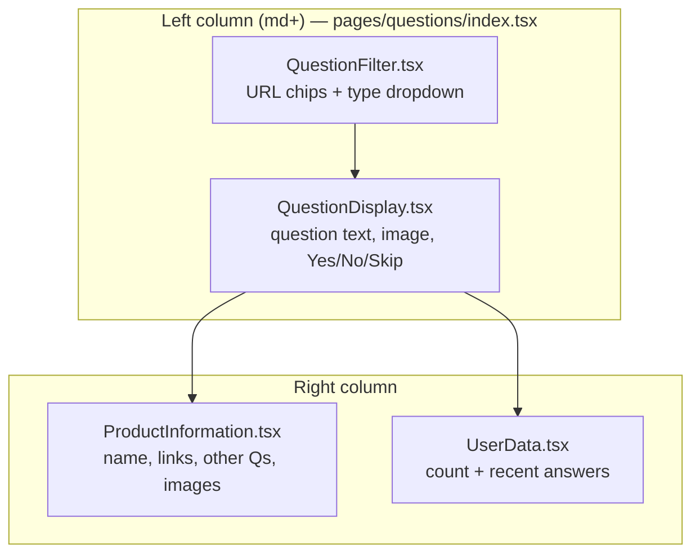
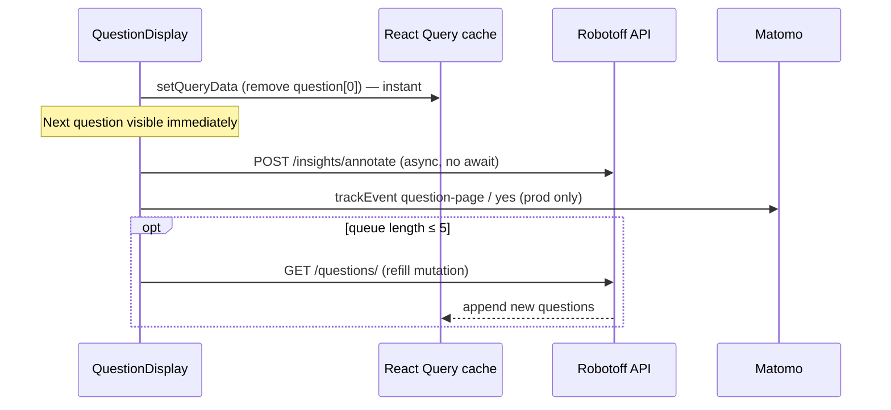

# Phase 13 — Browser ↔ Code Walkthrough

> **Open Food Facts Hunger Games — Contributor Onboarding**
>
> Continues from [Phase 12 — Run Locally + CORS](./phase-12-run-locally-and-cors.md)
>
> Evidence: live `/questions?type=label&sorted=true` on `localhost:5173` (Sep 2026), `QuestionDisplay.tsx`, `ProductInformation.tsx`, `useQuestions.ts`, `useProduct.ts`, `ProductOtherQuestions.tsx`, `CroppedLogo.tsx`, `QuestionFilter.tsx`, Phases 7–11 traces.

---

## Goal of this phase

Phase 7 explained **execution order in code**. Phase 13 ties that to **what you see in Chrome DevTools** while using `/questions` — so a Network row becomes a file path in your head.

**Prerequisite:** `yarn dev` running, app open at `http://localhost:5173/questions`.

---

## DevTools setup (do this once)

1. Open **DevTools** → **Network**
2. Check **Preserve log** (survives React re-renders / soft navigations)
3. Filter: **`Fetch/XHR`** for API calls; disable filter to also see **Img** CDN loads
4. Optional filter box: `robotoff` or `openfoodfacts`

**Columns worth enabling:** Name, Status, Type, Initiator, Size, Time.

**FACT:** Hunger Games has **no React Query Devtools** panel wired — cache state is invisible unless you infer from behavior or add the plugin yourself.

---

## Page layout ↔ React components

When a question is on screen, the UI maps to files like this:



| What you see | Component | Key hook |
|---|---|---|
| “Ne montre que” / insight type dropdown | `QuestionFilter.tsx` | reads `getFilterParams(searchParams)` |
| Question text + hero image | `QuestionDisplay.tsx` | `useQuestions(filterState)` |
| Yes / No / Skip buttons | `QuestionAnswerButtons` in same file | `answerQuestion` |
| “Questions restantes : 100+” | `UserData.tsx` | `useQuestions()` → `questionsCount` |
| Product name + Voir/Modifier | `ProductInformation.tsx` | `useProductData(barcode)` |
| “Autres questions” | `ProductOtherQuestions.tsx` | `useProductQuestions(barcode)` |
| Small logo overlay (desktop) | `CroppedLogo.tsx` | `insightDetail` + crop `` |

**FACT:** `QuestionDisplay`, `ProductInformation`, and `UserData` each call **`useQuestions()`** — they share one React Query cache (deduped fetch).

---

## Walkthrough A — Initial page load

**URL example:** `/questions?type=label&sorted=true`

### Timeline (what happens in order)

| Step | User-visible | Code path | Network (typical) |
|---|---|---|---|
| **A1** | Blank → app shell | `index.tsx` → `App.jsx` → lazy `pages/questions/index.tsx` | `localhost` JS modules (Vite) |
| **A2** | Filter bar shows `label` | `QuestionFilter` reads URL → `getFilterParams` | *(no API)* |
| **A3** | “Please wait…” spinner | `useQuestions` → `useQuery` pending | — |
| **A4** | Question appears | `robotoff.questions()` resolves | **GET** `robotoff.openfoodfacts.org/api/v1/questions/?...` |
| **A5** | Product name fills in | `useProductData(barcode)` | **GET** `world.openfoodfacts.org/api/v0/product/{barcode}.json?fields=...` |
| **A6** | Hero image loads | `question.source_image_url` on `` | **GET** `images.openfoodfacts.org/...` (often `.400.jpg`) |
| **A7** | Sidebar “other questions” | `useProductQuestions` | **GET** Robotoff SDK `questionsByProductCode` |
| **A8** | Tiny logo bottom-right (desktop) | `CroppedLogo` effect | **GET** `.../insights/detail/{insight_id}` maybe **GET** `.../images/logos?logo_ids=` then **GET** `.../images/crop?...` |
| **A9** | Matomo script | `MatomoProvider` on mount | **GET** `analytics.openfoodfacts.org/matomo.js` |

**FACT (Phase 12):** In `yarn dev`, **Matomo page views are not sent** (`App.jsx` skips `trackPageView` when `IS_DEVELOPMENT_MODE`). The script may still load.

### Decode the main Questions request

**Initiator chain:**

```text
useQuestions.ts → useQuery queryFn → robotoff.questions()
  → axios.get(`${ROBOTOFF_API_URL}/questions/`, { params })
```

**Query params you should recognize in Network:**

| Param | Source |
|---|---|
| `insight_types` | URL `type=label` |
| `order_by` | `popularity` (because `sorted` ≠ `false`) |
| `lang` | `getLang()` — browser / localStorage / `?language=` |
| `count` | `20` (default `pageSize`) |
| `with_image` | `true` |
| `value_tag`, `brands`, `countries`, … | only if set in URL |

**Transform before wire:** `value_tag` / `brands` pass through **`reformatValueTag`** (Phase 11).

**Response shape:** `{ count, questions: [...] }` — UI uses **`questions[0]`** only initially.

---

## Walkthrough B — Change a filter

**Action:** In the filter bar, change insight type from `label` to `brand`.

| Step | What changes | Code |
|---|---|---|
| **B1** | URL updates `?type=brand&...` | `QuestionFilter` → `setSearchParams` |
| **B2** | New React Query key | `getQuestionKeys` — first segment after `"questions"` changes |
| **B3** | New fetch (deduped) | `useQuestions` `queryFn` → `robotoff.questions()` again |
| **B4** | UI resets to loading → new question | `question === null && status === pending` branch |

**DevTools check:**

- New **GET** `/questions/` with `insight_types=brand`
- Old cache entry **stays in memory** (not invalidated) — switch back URL to see prior queue if still warm

**Open Filter dialog** (`FilterDialog.tsx`): applies batch update via **`useFilterState` setter** → same URL mechanism as chips.

---

## Walkthrough C — Answer “Oui” (Yes)

**Action:** Click **Oui** (or press `o` in FR / `y` in EN).

### Network order (important)



| # | Request | When | Code |
|---|---|---|---|
| **C1** | *(none required for UI update)* | **Immediate** | `answerQuestion` → `setQueryData` |
| **C2** | **POST** `robotoff.../insights/annotate` | Milliseconds after click | `robotoff.annotate` via SDK `fetch` + `credentials: include` |
| **C3** | **GET** `/questions/` | Only if queue ≤ 5 and server has more | `useMutation` refill in `useQuestions.ts` |
| **C4** | **GET** `/product/{newBarcode}.json` | When head question barcode changes | `useProductData` |
| **C5** | New **img** requests | New `source_image_url` | `<QuestionImage>` |

**Body of annotate (SDK):** `insight_id`, `annotation: 1`, `update: 1`.

**What DevTools will NOT show:**

- No “success toast” network call — failures only **`console.error`**
- No rollback request if annotate fails

**Sidebar `UserData`:** after Yes/No (not Skip), **`recent-answers`** cache prepends locally — **no HTTP**.

---

## Walkthrough D — Empty queue

When `questions` array is empty after success:

| UI | Component |
|---|---|
| “No questions remaining” + similar tags | `SimilarQuestions.tsx` |
| Taxonomy parent/child fetch | **GET** `world.openfoodfacts.org/api/v2/taxonomy?...` via `getTaxonomy` |

Triggered from `QuestionDisplay` when `question === null && status !== pending && !== error`.

---

## Network catalog — `/questions` reference table

| Request pattern | Type | Trigger file | Purpose |
|---|---|---|---|
| `/api/v1/questions/?` | xhr/fetch | `useQuestions.ts` | Main queue |
| `/api/v0/product/{code}.json` | xhr | `useProduct.ts` | Sidebar product context |
| `/questions/{barcode}` (SDK) | fetch | `useProductQuestions.ts` | Other questions list |
| `/insights/detail/{id}` | fetch | `CroppedLogo.tsx`, `DebugQuestion.tsx` | Logo bbox metadata |
| `/images/logos?logo_ids=` | xhr | `CroppedLogo.tsx` | Fallback bbox |
| `/images/crop?` | img | `CroppedLogo`, logo games | Cropped preview |
| `images.openfoodfacts.org/...` | img | `source_image_url`, `getImagesUrls` | Photos |
| `/api/v2/taxonomy?` | xhr | `SimilarQuestions.tsx` | Empty-state suggestions |
| `search.openfoodfacts.org/autocomplete` | fetch | `LabelFilter.tsx` | Filter dialog typing (≥2 chars) |
| `analytics.openfoodfacts.org/matomo` | script/img | `MatomoProvider` | Analytics |

**Not on Questions page load:** OFF v3 PATCH, packaging search, ingredient predict — other routes.

---

## Initiator column — how to find the source file

1. Click the Network row → **Initiator** tab
2. For axios: stack often shows `robotoff.ts` → `useQuestions.ts`
3. For SDK fetch: `@openfoodfacts/openfoodfacts-nodejs` → `robotoff.ts`
4. For images: initiator is **Parse HTML** or **React commit** — trace from component:
   - Hero image → `QuestionDisplay` → `question.source_image_url`
   - Gallery thumbs → `ProductInformation` → `getImagesUrls`

**Vite modules** (`/@fs/`, `/src/`) are local HMR — ignore when debugging API bugs.

---

## Elements ↔ data attributes (mental map)

| Element | Data source field |
|---|---|
| Question heading | `question.question` |
| Value chip / link | `question.value`, `question.value_tag` |
| Hero image URL | `question.source_image_url` (Robotoff-provided, not OFF product JSON) |
| Reference logo thumb | `question.ref_image_url` |
| Remaining count | `data.count` from questions API (display capped “100+”) |
| Product title | `product.product_name` from OFF v0 |

**Debug accordion** (dev customization): `DebugQuestion.tsx` → query `["insight-details", insightId]`.

---

## Keyboard path (same as click)

**File:** `useKeyboardShortcuts.ts` → `getShortcuts()` from `l10n-shortcuts.ts`

| Locale | Yes | No | Skip |
|---|---|---|---|
| EN | `y` | `n` | `k` |
| FR | `o` | `n` | `k` |

Shortcuts **disabled** when focus is in INPUT / TEXTAREA / SELECT.

Network result **identical** to button click — same `answerQuestion`.

---

## Product sidebar — parallel fetches per question

When barcode = `X`, expect **up to three Robotoff/OFF reads**:

```text
1. useQuestions        → already have question
2. useProductData(X)   → OFF v0 product
3. useProductQuestions(X) → Robotoff per-product questions
4. CroppedLogo         → insightDetail(X's insight_id)  [desktop]
```

**FACT:** `ProductOtherQuestions` keeps **local React state** for pending answers — sending sidebar answer triggers **another** `annotate` POST but **does not** remove items from main queue cache.

---

## Controlled debugging exercises

Do these yourself with Network + Sources open:

### Exercise 1 — Filter → key → URL

1. Set URL to `/questions?type=category&value_tag=en:organic&country=fr`
2. Find GET `/questions/` params: `insight_types=category`, `value_tag=...` (reformatted), `countries=fr`
3. In Sources, set breakpoint in `getFilterParams` — reload, confirm URL parsing

### Exercise 2 — Optimistic answer

1. Throttle Network to **Slow 3G**
2. Click **Skip**
3. **Observe:** UI advances **before** annotate POST completes
4. Breakpoint in `useQuestions.ts` inside `setQueryData` callback

### Exercise 3 — Refill

1. Filter narrow tag with few questions; answer until queue small
2. Watch for **second** GET `/questions/` without full page reload
3. Match to `mutation.mutate(keys)` guard (`length <= 5`)

### Exercise 4 — Failed annotate

1. Block `robotoff.openfoodfacts.org` in Network **Request blocking** (one tab)
2. Answer a question — UI still advances
3. Console: `Error while answering question`

---

## Production vs localhost differences (DevTools)

| Signal | `yarn dev` | Production |
|---|---|---|
| `auth.pl` request on load | **Absent** | Present when cookie changes |
| Matomo `trackPageView` | **Skipped** | On route change |
| Matomo `trackEvent` on answer | Fires if script loaded | Fires |
| Annotate POST | **Real** | Real |
| Initiator paths | `.tsx` sources | Bundled `assets/*.js` |

---

## Common “Network looks wrong” explanations

| Symptom | Likely cause | Where to look |
|---|---|---|
| Two identical `/questions/` on load | Strict Mode double mount **or** two components mounting same query | React 19 StrictMode; normal dedupe |
| `/questions/` but UI empty | `questions: []` returned | Try broader filter; see `SimilarQuestions` |
| Product 404 in Network | Invalid barcode on question | `useProduct` throws; sidebar skeleton |
| CORS error on OFF PATCH | Not Questions page — wrong route | Phase 12 matrix |
| annotate 401/403 | Not logged in on Robotoff/OFF session | Expected for attributed edits; UI won't rollback |
| Images 404 | Bad `source_image_url` or CDN path | Compare with `getFormatedBarcode` paths |

---

## Headspace protection

### MUST UNDERSTAND NOW

1. **One GET `/questions/`** per filter key — drives the whole page.
2. **Answer = cache first, network second** — annotate is fire-and-forget.
3. **Hero image URL comes from Robotoff question**, OFF product fetch is separate.
4. **Multiple hooks share `useQuestions` cache** — count in sidebar matches main column.
5. **Initiator + request URL params** are enough to locate the responsible file in most cases.

### USEFUL LATER

- `CroppedLogo` extra insightDetail traffic on desktop only
- `usePotentialQuestionNumber` extra `/questions/?count=1` when badge enabled
- Request blocking for failure-mode testing

### IGNORE FOR NOW

- Web Vitals (`reportWebVitals.ts`) — not central to annotation flow
- Service worker — only offline shell for navigation

---

## Phase 13 summary — five things to remember

1. **Filter URL change → new query key → new GET `/questions/`**.
2. **Barcode change → new GET OFF v0 product**.
3. **Click Yes → instant UI via `setQueryData`, POST annotate async**.
4. **Sidebar other questions = separate Robotoff endpoint + local state**.
5. **DevTools Initiator + this table ≈ stack trace for frontend contributors**.

---

## What comes next

**Phase 14 — One controlled learning experiment**

A single small, user-approved code change (e.g. logging, UI tweak, or filter fix) to practice the full edit → lint → browser verify loop — only after you explicitly approve modifying the repo.

---

*Stop here. With DevTools open on `/questions`, answer one question and name three Network rows without looking at this doc. If you can do that, Phases 7–12 are integrated. Continue to Phase 14 only when you want hands-on code changes.*
