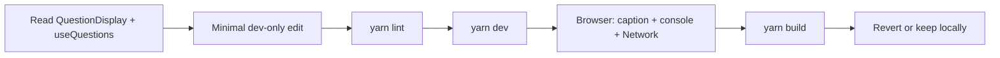

# Phase 14 — Controlled Learning Experiment

> **Open Food Facts Hunger Games — Contributor Onboarding**
>
> Continues from [Phase 13 — Browser ↔ Code Walkthrough](./phase-13-browser-code-walkthrough.md)
>
> This is the **first phase that modifies application code** — intentionally small, dev-only, and reversible.

---

## Purpose

Phases 1–13 built a mental model **without touching the repo**. Phase 14 runs one **end-to-end contributor loop**:

```text
read code → small change → yarn lint → yarn dev → browser verify → (optional) revert
```

The change is **not meant for upstream merge** — it exists so you practice the muscle memory before real issues.

---

## Experiment chosen: dev-only question debug strip

### Why this experiment

| Criterion | How this experiment fits |
|---|---|
| Touches the **Questions spine** | `QuestionDisplay.tsx` + `useQuestions.ts` |
| Maps to Phase 13 | You see `insight_id` on screen while matching Network annotate POST |
| **Zero production impact** | Gated on `IS_DEVELOPMENT_MODE` (`import.meta.env.DEV`) |
| Small diff | ~15 lines across 2 files |
| Easy revert | Delete the added blocks |

### What was added (FACT — in your working tree)

**1. `src/pages/questions/QuestionDisplay.tsx`**

Below the question image, in dev only:

```text
dev: {insight_id} · {barcode}
```

Monospace caption — correlates UI ↔ Robotoff annotate payload.

**2. `src/hooks/useQuestions.ts`**

On every answer in dev:

```javascript
console.info("[hunger-games] answerQuestion", { insight_id, answer, barcode })
```

Correlates click → optimistic cache update → background POST.

---

## Your walkthrough checklist

### 1. Confirm the diff

```bash
git diff src/pages/questions/QuestionDisplay.tsx src/hooks/useQuestions.ts
```

You should see only `IS_DEVELOPMENT_MODE` imports and the debug additions.

### 2. Lint

```bash
yarn lint
```

**Expected:** passes (or fix any Prettier/ESLint nits before continuing).

### 3. Run dev

```bash
yarn dev
```

Open: `http://localhost:5173/questions?type=label`

### 4. Visual verify

| Check | Expected |
|---|---|
| Debug caption visible | `dev: <uuid> · <barcode>` under image |
| Caption hidden on `yarn preview` / prod build | `IS_DEVELOPMENT_MODE === false` |

### 5. Console + Network verify

1. DevTools → **Console** — filter `hunger-games`
2. DevTools → **Network** → preserve log
3. Click **Oui** / **Yes**

| Signal | Expected order |
|---|---|
| Console `answerQuestion` log | **Immediately** with correct `insight_id` |
| UI advances to next question | **Before** annotate completes |
| Network POST `.../insights/annotate` | Same `insight_id` as log + caption |
| Console log on next question | New `insight_id` |

**You just verified Phase 7’s optimistic queue with your own instrumentation.**

### 6. Build smoke test

```bash
yarn build
```

Ensures TypeScript + Vite still compile. Debug UI must **not** appear in `dist/` behavior (prod bundle has `DEV=false`).

---

## Revert when done learning

```bash
git checkout -- src/pages/questions/QuestionDisplay.tsx src/hooks/useQuestions.ts
```

Or keep the debug aids locally on a personal branch — **do not open a PR** with dev-only logging to upstream unless maintainers ask for it.

---

## What you practiced



| Skill | Where |
|---|---|
| Find answer path | `QuestionAnswerButtons` → `answerQuestion` |
| Dev gating | `IS_DEVELOPMENT_MODE` from `const.ts` |
| Optimistic UX | Log before POST finishes |
| ID discipline | `insight_id` ≠ `barcode` |
| Quality gate | `yarn lint` before sharing work |

---

## Alternative experiments (if you want more practice)

Pick **one** — same loop, don’t stack all at once:

| Experiment | File | Learning |
|---|---|---|
| Log annotate **errors** to UI snackbar | `useQuestions.ts` | Error handling (touches product behavior — discuss first) |
| Show query key in dev caption | `useQuestions.ts` | Phase 10 cache keys |
| Fix facet link to use `reformatValueTag` | `questions/utils.ts` | Phase 11 transform consistency |
| Add `enabled: question?.barcode` to product query | `useProduct.ts` | TanStack Query guards |

---

## Common pitfalls (this experiment)

| Problem | Cause |
|---|---|
| No caption | Not running `yarn dev` (using preview/prod build) |
| No console log | Console filtered; or clicked in input field (shortcuts blocked too) |
| Lint fails | Run `yarn prettier` on touched files |
| `insight_id` mismatch vs Network | Answered too fast — use Preserve log, compare last POST |

---

## Headspace protection

### MUST UNDERSTAND NOW

1. **`insight_id`** is what Robotoff annotate sends — not the barcode.
2. **Dev-only guards** use `IS_DEVELOPMENT_MODE`, not user-facing devMode toggle.
3. **Lint + build** are the minimum bar before any real PR.
4. **This diff is learning scaffolding** — revert before contribution PRs unless intentional.

### IGNORE FOR NOW

- Opening a PR for this debug strip
- Husky pre-commit hooks (run automatically on commit)
- Translating debug strings to i18n

---

## Phase 14 summary

1. You ran a **real edit → lint → dev → verify** loop.
2. Dev caption + console log **prove** optimistic answer flow.
3. Production builds **exclude** the debug UI.
4. Revert with `git checkout --` when finished.
5. Ready for **Phase 15** (testing/CI reality) without needing to merge this change.

---

## What comes next

**Phase 15 — Testing & CI reality**

What `yarn lint`, GitHub Actions, and Knip actually enforce — and what Hunger Games **does not** test automatically.

---

*Stop here. Complete the checklist above on your machine. Revert the experiment when you no longer need the debug aids, then continue to Phase 15.*
