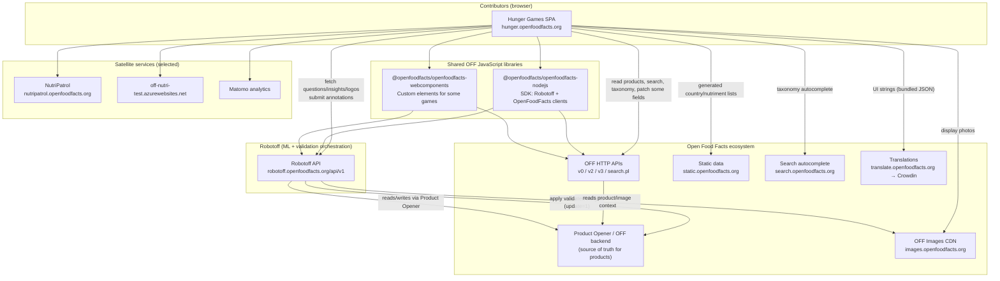

# Phase 2 — The Open Food Facts Ecosystem

> **Open Food Facts Hunger Games — Contributor Onboarding**
>
> Continues from [Phase 1 — What Real-World Problem Does Hunger Games Solve?](./phase-1-real-world-problem.md)
>
> Evidence sources: `src/const.ts`, `src/robotoff.ts`, `src/off.ts`, `src/offSearch.ts`, `src/offTaxonomy.ts`, `src/components/OffWebcomponents.tsx`, `package.json`, `README.md`, `.github/workflows/ci-cd.yml`, `.github/workflows/crowdin.yml`, [Robotoff API Reference](https://openfoodfacts.github.io/robotoff/references/api/).

---

## The one sentence you need first

> **Hunger Games is a browser frontend. It reads from Open Food Facts and Robotoff, sends human judgments mostly to Robotoff, and sometimes writes product fields directly to Open Food Facts — but it never owns the product database or the ML pipeline.**

If Phase 1 taught you the human-in-the-loop story, Phase 2 teaches you **where the walls are**.

---

## System context diagram



### How to read this diagram

- **Solid arrows from Hunger Games** are runtime HTTP calls the app makes today (directly or via SDK/webcomponents).
- **Robotoff → Product Opener** is the critical downstream path for validated ML insights. Hunger Games does not sit on that arrow; it stops at Robotoff for most annotation games.
- **Shared libraries** are not separate servers. They are npm packages that Hunger Games imports; they still call the same remote APIs.
- **Satellite services** appear in specific mini-games only (nutrition table extraction, image flagging). They are part of the extended ecosystem but not the core Questions flow.

---

## The three systems — and where Hunger Games stops

| System | What it is | Source of truth for… | Hunger Games relationship |
|---|---|---|---|
| **Open Food Facts (Product Opener + DB)** | Collaborative product database | Published product records, images metadata, taxonomies as stored on products | **Reads** heavily; **writes** in some games (ingredients, packaging) |
| **Robotoff** | ML inference + insight/question/annotation API | Insight lifecycle, annotation votes, logo detections, predictor outputs | **Reads** questions/insights/logos; **writes** annotations (primary validation path) |
| **Hunger Games** | React SPA (this repo) | Nothing authoritative — only UI state & caches | **Consumer** of OFF + Robotoff APIs |

### Boundary statements (memorize these)

> **Hunger Games is not Robotoff.**  
> It does not run predictors, store insights, or decide vote thresholds.

> **Hunger Games is not the Open Food Facts backend.**  
> It does not host product data. At most it sends edits through OFF APIs or through Robotoff's annotate→update pipeline.

> **Hunger Games is a frontend application sitting in a larger ecosystem.**  
> Its job is to present Robotoff/OFF data and return human decisions quickly.

---

## Dependency-by-dependency analysis

For each integration: **source of truth**, **call direction**, **data crossing the boundary**, and **what Hunger Games is allowed to do**.

---

### 1. Robotoff API

**FACT** (`src/const.ts`): base URL `https://robotoff.openfoodfacts.org/api/v1`

**Wrapper:** `src/robotoff.ts`

| Aspect | Detail |
|---|---|
| **Source of truth** | Robotoff owns insights, questions, logo annotations, predictor metadata, annotation status |
| **Who calls whom** | Hunger Games → Robotoff (always). Robotoff → OFF backend when applying confirmed insights |
| **Primary reads** | `/questions/`, `/insights/`, logo search/load/crop, insight detail, user statistics, unanswered counts |
| **Primary writes** | `/insights/annotate` (via SDK `annotate`, axios `post`, logo annotate endpoints) |
| **HG role** | **Annotate** (main path). **Display** only — never generates insights |

**FACT:** Most binary validation uses:

```typescript
robotoffClient.annotate({ insight_id, annotation, update: 1 })
```

**FACT:** Nutrition game uses a richer annotate with `annotation=2` and JSON `data` (`src/pages/nutrition/utils.ts`).

**INFERENCE:** Robotoff is the **validation orchestrator**. OFF remains the **published product record**.

---

### 2. Open Food Facts HTTP APIs

**FACT** (`src/const.ts`):

| Constant | URL | Typical use in repo |
|---|---|---|
| `OFF_URL` | `https://world.openfoodfacts.org` | Product pages, webcomponent config |
| `OFF_API_URL` | `…/api/v0` | Read product JSON (`getProduct`) |
| `OFF_API_URL_V2` | `…/api/v2` | Taxonomy translations |
| `OFF_API_URL_V3` | `…/api/v3` | **Patch** product fields (ingredients, packaging) |
| `OFF_SEARCH` | `…/cgi/search.pl` | Product search queues (nutrition, packaging) |
| `OFF_IMAGE_URL` | `https://images.openfoodfacts.org/…` | Image URLs (read-only display) |

**Wrapper:** `src/off.ts` (`offService` default export)

| Aspect | Detail |
|---|---|
| **Source of truth** | Open Food Facts product database |
| **Who calls whom** | Hunger Games → OFF APIs. OFF does not call Hunger Games |
| **Typical reads** | Product name, brands, ingredients text, categories, labels, images, nutriments |
| **Typical writes** | `PATCH /api/v3/product/{code}` for ingredients (`setIngedrient`) and packaging (`packaging/index.tsx`) |
| **HG role** | **Read** for context panels; **mutate** in specialized editor games — not in core Yes/No Questions flow |

**Important distinction from Phase 1:**

| Action type | Goes to | Example |
|---|---|---|
| "Is this label on the product?" Yes/No | **Robotoff annotate** | Questions game |
| "Fix this ingredient spelling" save | **OFF API v3 patch** | Ingredients game |
| "Confirm nutrient values" submit | **Robotoff annotate with data** | Nutrition game |

Do not assume **API call = Robotoff**. This repo talks to both backends.

---

### 3. `@openfoodfacts/openfoodfacts-nodejs`

**FACT** (`package.json`): `"@openfoodfacts/openfoodfacts-nodejs": "2.0.0-alpha.29"`

**FACT** used in:

| File | SDK class | Purpose |
|---|---|---|
| `src/robotoff.ts` | `Robotoff` | annotate, questionsByProductCode, insightDetail, logos, insights |
| `src/off.ts` | `OpenFoodFacts` (`offClient`) | exported; used for autocomplete |
| `src/components/QuestionFilter/LabelFilter.tsx` | `SearchApi` / `offClient.autocomplete` | label filter autocomplete |

**Why both SDK and raw Axios coexist (FACT + INFERENCE):**

| Mechanism | Used for | Likely reason |
|---|---|---|
| **SDK (`Robotoff`, `OpenFoodFacts`)** | Typed methods, shared fetch wrapper with `credentials: "include"` | Newer/shared OFF client code |
| **Axios direct** | `robotoff.questions()`, some logo updates, nutrition annotate posts, many `offService` methods | Historical code, endpoints not yet in SDK, or form-urlencoded POST patterns |

**INFERENCE:** This is incremental adoption, not a finished unified API layer. Contributors should extend existing patterns in the file they're editing — not refactor everything to one client without maintainer agreement.

**Credentials behavior (FACT):** Both SDK clients use:

```typescript
fetch(input, { ...init, credentials: "include" })
```

OFF session cookies flow to Robotoff/OFF when the user is logged in on `openfoodfacts.org` in the same browser.

**Documentation mismatch:**

| Document | Says | Code reality |
|---|---|---|
| `README.md` | Links `openfoodfacts-js` | **POSSIBLY STALE** — dependency is `openfoodfacts-nodejs` |

---

### 4. `@openfoodfacts/openfoodfacts-webcomponents`

**FACT** (`package.json`): `"@openfoodfacts/openfoodfacts-webcomponents": "^1.16.0"`

**FACT** (`src/components/OffWebcomponents.tsx`):

- Dynamically imports the package at runtime
- Configures `<off-webcomponents-configuration>` with Robotoff URL, OFF image URL, OFF API URL, language
- Wraps custom elements:
  - `<robotoff-nutrient-extraction>`
  - `<robotoff-ingredient-spellcheck>`
  - `<robotoff-ingredient-detection>`

| Aspect | Detail |
|---|---|
| **Source of truth** | Same as underlying Robotoff + OFF APIs |
| **Who calls whom** | Web components (inside shadow DOM) → Robotoff/OFF. Hunger Games hosts and configures them |
| **Data crossing boundary** | Product codes, country codes, language; internal fetches handled by webcomponents |
| **HG role** | **Host + configure**. Logic lives in the separate `openfoodfacts-webcomponents` repo |

**INFERENCE:** Fixing a bug inside ingredient spellcheck may require a PR to **webcomponents**, not Hunger Games — even though the game appears on the Hunger Games site.

**FACT** (README): Local dev can symlink `file:../openfoodfacts-webcomponents/web-components` for cross-repo work.

---

### 5. Static taxonomy / data services

#### `static.openfoodfacts.org`

**FACT** (`update-countries.js`): `yarn countries` fetches `https://static.openfoodfacts.org/data/taxonomies/countries.json` and writes `src/assets/countries.json` (+ languages).

**FACT:** `src/assets/nutriments.json` maintained via `yarn nutriments` (`update-nutriments.js`).

| Aspect | Detail |
|---|---|
| **Source of truth** | OFF taxonomy maintainers / static data exports |
| **HG role** | **Snapshots** taxonomy into bundled JSON at build time — not live taxonomy authority |
| **When to update** | When country/nutriment lists drift; run generator scripts, commit assets |

#### Live taxonomy APIs

**FACT** (`src/offTaxonomy.ts`): runtime fetch to `world.openfoodfacts.org/api/v2/taxonomy`

**FACT** (`src/offSearch.ts`): autocomplete via `search.openfoodfacts.org/autocomplete`

| Service | HG usage |
|---|---|
| OFF API v2 taxonomy | Translate/display taxonomy tags (labels, categories, brands) |
| Search-a-licious autocomplete | Filter UI, taxonomy pickers |

**HG role:** **Read only** for taxonomy navigation and display.

---

### 6. Translation infrastructure

**FACT** (`src/i18n.ts`): UI strings loaded from `src/i18n/{language}.json` via i18next.

**FACT** (`.github/workflows/crowdin.yml`): translations sync from Crowdin (`translate.openfoodfacts.org` ecosystem) into `l10n_master` branch → PR to `master`.

| Layer | What it translates | Owned by |
|---|---|---|
| Hunger Games UI (`src/i18n/*.json`) | Button labels, game copy, filters | This repo (+ Crowdin workflow) |
| OFF taxonomy API (`lc=` params) | Category/label/brand display names | Open Food Facts taxonomy |
| Robotoff questions (`lang` query param) | Question text and values | Robotoff (server-side) |

**HG role:** Bundles its own UI translations; passes `lang` to Robotoff/OFF for **their** localized content.

**INFERENCE:** A mistranslated **question sentence** is probably not fixable in Hunger Games — it comes from Robotoff. A mistranslated **Skip button** is fixable here or in Crowdin.

---

### 7. Authentication & identity

**FACT** (`src/off.ts` `getUsername`): parses OFF `session` cookie from `document.cookie`.

**FACT** (`src/contexts/login.tsx` + `App.jsx`): `LoginContext` exposes `isLoggedIn`, `userName`, `refresh`.

| Identity state | Effect |
|---|---|
| Anonymous | Can annotate; Robotoff treats as votes (**FACT**, Robotoff API) |
| Logged-in OFF user | Same cookie sent with `credentials: "include"`; votes may apply directly |

**HG role:** **Detect** session; **forward** credentials. Does not implement auth server.

---

### 8. Analytics, flagging, and other satellites

| Service | FACT location | Purpose |
|---|---|---|
| **Matomo** | `src/hooks/matomo/` | Track page views, answer events |
| **NutriPatrol** | `src/externalApi.ts`, `NUTRI_PATROL_URL` | Opens image flagging UI in new tab |
| **off-nutri-test.azurewebsites.net** | `src/off.ts` `getTableExtractionAI` | Nutrition table OCR helper |

**HG role:** **Integrate** — not owner. Bugs may belong upstream.

---

## Master table: data / action → owning backend

| Data or action | Owning backend | Frontend wrapper | Typical consumer |
|---|---|---|---|
| Product record (name, nutriments, packagings) | **OFF** | `offService` (`src/off.ts`) | Questions sidebar, nutrition, packaging |
| Product images (URLs) | **OFF** CDN | `offService.getImageUrl` | All image games |
| Insight / question queue | **Robotoff** | `robotoff.questions` (`src/robotoff.ts`) | Questions, logo validators |
| Binary annotation Yes/No/Skip | **Robotoff** | `robotoff.annotate` | Questions, dashboards |
| Annotation + structured payload (`annotation=2`) | **Robotoff** | axios in `nutrition/utils.ts` | Nutrition game |
| Logo search / logo annotation | **Robotoff** | `robotoff.searchLogos`, `annotateLogos` | Logos games |
| Insight list / admin browse | **Robotoff** | `robotoff.getInsights` | Insights page |
| Ingredient text edit | **OFF** v3 | `offService.setIngedrient` | Ingredients game |
| Packaging structure edit | **OFF** v3 | direct patch in `packaging/index.tsx` | Packaging game |
| Taxonomy tag labels | **OFF** v2 / search | `getTaxonomy`, `offSearch` | Filters, displays |
| Country/nutriment picklists | **Static snapshot** in repo | `src/assets/*.json` | Filters, nutrition UI |
| Ingredient spellcheck / detection UI | **Webcomponents → Robotoff/OFF** | `OffWebcomponents.tsx` | Dedicated pages |
| User statistics | **Robotoff** | `robotoff.getUserStatistics` | UserData sidebar |
| Image quality flag | **NutriPatrol** | `externalApi.addImageFlag` | Product info panel |

---

## Deployment: where Hunger Games lives

| Claim | Evidence | Classification |
|---|---|---|
| Production URL | README + `package.json` homepage: `https://hunger.openfoodfacts.org` | **FACT** |
| Build output | Vite → `dist/` | **FACT** |
| CI on `master` | lint + build + deploy (`ci-cd.yml`) | **FACT** |
| GitHub Pages artifact upload | `ci-cd.yml` deploy job | **FACT** |
| Netlify config present | `netlify.toml` | **FACT** — may be legacy/alternate; **UNKNOWN** which is canonical production host today |

**INFERENCE:** Production is a static SPA. No Hunger Games server-side API exists in this repo. All business logic that persists data runs on Robotoff or OFF servers.

---

## How this maps to your React/Firebase mental model

| Firebase-shaped idea | Hunger Games equivalent |
|---|---|
| Firestore = app database | **No equivalent in this repo.** OFF + Robotoff are the databases |
| Cloud Functions triggers | **Robotoff** applies insights to OFF server-side |
| Client SDK | `@openfoodfacts/openfoodfacts-nodejs` + axios + webcomponents |
| Optimistic UI on writes | React Query cache updates before annotate completes (Phase 1) |
| Auth token on requests | OFF `session` cookie via `credentials: "include"` |

The crucial difference: **you are not building a full-stack app**. You are building a **thin, multi-backend client** where choosing the wrong backend for a fix is a common contributor mistake.

---

## Cross-repository contribution routing (preview)

When you find a problem, ask **who owns source of truth**:

| Symptom | Likely owner | Not Hunger Games if… |
|---|---|---|
| Wrong ML prediction / insight never created | **Robotoff** | HG only displays what Robotoff returns |
| Annotation not applied to product after many votes | **Robotoff** + OFF Product Opener | HG already sent annotate successfully |
| Wrong taxonomy tag string on product page | **OFF** taxonomy / Product Opener | HG only sent `value_tag` via Robotoff |
| Ingredient spellcheck widget broken | **openfoodfacts-webcomponents** | `<robotoff-ingredient-spellcheck>` internals |
| SDK type mismatch / missing endpoint | **openfoodfacts-nodejs** | Method should exist in SDK |
| Skip button label wrong in French | **Hunger Games** / Crowdin | `src/i18n/fr.json` |

Phase 18 will expand this into a contribution map. For now, learn the reflex: **trace the API call before opening a PR**.

---

## Headspace protection

### MUST UNDERSTAND NOW

1. Three authorities: **OFF** (products), **Robotoff** (ML validation), **Hunger Games** (UI only).
2. Most annotation games **write to Robotoff**, not directly to OFF.
3. Some games **also** patch OFF v3 directly — check the master table before debugging.
4. `openfoodfacts-nodejs` and axios **coexist** in `robotoff.ts` / `off.ts` — intentional history, not your refactor target.
5. Webcomponents embed **separate repos** with their own Robotoff/OFF calls.

### USEFUL LATER

- Exact SDK coverage vs axios gaps (Phase 8–9)
- Crowdin contributor workflow for UI strings
- Local symlink setup for webcomponents development
- NutriPatrol and Azure nutrition test service roles
- GitHub Pages vs Netlify hosting history

### IGNORE FOR NOW

- Individual mini-game page implementations
- Dashboard logo definition files (`dashboardDefinition.ts` — hundreds of logo entries)
- GitHub project automation workflows
- CodeQL / Dependabot configuration

---

## Phase 2 summary — five things to remember

1. **Hunger Games sits at the top of the diagram** — a browser client, not a backend.
2. **Robotoff sits between humans and product updates** for ML-derived facts; OFF sits behind everything as product source of truth.
3. **Two write paths exist:** Robotoff annotate (common) and OFF API v3 patch (specialized editors).
4. **Shared npm packages** (nodejs SDK, webcomponents) are wrappers/hosting — not separate data stores.
5. **Before fixing a bug, identify which remote system owns the wrong data.**

### Uncertainties

- **UNKNOWN:** Whether production hosting is Netlify, GitHub Pages, or both (both configs exist).
- **UNKNOWN:** Full list of insight types and which write path each uses (needs Robotoff source — Phase 3/9).
- **INFERENCE:** README link to `openfoodfacts-js` is outdated naming; active dependency is `openfoodfacts-nodejs`.

---

## What comes next

**Phase 3 — Domain model**

We will define repository vocabulary with precision:

- product, barcode, predictor, prediction, insight, question, annotation, logo, value_tag, campaign, …

For each term: real-world meaning, creating system, identifier, whether Hunger Games can modify it, and where it goes after interaction.

---

*Stop here. Sketch the diagram from memory. When you can place Robotoff between Hunger Games and OFF without hesitation, continue to Phase 3.*
