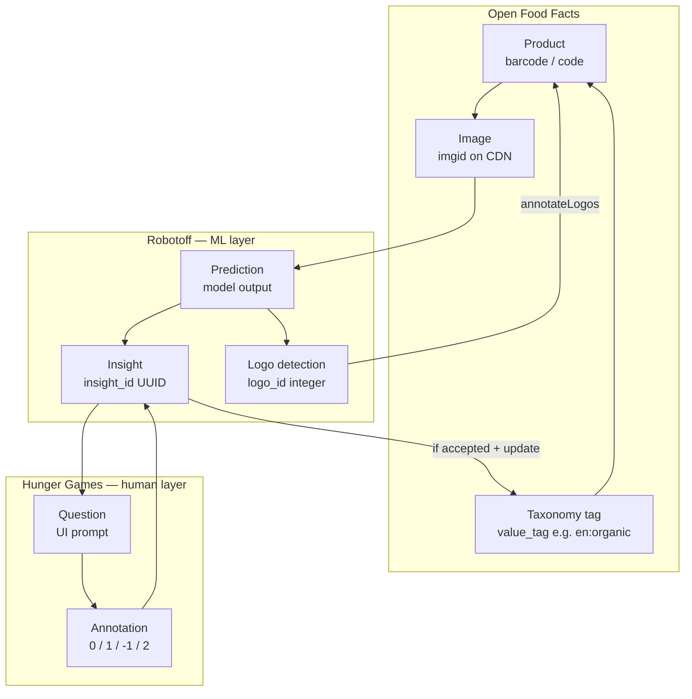
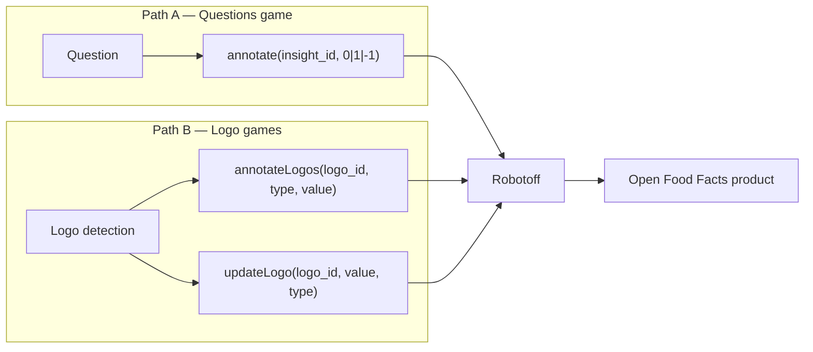

# Phase 3 — Domain Model

> **Open Food Facts Hunger Games — Contributor Onboarding**
>
> Continues from [Phase 2 — The Open Food Facts Ecosystem](./phase-2-ecosystem.md)
>
> Evidence: `src/robotoff.ts`, `src/const.ts`, `src/hooks/useQuestions.ts`, `src/components/QuestionFilter/const.ts`, `src/pages/insights/InsightsGrid.jsx`, `src/pages/insights/FilterInsights.jsx`, `src/pages/questions/DebugQuestion.tsx`, `src/components/logoTypeOptions.js`, `src/pages/logosValidator/dashboardDefinition.ts`, [Robotoff API Reference](https://openfoodfacts.github.io/robotoff/references/api/).

---

## Why vocabulary matters here

In everyday speech people say "the AI guessed organic" or "answer the question" interchangeably. In this codebase and in Robotoff APIs, those are **different objects with different IDs and endpoints**.

If you mix them up, you will:

- annotate the wrong identifier (`logo_id` vs `insight_id`)
- filter the wrong API (`/questions/` vs `/insights/` vs `/predictions/`)
- open a PR in Hunger Games when the bug is insight generation in Robotoff

Phase 3 gives you a **shared dictionary** the repo and APIs actually use.

---

## The layered model (keep this picture)



**FACT:** Hunger Games most often interacts with **Question** and **Annotation** at the top, which reference **Insight** underneath.

**INFERENCE:** Predictions are upstream; many never surface as questions if filtered or auto-processed.

---

## Core terms — full glossary

For each term: real-world meaning, creator, identifier, Hunger Games permissions, and where it goes next.

---

### Product

| | |
|---|---|
| **Real world** | One sellable item in a store, identified globally by barcode (EAN/UPC). |
| **Created by** | Open Food Facts contributors / importers via Product Opener. |
| **Identifier** | `barcode` or `code` (string of digits, e.g. `"5410041040807"`). |
| **HG can modify?** | **Read** everywhere; **write** only in specific games (`offService.setIngedrient`, packaging PATCH). |
| **After interaction** | Stays in OFF DB; may gain labels, brands, nutriments, packagings, etc. |

**FACT** (`QuestionInterface`): every question carries a `barcode`.

**FACT** (`src/off.ts`): `getProduct(barcode)` reads a subset of fields for context panels.

**Comparison:** Like a Firestore document keyed by barcode — except the document lives on OFF servers, not in your app.

---

### Barcode

| | |
|---|---|
| **Real world** | Scannable product identity. |
| **Created by** | Manufacturer / GS1; assigned when product enters OFF. |
| **Identifier** | Same as product `code`. |
| **HG can modify?** | **Never** — only used in URLs, filters, API paths. |
| **After interaction** | Unchanged. |

**FACT:** OFF image URLs chunk barcodes (`325/039/017/2185`) via `getFormatedBarcode()` in `src/off.ts`.

**IGNORE FOR NOW:** Reserved barcodes, multi-server types (`off`, `obf`, …) — Robotoff API supports them; Hunger Games defaults to OFF.

---

### Image

| | |
|---|---|
| **Real world** | A photo of product packaging uploaded by a contributor. |
| **Created by** | Uploaded to Open Food Facts; stored on `images.openfoodfacts.org`. |
| **Identifier** | Image path / `imgid` (numeric key in product `images` object); full URL in `source_image_url`. |
| **HG can modify?** | **Display only** (zoom, crop via Robotoff crop API). Flagging opens NutriPatrol (**FACT**, `externalApi.ts`). |
| **After interaction** | Image file unchanged; annotations attach metadata to insights/logos derived from the image. |

**FACT** (`QuestionInterface.source_image_url`): question UI shows the evidence photo.

**FACT** (`DebugQuestion.tsx`): insight detail exposes `source_image` + `bounding_box` for cropped logo preview.

---

### Predictor

| | |
|---|---|
| **Real world** | The ML model or rule pipeline that produced a guess (logo detector, OCR, regex, …). |
| **Created by** | Robotoff configuration / imports. |
| **Identifier** | String name, e.g. `universal-logo-detector`, `ocr`, `regex`. |
| **HG can modify?** | **Filter only** — never changes predictor. |
| **After interaction** | Unchanged; used for analytics and targeted annotation campaigns. |

**FACT** (Robotoff API): "A predictor refers to the model/method that was used to generate the prediction."

**FACT** (`src/components/QuestionFilter/const.ts` `predictors` array): UI exposes a fixed list for filtering.

**FACT** (`DebugQuestion.tsx`): insight detail displays `data.predictor` as "generator model".

**INFERENCE:** Filtering by predictor lets contributors focus on errors from one model family (e.g. only universal-logo-detector mistakes).

---

### Prediction

| | |
|---|---|
| **Real world** | Raw machine output before or without full human validation workflow. |
| **Created by** | Robotoff predictors (`/predictions`, `/predict/...`, image prediction endpoints). |
| **Identifier** | Prediction-specific IDs in Robotoff (**exact shape UNKNOWN** in HG repo). |
| **HG can modify?** | **Does not annotate predictions directly** in most games. |
| **After interaction** | **INFERENCE:** Robotoff promotes/consolidates into insights or logos internally. |

**FACT:** Robotoff API has separate **Prediction Management** and **Insight Management** sections.

**FACT** (`src/pages/ingredients/useData.tsx`): calls `${ROBOTOFF_API_URL}/predict/ingredient_list?ocr_url=...` — live prediction endpoint, not the Questions queue.

**FACT** (`src/pages/nutrition/insight.types.ts`): nutrition insights embed `NutrimentPrediction` entities inside insight `data`.

**Do not say "I annotated a prediction"** when you clicked Yes on the Questions game — you annotated an **insight** via `insight_id` (**FACT**, `useQuestions.ts`).

---

### Insight

| | |
|---|---|
| **Real world** | A **candidate fact** about a product ("this photo suggests label en:organic", "brand is Danone"). |
| **Created by** | Robotoff from predictions/OCR/logo detection. |
| **Identifier** | `insight_id` — UUID string (e.g. `a5e4397a-f14b-444f-972d-504a04e1cd7a`). |
| **HG can modify?** | **Indirectly** — by submitting annotations. Cannot create/delete insights. |
| **After interaction** | Robotoff stores annotation; may apply to OFF if accepted. |

**FACT** (Robotoff API): "An insight is a fact about a product that has been either extracted or inferred from the product pictures, characteristics,… If the insight is correct, the Openfoodfacts DB can be updated accordingly."

**FACT** (`InsightsGrid.jsx`): insight rows have `id`, `type`, `value`, `value_tag`, `barcode`, `annotation`, `timestamp`, `completed_at`, `automatic_processing`.

**FACT** (`InsightsGrid.jsx` annotation display): annotation values `1` accepted, `0` rejected, `-1` skipped, empty = not annotated.

---

### Insight type (`insight_type` / `type`)

| | |
|---|---|
| **Real world** | Which **kind of product field** the insight claims to affect. |
| **Created by** | Robotoff insight typing (see Robotoff `insights/dataclass.py` per API docs). |
| **Identifier** | String enum — **not** the same list in every HG screen. |

**Lists found in this repo (FACT):**

| Context | Insight types exposed |
|---|---|
| Questions filter (`insightTypesNames`) | `label`, `category`, `brand`, `product_weight`, `packaging` |
| Insights admin grid filter | above + `expiration_date`, `packager_code`, `qr_code` |
| Logo annotation types (`logoTypeOptions`) | `label`, `brand`, `packager_code`, `packaging`, `qr_code`, `category`, `nutrition_label`, `store`, `no_logo` |
| Logo dashboards (`dashboardDefinition.ts`) | `label`, `brand`, `category`, `product_weight`, `packaging`, `packager_code`, `expiration_date`, `qr_code` |

**INFERENCE:** Questions game shows a **subset** tuned for binary yes/no validation; logo tooling uses a **richer** type list.

**FACT** (`TYPE_WITHOUT_VALUE` in `src/const.ts`): `packager_code`, `qr_code`, `no_logo` — types that may not require a taxonomy value in logo search UI.

---

### Question

| | |
|---|---|
| **Real world** | A human-readable prompt: "Does this product have this label?" plus image + proposed value. |
| **Created by** | Robotoff (`GET /questions/` or `/questions/{barcode}`). |
| **Identifier** | **No separate question ID in HG** — keyed by `insight_id` in practice. |
| **HG can modify?** | **Display + answer only.** |
| **After interaction** | Disappears from queue when answered; Robotoff stops showing skipped insights to that user. |

**FACT** (`QuestionInterface` in `src/robotoff.ts`):

```typescript
{
  barcode, insight_id, insight_type, question,
  source_image_url?, ref_image_url?,
  type,        // question interaction type, e.g. "add-binary"
  value,       // display string
  value_tag,   // taxonomy tag for Product Opener
}
```

**FACT** (Robotoff API): questions sorted by priority (category → label → brand → others).

**Critical distinction:**

| Object | Question | Insight |
|---|---|---|
| Purpose | Ask a human quickly | Store ML candidate + validation state |
| ID used in annotate | `insight_id` | `insight_id` |
| Has `question` text field | Yes | Not necessarily in list views |
| API to fetch queue | `/questions/` | `/insights/` |

**You answer a question by annotating its insight.**

---

### Question `type` (not insight type)

| | |
|---|---|
| **Real world** | How the UI should treat the answer interaction. |
| **Example** | **FACT** (Robotoff API sample): `"type": "add-binary"` for Yes/No label questions. |
| **HG usage** | Drives interaction pattern; binary buttons in Questions game. |

**Do not confuse** `question.type` (interaction schema) with `question.insight_type` (domain field: label, brand, …).

---

### Annotation

| | |
|---|---|
| **Real world** | A human decision about an insight (or structured correction). |
| **Created by** | Contributor via Hunger Games → Robotoff API. |
| **Identifier** | Not a standalone UUID in HG — stored on insight as `annotation` value. |
| **HG can modify?** | **Create** (submit). Cannot edit others' annotations. |
| **After interaction** | Robotoff updates insight state; may trigger OFF update. |

**FACT** (`src/const.ts`):

| Constant | Value | UI |
|---|---|---|
| `CORRECT_INSIGHT` | `1` | Yes |
| `WRONG_INSIGHT` | `0` | No |
| `SKIPPED_INSIGHT` | `-1` | Skip |

**FACT** (Robotoff API): `2` = accept **and** supply extra `data` (nutrition tables, spellcheck, etc.).

**FACT** (`src/pages/nutrition/utils.ts`): nutrition uses `annotation=2` with JSON `data: { nutrients: ... }`.

**FACT** (`robotoff.annotate`): always passes `update: 1` so Robotoff pushes to OFF when appropriate.

---

### Annotation status / annotation value

| | |
|---|---|
| **Real world** | Whether/when/how an insight was decided. |
| **Created by** | Robotoff after one or more annotations/votes. |
| **Identifier** | Integer on insight: `1`, `0`, `-1`, or unset. |
| **HG can modify?** | **Read** on Insights page; **write** via annotate endpoints. |
| **After interaction** | Drives filters like "not_annotated" in Insights grid. |

**FACT** (`FilterInsights.jsx`): filter values `not_annotated`, `-1`, `0`, `1`.

**FACT** (`InsightsGrid.jsx`): `automatic_processing` boolean — robot vs human-required icon.

---

### Logo (detection object)

| | |
|---|---|
| **Real world** | A rectangular region on a product image that looks like a logo/label/mark. |
| **Created by** | Robotoff logo detector (often `universal-logo-detector`). |
| **Identifier** | `logo_id` — **numeric** (e.g. `id: 0` in API samples). Distinct from `insight_id`. |
| **HG can modify?** | **Annotate** via `robotoff.annotateLogos()`, `updateLogo()`; search via `searchLogos()`. |
| **After interaction** | Logo annotation associates `annotation_type` + `annotation_value` / taxonomy value with region. |

**FACT** (`Logo` interface in `src/robotoff.ts`): `bounding_box`, `annotation_type`, `annotation_value`, nested `image`.

**FACT** (Robotoff API logo object): fields include `annotation_type`, `annotation_value_tag`, `taxonomy_value`, `score`.

**FACT** (`DebugQuestion.tsx`): insight may reference `data.logo_id` linking insight ↔ logo geometry.

**Two parallel annotation paths:**

| Path | API | ID |
|---|---|---|
| Binary insight validation | `robotoff.annotate(insight_id, ±1\|0)` | UUID `insight_id` |
| Logo batch labeling | `robotoff.annotateLogos([{ logo_id, type, value }])` | numeric `logo_id` |

---

### Taxonomy value / `value` / `value_tag`

| | |
|---|---|
| **Real world** | A normalized tag in Open Food Facts taxonomy (multilingual, hierarchical). |
| **Created by** | OFF taxonomy editors; ML proposes tags via insights. |
| **Identifier** | `value_tag` — usually `language:id` format, e.g. `en:organic`, `fr:ab-agriculture-biologique`. |
| **HG can modify?** | **Displays** `value` (friendly) and sends `value_tag` back through Robotoff; logo forms accept taxonomy picks. |
| **After interaction** | If insight accepted, tag applied to appropriate product field in OFF. |

**FACT** (Robotoff API on `value_tag`): "the value that is going to be sent to Product Opener".

**FACT** (`question.value` vs `question.value_tag`): UI shows `value` ("Nutriscore Grade A"); machine/off uses `value_tag` (`en:nutriscore-grade-a`).

**FACT** (`reformatValueTag` in `src/utils.ts`): normalizes filter input (lowercase, accent folding, spaces → hyphens) before API queries — **not** the same as OFF taxonomy validation.

**FACT** (`getValueTagExamplesURL` in `questions/utils.ts`): links to `https://world.openfoodfacts.org/{insight_type}/{value_tag}`.

**Comparison:** Like a canonical enum key in your app (`en:organic`) separate from display label ("Organic").

---

### Campaign (`campaign` / `campaigns`)

| | |
|---|---|
| **Real world** | A batch or thematic annotation push ("only Agribalyse category insights", Green Score drive, …). |
| **Created by** | Robotoff insight import / ops configuration. |
| **Identifier** | String campaign name, e.g. `agribalyse-category`. |
| **HG can modify?** | **Filter** questions/insights/opportunities by campaign. |
| **After interaction** | Unchanged — campaign is metadata on insights. |

**FACT** (Robotoff API): "An annotation campaign allows to only retrieve questions or insights based on arbitrary criteria defined during insight import."

**FACT** (`campagnes` in `QuestionFilter/const.ts`): includes `"agribalyse-category"`.

**FACT** (`Opportunities.tsx`, Green Score pages): pass `campaign` into question count queries and deep links to `/questions?...&campaign=...`.

---

### Country filter

| | |
|---|---|
| **Real world** | Limit questions to products sold in / tagged with a country. |
| **Created by** | OFF product `countries_tags`. |
| **Identifier** | Mixed conventions in HG: URL may use `en:france` or 2-letter code after normalization. |
| **HG can modify?** | **Filter only.** |
| **After interaction** | N/A |

**FACT** (`getFilterParams.ts`): reads URL `country`, normalizes via `src/assets/countries.json` to `countryCode`.

**FACT** (`robotoff.questions`): sends `countries: countryFilter` to Robotoff.

**FACT** (`countryNames` in QuestionFilter): hardcoded subset for quick filters; full list in generated `countries.json`.

---

### Language (`lang`)

| | |
|---|---|
| **Real world** | Language for question text, value translations, UI. |
| **Created by** | User preference + OFF/Robotoff localization. |
| **Identifier** | ISO-ish code from `getLang()` (`localeStorageManager`). |
| **HG can modify?** | HG UI via i18next; Robotoff questions via `lang` query param. |
| **After interaction** | N/A |

**FACT** (`robotoff.questions`): appends `lang` from `getLang()` to API params.

**FACT** (`offService.getProduct`): requests localized fields like `categories_tags_{lang}`.

**Three translation layers** (from Phase 2): HG UI strings, OFF taxonomy names, Robotoff question sentences.

---

### Filter state (HG-specific composite)

Not a Robotoff domain object — but central to how you fetch the right questions.

**FACT** (`FilterState` in `src/robotoff.ts`):

```typescript
{
  insightType?, brandFilter?, country?, brand?, valueTag?,
  countryFilter?, sortByPopularity?, campaign?, predictor?,
  with_image?, sorted?,
}
```

**FACT** (URL mapping in `getFilterParams.ts` / `key2urlParam`):

| URL param | FilterState field |
|---|---|
| `type` | `insightType` |
| `value_tag` | `valueTag` |
| `country` | `country` / `countryFilter` |
| `brand` | `brand` |
| `campaign` | `campaign` |
| `predictor` | `predictor` |
| `sorted` | popularity sort (`sorted !== "false"`) |

---

## Side-by-side: the four easily confused terms

| | **Prediction** | **Insight** | **Question** | **Annotation** |
|---|---|---|---|---|
| **Metaphor** | Model output | Filed candidate fact | Quiz card | Your vote |
| **Created by** | Robotoff ML | Robotoff | Robotoff (from insight) | Human |
| **Primary ID** | model-specific | `insight_id` (UUID) | uses `insight_id` | value on insight |
| **HG fetches via** | `/predict/...`, rarely `/predictions` | `/insights/` | `/questions/` | POST annotate |
| **HG creates?** | No | No | No | **Yes** |
| **Typical endpoint** | `predict/ingredient_list` | `getInsights` | `robotoff.questions` | `robotoff.annotate` |

**Rule of thumb for the Questions game:**

> Fetch **questions** → display **question** → submit **annotation** on **insight_id** → Robotoff updates **insight** and maybe **product**.

---

## Logo annotation vs insight annotation



**FACT** (`AnnotateLogoModal.tsx`): logo batch annotation skipped entirely in dev mode (`IS_DEVELOPMENT_MODE`) to avoid accidental production writes.

**INFERENCE:** Logo and insight workflows may converge on the same product fields (e.g. label tag) through different Robotoff code paths.

---

## Special sentinel values (HG-only)

| Constant | Value | Meaning |
|---|---|---|
| `NO_QUESTION_LEFT` | `"NO_QUESTION_LEFT"` | **FACT** — placeholder insight_id when product has no remaining questions (`ProductInformation.tsx`) |

---

## Where terms appear in code (quick map)

| Term | Primary types / files |
|---|---|
| Question | `QuestionInterface` — `src/robotoff.ts` |
| Insight | Insights grid rows — `InsightsGrid.jsx`; detail — `DebugQuestion.tsx` |
| Annotation | `useQuestions.ts`, `const.ts` |
| Logo | `Logo` — `src/robotoff.ts`; UI — `LogoGrid.jsx`, `AnnotateLogoModal.tsx` |
| Predictor | filters — `QuestionFilter/const.ts`; detail — `DebugQuestion.tsx` |
| Campaign | filters, `Opportunities.tsx`, Green Score cards |
| value_tag | questions, insights, logo search |
| Product | `src/off.ts`, `useProduct.ts` |

---

## Headspace protection

### MUST UNDERSTAND NOW

1. **`insight_id`** is what you annotate in the Questions game — not `logo_id`, not barcode.
2. **Question ≠ insight** — question is the UI wrapper; insight is the persisted ML candidate.
3. **Prediction** is upstream; contributors usually interact with **insights/questions**.
4. **`value`** is display text; **`value_tag`** is what OFF taxonomy/Product Opener cares about.
5. **Logo workflows** use numeric **`logo_id`** and different API methods.
6. Annotation values: **`1` yes, `0` no, `-1` skip, `2` yes+data**.

### USEFUL LATER

- Full insight type catalog in Robotoff Python dataclass
- Image prediction → insight import pipeline
- Anonymous vote thresholds
- `server_type` for Beauty/Pet Food projects
- Nearest-neighbor logo suggestions (`nearest_neighbors` in API)

### IGNORE FOR NOW

- Every logo entry in `dashboardDefinition.ts`
- Complete taxonomy name list in `offSearch.ts`
- Nutrition entity char offsets inside `NutrimentPrediction`

---

## Phase 3 summary — five things to remember

1. **Product + barcode + image** = OFF world; **insight + question + annotation** = validation world.
2. **Predictor** explains *who guessed*; **insight type** explains *what field* is guessed.
3. **`value_tag`** is the bridge to Open Food Facts taxonomy — protect its correctness.
4. **Questions** are fetched from `/questions/` but answered via **`insight_id`** annotate.
5. **Logos** are a parallel domain with **`logo_id`** — do not merge mentally with insight UUIDs.

### Uncertainties

- **UNKNOWN:** Exact Robotoff rules for when a prediction becomes an insight vs auto-applied insight (`automatic_processing` flag exists but server logic not in this repo).
- **UNKNOWN:** Complete authoritative list of insight types (HG shows different subsets per page).
- **INFERENCE:** `question.type` values beyond `add-binary` may exist for non-binary games (webcomponents).

---

## What comes next

**Phase 4 — Architecture mental model**

We reconstruct Hunger Games from the checked-out code:

- bootstrap, routing, React Query, contexts, API wrappers, i18n, build/deploy

Then a **Mermaid architecture diagram** and **the five things you need to remember about Hunger Games architecture**.

---

*Stop here. Pick one real question from production mentally: identify its barcode, insight_id, insight_type, value_tag, and which API call answering it would trigger. When that feels natural, continue to Phase 4.*
