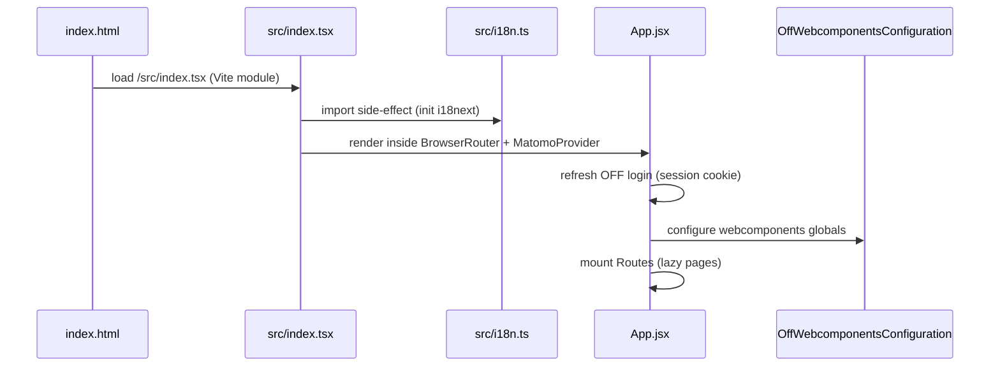
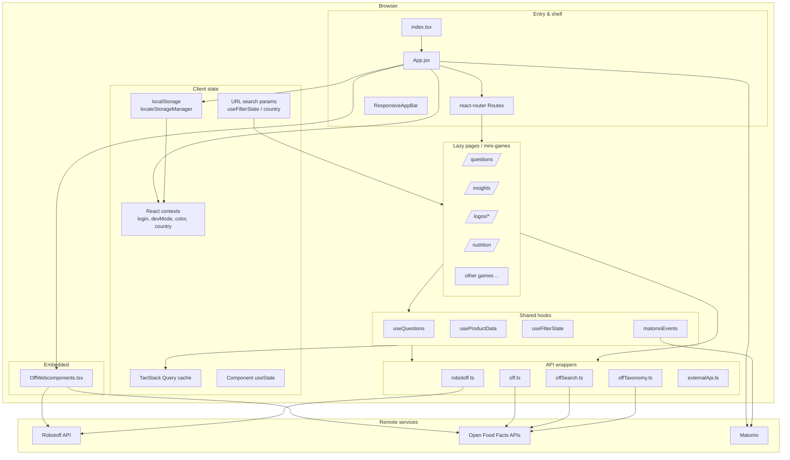

# Phase 4 — Architecture Mental Model

> **Open Food Facts Hunger Games — Contributor Onboarding**
>
> Continues from [Phase 3 — Domain Model](./phase-3-domain-model.md)
>
> Evidence: `index.html`, `src/index.tsx`, `src/App.jsx`, `src/robotoff.ts`, `src/off.ts`, `src/localeStorageManager.ts`, `src/hooks/useQuestions.ts`, `src/hooks/useFilterState/`, `vite.config.mjs`, `package.json`, `.github/workflows/ci-cd.yml`.

---

## Before the file tree

Hunger Games is a **Vite-built React SPA** with **no backend of its own**. Architecture is organized around three ideas:

1. **Routes** load lazy mini-games (pages).
2. **TanStack Query** owns cached remote data (questions, products, insights).
3. **Thin API wrappers** (`robotoff.ts`, `off.ts`) isolate HTTP boundaries.

Everything else — MUI theme, i18n, Matomo, contexts, URL params, localStorage — exists to make annotation fast and configurable.

---

## Application bootstrap (startup sequence)



### Layer 0 — HTML shell

**FACT** (`index.html`):

- `#root` mount point
- Registers `/serviceWorker.js` (PWA-style caching — **INFERENCE**: offline shell only; annotation still needs network)
- Loads `src/index.tsx` as ES module

### Layer 1 — Entry (`src/index.tsx`)

| | |
|---|---|
| **Responsibility** | Create React root, wire global providers |
| **Inputs** | DOM `#root`, Matomo config |
| **Outputs** | Rendered app tree |
| **State owned** | None |
| **Calls** | `BrowserRouter`, `MatomoProvider`, `App` |
| **Side effects** | `reportWebVitals()` (optional perf logging) |

**FACT:** Matomo site id `3` at `https://analytics.openfoodfacts.org/`.

### Layer 2 — App shell (`src/App.jsx`)

| | |
|---|---|
| **Responsibility** | Global providers, theme, auth, routing table |
| **Inputs** | Router location, localStorage settings, OFF session cookie |
| **Outputs** | Page components per route |
| **State owned** | `devMode`, `visiblePages`, `userState`, `color mode` |
| **Calls** | All lazy pages, `off.getCookie`, `auth.pl`, Matomo `trackPageView` |
| **Side effects** | Theme meta tag, login refresh on mount |

**Provider nesting (outside → inside) — FACT:**

```
CountryProvider
  → ColorModeContext
    → MUI ThemeProvider
      → LoginContext
        → DevModeContext
          → QueryClientProvider (single client)
            → CssBaseline + OffWebcomponentsConfiguration + AppBar + Routes
```

**FACT:** One module-level `QueryClient()` — no global `defaultOptions` configured in repo (Query defaults apply).

**FACT:** Almost every page is `React.lazy()` — code-split by route.

**FACT:** `IS_DEVELOPMENT_MODE` (`import.meta.env.DEV`) treats user as logged-in locally without cookie check.

---

## Architecture diagram



---

## Routing & page structure

### Pattern

Each mini-game is a **`src/pages/<name>/`** folder with an index entry and local components/utils.

| | |
|---|---|
| **Responsibility** | One user-facing annotation experience per route |
| **Inputs** | URL params, contexts, hooks |
| **Outputs** | UI + remote mutations |
| **State owned** | Mix: URL filters, React Query, local form state |
| **Modified when** | Adding/changing a game |

**FACT** (`App.jsx`): representative routes:

| Path | Page | Login required? |
|---|---|---|
| `/` | Home | No |
| `/questions` | Questions (core) | No |
| `/insights` | Insight browser | No (devMode menu gating) |
| `/logos/*` | Logo tools | **Yes** |
| `/nutrition` | Nutrient webcomponent | **Yes** |
| `/packaging` | Packaging editor | **Yes** |
| `/ingredient-*` | Webcomponent games | No |
| `/dashboard/:id` | Logo question dashboards | No |
| `/settings` | User preferences | No |

**FACT:** Login gate uses `userState.isLoggedIn` → else `<ShouldLoggedinPage />`.

**FACT:** `/flagged-images` only registered for hardcoded admin usernames in `ADMINS`.

**INFERENCE:** Route-level auth is coarse — not per-annotation-permission.

### Questions page layout (architectural template)

**FACT** (`src/pages/questions/index.tsx`):

```
QuestionFilter  →  URL-driven filters
QuestionDisplay →  useQuestions + answer UI
ProductInformation → useProductData (OFF read)
UserData        →  counts + recent answers
```

This **two-column game layout** (main task + contextual sidebar) repeats in several games.

---

## Shared components (`src/components/`)

| | |
|---|---|
| **Responsibility** | Reusable UI across games — filters, logos, images, footer, app bar |
| **Belongs here** | Cross-page widgets (`QuestionCard`, `CroppedLogo`, `ZoomableImage`, `AnnotateLogoModal`) |
| **Does NOT belong** | Game-specific business logic (keep in `pages/`) |
| **Depends on it** | Pages and other components |
| **Modify when** | Shared UX, accessibility, filter UI |

**FACT:** `components/QuestionFilter/index.js` re-exports from `pages/questions/QuestionFilter.tsx` — slight blur between page-specific and shared (historical structure).

**IGNORE FOR NOW:** One-off page components duplicated under `pages/`.

---

## Hooks (`src/hooks/`)

| Hook | Responsibility | Remote state? |
|---|---|---|
| `useQuestions` | Question queue, answer, refill, recent-answers cache | **Yes** (React Query) |
| `useProductData` | Product context by barcode | **Yes** |
| `useProductQuestions` | Questions for one product | **Yes** |
| `useFilterState` | Read/write filter URL params | URL state |
| `useOptions` | Misc option loaders | Varies |
| `matomo/*` + `matomoEvents` | Analytics | No |

| | |
|---|---|
| **Belongs here** | Reusable stateful logic used by 2+ pages |
| **Does NOT belong** | One-off page effects (keep in page file) |
| **Modify when** | Changing question queue semantics, shared fetch patterns |

**FACT:** `getQuestionKeys()` in `useQuestions.ts` defines React Query identity — must stay in sync with `useQuestionsQuery`.

---

## Contexts (`src/contexts/`)

| Context | State | Persisted? |
|---|---|---|
| `LoginContext` | `userName`, `isLoggedIn`, `refresh()` | Session cookie (OFF) |
| `DevModeContext` | `devMode`, `visiblePages` | localStorage |
| `ColorModeContext` | `toggleColorMode` | localStorage |
| `CountryProvider` | `country`, `setCountry(scope)` | URL + localStorage (`scope=global`) |

| | |
|---|---|
| **Responsibility** | Cross-cutting preferences & auth signals |
| **Not used for** | Question queue data (that's React Query) |
| **Side effects** | Settings page writes via `localSettings.update` |

---

## TanStack React Query (server-state layer)

| | |
|---|---|
| **Responsibility** | Cache Robotoff/OFF responses, dedupe fetches, power mutations |
| **Inputs** | Query keys + fetch functions in hooks/pages |
| **Outputs** | `{ data, status }` to components |
| **State owned** | In-memory cache keyed by queryKey |
| **Calls** | `robotoff.*`, `offService.*` |
| **Side effects** | `setQueryData` for optimistic queue; `useMutation` refill |

**Representative query keys (FACT):**

| Key prefix | Source |
|---|---|
| `["questions", insightType, valueTag, …]` | `useQuestions` |
| `["recent-answers"]` | In-memory only (`queryFn` returns `[]`) |
| `["product", barcode]` | `useProductData` |
| `["insights", filterState, page]` | Insights grid |
| `["insight-details", insightId]` | Debug panel |
| `["potential-question-count", …]` | Badge counts |

**INFERENCE:** No React Query Devtools in repo; debugging via browser Network + React DevTools.

**Comparison (your background):** Like TanStack Query replacing manual MobX collections of API results — except mutations often **patch cache directly** (`setQueryData`) rather than invalidating.

---

## URL state vs localStorage vs transient UI

| State type | Mechanism | Examples | Survives refresh? |
|---|---|---|---|
| **URL / search params** | `useFilterState`, `CountryProvider` URL part | `?type=label&value_tag=…&country=fr` | Yes (shareable link) |
| **Local persisted** | `localeStorageManager`, `useLocalStorageState` | language, dark mode, dev mode, favorites | Yes |
| **Cached remote** | React Query | question queue, product JSON | Until stale/refetch |
| **Context** | React context | login, devMode | Session / until reload |
| **Transient UI** | `useState` | dialogs open, image loaded flag, accordion | No |

**FACT** (`getLang()` priority): URL `?language=` → localStorage → browser language.

**FACT** (`localSettings` single key): `hunger-game-settings` JSON blob.

**FACT** (favorites separate key): `hunger-game-favorites`.

**Design intent (INFERENCE):** Filters are **shareable URLs** so contributors can link each other to a campaign. Preferences are **local** so the UI remembers your language and theme.

---

## API wrapper layer

### `src/robotoff.ts`

| | |
|---|---|
| **Responsibility** | All Robotoff HTTP access from HG |
| **Inputs** | Filter params, IDs, annotation values |
| **Outputs** | Promises (axios or SDK fetch) |
| **Calls** | Robotoff REST API |
| **Consumers** | Questions, logos, insights, dashboards, green-score |

**Dual client (FACT):** `@openfoodfacts/openfoodfacts-nodejs` `Robotoff` class + axios for some endpoints (`questions`, `updateLogo`, statistics).

### `src/off.ts`

| | |
|---|---|
| **Responsibility** | OFF product read, search, v3 patch helpers, URL builders |
| **Calls** | OFF v0/v2/v3, search.pl, auth cookie parsing |
| **Consumers** | Sidebars, packaging, ingredients, insights links |

### `src/offSearch.ts` / `src/offTaxonomy.ts`

| | |
|---|---|
| **Responsibility** | Taxonomy autocomplete & tag metadata |
| **Calls** | search.openfoodfacts.org, OFF v2 taxonomy |
| **Consumers** | Filters, logo forms, taxonomy pickers |

### `src/externalApi.ts`

| | |
|---|---|
| **Responsibility** | Open external tools (NutriPatrol) |
| **Side effects** | `window.open` |

**Boundary rule:** Pages should call wrappers, not scatter raw URLs — but **FACT:** some pages still axios directly (nutrition annotate, packaging patch).

---

## Webcomponents integration

**FACT** (`OffWebcomponents.tsx`):

- Loaded once at app root
- Sets `<off-webcomponents-configuration robotoff-configuration=… openfoodfacts-api-url=…>`
- Vite copies webcomponent images to `dist/assets/webcomponents`

| | |
|---|---|
| **Responsibility** | Host self-contained Robotoff games (nutrition extraction, ingredient spellcheck/detection) |
| **State owned** | Internal to shadow DOM / web component |
| **HG modifies** | Wrapper pages only (country filter, layout) |

---

## i18n

**FACT** (`src/i18n.ts`):

- i18next + `react-i18next`
- Lazy backend: `import(\`./i18n/${language}.json\`)` per language
- Vite emits language chunks as `assets/lang-[name]-[hash].js`

| | |
|---|---|
| **Responsibility** | Hunger Games UI strings only |
| **Not responsible for** | Robotoff question text (`lang` API param) |

**FACT** (Crowdin workflow): translations maintained via separate automation PRs to `src/i18n/*.json`.

---

## MUI / theme

**FACT** (`App.jsx` `getToken`): custom OFF “coffee” palette (latte, chocolate, cappuccino…), light/dark modes.

| | |
|---|---|
| **Responsibility** | Visual consistency, responsive layout |
| **State** | `mode` in App + `ColorModeContext` |
| **Side effects** | Updates `<meta name="theme-color">` |

Pages use MUI Grid v2 (`size={{ xs: 12, md: 7 }}`), Stack, Paper — standard Material layout patterns.

---

## Analytics

| | |
|---|---|
| **MatomoProvider** | Loads tracker script, exposes `trackPageView` / `trackEvent` |
| **App.jsx** | Page views on route change (prod only) |
| **matomoEvents.ts** | Question yes/no/skip, logo annotation events |

**Side effects:** Network calls to `analytics.openfoodfacts.org` — no impact on annotation correctness.

---

## Assets & generated data

| Asset | Source | Script |
|---|---|---|
| `src/assets/countries.json` | static.openfoodfacts.org taxonomy | `yarn countries` |
| `src/assets/nutriments.json` | OFF nutriment taxonomy | `yarn nutriments` |
| `src/assets/brands.json` | Bundled reference data | — |
| `public/` | favicon, service worker, manifest | — |

| | |
|---|---|
| **Responsibility** | Offline-fast filter dropdowns, nutrition field lists |
| **Not live taxonomy** | Regenerate scripts when stale |

---

## Build & deployment

| Step | Tool | Output |
|---|---|---|
| Dev server | `yarn dev` → Vite | `localhost:5173` (**FACT**, Vite default) |
| Production build | `yarn build` | `dist/` static files |
| Post-build | `deploy.sh` | Copies `index.html` → `404.html`, `questions.html`, … for SPA deep links |
| CI | `.github/workflows/ci-cd.yml` | `yarn lint` + `yarn build` + deploy artifact |
| Hosting | GitHub Pages job + `netlify.toml` present | **UNKNOWN** which is canonical prod host |

**FACT** (husky pre-commit): runs `yarn prettier` only — not lint.

**FACT** (CI lint): `prettier --check . && eslint .`

---

## TypeScript vs JavaScript mix

**FACT:** Coexistence of `.jsx`, `.tsx`, `.ts` without strict directory split.

| Pattern | Interpretation |
|---|---|
| Newer hooks, contexts, some pages | `.ts` / `.tsx` |
| Older logo pages, insights grid, home | `.jsx` |
| `robotoff.ts`, `off.ts` | Typed wrappers |

**INFERENCE:** Incremental migration — **not** “JS for games, TS for utils”. Match the file you edit.

**Do not** mass-convert JS → TS as onboarding exercise.

---

## Error handling pattern

**FACT:** `ErrorBoundary` class component — logs to console, minimal fallback (no user-facing recovery UI).

**FACT:** `useQuestions` annotate errors → `console.error` only.

**INFERENCE:** Failures are often **visible only in DevTools** — important for contributors testing locally.

---

## Narrating the diagram (data flow for one annotation)

1. User opens `/questions?type=label&country=fr` → **`useFilterState`** parses URL.
2. **`useQuestions`** React Query fetches **`robotoff.questions()`** → cache key includes filters.
3. **`QuestionDisplay`** renders first cached question; **`useProductData`** fetches OFF product in parallel.
4. User clicks Yes → **`answerQuestion`**:
   - fire-and-forget **`robotoff.annotate`**
   - **`queryClient.setQueryData`** removes question
   - optional **`mutation.mutate`** refills queue
   - **`matomoEvents`** tracks event
5. No App-level state update — queue lives entirely in React Query.

Remote state ends at React Query cache; UI progression is local cache mutation, not server-confirmed.

---

## The five things you need to remember about Hunger Games architecture

1. **Single SPA, many lazy routes** — each mini-game is a page module; shared shell is `App.jsx` + AppBar.

2. **React Query is the question queue** — not context, not Redux; filter params are part of query keys.

3. **URL params are the shareable filter API** — `useFilterState` bridges bookmarkable links to Robotoff queries.

4. **Two API modules dominate** — `robotoff.ts` (validate ML) and `off.ts` (read/enrich products); keep boundaries clean when contributing.

5. **No server in this repo** — auth is OFF cookies, persistence is Robotoff/OFF APIs, build output is static files.

---

## Headspace protection

### MUST UNDERSTAND NOW

- Bootstrap chain: `index.tsx` → providers in `App.jsx` → lazy route page.
- Where question data lives: **React Query**, keyed by filters.
- Where filters live: **URL search params** (+ country in localStorage).
- API wrappers: **`robotoff.ts`** vs **`off.ts`**.
- Login: OFF **session cookie**, not Hunger Games auth.

### USEFUL LATER

- `deploy.sh` HTML duplicates for SPA routing on static hosts
- Dev mode + `visiblePages` menu toggles
- Webcomponents asset copy in Vite config
- Service worker behavior
- Admin-only routes

### IGNORE FOR NOW

- Individual dashboard definitions
- GitHub workflow automation beyond lint/build
- `knip` dead-code tooling
- Brandinator / Gala / bug pages

---

## Phase 4 summary

| Layer | Remember |
|---|---|
| Entry | Vite + React 19 + react-router |
| Shell | Nested providers, one QueryClient |
| Pages | Lazy-loaded mini-games |
| Server state | TanStack Query + wrappers |
| Shareable state | URL filters |
| Personal state | localStorage settings |
| Styling | MUI + OFF theme |
| Observability | Matomo |

### Uncertainties

- **UNKNOWN:** Production host (Netlify vs GitHub Pages) — both configured.
- **UNKNOWN:** Whether service worker affects API caching during dev — test locally in Phase 12.
- **INFERENCE:** React Query default stale/refetch behavior applies; no custom global retry policy visible.

---

## What comes next

**Phase 5 — Repository tour**

Focused map of `src/pages/`, `src/components/`, hooks, wrappers, i18n, assets — what belongs where, when contributors touch each area, and the JSX/TSX convention story.

---

*Stop here. Without opening files, trace: `/questions` route → provider stack → hook → API wrapper → remote URL. When you can do that, continue to Phase 5.*
