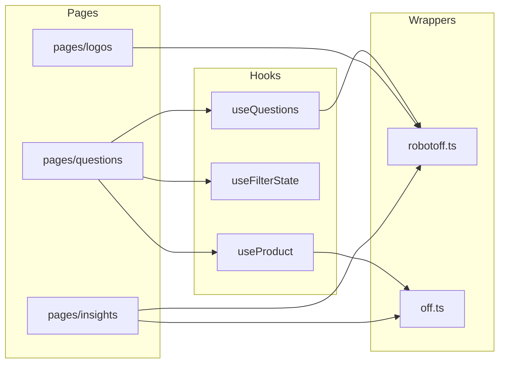

# Phase 5 — Repository Tour

> **Open Food Facts Hunger Games — Contributor Onboarding**
>
> Continues from [Phase 4 — Architecture Mental Model](./phase-4-architecture.md)
>
> This phase maps **where code lives**, **what belongs where**, and **how naming actually works** in this repo — not an exhaustive tree dump.

---

## The map in one glance

```
hunger-games/
├── public/              # Static shell (favicon, service worker, manifest)
├── src/
│   ├── index.tsx        # React entry
│   ├── App.jsx          # Providers + routes (shell)
│   ├── const.ts         # API URLs + annotation constants
│   ├── robotoff.ts      # Robotoff API wrapper
│   ├── off.ts           # Open Food Facts API wrapper
│   ├── offSearch.ts     # Taxonomy autocomplete
│   ├── offTaxonomy.ts   # Taxonomy fetch helper
│   ├── externalApi.ts   # External tools (NutriPatrol)
│   ├── localeStorageManager.ts  # localStorage settings + favorites
│   ├── i18n.ts          # i18next bootstrap
│   ├── utils.ts         # Shared helpers (value_tag formatting)
│   ├── pages/           # Mini-games (one folder ≈ one route)
│   ├── components/      # Shared UI
│   ├── hooks/           # Shared stateful logic
│   ├── contexts/        # Cross-cutting React context
│   ├── assets/          # Bundled images + generated JSON
│   ├── i18n/            # UI translation JSON (Crowdin)
│   ├── types/           # Ambient TS declarations
│   └── utils/           # Small focused utilities
├── update-countries.js  # Regenerate countries.json
├── update-nutriments.js # Regenerate nutriments.json
├── vite.config.mjs
├── package.json
└── docs/onboarding/     # This series (local contributor docs)
```

**FACT:** Under `src/`, extension counts are approximately **59 `.tsx`**, **44 `.ts`**, **19 `.jsx`**, **5 `.js`** — TypeScript-majority with deliberate JS enclaves.

---

## Top-level `src/` files — the spine

These files are the **backbone**. Most feature work touches `pages/` or `hooks/`, but you will constantly import from here.

### `src/index.tsx`

| | |
|---|---|
| **Why it exists** | Mount React, wrap router + Matomo |
| **Belongs here** | Entry-only wiring |
| **Does NOT belong** | Game logic, API calls |
| **Depends on it** | Vite via `index.html` |
| **Modify when** | Adding global providers (rare; prefer `App.jsx`) |

### `src/App.jsx`

| | |
|---|---|
| **Why it exists** | Provider stack, MUI theme, route table, login refresh |
| **Belongs here** | App-wide routing and shell |
| **Does NOT belong** | Per-game UI |
| **Depends on it** | Every route |
| **Modify when** | New top-level route, auth gate, global provider |

**Note:** Still `.jsx` despite being central — **legacy / stable shell**, not a signal that new routes should be JSX.

### `src/const.ts`

| | |
|---|---|
| **Why it exists** | Single source for API base URLs and annotation integers |
| **Belongs here** | Environment-level constants (`ROBOTOFF_API_URL`, `CORRECT_INSIGHT`, …) |
| **Does NOT belong** | Feature-specific config |
| **Modify when** | New global API endpoint or shared constant used across games |

**EXTERNAL-CONTRACT:** URL constants mirror production services — treat changes as high-impact.

### `src/robotoff.ts`

| | |
|---|---|
| **Why it exists** | **All Robotoff integration** — types + client methods |
| **Belongs here** | Robotoff request/response shapes, SDK + axios calls |
| **Does NOT belong** | OFF product reads, React hooks |
| **Depends on it** | Questions, logos, insights, dashboards, green-score |
| **Modify when** | New Robotoff endpoint, extending `QuestionInterface`, filter params |

Also exports `FilterState` used across hooks and URL parsing.

### `src/off.ts`

| | |
|---|---|
| **Why it exists** | **Open Food Facts read/write helpers** |
| **Belongs here** | Product fetch, search.pl queries, v3 patch helpers, URL builders |
| **Does NOT belong** | Robotoff annotations |
| **Modify when** | New OFF field needed in sidebars, product search, direct OFF mutations |

Default export: `offService` instance. Named export: `offClient` (SDK) for autocomplete.

### `src/offSearch.ts` & `src/offTaxonomy.ts`

| | |
|---|---|
| **Why they exist** | Taxonomy autocomplete + tag metadata |
| **Belongs here** | Thin axios wrappers to search-a-licious / OFF v2 taxonomy |
| **Modify when** | Filter pickers, taxonomy display |

### `src/externalApi.ts`

| | |
|---|---|
| **Why it exists** | Actions that leave Hunger Games (NutriPatrol tabs) |
| **Belongs here** | Non-OFF/non-Robotoff integrations |
| **Modify when** | New external tool link pattern |

### `src/localeStorageManager.ts`

| | |
|---|---|
| **Why it exists** | Persist user settings + saved question filters |
| **Belongs here** | `localStorage` keys, `getLang()`, favorites |
| **Does NOT belong** | Server cache (use React Query) |
| **Modify when** | New settings toggle, language resolution order |

**FACT:** Settings stored under key `hunger-game-settings` (singular "game").

### `src/i18n.ts` + `src/i18n/*.json`

| | |
|---|---|
| **Why they exist** | Hunger Games UI copy in many languages |
| **Belongs here** | i18next config + translation files |
| **Does NOT belong** | Robotoff question strings |
| **Modify when** | UI labels; large locale additions via Crowdin workflow |

**FACT:** ~150+ locale JSON files — do not hand-edit all languages for small changes; English + Crowdin is normal workflow.

### `src/utils.ts` vs `src/utils/`

| Location | Role |
|---|---|
| `src/utils.ts` | `reformatValueTag`, `removeEmptyKeys` — used by API wrappers |
| `src/utils/` | Focused modules (`useLocalStorageState`, `getCountryName`, …) |

**INFERENCE:** Prefer `src/utils/` for new standalone helpers; extend `utils.ts` only when joining existing API-helper cluster.

---

## `src/pages/` — mini-games

**Convention:** One folder per route experience, usually with `index.tsx` or `index.jsx`.

| | |
|---|---|
| **Why it exists** | User-facing annotation games |
| **Belongs here** | Route-specific layout, local components, game utils |
| **Does NOT belong** | Shared widgets used by 3+ games (→ `components/`) |
| **Modify when** | Building or fixing a specific game |

### Folder naming

| Pattern | Examples | Classification |
|---|---|---|
| **kebab-case** | `green-score/`, `ingredient-spellcheck/`, `not-found/` | **Dominant for multi-word routes** |
| **single word** | `home/`, `logos/`, `questions/`, `nutrition/` | Common |
| **PascalCase file at root** | `GalaPage.tsx` | **INCONSISTENT** — legacy one-off |

### Entry file pattern

| Pattern | Examples |
|---|---|
| `index.tsx` / `index.jsx` | `questions/`, `home/`, `insights/` |
| Named page at `pages/` root | `GalaPage.tsx` |

**RECOMMENDATION for new pages:** `src/pages/<kebab-name>/index.tsx` + lazy import in `App.jsx`.

### Pages by architectural role

| Folder | Route(s) | Role | Learn priority |
|---|---|---|---|
| **`questions/`** | `/questions` | Core Robotoff yes/no queue | **Start here** |
| **`home/`** | `/` | Landing, favorites, cards | Secondary |
| **`insights/`** | `/insights` | Browse insight records (admin-ish) | Later |
| **`logos/`** | `/logos/*` | Logo search/annotate (JSX) | After questions |
| **`logosValidator/`** | `/dashboard/:id` | Campaign logo question dashboards | Later |
| **`green-score/`** | `/green-score` | Eco-score question launcher | Variant of questions pattern |
| **`nutrition/`** | `/nutrition` | Webcomponent host | Embedded pattern |
| **`ingredient-*`** | spellcheck, detection | Webcomponent hosts | Embedded pattern |
| **`ingredients/`** | `/ingredients` | OFF v3 ingredient edit | Direct OFF write |
| **`packaging/`** | `/packaging` | OFF v3 packaging edit | Direct OFF write |
| **`settings/`** | `/settings` | localStorage + dev toggles | Contributor UX |
| **`loader/`** | (shared) | Spinner component page | Utility |
| **`shouldLoggedinPage/`** | (gate) | Login prompt | Utility |
| **`bug/`**, **`Brandinator/`**, **`GalaPage.tsx`** | misc | Experiments / events | **IGNORE FOR NOW** |

### `questions/` — the reference implementation

```
questions/
├── index.tsx              # Layout grid
├── QuestionDisplay.tsx    # Main game UI + useQuestions
├── QuestionFilter.tsx     # Filter chips (page-specific but re-exported)
├── FilterDialog.tsx
├── ProductInformation.tsx # OFF sidebar
├── UserData.tsx           # Counts + recent answers
├── SimilarQuestions.tsx   # Empty-state navigation
├── DebugQuestion.tsx      # Dev insight detail accordion
├── useKeyboardShortcuts.ts
├── utils.ts
└── utils/getValueTagQuestionsURL.ts
```

**When contributing to core annotation UX, expect to touch this folder first.**

---

## `src/components/` — shared UI

| | |
|---|---|
| **Why it exists** | Reuse across multiple pages |
| **Belongs here** | AppBar, Footer, image widgets, modals, filter building blocks |
| **Does NOT belong** | Whole game flows |
| **Modify when** | Shared UX change (accessibility, layout, filter controls) |

### Notable components

| File / folder | Purpose |
|---|---|
| `ResponsiveAppBar.tsx` | Nav menu + country + login |
| `QuestionCard.tsx`, `SmallQuestionCard.tsx` | Home / green-score cards linking to filtered questions |
| `CroppedLogo.tsx` | Robotoff crop URL for insight bounding box |
| `ZoomableImage.tsx` | Pinch/zoom product photos |
| `AnnotateLogoModal.tsx` | Logo batch annotation dialog |
| `OffWebcomponents.tsx` | Web component loader + wrappers |
| `QuestionFilter/` | Filter constants, brand/label filters, favorites |
| `Footer/` | Community links |
| `welcome/` | Onboarding tour |

### Blurred boundary (FACT)

`components/QuestionFilter/index.js` re-exports **`pages/questions/QuestionFilter.tsx`**.

**INFERENCE:** Historical move — filter UI started in questions page and was partially shared. When editing filters, check **both** paths.

### JSX enclave in components

Still JSX: `LogoForm.jsx`, `LogoGrid.jsx`, `LogoSearchForm.jsx`, some Footer links, `welcome/Welcome.jsx`.

**INFERENCE:** Logo subsystem migrated slower than questions/nutrition.

---

## `src/hooks/` — shared logic

| | |
|---|---|
| **Why it exists** | Reusable state + data fetching |
| **Belongs here** | `useQuestions`, `useProductData`, `useFilterState`, Matomo |
| **Does NOT belong** | One-off page effects |
| **Modify when** | Changing cache keys, shared fetch behavior |

```
hooks/
├── useQuestions.ts          # Core question queue
├── useProduct.ts            # OFF product by barcode
├── useProductQuestions.ts   # Per-product questions
├── useOptions.ts
├── matomoEvents.ts
├── useUrlParams.js          # Legacy JS
├── useFilterState/
│   ├── useFilterState.ts
│   └── getFilterParams.ts   # URL ↔ FilterState mapping
└── matomo/
```

**Naming convention (HIGH confidence):** hooks **`use` + PascalCase** → `useQuestions`, `useFilterState`.

---

## `src/contexts/`

| | |
|---|---|
| **Why it exists** | App-wide non-URL state (auth, theme toggle, dev mode, country) |
| **Does NOT belong** | Robotoff/OFF fetched data |

| File / folder | Export pattern |
|---|---|
| `login.tsx` | Default context |
| `devMode.tsx` | Default context |
| `colorMode.tsx` | Default context |
| `CountryProvider/` | Folder with `index.ts` barrel |

**Convention:** lowercase context file names (`login.tsx`) except folderized providers (`CountryProvider/`).

---

## `src/assets/` — bundled static data

| | |
|---|---|
| **Why it exists** | Images for home page + **generated** JSON lists |
| **Belongs here** | `countries.json`, `nutriments.json`, marketing SVGs/PNGs |
| **Does NOT belong** | Hand-maintained taxonomy of all OFF labels (too large) |
| **Modify when** | UI art; run `yarn countries` / `yarn nutriments` for data refresh |

**FACT:** `countries.json` / `languages.json` come from `static.openfoodfacts.org` via root scripts.

---

## `src/types/`

| File | Purpose |
|---|---|
| `openfoodfacts-webcomponents.d.ts` | Module shim (`declare module "…"`) |
| `off-webcomponents.d.ts` | (if present) JSX intrinsic elements |

**Belongs here:** ambient declarations only — not runtime code.

---

## Root tooling files (not `src/`)

| File | Role |
|---|---|
| `vite.config.mjs` | Build, webcomponents asset copy, i18n chunk naming |
| `eslint.config.mjs` | TS strict for `.ts/.tsx`; JS uses recommended only |
| `tsconfig.json` | `"allowJs": true`, `"strict": true`, no emit |
| `tslint.json` | **STALE?** — ESLint is active in CI; tslint likely legacy |
| `knip.json` | Dead code detection (`yarn knip`) |
| `netlify.toml` | Static hosting config |
| `deploy.sh` | SPA fallback HTML copies post-build |

---

## Codebase naming convention audit (condensed)

*Read-only audit per repository evidence. No renames performed.*

### Naming convention matrix

| Category | Proven convention | Evidence | Confidence |
|---|---|---|---|
| Page folders | kebab-case | `green-score/`, `ingredient-spellcheck/` | **HIGH** |
| React components | PascalCase filename | `QuestionDisplay.tsx`, `LogoGrid.jsx` | **HIGH** |
| Hooks | `use` + camelCase | `useQuestions.ts`, `useFilterState.ts` | **HIGH** |
| API wrappers | lowercase camelCase at `src/` root | `robotoff.ts`, `off.ts` | **HIGH** |
| Constants file | `const.ts`, exports `SCREAMING_SNAKE` | `CORRECT_INSIGHT`, `OFF_API_URL` | **HIGH** |
| Context modules | lowercase single word | `login.tsx`, `devMode.tsx` | **MEDIUM** |
| URL query params | snake_case | `value_tag`, `type` via `getFilterParams` | **HIGH** |
| TS FilterState fields | camelCase | `insightType`, `valueTag` | **HIGH** |
| i18n files | locale code JSON | `en.json`, `pt_BR.json` | **HIGH** |
| Robotoff/API fields | snake_case | `insight_id`, `value_tag` in interfaces | **EXTERNAL-CONTRACT** |

### TypeScript vs JavaScript — what it means

| Observation | Classification |
|---|---|
| ~63% TS/TSX vs ~24% JS/JSX | Incremental migration, TS-forward |
| Strict ESLint only on `{ts,tsx}` | New typed code gets stricter checks |
| `allowJs: true` in tsconfig | JS files remain first-class |
| Core shell `App.jsx` still JS | **Legacy stable** — not a pattern to copy |
| Entire `logos/*.jsx`, `insights/*.jsx` islands | **Historical subsystems** |
| Newer games (`questions`, `packaging`, `nutrition`, `settings`) in TSX | **Current direction** |

**Verdict: MOSTLY ALIGNED** — mixed extensions are **intentional incremental migration**, not random drift.

**Contributor rule:** **Match the file you edit.** New substantial pages → prefer **`.tsx`**. Do not mass-convert JSX → TSX in onboarding or drive-by PRs.

### Notable inconsistencies (understand, don't "fix" yet)

| Name | Location | Issue | Priority |
|---|---|---|---|
| `IngeredientDisplay.tsx` | `pages/ingredients/` | Misspelling "Ingredient" | OPTIONAL POLISH |
| `setIngedrient` | `off.ts` | Misspelling in public method | **EXTERNAL-CONTRACT** — many callers |
| `campagnes` | `QuestionFilter/const.ts` | French spelling vs English `campaign` elsewhere | ACCEPTABLE VARIANT |
| `dasboardId` | `App.jsx` route param | Typo "dashboard" | INCONSISTENT URL param |
| `hunger-game-settings` | localStorage key | Singular "game" vs repo "hunger-games" | **EXTERNAL-CONTRACT — DO NOT RENAME** |
| `GalaPage.tsx` at pages root | vs folder pattern | Structural inconsistency | BASELINE |
| `google-could-vision` | predictor filter value | Likely typo for "cloud" | **EXTERNAL-CONTRACT** — matches Robotoff predictor string? verify before change |

### Misleading names to watch (contributor safety)

| Symbol | Risk |
|---|---|
| `robotoff.questions()` vs SDK `questionsByProductCode` | Two different endpoints — name similarity |
| `FilterState` in `robotoff.ts` vs `QuestionFilter/const.ts` | **Different types** with overlapping names |
| `off` default import vs `offClient` | Service instance vs SDK client |

---

## Who depends on what (contributor navigation)



---

## When would you modify each area?

| You want to… | Start here |
|---|---|
| Fix Yes/No queue / refill / cache | `hooks/useQuestions.ts`, `pages/questions/` |
| Change filter URL params | `hooks/useFilterState/getFilterParams.ts`, `QuestionFilter/` |
| Add Robotoff API method | `robotoff.ts` |
| Show more product fields in sidebar | `off.ts` (`getProduct` fields), `ProductInformation.tsx` |
| New top-level game route | `pages/<name>/`, `App.jsx`, `ResponsiveAppBar.tsx`, `i18n/en.json` |
| Login gate | `App.jsx`, `contexts/login.tsx`, `shouldLoggedinPage/` |
| UI translation | `src/i18n/en.json` (+ Crowdin for other locales) |
| Country filter behavior | `CountryProvider/`, `assets/countries.json` |
| Logo annotation UX | `pages/logos/`, `components/LogoGrid.jsx`, `AnnotateLogoModal.tsx` |
| Insight admin table | `pages/insights/` |
| Global theme | `App.jsx` `getToken` |
| CI/build issue | `vite.config.mjs`, `.github/workflows/ci-cd.yml` |

---

## Headspace protection

### MUST UNDERSTAND NOW

1. **`src/robotoff.ts` + `src/hooks/useQuestions.ts` + `src/pages/questions/`** = core annotation path.
2. **`pages/` = games**, **`components/` = shared**, **`hooks/` = shared data logic**.
3. Filters live in **URL** (`getFilterParams`) + **`FilterState` in robotoff.ts**.
4. New code → **TSX**; respect **JSX islands** (logos, insights).
5. **`components/QuestionFilter` ↔ `pages/questions/QuestionFilter`** re-export quirk.

### USEFUL LATER

- `logosValidator/dashboardDefinition.ts` (large config file)
- `Brandinator/`, `GalaPage`, `bug/` pages
- `knip` for unused exports
- `l10n-shortcuts.ts` keyboard localization

### IGNORE FOR NOW

- Individual files in `src/i18n/` except `en.json` for reference
- Every home page SVG asset
- `pages/data.json`
- `tslint.json`

---

## Phase 5 summary — five things to remember

1. **Spine files at `src/` root** — `App.jsx`, `robotoff.ts`, `off.ts`, `const.ts`, `localeStorageManager.ts`.
2. **`pages/<game>/`** is where user-facing work lives; **`questions/` is the template**.
3. **Shared UI → `components/`**, **shared fetching → `hooks/`** — don't duplicate queue logic in pages.
4. **TypeScript is the direction**, but **JSX logo/insights pages are still production-critical**.
5. **Naming has legacy typos and contract-locked strings** — fix behavior first, rename only with maintainer agreement.

### Uncertainties

- **UNKNOWN:** Whether `google-could-vision` typo matches Robotoff's stored predictor id (must verify against API before rename).
- **INFERENCE:** `tslint.json` is unused legacy — ESLint replaced it in CI.

---

## What comes next

**Phase 6 — Map the mini-games**

Identify active games from routes + production nav, group them into families (generic questions, logos, ingredients, nutrition, product-data cleanup), and pick **one or two games** to learn first — ignore the rest temporarily.

---

*Stop here. Pick any file path from a production URL (e.g. `/questions?type=brand`) and trace which folders you'd open. When that takes under 30 seconds mentally, continue to Phase 6.*
