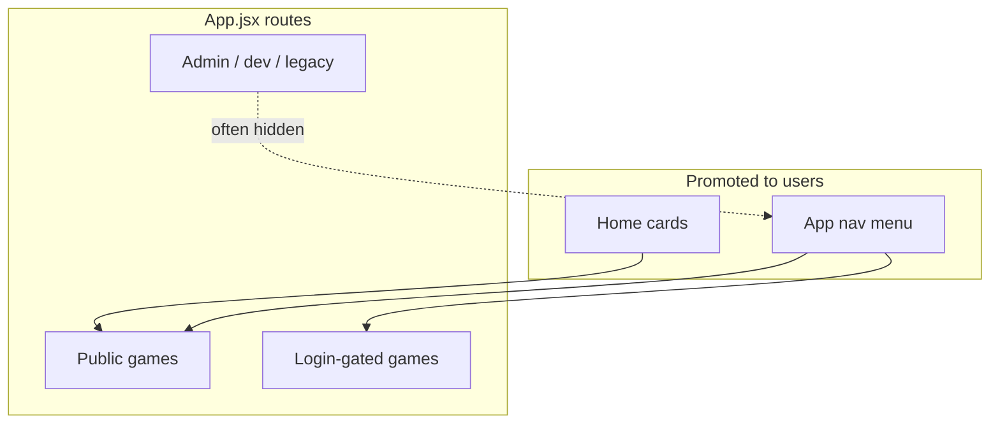
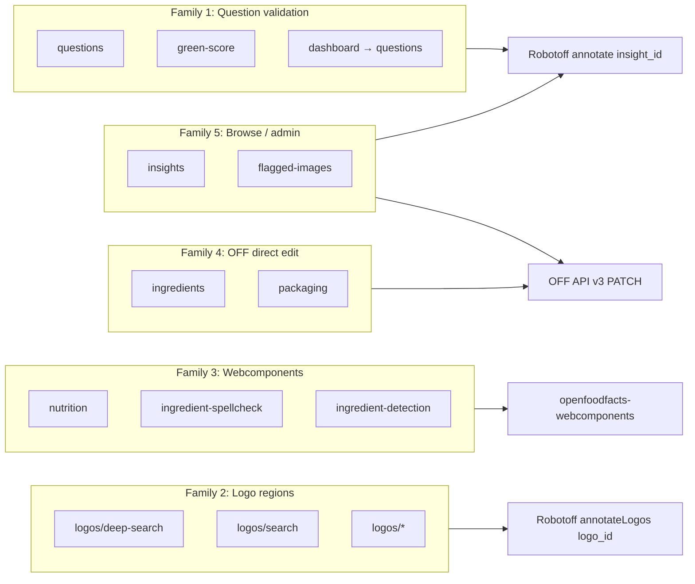
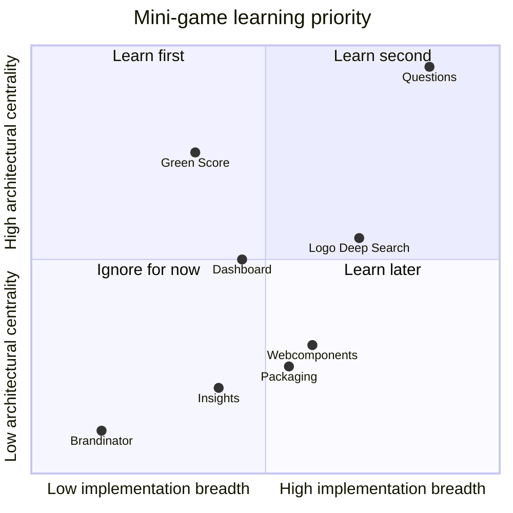

# Phase 6 — Map the Mini-Games

> **Open Food Facts Hunger Games — Contributor Onboarding**
>
> Continues from [Phase 5 — Repository Tour](./phase-5-repository-tour.md)
>
> Evidence: `src/App.jsx`, `src/pages/home/homeCards.jsx`, `src/components/ResponsiveAppBar.tsx`, per-page implementations, `package.json` homepage.

---

## What “mini-game” means here

Each route under `src/pages/` is a **focused annotation experience** — not a separate deployed app. They share:

- the same React shell (`App.jsx`)
- the same OFF session cookies
- often the same `robotoff.ts` / `off.ts` wrappers

But they target **different data problems** and use **different interaction mechanics**.

This phase answers:

1. Which games are **actually routed and promoted** today?
2. What **family** does each belong to?
3. Which **one or two** teach the core architecture?

---

## What is “active” in production?

**FACT:** Production URL is `https://hunger.openfoodfacts.org` (`package.json` homepage).

A game is **active** if it has:

- a **Route** in `App.jsx`, and/or
- a **home page card** in `homeCards.jsx`, and/or
- a **nav menu entry** in `ResponsiveAppBar.tsx`

Some routes exist but are **hidden** (dev mode, admin-only, experimental, or legacy).



---

## Master route table

| Route | Page folder | In home? | In nav? | Login? | Status |
|---|---|---|---|---|---|
| `/` | `home/` | — | logo → home | No | **Active** |
| `/questions` | `questions/` | Featured | Yes | No | **Active — core** |
| `/questions?type=…` | (same) | Many cards | via links | No | **Active — filtered variants** |
| `/green-score` | `green-score/` | Featured | Yes | No | **Active — launcher** |
| `/eco-score` | → green-score | — | — | No | Alias route |
| `/logos/deep-search` | `logos/LogoDeepSearch.jsx` | Featured | Yes | **Yes** | **Active** |
| `/logos/search` | `logos/LogoSearch.jsx` | — | Yes | **Yes** | **Active** |
| `/logos/product-search` | `logos/ProductLogoAnnotations.jsx` | — | Yes | **Yes** | **Active** |
| `/logos` | `logos/LogoAnnotation.jsx` | — | Yes (devMode) | **Yes** | **Dev menu only** |
| `/logos/:logoId` | `logos/LogoUpdate.jsx` | — | — | **Yes** | **Active** (deep link) |
| `/nutrition` | `nutrition/` | Featured | Yes (desktop) | **Yes** | **Active — webcomponent** |
| `/ingredient-spellcheck` | `ingredient-spellcheck/` | Featured | Yes | No | **Active — webcomponent** |
| `/ingredient-detection` | `ingredient-detection/` | Featured | Yes | No | **Active — webcomponent** |
| `/ingredients` | `ingredients/` | — | **Not in nav** | No | **Active but discoverability low** |
| `/packaging` | `packaging/` | — | **Not in nav** | **Yes** | **Active but hidden** |
| `/dashboard`, `/dashboard/:id` | `logosValidator/` | — | Yes | No | **Active — campaign hub** |
| `/nutriscore`, `/inao` | → DashBoard | — | — | No | **Legacy redirects** |
| `/insights` | `insights/` | — | Yes (devMode) | No | **Power-user / dev** |
| `/settings` | `settings/` | — | Mobile nav | No | **Active** |
| `/flagged-images` | `flaggedImages/` | — | — | Admin user | **Admin only** |
| `/brandinator` | `Brandinator/` | — | — | No | **Experimental** |
| `/gala` | `GalaPage.tsx` | — | — | No | **Event page** |
| `/bugs` | `bug/` | — | — | No | **Internal API test** |
| `/logoQuestion` | `LogoQuestionValidator/` | — | — | — | **Route commented out** |

**External (not Hunger Games):** home cards link to Open Prices (`prices.openfoodfacts.org`) — separate project.

---

## Conceptual families

Do not treat every folder as a unique architecture. Most games fall into **five families** plus utilities.



---

## Family 1 — Generic Robotoff question / insight validation

**Shared mechanism:** `useQuestions` → `robotoff.questions()` → Yes/No/Skip → `robotoff.annotate(insight_id, …)`.

### 1. Questions (`/questions`) — **THE reference game**

| | |
|---|---|
| **Data problem** | Validate ML claims: labels, brands, categories, packaging, weights, … |
| **User sees** | Question sentence, product photo, value chip, Yes/No/Skip |
| **Consumes** | Robotoff `/questions/`; OFF product sidebar |
| **Produces** | Annotation `0` / `1` / `-1` on `insight_id` |
| **Mechanism** | **Generic** — `useQuestions.ts` |
| **Representative?** | **Yes — learn this first** |

**FACT:** Filter via URL (`type`, `value_tag`, `country`, `campaign`, `predictor`).

### 2. Filtered question variants (same page)

Home cards link to **`/questions?type=…`** — not separate implementations.

| Home card | Filter | Insight type |
|---|---|---|
| Brands | `?type=brand` | brand |
| Labels | `?type=label` | label |
| Weights | `?type=product_weight` | product_weight |
| Packaging | `?type=packaging` | packaging |
| Sister projects | `?type=category&value_tag=en:open-beauty-facts` etc. | category |

**Architecturally:** identical to Questions — only query params differ.

### 3. Green Score (`/green-score`)

| | |
|---|---|
| **Data problem** | Eco-related **label** validation (organic, Fairtrade, MSC, …) |
| **User sees** | Grid of label cards + country filter + `Opportunities` list |
| **Consumes** | `robotoff.questions()` for counts; links into filtered `/questions` |
| **Produces** | Same annotations once user enters Questions |
| **Mechanism** | **Launcher only** — reuses Questions + `SmallQuestionCard` / `Opportunities` |
| **Representative?** | Good **second** step — shows filter composition without new answer logic |

**FACT** (`green-score/cards.tsx`): each card is a preset `filterState` (`insightType: "label"`, specific `valueTag`).

### 4. Logo dashboards (`/dashboard`, `/dashboard/:dasboardId`)

| | |
|---|---|
| **Data problem** | Batch validation for **many certification logos** (Nutri-Score, AB Bio, …) |
| **User sees** | Tabbed dashboard of logo cards with question counts |
| **Consumes** | `dashboardDefinition.ts` (hundreds of logo presets); `robotoff.questions()` |
| **Produces** | Links to `/questions?type=…&value_tag=…` or `/logos/deep-search?…` |
| **Mechanism** | **Campaign launcher + config** — not a separate annotate pipeline |
| **Representative?** | Useful for understanding **campaigns** and `value_tag` focus — ignore config size initially |

**FACT** (`DashboardCard.tsx`): primary CTA → `/questions?…`; secondary → logo deep search.

**FACT:** `LogoQuestionValidator` reuses `useQuestions` with `forcedParams` from dashboard logo config — but its **route is commented out** in `App.jsx`. Code remains as alternate UI for same data.

---

## Family 2 — Logo / image region annotation

**Shared mechanism:** `robotoff.searchLogos()` → user selects bounding-box logos → `robotoff.annotateLogos()` or `updateLogo()`.

Uses **`logo_id` (numeric)**, not `insight_id`.

### Logo Deep Search (`/logos/deep-search`) — **featured on home**

| | |
|---|---|
| **Data problem** | Confirm/refute logo detector matches for a taxonomy value |
| **User sees** | Grid of cropped logo regions + annotation form |
| **Consumes** | `robotoff.searchLogos(barcode, value, type)` |
| **Produces** | Logo annotations `{ logo_id, type, value }` |
| **Mechanism** | **Specialized** — `LogoGrid`, `AnnotateLogoModal` |
| **Login** | Required |
| **Representative?** | Best **second architecture path** after Questions |

### Logo Search (`/logos/search`)

Same search/annotate pattern with form-driven queries (`useUrlParams`).

### Product Logo Annotations (`/logos/product-search`)

Product-centric logo annotation workflow (JSX).

### Logo Annotation (`/logos`) — dev menu only

**FACT:** `devModeOnly: true` in nav — hidden unless dev mode + visiblePages toggle.

### Logo Update (`/logos/:logoId`)

Edit a specific detected logo via `robotoff.updateLogo`.

---

## Family 3 — Webcomponent-hosted Robotoff games

**Shared mechanism:** `OffWebcomponents.tsx` loads `@openfoodfacts/openfoodfacts-webcomponents`; Robotoff/OFF calls happen **inside** the custom element.

| Game | Route | Component | Login |
|---|---|---|---|
| Nutrition | `/nutrition` | `<robotoff-nutrient-extraction>` | Yes |
| Ingredient spellcheck | `/ingredient-spellcheck` | `<robotoff-ingredient-spellcheck>` | No |
| Ingredient detection | `/ingredient-detection` | `<robotoff-ingredient-detection>` | No |

| | |
|---|---|
| **Data problem** | Structured extraction: nutrients, ingredient OCR, spellcheck |
| **User sees** | Full game UI inside web component |
| **Consumes** | Robotoff + OFF (internal to webcomponents) |
| **Produces** | Often `annotation=2` with payload (Robotoff API) |
| **Mechanism** | **External repo** — Hunger Games is host + country filter |
| **Representative?** | Learn **after** Questions — fixes may require **webcomponents PR** |

**FACT** (`nutrition/index.tsx`): only wraps webcomponent + country autocomplete.

---

## Family 4 — Direct Open Food Facts product editing

**Shared mechanism:** Search OFF for incomplete products → human edits fields → **`PATCH /api/v3/product/{code}`**.

| Game | Route | Writes |
|---|---|---|
| Ingredients | `/ingredients` | `ingredients_text_{lang}` via `off.setIngedrient` |
| Packaging | `/packaging` | `packagings` structure via axios PATCH |

| | |
|---|---|
| **Data problem** | Products missing ingredient text or packaging data |
| **User sees** | Product queue, zoomable images, editable tables/text |
| **Consumes** | OFF `search.pl` queues (`useData`, `useBuffer`) |
| **Produces** | Direct OFF mutations — **bypasses Robotoff annotate** for the save |
| **Mechanism** | **Specialized editors** — different from insight validation |
| **Representative?** | Important for OFF integration literacy — **not** the core Questions pattern |

**FACT:** Ingredients also calls Robotoff **`/predict/ingredient_list`** for OCR suggestions (`useData.tsx`) — hybrid read from Robotoff, write to OFF.

---

## Family 5 — Browse / admin / moderation

### Insights (`/insights`)

| | |
|---|---|
| **Data problem** | Inspect insight records (type, annotation state, barcode) |
| **User sees** | MUI DataGrid of Robotoff insights |
| **Consumes** | `robotoff.getInsights()` |
| **Produces** | **Read-only** in UI — links to edit product / questions |
| **Nav** | devModeOnly |
| **Representative?** | Power-user debugging — not contributor default path |

### Flagged images (`/flagged-images`)

| | |
|---|---|
| **Data problem** | Moderate user-flagged bad images |
| **User sees** | List from external API `amathjourney.com` |
| **Route** | Only if username ∈ `ADMINS` in `App.jsx` |
| **Representative?** | **Ignore for onboarding** |

---

## Utilities & experiments (ignore for now)

| Route | Purpose |
|---|---|
| `/settings` | Language, theme, dev mode, country |
| `/brandinator` | Fun leaderboard links to filtered questions — not annotation logic |
| `/gala` | Event-specific board |
| `/bugs` | Manual OFF API v3 test buttons |
| `/shouldLoggedinPage` | Login prompt gate |

---

## Comparison table — what each family teaches

| Family | Primary ID | Primary API | HG code hub | Cross-repo? |
|---|---|---|---|---|
| Question validation | `insight_id` | `robotoff.annotate` | `useQuestions.ts` | Rarely |
| Logo annotation | `logo_id` | `annotateLogos` | `LogoGrid.jsx` | Sometimes Robotoff |
| Webcomponents | (internal) | (internal) | `OffWebcomponents.tsx` | **Often webcomponents** |
| OFF editors | `barcode` | OFF v3 PATCH | `off.ts`, page buffers | OFF API semantics |
| Insight browse | `insight_id` | `getInsights` | `InsightsGrid.jsx` | Robotoff filters |

---

## Which games to learn first (explicit recommendation)

### Primary: **`/questions`**

**Why:**

- Uses the **central hook** (`useQuestions`) and **central wrapper** (`robotoff.annotate`)
- Shows **URL filter state**, **React Query queue**, **optimistic UI**, **OFF product sidebar**
- Most contributor issues touch this flow or its filters
- Phase 7 runtime walkthrough will trace this path

**Study files:**

```
src/pages/questions/QuestionDisplay.tsx
src/hooks/useQuestions.ts
src/hooks/useFilterState/
src/robotoff.ts
```

### Secondary (pick one): **`/green-score`** OR **`/logos/deep-search`**

| Option | Learn what |
|---|---|
| **Green Score** | How **launchers** compose filters and link into Questions — minimal new code |
| **Logo Deep Search** | Second annotation pipeline (`logo_id`, `searchLogos`, `annotateLogos`) |

**RECOMMENDATION:** After Questions, do **Green Score** if you want more Robotoff question patterns; do **Logo Deep Search** if you want breadth across API surfaces.

### Ignore temporarily

| Game | Reason |
|---|---|
| All `/dashboard` logo entries | Config noise — understand launcher pattern from one card |
| Nutrition / spellcheck / detection | Logic lives in webcomponents |
| Packaging / ingredients editors | OFF PATCH path — different skill tree |
| Insights | Admin browse — not annotation UX |
| Brandinator, Gala, bugs, flagged-images | Non-core |

---

## How home vs nav vs routes can disagree

| Observation | Classification |
|---|---|
| Home promotes `/logos/deep-search` but not `/logos/search` | **INFERENCE:** deep search is primary citizen logo game |
| `/ingredients` routed but not in nav | **FACT:** discoverability gap — page still works |
| `/packaging` login-gated, not on home | **FACT:** power contributor tool |
| Insights + logo annotate in nav only with devMode | **FACT:** toggled in Settings |
| Open Prices cards on home | **External** — not this repo |

Enable **dev mode** in Settings to see Insights and `/logos` annotate in nav when exploring locally.

---

## Architecturally representative summary



*(Qualitative chart — for intuition, not metrics.)*

---

## Headspace protection

### MUST UNDERSTAND NOW

1. **Most “games” are either Questions with filters or one of four mechanical families.**
2. **`/questions` is the architectural core** — everything in Family 1 routes through it or copies its hooks.
3. **Logo games use a different ID and API** than Yes/No questions.
4. **Webcomponents games are hosted, not implemented, in this repo.**
5. **Packaging/ingredients write to OFF directly** — different from `robotoff.annotate`.

### USEFUL LATER

- `LogoQuestionValidator` (disabled route, same `useQuestions`)
- `dashboardDefinition.ts` campaign config
- Hybrid Robotoff predict + OFF write in ingredients
- Admin flagged-images pipeline

### IGNORE FOR NOW

- Individual dashboard logo entries (100+)
- Brandinator, Gala, bugs
- Open Prices external cards
- Legacy `/nutriscore`, `/inao` routes

---

## Phase 6 summary — five things to remember

1. **~15 routed experiences**, but only **~5 mechanical patterns**.
2. **Questions + filtered URLs** are the default Robotoff validation UX.
3. **Green Score / Dashboard** are launchers — not separate annotation engines.
4. **Logo deep search** is the main alternate Robotoff API path (`logo_id`).
5. **Learn Questions first**, then either Green Score (same family) or Logo Deep Search (second family).

### Uncertainties

- **UNKNOWN:** Which games maintainers prioritize for UX investment (README mentions cognitive load globally).
- **INFERENCE:** `LogoQuestionValidator` may return if batch grid UX is needed again — route currently disabled.

---

## What comes next

**Phase 7 — Core runtime flow: answering a Robotoff question**

Deep trace from opening `/questions` through filters → fetch → render → annotate → React Query updates → refill → Matomo — with exact functions, query keys, and optimistic/pessimistic classification.

---

*Stop here. Open https://hunger.openfoodfacts.org/questions mentally: identify which family you're in, which ID type you'd annotate, and which API would receive your click. Then continue to Phase 7.*
