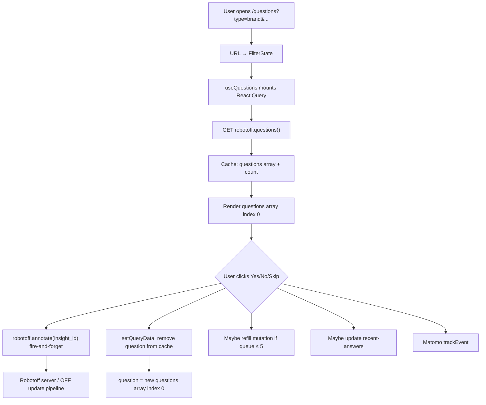
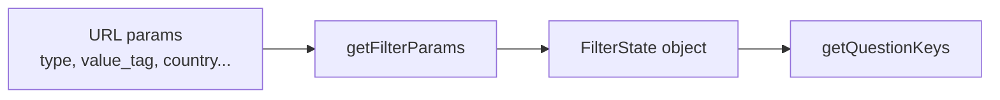
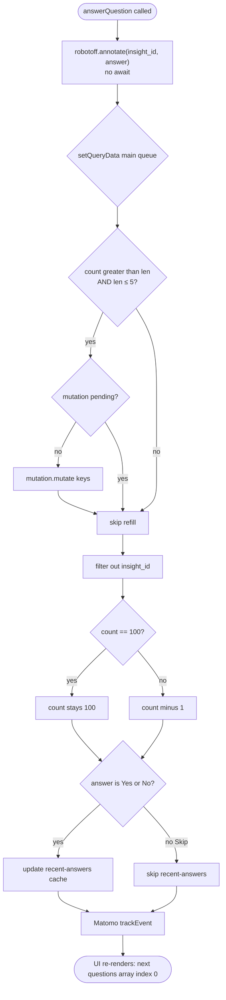

# Phase 7 — Core Runtime Flow: Answering a Robotoff Question

> **Open Food Facts Hunger Games — Contributor Onboarding**
>
> Continues from [Phase 6 — Map the Mini-Games](./phase-6-mini-games.md)
>
> Evidence: traced through `QuestionDisplay.tsx`, `useQuestions.ts`, `useFilterState`, `getFilterParams.ts`, `robotoff.ts`, `const.ts`, `useKeyboardShortcuts.ts`, `UserData.tsx`, `ProductOtherQuestions.tsx`, `matomoEvents.ts`.

---

## What this phase does

You already know *what* Questions is. This phase walks **exact execution order** when you open `/questions` and click **Yes**, **No**, or **Skip** — with real function names, query keys, HTTP boundaries, and a honest classification of optimistic vs pessimistic behavior.

**Game traced:** `/questions` (Family 1 — generic insight validation).

---

## Level 1 — End-to-end overview



### Read-aloud walkthrough

You land on the page. React Router gives the URL search params to `getFilterParams`, which becomes the filter state. `useQuestions` registers a React Query entry keyed by those filters and fetches up to twenty questions from Robotoff. The UI always shows the **first item** in the cached array. When you answer, the app **immediately removes** that item from the cache and shows the next one, while sending the annotation to Robotoff in the background without waiting for success.

---

## Level 2 — Stage-by-stage trace

### Stage A — Route → page mount

| Step | What runs | Evidence |
|---|---|---|
| 1 | `App.jsx` matches `/questions` → lazy `pages/questions/index.tsx` | FACT |
| 2 | Layout renders `QuestionFilter`, `QuestionDisplay`, `ProductInformation`, `UserData` | FACT |
| 3 | Multiple children each call hooks independently | FACT |

**Important:** `QuestionDisplay` and `UserData` **both** call `useQuestions()`. They share the **same React Query cache key**, not duplicate network fetches (Query dedupes). Only the instance that handles `answerQuestion` triggers refill mutation.

---

### Stage B — URL → filter identity

**Entry:** browser URL, e.g. `/questions?type=label&value_tag=en:organic&country=fr&sorted=true`

**Function:** `getFilterParams(searchParams)` in `src/hooks/useFilterState/getFilterParams.ts`

```typescript
// Pseudocode — FACT-aligned
function getFilterParams(searchParams):
  country = normalizeCountryFilter(searchParams.get("country") ?? "")
  return {
    insightType: searchParams.get("type") ?? "",
    valueTag: searchParams.get("value_tag") ?? "",
    country,
    brand: searchParams.get("brand") ?? "",
    campaign: searchParams.get("campaign") ?? "",
    predictor: searchParams.get("predictor") ?? "",
    sorted: searchParams.get("sorted") ?? "true",
  }
```

**Country normalization (FACT):** taxonomy id like `en:france` → ISO `fr` via `assets/countries.json`; `en:world` → empty string.

**Filter UI writes URL:** `QuestionFilter.tsx` updates search params directly; `FilterDialog` uses `useFilterState` setter → `setFilterParams`.

When filters change → **query key changes** → React Query treats it as a **new cache entry** → fresh fetch.



---

### Stage C — React Query identity (query key)

**Function:** `getQuestionKeys(params)` in `src/hooks/useQuestions.ts`

```typescript
[
  "questions",
  params.insightType,
  params.valueTag,
  params.sorted !== "false",   // boolean: popularity vs random
  params.brand,
  params.country,
  params.campaign,
  params.predictor,
]
```

**FACT:** Key does **not** include `pageSize`, `lang`, or `with_image`. Changing language in settings affects HTTP request but **may not invalidate** this key if other fields unchanged — **INFERENCE:** potential stale-language edge case until filter toggled or remount.

**Cached value shape:**

```typescript
{
  questions: QuestionInterface[],
  count: number   // server-reported remaining-ish total
}
```

---

### Stage D — Fetch questions from Robotoff

**Hook:** `useQuery({ queryKey: keys, queryFn: fetchQuestions })`

**Function:** `fetchQuestions` inside `useQuestions`

| Parameter | Source | HTTP param |
|---|---|---|
| `insightType` | `params.insightType` | `insight_types` |
| `valueTag` | `params.valueTag` | `value_tag` (via `reformatValueTag`) |
| `brandFilter` | `params.brand` | `brands` |
| `countryFilter` | `params.country` | `countries` |
| `campaign` | `params.campaign` | `campaign` |
| `predictor` | `params.predictor` | `predictor` |
| `sortByPopularity` | `params.sorted !== "false"` | `order_by`: `popularity` or `random` |
| `with_image` | hardcoded `true` | `with_image` |
| `lang` | `getLang()` inside `robotoff.questions` | `lang` |
| `count` | `pageSize` default **20** | `count` |
| `page` | hardcoded **1** | `page` |

**HTTP (FACT):**

```
GET https://robotoff.openfoodfacts.org/api/v1/questions/
  ?insight_types=...
  &value_tag=...
  &countries=...
  &lang=...
  &count=20
  &page=1
  &with_image=true
  &order_by=popularity|random
```

**Wrapper:** `robotoff.questions()` in `src/robotoff.ts` — **axios GET**, not SDK.

**Response used:** `data.questions`, `data.count`.

---

### Stage E — Derive “current question”

**FACT** (`useQuestions.ts`):

```typescript
const questions = data?.questions ?? [];
const question = questions[0] ?? null;
```

There is **no separate cursor index**. The current question is **always the head of the array**. Answering = remove head → next item becomes index 0.

**`QuestionDisplay` rendering branches (FACT):**

| Condition | UI |
|---|---|
| `question === null` && `status === "pending"` | Loading message + spinner |
| `question === null` && `status === "error"` | Error message |
| `question === null` && success | `<SimilarQuestions />` empty state |
| `question !== null` | Question text, image, Yes/No/Skip |

**Parallel fetches while a question shows:**

| Hook | Query key | Purpose |
|---|---|---|
| `useProductData(barcode)` | `["product", barcode]` | OFF sidebar product JSON |
| `usePotentialQuestionNumber` | `["potential-question-count", ...]` | Badge on value chip |
| `useProductQuestions(barcode)` | `["product-question", barcode]` | Sidebar “other questions” |

---

### Stage F — User triggers answer

**Triggers (FACT):**

1. `QuestionAnswerButtons` → `onAnswerQuestion(CORRECT_INSIGHT | WRONG_INSIGHT | SKIPPED_INSIGHT)`
2. `useKeyboardShortcuts` → same `answerQuestion({ question, answer })` on `y` / `n` / `k` (localized via `getShortcuts()`)

**Constants (`src/const.ts`):**

| UI | Constant | Integer sent to Robotoff |
|---|---|---|
| Yes | `CORRECT_INSIGHT` | `1` |
| No | `WRONG_INSIGHT` | `0` |
| Skip | `SKIPPED_INSIGHT` | `-1` |

---

## Level 3 — `answerQuestion` algorithm (critical)

**Function:** `answerQuestion` in `src/hooks/useQuestions.ts`

### Pseudocode

```text
function answerQuestion({ question, answer }):

  // Step 1 — Remote (non-blocking)
  robotoff.annotate(question.insight_id, answer)
    .catch(err => console.error(...))   // no rollback

  // Step 2 — Optimistic cache update (main queue)
  setQueryData(queryKey, prev => {
    if prev is null: return prev

    if prev.count > prev.questions.length
       AND prev.questions.length <= 5
       AND refill mutation not pending:
         mutation.mutate(queryKey)     // background refill

    return {
      questions: prev.questions.filter(q => q.insight_id !== question.insight_id),
      count: prev.count !== 100 ? prev.count - 1 : 100
    }
  })

  // Step 3 — Recent answers sidebar (Yes/No only, not Skip)
  if answer is 1 or 0:
    setQueryData(["recent-answers"], prepend up to 25 items)

  // Step 4 — Analytics
  matomoTrackAnswerQuestions(answer)
```



### Read-aloud walkthrough

The annotate call starts immediately but nothing waits for it. The cache updater runs synchronously: if the local queue is running low (five or fewer items) but the server says more exist, it kicks off a refill fetch. Regardless, it removes the answered question from the array. The displayed count decrements by one unless it was capped at one hundred. Skip answers do not appear in the recent-answers sidebar, but Yes and No do. Matomo fires last; React re-renders with the next question at the front of the queue.

---

### Stage G — Remote annotation HTTP

**Function:** `robotoff.annotate(insightId, annotation)` → SDK `robotoffClient.annotate`

**FACT payload:**

```typescript
{
  insight_id: insightId,
  annotation: -1 | 0 | 1,
  update: 1,
}
```

**Transport:** `@openfoodfacts/openfoodfacts-nodejs` `Robotoff` class with `fetch(..., { credentials: "include" })`.

**INFERENCE:** POST to Robotoff `/insights/annotate` (form-encoded per API docs).

**Server-side (FACT, Robotoff API):**

- `1` → accept insight; with `update=1`, may push to Open Food Facts
- `0` → reject insight
- `-1` → skip for this user/device
- Logged-in OFF session → may apply directly; anonymous → vote aggregation

**Hunger Games does not await this promise in the UI path.**

---

### Stage H — Queue refill mutation

**When:** inside `setQueryData`, if `count > questions.length` AND `questions.length <= 5` after removal.

**Function:** `useMutation` with `mutationFn: () => fetchQuestions()` (same as initial — page 1, count 20).

**On success (`onSuccess`):**

```typescript
seenIds = Set(existing insight_ids)
newQuestions = [
  ...existing,
  ...fetched.filter(q => !seenIds.has(q.insight_id))
]
count = fetched.count  // replaces count from server
```

**Purpose (INFERENCE):** Keep local queue stocked without refetching entire cache on every click; dedupe prevents duplicate cards if Robotoff returns overlapping page-1 results.

---

### Stage I — Recent answers memory

**Query key:** `["recent-answers"]`

**FACT:** `queryFn` always returns `[]` — data exists **only** via `setQueryData` mutations, not server fetch.

**Behavior:**

- Max **25** entries (`ANSWERS_MEMORY_SIZE`)
- **Skip excluded**
- Prepends `{ ...question, answer }`
- Displayed in `UserData.tsx` with link to OFF product edit

**Login nudge (FACT):** After **>3** recent Yes/No answers, if not logged in, modal prompts OFF login — votes matter more when authenticated.

---

### Stage J — Analytics

**Function:** `useMatomoTrackAnswerQuestion().answerQuestions(answer)`

**FACT:** `trackEvent({ category: "question-page", action: "yes"|"no"|"skip" })`

Fires **after** cache update; failure does not affect queue.

---

## UI classification: optimistic or pessimistic?

| Concern | Classification | Evidence |
|---|---|---|
| Remove question from UI | **Optimistic** | `setQueryData` before annotate completes |
| Decrement count display | **Optimistic** | local `count - 1` |
| Recent answers sidebar | **Optimistic** | updated regardless of annotate result |
| Matomo event | **Optimistic** | fires regardless |
| Robotoff persistence | **Pessimistic / async** | only on server response |
| OFF product update | **Downstream of Robotoff** | not awaited in HG |
| Refill fetch | **Eventually reconciled** | merges server page into cache |
| Rollback on annotate failure | **None** | `.catch(console.error)` only |

**Summary label:** **Optimistic queue progression + fire-and-forget remote mutation + eventual refill reconciliation.**

---

## Error handling — investigated, not assumed

> **Question:** If annotate fails but the UI already removed the question, what happens?

### FACT (from code)

1. Question **stays removed** from React Query cache — **no rollback**.
2. Error logged: `"Error while answering question"`.
3. `recent-answers` **still contains** the answer if Yes/No.
4. User sees **next question** — appears successful.
5. Robotoff may **not** have recorded annotation — insight may reappear on future session/filter refresh.
6. Refill may fetch questions including **same insight** again if server still considers it unanswered — dedupe only within current cache merge, not global session history.

### INFERENCE

This is a **known tradeoff**: throughput over strict consistency. Not necessarily a bug — but contributors fixing “my answer didn’t save” reports should check Network tab for annotate failures before blaming filters.

### Contrast: `ProductOtherQuestions.tsx` (sidebar)

**FACT:** Secondary questions use **pessimistic** pattern:

```typescript
robotoff.annotate(insight_id, pendingAnswer)
  .then(() => setAnswers(... sent: true))
  .catch(() => {});
```

Waits for success before marking sent; **does not** remove item from main `useQuestions` queue.

**INFERENCE:** Two annotation UX patterns coexist in one page — main game optimistic, sidebar cautious.

---

## Secondary path — keyboard shortcuts

**File:** `src/pages/questions/useKeyboardShortcuts.ts`

**Guards (FACT):**

- Only when `question?.insight_id` exists
- Ignored when focus in `INPUT`, `TEXTAREA`, `SELECT`, or contentEditable

**Effect:** calls same `answerQuestion` — identical runtime path as buttons.

---

## Empty queue behavior

When last cached question answered:

1. `questions` array empty → `question === null`
2. If fetch/refill still pending → loader
3. Else → `SimilarQuestions` suggests taxonomy-related tags or clearing filters

**FACT:** `SimilarQuestions` uses `useQuestionsQuery(tag)` for sibling value_tag counts — separate query keys from main queue.

---

## Complete function reference table

| Function | File | Role |
|---|---|---|
| `getFilterParams` | `hooks/useFilterState/getFilterParams.ts` | URL → FilterState |
| `useFilterState` | `hooks/useFilterState/useFilterState.ts` | React hook wrapper |
| `getQuestionKeys` | `hooks/useQuestions.ts` | React Query identity |
| `fetchQuestions` | `hooks/useQuestions.ts` | Query fn |
| `useQuestions` | `hooks/useQuestions.ts` | Main hook |
| `answerQuestion` | `hooks/useQuestions.ts` | Annotate + cache |
| `robotoff.questions` | `robotoff.ts` | GET `/questions/` |
| `robotoff.annotate` | `robotoff.ts` | SDK annotate + `update:1` |
| `reformatValueTag` | `utils.ts` | Normalize filter tags |
| `removeEmptyKeys` | `utils.ts` | Strip empty query params |
| `QuestionDisplay` | `pages/questions/QuestionDisplay.tsx` | UI + wiring |
| `useKeyboardShortcuts` | `pages/questions/useKeyboardShortcuts.ts` | Keyboard path |
| `useProductData` | `hooks/useProduct.ts` | OFF sidebar |
| `useProductQuestions` | `hooks/useProductQuestions.ts` | Other questions list |
| `matomoTrackAnswerQuestions` | `hooks/matomoEvents.ts` | Analytics |

---

## Mental simulation — click **Yes** on one question

**Given:** cache has `[Q1, Q2, … Q20]`, `count = 500`, filters `{ type: label, value_tag: en:organic }`

1. Click Yes on Q1 (`insight_id = abc`).
2. `annotate(abc, 1)` starts (network in flight).
3. Cache becomes `[Q2, … Q20]`, `count = 499`.
4. `len = 19` → no refill (needs `<= 5`).
5. Recent answers prepends Q1+Yes.
6. Matomo `question-page / yes`.
7. UI shows Q2's text and image.
8. Robotoff eventually accepts; may update OFF product label — **outside HG**.

**Given:** cache has `[Q1, Q2, Q3, Q4, Q5]`, `count = 200`

1. Answer Q1 → len becomes 4 → **refill mutation** fires.
2. UI immediately shows Q2.
3. When refill returns, Q6…Q25 append (deduped) while preserving order of remaining local queue.

---

## Headspace protection

### MUST UNDERSTAND NOW

1. Current question = **`questions[0]`** in React Query cache.
2. Query key = **`["questions", insightType, valueTag, sortedBool, brand, country, campaign, predictor]`**.
3. `answerQuestion` = **annotate async + synchronous cache surgery**.
4. UI is **optimistic**; annotate failure **does not rollback**.
5. Refill triggers when **≤5 local items** and server `count` suggests more exist.

### USEFUL LATER

- `ProductOtherQuestions` pessimistic annotate
- `SimilarQuestions` taxonomy fallback
- Count cap at 100 behavior
- Language vs query key staleness

### IGNORE FOR NOW

- LogoQuestionValidator batch selection (same hook, extra UI)
- `DebugQuestion` insight detail accordion
- Image prefetch commented code in `questions/index.tsx`

---

## Phase 7 summary — five things to remember

1. **Filters in URL → query key → one cached queue per filter set.**
2. **Answering removes `questions[0]` immediately** — no index pointer.
3. **`robotoff.annotate(insight_id, 0|1|-1, update=1)`** is the only Robotoff write in main flow.
4. **Optimistic UI, fire-and-forget network, optional refill** — know the failure mode.
5. **Sidebar “other questions”** uses a **different** annotate pattern than main buttons.

### Uncertainties

- **UNKNOWN:** Exact Robotoff behavior when same insight returned after failed annotate (server state).
- **INFERENCE:** `count === 100` may mean “100+” display cap — aligns with `UserData` showing `100+` when `>= 99`.

---

## What comes next

**Phase 8 — Robotoff API wrapper**

Deep dive into `src/robotoff.ts`: every method, axios vs SDK split, credentials, and which games consume which endpoints.

---

*Stop here. In DevTools Network, answer one question and confirm you see (1) GET `/questions/` earlier and (2) annotate request on click — without waiting for annotate before the UI advances. Then continue to Phase 8.*
