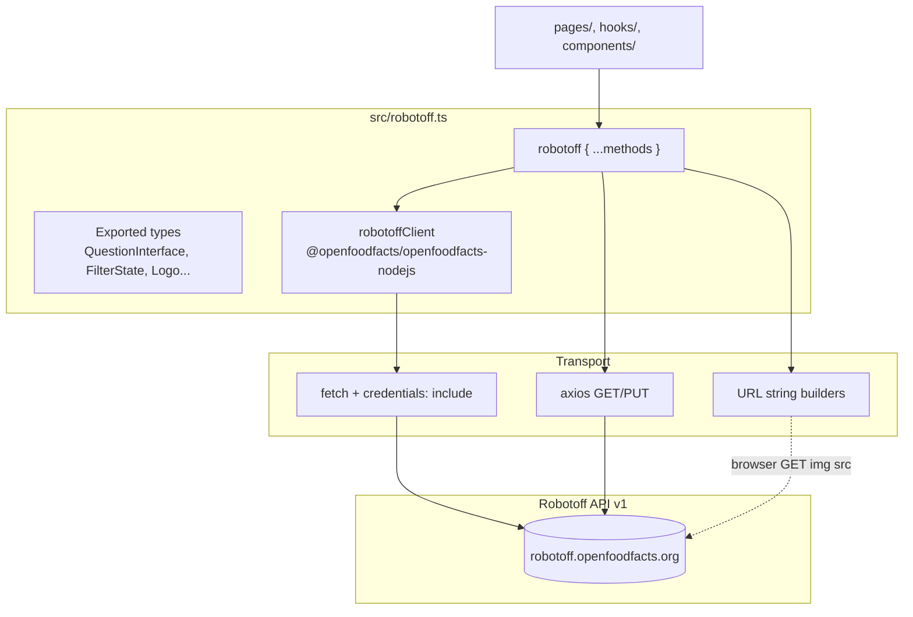
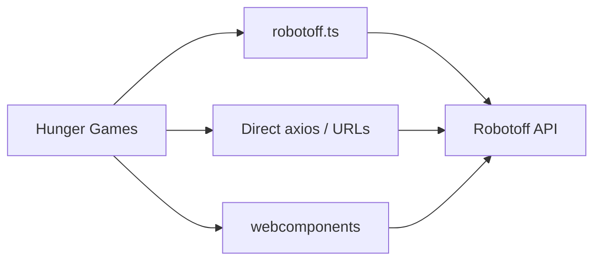

# Phase 8 — Robotoff API Wrapper

> **Open Food Facts Hunger Games — Contributor Onboarding**
>
> Continues from [Phase 7 — Core Runtime Flow](./phase-7-core-runtime-flow.md)
>
> Evidence: `src/robotoff.ts`, all `robotoff.*` call sites, direct `ROBOTOFF_API_URL` usage outside the wrapper, [Robotoff API Reference](https://openfoodfacts.github.io/robotoff/references/api/).

---

## What `src/robotoff.ts` is responsible for

This file is Hunger Games’ **central integration boundary with Robotoff**. It is not a generic HTTP library — it is the **project’s adapter** between mini-games and `https://robotoff.openfoodfacts.org/api/v1`.

It owns:

1. **Shared TypeScript types** (`QuestionInterface`, `Logo`, `FilterState`, …)
2. **One SDK client instance** (`robotoffClient`)
3. **One plain object** (`robotoff`) exposing game-facing methods
4. **Two HTTP stacks** (SDK `fetch` + `axios`) used side by side

**FACT:** Hunger Games never imports `Robotoff` outside this file.

---

## Module structure



### Default export

```typescript
export default robotoff;
```

**Convention (FACT):** almost all consumers `import robotoff from "../robotoff"`. Types imported as named exports from the same file.

---

## Base URL and auth

**FACT** (`src/const.ts`):

```typescript
export const ROBOTOFF_API_URL = "https://robotoff.openfoodfacts.org/api/v1";
```

### Credentials behavior

| Client | Configuration | Used by |
|---|---|---|
| **SDK `robotoffClient`** | Custom fetch: `{ ...init, credentials: "include" }` | `annotate`, `questionsByProductCode`, `insightDetail`, logos SDK methods, `getInsights` |
| **axios** | Mixed — see per-method table | `questions`, `updateLogo`, `getLogosImages`, `getUserStatistics`, `getUnansweredValues` |

**INFERENCE:** Session cookies from `openfoodfacts.org` are forwarded on SDK calls and some axios calls, enabling authenticated annotations (Robotoff API Basic Auth / session semantics).

**FACT:** Not every axios call sets `withCredentials: true` — potential inconsistency for cross-origin cookie behavior (browser-dependent).

---

## Why SDK and axios coexist

**FACT:** Both are active in production code today — this is **not** an unfinished refactor you should “fix” without maintainer discussion.

| Likely reason | Evidence |
|---|---|
| SDK covers newer/shared OFF client methods | `Robotoff` class from `@openfoodfacts/openfoodfacts-nodejs` `2.0.0-alpha.29` |
| Historical axios endpoints remain | `questions()`, logo PUT, statistics, unanswered |
| Different payload needs | Nutrition uses manual `URLSearchParams` POST elsewhere |
| URL-building helpers | `getCroppedImageUrl` returns string, not a client call |

**RECOMMENDATION for contributors:** add new Robotoff methods to `robotoff.ts` using whichever stack already used for similar endpoints — SDK for insight/logo/annotate family, axios only if matching existing axios patterns.

---

## Complete method reference

### Summary table

| Method | Transport | HTTP (Robotoff API) | Mutates? | Primary consumers |
|---|---|---|---|---|
| `annotate` | SDK fetch | POST `/insights/annotate` | **Yes** | `useQuestions`, `ProductOtherQuestions` |
| `questions` | axios GET | GET `/questions/` | No | `useQuestions`, cards, counts |
| `questionsByProductCode` | SDK | GET `/questions/{barcode}` | No | `useProductQuestions` |
| `getInsights` | SDK | GET `/insights/` | No | `InsightsGrid` |
| `insightDetail` | SDK | GET `/insights/detail/{id}` | No | `DebugQuestion`, `CroppedLogo`, `LogoQuestionCard` |
| `searchLogos` | SDK | Logo search endpoint | No | Logo deep search, search, product-search |
| `annotateLogos` | SDK | Bulk logo annotate (JSON) | **Yes** | `AnnotateLogoModal` |
| `loadLogo` | SDK | GET `/images/logos/{logo_id}` | No | `LogoUpdate` |
| `getLogoAnnotations` | SDK | GET `/annotation/collection` | No | `LogoAnnotation`, `LogoDeepSearch` |
| `getLogosImages` | axios GET | GET `/images/logos?logo_ids=` | No | Logo pages, debug/crop helpers |
| `updateLogo` | axios PUT | PUT `/images/logos/{logo_id}` | **Yes** | `LogoGrid`, `LogoUpdate` |
| `getCroppedImageUrl` | URL builder | GET `/images/crop?...` | No | All logo UIs (img `src`) |
| `getUnansweredValues` | axios GET | GET `/questions/unanswered/` | No | `Opportunities` (Green Score) |
| `getUserStatistics` | axios GET | GET `/users/statistics/{username}` | No | **None — dead wrapper** |

---

## Method-by-method deep dive

### `annotate(insightId, annotation)`

```typescript
robotoffClient.annotate({
  insight_id: insightId,
  annotation: -1 | 0 | 1,
  update: 1,
});
```

| | |
|---|---|
| **Purpose** | Submit Yes / No / Skip on an **insight** |
| **Parameters** | `insight_id` UUID; `annotation` 1/0/-1 |
| **Side effect** | Robotoff records vote; with `update: 1`, may update OFF product |
| **Games** | Questions (main), ProductOtherQuestions (sidebar) |
| **Awaited?** | Main queue: **no**; sidebar: **yes** (`.then`) |

**FACT:** Does **not** support `annotation=2` with extra data — nutrition uses separate axios POST.

---

### `questions(filterState, count?, page?)`

```typescript
axios.get(`${ROBOTOFF_API_URL}/questions/`, {
  params: removeEmptyKeys({ ...searchParams, lang, count, page }),
});
```

| Request param | Source |
|---|---|
| `insight_types` | `insightType` |
| `value_tag` | `reformatValueTag(valueTag)` |
| `brands` | `reformatValueTag(brandFilter)` |
| `countries` | `countryFilter` |
| `campaign`, `predictor`, `with_image` | direct |
| `order_by` | `popularity` or `random` |
| `lang` | `getLang()` |
| `count`, `page` | args (defaults 10, 1) |

| | |
|---|---|
| **Response** | `{ count, questions: QuestionInterface[] }` |
| **Games** | Questions, Green Score counts, QuestionCard, DashboardCard, utils badge |
| **Why axios** | **UNKNOWN** exact history; SDK has product questions but bulk filter fetch uses axios |

---

### `questionsByProductCode(code)`

| | |
|---|---|
| **SDK** | `robotoffClient.questionsByProductCode(Number(code))` |
| **Post-processing** | **FACT:** filters out questions without `source_image_url` |
| **Games** | `useProductQuestions` → ProductOtherQuestions sidebar |

---

### `getInsights(barcode, insightType, valueTag, annotation, page, count, campaigns, country)`

| | |
|---|---|
| **Purpose** | Paginated insight browser for admin grid |
| **Special** | `annotation === "not_annotated"` → maps to `annotated: false` |
| **Games** | `pages/insights/InsightsGrid.jsx` |
| **Side effect** | Read-only |

---

### `insightDetail(insight_id)`

| | |
|---|---|
| **Purpose** | Debug metadata: predictor, timestamp, bounding box, optional `logo_id` |
| **Games** | DebugQuestion, CroppedLogo, LogoQuestionValidator cards |
| **Side effect** | Read-only |

---

### Logo methods cluster

#### `searchLogos(barcode, value, type, count?, random?)`

| | |
|---|---|
| **Value formatting** | If value matches `/^[a-z][a-z]:/` → `taxonomy_value`; else `value` |
| **Games** | LogoSearch, LogoDeepSearch, ProductLogoAnnotations |
| **Side effect** | Read-only |

#### `annotateLogos(annotations)`

| | |
|---|---|
| **Payload** | Array of `{ logo_id, type, value }` |
| **Games** | `AnnotateLogoModal` (batch logo labeling) |
| **Dev guard** | **FACT:** skipped when `IS_DEVELOPMENT_MODE` |
| **Side effect** | **Mutates** logo annotations in Robotoff |

#### `updateLogo(logoId, value, type)`

| | |
|---|---|
| **Transport** | `axios.put` + `withCredentials: true` |
| **Games** | LogoGrid inline edit, LogoUpdate page |
| **Dev guard** | skipped in dev mode in LogoGrid |
| **Side effect** | **Mutates** single logo annotation |

#### `loadLogo(logoId)` / `getLogosImages(logoIds)` / `getLogoAnnotations(...)`

| Method | Role |
|---|---|
| `loadLogo` | Single logo detail |
| `getLogosImages` | Batch fetch logo records by id |
| `getLogoAnnotations` | Paginated annotation collection (reference logos in deep search) |

#### `getCroppedImageUrl(imageUrl, boundingBox)`

| | |
|---|---|
| **Not a network call in TS** | Returns URL string |
| **Browser fetches** | `` → GET `/images/crop` |
| **Coords** | `[y_min, x_min, y_max, x_max]` relative 0–1 |
| **FACT (Robotoff docs)** | “currently only used to generate cropped logos on Hunger Games” |

---

### `getUnansweredValues({ type, countryCode, campaign, page, count })`

| | |
|---|---|
| **Purpose** | List `[value_tag, count]` tuples for opportunity cards |
| **Games** | `Opportunities.tsx` on Green Score page |
| **Transport** | axios; manual query string join |
| **Side effect** | Read-only |

---

### `getUserStatistics(username)`

| | |
|---|---|
| **Status** | **Defined but unused** in `src/**` (FACT via repo search) |
| **Classification** | Dead wrapper / future feature — do not assume UI exists |

---

## Robotoff calls **outside** `robotoff.ts`

Important boundary: not everything goes through the wrapper.

| Location | Endpoint | Why separate |
|---|---|---|
| `pages/nutrition/utils.ts` | POST `/insights/annotate` with `annotation=2` + JSON `data` | Rich nutrient payload |
| `pages/ingredients/useData.tsx` | GET `/predict/ingredient_list?ocr_url=...` | OCR prediction read |
| `pages/logosValidator/dashboardDefinition.ts` | Static `/images/crop?...` URLs | Config thumbnails |
| `components/OffWebcomponents.tsx` | Passes `ROBOTOFF_API_URL` to webcomponents | External package owns calls |



**Contributor rule:** if you add a Robotoff call, **prefer extending `robotoff.ts`** unless you are matching an existing direct pattern (nutrition-style annotate) or working in webcomponents repo.

---

## Consumer map by game

| Game / area | Methods used |
|---|---|
| **Questions** | `questions`, `annotate` |
| **Green Score / Opportunities** | `questions`, `getUnansweredValues` |
| **Home / QuestionCard** | `questions` (counts) |
| **Insights admin** | `getInsights` |
| **Logo deep search / search** | `searchLogos`, `getLogoAnnotations`, `getLogosImages`, `getCroppedImageUrl`, `annotateLogos` (modal) |
| **Logo update / grid** | `loadLogo`, `updateLogo`, `getCroppedImageUrl` |
| **Logo annotation page** | `getLogoAnnotations`, `getLogosImages`, `getCroppedImageUrl` |
| **Product sidebar** | `questionsByProductCode`, `annotate` |
| **Debug / crops** | `insightDetail`, `getLogosImages`, `getCroppedImageUrl` |
| **Nutrition** | direct POST annotate (`annotation=2`) in `nutrition/utils.ts` |
| **Ingredients** | direct GET `predict/ingredient_list` |

---

## Side effects — what mutates production data?

| Call | Robotoff state | May update OFF product? |
|---|---|---|
| `annotate(..., 1, update:1)` | Insight accepted | **Yes** (via Robotoff) |
| `annotate(..., 0)` | Insight rejected | No |
| `annotate(..., -1)` | Skipped for user | No |
| `annotateLogos` | Logo labels on regions | **INFERENCE:** feeds insight/product pipeline |
| `updateLogo` | Logo type/value changed | **INFERENCE:** same |
| All GET methods | None | No |

---

## Dev-mode safety guards

**FACT:** Some mutations are disabled locally to avoid accidental production annotations:

| Location | Guard |
|---|---|
| `AnnotateLogoModal` | Skips `annotateLogos` if `IS_DEVELOPMENT_MODE` |
| `LogoGrid` | Skips `updateLogo` if dev mode |

**FACT:** Main `useQuestions` **`annotate` is NOT dev-guarded** — local dev can still send real annotations unless Robotoff rejects localhost/origin.

**INFERENCE:** Contributors testing locally should prefer dev mode for logo batch tools but still treat Questions annotate as potentially production-impacting if CORS allows the request.

---

## Shared helpers used by the wrapper

| Helper | File | Role |
|---|---|---|
| `reformatValueTag` | `utils.ts` | Normalize filter tags before API |
| `removeEmptyKeys` | `utils.ts` | Omit empty query params |
| `getLang` | `localeStorageManager.ts` | `lang` param on `questions()` |

---

## Type exports used across the app

| Type | Used for |
|---|---|
| `QuestionInterface` | Question queue items |
| `FilterState` | URL filters + Robotoff query params (note: dual `country` / `countryFilter` fields) |
| `Logo`, `BoundingBox`, `LogoImage` | Logo games |
| `FilterState` in hooks | Query keys + API mapping |

**FACT:** `FilterState` is defined in `robotoff.ts` but overlaps conceptually with `QuestionFilter/const.ts` — different types sharing a name pattern (see Phase 5 naming audit).

---

## SDK method → Robotoff endpoint mapping

**INFERENCE** aligned with [Robotoff API Reference](https://openfoodfacts.github.io/robotoff/references/api/):

| SDK method (nodejs) | Robotoff endpoint |
|---|---|
| `annotate` | POST `/insights/annotate` |
| `questionsByProductCode` | GET `/questions/{barcode}` |
| `insights` | GET `/insights/` |
| `insightDetail` | GET `/insights/detail/{insight_id}` |
| `searchLogos` | Logo search (universal-logo-detector criteria) |
| `annotateLogos` | Bulk logo annotation (JSON body) |
| `loadLogo` | GET `/images/logos/{logo_id}` |
| `getLogoAnnotations` | GET `/annotation/collection` |

Exact SDK path construction lives in `@openfoodfacts/openfoodfacts-nodejs` — bump SDK version carefully.

---

## Headspace protection

### MUST UNDERSTAND NOW

1. **`robotoff.ts` is the default integration point** — but not the only one.
2. **Insight annotations** → `annotate()` SDK; **logo annotations** → `annotateLogos` / `updateLogo`.
3. **`questions()` uses axios**; most other reads use SDK.
4. **`getCroppedImageUrl` builds image URLs**, not JSON APIs.
5. **`update: 1` is always sent** on insight annotate from Hunger Games.

### USEFUL LATER

- `getUserStatistics` dead code
- `annotation=2` nutrition path in separate file
- `predict/ingredient_list` for ingredients game
- SDK alpha version pin (`2.0.0-alpha.29`)

### IGNORE FOR NOW

- CSV dump / batch import endpoints (not used in HG)
- ANN nearest-neighbor search endpoints
- Full Robotoff prediction API surface

---

## Phase 8 summary — five things to remember

1. **One file, two HTTP clients** — SDK `fetch` + `axios`, intentional history.
2. **Three annotation channels** — insight `annotate`, logo `annotateLogos`, logo `updateLogo`.
3. **`questions()` is the odd axios out** among core queue operations.
4. **Some Robotoff traffic bypasses the wrapper** — nutrition, ingredients, webcomponents.
5. **Credentials: `include` on SDK** — ties annotations to OFF login when cookies present.

### Uncertainties

- **UNKNOWN:** Whether SDK will eventually replace all axios Robotoff calls.
- **UNKNOWN:** Full `annotateLogos` → OFF field mapping (Robotoff server logic).
- **INFERENCE:** `getLogosImages` without explicit `withCredentials` may still work for public logo metadata.

---

## What comes next

**Phase 9 — Open Food Facts API boundary**

Which data comes from OFF vs Robotoff, which mutations go where, taxonomy usage, and a **data/action → backend** table focused on `off.ts`, `offSearch.ts`, `offTaxonomy.ts`.

---

*Stop here. Skim `src/robotoff.ts` once with this table open — you should recognize every method and at least one consumer. Then continue to Phase 9.*
