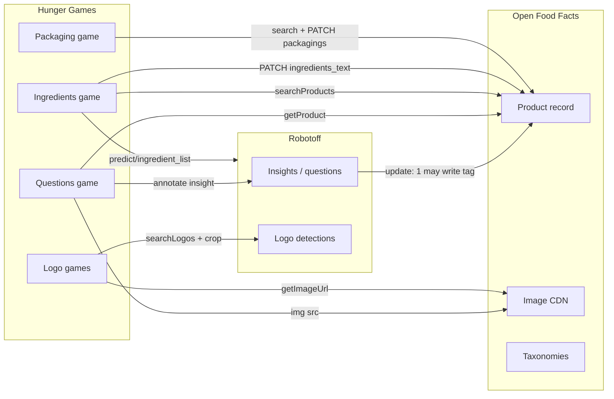
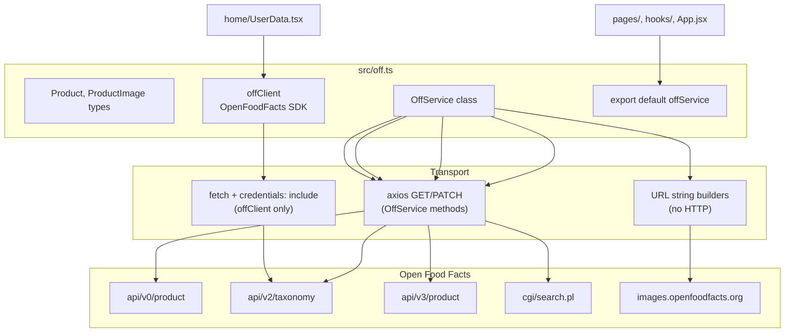
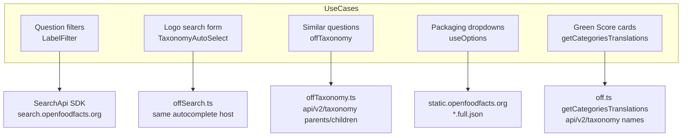

# Phase 9 — Open Food Facts API Boundary

> **Open Food Facts Hunger Games — Contributor Onboarding**
>
> Continues from [Phase 8 — Robotoff API Wrapper](./phase-8-robotoff-api-wrapper.md)
>
> Evidence: `src/off.ts`, `src/offSearch.ts`, `src/offTaxonomy.ts`, `src/const.ts`, `src/hooks/useProduct.ts`, `src/hooks/useOptions.ts`, `src/components/QuestionFilter/LabelFilter.tsx`, `src/pages/packaging/`, `src/pages/ingredients/`, `src/App.jsx`, `src/components/OffWebcomponents.tsx`.

---

## What Hunger Games reads from OFF vs writes to OFF

Phase 8 covered **Robotoff** — ML questions, insights, logos. Phase 9 covers **Open Food Facts itself** — the product database Hunger Games enriches, displays, and sometimes edits directly.

The mental split:



**FACT:** Most mini-games **read** OFF and **write** through Robotoff. Two games also **PATCH OFF directly**: ingredients and packaging.

**INFERENCE:** Logo and Questions games change OFF product data **indirectly** (Robotoff server applies accepted insights / logo annotations). Packaging and ingredients bypass that path for structured field edits.

---

## The three OFF wrapper files (+ one SDK export)

| File | Role | Default export |
|---|---|---|
| **`src/off.ts`** | Main OFF adapter — product reads, search, writes, URL builders, session cookie helpers | `offService` (imported as `off` or `offService`) |
| **`src/offSearch.ts`** | Autocomplete factory for 28 taxonomy types | `searchTaxonomy` record |
| **`src/offTaxonomy.ts`** | Parent/child lookup for one tag in categories/labels/brands | `getTaxonomy()` function |
| **`offClient`** (in `off.ts`) | SDK `OpenFoodFacts` instance for facet stats | named export |

**FACT:** Unlike Robotoff, OFF integration is **not fully centralized**. Several pages call `axios` against `OFF_API_URL_V3` or static CDN URLs directly, and `LabelFilter` instantiates its own `SearchApi`.

---

## URL constants (`src/const.ts`)

All OFF endpoints derive from these:

| Constant | Value | Typical use |
|---|---|---|
| `OFF_DOMAIN` | `openfoodfacts.org` | Link building |
| `OFF_URL` | `https://world.openfoodfacts.org` | Auth, facets, webcomponents config |
| `OFF_API_URL` | `{OFF_URL}/api/v0` | Product read (`getProduct`) |
| `OFF_API_URL_V2` | `{OFF_URL}/api/v2` | Taxonomy translations |
| `OFF_API_URL_V3` | `{OFF_URL}/api/v3` | Product PATCH (ingredients, packaging) |
| `OFF_IMAGE_URL` | `https://images.openfoodfacts.org/images/products` | Product photos |
| `OFF_SEARCH` | `{OFF_URL}/cgi/search.pl` | Faceted product search |
| `OFF_SEARCH_A_LISIOUS` | `https://search.openfoodfacts.org/autocomplete` | Taxonomy autocomplete |

**FACT:** Country-specific search replaces `world` in the URL: `OFF_SEARCH.replace("world", countryCode)`.

---

## Module structure — `src/off.ts`



### Imports in the wild

**FACT:** Consumers use inconsistent names for the same default export:

```typescript
import off from "../off";
import offService from "../off";
```

Both refer to the same `OffService` singleton.

---

## `OffService` method reference

### Summary table

| Method | Transport | HTTP | Mutates? | Primary consumers |
|---|---|---|---|---|
| `getCookie` | DOM | `document.cookie` | No | `App.jsx` login detection |
| `getUsername` | DOM | parses `session` cookie | No | `App.jsx` after auth |
| `getFormatedBarcode` | local | regex split `(...)(...)(...)(.*)` | No | image URLs, flagged images |
| `getProduct` | axios GET | `api/v0/product/{code}.json?fields=...` | No | `useProductData` |
| `getCategoriesTranslations` | axios GET | `api/v2/taxonomy?tagtype=categories&...` | No | `Opportunities` (Green Score) |
| `searchProducts` | axios GET | `cgi/search.pl` (faceted) | No | ingredients, logo product search |
| `setIngedrient` | axios PATCH | `api/v3/product/{code}` | **Yes** | ingredients game |
| `getIngredientParsing` | axios PATCH | `api/v3/product/test` | No (dry-run) | ingredients parsing preview |
| `getProductUrl` | URL builder | world.openfoodfacts.org/product/… | No | links everywhere |
| `getProductEditUrl` | URL builder | Product Opener edit link | No | edit buttons |
| `getLogoCropsByBarcodeUrl` | URL builder | Hunger Games `/logos/search?barcode=` | No | Questions sidebar links |
| `getImageUrl` | URL builder | `OFF_IMAGE_URL/{path}` | No | logo crop source images |
| `getNutritionToFillUrl` | URL builder | search or v0 product URL | No | **No consumers in src/** |
| `getTableExtractionAI` | URL builder | Azure nutri-test endpoint | No | **No consumers in src/** |

---

## Method-by-method notes

### `getProduct(barcode)`

```typescript
axios.get(`${OFF_API_URL}/product/${barcode}.json?fields=...`)
```

| | |
|---|---|
| **Purpose** | Load product context for Questions UI (name, brands, ingredients snippet, images, tags) |
| **Fields** | Curated list including localized `*_tags_{lang}` variants |
| **Hook** | `useProductData` → TanStack Query key `["product", barcode]` |
| **Auth** | **FACT:** no `withCredentials` on this call |

Used when a question is on screen to show **what the product already says** beside the ML prompt.

---

### `searchProducts({ filters, countryCode, fields, page, pageSize, signal })`

```typescript
axios.get(`${OFF_SEARCH.replace("world", countryCode)}?${urlParams}`)
```

| | |
|---|---|
| **Purpose** | Faceted product discovery — find products in a given **state** (workflow tag) |
| **Filter shape** | `{ tagtype, tag_contains, tag }` keys become `tagtype_0`, `tag_0`, … in query string |
| **Games** | **Ingredients** (`ingredients-to-be-completed` + `ingredients-photo-selected`); **ProductLogoAnnotations** |

**FACT:** Ingredients game uses `fields: "all"` and infinite scroll. Packaging game builds its own search URL in `useBuffer.ts` (same CGI endpoint, different state tags).

---

### `setIngedrient({ code, text, lang? })` — direct OFF write

```typescript
axios.patch(`${OFF_API_URL_V3}/product/${code}`, {
  product: { [`ingredients_text${lang ? `_${lang}` : ""}`]: text },
});
```

| | |
|---|---|
| **Purpose** | Save corrected ingredient list text to OFF |
| **Typo preserved** | Method name is `setIngedrient` (not `setIngredient`) |
| **Auth** | **FACT:** no explicit `withCredentials: true` — relies on default axios/cookie behavior |
| **Game** | `IngeredientDisplay.tsx` → Save button |

This is a **real product edit**, not an insight vote. You need OFF login for it to stick.

---

### `getIngredientParsing({ text, lang })` — parse preview only

```typescript
axios.patch(`${OFF_API_URL_V3}/product/test`, {
  fields: "ingredients",
  lc: lang,
  product: { [`ingredients_text_${lang}`]: text },
});
```

| | |
|---|---|
| **Purpose** | Ask OFF to parse ingredient text into structured `ingredients[]` **without saving** |
| **Endpoint** | `/product/test` — OFF v3 dry-run |
| **UI** | “Parsing” button shows structured preview before save |

---

### URL builders (no network from builder itself)

| Method | Returns |
|---|---|
| `getProductUrl(barcode)` | Public product page (locale-aware subdomain) |
| `getProductEditUrl(barcode)` | Product Opener edit form |
| `getLogoCropsByBarcodeUrl(barcode)` | Internal HG route for logo search pre-filter |
| `getImageUrl(imagePath)` | CDN path under `images.openfoodfacts.org` |

**FACT:** Logo games combine `off.getImageUrl(source_image)` + `robotoff.getCroppedImageUrl(...)` — OFF hosts the full image; Robotoff crops the bounding box.

---

### Dead helpers in `off.ts`

**FACT:** `getNutritionToFillUrl` and `getTableExtractionAI` are **defined but never imported** elsewhere in `src/`. Nutrition game now uses `@openfoodfacts/openfoodfacts-webcomponents` instead.

---

## `offClient` — SDK usage (minimal but important)

```typescript
export const offClient = new OpenFoodFacts(
  (input, init) => fetch(input, { ...init, credentials: "include" }),
);
```

| Consumer | SDK call | Purpose |
|---|---|---|
| `pages/home/UserData.tsx` | `offClient.getFacetValue(apiFacet, userName, {})` | Contributor/editor/photographer counts for logged-in user |

**FACT:** This is the **only** `offClient` usage in the repo. Question filters use a **separate** `SearchApi` instance (see below).

---

## Taxonomy — four different systems

Hunger Games touches OFF taxonomies in **four ways**. They are not interchangeable.



### 1. `offSearch.ts` — autocomplete factory

**FACT:** At module load, builds 28 functions keyed by taxonomy name (`brand`, `category`, `label`, `packaging_material`, …):

```typescript
axios.get(`${OFF_SEARCH_A_LISIOUS}?taxonomy_names=${taxonomy}&q=${query}&lang=${lang}`)
```

| Consumer | Taxonomies used |
|---|---|
| `TaxonomyAutoSelect.tsx` | Passed as prop — e.g. logo search `brand` |
| `LogoSearchForm.jsx` | Brand filter |

Returns `{ options?: { id, text, taxonomy_name }[] }`.

---

### 2. `offTaxonomy.ts` — hierarchy lookup

**FACT:** Maps UI insight types to OFF tag types:

| `taxonomy` param | OFF `tagtype` |
|---|---|
| `label` | `labels` |
| `category` | `categories` |
| `brand` | `brands` |

```typescript
GET api/v2/taxonomy?tagtype={tagtype}&tags={tag}&lc={languages}
```

| Consumer | Purpose |
|---|---|
| `SimilarQuestions.tsx` | When queue empty, suggest parent/child tags to broaden search |

Returns `{ [tag]: { parents?, children? } }`.

---

### 3. `LabelFilter.tsx` — SDK SearchApi (duplicate stack)

```typescript
const offClient = new SearchApi(window.fetch.bind(window));
await offClient.autocomplete({ q, taxonomy_names: insightType, lang, size: 20 });
```

**FACT:** This is **not** the `offClient` from `off.ts`. Same autocomplete service as `offSearch.ts`, different client wrapper and **no** `credentials: "include"`.

Used in Questions filter UI for value-tag, brand, country autocomplete.

---

### 4. `useOptions.ts` — static full taxonomies

```typescript
axios.get(`https://static.${OFF_DOMAIN}/data/taxonomies/${fileName}.full.json`)
```

| File | Used by |
|---|---|
| `packaging_materials.full.json` | Packaging game material dropdown |
| `packaging_shapes.full.json` | Shape dropdown |
| `packaging_recycling.full.json` | Recycling dropdown |

**INFERENCE:** Chosen for offline-friendly full lists; autocomplete would be awkward for dropdown UX.

---

## Authentication and session

Hunger Games has **no login form**. It piggybacks on OFF session cookies set when you log in at `world.openfoodfacts.org`.

```mermaid
sequenceDiagram
    participant App as App.jsx
    participant Cookie as document.cookie
    participant OFF as world.openfoodfacts.org

    App->>Cookie: off.getCookie("session")
    alt no cookie
        App->>App: isLoggedIn = false
    else cookie changed
        App->>OFF: GET /cgi/auth.pl (withCredentials)
        OFF-->>App: validates session
        App->>Cookie: off.getUsername() from session payload
    end
    Note over App: DEV mode skips auth — always "logged in"
```

| Operation | Credentials |
|---|---|
| `offClient.getFacetValue` | SDK fetch `credentials: "include"` |
| `setIngedrient` | **FACT:** no explicit `withCredentials` |
| Packaging PATCH | **FACT:** `withCredentials: true` |
| `getProduct`, `searchProducts` | No explicit credentials |
| `App.jsx` auth check | `withCredentials: true` |

**INFERENCE:** Direct OFF writes (ingredients, packaging) require a valid OFF session. Robotoff insight annotations also need auth for attribution, but that path is Phase 8.

---

## Calls **outside** `off.ts` that still hit OFF

| Location | Endpoint | Purpose |
|---|---|---|
| `packaging/useBuffer.ts` | `cgi/search.pl` or `api/v3/product/{code}` | Load products needing packaging |
| `packaging/index.tsx` | `PATCH api/v3/product/{code}` | Save `packagings[]` |
| `nutrition/useNutrimentTranslations.ts` | `GET /cgi/nutrients.pl?lc=` | Nutrient label translations |
| `OffWebcomponents.tsx` | passes `openfoodfacts-api-url={OFF_URL}` | Webcomponents call OFF/Robotoff internally |
| `questions/utils.ts` | hardcoded facet URLs | Category/label facet links |
| `App.jsx` | `GET /cgi/auth.pl` | Session validation |

**FACT:** Packaging write payload shape:

```typescript
{ product: { fields: "updated", packagings: [{ shape, material, recycling, number_of_units }] } }
```

---

## Third-party endpoint (not OFF)

**FACT:** `pages/flaggedImages/index.tsx` reads/deletes from `https://amathjourney.com/api/off-annotation/flag-image/` — uses `off.getProductEditUrl` and `OFF_IMAGE_URL` only for display links. This is **not** an official OFF API.

---

## Master table — data / action → backend

### Reads

| Data needed | Backend | Wrapper / file | Game / feature |
|---|---|---|---|
| Product name, tags, images | OFF v0 | `off.getProduct` | Questions (`useProductData`) |
| Products by workflow state | OFF CGI search | `off.searchProducts` or `useBuffer` URL | Ingredients, packaging, logo product search |
| Single product by code (v3 fields) | OFF v3 GET | `useBuffer` direct axios | Packaging |
| Category display names | OFF v2 taxonomy | `off.getCategoriesTranslations` | Green Score Opportunities |
| Tag autocomplete (filters) | search.openfoodfacts.org | `LabelFilter` SearchApi | Questions filters |
| Tag autocomplete (logo form) | search.openfoodfacts.org | `offSearch.ts` | Logo deep search form |
| Tag parent/child suggestions | OFF v2 taxonomy | `offTaxonomy.getTaxonomy` | Similar questions empty state |
| Packaging enum options | static CDN JSON | `useOptions` | Packaging dropdowns |
| Nutrient names | OFF CGI | `useNutrimentTranslations` | Nutrition (legacy helper in repo) |
| User contribution counts | OFF facets API | `offClient.getFacetValue` | Home dashboard |
| Product images (CDN) | images.openfoodfacts.org | `getImageUrl`, `getImagesUrls` | Questions, logos, packaging |
| ML questions / insights | Robotoff | `robotoff.ts` | Most games (Phase 8) |
| Ingredient OCR predictions | Robotoff | `useData.tsx` direct GET | Ingredients |

### Writes

| User action | Backend | Path | Updates OFF product? |
|---|---|---|---|
| Yes / No / Skip on question | Robotoff annotate | `robotoff.annotate` | **Maybe** (via Robotoff `update: 1`) |
| Accept nutrition values | Robotoff annotate `annotation=2` | `nutrition/utils.ts` | **Maybe** (Robotoff applies) |
| Logo label/type | Robotoff logo APIs | `annotateLogos` / `updateLogo` | **Maybe** (Robotoff applies) |
| Save ingredient text | OFF v3 PATCH | `off.setIngedrient` | **Yes — direct** |
| Save packaging rows | OFF v3 PATCH | `packaging/index.tsx` axios | **Yes — direct** |
| Ingredient spellcheck / detection / nutrient extraction | Webcomponents → OFF/Robotoff | `OffWebcomponents.tsx` | **Yes** (inside webcomponent) |

**MUST UNDERSTAND NOW:** If you are debugging “my answer didn’t change the product,” first ask **which write path** the game uses. Questions → Robotoff. Ingredients/packaging → OFF v3.

---

## How OFF data appears in the Questions game

Typical stack for one question card:

1. **Robotoff** delivers `QuestionInterface` (barcode, insight_id, value_tag, source_image_url, …).
2. **`useProductData(barcode)`** loads OFF product for sidebar context.
3. **`getImagesUrls(product.images, barcode)`** builds CDN thumbnails from OFF image metadata.
4. **Links** (`getProductUrl`, `getProductEditUrl`, facet URLs) open OFF in new tabs — no API call on click.

**FACT:** The question image often comes from **`source_image_url` on the Robotoff question**, not from re-fetching OFF images — but gallery thumbnails use OFF `images` object when available.

---

## SDK package surface

**FACT** (`package.json`): `@openfoodfacts/openfoodfacts-nodejs` `2.0.0-alpha.29`

| Class | Used where |
|---|---|
| `OpenFoodFacts` | `off.ts` → `offClient` |
| `SearchApi` | `LabelFilter.tsx` only |
| `Robotoff` | `robotoff.ts` (Phase 8) |
| Types (`Product`, `ProductV3`) | `off.ts`, `packaging/useBuffer.ts` |

Webcomponents package (`@openfoodfacts/openfoodfacts-webcomponents`) encapsulates additional OFF/Robotoff traffic Hunger Games does not wrap.

---

## Headspace protection

### MUST UNDERSTAND NOW

1. **`off.ts` default export** = product reads, search, ingredient PATCH, URL helpers.
2. **Two direct OFF write paths** — `setIngedrient` (v3 PATCH) and packaging page PATCH (not in `off.ts`).
3. **Four taxonomy mechanisms** — autocomplete (`offSearch` / SearchApi), hierarchy (`offTaxonomy`), static JSON (`useOptions`), category names (`getCategoriesTranslations`).
4. **Most games read OFF, write Robotoff** — ingredients and packaging are the exceptions.
5. **Login = OFF session cookie** — parsed in `App.jsx`, not a Hunger Games auth API.

### USEFUL LATER

- `getIngredientParsing` dry-run on `/product/test`
- Dead `getNutritionToFillUrl` / `getTableExtractionAI` in `off.ts`
- `withCredentials` inconsistency across axios calls
- Country code in search URL (`world` vs `fr.openfoodfacts.org` pattern)
- Flagged images third-party API

### IGNORE FOR NOW

- Full OFF v3 schema for all product fields
- Product Opener CGI internals beyond edit URLs
- Import/export batch APIs
- MongoDB / internal OFF infrastructure

---

## Phase 9 summary — five things to remember

1. **`off.ts` is read-heavy** — one SDK export (`offClient`), one axios service class.
2. **Taxonomies are fragmented** — four stacks; pick the one your feature already uses.
3. **Direct OFF writes are rare but critical** — ingredients text + packaging arrays.
4. **Robotoff remains the default write path** for validation games (Phase 8).
5. **Session cookies bridge HG and OFF** — dev mode fakes login; production needs real OFF auth for edits.

### Uncertainties

- **UNKNOWN:** Whether `setIngedrient` works reliably without explicit `withCredentials` in all browsers.
- **UNKNOWN:** Long-term plan to consolidate taxonomy clients (`offSearch` vs `SearchApi`).
- **INFERENCE:** `getNutritionToFillUrl` is legacy from a pre-webcomponents nutrition flow.

---

## What comes next

**Phase 10 — TanStack Query & frontend state**

How query keys, cache updates, optimistic queues, URL-synced filters, and contexts compose across games — deeper than the Questions runtime walkthrough in Phase 7.

---

*Stop here. Open `src/off.ts` and trace one read (`getProduct`) and one write (`setIngedrient`) to their consumers. Then note packaging’s direct axios PATCH — three files, two backends, one SPA. Continue to Phase 10 when ready.*
