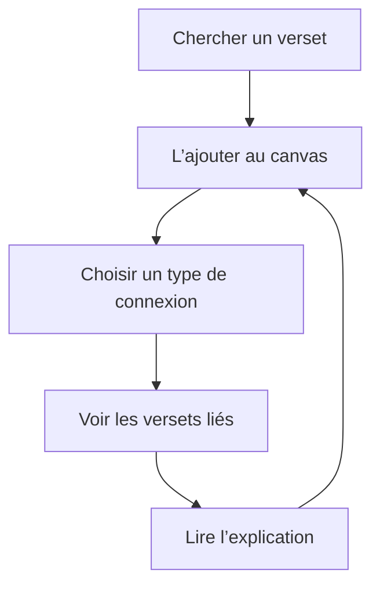
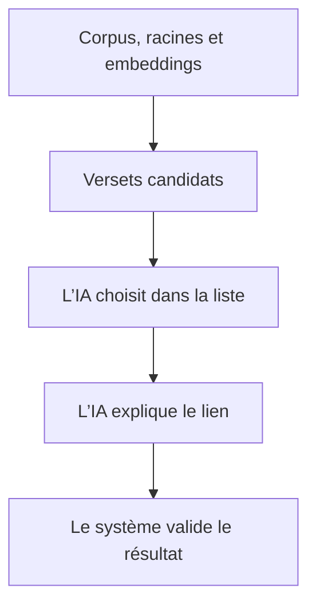

# Phase 1 — Qu’est-ce qu’OpenHikmah ?

> **Statut :** onboarding en lecture seule
>
> **Tags de preuve :**
>
> * **FACT** = l’information est visible dans le dépôt.
> * **INFERENCE** = c’est une interprétation logique.
> * **UNKNOWN** = l’information n’est pas encore vérifiée.

---

## 1. OpenHikmah en une phrase

**FACT :** OpenHikmah est un outil pour explorer les connexions entre les versets du Coran.

Vous cherchez un verset. Vous l’ajoutez à un *canvas*. Ensuite, l’application montre d’autres versets liés.

L’IA explique pourquoi les versets sont connectés.

OpenHikmah n’est donc pas un chatbot qui parle librement du Coran. Il ressemble plutôt à une carte interactive pour étudier le Coran.

---

## 2. Le parcours principal de l’utilisateur



### Lecture à voix haute — suivez le diagramme

Commencez en haut du diagramme.

D’abord, l’utilisateur cherche un verset. Suivez la première flèche vers le bas. Le verset arrive sur le canvas.

Continuez avec la flèche suivante. L’utilisateur choisit un type de connexion : un thème, une racine arabe ou un contraste.

Descendez encore. Le système montre des versets liés au premier verset.

La dernière flèche mène vers l’explication. L’utilisateur lit pourquoi les versets sont connectés.

Regardez maintenant la flèche qui retourne vers le canvas. Après avoir lu l’explication, l’utilisateur peut ajouter un autre verset et continuer son exploration.

Le parcours forme donc une boucle : chercher, ajouter, choisir, voir, comprendre, puis continuer.


### Étape 1 — Chercher un verset

**FACT :** L’utilisateur peut chercher avec :

* une référence, par exemple `2:255` ;
* un mot-clé ;
* une phrase qui décrit une idée.

Par exemple :

> gratitude pendant une période difficile

La recherche par le sens s’appelle la **recherche sémantique**.

### Étape 2 — Ajouter le verset au canvas

Le *canvas* est une grande surface de travail.

Chaque verset apparaît comme un **nœud**. Un nœud est simplement un élément placé sur le canvas.

L’utilisateur peut déplacer les nœuds et organiser son étude.

### Étape 3 — Choisir une connexion

L’utilisateur peut demander trois types de connexions :

1. un thème ;
2. une racine arabe ;
3. un contraste.

### Étape 4 — Voir les versets liés

Le système cherche des versets qui peuvent avoir une relation avec le premier verset.

Il utilise des données du Coran avant de demander une explication à l’IA.

### Étape 5 — Lire l’explication

L’IA écrit une courte raison pour expliquer la connexion.

L’utilisateur peut ensuite continuer son exploration et ajouter d’autres versets au canvas.

---

## 3. Les trois types de connexions

**FACT :** Le fichier `types/quran.ts` définit trois types principaux.

| Type dans le code | Nom simple | Signification                                                  |
| ----------------- | ---------- | -------------------------------------------------------------- |
| `thematic`        | Thème      | Deux versets parlent d’un thème théologique commun.            |
| `root`            | Racine     | Deux versets utilisent des mots avec une racine arabe commune. |
| `contrast`        | Contraste  | Deux versets présentent des idées théologiques opposées.       |

### Exemple de thème

Deux versets peuvent parler de la patience, même s’ils n’utilisent pas exactement les mêmes mots.

### Exemple de racine

Deux mots arabes peuvent venir de la même racine.

Cette racine commune peut montrer une relation linguistique entre deux versets.

### Exemple de contraste

Un verset peut parler de gratitude. Un autre peut parler d’ingratitude.

Les deux versets sont différents, mais leur opposition peut aider l’utilisateur à mieux comprendre le thème.

---

## 4. Quelle est la différence entre le graphe et le canvas ?

Cette différence est importante.

### Le graphe de connaissances

**FACT :** OpenHikmah possède un graphe de connaissances persistant dans PostgreSQL.

Le graphe indique :

* quel verset est connecté à un autre verset ;
* le type de connexion ;
* la raison de la connexion.

Le graphe représente donc les connexions enregistrées par le système.

### Le canvas

Le canvas est la vue de l’utilisateur.

Il montre :

* les versets placés comme des nœuds ;
* les connexions entre les versets ;
* la position des éléments ;
* la partie du graphe que l’utilisateur veut étudier.

**FACT :** OpenHikmah utilise `@xyflow/react` pour le canvas.

**FACT :** Un canvas peut être partagé avec une URL.

### Modèle mental simple

> Le graphe contient les connexions.
> Le canvas montre une vue de ces connexions.

Le graphe est la connaissance enregistrée. Le canvas est l’espace de travail de l’utilisateur.

---

## 5. Que signifie « IA ancrée » ?

Le dépôt utilise le mot anglais *grounded*.

Dans ce document, nous utilisons le mot **ancrée**.

Une IA ancrée reçoit des données précises avant de produire une réponse.

Dans OpenHikmah, l’IA ne doit pas chercher seule des références du Coran dans sa mémoire.

Le système utilise d’abord trois sources importantes :

1. le corpus du Coran ;
2. les racines arabes ;
3. les embeddings.

### Le corpus

Le corpus contient les versets et leurs références.

Le système l’utilise pour vérifier qu’un verset existe vraiment.

### Les racines arabes

Les données de morphologie montrent les racines des mots arabes.

Elles peuvent aider le système à trouver des versets avec une racine commune.

### Les embeddings

Un *embedding* est une représentation numérique du sens d’un texte.

Le système compare le sens de la recherche avec le sens des versets.

Cela permet de trouver un verset même quand les mots exacts sont différents.

Vous n’avez pas encore besoin de comprendre le calcul des embeddings. Pour la Phase 1, il suffit de retenir qu’ils aident le système à chercher par le sens.

---

## 6. La règle principale : les données découvrent, l’IA explique

C’est l’idée la plus importante de la Phase 1.

> **Les données découvrent. L’IA explique.**

**FACT :** `lib/ai/connection-discovery.ts` cherche des versets candidats avec les données disponibles.

**FACT :** `lib/ai/connection-generator.ts` reçoit ces candidats.

Dans le chemin ancré, l’IA peut :

* choisir des versets dans la liste des candidats ;
* écrire une raison pour chaque connexion.

Elle ne peut pas ajouter librement un autre verset.



### Lecture à voix haute — suivez le diagramme

Commencez en haut du diagramme.

La première boîte contient les sources fiables : le corpus du Coran, les racines arabes et les embeddings.

Suivez la première flèche vers le bas. Ces données permettent au système de trouver une liste de versets candidats.

Continuez vers la boîte suivante. L’IA reçoit cette liste et choisit seulement parmi les candidats autorisés.

Suivez encore la flèche. L’IA écrit une explication pour dire pourquoi les versets sont liés.

Enfin, regardez la dernière boîte. Le système valide le résultat avant de l’utiliser.

Le mouvement du diagramme montre donc une règle importante : les données passent en premier, l’IA intervient ensuite, puis le système vérifie le résultat.


Cette séparation réduit le risque d’hallucination.

Une **hallucination** arrive quand une IA produit une information fausse comme si elle était vraie.

---

## 7. Ce que l’IA peut faire

**FACT :** Pour les connexions, l’IA peut principalement :

* choisir certains versets parmi les candidats autorisés ;
* écrire la raison de la connexion ;
* traduire une raison dans une autre langue.

Une réponse technique peut contenir des données comme :

```json
{
  "ref": "2:255",
  "reason": "Explication de la connexion"
}
```

La valeur `ref` représente la référence du verset.

La valeur `reason` contient l’explication écrite par l’IA.

La référence est contrôlée. L’explication est le contenu principalement généré par l’IA.

---

## 8. Ce que l’IA ne doit pas faire

L’IA ne doit pas :

* inventer une référence du Coran ;
* choisir librement un verset qui n’est pas dans la liste des candidats du chemin ancré ;
* présenter son propre texte comme un verset ;
* changer silencieusement le cadre théologique du produit.

**FACT :** La fonction `isValidRef` vérifie le format et les limites d’une référence.

Par exemple :

* `2:255` utilise le bon format ;
* `02:255` est refusé ;
* une référence vers un ayah qui n’existe pas est refusée.

**FACT :** Le système vérifie aussi l’existence du verset dans le corpus.

**FACT :** `AGENTS.md` dit qu’un contributeur ne doit jamais :

* fabriquer une référence du Coran ;
* rendre la validation moins stricte seulement pour faire passer un test.

---

## 9. Pourquoi cette validation est-elle importante ?

**INFERENCE :** Une mauvaise référence du Coran n’est pas seulement un bug technique.

Elle peut créer un problème de confiance et d’intégrité théologique.

Un utilisateur peut penser que la connexion affichée est fiable. Le produit doit donc vérifier les références avant de les montrer.

OpenHikmah cherche quatre qualités principales :

### Des références correctes

Le verset doit exister dans le corpus.

### Une explication visible

Chaque connexion doit avoir une raison.

### Une différence claire entre le Coran et l’IA

Le texte du Coran et le texte généré ne doivent pas avoir la même apparence.

### La possibilité de vérifier le système

Les développeurs doivent pouvoir examiner les connexions et les générations enregistrées.

---

## 10. Les règles théologiques

**FACT :** `CONTRIBUTING.md` décrit OpenHikmah comme un outil de compréhension théologique du Coran.

**FACT :** `AGENTS.md` demande que les prompts et les connexions respectent le cadre **maturidite et hanafite**.

Le dépôt impose aussi un **Tanzih strict**.

Ici, le Tanzih signifie qu’il ne faut jamais suggérer que les attributs divins ont :

* une forme physique ;
* une position dans un lieu ;
* une ressemblance avec la création.

Ces règles ne sont pas seulement des préférences personnelles. Elles font partie des exigences du produit.

Un changement de prompt peut modifier les explications produites par l’IA. Un contributeur doit donc déclarer clairement les changements qui peuvent avoir un effet théologique.

---

## 11. Le texte du Coran et le texte de l’IA

**FACT :** `DESIGN.md` demande une différence visuelle claire entre :

* le texte canonique du Coran ;
* une explication écrite par l’IA.

Une explication de l’IA ressemble à une note éditoriale.

Elle ne doit jamais ressembler à un verset.

Cette règle aide l’utilisateur à comprendre immédiatement :

> Ceci est le texte du Coran.
> Ceci est une explication générée par l’IA.

---

## 12. Une comparaison avec Firestore

Voici une comparaison avec une technologie que vous connaissez déjà.

Dans Firestore, vous faites confiance à un document parce que votre application l’a créé et enregistré.

Dans OpenHikmah, vous faites confiance à une référence parce que :

1. le système l’a découverte avec des données ;
2. la validation a accepté son format ;
3. le corpus confirme que le verset existe.

Le LLM ressemble à un commentateur.

Il reçoit une liste autorisée. Il explique les éléments de cette liste, mais il ne doit pas créer librement de nouvelles références.

---

## 13. Le contexte technique minimum

**FACT :** Le `README.md` présente cette stack technique :

| Partie                    | Technologie                                   |
| ------------------------- | --------------------------------------------- |
| Application               | Next.js 16, React 19 et TypeScript strict     |
| Canvas et état            | `@xyflow/react` et Zustand                    |
| Base de données           | PostgreSQL, pgvector et Drizzle ORM           |
| Authentification          | Quran Foundation OAuth2 PKCE                  |
| Intelligence artificielle | Claude, avec Gemini comme solution de secours |
| Embeddings                | Gemini                                        |

Vous n’avez pas encore besoin de comprendre chaque technologie en détail.

Pour la Phase 1, retenez seulement ceci :

* React et Next.js construisent l’application ;
* Zustand gère l’état du canvas ;
* PostgreSQL garde les données ;
* pgvector aide à chercher par le sens ;
* Claude et Gemini produisent certaines explications ;
* le corpus et la validation protègent les références.

---

## 14. Les cinq idées à retenir

1. **OpenHikmah est une carte interactive pour étudier les connexions entre les versets.**

2. **Il existe trois types de connexions : thème, racine et contraste.**

3. **Le graphe contient les connexions enregistrées. Le canvas montre la vue de l’utilisateur.**

4. **Les données découvrent les versets candidats. L’IA choisit dans la liste et explique les connexions.**

5. **Les règles de validation et les règles théologiques font partie du fonctionnement du produit.**

---

## 15. Vocabulaire essentiel

| Mot                      | Explication simple                                                   |
| ------------------------ | -------------------------------------------------------------------- |
| **graphe**               | Un ensemble d’éléments et de connexions                              |
| **nœud**                 | Un élément du graphe ; ici, souvent un verset                        |
| **connexion**            | Un lien entre deux versets                                           |
| **canvas**               | La surface de travail où l’utilisateur organise les versets          |
| **ancré / grounded**     | Contrôlé ou soutenu par des données précises                         |
| **corpus**               | La collection de versets utilisée par le système                     |
| **morphologie**          | L’étude de la structure des mots                                     |
| **racine**               | La base commune de plusieurs mots arabes                             |
| **embedding**            | Une représentation numérique du sens                                 |
| **recherche sémantique** | Une recherche par le sens, et pas seulement par les mots exacts      |
| **déterministe**         | Produit par des données ou des règles précises                       |
| **probabiliste**         | Produit avec une estimation ; le résultat peut varier                |
| **hallucination**        | Une information fausse créée par une IA                              |
| **LLM**                  | Le modèle d’IA qui lit et produit du texte                           |
| **Tanzih**               | Le principe qui refuse toute ressemblance entre Allah et la création |

---

## 16. Fichiers importants pour vérifier cette phase

Vous n’avez pas besoin de lire tous ces fichiers maintenant. Cette liste permet seulement de retrouver les sources.

| Fichier                          | Ce qu’il montre                                            |
| -------------------------------- | ---------------------------------------------------------- |
| `README.md`                      | Le produit, ses fonctions et sa stack                      |
| `CONTRIBUTING.md`                | Le but théologique et les règles pour contribuer           |
| `AGENTS.md`                      | Les règles théologiques et les protections concernant l’IA |
| `DESIGN.md`                      | La différence visuelle entre le Coran et le texte de l’IA  |
| `types/quran.ts`                 | Les trois types de connexions                              |
| `lib/ai/connection-discovery.ts` | Comment les données trouvent les candidats                 |
| `lib/ai/connection-generator.ts` | Comment l’IA choisit et explique                           |
| `lib/quran/quran-corpus.ts`      | Comment les références sont validées                       |
| `lib/quran/semantic-search.ts`   | Comment le système cherche par le sens                     |
| `lib/ai/graph-service.ts`        | Comment les connexions du graphe sont enregistrées         |
