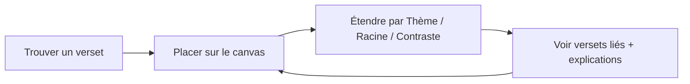
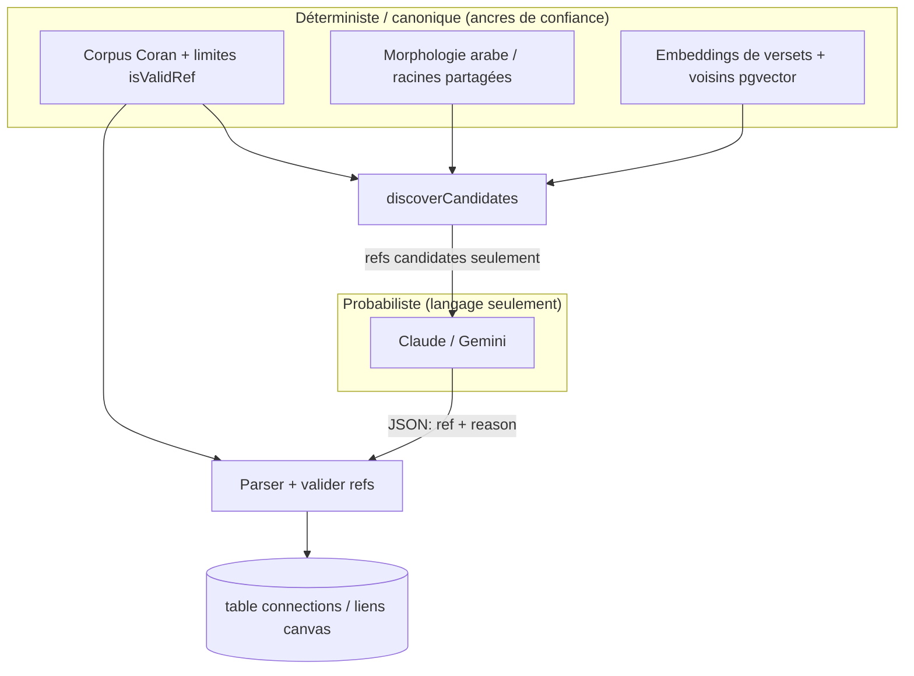

# Phase 1 — Qu'est-ce qu'OpenHikmah ?

> **Statut :** Onboarding en lecture seule · dérivé des docs et du code du dépôt  
> **Tags de preuve :** **FACT** = montré dans le dépôt · **INFERENCE** = interprétation raisonnable · **UNKNOWN** = pas encore vérifié

---

## Avant le code : une phrase

**FACT :** Open Hikmah est un graphe de connaissances du Coran *ancré dans l'IA* (*AI-grounded*) — vous cherchez un verset, vous le placez sur un *canvas* (surface de travail infinie), vous l'étendez pour voir des versets liés, et vous lisez des explications écrites par l'IA sur *pourquoi* ces liens existent.

Ce mot — **ancré** (*grounded*) — est le pari central du produit. Il touche à l'ingénierie et à la théologie.

---

## Ce qu'est OpenHikmah

**FACT :** Le README décrit Open Hikmah comme un outil pour explorer le Coran comme un **graphe connecté**. Ce n'est pas une lecture linéaire, page par page.

**FACT :** La page d'accueil (`app/page.tsx`) dit : *« Search any verse and map its connections — shared roots, themes, and contrasts — grounded in canonical Qur'an data. »*

**INFERENCE :** « Hikmah » (حكمة, sagesse) veut dire ici une connaissance structurée et exploratoire. Ce n'est pas un chatbot qui parle librement du Coran. Le produit ressemble plus à une carte d'étude interactive qu'à un assistant IA générique.

### Boucle principale (modèle mental du produit)

1. **Trouver un verset** — par référence (`2:255`), par mot-clé, ou par le sens en langue naturelle.
2. **Le placer sur le canvas** — un espace de graphe infini (`@xyflow/react`).
3. **Étendre un nœud** — choisir un *mode* de connexion (thème, racine de mot, ou contraste).
4. **Recevoir des liens ancrés** — les versets cibles viennent d'abord de données déterministes ; l'IA explique le lien.
5. **Continuer à explorer** — partager le canvas par URL, marquer des versets, se connecter pour la synchronisation.

**À COMPRENDRE MAINTENANT :** Le canvas est la surface principale pour comprendre. La recherche vous fait entrer ; le graphe est où la compréhension s'accumule.

**UTILE PLUS TARD :** Noms divins (`/names`), Récits prophétiques, séries sociales/défis, espaces de travail, lecture audio, localisation — ce sont des fonctionnalités réelles, mais pas nécessaires pour comprendre le modèle de confiance central.

**IGNORER POUR L'INSTANT :** Outils admin de remplissage (*backfill*), détails internes du cache Redis, détails PKCE OAuth.

---

## Pour qui c'est fait

**FACT :** L'accès invité est possible — vous pouvez explorer, marquer des versets localement, et utiliser le canvas sans compte (README Features).

**FACT :** Les utilisateurs connectés (via Quran Foundation OAuth2 PKCE) ont des favoris sur plusieurs appareils, des espaces de travail nommés, des fonctions sociales, et des @mentions.

**INFERENCE :** Le public visé : musulmans et étudiants du Coran qui veulent une exploration *relationnelle* — comment les versets se répondent, contrastent, ou partagent une racine linguistique — pas seulement une recherche. L'interface et les textes supposent le respect du texte sacré (voir `DESIGN.md` : les explications IA ne doivent jamais ressembler au texte coranique).

---

## Quel problème ça résout

### Lecture linéaire vs compréhension relationnelle

**INFERENCE :** La lecture traditionnelle suit l'ordre sourate/ayah. Les liens théologiques et linguistiques traversent cet ordre : la même racine arabe apparaît dans des sourates éloignées ; les thèmes reviennent ; certains ayahs contrastent d'autres (facilité/difficulté, gratitude/ingratitude).

OpenHikmah fait de ces relations entre versets des **objets navigables** — pas des choses qu'il faut déjà connaître ou chercher manuellement.

### Pourquoi la recherche par mot-clé ne suffit pas

**FACT :** L'app supporte la recherche par référence directe et par mot-clé (`README.md` Features).

**INFERENCE :** La recherche par mot-clé échoue quand :

- Vous connaissez l'*idée* mais pas les mots (« versets sur la patience dans l'épreuve »).
- Les versets liés utilisent un vocabulaire différent, relié seulement par le sens ou la morphologie arabe.
- Vous voulez des relations de *contraste*, pas de similarité.

**FACT :** La **recherche sémantique par le sens** est une fonctionnalité principale — vous décrivez un concept avec vos mots et vous trouvez des versets pertinents même sans mots communs (`README.md` Overview).

Cela nécessite des *embeddings* (vecteurs numériques qui représentent le sens) + similarité vectorielle (PostgreSQL + pgvector + *embeddings* Gemini selon README Tech Stack) — un problème de recherche différent d'une correspondance exacte. *(Mécaniques détaillées : Phase 2 et Phase 9.)*

---

## Que veut dire « sens théologique » ici

**FACT :** `CONTRIBUTING.md` appelle Open Hikmah un *« theological sensemaking tool for the Quran »* (outil de compréhension théologique du Coran).

**FACT :** `AGENTS.md` lie tous les prompts IA et les connexions à la tradition **Maturidi/Hanafi** et exige un **Tanzih strict** — ne jamais suggérer une forme physique, un lieu spatial, ou une ressemblance pour les attributs divins.

En termes produit, la compréhension théologique veut dire :

| Échec d'une « app IA Coran » ordinaire | Comportement voulu d'OpenHikmah |
| --- | --- |
| Le modèle invente une référence de verset | Les refs cibles viennent du corpus / de la découverte d'abord ; les refs sont validées |
| Le modèle présente des liens non prouvés comme des faits | Les extrémités du lien sont déterministes ; le modèle écrit la *raison* |
| Le modèle dérive vers un cadre hétérodoxe | Les prompts encodent l'école + Tanzih ; les changements exigent une divulgation |

**FACT :** `DESIGN.md` exige que le texte écrit par l'IA (raisons de connexion, réflexions) soit **visuellement distinct** du texte coranique canonique — note éditoriale avec bordure teal, jamais stylé comme un verset.

**À COMPRENDRE MAINTENANT :** Comprendre = *exploration guidée avec garde-fous*, pas génération libre de contenu religieux.

---

## Que veut dire « graphe de connaissances du Coran » ici

**FACT :** Les connexions persistées sont dans PostgreSQL (`lib/ai/graph-service.ts` — *« The persistent knowledge graph. Reads connections from Postgres… »*).

**FACT :** Trois types de liens existent (`types/quran.ts`) :

| Type | Label produit (approx.) | Ce que ça connecte |
| --- | --- | --- |
| `thematic` | Thème | Versets partageant un thème théologique |
| `root` | Racine de mot | Versets partageant une racine arabe significative |
| `contrast` | Contraste | Versets présentant des concepts théologiques opposés |

**FACT :** Chaque lien porte des métadonnées : `kind`, `label` lisible, et une chaîne `reason` générée par l'IA (`CanvasEdge.data` dans `types/quran.ts`).

### Graphe vs canvas

**INFERENCE :**

- **Graphe de connaissances (persisté) :** `(fromRef, toRef, kind, reason, locale…)` — partagé, mis en cache, auditable.
- **Canvas (session/UI) :** nœuds et liens React Flow — mise en page, sélection, état d'expansion, sérialisation pour partage — votre vue de travail du graphe.

**FACT :** Les canvas partageables se sérialisent dans une URL (`README.md` Features ; `lib/canvas/share-canvas.ts` existe).

Vous reviendrez sur cette séparation en Phase 8. Pour l'instant : **le graphe est la vérité de « quoi est connecté à quoi » ; le canvas est comment vous manipulez et partagez une vue.**

---

## Ce que le canvas infini apporte

**FACT :** Le canvas utilise `@xyflow/react` ; le style le traite comme un champ bleu marine plat où les nœuds sont séparés par bordure/surface, pas par élévation (`DESIGN.md`, README Tech Stack).

**INFERENCE :** Le canvas compte parce que les relations coraniques sont **multiples et non linéaires**. Une liste de résultats de recherche ne peut pas montrer :

- L'expansion parallèle d'un verset en trois modes (thème / racine / contraste)
- Les chemins qui se croisent (verset A → B et A → C, puis B → D)
- Le regroupement spatial que vous construisez en étudiant

**FACT :** Les couleurs des liens sont réservées sémantiquement — thème teal, racine or, contraste rouge/ton erreur (`DESIGN.md`).

---

## Racines arabes — pourquoi elles comptent (niveau produit)

**FACT :** Les connexions peuvent être ancrées dans la **morphologie canonique** — racines arabes partagées depuis les données `word_morphology` (`lib/ai/connection-discovery.ts`, README Tech Stack).

**INFERENCE :** Les mots arabes viennent de racines trilittères (ou similaires). Les versets qui partagent une racine partagent souvent un ADN conceptuel même si les traductions anglaises semblent sans lien. C'est un signal linguistique **déterministe** — pas l'intuition d'un LLM.

**FACT :** `lib/quran/arabic-morphology.ts` documente l'interactivité au niveau des mots : les entrées de morphologie relient les formes de surface aux racines pour le surlignage dans le verset.

Détails de morphologie computationnelle → **Phase 2**. Pour la Phase 1 : **les racines sont l'un des deux grands rails d'ancrage avec les embeddings.**

---

## Recherche sémantique — ce qu'elle ajoute (niveau produit)

**FACT :** `lib/quran/semantic-search.ts` décrit la recherche sémantique :

- Lit des vecteurs **précalculés** depuis `verse_embeddings` (remplis par `scripts/embed-corpus.mjs`)
- Classe par **similarité cosinus** via pgvector
- Alimente « recherche par le sens », « trouver des versets similaires », et **la récupération de candidats pour les connexions thématiques/contraste**

Exemple conceptuel simple :

> Requête utilisateur : *« gratitude quand les temps sont difficiles »*  
> **FACT :** Le système *embed* la requête (Gemini), trouve les vecteurs de versets les plus proches dans Postgres, retourne des ayahs classés.  
> **INFERENCE :** Aucun mot-clé anglais/arabe commun n'est requis entre la requête et le résultat.

Les *embeddings* sont des vecteurs de **768 dimensions** (`GEMINI_EMBEDDING_MODEL` / `.env.example`).

---

## Le rôle de l'IA — et ce qu'elle n'a PAS le droit de faire

C'est la distinction la plus importante du dépôt.

### Séparation des pouvoirs (langage officiel de l'architecture)

**FACT :** En-tête de `lib/ai/connection-discovery.ts` :

> *Candidate discovery … the "data discovers" half of the separation of powers … The AI never invents these refs; it only selects among them and explains why.*

**FACT :** En-tête de `lib/ai/connection-generator.ts` :

> *generateGroundedConnections — the preferred "AI articulates" half … Receives REAL candidate verses … asks the model only to SELECT among them and explain why. Returned refs are validated against the candidate set, so the model cannot introduce a verse that wasn't discovered.*

### Trois couches de « ce qui est autorisé sur le canvas »

| Couche | Mécanisme | Source **FACT** |
| --- | --- | --- |
| **1. Préféré (ancré)** | La découverte donne des refs candidates → l'IA choisit un sous-ensemble + écrit des raisons → les refs de sortie doivent être ∈ ensemble candidat | `generateGroundedConnections`, `allowed.has(c.ref)` |
| **2. Secours (legacy)** | Si pas de données d'ancrage, l'IA propose des refs de mémoire → chaque ref doit passer `isValidRef` + exister dans le **corpus local** via `getVerses` | `generateConnections` |
| **3. Persistance post-génération** | Les lignes canoniques anglaises sont stockées dans Postgres ; les locales non-anglaises traduisent les raisons, pas re-sélectionnent les versets | `graph-service.ts` |

**FACT :** Le chemin legacy **ne peut pas persister des refs hallucinées** — `generateConnections` hydrate depuis le corpus local seulement ; les lignes de corpus manquantes sont supprimées.

**FACT :** Le chemin ancré est plus strict — une ref absente de la liste de découverte est filtrée même si valide dans le corpus.

### Ce que le LLM a le droit de générer

**FACT :** Pour les connexions, le modèle produit du JSON comme `{ "ref": "surah:ayah", "reason": "…" }` — la **`reason`** est le contenu génératif principal ; la **`ref`** est contrainte.

**FACT :** Les prompts incluent le cadre Maturidi/Hanafi et ajoutent `TANZIH_CONSTRAINT` via `tanzihDirective()` — les admins ne peuvent pas retirer le Tanzih en modifiant les templates seuls (`connection-generator.ts` commentaires).

**FACT :** Fournisseur IA : Anthropic Claude (principal) avec secours Gemini ; *embeddings* toujours Gemini (`.env.example`, README).

### Ce que le LLM ne doit PAS faire (par conception)

| Interdit | Application |
| --- | --- |
| Inventer des références de versets (chemin ancré) | Appartenance à l'ensemble candidat |
| Inventer des références (chemin legacy) | `isValidRef` + hydratation corpus local |
| Choisir des versets du corpus sans découverte (ancré) | Prompt de sélection : *« Choose ONLY from the candidate references listed above »* |
| Dérive théologique silencieuse | Contrainte Tanzih + revue/divulgation pour changements de prompts (`AGENTS.md`) |
| Passer pour un verset | Règles de design UI (`DESIGN.md`) |

**À COMPRENDRE MAINTENANT :** **Les données découvrent ; l'IA articule.** La crédibilité du produit repose sur cet ordre.

---

## Modèle de confiance central — canonique vs généré

Utilisez ce tableau comme liste mentale par défaut en lisant une fonctionnalité :

| Préoccupation | Ancré / déterministe | Généré / probabiliste |
| --- | --- | --- |
| Ce ayah existe-t-il ? | `isValidRef`, limites de longueur de sourate, ligne corpus | — |
| Texte arabe & traduction principale | Table `verses` ; `en.sahih` (Saheeh International) | — |
| Quels versets peuvent se connecter ? | Racines partagées (`word_morphology`), voisins d'embedding (`verse_embeddings`) | — |
| Quels candidats deviennent des liens ? | Ancré : l'IA choisit dans la liste ; Legacy : l'IA propose, le corpus filtre | Choix de sélection |
| Pourquoi sont-ils connectés ? | — | `reason` générée par l'IA (forme JSON validée) |
| Texte de raison non-anglais | La ligne canonique anglaise est la source de vérité | Traduction des raisons (`translateReason`) |
| Noms divins / réflexions | Chaînes anglaises canoniques + données structurées | Réflexions IA avec prompts séparés (`app/api/names/...`) |

### Validation des références de versets (niveau élevé)

**FACT :** `lib/quran/quran-corpus.ts` — `isValidRef` vérifie :

- Format `surah:ayah` (orthographe canonique — `"02:255"` rejeté)
- Sourate 1–114, ayah dans les comptes Hafs/Uthmani par sourate (`"1:8"` rejeté)

**FACT :** `lib/quran/verse-resolver.ts` — corpus local d'abord ; requête alquran.cloud en secours ; retourne `null` si introuvable — aussi une barrière anti-hallucination.

**FACT :** `AGENTS.md` — ne jamais fabriquer de références du Coran ; ne jamais assouplir la validation pour faire passer des tests.

---

## Pourquoi cette frontière est fondamentale

**INFERENCE :** Pour un texte sacré, le coût d'une mauvaise référence d'ayah n'est pas un bug d'interface — c'est un **échec de confiance et d'intégrité théologique**. Les utilisateurs peuvent traiter les connexions affichées comme un guide savant.

Donc OpenHikmah optimise pour :

1. **Intégrité référentielle** — les ayahs sont réels et soutenus par le corpus avant d'apparaître.
2. **Explicabilité** — chaque lien a une raison énoncée (README produit : *« Every edge on the canvas links to that explanation »*).
3. **Auditabilité** — générations enregistrées dans `ai_generations` ; connexions persistées (`connection-generator.ts`, `graph-service.ts`).
4. **Révisabilité** — changements de prompts/théologie exigent une divulgation explicite du contributeur (`CONTRIBUTING.md`, référence template PR).

Comparaison avec le modèle mental Firebase/Firestore que vous connaissez peut-être :

- **Firestore :** vous faites confiance aux IDs de documents parce que *votre app les a écrits*.
- **OpenHikmah :** vous faites confiance aux cibles de liens parce que *des pipelines déterministes et la validation du corpus les ont admises* — le LLM est plus comme un commentateur limité à une liste de lecture fournie.

---

## Contexte technique (seulement ce qui façonne le produit)

**FACT (README Tech Stack) :**

| Préoccupation | Choix |
| --- | --- |
| App | Next.js **16** App Router, React 19, TypeScript strict |
| État canvas | Zustand + `@xyflow/react` |
| Base de données | PostgreSQL + pgvector + Drizzle ORM |
| Auth | Quran Foundation OAuth2 PKCE |
| IA | Claude (+ secours Gemini) ; *embeddings* Gemini |

**UNKNOWN (pour les phases suivantes) :** Les patterns exacts de Next.js 16 App Router ici vs anciennes suppositions Next — le dépôt dit de lire `node_modules/next/dist/docs/` avant de coder.

---

## Phase 1 — Ce qu'il faut retenir

### À COMPRENDRE MAINTENANT (5 points)

1. OpenHikmah est un **graphe de connaissances du Coran ancré** avec un canvas infini — pas un chatbot Coran libre.
2. **Trois modes de connexion :** thème, racine, contraste — chacun avec des rails de découverte déterministes.
3. **Séparation des pouvoirs :** morphologie + embeddings **découvrent** les versets candidats ; l'IA **sélectionne (quand ancré) et explique**.
4. **La validation est en couches :** syntaxe/limites → existence corpus → (ancré) appartenance à l'ensemble candidat.
5. **Les contraintes théologiques sont des exigences produit**, encodées dans les prompts (`TANZIH_CONSTRAINT`) et les règles contributeur (`AGENTS.md`).

### UTILE PLUS TARD

- Social, espaces de travail, audio, Noms divins, Récits prophétiques, boucle admin de remplissage.
- Cache Redis d'embeddings, limites de débit, déduplication single-flight.
- Pipeline de localisation (graphe canonique anglais, raisons traduites).

### IGNORER POUR L'INSTANT

- Détails d'implémentation du flux de tokens PKCE.
- Visite champ par champ du schéma Drizzle.
- Organisation des tests E2E.

---

## Incertitudes (lacunes honnêtes après la Phase 1)

| Sujet | Statut |
| --- | --- |
| Quelle part du corpus est pré-remplie vs récupérée en direct dans un setup dev frais | **UNKNOWN** — dépend des scripts seed/migrate (Phase 10) |
| Fréquence du chemin legacy vs ancré en production | **INFERENCE :** ancré préféré quand morphologie/embeddings existent ; legacy seulement en cas d'absence |
| Texte UX exact pour les modes d'expansion sur le canvas | **UNKNOWN** — besoin d'inspection UI (Phase 11) |
| La découverte contraste utilise-t-elle des vecteurs séparés ou les mêmes voisins que le thème | **FACT :** mêmes voisins sémantiques ; l'IA sélectionne les opposés (`connection-discovery.ts` commentaire) |

---

## Et ensuite

**Phase 2 — Introduction au domaine :** modèle sourate/ayah, tables de morphologie, requêtes embeddings/pgvector, persistance graphe vs canvas — chaque point lié à des fichiers concrets.

**Phase 3 — Frontières théologiques et données sacrées :** carte complète où vivent les contraintes (tests, prompts, règles de revue).

Quand vous êtes prêt, dites **« continue vers la Phase 2 »** ou posez des questions sur la Phase 1.

> **Version complète (français B2+) :** [Phase 1](../onboarding-fr/phase-1-what-is-openhikmah.md)

---

## Sources clés du dépôt pour cette phase

| Source | Rôle |
| --- | --- |
| `README.md` | Présentation produit, fonctionnalités, stack |
| `CONTRIBUTING.md` | « Outil de compréhension théologique » ; attentes contributeur |
| `AGENTS.md` | Standards théologiques, attribution IA |
| `DESIGN.md` | Présentation texte sacré vs texte IA |
| `lib/ai/connection-discovery.ts` | « Les données découvrent » |
| `lib/ai/connection-generator.ts` | « L'IA articule » ; validation |
| `lib/ai/graph-service.ts` | Graphe persistant + génération sur cache miss |
| `lib/quran/quran-corpus.ts` | `isValidRef`, corpus local |
| `lib/quran/semantic-search.ts` | Rôle de la récupération sémantique |
| `types/quran.ts` | Types de liens, types canvas |
