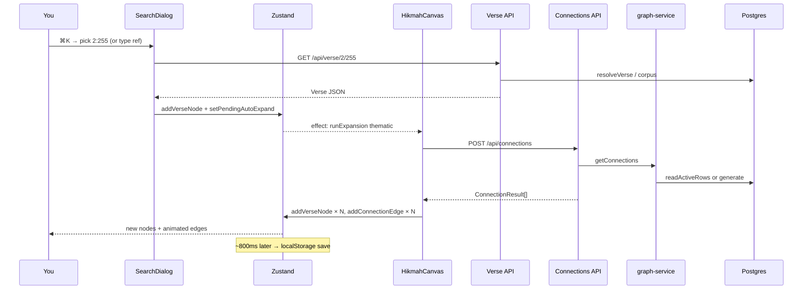

# Phase 11 — Corrélation navigateur ↔ code

> **Prérequis :** Phases [1](../onboarding-fr/phase-1-what-is-openhikmah.md)–[10](./phase-10-run-locally.md) — **app en marche en local** (`bun run dev`, Postgres chargé, clés IA définies)  
> **Étiquettes de preuve :** **FACT** · **INFERENCE** · **UNKNOWN**

Les phases 6–10 ont suivi les flux **depuis le code source**. La phase 11 boucle la boucle : **faire un flux dans le navigateur** et relier les preuves DevTools aux symboles que vous connaissez déjà.

**Cette phase est en lecture seule** — vous observez le comportement runtime ; vous ne changez pas le code. (La phase 12 est la première expérience contrôlée, et elle demande votre approbation explicite.)

---

## Ce que vous allez faire

Un exercice de bout en bout : **chercher un verset → arriver sur le canvas → expand thématique auto → voir de nouveaux nœuds et arêtes.**

Ce parcours touche :

- Composants React
- Mutations Zustand (gestion d'état client)
- Trois routes API
- Cache miss ou hit Postgres
- Appel IA externe optionnel
- Autosave localStorage

Une **trace bonus** plus courte pour la recherche par mot-clé est à la fin.

---

## Configuration DevTools (avant de cliquer)

1. Ouvrez [http://localhost:3000/canvas](http://localhost:3000/canvas) dans Chrome ou Edge.
2. Ouvrez les outils de développement (F12).
3. Configurez les panneaux comme ci-dessous.

| Panneau | Réglage | Pourquoi |
| --- | --- | --- |
| **Network** | ✅ Preserve log | La navigation/fermeture du dialogue ne supprime pas les requêtes |
| **Network** | Filtre : `Fetch/XHR` | Cache les assets statiques |
| **Network** | Optionnel : Disable cache | Voir des réponses API fraîches en itérant |
| **Application → Local Storage** | Clé `open-hikmah-canvas` | Vérifier l'autosave canvas (phase 8) |
| **Console** | Laisser ouvert | Les échecs d'expand loguent ici |

**FACT:** OpenHikmah n'a pas de middleware Zustand DevTools dans `store/canvas.ts` — vous inférez l'état client depuis le **comportement UI**, **Network** et **localStorage**, pas un panneau time-travel style Redux.

**INFERENCE:** React DevTools (onglet Components) aide à localiser `VerseNode` / `HikmahCanvas`, mais le chemin de corrélation onboarding ci-dessous n'en a pas besoin.

Gardez le **terminal qui tourne `bun run dev`** visible — les erreurs serveur apparaissent là quand le navigateur montre seulement un toast.

---

## Le flux tracé (vue d'ensemble)



---

## Corrélation pas à pas

Pour chaque étape : **ce que vous faites**, **ce que Network montre**, **quel code tourne**, **ce qui change dans l'UI**.

### Étape 1 — Ouvrir la recherche

| | |
| --- | --- |
| **Vous** | Appuyez sur **⌘K** (ou cliquez Search sur canvas vide) |
| **Composant** | Gestionnaire clavier `CanvasPageClient` → `SearchDialog` |
| **Network** | En général rien encore |
| **Code** | `app/canvas/CanvasPageClient.tsx` — `setSearchOpen(true)` |

---

### Étape 2 — Sélectionner le verset `2:255`

| | |
| --- | --- |
| **Vous** | Tapez `2:255` ou choisissez un résultat seed (ex. Ayat al-Kursi) |
| **Network** | `GET /api/verse/2/255` — **200** |
| **Client** | `SearchDialog.loadSeedVerse` ou `selectResult` → `fetch(/api/verse/...)` |
| **Serveur** | `app/api/verse/[surah]/[ayah]/route.ts` |

**Inspectez le corps de réponse** — doit correspondre à `Verse` (`types/quran.ts`) :

```json
{
  "surah": 2,
  "ayah": 255,
  "ref": "2:255",
  "arabicText": "…",
  "translation": "…",
  "surahName": "Al-Baqarah",
  "surahNameArabic": "…"
}
```

**Chemin serveur :**

```text
isValidRef("2:255")
→ getQuranEdition()     // cookie oh_edition or locale default
→ resolveVerse(ref)     // lib/quran/verse-resolver.ts
   → getVerse from Postgres verses table
   → or live alquran.cloud fallback if corpus miss
```

**Cookies à noter** (Request headers → Cookie) :

| Cookie | Rôle |
| --- | --- |
| `oh_locale` | UI + locale des raisons de connexion (`getUiLocale`) |
| `oh_edition` | Édition de traduction pour l'affichage (`getQuranEdition`) |

**FACT:** La route verset définit `dynamic = "force-dynamic"` car le cookie édition varie la réponse.

---

### Étape 3 — Le nœud apparaît sur le canvas

| | |
| --- | --- |
| **Network** | Le dialogue de recherche peut se fermer ; pas de nouvelle requête |
| **Client** | `SearchDialog.mapConnections(verse)` |
| **Zustand** | `addVerseNode({ ...verse, isRoot: true }, position)` |
| **Zustand** | `setPendingAutoExpand(nodeId)` — **premier nœud seulement** |
| **UI** | Une carte verset au centre (ou slot libre) ; animation pulse |

**Chemin code :**

```text
store/canvas.ts → addVerseNode
  → nextId() → node-N
  → setNewlyAddedNode(id)

SearchDialog.mapConnections:
  isFirst → position {0,0}
  → setPendingAutoExpand(nodeId)
```

**React Flow :** `HikmahCanvas` re-rend avec `nodes.length === 1` ; la toolbar apparaît.

---

### Étape 4 — Expand thématique auto (sans clic supplémentaire)

| | |
| --- | --- |
| **Vous** | Attendez ~1s — spinner sur le nœud |
| **Network** | `POST /api/connections` — peut prendre **plusieurs secondes** au premier miss |
| **Client** | Effet `HikmahCanvas` sur `pendingAutoExpand` → `runExpansion(..., kind: "thematic")` |
| **UI** | `expandingNodeId` défini → loader sur `VerseNode` |

**Inspectez le corps de la requête POST :**

```json
{
  "fromRef": "2:255",
  "kind": "thematic",
  "arabicText": "…",
  "translation": "…",
  "excludeRefs": []
}
```

**FACT:** Le premier expand envoie `excludeRefs` **vide**. « Get more » envoie les refs des arêtes enfants existantes du même kind (phase 8).

---

### Étape 5 — Le serveur gère les connexions

| | |
| --- | --- |
| **Route** | `app/api/connections/route.ts` |
| **Bibliothèque** | `getConnections` → `lib/ai/graph-service.ts` |

**Terminal (dev server) en cache miss :** vous pouvez voir la latence IA ; en **502** vous verrez :

```text
Connections route: unparseable AI response: ...
```

**Inspection réponse — succès (200) :**

JSON **tableau** de 1–3 objets :

```json
[
  {
    "surah": 3,
    "ayah": 18,
    "ref": "3:18",
    "arabicText": "…",
    "translation": "…",
    "surahName": "…",
    "surahNameArabic": "…",
    "reason": "One sentence…",
    "kind": "thematic"
  }
]
```

**Mapper statut → signification :**

| Statut | Corps | Branche code | UI |
| --- | --- | --- | --- |
| **200** | `[...]` length ≥ 1 | Normal | Nouveaux nœuds apparaissent en cascade |
| **200** | `[]` | Génération vide | Toast d'erreur — « no connections » |
| **429** | `{ "error": "Too many requests…" }` | `RateLimitError` | Toast d'erreur |
| **502** | `{ "error": "Connection generation failed…" }` | `ConnectionParseError` | Toast d'erreur — réessayer |
| **400** | `{ "error": "…" }` | Validation | Toast d'erreur |

**FACT:** Tableau vide **200** ≠ **502** — distinction phase 7. La colonne statut de l'onglet Network est la première vérification.

**Chemin serveur miss (corréler avec le timing terminal) :**

```text
readActiveRows → miss
→ discoverCandidates (pgvector or morphology)
→ generateGroundedConnections (Claude/Gemini)
→ INSERT connections
→ hydrate → JSON array
```

**Chemin serveur hit (second utilisateur, ou vous expandez la même cellule après cache chaud) :**

```text
readActiveRows → rows found
→ hydrate → JSON array   (fast — no AI latency)
```

**INFERENCE:** Premier expand sur DB froide : POST **multi-secondes**. Répéter le même `(2:255, thematic, locale)` avec le même exclude vide : **millisecondes**.

---

### Étape 6 — Le canvas se met à jour depuis la réponse

| | |
| --- | --- |
| **Network** | POST terminé |
| **Client** | Boucle `HikmahCanvas.runExpansion` |
| **Zustand** | Par connexion : `addVerseNode` + `addConnectionEdge` |
| **UI** | Jusqu'à 3 nœuds en éventail ; arêtes colorées ; animation `fitView` |

**Logique client par connexion :**

```text
if hasNode(conn.ref) → edge only to existing node
else → radialPos + findFreeSlot → addVerseNode(conn, pos)
buildConnectionEdge(sourceId, targetId, conn)
addConnectionEdge(edge)
await 350ms between each
```

**Clic arête (optionnel) :** cliquez le label d'arête → `setSidebarContent({ type: "edge", reason, ... })` → `ContextSidebar`.

---

### Étape 7 — Persistance (après ~800ms)

| | |
| --- | --- |
| **Network** | Pas de requête — client seulement |
| **Onglet Application** | `localStorage["open-hikmah-canvas"]` se met à jour |
| **Code** | `useCanvasPersistence` save debounced → `serializeCanvas` |

**Inspectez la forme JSON sauvegardée :**

```json
{
  "v": 1,
  "nodes": [{ "id": "node-1", "x": 0, "y": 0, "verse": { "ref": "2:255", ... } }],
  "edges": [{ "id": "edge-node-1-node-2", "source": "node-1", "target": "node-2", "kind": "thematic", "label": "…", "reason": "…" }]
}
```

**Rafraîchissez la page** — le canvas se restaure depuis localStorage (sauf si `?share=` a pris le dessus au mount).

---

## Expand manuel (même corrélation, une différence)

Au lieu de l'auto-expand depuis la recherche :

1. Cliquez **+** sur un nœud → **Theme** / **Root** / **Contrast**
2. `VerseNode.handleExpandSelect` → `setPendingExpand({ nodeId, ref, kind })`
3. Même `POST /api/connections` — mais `kind` correspond à votre choix menu

**Différence serveur Root vs thematic** (invisible dans Network — même URL) :

| Kind | Découverte |
| --- | --- |
| `thematic` | `semanticCandidates` → pgvector |
| `root` | `rootCandidates` → SQL `word_morphology` |
| `contrast` | même pool que thematic ; l'IA choisit les opposés |

Comparez les corps POST : seuls `kind` et `excludeRefs` changent.

---

## Trace bonus — recherche par mot-clé (plus courte)

| Étape | Network | Code |
| --- | --- | --- |
| ⌘K → tapez `mercy` | `GET /api/search?q=mercy` | `app/api/search/route.ts` |
| Réponse | `{ results, total, page, related? }` | `keywordSearch` + `relatedByMeaning` en parallèle |
| Sélectionner un hit | `GET /api/verse/{s}/{a}` | Même qu'étape 2 ci-dessus |

**FACT:** Les hits mot-clé viennent de **quran.com** ; l'arabe/traduction affiché est hydraté depuis le **corpus local** dans la route.

**FACT:** Le tableau `related` (sémantique) seulement sur la **page 1** ; les échecs sont **omis**, pas en erreur — vous pouvez voir des résultats mot-clé sans section « related » si embeddings manquants ou rate limit atteint.

---

## Aide-mémoire corrélation (à garder en tête)

| Requête Network | Fichier route | Bibliothèque principale |
| --- | --- | --- |
| `GET /api/verse/2/255` | `app/api/verse/[surah]/[ayah]/route.ts` | `resolveVerse`, `quran-corpus` |
| `POST /api/connections` | `app/api/connections/route.ts` | `graph-service`, `connection-discovery`, `connection-generator` |
| `GET /api/search?q=` | `app/api/search/route.ts` | quran.com + `semantic-search` |
| `GET /api/verse/2/255/similar` | `app/api/verse/.../similar/route.ts` | `similarVerses` |
| `POST /api/share` | `app/api/share/route.ts` | table `shared_canvases` |

| Symptôme UI | Vérifier Network d'abord | Puis terminal serveur |
| --- | --- | --- |
| Spinner infini | POST bloqué pending | DB down ? IA bloquée ? |
| Toast d'erreur sur expand | Statut POST 502/429/500 | Log parse error / rate limit |
| Canvas vide après refresh | (pas de network) | Application → localStorage vide ? |
| Lien partage échoue | POST /api/share 413/400 | Canvas trop gros / nœuds invalides |

---

## Quand le runtime ne correspond pas au doc

**Ne supposez pas que le code est faux en premier.** Suivez cette checklist :

1. **Postgres chargé ?** Corpus non chargé → fetch fallback ; embeddings non chargés → sémantique/expand legacy vide.
2. **Cache hit ?** Second expand identique est rapide sans IA — pas un bug.
3. **Cookies** — `oh_locale` change la langue des raisons de connexion au miss.
4. **Rate limit** — 429 après beaucoup d'expands/recherches ; attendre ou redémarrer dev (table `rate_limits` Postgres en dev).
5. **Comparez terminal + statut Network** — le toast navigateur seul est ambigu.

**FACT:** `/api/health` qui retourne OK **ne prouve pas** la connectivité base de données — corrélez toujours avec une route liée à la DB comme `/api/verse/2/255` ou `POST /api/connections`.

---

## Optionnel : vérifications React DevTools

Si vous installez React DevTools :

| Composant | Prop/état à noter |
| --- | --- |
| `HikmahCanvas` / `CanvasInner` | Reçoit `nodes`, `edges` depuis les sélecteurs Zustand |
| `VerseNode` | `data.ref`, `isExpanding` quand `expandingNodeId === id` |
| `SearchDialog` | `query`, `searchResults` locaux — pas dans Zustand |

L'état Zustand vit hors props React — **Network + localStorage** restent les sources de debug pratiques.

---

## Exercice (à faire une fois)

Avec DevTools Network ouvert (Preserve log) :

1. Videz le canvas (toolbar Clear → confirmer).
2. ⌘K → ajoutez **2:255**.
3. Notez : statut GET verset, statut POST connections + durée + longueur réponse.
4. Expand **Root** manuellement sur le même nœud.
5. Notez le second POST — regardez `excludeRefs` dans la requête (peut être vide si le premier expand a échoué).
6. Rafraîchissez la page — confirmez que le canvas se restaure depuis localStorage.
7. Écrivez une phrase : **quelle étape était la plus lente, et quel chemin code l'explique.**

Résultats honnêtes attendus :

| Votre setup | Étape la plus lente probable |
| --- | --- |
| DB froide, premier thematic | POST `/api/connections` — IA + pgvector + persist |
| Cache chaud | POST arrive mais **<100ms** — cache hit |
| `GEMINI_API_KEY` manquant / pas d'embed | Thematic peut fallback ou retourner vide — corréler avec matrice phase 10 |

---

## À COMPRENDRE MAINTENANT

1. **Une action utilisateur → requêtes Network ordonnées** — apprenez à lire la cascade, pas des routes isolées.
2. **Le corps `POST /api/connections`** porte le texte du verset source + `excludeRefs` — le serveur ne re-fetch pas la source depuis la DB pour le prompt.
3. **200 + `[]` vs 502** — sémantiques d'échec différentes ; lisez le statut avant la forme du corps.
4. **L'état client se commit après le retour JSON** — `addVerseNode` / `addConnectionEdge` ; React Flow est une vue.
5. **localStorage se met à jour sans network** — debounced après mutations du graphe.
6. **Terminal + Network ensemble** — les toasts sont des résumés ; les preuves sont les codes statut et les logs serveur.

---

## UTILE PLUS TARD

- Filtrer Network par `connections` en cliquant **Get more** — regardez `excludeRefs` grandir.
- `POST /api/share` après construire un graphe — corréler avec le flux partage phase 8.
- Onglet Performance : le décalage d'expand (`350ms` × N) est une animation client intentionnelle.
- Cursor browser MCP / Playwright — même corrélation, automatisable (CI utilise `e2e/canvas.spec.ts`).

---

## IGNORER POUR L'INSTANT

- Cache Service Worker / PWA — pas central pour cette app.
- Onglets payload RSC Next.js pour `/canvas` client-heavy — le trafic intéressant est `Fetch/XHR`.
- WebSocket — le canvas OpenHikmah n'en utilise pas pour l'expand.

---

## Questions de contrôle — Phase 11

1. Après sélection d'un résultat de recherche, quelles deux actions Zustand partent pour le **premier** nœud sur un canvas vide ?
2. Quels quatre champs envoie `POST /api/connections`, et d'où vient `excludeRefs` ?
3. Comment distinguer un échec de parse IA d'un résultat vide valide dans DevTools ?
4. Où atterrit le snapshot canvas après expand, et combien de temps après le dernier ajout de nœud ?
5. Pourquoi le second expand thématique identique peut être beaucoup plus rapide que le premier ?

---

**Suite :** [Phase 12 — Une expérience contrôlée](./phase-12-controlled-experiment.md) — un petit changement réversible avec votre approbation (pas territoire théologique/auth/migration).

Dites **« continuer vers la Phase 12 »** après avoir fait l'exercice ci-dessus, ou collez un HAR Network / code statut si quelque chose ne correspond pas à ce doc — on débogue depuis les preuves.

> **Version complète (français B2+) :** [Phase 11](../onboarding-fr/phase-11-browser-code-correlation.md)
