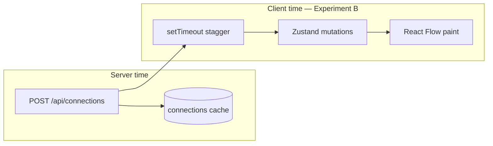

# Phase 12 — Une expérience locale contrôlée

> **Prérequis :** Phases [1](../onboarding-fr/phase-1-what-is-openhikmah.md)–[11](./phase-11-browser-code-correlation.md) — app en marche en local ; exercice phase 11 fait (ou tenté)  
> **Étiquettes de preuve :** **FACT** · **INFERENCE** · **UNKNOWN**

La phase 11 était **observer seulement**. La phase 12 est votre première **modification contrôlée** — petite, réversible, et choisie pour renforcer quelque chose que vous avez déjà tracé dans le code.

**Rien dans cette phase ne tourne automatiquement.** L'expérience A ne change pas le code. L'expérience B demande **votre approbation explicite** avant toute modification de fichier.

---

## Règles pour les expériences phase 12

D'après la spec onboarding originale — toujours valable :

| Autorisé | Pas autorisé (pour l'instant) |
| --- | --- |
| Timing / présentation UI sans danger | Prompts théologiques |
| Observer le runtime sans changer le code | Texte du Coran ou fixtures arabes |
| Diff un fichier, quelques lignes | Garde-fous de validation |
| Revenir en arrière après vérification | Flux auth / PKCE |
| | Migrations base de données |

Après toute expérience code : **vérifier → revenir → confirmer git status propre** sauf si vous demandez explicitement de garder le changement.

---

## Expérience A — Cache miss vs hit (lecture seule, pas d'approbation)

**But :** Prouver phase 7/11 en runtime — le premier expand paie le coût IA/DB ; le second expand identique est une lecture cache rapide.

### Hypothèse

**INFERENCE:** Le premier `POST /api/connections` pour `(2:255, thematic, en, excludeRefs=[])` prendra **des secondes** sur une cellule froide ; une seconde requête identique (après vider le canvas mais même DB serveur) finira en **millisecondes**.

### Chemin d'exécution

```text
Browser: SearchDialog → addVerseNode(2:255) → runExpansion(thematic)
  → POST /api/connections
Server: getConnections → readActiveRows (miss) → discoverCandidates → AI → INSERT connections
  → JSON response

Repeat (same verse, same kind, empty excludeRefs):
  → readActiveRows (hit) → hydrate → JSON response
```

### Procédure

1. Ouvrez DevTools → Network → Preserve log, filtrez Fetch/XHR.
2. Vérifiez que Postgres a le corpus + embeddings chargés (phase 10).
3. Videz le canvas (toolbar Clear, confirmer).
4. Ajoutez **2:255** (⌘K) — attendez l'expand thématique auto.
5. Notez le **POST `/api/connections`** : statut, colonne **Time** (ms), longueur du tableau réponse.
6. Videz le canvas à nouveau (nœuds partis ; **les lignes Postgres `connections` restent**).
7. Ajoutez **2:255** encore — expand auto encore.
8. Notez le timing du second POST.

### Résultat prévu

| Requête | Temps (ordre de grandeur) | Chemin serveur |
| --- | --- | --- |
| Première | 2–30+ secondes (IA + découverte embed) | Cache **miss** |
| Seconde | <500 ms typique | Cache **hit** |

### Ce qu'il faut noter

Une phrase qui répond : *Le second POST a-t-il manqué la latence IA multi-secondes même si l'UI avait l'air identique ?*

Si les timings sont **similaires les deux fois**, investiguez avant de blâmer le code :

- La cellule `(fromRef, kind, locale)` n'a peut-être pas persisté (vérifiez le terminal pour `gen_persist_failed`).
- La première requête a retourné `[]` ou 502 — pas de lignes en cache.
- Rate limit ou erreur provider sur le premier appel.

**Pas de changement git.** Passez à l'approbation expérience B seulement si vous voulez un exercice de mutation code.

---

## Expérience B — Ralentir le décalage d'expand (changement code, approbation requise)

**But :** Prouver phase 11 étape 6 — **le timing d'animation client est du code local**, pas l'API. Changer une constante `setTimeout` ralentit visiblement l'apparition des nœuds après que le POST est déjà revenu.

### Hypothèse

**INFERENCE:** Augmenter le délai par nœud dans `HikmahCanvas.runExpansion` de **350ms** à **900ms** rendra les nœuds ~1,6s plus lents **par nœud** après la fin de la requête réseau, **sans changement** au payload API ni au comportement serveur.

### Chemin d'exécution

```text
POST /api/connections completes (unchanged)
  → runExpansion loop:
       for each connection:
         await setTimeout(900)   // was 350
         addVerseNode / addConnectionEdge
  → React Flow re-render
```

**Où :** `components/canvas/HikmahCanvas.tsx` — dans `runExpansion`, la boucle sur `connections` :

```typescript
await new Promise<void>((resolve) => setTimeout(resolve, 350));
```

### Changement exact (si approuvé)

**Une ligne** dans `components/canvas/HikmahCanvas.tsx` :

```diff
- await new Promise<void>((resolve) => setTimeout(resolve, 350));
+ await new Promise<void>((resolve) => setTimeout(resolve, 900));
```

Pas d'autres fichiers. Pas de commit sauf si vous demandez plus tard.

### Résultat prévu

| Observation | Avant (350ms) | Après (900ms) |
| --- | --- | --- |
| 3 nouveaux nœuds | ~1s décalage après POST | ~2,7s décalage après POST |
| Durée POST Network | Inchangée | Inchangée |
| JSON réponse | Inchangé | Inchangé |

Vous devriez voir : **Network finit vite** (surtout en cache hit), puis les nœuds apparaissent encore lentement — découplage confirmé.

### Comment vérifier

1. Appliquez le diff (après approbation).
2. Sauvegardez le fichier — hot reload Next.js.
3. Videz le canvas.
4. Expandez un verset qui retourne **3** connexions (ex. **2:255** thematic sur DB chargée).
5. Observez : le POST se termine dans Network **avant** que tous les nœuds soient visibles.
6. Comparez avec le comportement avant changement (ou enregistrement écran / chronomètre).

### Revenir en arrière

```diff
- await new Promise<void>((resolve) => setTimeout(resolve, 900));
+ await new Promise<void>((resolve) => setTimeout(resolve, 350));
```

Ou :

```bash
git checkout -- components/canvas/HikmahCanvas.tsx
```

Confirmez : `git status` propre (ou seulement votre travail non lié).

---

## Point de contrôle approbation (Expérience B)

**N'appliquez pas l'expérience B avant de répondre avec approbation.**

Répondez avec l'un de :

| Réponse | Signification |
| --- | --- |
| **« Approve Experiment B »** | L'agent peut appliquer le changement d'une ligne, vous re-testez dans le navigateur, puis on revient ensemble |
| **« Experiment A only »** | Rester en lecture seule ; passer à la phase 13 |
| **« Propose a different experiment »** | Dites ce que vous voulez apprendre (doit rester dans le territoire autorisé) |

**UNKNOWN jusqu'à ce que vous le fassiez :** Si votre cache local est déjà chaud pour que le POST soit rapide — le changement de décalage reste visible dans tous les cas.

---

## Expérience C optionnelle — Debounce persistance (alternative si B semble trop subtil)

Seulement si vous refusez B — mêmes règles d'approbation.

| | |
| --- | --- |
| **Hypothèse** | Un debounce autosave plus long retarde la mise à jour `localStorage` après expand |
| **Fichier** | `hooks/useCanvasPersistence.ts` — `800` → `3000` dans le `setTimeout` debounce |
| **Vérifier** | Expand → refresh dans 1s → canvas peut **ne pas** se restaurer ; attendre 4s → refresh → se restaure |
| **Risque** | Un peu plus élevé — affecte l'UX persistance, pas seulement l'animation |
| **Revert** | Remettre `800` |

L'expérience B est **recommandée** — retour visuel plus clair, rayon d'impact plus petit.

---

## Ce que vous apprenez de la phase 12



| Leçon | Expérience |
| --- | --- |
| Le cache graphe Postgres amortit le coût IA | **A** — timing POST |
| Animation UI ≠ latence serveur | **B** — constante stagger |
| L'onboarding peut faire confiance aux traces code quand le runtime correspond | **A + B** |

---

## À COMPRENDRE MAINTENANT

1. **L'expérience A** ne demande pas d'approbation — faites-la quand l'app tourne.
2. **L'expérience B** est une ligne, un fichier, entièrement réversible — mais demande encore votre **oui**.
3. **Ne commencez jamais** des edits style phase 12 sur prompts, validation versets, auth ou migrations — zones à haut risque (phase 16).
4. **Revenir en arrière fait partie de l'expérience**, pas un nettoyage optionnel — sauf si vous choisissez de garder le changement pour une vraie PR (qui aurait besoin de tests et justification de scope).

---

## UTILE PLUS TARD

- Répéter l'expérience A après `TRUNCATE connections` dans Postgres local — restaure le comportement miss-path pour déboguer.
- Utiliser le même protocole pour votre **première vraie contribution** — hypothèse, chemin, prédire, diff, vérifier.

---

## IGNORER POUR L'INSTANT

- Committer l'expérience B — pas un changement digne de PR à lui seul.
- Ajouter des traces `console.log` — préférer l'onglet Network + changements de constantes ciblés selon le style du dépôt.

---

## Questions de contrôle — Phase 12

1. Pourquoi le second expand de l'expérience A reste rapide même après vider le canvas ?
2. Quelle ligne unique changerait l'expérience B, et pourquoi ça n'affecte pas l'API ?
3. Que vérifieriez-vous si les timings du premier et second POST sont tous les deux lents ?
4. Quelle est la commande revert pour l'expérience B ?

---

**Suite :** [Phase 13 — Modèle mental des tests](../onboarding-fr/phase-13-testing-mental-model.md) — unit vs integration vs e2e et ce que chacun prouve dans ce dépôt.

**À vous :** Lancez **l'expérience A** maintenant et notez les timings, puis répondez **« Approve Experiment B »** si vous voulez le changement stagger d'une ligne appliqué, ou **« continuer vers la Phase 13 »** pour rester en lecture seule.

> **Version complète (français B2+) :** [Phase 12](../onboarding-fr/phase-12-controlled-experiment.md)
