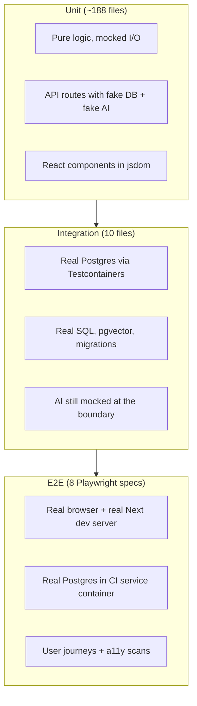
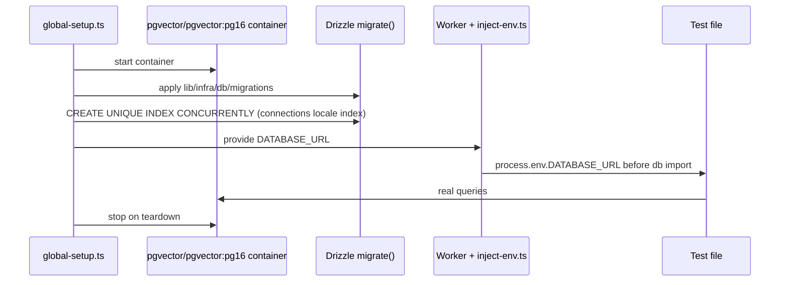

# Phase 13 — Modèle mental des tests

> **Prérequis :** Phases [1](./phase-1-what-is-openhikmah.md)–[12](./phase-12-controlled-experiment.md) — setup local (Phase 10) ; chemin expand Phase 7/11/12 compris  
> **Balises de preuve :** **FACT** · **INFERENCE** · **UNKNOWN**

Les Phases 6–12 ont suivi le **comportement à l'exécution** (runtime). La Phase 13 explique comment ce dépôt **prouve** que ce comportement reste correct. Certains échecs ici sont **théologiques**, pas seulement des bugs.

**Cette phase est en lecture seule.** Vous lancez les tests existants. Vous n'ajoutez pas de code de test pour l'instant.

---

## Pourquoi les tests sont différents ici

La plupart des apps web utilisent les tests pour l'UX et la logique métier. Open Hikmah ajoute une **deuxième barre** :

| Type d'échec | Exemple | Pourquoi c'est important |
| --- | --- | --- |
| **Fonctionnel** | Le POST expand renvoie 500 | La fonction est cassée |
| **Théologique / intégrité des données** | L'IA renvoie `99:99` et c'est sauvé en base | Violation des données sacrées |
| **Affaiblissement des garde-fous** | Assouplir `isValidRef` pour faire passer un test | Pire qu'un bug — on cache un problème de confiance |

**FACT:** `AGENTS.md` interdit d'assouplir la validation théologique ou des références de versets pour faire passer les tests. Corrigez les **données** ou le **prompt** à la place.

**INFERENCE:** Quand vous contribuez, un CI vert n'est **pas suffisant**. Les reviewers demanderont si votre changement de test **renforce** ou **affaiblit** le modèle de confiance de la Phase 7.

---

## Trois couches — ce que chacune prouve



| Couche | Commande | Environnement | Prouve | Ne prouve **pas** |
| --- | --- | --- | --- | --- |
| **Unit** (unitaire) | `bun run test` / `bun run test:ci` | jsdom (composants) ou node ; **pas de Docker** | Parsing, validation, orchestration, état UI avec mocks (simulations) | Vrais plans SQL, vrai classement pgvector, layout navigateur complet |
| **Integration** (intégration) | `bun run test:integration` | Node + **Docker** (Testcontainers) | Persistance, SQL discovery, cache miss/hit sur le vrai schéma | UI finale, OAuth, qualité IA en production |
| **E2E** (bout en bout) | `bun run test:e2e` | Chromium + `next dev` sur le port **3100** | Les chemins importants marchent ensemble ; grosses violations a11y (accessibilité) bloquées | Tous les cas admin, toutes les variantes de prompt IA |

**FACT:** La config unit **exclut** `__tests__/integration/**` et `e2e/**` (`vitest.config.ts`). L'intégration a une config séparée (`vitest.integration.config.ts`).

---

## Où sont les tests

**FACT:** Les tests unitaires copient la structure source sous `__tests__/` :

```text
lib/ai/graph-service.ts          → __tests__/lib/ai/graph-service.test.ts
app/api/connections/route.ts     → __tests__/api/connections.test.ts
components/canvas/HikmahCanvas.tsx → __tests__/components/canvas/HikmahCanvas*.test.tsx
store/canvas.ts                  → __tests__/store/canvas.test.ts
```

Les tests d'intégration ne sont **pas** un fichier par fichier source. Ils sont groupés par **comportement de persistance** :

| Fichier | Ce qu'il teste |
| --- | --- |
| `graph.integration.test.ts` | `getConnections` miss → mock IA → INSERT → hit (cache Phase 7/12) |
| `connection-discovery.integration.test.ts` | Classement des racines de `discoverCandidates` sur `word_morphology` réel |
| `semantic-search.integration.test.ts` | Classement cosinus pgvector avec `embed()` mocké |
| `connection-batch.integration.test.ts` | Persistance batch admin |
| `job-runner-lock.integration.test.ts` | Verrou de job entre processus |
| `name-content-locale.integration.test.ts` | Contenu de noms par locale |
| `root-concordance.integration.test.ts` | SQL concordance |
| `story-flags.integration.test.ts` | Flags de visibilité des stories en base |
| `user-tz-offset.integration.test.ts` | Persistance du décalage timezone |
| `verse-translations.integration.test.ts` | Stockage des traductions |

Les specs E2E sont dans `e2e/*.spec.ts` — un sujet par fichier (`canvas`, `search`, `social`, `admin`, `stories`, `settings`, `a11y`, `mobile-nav-overlap`).

---

## Commandes à lancer vraiment

À la racine du dépôt (après `bun install`) :

```bash
# Tests unitaires interactifs (watch) — usage quotidien
bun run test

# Un seul run — comme le hook pre-commit
bun run test:ci

# Couverture + seuils — comme le job CI lint-typecheck-test
bun run test:coverage

# Intégration — Docker doit tourner
bun run test:integration

# E2E — Docker pour Postgres style CI ; en local réutilise le dev server si port 3100 libre
bun run test:e2e
```

Aussi dans la barre qualité (pas des « tests » mais bloquent le merge) :

```bash
bun run lint
bun run typecheck
bun run format:check
bun run build   # après unit + integration en CI
```

**FACT:** `pre-commit` lance guards → lint-staged → typecheck → **`test:ci` (unit seulement)**.  
**FACT:** `pre-push` lance **`test:integration` seulement** — et **échoue** si Docker ne tourne pas (`.husky/pre-push`).

**INFERENCE:** Vous pouvez commit avec des tests unitaires OK mais échouer au push sans Docker — c'est voulu.

---

## Couche 1 — Tests unitaires (Vitest)

### Points clés de la config

**FACT** (`vitest.config.ts`) :

- `environment: "jsdom"` pour les tests de composants
- `pool: "forks"` (compatibilité Bun/Windows)
- `testTimeout: 20000` — imports App Router lourds ont besoin de marge
- Couverture limitée à `lib/**`, `store/**`, `app/api/**` avec seuils (~65% statements/lines)

**FACT** (`vitest.setup.ts`) :

- `@testing-library/jest-dom`
- Polyfill `localStorage` en mémoire (quirk Node ≥22)
- Variables d'env factices pour charger les modules API sans `.env.local`

### Patterns de mock (à apprendre une fois)

Trois formes reviennent dans ~188 fichiers unit :

**1. Mock Drizzle en chaîne** — les tests de routes API stub `db.select()` / `db.insert()` avec un Proxy qui se résout comme une Promise :

```text
__tests__/api/connections.test.ts  → makeDbChain([])
__tests__/lib/quran/quran-corpus.test.ts → makeDbChain(rows)
```

**2. Mock partiel de module** — garder la vraie validation, stub l'I/O :

```text
vi.mock("@/lib/quran/quran-corpus", async (importOriginal) => ({
  ...actual,
  getVerses: vi.fn(...),
}));
// isValidRef reste RÉEL — les tests gardent les limites de ref
```

**3. Mocks hoistés** — `vi.hoisted()` pour que les mock fns existent avant `vi.mock` (obligatoire pour graph-service / connection-generator).

### Ce que les tests unitaires verrouillent pour **votre** parcours

| Sujet | Test représentatif | Ce qu'il verrouille |
| --- | --- | --- |
| Contrat API expand | `__tests__/api/connections.test.ts` | Validation body POST, rate limit, cache miss avec IA mockée |
| Orchestration graph | `__tests__/lib/ai/graph-service.test.ts` | `getConnections` appelle discovery + generator ; **inspecte les vraies clauses Drizzle `where`** pour `status = active` |
| Parsing sortie IA | `__tests__/lib/ai/connection-generator.test.ts` | Parse JSON, refs invalides rejetées, **texte Tanzih dans chaque prompt** |
| Limites de versets | `__tests__/lib/quran/quran-corpus.test.ts` | `isValidRef("2:287")` → false ; rejette le zero-padding |
| Détection refus | `__tests__/lib/ai/refusal.test.ts` | Disclaimers du modèle vs vraie prose théologique |
| Stagger canvas | `__tests__/components/canvas/HikmahCanvas.timers.test.tsx` | Écart uniforme **350ms** (cible Phase 12 Expérience B) |
| Store canvas | `__tests__/store/canvas.test.ts` | `serializeCanvas` / `restoreCanvas` |

**FACT:** Les tests connection-generator utilisent du **vrai arabe** dans les fixtures (Al-Fatiha 1:1), pas `"lorem ipsum"` — règle données sacrées de `AGENTS.md`.

**FACT:** Tanzih est vérifié via `expect(prompt).toMatch(/strict tanzih/i)` dans connection-generator — pas par snapshot de prompts entiers.

---

## Couche 2 — Tests d'intégration (Testcontainers)

### Séquence de démarrage



**FACT** (`__tests__/integration/global-setup.ts`) :

- Image : `pgvector/pgvector:pg16` (comme Docker local / Postgres CI)
- Lance toutes les migrations Drizzle, puis l'index concurrent que `migrate()` transactionnel saute
- Un conteneur partagé par run ; **`fileParallelism: false`** — tests en série pour éviter les fuites DB entre fichiers

**FACT** (`__tests__/integration/inject-env.ts`) : injecte l'URL du conteneur **avant** que `lib/infra/db` construise son client.

### Ce que l'intégration ajoute vs les tests unit

**Exemple — cache miss/hit (comme Phase 12 Expérience A) :**

`__tests__/integration/graph.integration.test.ts` :

1. `TRUNCATE` + seed versets
2. Premier `getConnections("1:1", "thematic", …)` → mock IA appelé **une fois**, lignes dans `connections`
3. Deuxième appel identique → mock IA **plus** appelé ; lignes servies depuis la DB

**Exemple — discovery sans IA :**

`connection-discovery.integration.test.ts` seed `word_morphology` et vérifie le **classement** par chevauchement de racines (`3:3` avant `2:2` quand plus de racines communes).

**Exemple — recherche sémantique sans réseau :**

`semantic-search.integration.test.ts` insère des vecteurs 768-d fixes et `embed()` mocké — pgvector fait le vrai classement cosinus.

**INFERENCE:** Les tests d'intégration sont le bon endroit si votre changement touche **SQL, contraintes, ou sémantique de cache** — pas si vous changez seulement du texte JSX.

### Besoin Docker

| Contexte | Docker nécessaire ? |
| --- | --- |
| `bun run test` / `test:ci` | Non |
| `bun run test:integration` | **Oui** |
| `git push` (hook pre-push) | **Oui** |
| Job CI `integration` | Oui (runner GitHub a le daemon) |

Si Docker est arrêté en local, les tests d'intégration échouent tout de suite — comme au push.

---

## Couche 3 — E2E (Playwright)

### Points clés de la config

**FACT** (`playwright.config.ts`) :

- Port **3100** (pas 3000) — évite le conflit avec votre `bun run dev` manuel
- `webServer`: `bun run dev -- -p 3100` — **doit être en mode dev** (build prod désactive le bypass dev-login)
- `workers: 1` — tous les e2e partagent une identité `DEV_AUTH_TOKEN` ; le parallèle créerait des collisions sur les données user
- `retries: 2` en CI seulement
- Charge `.env.local` via `@next/env` pour que les fixtures voient `DEV_AUTH_TOKEN`

### Bypass auth (pas OAuth)

**FACT** (`e2e/fixtures/auth.ts`) : les tests appellent `window.__devLogin(token)` après hydration — nécessite `DEV_AUTH_TOKEN` dans l'env (défini en CI ; vous en avez besoin en local pour les specs authentifiées).

**INFERENCE:** E2E **ne** teste **pas** OAuth Quran Foundation — bookmarks/oauth sont couverts par tests unit/API avec mocks.

### Ce que couvrent les e2e

| Spec | Portée |
| --- | --- |
| `canvas.spec.ts` | Search → verset sur canvas → Clear |
| `search.spec.ts` | Comportement page search |
| `social.spec.ts` | Surfaces social (authentifié) |
| `admin.spec.ts` | Porte admin (user admin authentifié) |
| `stories.spec.ts` | Navigation stories |
| `settings.spec.ts` | Page settings |
| `a11y.spec.ts` | Scan axe-core — **échoue** sur violations serious/critical sur ~15 routes |
| `mobile-nav-overlap.spec.ts` | Régression layout mobile |

**FACT:** Le job CI e2e démarre un **conteneur service Postgres** (`pgvector/pgvector:pg16`), lance les migrations, puis Playwright — plus proche de la forme DB prod que les tests unit, mais toujours des clés IA placeholder.

---

## Carte du pipeline CI

**FACT** (ordre des jobs `.github/workflows/ci.yml`) :

```text
secret-scan (gitleaks)
     │
     ├─ lint-typecheck-test ──► format, eslint, tsc, test:coverage
     │
     ├─ integration ──────────► test:integration (Testcontainers)
     │
     ├─ build (needs unit + integration) ──► next build, size-limit, bundle compare on PRs
     │
     ├─ docker-build ─────────► production Dockerfile smoke build
     │
     └─ e2e (needs unit job) ─► migrate + playwright (Postgres service)
```

**INFERENCE:** Une PR peut échouer dans n'importe quelle couche — une typo JSX fait échouer lint ; une migration SQL cassée fait échouer l'intégration ; un label bouton manquant fait échouer e2e a11y.

---

## Guards pre-commit (avant même les tests)

**FACT** (`scripts/precommit-checks.mjs`) :

1. Bloque les commits directement sur `main`
2. Bloque `.only` / `.skip` / `fdescribe` / `xit` dans les fichiers de test stagés
3. Bloque `debugger` et `console.log` dans le TS stagé (utilisez `console.error`/`warn` ou supprimez)
4. Scan secrets via gitleaks si installé

**INFERENCE:** Laisser `it.only` dans un fichier de test annule votre commit même si le test passe.

---

## Comment choisir un type de test pour un changement

Arbre de décision pour quand vous contribuerez :

```text
Did you change pure logic with no new SQL?
  └─ YES → unit test in mirrored __tests__/ path

Did you change a Drizzle query, constraint, migration, or cache semantics?
  └─ YES → integration test (or extend an existing __tests__/integration/*.test.ts)

Did you change visible UX on a critical route or a11y?
  └─ YES → consider e2e (only if unit/integration cannot catch it)

Did you change an AI prompt or theological constraint?
  └─ YES → unit test on prompt content (Tanzih/refusal/valid refs) + describe in PR template
  └─ NEVER → weaken isValidRef or skip ref checks to go green
```

**FACT:** Nouvelle logique = nouveaux tests dans la même PR (`AGENTS.md` testing bar).

---

## Exercice pratique (à faire maintenant)

Lancez dans l'ordre ; notez pass/fail et durée :

### Étape 1 — Confiance rapide (sans Docker)

```bash
bun run test:ci
```

Choisissez un fichier que vous connaissez de Phase 7/8/11 et lancez-le seul :

```bash
bun run test __tests__/lib/ai/graph-service.test.ts
```

**Checkpoint :** Pouvez-vous nommer une chose mockée vs une chose gardée réelle ?

### Étape 2 — Couche persistance (Docker requis)

```bash
docker info   # must succeed
bun run test:integration
```

Relisez le premier test dans `graph.integration.test.ts` pendant l'exécution — reliez les lignes à Phase 12 Expérience A.

**Checkpoint :** Après l'intégration OK, croyez-vous l'histoire cache hit sans ouvrir le navigateur ?

### Étape 3 — Stack complète (optionnel, plus long)

Seulement si Étapes 1–2 OK et `.env.local` avec au moins des clés placeholder :

```bash
bun run test:e2e
```

Premier run télécharge Chromium si absent. CI utilise le port 3100 ; en local Playwright peut réutiliser un dev server existant sur 3100 (`reuseExistingServer: !CI`).

**UNKNOWN:** La durée e2e locale dépend de la machine et du cache navigateur froid — comptez plusieurs minutes au premier run.

---

## Tests qui encodent les frontières de confiance Phase 7

Quand vous lirez des code reviews plus tard, reconnaissez ces familles de tests **non négociables** :

| Garde-fou | Où testé |
| --- | --- |
| Les refs de versets doivent exister dans le corpus | `quran-corpus.test.ts` (`isValidRef`), generator rejette les mauvaises refs |
| Connexions ancrées ⊆ candidats découverts | `graph-service.test.ts`, `connection-generator.test.ts` |
| Tanzih dans les prompts | `connection-generator.test.ts`, `names.test.ts`, `names-ai-validation.test.ts` |
| Refus IA jetés | `refusal.test.ts` + intégration generator |
| Refs versets stories valides | `stories.test.ts` itère toutes les refs story via `isValidRef` |
| Pas de résultats search fabriqués | `search.test.ts` commentaire + assertions |

**INFERENCE:** Un « simple fix de test » qui touche ces fichiers mérite plus de scrutiny — demandez *quelle propriété de confiance a cassé ?*

---

## MUST UNDERSTAND NOW

1. **Trois commandes, trois couches :** `test:ci` (unit), `test:integration` (Postgres Docker), `test:e2e` (navigateur).
2. **Pre-push exige Docker** — tests d'intégration, pas unit.
3. **L'intégration prouve le cache Phase 7/12** contre du vrai SQL — les unit prouvent l'orchestration avec mocks.
4. **Ne jamais affaiblir `isValidRef` ou les assertions Tanzih** pour être vert.
5. **Les tests copient la source** sous `__tests__/` — trouvez le fichier de test en changeant le préfixe de chemin.
6. **E2E utilise dev-login**, pas OAuth — et tourne avec **un worker** pour éviter les races sur les données social.

---

## USEFUL LATER

- `bun run test:coverage` avant un gros changement `lib/` — surveillez les seuils dans `vitest.config.ts`.
- `HikmahCanvas.timers.test.tsx` — pattern pour fake timers + fetch mock quand vous touchez l'UX expand.
- `__tests__/test-utils/render-with-intl.tsx` — enveloppez les composants qui ont besoin de `next-intl`.
- Les fichiers d'intégration partagent une DB — toujours `TRUNCATE` dans `beforeEach` pour les tables que vous touchez.

---

## IGNORE FOR NOW

- Écrire de nouveaux tests avant votre première contribution — Phase 16 mappe les surfaces sûres.
- Viser 100% de couverture — les seuils existent pour attraper les régressions, pas pour gamifier.
- Lancer tout le CI en local avant chaque edit — `test:ci` + fichier ciblé suffit pour la plupart des boucles.
- Mocker pgvector en unit quand l'intégration couvre déjà le classement — effort dupliqué.

---

## Questions checkpoint Phase 13

1. Pourquoi les tests d'intégration sont exclus de `bun run test:ci` mais requis sur `git push` ?
2. Que prouve `graph.integration.test.ts` que `graph-service.test.ts` ne peut pas ?
3. Pourquoi Playwright met `workers: 1` ?
4. Nommez deux guards pre-commit sans lien avec les assertions de test.
5. Si un test connection-generator échoue parce que le modèle a renvoyé `50:999`, quel est le **bon** fix ?

---

**Suivant :** [Phase 14 — Culture d'ingénierie](./phase-14-engineering-culture.md) — comment les PR, reviews et conventions apparaissent dans l'historique git.

**Votre action :** Lancez **Étape 1** et **Étape 2** de l'exercice pratique, puis répondez **« continuer vers la phase 14 »** — ou collez toute sortie d'échec si quelque chose casse.

> **Version complète (français B2+) :** [Phase 13](../onboarding-fr/phase-13-testing-mental-model.md)
