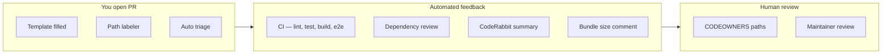

# Phase 14 — Culture d'ingénierie

> **Prérequis :** Phases [1](./phase-1-what-is-openhikmah.md)–[13](./phase-13-testing-mental-model.md) — surtout Phase 3 (frontières théologiques) et Phase 13 (couches de tests)  
> **Balises de preuve :** **FACT** · **INFERENCE** · **UNKNOWN**

La Phase 13 a expliqué **comment on impose la correction**. La Phase 14 explique **comment les changements arrivent vraiment** — style de commit, forme de PR, attentes de review, et normes visibles dans l'historique récent.

**Cette phase est en lecture seule.** Vous étudiez les conventions. Vous n'ouvrez pas de PR encore. (Phase 15 = fork/upstream ; Phase 16 = premières contributions sûres.)

---

## Ce que « culture d'ingénierie » veut dire ici

Open Hikmah est un petit dépôt **haute confiance** où :

- Le **contenu sacré** et les **garde-fous IA** ont la même rigueur que les bugs auth
- Les **PR sont petites et ciblées** plus souvent que de gros refactors
- **L'automatisation** porte la charge routine (CI, labels, Dependabot, reviews bots) pour que l'humain se concentre sur les frontières de confiance
- Les **erreurs sont revertées vite** quand un merge était faux — pas d'attachement au coût sunk

**FACT:** Sur les 100 dernières PR mergées (échantillon via `gh pr list`), **85** sont de `@nazarli-shabnam` et **15** de Dependabot.

**INFERENCE:** La vélocité quotidienne vient surtout du maintainer aujourd'hui. Les contributeurs OSS externes sont **bienvenus par la doc** (`CONTRIBUTING.md`) mais l'historique de merge reste **fin** pour les outsiders — votre première PR aura probablement une review **prudente et pédagogique**, pas un rubber-stamp.

**UNKNOWN:** Le délai exact de réponse du maintainer pour un premier contributeur externe — `CONTRIBUTING.md` dit « within a few days » mais ce n'est pas mesuré dans le dépôt.

---

## Docs canoniques (lisez celles-ci, pas des blogs)

| Document | Rôle |
| --- | --- |
| [`AGENTS.md`](../../AGENTS.md) | Source unique de vérité — style code, standards théologiques, attribution IA, garde-fous |
| [`CONTRIBUTING.md`](../../CONTRIBUTING.md) | Parcours humain fork → branche → test → PR |
| [`.github/PULL_REQUEST_TEMPLATE.md`](../../.github/PULL_REQUEST_TEMPLATE.md) | Sections PR obligatoires, surtout **AI / Theological changes** |
| [`.github/CODEOWNERS`](../../.github/CODEOWNERS) | Chemins qui doivent avoir les yeux du maintainer |
| [`SECURITY.md`](../../SECURITY.md) | Divulgation privée pour vulns — jamais d'issues publiques |

Les fichiers outils (`.cursor/rules/agents.mdc`, `.github/copilot-instructions.md`, etc.) sont des **miroirs** de `AGENTS.md` — s'ils dérivent, `AGENTS.md` gagne.

---

## Conventions de branche et commit

### Noms de branche

**FACT** (`AGENTS.md`, `CONTRIBUTING.md`) :

```text
feat/   — nouveau comportement
fix/    — correction de bug
chore/  — tooling, deps, nettoyage non visible user
docs/   — documentation seulement
```

Exemples récents : `fix/names-locale-meta`, `feat/csp-nonce-infra`, `chore/naming-consistency`.

**FACT:** Des branches opérationnelles one-off utilisent parfois `temp/` (ex. `temp/cleanup-566-ai-content`) — **courte durée** ; deux PRs ainsi ont été revertées en heures (#600–#603).

### Messages de commit

**FACT:** [Conventional Commits](https://www.conventionalcommits.org/) avec **scope** optionnel :

```text
fix(search): match quran.com keyword search against the user's UI locale
fix(auth,connections): distinguish a timed-out publish from a failed one
feat(security): add per-request CSP nonce infra, still report-only
chore: unify naming spellings, fix a stray color token, disable X-Powered-By
```

**INFERENCE:** Les scopes copient dossiers ou domaines (`admin`, `names`, `connections`, `auth`, `i18n`, `seo`) — en doute, prenez le dossier touché.

**FACT:** Des fixes multi-zones utilisent parfois des **scopes comma** dans un commit quand c'est une unité logique de review (PR #598 : garde test auth + connections).

### Ce que les commits ne doivent **pas** contenir

| Règle | Pourquoi |
| --- | --- |
| Pas de trailer `Co-Authored-By:` | Politique dépôt — implique une co-authorship humaine qui ne s'applique pas |
| Utiliser `Generated-By: <tool>` à la place | Pour fichiers entiers neufs ou ~30+ lignes IA avec peu d'édition humaine |
| Pas de commits directs sur `main` | Bloqué par `scripts/precommit-checks.mjs` |

**INFERENCE:** Vous pouvez voir « Generated with Claude Code » dans les **descriptions PR** sur des PR maintainer — c'est de la divulgation dans le corps PR ; le **trailer commit** de `AGENTS.md` est le mécanisme formel pour gros blocs générés.

---

## Forme d'une pull request (PR)

### Sections du template qui comptent

**FACT** (`.github/PULL_REQUEST_TEMPLATE.md`) :

1. **Summary** — 1–3 puces : quoi + pourquoi
2. **Type of change** — case à cocher
3. **AI / Theological changes** — section honnête obligatoire pour prompts, noms divins, logique connexions
4. **Testing** — commandes locales cochées
5. **Checklist** — branche à jour, pas de secrets, `.env.example` / README si besoin

Le template dit explicitement que e2e, axe et bundle-size tournent en CI — vous n'avez pas besoin de tout relancer en local si unit + integration passent.

### À quoi ressemblent de bonnes descriptions PR

Les PR maintainer récentes (#611, #598) partagent un pattern à copier :

| Section | But |
| --- | --- |
| **What / Fix** | Énoncé du problème en langage simple |
| **Why (per review)** | Cite le feedback review quand vous répondez aux commentaires |
| **Theological / AI disclosure** | Même sans nouveau wording de prompt — dit ce qui change dans le modèle de confiance |
| **Testing** | Commandes exactes + counts ; note le suivi manuel quand l'automatisation ne couvre pas les backfills staging |

**Exemple — divulgation théologique sans nouveau wording de prompt** (PR #611, paraphrasé) :

> Adds a new AI-translation path for divine-name content. Reuses the already-reviewed, Tanzih-constrained `translateReason` prompt — same guardrails as verse-connection-reason translation.

C'est la barre : **nommez la surface de confiance**, pas seulement la liste de fichiers.

### Taille et focus PR

**INFERENCE d'après merges récents :**

- **Préférez une préoccupation par PR** — search locale (#610) et locale name meta (#611) ont atterri en PR séparées même si les deux touchent i18n
- **Des PR de suivi review existent** — `fix(names): address review feedback on locale-meta translation` comme second commit sur le même thème de branche
- **Le durcissement test-only a sa branche** — `test/graph-service-conflict-status-filter` (#598) a livré fixes prod *et* améliorations mock test ensemble car la review exigeait les deux

**INFERENCE:** Une première PR contributeur devrait être **assez petite pour review en une session** (~200 lignes ou moins est une cible sûre ; beaucoup de fixes mergés sont plus petits).

---

## Culture review et automatisation



### Couches automatisées

| Automatisation | Déclencheur | Ce qu'elle fait |
| --- | --- | --- |
| **CI** (`.github/workflows/ci.yml`) | Chaque push/PR | Barre qualité complète — voir Phase 13 |
| **PR labeler** | Changements de chemins | Ajoute `API`, `db`, `UX/UI`, `tests`, etc. (`.github/labeler.yml`) |
| **Auto triage** | Issue/PR ouverte | Assigne auteur, milestone, label préfixe (`feat`→`enhancement`, `fix`→`bug`) |
| **Dependabot** | Hebdomadaire | Bumps Bun + GitHub Actions, label `dependencies` |
| **Dependency review** | PR | Scan licence/vuln sur changements de deps |
| **CodeRabbit** | PR | Walkthrough + release notes (visible sur PR récentes) |
| **Bundle size comment** | Après CI sur PRs | Poste delta taille (fork-safe via `workflow_run`) |

**INFERENCE:** Les commentaires bots sont **consultatifs** sauf les checks CI — un CI vert est nécessaire ; les suggestions CodeRabbit sont filtrées par un humain.

### Attentes review humaine

**FACT** (`CODEOWNERS`) : ces chemins demandent auto `@nazarli-shabnam` :

- `app/api/admin/**`, `lib/admin/**`
- `app/callback/**`, `lib/auth/**`
- `next.config.ts` (CSP / en-têtes sécurité)
- `.github/workflows/**`

**INFERENCE:** Toucher auth, admin ou CSP n'est **pas interdit** pour les contributeurs — mais attendez une review **plus lente et plus profonde** et un call-out explicite dans votre summary PR.

**FACT:** PR #598 documente répondre à la review en **citant les mots du reviewer** et en expliquant comment chaque préoccupation a été adressée — y compris faire **échouer un test si un garde est retiré**.

Ce pattern — *« verified locally that removing `eq(connections.status, 'active')` makes the test fail »* — est un signal culturel : **les tests doivent attraper de vraies régressions**, pas seulement la couverture de lignes.

---

## Workflow issues

### Quand ouvrir une issue d'abord

**FACT** (`CONTRIBUTING.md`) : pour changements importants — nouveau comportement IA, nouvelles pages, changements flux PKCE — **discutez avant de coder**.

**INFERENCE:** Les fixes bug et petits polish UI sautent souvent l'issue ; les shifts architecturaux ou théologiques non.

### Templates d'issue

| Template | Champ extra important |
| --- | --- |
| **Bug report** | Étapes repro, environnement, « reproducible on openhikmah.com? » |
| **Feature request** | **Theological considerations** — cadrage obligatoire pour features présentation Quran |

**FACT:** Les issues ouvertes in-repo (échantillon Sep 2026) incluent des chores produit (`chore: add robots.txt…`) et des **findings sécurité** trackés en privé comme issues (`OIDC nonce check skipped…`, `Activity streak day… client-controlled tz`). Le **reporting** sécurité va toujours à security@openhikmah.com selon `SECURITY.md` — les issues semblent être du travail de remédiation maintainer.

---

## Patterns culturels visibles dans l'historique git

### 1. Revert vite, explique pourquoi

**FACT:** PRs #600–#603 — scripts cleanup `TEMP` mergés, puis **revert le même jour** quand l'approche était fausse :

```text
#600  chore(scripts): TEMP — retroactive cleanup for #566 AI-content guardrails
#601  fix(docker): TEMP — ship cleanup scripts into runner image
#602  Revert #601
#603  Revert #600
```

**INFERENCE:** `TEMP` dans un titre signale **expérimental / opérationnel** — pas un pattern pour premières contributions. Les reverts sont normaux, pas honteux.

### 2. Documentation risque accepté

**FACT:** PR #605 / issue #569 — absence `aud` JWT documentée comme **risque accepté** avec rationale, plutôt qu'ignorer le gap en silence.

**INFERENCE:** Quand sécurité parfaite ou théologie parfaite est impraticable, la culture préfère **acceptation écrite** à la dette non documentée.

### 3. Garde-fous renforcés, pas affaiblis

**FACT:** Issue #561 — `isValidRef accepts zero-padded refs` — track le **resserrement** de validation, pas l'assouplissement.

Aligné avec Phase 3/13 : les tests qui échouent se corrigent par **données ou code corrects**, pas en affaiblissant `isValidRef`.

### 4. i18n comme préoccupation de premier ordre

Cluster merge récent (Sep 2026) : search locale (#610), names locale meta (#611), surfaces authed i18n (#607) — la localisation est traitée comme **correction produit**, pas polish final.

### 5. Merges Dependabot sont routine

**FACT:** ~15% des merges récents sont des bumps de deps — CI doit rester vert ; review humaine souvent légère sauf saut de version majeur (revert Next.js #448 montre que les gros bumps peuvent être rollback).

---

## Hooks git locaux = culture imposée sur votre machine

| Hook | Impose |
| --- | --- |
| **pre-commit** | Pas de commits `main` ; pas de `.only`/`.skip` ; pas de `console.log` dans TS stagé ; gitleaks si installé ; lint-staged ; typecheck ; **suite unit complète** |
| **pre-push** | **Tests d'intégration** — Docker requis |

**INFERENCE:** Le projet **fait confiance mais vérifie** — les hooks copient CI pour que « works on my machine » veuille dire plus près de « works in GitHub Actions ».

**FACT:** Sauter les hooks (`--no-verify`) est explicitement déconseillé dans `AGENTS.md` sauf instruction maintainer.

---

## Normes développement assisté par IA

Ce dépôt est développé activement avec des outils IA (configs Claude Code, Cursor, Copilot existent). Règles culturelles :

| À faire | À ne pas faire |
| --- | --- |
| Divulguer changements prompt/théologie dans template PR | Assouplir validation versets pour satisfaire le modèle |
| Ajouter `Generated-By:` sur gros commits IA | Ajouter `Co-Authored-By: Claude` |
| Réutiliser helpers Tanzih existants (`translateReason`, `tanzihDirective`) | Inventer wording prompt parallèle sans review |
| Lancer suites test complètes avant push | Sauter intégration parce que unit a passé |

**INFERENCE:** Utiliser l'IA pour **écrire tests et boilerplate** est aligné avec la pratique maintainer ; utiliser l'IA pour **changer le cadrage théologique** sans divulgation PR explicite ne l'est pas.

---

## Comment votre première PR sera probablement reçue

**INFERENCE** (de CONTRIBUTING + historique + CODEOWNERS) :

| Si votre PR… | Attendez… |
| --- | --- |
| Fix une issue déposée avec tests | Chemin le plus fluide |
| Ajoute docs seulement (`docs/onboarding/`) | Faible risque ; format/lint quand même si adjacent TS |
| Touche prompts `lib/ai/` | Review théologique + section template IA remplie |
| Touche `lib/auth/` ou admin | Review CODEOWNER, cadrage sécurité |
| Est grosse / multi-sujet | Demande de split avant review profonde |
| Affaiblit un test garde-fou | Rejet même si CI vert |

**FACT:** `CONTRIBUTING.md` demande format, lint, typecheck et `test:ci` **avant** ouverture — intégration tourne au push via hook.

---

## Exercice — lire l'historique comme un contributeur

Faites ces étapes en lecture seule (pas de changement code) :

### Étape 1 — Une PR mergée de bout en bout

```bash
gh pr view 611 --web   # or read on GitHub
```

Notez : structure summary, section théologique, claims test, labels appliqués.

### Étape 2 — Un fix piloté par review

```bash
gh pr view 598
```

Notez : comment les commentaires review mappent aux commits et au durcissement test.

### Étape 3 — Une paire revert

```bash
gh pr view 600
gh pr view 603
```

Demandez-vous : quel signal porte `TEMP` dans le titre ?

### Étape 4 — Échantillon messages commit

```bash
git log --oneline -20
```

Choisissez trois commits et identifiez **type**, **scope**, et **effet visible user**.

**Checkpoint :** Pouvez-vous expliquer pourquoi #610 et #611 étaient des PR séparées ?

---

## MUST UNDERSTAND NOW

1. **`AGENTS.md` + template PR** sont les docs culture binding — divulgation théologique non optionnelle pour changements IA/noms/connexions.
2. **Conventional commits** avec scopes ; **pas de `Co-Authored-By`** ; `Generated-By` pour gros blocs IA au commit.
3. **PR petites et ciblées** matchent mieux l'historique récent que changements sweeping.
4. **Chemins CODEOWNERS** (auth, admin, CSP, CI) ont review maintainer — citez-les explicitement.
5. **Culture revert existe** — mauvais merges sont annulés ; tests doivent prouver que les gardes restent.
6. **Issues d'abord** pour gros comportement ; **security@** pour vulns — pas threads bug publics.
7. **Hooks ≈ CI** — pre-commit (unit), pre-push (intégration + Docker).

---

## USEFUL LATER

- Lisez issues ouvertes `#561`, `#563`, `#569` — exemples de tracking dette sécurité/théologie
- Surveillez PR Dependabot — apprenez quels bumps deps sont routine vs risqués
- Summaries CodeRabbit sur grosses PR — bon modèle pour votre section « Summary »
- Commits `address review feedback` — pattern pour round 2 après première review

---

## IGNORE FOR NOW

- Matcher la vélocité maintainer (plusieurs PR par jour) — optimisez pour **première PR correcte**
- Branches `temp/` et scripts backfill opérationnels — pas territoire première contribution
- Débats sur outils review bot — CI vert + approbation humaine CODEOWNER = ce qui merge
- Prose description PR parfaite — clarté et divulgation théologique honnête battent le polish

---

## Questions checkpoint Phase 14

1. Où vivent les standards théologiques, et quelle section template PR mappent-ils ?
2. Pourquoi PRs #600–#603 ont été mergées puis revertées ?
3. Quels quatre préfixes de chemin déclenchent review CODEOWNERS ?
4. Quelle est la différence entre `Co-Authored-By` et `Generated-By` dans ce dépôt ?
5. Pourquoi #610 et #611 pourraient être des PR séparées même si les deux concernent la localisation ?

---

**Suivant :** [Phase 15 — Workflow Git OSS](./phase-15-oss-git-workflow.md) — fork, upstream, hygiène de branche, et ouvrir votre première PR comme ce dépôt l'attend.

**Votre action :** Complétez l'**Exercice** (Étapes 1–4), puis répondez **« continuer vers la phase 15 »** — ou posez une question sur toute convention qui vous a surpris.

> **Version complète (français B2+) :** [Phase 14](../onboarding-fr/phase-14-engineering-culture.md)
