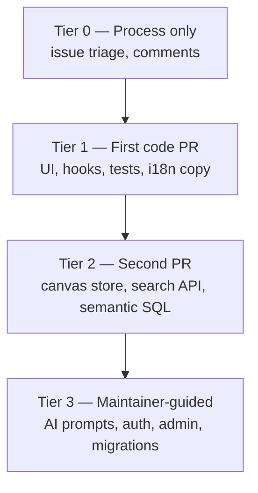

# Phase 16 — Carte surface contribution & readiness

> **Prérequis :** Phases [1](./phase-1-what-is-openhikmah.md)–[15](./phase-15-oss-git-workflow.md) — complètes ou survolées ; app locale lancée au moins une fois (Phase 10) fortement recommandé  
> **Balises de preuve :** **FACT** · **INFERENCE** · **UNKNOWN**

C'est la **dernière phase d'onboarding**. Elle mappe où vous pouvez contribuer en sécurité. Elle classe des premières PR réalistes contre **issues ouvertes et code**. Elle donne une checklist readiness honnête — pour que votre première PR upstream construise la légitimité, pas du bruit.

**Toujours lecture seule jusqu'à ce que vous choisissiez une cible et une branche.** Aucune PR n'est ouverte par ce document.

---

## Ce que « contributeur OSS récurrent » veut dire ici

**INFERENCE:** Pour Open Hikmah, la légitimité n'est pas « beaucoup de PR mergées ». C'est :

1. **Changements ciblés** qui matchent la culture dépôt (Phase 14)
2. **Tests** qui prouvent le comportement sans affaiblir les garde-fous (Phase 13)
3. **Divulgation PR honnête** quand vous touchez IA, noms, ou connexions (Phase 3)
4. **Hygiène git répétable** (Phase 15)

Une petite correction excellente bat cinq corrections bâclées.

**FACT:** Il n'y a **pas** de label `good first issue` ou `help wanted` dans le dépôt aujourd'hui — vous devez juger l'adéquation depuis le texte issue, labels, et risque de chemin vous-même.

---

## Carte de fin d'onboarding

| Phase | Vous devriez pouvoir… |
| --- | --- |
| **1–2** | Expliquer la boucle centrale et pourquoi l'ancrage compte |
| **3** | Nommer Tanzih, cadrage Maturidi/Hanafi, et `isValidRef` — et pourquoi ne pas affaiblir les tests |
| **4–5** | Naviguer `app/`, `lib/`, `components/`, `__tests__/` sans vous perdre |
| **6–8** | Tracer search → canvas → expand → Zustand → persistance |
| **7** | Décrire `discoverCandidates` → `generateGroundedConnections` → cache |
| **9–10** | Lancer Postgres, seed, vars env, smoke-check expand |
| **11–12** | Corréler onglet Network avec `graph-service` ; expérience timing cache optionnelle |
| **13** | Choisir unit vs integration vs e2e pour un changement |
| **14–15** | Écrire un corps PR, utiliser fork/upstream, passer les hooks |

Si une ligne est faible, **comblez ce gap avant une PR Tier 1** — ou choisissez d'abord Tier 0 commentaire issue / docs-only.

---

## Carte surface contribution (niveaux de risque)



### Tier 0 — Pas de code (ou commentaire seulement)

| Action | Exemple | Risque |
| --- | --- | --- |
| Confirmer issues stale | #561, #562, #608 — voir [Issues stale](#issues-stale-ou-partiellement-résolues) | Aucun |
| Demander scope sur manifest #608 | « PWA wanted or robots+sitemap only? » | Aucun |
| Déposer un **bug** avec repro | Utiliser template issue + ref verset | Faible |

**INFERENCE:** Des commentaires issue réfléchis qui citent **preuve commit/PR** construisent la confiance maintainer avant votre première PR code.

---

### Tier 1 — Première PR code recommandée

**Profil :** Diff borné, patterns existants, tests copient source, pas de prompts théologiques, pas de chemins CODEOWNERS.

| Zone | Chemins | Travail typique | Tests |
| --- | --- | --- | --- |
| **Layout / perf hygiene** | `components/layout/Header.tsx`, `ContextSidebar.tsx`, `hooks/useActivityTracker.ts` | Fixes selectors, deps effect (issue #572) | Étendre `__tests__/components/layout/*`, `__tests__/hooks/useActivityTracker.test.ts` |
| **Search / canvas UX** | `components/search/`, `components/canvas/` (toolbar, empty state, tour) | Focus, a11y, loading | Tests composants + optionnel `e2e/` |
| **Canvas store** | `store/canvas.ts` | Dedup, cas limites layout | `__tests__/store/canvas.test.ts` |
| **Tests régression seulement** | `__tests__/` | Verrouiller un bug fixé | Autonome |
| **Copy UI (non-théologie)** | `messages/*.json` | Labels boutons, empty states | Tests snapshot/message si présents |
| **SEO / metadata statique** | `app/robots.ts`, `app/sitemap.ts`, futur manifest | Après scope issue #608 confirmé | `__tests__/app/sitemap.test.ts`, tests robots si ajoutés |

**FACT:** Phase 5 listait celles-ci comme « safer first contributions » — toujours exact.

---

### Tier 2 — Après une PR mergée ou review forte

| Zone | Chemins | Nécessite |
| --- | --- | --- |
| Recherche sémantique | `lib/quran/semantic-search.ts` | Modèle mental pgvector (Phase 9) ; issue #105 |
| Search API | `app/api/search/route.ts` | Rate limits, dual search paths |
| Persistance canvas | `hooks/useCanvasPersistence.ts` | Races share vs localStorage (Phase 8) |
| Social / workspaces | `app/api/social/*`, `lib/social/*` | Patterns Auth + Drizzle |

---

### Tier 3 — Ne pas solo en première contribution

| Zone | Pourquoi |
| --- | --- |
| `lib/ai/connection-generator.ts`, prompts | Théologie + validation (Phase 3, 7) |
| `lib/ai/theological-constraints.ts` | Texte contrainte sacré |
| `lib/names/divine-names/data/` | Contenu théologique |
| `lib/auth/`, `app/callback/` | Sécurité — **CODEOWNERS** |
| `app/api/admin/`, `lib/admin/` | Admin fail-closed |
| `lib/infra/db/migrations/` | Schéma réversible + tests intégration requis |
| Issues ouvertes **security-vulnerability** (#556, #563, #568, …) | Besoin pairing maintainer ; divulgation privée si exploitable |

**FACT:** `CONTRIBUTING.md` — ouvrir une **issue d'abord** pour nouveau comportement IA, nouvelles pages, ou changements PKCE.

---

## Candidats première PR classés (basés sur preuves)

Ordre par **approachability × clarté × alignement maintainer**. Vérifiez l'état issue avant de commencer — les labels traînent derrière les fixes.

### 1. Issue #572 — Selectors social-store Header (E1) ⭐ meilleure cible code

**FACT:** Le corps issue pointe vers `Header.tsx:217` — destructurer tout `useSocialStore()` sans selectors cause trop de re-renders sur canvas.

| Champ | Détail |
| --- | --- |
| **Branche** | `fix/header-social-store-selectors` |
| **Scope** | Un fichier (+ test si vous ajoutez assertion render-count ou comportement) |
| **Risque** | Faible — perf, pas théologie |
| **Skills** | Selectors Zustand, bases re-render React |
| **Type PR** | Bug fix / refactor |

**INFERENCE:** Matche les findings sweep du maintainer — probablement bienvenu si PR petite et testée.

---

### 2. Issue #572 — Deps effect `useActivityTracker` (E4)

| Champ | Détail |
| --- | --- |
| **Chemins** | `hooks/useActivityTracker.ts` |
| **Scope** | Arrêter re-run flush à chaque tick drag |
| **Risque** | Faible–moyen — comportement tracking activité canvas |
| **Tests** | `__tests__/hooks/useActivityTracker.test.ts` existe — étendre |

Faites **un** finding #572 par PR (Phase 14 : PR petites et ciblées).

---

### 3. Issue #572 — Hydration `ContextSidebar` (E5)

| Champ | Détail |
| --- | --- |
| **Chemins** | `components/layout/ContextSidebar.tsx` |
| **Scope** | Fix pattern `matchMedia` dans initializer `useState` lazy |
| **Risque** | Faible — mismatch hydration latent |
| **Tests** | `__tests__/components/layout/ContextSidebar.test.tsx` |

---

### 4. Issue #608 — Web manifest (seulement après commentaire scope)

**FACT:** `app/robots.ts` et `app/sitemap.ts` **existent déjà** sur `main` (PR #612). Le corps issue #608 est **partiellement outdated**.

**FACT:** Pas de `manifest.webmanifest` (ou route manifest App Router) trouvé dans le dépôt.

| Champ | Détail |
| --- | --- |
| **Blocker** | Issue demande : PWA intentionnel ou pas ? |
| **Action d'abord** | Commenter sur #608 citant #612 ; demander si fermer portion robots/sitemap et scope manifest seulement |
| **Si approuvé** | `chore/seo-web-manifest` — metadata statique, pas d'IA |

---

### 5. PR test régression seulement

Si vous trouvez un bug en utilisant l'app :

1. Déposer issue avec repro (template)
2. Branche `test/describe-bug` ou `fix/...` avec test qui échoue → fix
3. Suivre pattern tests DELETE bookmark dans `__tests__/api/bookmarks.test.ts` pour routes API

**INFERENCE:** PR test-only qui **resserrent** assertions (comme inspection Drizzle `where` de PR #598) matchent la culture.

---

### 6. Polish i18n / a11y

| Cible | Notes |
| --- | --- |
| `messages/en.json` (+ tr/ru/az si vous pouvez) | Chaînes UI non théologiques seulement |
| Warnings `e2e/a11y.spec.ts` | Violations axe modérées sont loguées mais pas fail — fixer cause racine est bien **après** repro locale |

**Évitez :** traduire **meaning/description** noms divins sans passer par chemins `translateReason` / cache existants (Phase 7, pattern PR #611).

---

### Non recommandé comme première PR

| Item | Pourquoi |
| --- | --- |
| **#561** refs zero-padded | **Déjà fixé** sur `main` (#575, #578) — voir issues stale |
| **#562** bookmark DELETE | **Déjà fixé** — trim + dual-key delete dans `app/api/bookmarks/[ref]/route.ts` avec tests |
| **#568, #556, #563** sécurité | CODEOWNERS + expertise sécurité |
| **#567** backfill loop | Sémantique quota admin/Gemini — facile à casser |
| **#109–#116** features | Gros produit — discussion issue d'abord |
| **`docs/onboarding/`** | **Gitignored** (`docs/` dans `.gitignore`) — pas committable sans changement politique |
| **Stagger Expérience B** (Phase 12) | Exercice d'apprentissage seulement — pas merge-worthy seul |

---

## Issues stale ou partiellement résolues

Vaut un **commentaire Tier 0** avant de coder :

| Issue | Statut sur `main` (Sep 2026) | Action suggérée |
| --- | --- | --- |
| **#561** | `isValidRef` rejette `02:255` ; tests dans `quran-corpus.test.ts` | Commenter liens #575/#578 ; demander fermeture |
| **#562** | DELETE trim + `inArray([ref, verseRef])` ; tests à `bookmarks.test.ts:279+` | Commenter avec refs fichiers ; demander fermeture |
| **#608** | robots + sitemap shipped (#612) ; manifest ouvert | Commenter complétion partielle ; clarifier scope manifest |

**INFERENCE:** Fermer issues stale aide les maintainers et montre que vous avez lu `main` — première interaction valide.

---

## Auto-évaluation readiness

Scorez chaque item **honnêtement** : ✅ confiant · ~ partiel · ✗ pas encore

### Environnement & workflow

| Check | ✅ / ~ / ✗ |
| --- | --- |
| `bun run dev` marche ; canvas charge | |
| Postgres seedé ; expand renvoie connexions (Phase 10) | |
| `bun run test:ci` passe en local | |
| `docker info` OK ; `bun run test:integration` passe | |
| `origin` = votre fork, `upstream` = OpenHikmah ; `main` synced | |
| Lu boucle fork Phase 15 une fois | |

### Modèle de confiance (non négociable)

| Check | ✅ / ~ / ✗ |
| --- | --- |
| Peut expliquer « data discovers ; AI articulates » | |
| Sait ce que `isValidRef` et Tanzih protègent | |
| Corrigerait test ref qui échoue par **data/code**, pas assouplir validation | |
| Sait quand section PR template AI/Theological est requise | |

### Navigation code

| Check | ✅ / ~ / ✗ |
| --- | --- |
| A tracé expand : `HikmahCanvas` → `/api/connections` → `getConnections` | |
| Sait où ajouter test unit pour changement layout | |
| Peut nommer un chemin CODEOWNERS à éviter sur PR #1 | |

### Scoring

| Score | Verdict |
| --- | --- |
| **Tout environnement ✅, ≥2 trust ✅, ≥2 navigation ✅** | **Prêt pour PR code Tier 1** (choisir item #572) |
| **Environnement ~, trust ✅** | Faire exercices Phase 10 + 13 d'abord |
| **Trust ~ ou ✗** | Relire Phase 3 + 7 avant tout changement `lib/ai/` ou validation API |
| **Environnement ✗** | Finir setup local — PR code gaspillera cycles review |

**Votre machine (inspectée Phase 15) :** remotes et sync ✅ · docs onboarding local-only ✅ · auth `gh` comme `radhwana` / fork `radhtkamal` — vérifiez nommage head branche PR avec CLI.

---

## Checklist pre-flight (jour où vous ouvrez PR #1)

```bash
# Sync
git checkout main && git fetch upstream && git merge upstream/main && git push origin main

# Branch
git checkout -b fix/header-social-store-selectors   # example

# … edit …

# Quality bar
bun run format:check && bun run lint && bun run typecheck && bun run test:ci

# Push (integration runs here)
docker info && git push -u origin fix/header-social-store-selectors

# PR → OpenHikmah/openhikmah-web main
gh pr create --repo OpenHikmah/openhikmah-web --base main \
  --head radhtkamal:fix/header-social-store-selectors \
  --fill   # or use template body from Phase 15
```

Corps PR minimum :

- Puces summary (quoi + pourquoi)
- Lien **Fixes #572** (ou partie) si applicable
- AI/Theological : **coché « No AI or theological changes »** pour cibles Tier 1
- Checklist testing remplie honnêtement

---

## Chemin 30 jours vers contributeur récurrent

**INFERENCE:** Cadence réaliste pour quelqu'un avec votre background (~6y React/TS), **à temps partiel** :

| Semaine | Objectif |
| --- | --- |
| **1** | Smoke Phase 10 + tests Phase 13 verts ; commentaires Tier 0 sur #561/#562/#608 |
| **2** | PR #1 : un item #572 (~50–150 lignes) ; répondre review sous 48h |
| **3** | PR #2 : extension test ou second item #572 ; lire une PR maintainer mergée (#611 ou #598) |
| **4** | Exploration Tier 2 optionnelle — lire issue #105 ; **ne pas implémenter** jusqu'à engagement maintainer |

**Marqueurs légitimité :**

- CI vert sur fork avant demander review
- Pas de `--no-verify`
- Feedback review adressé avec **nouveaux commits** et réponses courtes
- Issues déposées pour bugs non fixés immédiatement

**UNKNOWN:** Cadence merge maintainer pour premières PR externes — planifiez **minimum un round review**.

---

## Après onboarding — quoi continuer

| Habitude | Pourquoi |
| --- | --- |
| `git fetch upstream` avant chaque branche | Petits diffs |
| Lire `AGENTS.md` quand vous touchez nouvelles zones | Mises à jour politique arrivent là |
| Lancer intégration locale avant push | Matche hook pre-push |
| Survoler PR mergées dans `OpenHikmah/openhikmah-web` | Culture reste actuelle |
| Garder notes perso dans `docs/onboarding/` en local | Gitignored — OK pour étude |

**Graduation :** Vous êtes **onboarding-complete** quand vous pouvez (1) choisir cible Tier 1 de cette carte, (2) passer la barre readiness, et (3) ouvrir PR sans affaiblir garde-fous Phase 3.

Vous n'avez **pas** besoin de mémoriser les 16 phases — gardez ce fichier et « if you need X, open Y » de Phase 5 comme références bureau.

---

## MUST UNDERSTAND NOW

1. **Tier 1 d'abord** — perf layout (#572), tests, i18n non théologique ; pas prompts IA ou auth.
2. **Pas de label `good first issue`** — utilisez cette carte + texte issue ouverte.
3. **Plusieurs bugs ouverts sont déjà fixés sur `main`** — vérifiez avant coder (#561, #562, partial #608).
4. **Une préoccupation par PR** — split #572 E1 / E4 / E5.
5. **Docs onboarding gitignored** — première PR upstream devrait être **code**, sauf accord maintainer pour un-ignore `docs/`.
6. **Contributeur récurrent** = petites fixes de confiance + tests + divulgation honnête — pas volume.

---

## USEFUL LATER

- Surveiller issues label `bug` sans `security-vulnerability`
- Pairer avec maintainer sur `security-vulnerability` après premier merge
- Proposer un-ignore `docs/onboarding/` via issue si vous voulez guides étude upstream

---

## IGNORE FOR NOW

- Shipper Expérience B Phase 12 comme PR
- Compétition volume merge Dependabot
- Grosses issues features (#109–#116) comme premier touch
- Assouplir validation « pour débloquer » sorties IA

---

## Questions checkpoint Phase 16

1. Quelle est la **meilleure** cible première PR code dans ce doc, et pourquoi ?
2. Pourquoi commenter sur #608 avant d'implémenter un manifest ?
3. Nommez trois chemins qui exigent review CODEOWNERS.
4. Quel score sur la table readiness signifie « prêt Tier 1 » ?
5. Pourquoi `docs/onboarding/` n'est pas votre première PR ?

---

## Série terminée

Les Phases **1–16** sont un parcours onboarding ingénierie en **lecture seule** pour **OpenHikmah / `openhikmah-web`**.

**Actions suivantes suggérées (choisissez une) :**

1. **Tier 0** — Commenter sur #561, #562, ou #608 avec preuves depuis `main`
2. **Tier 1** — Branche `fix/header-social-store-selectors` pour issue #572 E1
3. **Vérifier** — Lancer Étapes 1–2 exercice pratique Phase 13 si pas fait
4. **Demander** — « Walk me through opening PR #1 for #572 E1 » et passer de lecture seule à implémentation

Il n'y a pas de Phase 17 dans cette série — la vraie contribution commence quand vous choisissez une cible et une branche.

> **Version complète (français B2+) :** [Phase 16](../onboarding-fr/phase-16-contribution-readiness.md)
