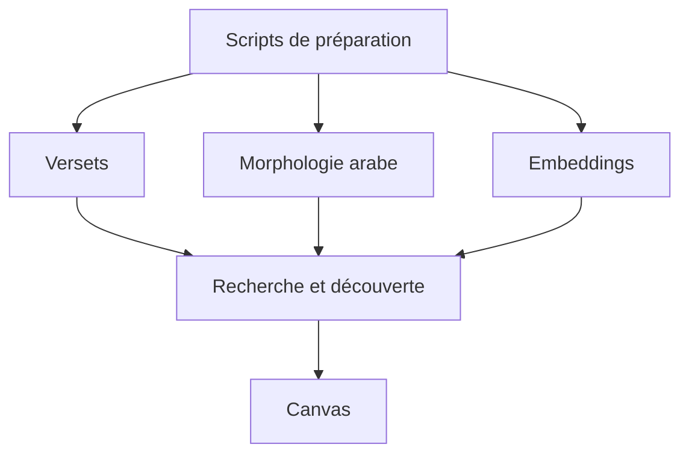
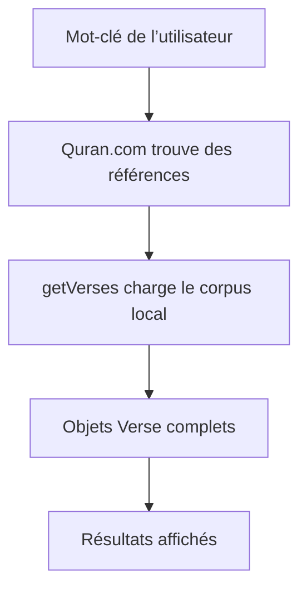
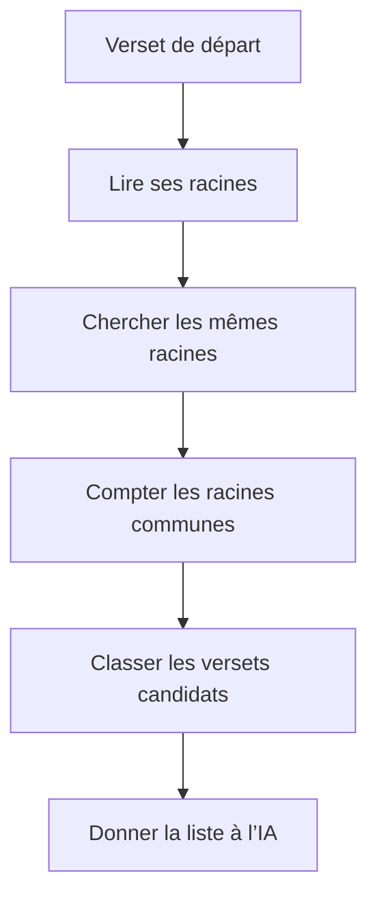
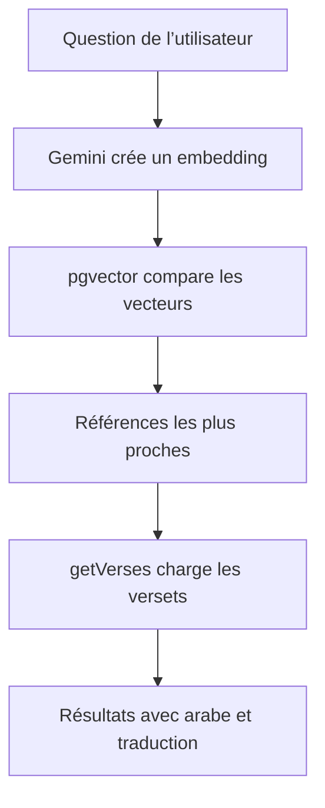
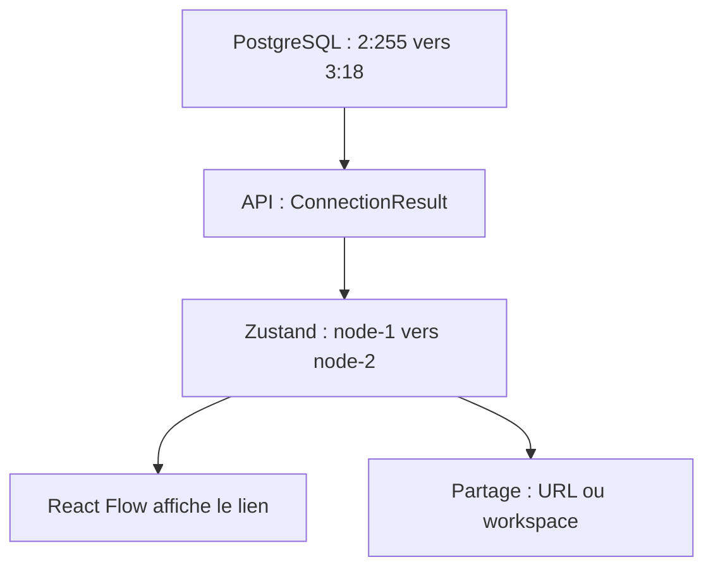

# Phase 2 — Introduction au domaine

> **Prérequis :** Phase 1 — Qu’est-ce qu’OpenHikmah ?
>
> **Tags de preuve :**
>
> * **FACT** = l’information est visible dans le dépôt.
> * **INFERENCE** = c’est une interprétation logique.
> * **UNKNOWN** = l’information n’est pas encore vérifiée.

---

## 1. Le but de cette phase

La Phase 1 a présenté l’idée principale :

> Les données découvrent les versets.
> L’IA choisit et explique.

La Phase 2 présente maintenant les données utilisées par OpenHikmah.

Après cette phase, vous devez comprendre :

* comment OpenHikmah identifie un verset ;
* où le texte du Coran est stocké ;
* comment la recherche fonctionne ;
* comment les racines arabes trouvent des connexions ;
* comment les embeddings cherchent par le sens ;
* pourquoi un verset et un nœud du canvas ont deux identités différentes.

Vous n’avez pas encore besoin de suivre tout le chemin d’une requête dans le code. Ce parcours complet viendra dans la phase sur le runtime.

---

## 2. Vue générale des données

Avant que l’utilisateur ouvre l’application, des scripts préparent les données.

Ils ajoutent dans PostgreSQL :

* les versets ;
* la morphologie arabe ;
* les embeddings.

Quand l’application fonctionne, elle lit ces données pour faire la recherche et trouver des connexions.



### Lecture à voix haute — suivez le diagramme

Commencez en haut du diagramme.

La première boîte représente les scripts de préparation.

Trois flèches partent de cette boîte.

La première flèche va vers les versets. La deuxième va vers la morphologie arabe. La troisième va vers les embeddings.

Regardez maintenant les trois flèches qui descendent. Les versets, la morphologie et les embeddings arrivent tous dans le système de recherche et de découverte.

Enfin, suivez la dernière flèche. Les résultats arrivent sur le canvas.

Le diagramme montre donc deux moments : les données sont d’abord préparées, puis l’application les utilise pendant son fonctionnement.

### À comprendre maintenant

Les données principales existent dans PostgreSQL avant l’intervention de l’IA.

Le système les lit pour trouver des versets candidats.

---

# Partie A — Le modèle de données du Coran

## 3. La référence d’un verset

**FACT :** Chaque verset possède une référence sous cette forme :

```text
sourate:ayah
```

Par exemple :

```text
2:255
```

Cette référence identifie Ayat al-Kursi.

Dans le code, la référence est souvent appelée `ref`.

### Les règles de validation

**FACT :** La fonction `isValidRef()` se trouve dans :

```text
lib/quran/quran-corpus.ts
```

Elle vérifie plusieurs règles.

| Règle                                             | Exemple accepté | Exemple refusé |
| ------------------------------------------------- | --------------: | -------------: |
| Le format doit être `sourate:ayah`.               |         `2:255` |        `2-255` |
| Le numéro de la sourate doit être entre 1 et 114. |         `114:1` |        `115:1` |
| L’ayah doit exister dans la sourate.              |           `1:7` |          `1:8` |
| Les nombres ne doivent pas commencer par zéro.    |         `2:255` |      `02:0255` |

**FACT :** Les limites des ayahs utilisent les comptes Hafs/Uthmani.

Une référence mal formée ne doit jamais devenir un résultat de recherche.

### Comparaison avec Firestore

**INFERENCE :** Vous pouvez penser à `ref` comme à un ID de document.

Mais il existe une différence importante.

Dans une application Firestore normale, votre application peut souvent créer de nouveaux IDs.

Dans OpenHikmah, l’espace des références est déjà défini par la structure du Coran.

L’application ne peut pas inventer une nouvelle sourate ou un nouvel ayah.

---

## 4. L’objet `Verse`

**FACT :** Le fichier `types/quran.ts` définit l’objet utilisé par l’application :

```typescript
interface Verse {
  surah: number;
  ayah: number;
  ref: VerseRef;
  arabicText: string;
  translation: string;
  surahName: string;
  surahNameArabic: string;
}
```

Chaque propriété a un rôle simple.

| Propriété         | Signification                           |
| ----------------- | --------------------------------------- |
| `surah`           | Numéro de la sourate                    |
| `ayah`            | Numéro de l’ayah                        |
| `ref`             | Référence complète, par exemple `2:255` |
| `arabicText`      | Texte arabe du verset                   |
| `translation`     | Traduction choisie                      |
| `surahName`       | Nom traduit de la sourate               |
| `surahNameArabic` | Nom arabe de la sourate                 |

Cet objet est utilisé dans :

* les résultats de recherche ;
* les réponses des APIs ;
* les nœuds du canvas.

**FACT :** Le nom de la sourate n’est pas enregistré dans chaque ligne de la table `verses`.

Le système le trouve avec :

```text
lib/quran/surah-names.ts
```

Cela évite de répéter le même nom dans beaucoup de lignes.

---

## 5. Le corpus local et les services externes

OpenHikmah utilise plusieurs sources. Mais elles n’ont pas toutes le même rôle.

| Source                      | Rôle principal                              |
| --------------------------- | ------------------------------------------- |
| PostgreSQL                  | Source principale pour afficher les versets |
| `alquran.cloud`             | Préparation initiale du corpus et secours   |
| API de recherche Quran.com  | Recherche par mot-clé                       |
| API des chapitres Quran.com | Recherche des noms de sourates              |

### Le corpus local

**FACT :** Les tables principales sont :

* `verses` ;
* `verse_translations`.

Le texte affiché par l’application vient normalement de ces tables.

Le corpus local est donc la source principale du produit.

### La préparation initiale

**FACT :** Le script suivant prépare le corpus :

```text
scripts/seed-quran.mjs
```

Il récupère :

* le texte arabe `quran-uthmani` ;
* la traduction anglaise `en.sahih` de Saheeh International.

Le total attendu est de **6 236 ayahs**.

Après cette préparation, l’application peut lire les versets depuis PostgreSQL.

### Le secours externe

**FACT :** `resolveVerse()` cherche d’abord le verset dans le corpus local.

Si le verset manque, la fonction essaie `alquran.cloud`.

Si le verset reste introuvable, elle retourne :

```typescript
null
```

Ce `null` est important. Le système refuse de créer une fausse carte de verset.

### La recherche Quran.com

**FACT :** La recherche par mot-clé peut utiliser l’API de Quran.com pour trouver des références.

Mais le texte final n’est pas pris directement dans le petit extrait retourné par la recherche.

Le système utilise les références trouvées. Ensuite, il recharge les vrais objets `Verse` depuis le corpus local avec `getVerses()`.

Cette opération est parfois appelée **hydratation**.

Ici, hydrater signifie :

> prendre une référence simple et charger toutes les données du verset.



### Lecture à voix haute — suivez le diagramme

Commencez avec la première boîte, en haut.

L’utilisateur écrit un mot-clé.

Suivez la première flèche. Quran.com cherche et retourne des références de versets.

Continuez vers la boîte suivante. `getVerses` utilise ces références pour charger les données du corpus local.

La flèche suivante mène vers les objets `Verse` complets. Ils contiennent le texte arabe, la traduction et les informations de la sourate.

Enfin, la dernière flèche mène vers les résultats affichés.

Le service externe aide donc à trouver les références, mais le corpus local fournit le contenu final.

---

## 6. Les traductions

**FACT :** La colonne `verses.translation` contient toujours la traduction anglaise :

```text
en.sahih
```

Les autres traductions sont stockées dans :

```text
verse_translations
```

Une traduction est identifiée par deux informations :

* la référence du verset ;
* l’édition de traduction.

Les langues principales configurées sont :

| Langue de l’interface | Édition           |
| --------------------- | ----------------- |
| Anglais `en`          | `en.sahih`        |
| Turc `tr`             | `tr.diyanet`      |
| Russe `ru`            | `ru.kuliev`       |
| Azéri `az`            | `az.mammadaliyev` |

**FACT :** Si une traduction manque, le système peut utiliser `en.sahih`.

**FACT :** `isValidEdition()` vérifie que l’édition demandée est autorisée.

Le système ne place donc pas directement une valeur inconnue dans une URL externe.

### À comprendre maintenant

La langue affichée peut changer, mais la référence du verset reste la même.

```text
2:255
```

reste `2:255` en anglais, en turc, en russe ou en azéri.

---

# Partie B — Les types de recherche

## 7. Comment un utilisateur peut-il chercher ?

OpenHikmah possède plusieurs chemins de recherche.

| Intention de l’utilisateur     | Fonctionnement                                                       |
| ------------------------------ | -------------------------------------------------------------------- |
| Chercher `2:255`               | Valider la référence, puis charger le verset                         |
| Chercher un nom de sourate     | Trouver les sourates avec un nom correspondant                       |
| Chercher un mot-clé            | Trouver des références avec Quran.com, puis charger le corpus local  |
| Chercher par le sens           | Comparer un embedding de la question avec les embeddings des versets |
| Trouver des versets similaires | Comparer l’embedding d’un verset avec les autres versets             |

**FACT :** La route principale est :

```text
GET /api/search
```

### Une référence qui ressemble à un verset

Si l’utilisateur écrit une valeur comme `2:255`, le système la traite comme une référence possible.

Mais si cette référence n’est pas valide, l’application ne crée pas de résultat.

### Recherche par mot-clé et recherche par le sens

Ces deux recherches sont différentes.

Une recherche par mot-clé cherche des mots identiques ou proches.

Une recherche sémantique cherche une idée similaire.

Par exemple, l’utilisateur peut écrire :

> patience pendant une épreuve

Un verset pertinent peut apparaître même si sa traduction ne contient pas exactement le mot « patience ».

---

# Partie C — La morphologie arabe

## 8. Les mots importants

| Terme             | Explication simple                                 |
| ----------------- | -------------------------------------------------- |
| **Forme visible** | Le mot exactement comme il apparaît dans le verset |
| **Racine**        | La base commune de plusieurs mots arabes           |
| **Lemme**         | La forme principale d’un mot dans un dictionnaire  |
| **Position**      | La place du mot dans l’ayah                        |
| **Morphologie**   | L’étude de la forme et de la structure des mots    |

Beaucoup de mots arabes utilisent une racine de trois lettres.

Deux mots avec la même racine peuvent avoir des formes différentes.

Ils peuvent aussi partager une idée importante.

C’est pourquoi la racine est un type de connexion dans OpenHikmah.

---

## 9. D’où viennent les données de morphologie ?

**FACT :** Le script suivant prépare les données :

```text
scripts/seed-morphology.mjs
```

Il lit des fichiers présents dans :

```text
data/morphology/*.jsonl
```

Selon les commentaires du script, ces fichiers viennent d’un serveur de morphologie coranique canonique.

Le script garde seulement les mots qui possèdent une racine.

Les données sont enregistrées dans :

```text
word_morphology
```

**FACT :** La couverture est partielle.

Cela signifie que certains versets n’ont pas encore de données de morphologie.

**UNKNOWN :** Le pourcentage exact de couverture n’est pas encore vérifié.

---

## 10. Comment le système trouve-t-il une connexion par racine ?

**FACT :** La fonction `rootCandidates()` se trouve dans :

```text
lib/ai/connection-discovery.ts
```

Elle travaille en plusieurs étapes :

1. elle lit les racines du verset de départ ;
2. elle cherche d’autres versets avec les mêmes racines ;
3. elle compte les racines communes ;
4. elle place les meilleurs candidats en premier ;
5. elle retire le verset de départ et les versets déjà affichés.

Cette étape utilise SQL et `word_morphology`.

Elle n’utilise pas un LLM.



### Lecture à voix haute — suivez le diagramme

Commencez en haut avec le verset de départ.

Suivez la première flèche. Le système lit les racines des mots de ce verset.

Continuez vers la troisième boîte. Le système cherche d’autres versets avec les mêmes racines.

Descendez encore. Il compte le nombre de racines communes pour chaque verset.

La flèche suivante mène vers la liste classée. Les versets avec plus de racines communes arrivent en premier.

Enfin, regardez la dernière flèche. La liste de candidats est donnée à l’IA.

Le point important est visible dans l’ordre des boîtes : les données de morphologie trouvent et classent les candidats avant l’intervention de l’IA.

---

## 11. La morphologie dans l’interface

**FACT :** Le fichier suivant prépare aussi les mots pour l’interface :

```text
lib/quran/arabic-morphology.ts
```

Il compare :

* les mots visibles dans le verset ;
* les formes enregistrées dans les données de morphologie.

Pour faciliter la comparaison, le code normalise le texte arabe.

Par exemple, il peut :

* retirer les signes diacritiques ;
* traiter plusieurs formes de la lettre alif comme une forme commune.

Cela permet de surligner les mots liés à une racine dans le texte du verset.

### Deux fonctions différentes

Il ne faut pas mélanger ces deux actions :

* SQL trouve des versets avec des racines communes ;
* le code de l’interface trouve les mots à surligner.

Les deux utilisent les données de morphologie, mais ils n’ont pas le même travail.

---

# Partie D — Les embeddings et la recherche sémantique

## 12. Qu’est-ce qu’un embedding ici ?

Un embedding est une liste de nombres qui représente le sens d’un texte.

**FACT :** Chaque verset possède un vecteur de **768 valeurs** dans :

```text
verse_embeddings.embedding
```

Le script suivant crée ces embeddings :

```text
scripts/embed-corpus.mjs
```

**FACT :** Il utilise :

```text
gemini-embedding-001
```

Le texte utilisé pendant cette préparation est la traduction anglaise `en.sahih`.

### Conséquence importante

**INFERENCE :** Le classement sémantique utilise principalement le sens de la traduction anglaise.

L’interface peut afficher une traduction turque, russe ou azérie. Mais l’embedding du verset a été créé avec le texte anglais.

La langue de l’affichage et la langue utilisée pour l’index sémantique peuvent donc être différentes.

---

## 13. Comment fonctionne la recherche par le sens ?

Le système transforme la question de l’utilisateur en embedding.

Ensuite, pgvector compare cet embedding avec les embeddings des versets.

Il utilise la similarité cosinus.

Vous n’avez pas besoin de calculer cette formule maintenant.

Retenez seulement ceci :

> plus deux vecteurs sont proches, plus leurs textes sont proches par le sens.



### Lecture à voix haute — suivez le diagramme

Commencez en haut avec la question de l’utilisateur.

Suivez la première flèche. Gemini transforme la question en embedding, donc en liste de nombres.

Continuez vers pgvector. La base de données compare ce nouveau vecteur avec les vecteurs déjà enregistrés pour les versets.

La flèche suivante mène vers les références les plus proches par le sens.

Ensuite, `getVerses` utilise ces références pour charger les vrais objets `Verse`.

Enfin, la dernière boîte montre les résultats avec le texte arabe et la traduction choisie.

Le diagramme sépare donc deux opérations : pgvector classe les références, puis le corpus local fournit le contenu affiché.

### Comparaison avec Firestore

Dans Firestore, vous pouvez faire une recherche exacte comme :

```typescript
where("tag", "==", "patience")
```

Cette requête cherche une valeur précise.

Avec pgvector, le système cherche les éléments les plus proches dans un espace de sens.

Les résultats n’ont donc pas besoin de contenir le même mot.

---

## 14. Recherche et connexion thématique

La recherche sémantique sert à deux choses principales.

### Chercher avec une phrase

L’utilisateur décrit une idée.

Le système retourne des versets proches par le sens.

### Étendre un verset

Quand l’utilisateur demande une connexion par thème, le système cherche les embeddings les plus proches du verset de départ.

Ces versets deviennent des candidats.

Dans le chemin ancré, l’IA choisit seulement parmi ces candidats et écrit les raisons.

Pour une connexion par contraste, le système utilise aussi des voisins sémantiques comme candidats. Ensuite, l’IA cherche les vraies oppositions dans cette liste.

Le détail complet de cette sélection appartient à la phase sur l’IA et le runtime.

---

# Partie E — Le graphe et le canvas

## 15. Deux types d’identité

Le verset et le nœud du canvas ne possèdent pas la même identité.

### Identité du verset

La référence identifie le verset :

```text
2:255
```

Cette identité appartient au domaine du Coran.

### Identité du nœud

**FACT :** Dans `store/canvas.ts`, un nœud possède un ID similaire à :

```text
node-1
```

Il possède aussi :

* un objet `Verse` dans `data` ;
* une position `{ x, y }`.

Cet ID identifie un élément visuel sur le canvas.

### Modèle mental

> `2:255` répond à la question : « Quel verset est-ce ? »
> `node-1` répond à la question : « Quel élément du canvas est-ce ? »

Cette différence ressemble à la différence entre :

* l’ID d’une entité métier ;
* l’ID d’une représentation dans l’interface.

---

## 16. Connexion persistante et lien visuel

Une connexion dans PostgreSQL utilise les références des versets.

Elle peut contenir :

* `fromRef` ;
* `toRef` ;
* `kind` ;
* `reason` ;
* `locale` ;
* `model` ;
* `status`.

Un lien sur le canvas utilise les IDs des nœuds :

* `source` ;
* `target`.

Il garde aussi les informations nécessaires pour l’affichage, comme :

* le type ;
* le label ;
* la raison.



### Lecture à voix haute — suivez le diagramme

Commencez en haut avec PostgreSQL.

La connexion enregistrée utilise les références des versets, par exemple `2:255` vers `3:18`.

Suivez la première flèche. L’API transforme cette connexion en `ConnectionResult`.

Continuez vers Zustand. Le store du canvas travaille maintenant avec des IDs visuels, par exemple `node-1` vers `node-2`.

À partir de Zustand, le diagramme se sépare en deux chemins.

Suivez d’abord la flèche vers React Flow. React Flow utilise l’état pour afficher le lien à l’écran.

Revenez ensuite à Zustand et suivez l’autre flèche. Le même état peut être transformé pour créer une URL partagée ou enregistrer un workspace.

Le diagramme montre donc le passage entre deux mondes : PostgreSQL connaît les références des versets, tandis que le canvas connaît les IDs et les positions des éléments visuels.

---

## 17. Vérité partagée et vue personnelle

| Question                        | Graphe persistant     | Canvas                                   |
| ------------------------------- | --------------------- | ---------------------------------------- |
| Où vit-il ?                     | PostgreSQL            | Zustand dans le navigateur               |
| Quelle identité utilise-t-il ?  | Références de versets | IDs de nœuds                             |
| Que contient-il ?               | Connexions et raisons | Nœuds, liens et positions                |
| Qui peut en profiter ?          | Tous les utilisateurs | La session ou le workspace               |
| Survit-il au rafraîchissement ? | Oui                   | Seulement s’il est partagé ou enregistré |

**FACT :** `graph-service.ts` lit d’abord les connexions déjà présentes dans PostgreSQL.

Si une connexion existe déjà, un autre utilisateur peut recevoir le même résultat sans demander une nouvelle génération à l’IA.

Le canvas garde seulement la vue de travail de l’utilisateur.

---

# Partie F — Qui décide quoi ?

## 18. La provenance des décisions

| Question                                         | Système responsable                        |
| ------------------------------------------------ | ------------------------------------------ |
| La référence `2:255` a-t-elle un format valide ? | `isValidRef()`                             |
| Le verset existe-t-il ?                          | Corpus local, puis secours externe         |
| Quel texte arabe faut-il afficher ?              | Corpus local                               |
| Quelle traduction faut-il afficher ?             | Édition choisie, avec secours anglais      |
| Quels versets partagent une racine ?             | SQL sur `word_morphology`                  |
| Quels versets sont proches par le sens ?         | Embeddings et pgvector                     |
| Quels candidats deviennent des connexions ?      | IA limitée à la liste dans le chemin ancré |
| Pourquoi les versets sont-ils connectés ?        | `reason` écrite par l’IA                   |
| Où la connexion est-elle gardée ?                | PostgreSQL                                 |
| Où la position du nœud est-elle gardée ?         | État du canvas                             |

Ce tableau montre que l’IA ne décide pas de tout.

Chaque partie du système possède une responsabilité précise.

---

# Phase 2 — Ce qu’il faut retenir

1. Une référence utilise le format `sourate:ayah`.

2. `isValidRef()` vérifie le format et les limites réelles du Coran.

3. PostgreSQL est la source principale pour le texte affiché.

4. Les services externes aident à préparer, chercher ou récupérer une donnée manquante.

5. La recherche par racine utilise SQL et `word_morphology`.

6. La recherche par le sens utilise des embeddings et pgvector.

7. Les embeddings des versets sont créés avec la traduction anglaise `en.sahih`.

8. La référence identifie le verset. L’ID `node-N` identifie sa représentation sur le canvas.

9. Le graphe persistant contient la vérité partagée. Le canvas contient la vue de travail de l’utilisateur.

10. Les données trouvent les candidats avant que l’IA choisisse et explique.

---

## Détails volontairement reportés

Vous n’avez pas encore besoin de comprendre :

* l’index HNSW de pgvector ;
* la formule complète de la similarité cosinus ;
* le cache Redis des requêtes ;
* le chemin complet de `POST /api/connections` ;
* les erreurs HTTP 429 et 502 ;
* `ConnectionParseError` ;
* le format complet des prompts ;
* tous les cas du chemin *legacy* ;
* l’enregistrement dans `ai_generations` ;
* le système administratif de *backfill* ;
* les tables sociales et les défis.

Ces sujets sont réels, mais ils ne sont pas nécessaires pour le modèle mental de la Phase 2.

---

## Vocabulaire essentiel

| Mot             | Explication simple                                         |
| --------------- | ---------------------------------------------------------- |
| **ayah**        | Un verset du Coran                                         |
| **sourate**     | Un chapitre du Coran                                       |
| **ref**         | La référence d’un verset, comme `2:255`                    |
| **corpus**      | La collection locale des versets                           |
| **édition**     | Une version précise d’une traduction                       |
| **hydrater**    | Charger les données complètes à partir d’une référence     |
| **morphologie** | Étude de la structure des mots                             |
| **racine**      | Base commune de plusieurs mots arabes                      |
| **lemme**       | Forme principale d’un mot dans un dictionnaire             |
| **embedding**   | Liste de nombres qui représente le sens                    |
| **vecteur**     | Liste ordonnée de nombres                                  |
| **similarité**  | Mesure de proximité entre deux éléments                    |
| **pgvector**    | Extension PostgreSQL pour stocker et comparer des vecteurs |
| **persistant**  | Enregistré pour rester disponible                          |
| **runtime**     | Moment où l’application fonctionne                         |
| **seeding**     | Préparation initiale des données                           |
| **nœud**        | Élément visuel placé sur le canvas                         |
| **provenance**  | Source d’une information ou d’une décision                 |

---

## Fichiers importants pour vérifier cette phase

Vous n’avez pas besoin de lire tous ces fichiers maintenant.

| Fichier                          | Sujet                                     |
| -------------------------------- | ----------------------------------------- |
| `types/quran.ts`                 | Objet `Verse` et types du domaine         |
| `lib/quran/quran-corpus.ts`      | Validation des références et corpus local |
| `lib/quran/verse-resolver.ts`    | Corpus local et secours externe           |
| `lib/quran/surah-names.ts`       | Noms des sourates                         |
| `lib/i18n/config.ts`             | Éditions utilisées selon la langue        |
| `app/api/search/route.ts`        | Chemins de recherche                      |
| `lib/quran/semantic-search.ts`   | Embeddings et pgvector                    |
| `lib/quran/arabic-morphology.ts` | Morphologie utilisée dans l’interface     |
| `lib/ai/connection-discovery.ts` | Candidats par racine et par sens          |
| `lib/infra/db/schema.ts`         | Tables de la base de données              |
| `scripts/seed-quran.mjs`         | Préparation du corpus                     |
| `scripts/seed-morphology.mjs`    | Préparation de la morphologie             |
| `scripts/embed-corpus.mjs`       | Création des embeddings                   |
| `store/canvas.ts`                | Identité et état des nœuds du canvas      |
| `lib/ai/graph-service.ts`        | Connexions persistantes                   |
