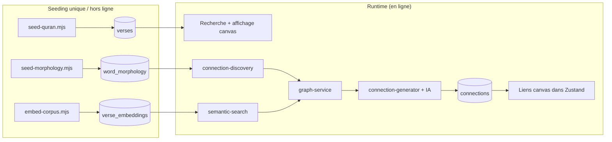
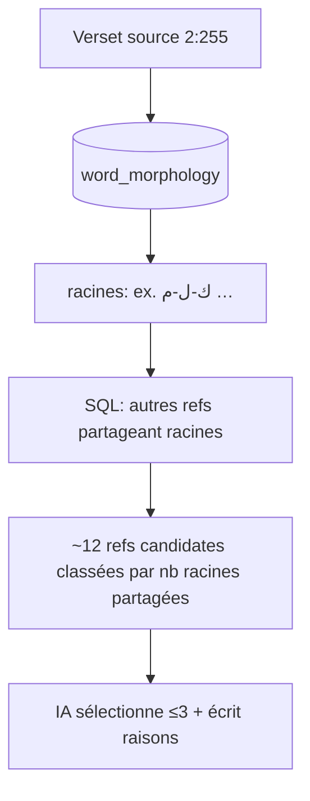
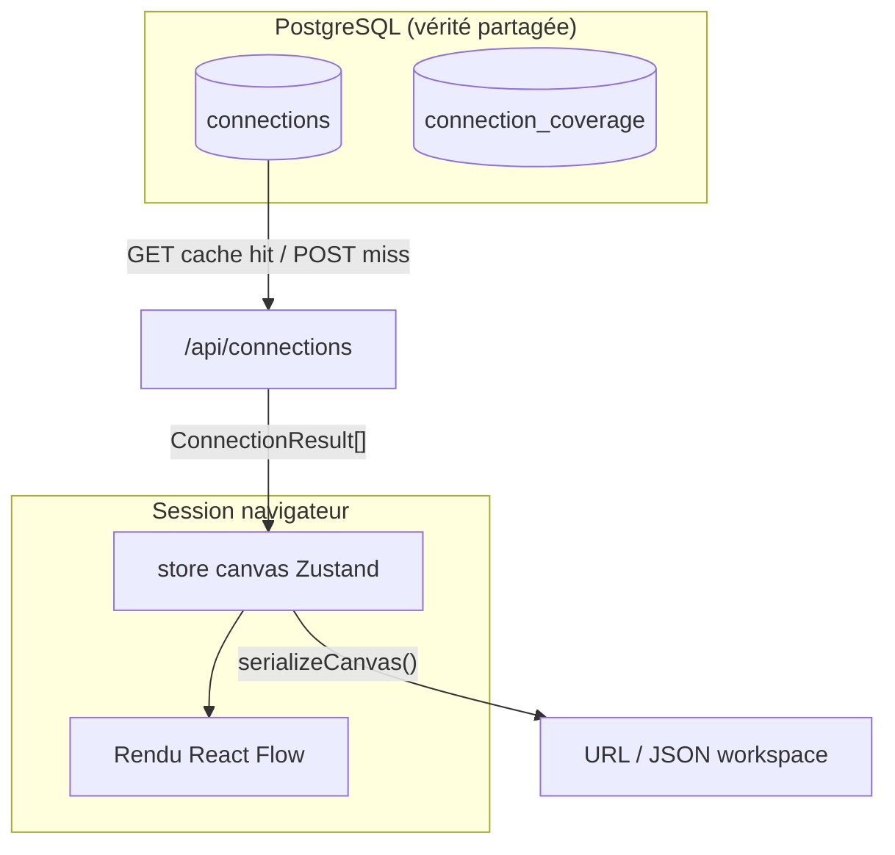
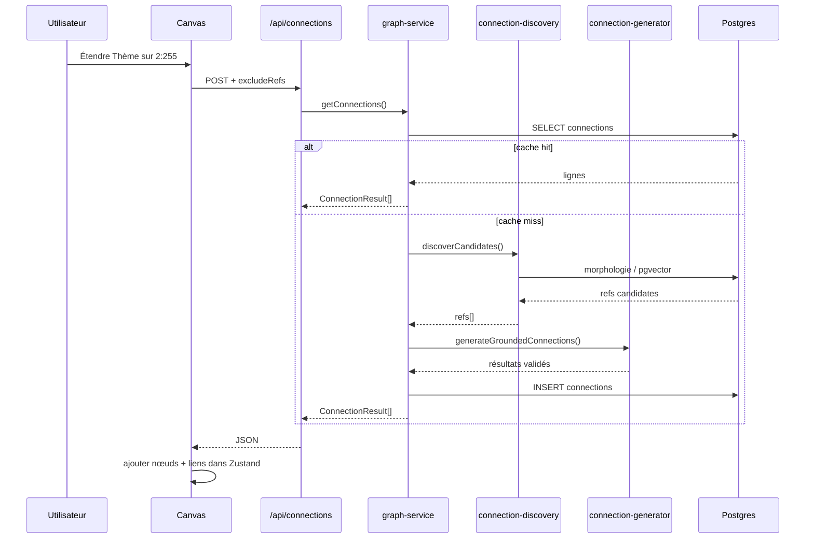

# Phase 2 — Introduction au domaine

> **Prérequis :** [Phase 1 — Qu'est-ce qu'OpenHikmah ?](./phase-1-what-is-openhikmah.md)  
> **Tags de preuve :** **FACT** · **INFERENCE** · **UNKNOWN**

La Phase 2 relie les concepts Coran/IA/recherche aux **modules réels d'OpenHikmah**. Ce n'est pas un cours général sur les *embeddings* ou la morphologie arabe — chaque section finit par *où dans ce dépôt* le concept vit.

---

## Cadre narratif

Avant de suivre le code du canvas, gardez ce pipeline en tête :



**À COMPRENDRE MAINTENANT :** Le texte sacré et les rails d'ancrage sont **insérés dans Postgres**. Les chemins runtime les **lisent** ; le LLM entre seulement après les candidats ou la validation du corpus.

---

## 1. Modèle de données du Coran

### Références sourate et ayah

**FACT :** Un verset est identifié par une ref chaîne `"surah:ayah"` — par ex. `"2:255"` (Ayat al-Kursi).

**FACT :** `isValidRef()` dans `lib/quran/quran-corpus.ts` impose :

| Règle | Exemple |
| --- | --- |
| Format `^\d+:\d+$` seulement | `"2:255"` ✓ · `"02:255"` ✗ |
| Sourate 1–114 | `"115:1"` ✗ |
| Ayah dans le compte Hafs par sourate | `"1:8"` ✗ (Al-Fatiha a 7 ayahs) |
| Orthographe canonique (pas de zéros en tête) | `"2:0255"` ✗ |

**FACT :** Les **noms** de sourate ne sont pas stockés par ligne de verset. Ils sont dérivés à la lecture depuis `lib/quran/surah-names.ts` (commentaire `schema.ts` sur la table `verses`).

**INFERENCE :** Pensez à `ref` comme une clé primaire stable — comme un ID de document Firestore que vous ne laissez pas les utilisateurs inventer, sauf que ici l'espace d'ID est limité par la structure du Coran.

### L'objet `Verse` (type application)

**FACT :** `types/quran.ts` :

```typescript
interface Verse {
  surah: number;
  ayah: number;
  ref: VerseRef;           // "2:255"
  arabicText: string;
  translation: string;
  surahName: string;
  surahNameArabic: string;
}
```

C'est ce dans quoi les résultats de recherche, les nœuds canvas, et les payloads API sont hydratés.

### Corpus local vs fournisseurs distants

OpenHikmah utilise une stratégie de données **à niveaux** :

| Couche | Source | Rôle |
| --- | --- | --- |
| **Primaire** | Postgres `verses` + `verse_translations` | Tout le texte affiché que l'app fait confiance au quotidien |
| **Seeding** | Récupération Coran entier alquran.cloud | Population unique (`scripts/seed-quran.mjs`) |
| **Recherche de secours** | API alquran.cloud par ayah | Quand la ligne locale manque (`lib/quran/verse-resolver.ts`) |
| **Index recherche mot-clé** | quran.com `/api/v4/search` | Trouve des refs par texte ; résultats ré-hydratés depuis le corpus **local** |
| **Localisation noms de sourate** | quran.com `/api/v4/chapters` | Élargit la correspondance de noms de sourate seulement (`lib/quran/chapters.ts`) |

**FACT :** `seed-quran.mjs` récupère :

- Arabe : édition `quran-uthmani`
- Traduction : `en.sahih` (Saheeh International)
- Total attendu : **6236** ayahs

**FACT :** Après le seeding, `lib/quran/quran-corpus.ts` sert le texte des versets depuis Postgres — *« Pure DB access: callers decide on any fallback. »*

**FACT :** `resolveVerse()` essaie le corpus local d'abord ; en échec il log et passe à alquran.cloud en direct. Retourne **`null`** si la ref ne se résout nulle part — utilisé comme validation anti-hallucination.

**FACT :** Route de recherche (`app/api/search/route.ts`) pour les requêtes en forme de ref :

```typescript
// A ref-shaped query that isn't a real verse ... is not a result —
// never fabricate a verse card (AGENTS.md: no invented references).
const verse = isValidRef(q) ? await resolveVerse(q, edition) : null;
```

Les hits mot-clé de quran.com sont aussi **ré-hydratés** via `getVerses()` pour que l'arabe/la traduction correspondent toujours au corpus local, pas au snippet quran.com.

### Éditions de traduction

**FACT :** Traduction par défaut par locale UI (`lib/i18n/config.ts`) :

| Locale | Id édition |
| --- | --- |
| `en` | `en.sahih` |
| `tr` | `tr.diyanet` |
| `ru` | `ru.kuliev` |
| `az` | `az.mammadaliyev` |

**FACT :** La colonne `verses.translation` contient toujours `en.sahih`. Les autres éditions sont dans `verse_translations` (PK composite : `ref + edition`). Une ligne d'édition manquante retombe sur `en.sahih`.

**FACT :** `AGENTS.md` — attribuer les traductions correctement ; Saheeh International depuis alquran.cloud.

**FACT :** `isValidEdition()` met en liste blanche les valeurs cookie/query — les éditions non reconnues retombent au lieu d'être interpolées dans les URLs.

### Modes de recherche (comment le produit mappe au code)

| Intention utilisateur | Route / fonction | Ancrage |
| --- | --- | --- |
| Ref directe `2:255` | `GET /api/search?q=2:255` | `isValidRef` + `resolveVerse` |
| Nom de sourate exact | même route | `matchSurahsByQuery` → payload `matchedSurahs` |
| Mot-clé | même route → `keywordSearch()` | recherche quran.com → hydratation locale |
| Lié par le sens (complémentaire) | même route page 1 → `relatedByMeaning()` | `searchByMeaning()` + pgvector |
| Similaire à ce verset | `GET /api/verse/[s]/[a]/similar` | `similarVerses()` |

**FACT :** Les correspondances sémantiques sur la recherche mot-clé sont **au mieux** et **complémentaires** — les échecs deviennent un tableau `related` vide, invisible pour l'utilisateur (`app/api/search/route.ts` commentaires).

**INFERENCE :** La « recherche par le sens » du README est réalisée à la fois comme la section **Related by meaning** dans la recherche et comme **Similar verses** depuis la barre latérale du verset — pas forcément un bouton de mode séparé.

---

## 2. Ancrage linguistique arabe

### Concepts (minimum)

| Terme | Signification dans ce dépôt |
| --- | --- |
| **Forme de surface** | Le mot tel qu'il apparaît dans le verset (avec diacritiques) |
| **Racine** | Racine arabe trilittère (ou similaire) — ancre morphologique partagée |
| **Lemme** | Forme de dictionnaire associée à un mot |
| **Position** | Index du mot dans l'ayah |

**INFERENCE :** Les versets qui partagent une **racine** partagent souvent un ADN conceptuel même si les traductions anglaises diffèrent. C'est pourquoi « Par racine » est un mode de connexion principal.

### D'où viennent les données de morphologie

**FACT :** `scripts/seed-morphology.mjs` :

- Lit les fichiers commités sous `data/morphology/*.jsonl`
- Générés depuis un **serveur de morphologie coranique canonique** (`fetch_word_morphology` — selon commentaire du script)
- Stocke **seulement les mots avec racine**
- Upsert idempotent sur `(ref, position)`

**FACT :** La couverture est **partielle par conception** — les versets sans lignes de morphologie retombent sur la génération IA **legacy** à la demande (`seed-morphology.mjs` en-tête).

### Comment fonctionne la correspondance de racines (déterministe)

**FACT :** `lib/ai/connection-discovery.ts` → `rootCandidates()` :

1. Sélectionne les racines distinctes pour la source `fromRef` depuis `word_morphology`
2. Trouve d'autres refs partageant ces racines
3. Classe par **nombre de racines partagées distinctes** (décroissant)
4. Exclut la ref source et tout `excludeRefs` (pour « en avoir plus »)

**FACT :** Aucun LLM dans cette étape.

**FACT :** `lib/quran/arabic-morphology.ts` fournit la tokenisation **UI** — correspondance des tokens du verset aux surfaces de morphologie avec arabe normalisé (diacritiques retirés, variantes alif unifiées). Cela alimente le surlignage interactif des racines dans le texte du verset, séparé du SQL de découverte de connexions.



**À COMPRENDRE MAINTENANT :** Les connexions par racine sont du **SQL sur morphologie seedée**, pas la mémoire du modèle — quand les données existent.

---

## 3. Récupération sémantique

### Ce qu'est un *embedding* *ici*

**FACT :** Chaque verset a un vecteur de **768 dimensions** dans `verse_embeddings.embedding` (`schema.ts`).

**FACT :** Les vecteurs sont produits depuis le texte **`translation`** du verset (Saheeh anglais au moment du seed), via Gemini `gemini-embedding-001`, réduit à 768 dims avec `outputDimensionality` (`scripts/embed-corpus.mjs`, `.env.example`).

**INFERENCE :** Le classement est **indexé sur le sens anglais** même quand l'UI montre une traduction turque/russe/azéri — la langue d'affichage et la langue de recherche diffèrent volontairement (`semantic-search.ts` commentaire sur `searchByMeaning`).

### pgvector et similarité

**FACT :** La définition de table inclut un index HNSW avec `vector_cosine_ops` :

```typescript
index("verse_embeddings_hnsw_idx").using("hnsw", t.embedding.op("vector_cosine_ops"))
```

**FACT :** `lib/quran/semantic-search.ts` calcule :

```typescript
const similarity = sql`1 - (cosineDistance(verse_embeddings.embedding, queryVec))`;
// ordered desc — higher = closer in meaning
```

Comparaison avec Firestore : vous pourriez indexer `where('tag', '==', 'patience')`. pgvector résout le **plus proche voisin dans l'espace du sens** — aucun mot-clé commun requis.

### Exemple conceptuel (ancré dans les chemins de code)

> L'utilisateur cherche : *« patience dans l'épreuve »*

1. **FACT :** `searchByMeaning()` normalise la requête → `embedQueryCached()` → *embed* Gemini (ou hit cache Redis, TTL 7 jours).
2. **FACT :** `nearest()` exécute la distance cosinus contre toutes les lignes `verse_embeddings`.
3. **FACT :** Les refs du haut s'hydratent via `getVerses(refs, edition)` — l'utilisateur voit l'arabe + sa traduction choisie.
4. **INFERENCE :** Les résultats peuvent inclure des versets dont la traduction anglaise ne contient jamais le mot « patience » mais qui sont proches sémantiquement dans l'espace d'embedding.

> L'utilisateur étend le verset `2:153` par **Thème**

1. **FACT :** `semanticCandidates("2:153")` → `similarVerses()` charge le vecteur stocké de cette ref → voisins les plus proches (excluant soi + `excludeRefs`).
2. **FACT :** Ces refs deviennent la liste autorisée de l'IA pour la génération thématique ancrée.

### Ce qui est persisté vs calculé en direct

| Donnée | Persisté ? | Où |
| --- | --- | --- |
| Texte des versets | Oui | `verses`, `verse_translations` |
| *Embedding* par verset | Oui | `verse_embeddings` (script hors ligne) |
| *Embedding* de requête | Mis en cache optionnellement | Clé Redis `emb:q:<sha256>` |
| Classement de similarité | Calculé par requête | SQL sur pgvector |
| Raisons de connexion | Oui | `connections.reason` |

**FACT :** `embed-corpus.mjs` est reprenable — saute les refs déjà embedées pour le modèle actuel.

---

## 4. Concepts du graphe de connaissances

### Nœud

**Dans le graphe persistant :** une **ref de verset** (ex. `"2:255"`) — pas un id de nœud canvas.

**Sur le canvas :** un nœud React Flow avec :

**FACT :** `store/canvas.ts` :

- `id` : généré `node-${counter}` — **pas** la ref du verset (le même verset peut apparaître une fois selon la politique de position ; les doublons se lient via les liens)
- `data` : objet `Verse` complet
- `position` : coordonnées de mise en page `{ x, y }`

**INFERENCE :** **Identité** du verset = `ref`. **Identité** du nœud canvas = id opaque `node-N`.

### Lien / connexion

**Persisté (table `connections`) :**

**FACT :** `schema.ts` :

| Colonne | Signification |
| --- | --- |
| `fromRef`, `toRef` | Paire de versets dirigée |
| `kind` | `thematic` \| `root` \| `contrast` |
| `reason` | Texte d'explication généré par l'IA |
| `locale` | Langue de `reason` (`en` canonique) |
| `model` | LLM qui a écrit cette ligne |
| `status` | `active` \| `flagged` \| `retired` |

Index unique sur `(fromRef, toRef, kind, locale)` — une ligne par lien typé dirigé par locale.

**Sur canvas (`SavedEdge` / `CanvasEdge`) :**

**FACT :** Stocke les **ids de nœuds** `source`/`target`, plus `kind`, `label`, `reason` dénormalisés pour le rendu — copiés depuis `ConnectionResult` API quand l'utilisateur étend.

### Graphe vs canvas — la séparation



| | Graphe persistant | État canvas |
| --- | --- | --- |
| **Portée** | Global — tous les utilisateurs profitent du cache | Par session / partage / workspace |
| **Identité** | Refs de versets | Ids de nœuds + mise en page |
| **Liens** | Connexions canoniques pour `(fromRef, kind)` | Liens visuels entre nœuds placés |
| **Survit au rafraîchissement** | Oui (Postgres) | Seulement si URL partagée ou workspace sauvegardé |
| **Coût IA** | Payé une fois par cellule, puis gratuit | Le client re-récupère les lignes en cache |

**FACT :** `lib/ai/graph-service.ts` — *« Reads connections from Postgres; only on a miss does it call the AI, then writes the result back so every later reader gets it for free. »*

**FACT :** Les canvas partagés stockent la mise en page sérialisée des nœuds/liens dans `shared_canvases.data` — la **mise en page d'exploration**, pas le cache global de connexions (Phase 8 ira plus loin).

---

## 5. Ancrage IA — le pipeline de connexion

Cette section est le détail opérationnel derrière la frontière de confiance de la Phase 1. Trace fichier par fichier → **Phase 7**.

### Étape 0 — Ce qui démarre une requête

**FACT :** L'utilisateur étend un nœud sur le canvas → `HikmahCanvas.tsx` `runExpansion()` → `POST /api/connections` avec :

```json
{
  "fromRef": "2:255",
  "kind": "thematic",
  "arabicText": "...",
  "translation": "...",
  "excludeRefs": ["3:18", "..."]
}
```

**FACT :** `excludeRefs` = cibles déjà affichées pour ce nœud+kind (`getExpansionRefs`) — alimente **« en avoir plus »** sans répéter les liens.

### Étape 1 — Lecture du cache

**FACT :** `getConnections()` dans `graph-service.ts` lit les lignes `connections` actives pour `(fromRef, kind, locale)`, excluant `excludeRefs`.

**FACT :** Cache hit → hydrate via `resolveVerse(toRef)` → retour — **pas d'appel IA**.

### Étape 2 — Découverte de candidats (déterministe)

**FACT :** Sur miss, `discoverCandidates(fromRef, kind, limit≈12, excludeRefs)` :

| `kind` | Fonction de découverte |
| --- | --- |
| `root` | SQL sur `word_morphology` |
| `thematic` | `semanticCandidates` → voisins pgvector |
| `contrast` | Mêmes voisins que thématique |

**FACT :** Pour le contraste, la découverte **ne** lance **pas** un détecteur d'opposition séparé — les voisins sémantiques alimentent le pool ; l'IA sélectionne les vraiment contrastants (`connection-discovery.ts` commentaire).

**FACT :** Liste de candidats vide = soit pas de données seedées pour ce verset, soit pool épuisé (si `excludeRefs` non vide).

### Étape 3 — Choix du chemin de génération

**FACT :** `generateConnectionsForCell()` :

```
if candidates.length > 0
  → generateGroundedConnections(candidates)   // préféré
else if excludeRefs.length > 0
  → return []                                 // « en avoir plus » épuisé
else
  → generateConnections()                     // secours legacy
```

**INFERENCE :** Le chemin legacy seulement sur **premier** miss quand les tables d'ancrage sont vides — pas quand l'utilisateur demande plus et le pool est sec.

### Étape 4 — Ce que le LLM reçoit

**Chemin ancré — FACT :** `SELECTION_FALLBACK_TEMPLATE` dans `connection-generator.ts` :

- Ref du verset source, arabe, traduction
- **Liste numérotée de refs candidates + traductions**
- Tâche : sélectionner jusqu'à 3, expliquer chacune
- Règle : *« Choose ONLY from the candidate references listed above »*
- Ajouté : `tanzihDirective()` + directive de langue locale optionnelle

**Chemin legacy — FACT :** Le modèle doit trouver 3 versets de mémoire avec schéma de sortie JSON — toujours Maturidi/Hanafi + Tanzih.

### Étape 5 — Schéma de sortie attendu

**FACT :** Tableau JSON :

```json
[
  { "ref": "3:18", "reason": "One concise theological sentence." }
]
```

Parsé par `parseRawConnections()` — doit trouver `[...]` dans la réponse, types valides, `reason` non vide.

### Étape 6 — Validation post-génération

| Vérification | Ancré | Legacy |
| --- | --- | --- |
| JSON analysable | lance `ConnectionParseError` | même |
| `ref !== fromRef` | ✓ | ✓ |
| `isValidRef(ref)` | ✓ (via ensemble autorisé) | ✓ filtre explicite |
| Ref ∈ ensemble candidat | **`allowed.has(ref)`** | — |
| Verset dans corpus local | hydratation `getVerses()` | `getVerses()` — supprime manquants |
| Max 3 résultats | `.slice(0, 3)` | `.slice(0, 3)` |

**FACT :** Filtre ancré :

```typescript
const allowed = new Set(candidates.map((v) => v.ref));
const chosen = parseRawConnections(text)
  .filter((c) => allowed.has(c.ref) && c.ref !== fromRef)
```

### Étape 7 — Comportement en cas d'échec

| Échec | Comportement |
| --- | --- |
| `ConnectionParseError` | **FACT :** la route API retourne 502 — échec de génération transitoire, pas pool vide |
| `[]` vide bien formé | **FACT :** valide « rien d'approprié » — l'API retourne `[]`, le client affiche un avis |
| Limite de débit | **FACT :** `RateLimitError` → 429 |
| Ancrage manquant + legacy propose refs invalides | **FACT :** supprimés à l'hydratation corpus — peut donner moins de 3 ou `[]` |
| Échec de log vers `ai_generations` | **FACT :** loggé en console ; la génération réussit quand même |

**FACT :** `ConnectionParseError` ne doit **pas** être traité comme pool épuisé (`connection-generator.ts` doc de classe → `connection-batch.ts` s'appuie sur ceci).

### Étape 8 — Persistance et locale

**FACT :** Génération anglaise réussie → `INSERT INTO connections ... ON CONFLICT DO NOTHING`.

**FACT :** Locales non-`en` : **traduire** les chaînes `reason` anglaises — la sélection de versets n'est **jamais** re-dérivée par locale (`graph-service.ts` en-tête).

**FACT :** Générations auditées dans `ai_generations` (fromRef, kind, model, tokens, promptVersion).

### Diagramme de confiance de bout en bout



---

## 6. Résumé de provenance — qui décide quoi

| Question | Décideur | Module |
| --- | --- | --- |
| `2:255` est syntaxiquement valide ? | Code | `isValidRef` |
| Le texte arabe existe ? | Corpus seedé (+ API secours) | `quran-corpus`, `verse-resolver` |
| Quelles refs sont candidats thématiques ? | Similarité pgvector | `semantic-search` |
| Quelles refs sont candidats racine ? | SQL morphologie | `connection-discovery` |
| Quelles 3 refs deviennent des liens ? | Sélection LLM (ancré) ou proposition (legacy) | `connection-generator` |
| Pourquoi le lien est valide ? | `reason` LLM (prompt théologique + Tanzih) | `connection-generator` |
| Ce lien réapparaîtra pour d'autres ? | Cache Postgres | `graph-service` |

---

## Phase 2 — Ce qu'il faut retenir

### À COMPRENDRE MAINTENANT

1. Les **refs** sont `"surah:ayah"` avec validation stricte — les refs mal formées ne deviennent jamais des résultats.
2. Le **corpus local** est autoritaire pour l'affichage ; les APIs externes sont des aides recherche/seed/secours.
3. **Découverte racine = SQL sur `word_morphology`** ; **découverte thème/contraste = voisins pgvector**.
4. Les **embeddings** sont construits depuis le texte de traduction anglais ; le classement sémantique est indexé anglais ; la traduction UI est séparée.
5. **Graphe persistant** (`connections`) ≠ **mise en page canvas** (Zustand) — vérité partagée vs vue personnelle.
6. **IA ancrée** ne peut choisir que parmi les candidats découverts ; **legacy** exige toujours l'hydratation du corpus.

### UTILE PLUS TARD

- `connection_coverage.exhaustedAt` comptabilité admin pour le backfill
- Économie du cache Redis d'embeddings de requête
- Les Noms divins ont un *pattern* d'ancrage parallèle (`name_content`, quran.com search d'abord) — sous-système différent
- Réglage index HNSW, historique des migrations

### IGNORER POUR L'INSTANT

- Tables social/challenge
- Mécanique admin des overrides `prompt_versions`
- Audio `SURAH_LENGTHS` sauf comme utilisé par `isValidRef`

---

## Incertitudes

| Sujet | Statut |
| --- | --- |
| Pourcentage exact de couverture morphologie dans `data/morphology/` | **UNKNOWN** jusqu'à inspection du répertoire data ou rapport admin coverage |
| L'UI expose-t-elle une recherche purement sémantique séparée du mot-clé | **INFERENCE :** surtout « Related by meaning » + API verset similaire, pas un flag de mode dédié |
| Rôle de l'API Quran Foundation au-delà auth/favoris | **UNKNOWN** — Phase 9/10 |
| Fréquence production legacy vs ancré | **INFERENCE :** ancré quand embeddings/morphologie existent pour le verset |

---

## Et ensuite

**Phase 3 — Frontières théologiques et données sacrées :** où Maturidi/Hanafi, Tanzih, vérification des versets, fixtures de test, et exigences de divulgation PR sont encodés comme contraintes logicielles — la carte de *ce que vous ne devez jamais « corriger » à la légère*.

Dites **« continue vers la Phase 3 »** quand vous êtes prêt.

> **Version complète (français B2+) :** [Phase 2](../onboarding-fr/phase-2-domain-primer.md)

---

## Fichiers clés (liste de lecture Phase 2)

| Fichier | Sujet |
| --- | --- |
| `lib/quran/quran-corpus.ts` | Validation ref, corpus local |
| `lib/quran/verse-resolver.ts` | Corpus + secours en direct |
| `app/api/search/route.ts` | Modes de recherche |
| `lib/quran/semantic-search.ts` | Embeddings, requêtes pgvector |
| `lib/ai/connection-discovery.ts` | Candidats racine + sémantiques |
| `lib/ai/connection-generator.ts` | Prompts IA, parsing, validation |
| `lib/ai/graph-service.ts` | Cache, chemin miss, persistance |
| `lib/infra/db/schema.ts` | `verses`, `connections`, `word_morphology`, `verse_embeddings` |
| `scripts/seed-quran.mjs` | Provenance corpus |
| `scripts/seed-morphology.mjs` | Provenance morphologie |
| `scripts/embed-corpus.mjs` | Provenance embeddings |
| `store/canvas.ts` | Types canvas vs graphe |
| `types/quran.ts` | Types de domaine partagés |
