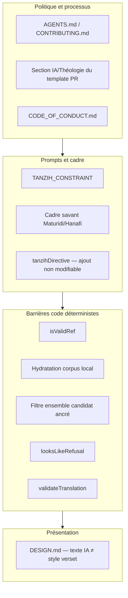

# Phase 3 — Frontières théologiques et données sacrées

> **Prérequis :** [Phase 1](./phase-1-what-is-openhikmah.md) · [Phase 2](./phase-2-domain-primer.md)  
> **Tags de preuve :** **FACT** · **INFERENCE** · **UNKNOWN**

La Phase 3 répond à la question d'ingénierie :

**Où les hypothèses théologiques sont encodées comme contraintes logicielles, contraintes de données, tests, prompts, ou exigences de revue — et que ne devez-vous jamais « corriger » à la légère ?**

Ce n'est pas un cours de théologie. C'est une **carte de sécurité** pour les contributeurs.

---

## Le modèle de garde-fous à trois couches

OpenHikmah protège le contenu sacré par des couches qui se chevauchent — pas un seul interrupteur :



**À COMPRENDRE MAINTENANT :** La théologie ici est appliquée comme la sécurité — **politique + prompts + validation + UI + tests + revue**. Affaiblir une couche parce qu'un test échoue est l'erreur de contributeur la plus dangereuse du dépôt (`AGENTS.md` : *« never fix a failing theological/verse-reference test by loosening the validation »*).

---

## 1. Cadre théologique du projet

**FACT :** `AGENTS.md` Standards théologiques #1 :

> Stay within the **Maturidi/Hanafi tradition** — this is the theological framework of the project. Don't introduce Ash'ari-only positions without noting the difference, and don't conflate schools.

**FACT :** Les prompts IA commencent toujours par le cadre Maturidi/Hanafi, ex. `connection-generator.ts` :

> *« You are a classical Islamic scholar grounded in the Maturidi/Hanafi tradition (Ahl al-Sunnah wal-Jama'ah). »*

Même pattern dans :

- `app/api/names/[slug]/reflection/route.ts`
- `app/api/names/[slug]/verses/route.ts` (`buildReasons`, `fallbackAIVerses`)

**FACT :** Les données statiques des Noms divins (`lib/names/divine-names/data/*.ts`) intègrent des descriptions spécifiques Maturidi — ex. entrées sifat référencent *« seven essential Sifat al-Ma'ani in Maturidi theology »*, *« Maturidi tanzih par excellence »*, *« Qiyam bi-l-nafs »*.

**FACT :** Les Récits prophétiques (`lib/stories/data/*.ts`) suivent une discipline auto-référentielle au Coran — ex. `muhammad.ts` : *« Where the Quran is silent, this story stays silent, per AGENTS.md's theological standards. »*

**INFERENCE :** On ne vous demande pas d'arbitrer les débats entre écoles dans les PR. On vous demande de **rester dans l'école déclarée du projet** ou de divulguer explicitement les écarts dans le template PR.

**UTILE PLUS TARD :** Nuances Ash'ari vs Maturidi sur des attributs spécifiques — seulement si vous touchez aux noms divins ou au contenu des prompts avec guidance du mainteneur.

---

## 2. Tanzih — comment la transcendance est appliquée

### Ce que Tanzih veut dire ici

**FACT :** `lib/ai/theological-constraints.ts` :

```typescript
export const TANZIH_CONSTRAINT =
  "strict Tanzih (divine transcendence): never describe or imply physical form, spatial location, or resemblance to created things (Tashbih)";
```

**FACT :** `AGENTS.md` lie tous les prompts IA qui décrivent des attributs divins à cette formulation.

*Tanzih* (تنزيه) = affirmer que Dieu est au-dessus de toute ressemblance avec les créatures. *Tashbih* (تشبيه) = comparer Dieu aux choses créées — **interdit ici**.

### Où c'est appliqué (non exhaustif mais complet pour les contributeurs)

| Surface | Mécanisme | Emplacement **FACT** |
| --- | --- | --- |
| Raisons de connexion de versets | Ajouté après chaque prompt de connexion via `tanzihDirective()` | `connection-generator.ts` |
| Prompts de connexion (legacy + ancré) | Même ajout — **même si l'override admin DB l'omet** | Test : *« keeps the Tanzih constraint even when an admin's prompt override omits it entirely »* |
| Réflexions noms divins | Inline dans les règles `buildPrompt()` | `reflection/route.ts` |
| Raisons versets noms divins | Dans `buildReasons()` | `names/.../verses/route.ts` |
| Traduction de raisons localisées | Dans le prompt `translateReason()` | `lib/ai/translate.ts` — marqué **THEOLOGICAL-REVIEW TOUCHPOINT** |
| Règles contenu réflexion | Ne jamais égaliser attribut divin et action humaine ; cadrer comme *réponse* du croyant | `reflection/route.ts` règles 1–3 |

### Le pattern d'ajout non modifiable

**FACT :** Les commentaires de `connection-generator.ts` expliquent que `tanzihDirective()` est **volontairement PAS** dans les templates modifiables par DB — il est ajouté après le template résolu (fallback ou ligne `prompt_versions`), comme `languageDirective()`.

**FACT :** Un test prouve qu'un override admin qui retire le cadre savant reçoit toujours le Tanzih :

```typescript
// Simulates a DB-stored prompt_versions override that dropped the Tanzih rule
vi.mocked(getPrompt).mockResolvedValueOnce({ template: `You are a helpful assistant...`, version: 7 });
// ...
expect(prompt).toMatch(/strict tanzih/i);
```

**À COMPRENDRE MAINTENANT :** **Le Tanzih est un ajout obligatoire, pas une suggestion de prompt.** Ne « simplifiez » pas les prompts en retirant le langage de transcendance.

---

## 3. Quel contenu est théologiquement sensible

Traitez ces zones comme **à haut risque** — code + contenu + revue :

| Zone | Pourquoi sensible | Risque si mal géré |
| --- | --- | --- |
| **Texte `reason` de connexion IA** | Présenté comme explication savante pour les liens de versets | Cadre hétérodoxe, Tashbih, liens inventés |
| **Noms divins** (`/names`) | Attributs d'Allah — descriptions, réflexions, versets associés | Anthropomorphisme, mauvaise école, mauvaises refs |
| **Lignes du graphe de connexions** | Persistées, partagées par tous les utilisateurs | Mauvaise théologie à l'échelle globale |
| **Récits prophétiques** | Récit sur les prophètes | Détail sîra/hadith au-delà du Coran, refs invalides |
| **Templates de prompts** (`prompt_versions`, fallbacks) | Oriente toutes les générations futures | Dérive systémique |
| **Traduction des raisons** | La théologie localisée doit préserver les affirmations anglaises | Sens altéré en tr/ru/az |
| **Réflexion Verset du jour** (admin curaté) | Texte éditorial proche du sacré | Même que l'éditorial IA |
| **Suggestions de défis curatés** | Peuvent inclure `verseRef` | Mauvaise ref ou cadre |

**FACT :** `connections.status` supporte `active` | `flagged` | `retired` — l'admin peut désactiver des liens sans migration de schéma (`schema.ts`).

**FACT :** La table `story_flags` cache un slug de récit de la production immédiatement quand la théologie/faits sont faux (`schema.ts` commentaire).

**FACT :** L'overview admin affiche le **nombre de connexions signalées** (`app/api/admin/overview/route.ts`).

**IGNORER POUR L'INSTANT :** Workflows complets de l'UI admin de revue — sachez qu'ils existent ; détails quand vous touchez l'admin.

---

## 4. Vérification des références de versets

### La barrière partagée : `isValidRef`

**FACT :** Une seule fonction dans `lib/quran/quran-corpus.ts` — syntaxe + limites ayah par sourate (voir Phase 2).

**FACT :** Utilisée aux frontières API :

- `app/api/search/route.ts` — requêtes ref
- `app/api/connections/route.ts` — `fromRef`, chaque entrée `excludeRefs`
- `app/api/names/[slug]/verses/route.ts` — filtres secours IA
- `fetchVerseLive` dans `verse-resolver.ts` — avant appel API en direct

### Barrière d'existence du corpus

**FACT :** `generateConnections()` — *« Hydrate from the LOCAL corpus only… a verse that isn't in the corpus can never be persisted. »*

**FACT :** Test d'intégration (`graph.integration.test.ts`) : le modèle retourne `9:999` → supprimé, seule la ligne corpus réelle persiste.

### Barrière candidat ancré (plus stricte)

**FACT :** `generateGroundedConnections()` — `allowed.has(c.ref)` — le modèle ne peut pas citer une ref valide hors de la liste de découverte.

**FACT :** Test : *« rejects any ref the model returns that was not in the candidate set »*.

### Politique

**FACT :** `AGENTS.md` #3 — ne jamais fabriquer de références ; rejeter si la sortie du modèle ne se résout nulle part.

**FACT :** Les tests utilisent des refs valides connues : `2:255`, `1:1`, `112:1` (documenté dans AGENTS.md).

**FACT :** `__tests__/lib/stories.test.ts` — chaque `verseRef` de Récit prophétique doit passer `isValidRef`.

### Ce que les contributeurs ne doivent JAMAIS faire

| Interdit | Pourquoi |
| --- | --- |
| Retourner une carte de verset pour ref invalide/non résolue | La route de recherche interdit explicitement de fabriquer des cartes |
| Assouplir `isValidRef` pour faire passer un test | Anti-pattern documenté dans AGENTS.md |
| Sauter l'hydratation du corpus « pour la performance » | Ouvre la persistance d'hallucinations |
| Utiliser de fausses refs dans les fixtures (`9:999` sauf pour tester le rejet) | Règle données sacrées |

---

## 5. Attribution des traductions

**FACT :** `AGENTS.md` #5 — le projet utilise **`en.sahih` (Saheeh International)** depuis alquran.cloud.

**FACT :** `scripts/seed-quran.mjs` — `TRANSLATION_EDITION = "en.sahih"`.

**FACT :** `lib/i18n/config.ts` met en liste blanche les ids d'édition ; défaut par locale documenté en Phase 2.

**FACT :** Si vous ajoutez une nouvelle source de traduction, AGENTS.md exige une **documentation claire** — pas d'ajouts silencieux de cookies.

**INFERENCE :** Ne changez pas de fournisseur de traduction dans les scripts de seed sans revue mainteneur/théologique — le texte affiché est une sortie face au sacré.

---

## 6. Données de test arabes et coraniques

**FACT :** `AGENTS.md` #4 — *« even in test fixtures and mock data, use real or plausible Arabic text. Don't use placeholder strings like 'lorem ipsum' for Arabic fields. »*

**FACT :** `connection-generator.test.ts` illustre la règle :

```typescript
// Sacred-data rule (AGENTS.md): plausible Arabic + a real translation even in fixtures.
// Al-Fatiha 1:1.
const SOURCE_AR = "بِسْمِ اللَّهِ الرَّحْمَٰنِ الرَّحِيمِ";
const SOURCE_TR = "In the name of Allah, the Entirely Merciful, the Especially Merciful.";
```

**FACT :** `CODE_OF_CONDUCT.md` — traiter les versets coraniques avec respect dans les contextes techniques (fixtures, mocks) ; pas d'usage satirique ou méprisant.

**FACT :** `DESIGN.md` — le texte IA ne doit jamais être stylé comme un verset ; l'arabe utilise **Amiri**, minimum 16px.

---

## 7. Validation de sortie IA au-delà des refs

### Forme d'analyse (connexions)

**FACT :** `ConnectionParseError` lancé quand :

- Pas de tableau JSON dans la réponse (y compris refus comme *« Sorry, I cannot help »*)
- JSON mal formé / type de niveau supérieur incorrect
- Toutes les entrées ont `reason` vide

**FACT :** Les raisons vides sont rejetées — *« every edge on the canvas links to its explanation. »*

### Gestion des refus (sous-système Noms)

**FACT :** `lib/ai/refusal.ts` — `looksLikeRefusal()` détecte les débuts de refus anglais au **début** du texte seulement — évite de supprimer une vraie prose théologique.

**FACT :** Refus détectés sur réflexions / versets noms :

- **Non mis en cache** comme canonique
- **`markRefusal()`** saute le secours Claude→Gemini (`name-content.ts` — refuser puis utiliser silencieusement un autre fournisseur annulerait le refus)

### Validation de traduction

**FACT :** `validateTranslation()` rejette :

- Enveloppes de label (*« Translation: »*)
- Refus
- Écho anglais (traduction inter-langues doit changer le texte)
- Ratio de longueur sauvage

**FACT :** Traduction échouée → `""` → raison anglaise servie, réessai plus tard — **ne jamais persister du contenu poubelle comme théologie localisée**.

---

## 8. Changements de prompts — divulgation et revue

### Template PR (section obligatoire)

**FACT :** `.github/PULL_REQUEST_TEMPLATE.md` — **AI / Theological changes** :

Cases à cocher pour :

- Pas de changements IA/théologie
- Prompt Claude modifié — décrit ci-dessous
- Nouvelles/mises à jour descriptions noms divins — vérifiées contre sources Maturidi/Hanafi
- Changements au cadre théologique
- Bandeau `Generated-By:` pour grands blocs générés par IA

Champ détails : *« Describe any changes to prompts, expected output format, or theological framing. Note any deviations from or additions to the Maturidi/Hanafi tradition. »*

### Quand le remplir

| Changement | Divulgation |
| --- | --- |
| Éditer `LEGACY_FALLBACK_TEMPLATE` / `SELECTION_FALLBACK_TEMPLATE` | Oui |
| Contenu admin `prompt_versions` (si commit tooling/docs) | Oui |
| Texte `TANZIH_CONSTRAINT` | Oui — scrutiny maximal |
| Prompt `translateReason()` | Oui — THEOLOGICAL-REVIEW TOUCHPOINT explicite |
| Données statiques noms divins (`lib/names/divine-names/data/`) | Oui |
| Récit prophétique narratif / verseRefs | Oui |
| Instructions type de connexion (`KIND_INSTRUCTIONS`) | Oui |
| UI pure qui affiche des raisons existantes | Généralement non |

### Attribution IA (commits)

**FACT :** Politique d'attribution IA de `AGENTS.md` :

- **Pas de `Co-Authored-By`**
- Grands fichiers/blocs générés par IA (~30+ lignes, revue humaine minimale) → bandeau commit **`Generated-By: <tool-name>`**
- Divulgation au niveau PR pour prompts / noms divins / cadre théologique

### Issue d'abord pour travail majeur

**FACT :** `CONTRIBUTING.md` — changements significatifs (nouveau comportement IA, PKCE, etc.) → **ouvrir une issue d'abord**.

**FACT :** Le template de demande de fonctionnalité demande une **justification théologique** quand la fonctionnalité affecte la présentation du Coran ou les connexions.

---

## 9. Carte des frontières — où vivent les contraintes

Utilisez ceci comme checklist avant édition :

| Contrainte | Encodée dans |
| --- | --- |
| Cadre Maturidi/Hanafi | Templates de prompts, données noms divins, notes auteur récits, AGENTS.md |
| Tanzih / anti-Tashbih | `TANZIH_CONSTRAINT`, `tanzihDirective()`, règles réflexion, prompt translateReason |
| Pas de refs fabriquées | `isValidRef`, hydratation corpus, ensemble `allowed` ancré, commentaires route recherche |
| Pas de persistance JSON IA invalide | `ConnectionParseError`, filtres raison vide |
| Sélection de versets canonique anglaise | `graph-service.ts`, `name-content.ts`, tests d'intégration |
| Traduction préserve la théologie | `translateReason` + `validateTranslation` |
| IA ≠ verset visuellement | `DESIGN.md`, composants UI ReflectionNote / raison de lien |
| Fixtures de test sacrées | AGENTS.md + conventions fichiers de test |
| Attribution Saheeh / édition | script seed, `lib/i18n/config.ts`, AGENTS.md |
| Refus ≠ contenu canonique | `refusal.ts`, routes names, `markRefusal()` |
| Modération admin | `connections.status`, `story_flags`, files de revue admin |
| Ne jamais affaiblir les gardes pour les tests | Garde-fous AGENTS.md, répétés dans fichiers config agent |
| Revue mainteneur sur auth/admin | `.github/CODEOWNERS` (pas théologie, mais risque élevé adjacent) |

---

## 10. Notes de confiance par sous-système

### Connexions de versets (expansion canvas)

**Chemin préféré :** Découverte → sélection ancrée → corpus → persistance.  
**Chemin legacy :** Exige toujours le corpus.  
**Risque théologie :** **texte `reason` seulement** — les refs sont gardées.

### Noms divins — flux versets

**FACT :** Préféré : **recherche** quran.com pour les refs → `fetchVerseData` valide → l'IA écrit des raisons pour **liste de refs fixe**.

**FACT :** Secours `fallbackAIVerses()` — le modèle propose des refs → **filtre `isValidRef`** → `fetchVerseData` à nouveau.

**INFERENCE :** Le sous-système Noms est **moins strictement ancré que les connexions canvas** sur le chemin secours (le modèle choisit les refs, pas la liste de découverte) — mais les refs doivent toujours passer `isValidRef` + se résoudre.

### Récits prophétiques

**FACT :** Données TypeScript statiques, pas générées par IA au runtime.

**FACT :** Chaque `verseRef` validé en CI via `stories.test.ts`.

**FACT :** L'admin peut cacher via `story_flags` sans redéploiement.

---

## 11. Ce que les contributeurs ne doivent JAMAIS « corriger » à la légère

Ces choses ressemblent à des « échecs de test » ou des « améliorations UX » mais sont des **régressions de garde-fous** :

1. **Assouplir `isValidRef`** (accepter refs avec zéros, ayahs hors plage)
2. **Sauter l'hydratation du corpus** ou persister des refs qui ont échoué `getVerses`
3. **Retirer ou contourner l'ajout `tanzihDirective()`**
4. **Remplacer `TANZIH_CONSTRAINT` par une formulation plus vague** pour réduire les refus du modèle
5. **Traiter `ConnectionParseError` comme succès vide** (masque des générations cassées)
6. **Persister des traductions échouées** comme lignes canoniques de locale
7. **Utiliser lorem ipsum / faux arabe** dans les tests ou démos
8. **Styler les raisons IA comme texte coranique** (viole la règle sacrée DESIGN.md)
9. **Re-sélectionner des versets par locale** pour connexions ou versets noms (casse l'invariant de sélection canonique anglaise)
10. **« Corriger » des tests théologiques échoués en affaiblissant les assertions** au lieu de corriger données/prompts
11. **Réessayer silencieusement les refus avec un autre fournisseur** sur contenu sensible des noms (annule l'intention de `markRefusal()`)
12. **Ajouter des affirmations Ash'ari-only** sans divulgation et distinction d'école

**FACT :** AGENTS.md nomme #10 explicitement comme *« the failure mode most specific to this repo: an agent under test pressure weakening a real guardrail. »*

---

## 12. Comment les tests encodent les standards théologiques/preuve

Tests représentatifs et ce qu'ils prouvent :

| Test | Prouve | Ne prouve PAS |
| --- | --- | --- |
| `connection-generator.test.ts` — supprime `9:999` | Les refs hallucinées ne persistent pas | Le modèle a toujours une bonne théologie |
| `connection-generator.test.ts` — filtre candidat ancré | Ref hors liste supprimée | Qualité de la découverte |
| `connection-generator.test.ts` — Tanzih après override admin | La contrainte survit aux éditions de prompt DB | Tous les prompts théologiquement parfaits |
| `graph.integration.test.ts` — non-en traduit, ne re-sélectionne pas | La locale ne change pas l'ensemble de versets | Qualité de traduction en langue native |
| `stories.test.ts` — tous verseRefs valides | Refs données récit structurellement réelles | Complétude théologique narrative |
| `refusal.test.ts` | La vraie prose n'est pas signalée comme refus | Refus non-anglais détectés |
| `names-ai-validation.test.ts` — Tanzih dans prompts | Les prompts Noms portent la contrainte | Exactitude savante de la sortie |
| `search.test.ts` — pas de carte fabriquée pour mauvaise ref | La recherche respecte l'intégrité des refs | Pertinence mot-clé |

**INFERENCE :** Les tests prouvent **l'intégrité structurelle et la présence des garde-fous** plus souvent que **l'exactitude savante** — la revue humaine/mainteneur reste nécessaire pour le second.

---

## Phase 3 — Ce qu'il faut retenir

### À COMPRENDRE MAINTENANT

1. **École :** Maturidi/Hanafi — défaut du projet, prompts et données noms divins le supposent.
2. **Tanzih :** Centralisé dans `TANZIH_CONSTRAINT`, ajouté de façon non modifiable aux prompts de connexion.
3. **Refs :** `isValidRef` + corpus (+ ensemble candidat ancré) — en couches, jamais optionnel.
4. **Fixtures sacrées :** Arabe réel, refs valides, pas de lorem ipsum.
5. **Divulgation PR :** Changements prompt / nom divin / cadre → template PR + souvent issue d'abord.
6. **Ne jamais affaiblir la validation pour des tests verts** — corriger les données ou les prompts.

### UTILE PLUS TARD

- File de revue connexions admin (`reviewedAt`, statut flagged)
- Workflow admin `prompt_versions`
- Réglage ratio longueur `translateReason` pour scripts compacts
- CODEOWNERS sur auth/admin (sécurité, pas théologie)

### IGNORER POUR L'INSTANT

- Comparaison fiqh complète entre écoles
- Débats qualité théologique Gemini vs Claude
- Rotation de clés boucle admin backfill (opérationnel, pas théologique)

---

## Incertitudes

| Sujet | Statut |
| --- | --- |
| SLA formel de revue théologique mainteneur | **UNKNOWN** — CONTRIBUTING dit « within a few days » pour la revue PR en général |
| Toutes les connexions production sont revues par humain | **INFERENCE :** `reviewedAt` nullable ; file flagged existe — pas tous les liens pré-revus |
| Lint Tanzih automatisé sur sortie générée | **FACT :** Non — seulement contrainte de prompt + revue humaine ; pas de classificateur Tashbih post-hoc trouvé |

---

## Et ensuite

**Phase 4 — Modèle mental d'architecture :** frontières Next.js 16, Zustand, routes API, Postgres, auth — diagramme système complet avec flèches de frontière de confiance.

Dites **« continue vers la Phase 4 »** quand vous êtes prêt.

> **Version complète (français B2+) :** [Phase 3](../onboarding-fr/phase-3-theological-boundaries.md)

---

## Fichiers clés (liste de lecture Phase 3)

| Fichier | Rôle |
| --- | --- |
| `AGENTS.md` | Politique théologique + attribution canonique |
| `CONTRIBUTING.md` | Attentes PR, issue d'abord |
| `.github/PULL_REQUEST_TEMPLATE.md` | Cases de divulgation |
| `CODE_OF_CONDUCT.md` | Respect du texte sacré dans la communauté |
| `lib/ai/theological-constraints.ts` | Source `TANZIH_CONSTRAINT` |
| `lib/ai/connection-generator.ts` | `tanzihDirective()`, cadre savant |
| `lib/ai/translate.ts` | Préservation théologie localisée |
| `lib/ai/refusal.ts` | Détection de refus |
| `lib/quran/quran-corpus.ts` | `isValidRef` |
| `lib/names/name-content.ts` | Politique refus + secours |
| `app/api/names/[slug]/reflection/route.ts` | Règles Réflexion du croyant |
| `app/api/names/[slug]/verses/route.ts` | Ancrage versets noms + secours |
| `DESIGN.md` | Texte IA ≠ verset |
| `__tests__/lib/ai/connection-generator.test.ts` | Tests de régression garde-fous |
| `__tests__/integration/graph.integration.test.ts` | Règles de persistance bout en bout |
