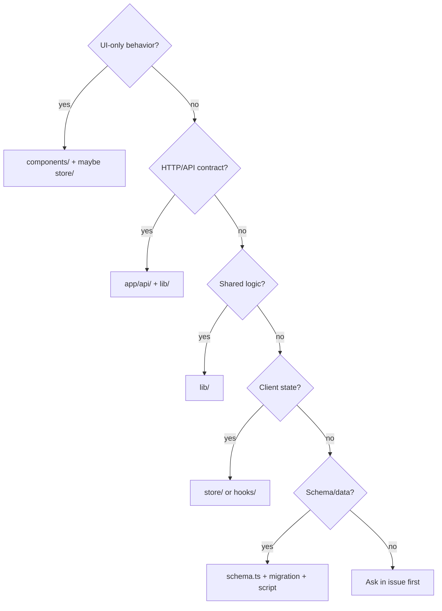

# Phase 5 — Visite du dépôt

> **Prérequis :** [Phase 1](./phase-1-what-is-openhikmah.md) · [Phase 2](./phase-2-domain-primer.md) · [Phase 3](./phase-3-theological-boundaries.md) · [Phase 4](./phase-4-architecture.md)  
> **Tags d'évidence :** **FACT** · **INFERENCE** · **UNKNOWN**

Ceci est une **carte guidée**, pas une liste de dossiers. Chaque zone répond à ces questions : qu'est-ce qui est ici ? Pourquoi ? Qui l'utilise ? Que consomme-t-il ? Quand le modifier ? Quel est le risque pour un nouveau contributeur ?

---

## Structure du dépôt (niveau supérieur)

```text
openhikmah-web/
├── app/              # Next.js App Router — pages + API Route Handlers
├── components/       # React UI (feature-grouped)
├── lib/              # Domain + infra logic (no React)
├── store/            # Zustand client stores
├── hooks/            # Client React hooks
├── types/            # Shared TypeScript types (domain)
├── messages/         # next-intl locale JSON (en, tr, ru, az)
├── i18n/             # next-intl server config
├── __tests__/        # Vitest — mirrors lib/, api/, store/, components/
├── e2e/              # Playwright end-to-end tests
├── scripts/          # Offline seed, migrate, backfill, CI helpers
├── data/             # Committed seed data (morphology JSONL)
├── lib/infra/db/migrations/  # SQL migrations (Drizzle)
├── public/           # Static assets (logo, etc.)
├── docs/onboarding/  # This onboarding series
├── AGENTS.md         # Canonical agent + contributor rules
├── proxy.ts          # Request edge (CSP nonce, maintenance) — Next 16
└── next.config.ts    # Build, headers, next-intl plugin
```

**IGNORER POUR L'INSTANT :** `.agents/skills/`, `.cursor/rules/` — copies outillage agent de `AGENTS.md`, pas du code produit runtime.

---

## Conventions de nommage (prouvées par le dépôt)

Ces règles viennent des patterns du dépôt. **Suivez-les** quand vous ajoutez des fichiers. N'utilisez pas vos habitudes d'autres projets.

| Catégorie | Convention | Exemples | Confiance |
| --- | --- | --- | --- |
| **Lib modules** | `kebab-case.ts` | `graph-service.ts`, `quran-corpus.ts`, `social-auth.ts` | **HIGH** |
| **React components** | `PascalCase.tsx` | `HikmahCanvas.tsx`, `SearchDialog.tsx` | **HIGH** |
| **Component folders** | `kebab-case/` ou feature name | `components/canvas/`, `components/layout/` | **HIGH** |
| **App Router pages** | `page.tsx`, `layout.tsx`, `loading.tsx`, `error.tsx` | Framework-mandated | **FRAMEWORK** |
| **API handlers** | `route.ts` in folder path = URL | `app/api/connections/route.ts` | **FRAMEWORK** |
| **Zustand stores** | `kebab-case.ts`, `useXxxStore` export | `store/canvas.ts` → `useCanvasStore` | **HIGH** |
| **Hooks** | `useCamelCase.ts` | `useCanvasPersistence.ts` | **HIGH** |
| **Types file** | Domain at `types/` root | `types/quran.ts` | **HIGH** |
| **Tests** | Mirror source path + `.test.ts(x)` | `__tests__/lib/ai/graph-service.test.ts` | **HIGH** |
| **E2E** | `kebab-case.spec.ts` | `e2e/canvas.spec.ts` | **HIGH** |
| **Scripts** | `kebab-case.mjs` or `.ts` | `seed-quran.mjs`, `backfill-connections.ts` | **HIGH** |
| **Imports** | `@/` alias → repo root | `import { db } from "@/lib/infra/db"` | **HIGH** |
| **DB columns (Drizzle)** | `camelCase` in TS → `snake_case` in SQL | `fromRef` → `from_ref` | **HIGH** |
| **Edge kind literals** | lowercase string union | `"thematic" \| "root" \| "contrast"` | **EXTERNAL-CONTRACT** |
| **Verse refs** | `"surah:ayah"` string, canonical | `"2:255"` not `"02:255"` | **EXTERNAL-CONTRACT** |
| **Locale cookies** | `oh_locale`, `oh_edition` | Do not rename without migration | **EXTERNAL-CONTRACT** |

**Terminologie produit (à utiliser de façon cohérente) :**

| Terme dans le code/docs | Signification |
| --- | --- |
| **Connection** (connexion) | Arête de graphe sauvegardée (table `connections`) ou API `ConnectionResult` |
| **Canvas edge** (arête canvas) | Arête React Flow dans Zustand (inclut les ids de nœuds de layout) |
| **Verse / ref** (verset / référence) | Identité canonique `"surah:ayah"` |
| **Kind / EdgeKind** (type d'arête) | `thematic`, `root`, `contrast` |
| **Edition** (édition) | Id de traduction, ex. `en.sahih` |
| **Locale** (locale) | Langue UI : `en`, `tr`, `ru`, `az` |
| **Cell** (cellule) | Unité `(fromRef, kind, locale)` dans graph-service / backfill |

**Commentaire obsolète connu (ne pas copier aveuglément) :** Certains anciens commentaires disent `lib/quran-corpus.ts` — le vrai chemin est **`lib/quran/quran-corpus.ts`**.

---

## `app/` — routes (UI + backend HTTP)

**Pourquoi ici :** Convention Next.js App Router (routeur d'application) — structure URL = structure de dossiers.

### Pages utilisateur (`app/<segment>/`)

| Zone | Chemin | Responsabilité | Toucher quand… | Risque |
| --- | --- | --- | --- | --- |
| **Canvas** | `app/canvas/` | Shell du graphe ; `CanvasPageClient` | Entrée canvas, liens profonds `?verse=` | Moyen |
| **Search** (recherche) | `app/search/` | Page de recherche complète | UX recherche | Faible–moyen |
| **Home** (accueil) | `app/page.tsx` | Page d'accueil, Verset du jour | Page marketing | Faible |
| **Names** (noms) | `app/names/` | Pages des 99 Noms | UI noms, pas données statiques | Moyen |
| **Stories** (histoires) | `app/stories/` | Lecteur d'histoires prophétiques | Navigation histoires | Faible–moyen |
| **Surah reader** (lecteur de sourate) | `app/surah/[number]/` | Vue sourate complète | UX lecture | Faible |
| **Bookmarks** (favoris) | `app/bookmarks/` | Versets sauvegardés | UI favoris | Faible |
| **Workspaces** (espaces de travail) | `app/workspaces/` | Canvas sauvegardés (auth) | UX liste espaces | Moyen |
| **Social** (social) | `app/social/` | Amis, défis | Fonctions sociales | Moyen |
| **Settings** (paramètres) | `app/settings/` | Locale, édition, récitateur | UI préférences | Faible |
| **Auth callback** (retour auth) | `app/callback/` | Fin OAuth PKCE | **Rarement** — CODEOWNERS | **Élevé** |
| **Admin** | `app/admin/` | Console opérateur | Fonctions admin | **Élevé** |

**Pattern (FACT) :** Beaucoup de pages = `page.tsx` fin + `*Client.tsx` avec `"use client"` pour l'interactivité.

**Consomme :** `components/*`, `store/*`, `fetch('/api/...')`.  
**Consommé par :** Navigation navigateur seulement.

### API Route Handlers (`app/api/`)

**Pourquoi ici :** Backend serveur pour le SPA (application une page) — secrets, DB (base de données), AI (intelligence artificielle), validation.

| Préfixe | Rôle | Consommateurs clés |
| --- | --- | --- |
| `app/api/search/` | Mot-clé + sémantique lié | `SearchDialog`, page recherche |
| `app/api/connections/` | Expansion graphe (cache + AI) | `HikmahCanvas` |
| `app/api/verse/`, `app/api/verses/` | Fetch verset, similaire, tafsir, morphologie | Canvas, sidebar, lecteur |
| `app/api/share/` | Sauvegarde/chargement partage canvas | `useCanvasPersistence`, image OG |
| `app/api/workspace/` | CRUD canvas nommé | `CanvasToolbar`, flux auth |
| `app/api/bookmarks/`, `app/api/notes/` | Données verset utilisateur | Store auth, page favoris |
| `app/api/auth/` | Exchange, refresh, signout | `CallbackClient`, `Providers` |
| `app/api/social/` | Amis, défis, streaks, mentions | Pages social, activity tracker |
| `app/api/names/` | APIs contenu AI noms | Composants page noms |
| `app/api/admin/` | Prompts, jobs, flags, audit | UI admin — **CODEOWNERS** |
| `app/api/health/`, `metrics/`, `csp-report/` | Ops | Monitoring |

**Invariant :** Valider à la frontière route (`isValidRef`, `requireUser`, `requireAdmin`) avant d'appeler `lib/`.

**Résumé risque :** Tout sous `app/api/admin/`, `app/api/auth/`, `app/callback/` → **élevé**. APIs produit (`search`, `connections`, `verse`) → **moyen** (théologie + validation). `health` → faible.

---

## `components/` — couche présentation

**Pourquoi ici :** UI réutilisable, regroupée par **fonctionnalité produit**, pas seulement par taille atomique.

| Dossier | Contient | Consommé par | Toucher quand… | Risque |
| --- | --- | --- | --- | --- |
| `components/canvas/` | Nœuds, arêtes, expand, toolbar, export | `app/canvas/` | UX canvas, UI expansion | Moyen |
| `components/search/` | Dialog recherche, items liste sourate | Header, canvas, home | Interaction recherche | Faible–moyen |
| `components/layout/` | Header, sidebar, shell auth, nav | La plupart des pages | Chrome global, a11y | Faible–moyen |
| `components/home/` | Hero landing, previews | `app/page.tsx` | Marketing home | Faible |
| `components/ui/` | Boutons, inputs, tooltip (design system) | Partout | Primitives UI partagées | Faible |
| `components/admin/` | UI backfill, coverage, prompts | `app/admin/` | **Admin seulement** | **Élevé** |
| `components/social/` | UI amis, défis | Pages social | UX social | Moyen |
| `components/audio/` | Mini player | `Providers` (global) | Lecture audio | Faible |
| `components/morphology/` | Surlignage arabe interactif | Affichages verset | UI racine mot | Faible |
| `components/today/` | Cartes Verset du jour | Home, route today | Présentation VOTD | Faible |
| `components/providers.tsx` | Restauration session, i18n, sync locale | Root layout | Bootstrap auth | Moyen |

**Convention :** Les composants **fetch** ou reçoivent des données — ils n'importent pas `lib/ai/graph-service` directement (chemins serveur restent dans API/`lib`).

**Règle UI sacrée :** `ReflectionNote`, style raison arête — texte AI visuellement distinct (`DESIGN.md`).

---

## `lib/` — domaine et infrastructure

**Pourquoi ici :** Logique partagée utilisable depuis routes API, scripts et tests — **pas de React**, pas de `"use client"`.

```text
lib/
├── quran/       # Corpus, search, morphology helpers, audio, surah metadata
├── ai/          # Graph service, connection generator, embeddings, prompts
├── canvas/      # Layout math, share validation, export
├── auth/        # PKCE, JWT verify, requireUser
├── i18n/        # Cookie readers, locale config (framework-free)
├── names/       # Divine names data + AI content cache helpers
├── stories/     # Static prophetic story content
├── social/      # Streak, friends, challenges, activity queue
├── admin/       # Admin auth, flags, jobs, coverage, audit
└── infra/       # db, redis, rate-limit, http, metrics, sleep
```

### Guide des modules

| Module | Responsabilité | Appelé par | Risque |
| --- | --- | --- | --- |
| **`lib/quran/quran-corpus.ts`** | `isValidRef`, lectures verset locales | Presque tous chemins Quran | **Élevé** (validation) |
| **`lib/quran/semantic-search.ts`** | Requêtes pgvector, cache embed query | Search API, discovery | Moyen–élevé |
| **`lib/quran/verse-resolver.ts`** | Corpus + fallback live | APIs, hydrate graph | Moyen |
| **`lib/ai/graph-service.ts`** | Cache graphe persistant + chemin miss | `/api/connections`, backfill | **Élevé** |
| **`lib/ai/connection-generator.ts`** | **Seul appelant LLM pour connections** | graph-service | **Élevé** (prompts + théologie) |
| **`lib/ai/connection-discovery.ts`** | Candidats root/sémantiques | graph-service | Moyen |
| **`lib/ai/theological-constraints.ts`** | `TANZIH_CONSTRAINT` | Tous prompts sensibles | **Élevé** |
| **`lib/ai/ai.ts`** | Résolution provider, `callAI`, `embed` | Generator, names, translate | Moyen |
| **`lib/ai/prompt-registry.ts`** | Versions prompt DB | connection-generator | **Élevé** |
| **`lib/auth/social-auth.ts`** | `requireUser`, JWT/JWKS | APIs protégées | **Élevé** (CODEOWNERS) |
| **`lib/auth/pkce.ts`** | OAuth URL builder | Flux sign-in | **Élevé** (CODEOWNERS) |
| **`lib/infra/db/schema.ts`** | Schéma Drizzle — source unique tables | Partout | **Élevé** |
| **`lib/infra/rate-limit.ts`** | Budgets AI/search | Routes API | Moyen |
| **`lib/names/divine-names/`** | Données statiques 99 Noms | Pages/APIs noms | **Élevé** (contenu) |
| **`lib/stories/data/`** | Récits histoires statiques + verseRefs | Pages stories | Moyen (contenu) |

**Quand ajouter du code :** Préférez étendre un module existant plutôt que créer un nouveau dossier top-level. Les helpers one-off restent inline sauf si réutilisés deux fois.

---

## `store/` + `hooks/` — état client

| Fichier | Possède | Persiste | Risque |
| --- | --- | --- | --- |
| `store/canvas.ts` | nodes, edges, selection, expand state | via hook → localStorage | Moyen |
| `store/auth.ts` | token (mémoire), sync bookmarks | bookmarks dans localStorage | Moyen |
| `store/preferences.ts` | locale, edition, reciter, canvas prefs | localStorage + cookies | Faible |
| `store/social.ts` | profile, streak, pending counts | persist partiel | Faible |
| `store/audio.ts` | playback queue | session | Faible |
| `hooks/useCanvasPersistence.ts` | restore share/localStorage, share URL, guest merge | localStorage | Moyen |
| `hooks/useActivityTracker.ts` | posts activité social | queue en mémoire | Faible |
| `hooks/useSignIn.ts` | flux redirect PKCE | — | Moyen |

**Invariant :** Les stores n'appellent pas AI ou DB directement — seulement `fetch('/api/...')`.

---

## `types/` — TypeScript partagé

**FACT :** Actuellement `types/quran.ts` contient les types domaine : `Verse`, `VerseRef`, `EdgeKind`, `ConnectionResult`, `SearchResponse`, `CanvasEdge`, etc.

**Pourquoi séparé :** Importé depuis client et serveur sans tirer React ou Drizzle.

**Quand modifier :** Ajouter des champs aux payloads API ou sérialisation canvas — mettre à jour types **et** tests ensemble.

---

## `messages/` + `i18n/`

| Chemin | Rôle |
| --- | --- |
| `messages/en.json`, `tr.json`, `ru.json`, `az.json` | Chaînes UI (next-intl) |
| `i18n/request.ts` | Config serveur next-intl |
| `lib/i18n/config.ts` | Whitelists locale/edition (importable partout) |
| `lib/i18n/request-prefs.ts` | Lecteurs cookies serveur |

**Toucher quand :** Texte visible utilisateur, labels nav, chaînes erreur — **pas** raisons connection AI (viennent de API/DB).

**Risque :** Faible pour chaînes UI ; moyen si vous mettez du contenu théologique dans messages au lieu des chemins AI validés.

---

## `__tests__/` — tests unitaires + API

**FACT :** `CONTRIBUTING.md` — structure reflète la source :

```text
__tests__/
├── lib/          # Pure logic (graph, corpus, AI parsing, …)
├── api/          # Route handlers (fetch/AI mocked)
├── store/        # Zustand behavior
├── components/   # React Testing Library
├── hooks/        # Hook behavior
├── app/          # Page-level tests
└── integration/  # Real Postgres (Testcontainers)
```

**Convention :** Nom fichier = sujet + `.test.ts` ou `.test.tsx`.

**Quand ajouter :** Toute nouvelle logique dans `lib/` ou changement comportement API/store — même PR que le changement (`AGENTS.md`).

---

## `e2e/` — Playwright

| Spec | Couvre |
| --- | --- |
| `canvas.spec.ts` | Flux canvas |
| `search.spec.ts` | Recherche |
| `a11y.spec.ts` | Accessibilité (axe) |
| `social.spec.ts`, `settings.spec.ts`, `stories.spec.ts`, `admin.spec.ts` | Smoke fonctionnalités |
| `fixtures/auth.ts` | Helpers auth |

**Risque :** Faible à exécuter ; moyen à écrire (besoin serveur dev + DB). CI exécute automatiquement.

---

## `scripts/` — opérations offline

| Script | But | Quand l'exécuter |
| --- | --- | --- |
| `seed-quran.mjs` | Remplir `verses` depuis alquran.cloud | DB locale fraîche |
| `seed-morphology.mjs` | Charger `data/morphology/*.jsonl` | Après clone / mise à jour morphologie |
| `seed-translations.mjs` | Éditions traduction supplémentaires | Test locale |
| `embed-corpus.mjs` | Embeddings Gemini → `verse_embeddings` | Recherche sémantique / thème grounded |
| `migrate.mjs` | Appliquer migrations SQL | Changements schéma |
| `backfill-connections.ts` | Remplissage graphe admin | Ops / travail coverage |
| `prewarm-graph.mjs` | Préchauffer cellules versets populaires | Ops |

**FACT :** Scripts nécessitent `DATABASE_URL` ; script embedding nécessite `GEMINI_API_KEY`.

**Risque :** **Élevé** pour seed/migrate — affecte tous les environnements. Lisez les commentaires d'en-tête du script avant d'exécuter.

---

## `data/` + migrations

| Chemin | Rôle | Risque |
| --- | --- | --- |
| `data/morphology/*.jsonl` | Input seed morphologie commité | **Élevé** (données grounding) |
| `lib/infra/db/schema.ts` | Modèle Drizzle ORM | **Élevé** |
| `lib/infra/db/migrations/*.sql` | Changements schéma versionnés | **Élevé** — doit être réversible, testé intégration |

**FACT :** Migrations `0006_connection_graph.sql`, `0008_semantic_and_morphology.sql` — les noms indiquent les piliers produit majeurs.

---

## `public/` + config racine

| Fichier | Rôle |
| --- | --- |
| `public/logo-mark.png` | Assets marque |
| `app/globals.css` | Design tokens (`@theme`) — **pas de hex hardcodé dans composants** |
| `proxy.ts` | Nonce CSP, flag maintenance |
| `next.config.ts` | Headers sécurité, next-intl, build standalone |
| `.env.example` | Variables env documentées — mettre à jour si vous ajoutez secrets |
| `AGENTS.md`, `CONTRIBUTING.md` | **Lire avant chaque PR** |

---

## `.github/` — CI et templates

| Chemin | Rôle |
| --- | --- |
| `.github/workflows/ci.yml` | lint, typecheck, unit, integration, build, e2e |
| `.github/PULL_REQUEST_TEMPLATE.md` | Cases disclosure AI/théologie |
| `.github/CODEOWNERS` | Revue requise : `app/api/admin/`, `lib/auth/`, `app/callback/`, `next.config.ts` |
| `.github/ISSUE_TEMPLATE/` | Bug + feature (champ rationale théologique) |

**FACT :** Hook pre-push (`.husky/pre-push`) exécute tests intégration — besoin Docker.

---

## « Où mettre mon changement ? » — arbre de décision



Ajoutez **`__tests__/`** à côté de tout changement non trivial `lib/` ou API.

---

## Carte des risques contributeur (nouveau venu)

### Surfaces plus sûres en premier (mais utiles)

| Zone | Exemple de travail | Pourquoi plus sûr |
| --- | --- | --- |
| `components/search/`, `components/layout/` | Focus, a11y, états chargement | UI bornée ; pas de théologie |
| `components/canvas/` (UX seulement) | Toolbar, empty state, tour | Touche UX core ; éviter logique graphe |
| `store/canvas.ts` + tests | Correctness layout/dedup | Testable ; pas de prompts |
| `app/search/` + composants search | Pagination, empty states | Surtout présentation |
| `__tests__/` | Tests régression pour bugs fixés | Haute valeur, scope clair |
| `messages/*.json` | Copie UI (non théologique) | Faible risque code |

### Deuxième / troisième contribution

| Zone | Nécessite |
| --- | --- |
| `lib/quran/semantic-search.ts` | Modèle mental pgvector, embeddings |
| `hooks/useCanvasPersistence.ts` | Sémantique race share/localStorage |
| `app/api/search/route.ts` | Rate limits, chemins recherche dual |
| Social / workspaces | Patterns Auth + Drizzle |

### Attendre de mieux comprendre (Phase 3 s'applique)

| Zone | Pourquoi |
| --- | --- |
| `lib/ai/connection-generator.ts`, prompts | Théologie + validation |
| `lib/ai/theological-constraints.ts` | Texte contrainte sacré |
| `lib/names/divine-names/data/` | Contenu théologique |
| `lib/auth/`, `app/callback/` | Sécurité — CODEOWNERS |
| `app/api/admin/` | Surface admin fail-closed |
| `lib/infra/db/migrations/` | Irréversible sans soin |
| `data/morphology/` | Corpus grounding |

---

## Référence croisée : couches Phase 4 → dossiers

| Couche architecture (Phase 4) | Dossiers principaux |
| --- | --- |
| Pages / routing | `app/` (non-api) |
| API backend | `app/api/` |
| Domain logic | `lib/` |
| UI | `components/` |
| Client state | `store/`, `hooks/` |
| Persistence schema | `lib/infra/db/` |
| Offline data ops | `scripts/`, `data/` |
| Evidence | `__tests__/`, `e2e/` |

---

## Phase 5 — Ce qu'il faut retenir

### À COMPRENDRE MAINTENANT

1. **`app/`** = URLs ; **`app/api/`** = backend ; **`lib/`** = logique partagée ; **`components/`** = UI.
2. **Les tests reflètent la source** sous `__tests__/` — ajoutez des tests avec les changements de comportement.
3. **Nommage :** kebab-case lib/scripts, PascalCase composants, hooks `useX`, imports `@/`.
4. **Chemins à haut risque :** prompts `lib/ai/*`, `lib/auth/`, admin, migrations, données morphologie.
5. **Les composants n'importent jamais graph-service** — expand va navigateur → API → lib.

### UTILE PLUS TARD

- Carte complète module admin (`lib/admin/*`)
- `e2e/fixtures/auth.ts` pour tests connectés
- Workflow numérotation migrations Drizzle
- `components/layout/nav-items.ts` comme source unique nav

### IGNORER POUR L'INSTANT

- Copies agent repo-local `.agents/skills/`
- `scripts/deploy.sh` (ops)
- Historique fichiers migration individuels au-delà de « ils existent »

---

## Incertitudes

| Sujet | Statut |
| --- | --- |
| Si nouvelles zones domaine doivent avoir `lib/<area>/` top-level vs nesting | **INFERENCE :** suivre les siblings existants (`lib/social/`, `lib/canvas/`) |
| Split planifié de `types/quran.ts` quand types grandissent | **UNKNOWN** — un seul fichier types aujourd'hui |

---

## Et ensuite

**Phase 6 — Parcours runtime core :** 3–5 flux tracés avec symboles et chemins exacts (search, expand, share, auth bookmark).

Dites **« continue to Phase 6 »** quand vous êtes prêt.

---

## Référence rapide — « si je veux X, ouvrir Y »

| Je veux… | Commencer ici |
| --- | --- |
| Changer comportement expand | `components/canvas/HikmahCanvas.tsx` → `app/api/connections/route.ts` → `lib/ai/graph-service.ts` |
| Fixer ref invalide qui passe | `lib/quran/quran-corpus.ts` (`isValidRef`) |
| Changer prompt connection | `lib/ai/connection-generator.ts`, `lib/ai/prompt-registry.ts` |
| Changer résultats search | `app/api/search/route.ts`, `lib/quran/semantic-search.ts` |
| Changer save/share canvas | `hooks/useCanvasPersistence.ts`, `app/api/share/` |
| Changer sign-in | `lib/auth/pkce.ts`, `app/callback/`, `app/api/auth/` |
| Ajouter colonne DB | `lib/infra/db/schema.ts` + nouvelle migration + test intégration |
| Ajouter chaîne UI | `messages/<locale>.json` |
| Comprendre tests graphe | `__tests__/integration/graph.integration.test.ts` |

> **Version complète (français B2+) :** [Phase 5](../onboarding-fr/phase-5-repository-tour.md)
