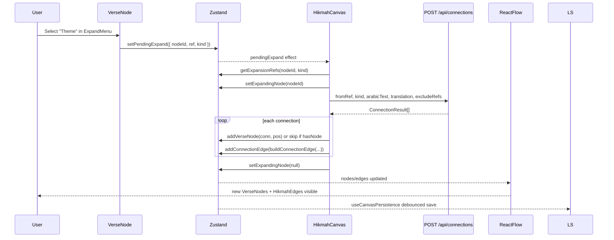

# Phase 8 — Modèle d'état et canvas

> **Prérequis :** Phases [1](./phase-1-what-is-openhikmah.md)–[7](./phase-7-grounded-ai-connections.md)  
> **Tags d'évidence :** **FACT** · **INFERENCE** · **UNKNOWN**

La Phase 7 a tracé comment les connections AI sont **générées et cachées dans Postgres**. La Phase 8 répond : **ce que l'utilisateur voit et manipule sur le canvas infini** — et comment cet état session est stocké, partagé et restauré.

**Phrase centrale (à mémoriser) :**

> Le canvas est un **graphe de layout session** ; Postgres `connections` est le **graphe de connaissance produit**. Ils se chevauchent en sens mais pas en stockage.

---

## Trois graphes (ne pas confondre)

| Graph | Where | What it stores | Survives refresh? |
| --- | --- | --- | --- |
| **Postgres `connections`** | Server DB | Arêtes générées AI : `(fromRef, toRef, kind, reason, locale)` | Oui — partagé par tous utilisateurs |
| **Zustand canvas** | Browser memory | Nœuds/arêtes React Flow + état UI chrome | Jusqu'à fermeture onglet sauf autosave |
| **`SavedCanvas` JSON** | localStorage / `shared_canvases` / `saved_workspaces` | Layout sérialisé + snapshots versets + raisons arêtes | Dépend du canal |

**FACT :** Expand un verset appelle `POST /api/connections` (Phase 7), puis **copie** le résultat dans Zustand. Le canvas ne lit pas Postgres `connections` directement au render.

**INFERENCE :** Deux utilisateurs avec le même verset source peuvent voir les mêmes raisons AI (cache hit) mais **layouts différents** sauf s'ils partagent un snapshot canvas.

---

## Architecture : qui possède quoi

```mermaid
flowchart TB
  subgraph zustand ["Zustand — useCanvasStore (store/canvas.ts)"]
    N[nodes: Node[]]
    E[edges: Edge[]]
    UI[pendingExpand, sidebarContent, viewport, ...]
    DERIV[duplicateNodeIdsByRef, expansionCountsByNode]
  end

  subgraph xyflow ["@xyflow/react — HikmahCanvas.tsx"]
    RF[ReactFlow controlled component]
    ONC[onNodesChange / onEdgesChange]
    RENDER[VerseNode + HikmahEdge rendering]
  end

  subgraph persist ["Persistence channels"]
    LS[(localStorage open-hikmah-canvas)]
    SHARE[(shared_canvases Postgres)]
    WS[(saved_workspaces Postgres)]
  end

  subgraph layout ["Layout — lib/canvas/canvas-layout.ts"]
    FFS[findFreeSlot]
    BCE[buildConnectionEdge]
    VC[viewportCenter]
  end

  N --> RF
  E --> RF
  RF --> ONC --> N
  ONC --> E
  serializeCanvas --> LS
  serializeCanvas --> SHARE
  serializeCanvas --> WS
  LS --> restoreCanvas
  SHARE --> restoreCanvas
  WS --> appendWorkspace
  FFS --> addVerseNode
  BCE --> addConnectionEdge
```

| Layer | Owns | Does NOT own |
| --- | --- | --- |
| **Zustand** | Source de vérité pour nodes, edges, selection, expansion queue, payload sidebar | Appels LLM, graphe Postgres, physique drag React Flow |
| **React Flow** | Render pan/zoom, gestes drag nœud, chemins arêtes, minimap | Texte verset, génération AI, format persistence |
| **`canvas-layout.ts`** | Placement sans collision, construction id arête | Mutations store (appelants invoquent store après calcul position) |
| **`useCanvasPersistence`** | Autosave localStorage, restore `?share=`, merge invité→workspace | Persistence viewport (non sauvegardé) |

---

## Qu'est-ce qu'un nœud ?

### Objet domaine

**FACT :** Un nœud canvas représente une **instance placée** d'un `Verse` (`types/quran.ts`) :

```typescript
interface Verse {
  surah: number;
  ayah: number;
  ref: VerseRef;           // "2:255"
  arabicText: string;
  translation: string;
  surahName: string;
  surahNameArabic: string;
  isRoot?: boolean;        // first/search node styling
  isLoading?: boolean;
}
```

### Wrapper React Flow

**FACT :** Stocké comme `Node` de `@xyflow/react` :

| Field | Value |
| --- | --- |
| `id` | `node-${n}` — compteur client monotone (`nextId()` dans `store/canvas.ts`) |
| `type` | `"verse"` → rend `VerseNode` |
| `position` | `{ x, y }` coordonnées flow |
| `data` | Champs `Verse` étalés |

### ID nœud vs identité verset

| Concept | Key | Notes |
| --- | --- | --- |
| **Node ID** | `node-42` | Éphémère par session canvas ; remappé sur collision `appendWorkspace` |
| **Verse identity** | `verse.ref` (`"2:255"`) | Référence Coran canonique ; **même ref peut apparaître sur plusieurs nœuds** |

**FACT :** `duplicateNodeIdsByRef` mappe chaque `ref` → tous les ids nœuds le partageant. `VerseNode` montre un indicateur doublon quand un autre nœud a la même ref.

**FACT :** `hasNode(ref)` retourne true si **n'importe quel** nœud porte cette ref — utilisé pour éviter empiler doublons depuis URL/deep links, mais expansion peut **dessiner une arête** vers nœud existant au lieu de créer un second.

---

## Qu'est-ce qu'une arête ?

### Objet domaine

**FACT :** `CanvasEdge` (`types/quran.ts`) :

```typescript
interface CanvasEdge {
  id: string;
  source: string;   // source node id
  target: string;   // target node id
  type: "hikmah";
  data: { kind: EdgeKind; label: string; reason?: string };
}
```

| Field | Meaning |
| --- | --- |
| `kind` | `"thematic" \| "root" \| "contrast"` — pilote couleur + comptage expansion |
| `label` | Raison tronquée (≤60 chars) affichée sur pill arête |
| `reason` | Explication AI complète — affichée dans `ContextSidebar` au clic arête |

### ID arête et déduplication

**FACT :** `buildConnectionEdge(sourceNodeId, targetNodeId, conn)` (`lib/canvas/canvas-layout.ts`) :

```typescript
id: `edge-${sourceNodeId}-${targetNodeId}`
```

**FACT :** Les arêtes sont **dirigées** en stockage (`source` → `target`) mais `addConnectionEdge` traite `(A,B)` et `(B,A)` comme doublons :

| Result | Meaning |
| --- | --- |
| `"added"` | Nouvelle arête insérée |
| `"duplicate-same-kind"` | Même paire + même kind existe déjà — skip silencieux |
| `"duplicate-different-kind"` | Même paire, kind différent — notice UI dans `runExpansion` |

**FACT :** `getExpansionRefs(nodeId, kind)` filtre `e.source === nodeId && e.data.kind === kind` — seules arêtes expansion **sortantes** comptent pour liste exclude « get more » (Phase 7).

---

## Carte des champs store Zustand

**Where :** `store/canvas.ts` → `useCanvasStore`

### Données graphe

| Field | Purpose |
| --- | --- |
| `nodes`, `edges` | État contrôlé React Flow |
| `onNodesChange`, `onEdgesChange` | Appliquer drag/select/delete via `applyNodeChanges` / `applyEdgeChanges` |

### Index dérivés (recalculés à mutation)

| Field | Purpose |
| --- | --- |
| `duplicateNodeIdsByRef` | Détection doublon O(1) par ref |
| `expansionCountsByNode` | Comptes arêtes sortantes par kind (badges menu expand) |

### UI / orchestration async (non sérialisé)

| Field | Purpose |
| --- | --- |
| `selectedNodeId` | Sélection actuelle |
| `expandingNodeId` | Montre spinner sur nœud pendant `runExpansion` |
| `openExpandNodeId` | Quel menu expand nœud est ouvert |
| `sidebarContent` | Payload `ContextSidebar` (détail nœud ou arête) |
| `pendingExpand` | `{ nodeId, ref, kind }` — consommé par effet `HikmahCanvas` |
| `pendingAutoExpand` | Expand thematic premier nœud après search |
| `pendingPanToNodeId` | Pan caméra après search-add |
| `newlyAddedNodeId` | Animation pulse sur nœud frais |
| `viewport` | `{ x, y, zoom }` — mis à jour sur pan/zoom |
| `sidebarWidth` | Sidebar redimensionnable |
| `fitRequestToken` | Signal cross-tree pour `fitView()` (barre mobile) |
| `restoreToken` | Bumpé sur restore bulk — activity tracker distingue restore vs add utilisateur |

### Mutations que vous toucherez comme contributeur

| Action | Function | Typical caller |
| --- | --- | --- |
| Add one verse | `addVerseNode(verse, position?)` | Search, expansion, URL `?verse=` |
| Add full surah column | `addSurahNodes(verses[])` | URL `?surah=` |
| Add AI edge | `addConnectionEdge(edge)` | `runExpansion` |
| Wipe canvas | `reset()` | Toolbar clear (confirm armé) |
| Replace graph | `restoreCanvas(saved)` | Lien share, localStorage |
| Merge graph | `appendWorkspace(saved)` | Charger workspace sauvegardé |

---

## Responsabilités React Flow

**Where :** `components/canvas/HikmahCanvas.tsx`

**FACT :** `HikmahCanvas` wrap `ReactFlowProvider` → `CanvasInner`.

| Registration | Component |
| --- | --- |
| `nodeTypes.verse` | `VerseNode` |
| `edgeTypes.hikmah` | `HikmahEdge` |

**FACT :** React Flow est **contrôlé** : `nodes={nodes}` et `edges={edges}` depuis Zustand ; changements reviennent via `onNodesChange` / `onEdgesChange`.

**FACT :** `HikmahCanvas` est importé dynamiquement avec `ssr: false` dans `CanvasPageClient.tsx` — canvas nécessite APIs navigateur et React Flow.

**FACT :** `onlyRenderVisibleElements` activé pour performance sur grands graphes.

### Ce que React Flow fait vs Zustand

| User gesture | React Flow | Zustand |
| --- | --- | --- |
| Drag node | Émet changement position | `onNodesChange` update `nodes` |
| Pan/zoom | Update transform interne | `onMove` → `setViewport` |
| Click edge | `onEdgeClick` | `setSidebarContent({ type: "edge", ... })` |
| Click pane | `onPaneClick` | Ferme menu expand |

**INFERENCE :** React Flow possède **physique interaction éphémère** ; Zustand possède **état graphe durable** que la logique app lit.

---

## Responsabilité layout

**Where :** `lib/canvas/canvas-layout.ts`

| Helper | Used when |
| --- | --- |
| `findFreeSlot(existing, anchor)` | Recherche spirale position sans chevauchement (nœud 288×240 + gap 48px) |
| `viewportCenter(viewport, w, h)` | Search-add ancre au centre visible |
| `radialPos(source, i, total)` | Expansion étale enfants en arc (`HikmahCanvas.tsx`) |
| `buildConnectionEdge(...)` | Construit id arête + troncature label |

**FACT :** Placement expansion lit position source **live** chaque itération — drag pendant expansion déplace l'origine du fan.

**FACT :** Midpoints label arête sont traités comme obstacles layout pour que nouveaux nœuds ne couvrent pas pills raison AI.

---

## Sérialisation : `SavedCanvas`

**Where :** `store/canvas.ts` → `serializeCanvas` / `deserializeCanvas`

```typescript
interface SavedCanvas {
  v: 1;
  nodes: SavedNode[];  // { id, x, y, verse }
  edges: SavedEdge[];  // { id, source, target, kind, label, reason }
}
```

### Ce qui est inclus

| Included | Excluded |
| --- | --- |
| IDs nœuds, positions, snapshots `Verse` complets | `viewport` (pan/zoom) |
| Endpoints arêtes, kind, label, reason | État UI (sidebar, selection, queues pending) |
| Version `v: 1` | IDs lignes connection Postgres |

**FACT :** Le texte verset dans JSON sauvegardé est un **snapshot au moment save** — si traductions corpus changent côté serveur, canvas restauré montre encore ancien texte jusqu'à re-fetch nœuds (pas de re-hydratation automatique au restore).

**UNKNOWN :** Si mainteneurs planifient re-sync corpus au restore — pas implémenté aujourd'hui.

---

## Canaux de persistence

### 1 — localStorage (invité + connecté)

**Where :** `hooks/useCanvasPersistence.ts`

| Detail | Value |
| --- | --- |
| Key | `open-hikmah-canvas` (`CANVAS_STORAGE_KEY`) |
| Trigger | Débouncé 800ms après changement `nodes`/`edges` |
| Flush | Événement `pagehide` — flush sync avant navigation |
| Clear | Quand `nodes.length === 0`, clé retirée |
| Auth | **Non requis** |

**FACT :** Porte `hydratedRef` empêche autosave d'écraser données restaurées pendant fetch initial `?share=`.

**FACT :** Ordre mount : fetch `?share=<uuid>` d'abord → à l'échec fallback localStorage → puis activer autosave.

### 2 — Share URL (public, éphémère)

**Flow :**

```text
CanvasToolbar.handleShare
  → serializeCanvas(nodes, edges)
  → POST /api/share  (max 512KB, validates nodes via isValidNode)
  → UUID stored in shared_canvases
  → URL: /canvas?share=<uuid>
Recipient:
  useCanvasPersistence mount
  → GET /api/share/[id]
  → restoreCanvas(saved)
  → strip ?share= from URL
```

**FACT :** Nettoyage TTL share : 5% des POSTs suppriment lignes > 30 jours (`app/api/share/route.ts`).

**FACT :** Auth **non requise** pour créer ou ouvrir lien share (rate-limité par IP).

### 3 — Saved workspaces (authentifié)

**Flow :**

```text
CanvasToolbar.handleSave (requires accessToken)
  → POST /api/workspace { name, data: SavedCanvas, nodeCount }
  → saved_workspaces row keyed by userId

Workspaces page load:
  → GET /api/workspace/[id]
  → appendWorkspace(saved)   // merge, not replace
  → router.push("/canvas")
```

**FACT :** `appendWorkspace` vs `restoreCanvas` :

| Function | Behavior |
| --- | --- |
| `restoreCanvas` | **Remplace** canvas entier ; reset queues UI ; sync `nodeIdCounter` |
| `appendWorkspace` | **Fusionne** graphe entrant ; remap ids en collision ; skip paires arêtes doublons ; `findFreeSlot` pour placement |

**FACT :** Merge invité à sign-in : `mergeGuestWorkspace(accessToken)` POST canvas localStorage une fois, set flag `open-hikmah-guest-merged` (`useCanvasPersistence.ts`).

### 4 — Paramètres URL deep-link (pas état canvas complet)

**Where :** `app/canvas/CanvasPageClient.tsx` → `VerseLoader`

| Param | Effect |
| --- | --- |
| `?verse=2:255` | Fetch API verset → `addVerseNode` → `setPendingAutoExpand` → nettoie URL |
| `?surah=2` | Fetch tous ayahs → `addSurahNodes(missing)` → `requestFit` → nettoie URL |

**FACT :** Ces params ajoutent contenu au canvas **actuel** (ou skip si ref déjà présente) — ils n'encodent pas le layout.

---

## Qu'est-ce qui survit au refresh ?

| Data | Survives browser refresh? | Mechanism |
| --- | --- | --- |
| Canvas nodes/edges | **Oui** (même navigateur) | Autosave localStorage |
| Pan/zoom viewport | **Non** | Pas dans `SavedCanvas` ; React Flow refit au load |
| Share snapshot | **Oui** (TTL serveur 30 jours) | UUID dans URL ou lien collé |
| Saved workspace | **Oui** (jusqu'à suppression) | Postgres + auth |
| Postgres `connections` | **Oui** (global) | Indépendant du canvas |
| Bookmarks | **Oui** | Persist `store/auth.ts` + sync API |
| UI preferences (minimap) | **Oui** | `store/preferences.ts` → `open-hikmah-preferences` |

---

## Qu'est-ce qui nécessite authentification ?

| Feature | Guest | Signed in |
| --- | --- | --- |
| Build canvas locally | Yes | Yes |
| Expand (AI connections) | Yes* | Yes* |
| Share link | Yes | Yes |
| Save workspace | No — « Sign in to save » | Yes |
| List/load/delete workspaces | No | Yes |
| Guest canvas → cloud merge | N/A | Once on login |

\* Sous réserve rate limits sur chemin miss AI — pas gated par auth.

---

## Mutation tracée : expand nœud → render

La boucle mutation état canonique (connecte Phase 7 à Phase 8) :



### Pas à pas

| Step | Where | State change |
| --- | --- | --- |
| 1 | `VerseNode.handleExpandSelect` | `pendingExpand` set |
| 2 | `HikmahCanvas` effect | `pendingExpand` cleared ; `runExpansion` starts |
| 3 | `runExpansion` | `expandingNodeId = nodeId` ; `excludeRefs` from edges |
| 4 | Network | `ConnectionResult[]` returned |
| 5 | Per result | `radialPos` + `findFreeSlot` → `addVerseNode` **or** edge-only if ref exists |
| 6 | Per result | `buildConnectionEdge` → `addConnectionEdge` |
| 7 | Finally | `expandingNodeId = null` ; `reactFlow.fitView` |
| 8 | Persistence | 800ms later → localStorage `serializeCanvas` |

**FACT :** `addVerseNode` set aussi `newlyAddedNodeId` pour animation pulse et recalcule `duplicateNodeIdsByRef`.

**FACT :** `addConnectionEdge` recalcule `expansionCountsByNode` — badges menu expand se mettent à jour immédiatement.

---

## Mutation tracée : search → premier nœud

| Step | Where | State change |
| --- | --- | --- |
| 1 | `SearchDialog.selectResult` | Fetch `/api/verse/...` |
| 2 | Position | `viewportCenter` + `findFreeSlot` si canvas non-vide |
| 3 | `addVerseNode({ ...verse, isRoot: isFirst }, position)` | Nouveau nœud à position calculée |
| 4 | First node only | `setPendingAutoExpand(nodeId)` → expand thematic |
| 5 | Search on populated canvas | `setPendingPanToNode(nodeId)` |
| 6 | Persistence | Autosave après debounce |

---

## Sidebar et présentation arête

**FACT :** Clic arête → `setSidebarContent({ type: "edge", fromVerse, toVerse, reason, kind, label })` → `ContextSidebar` affiche raison AI avec **style éditorial** (pas style scripture — voir Phase 3 / `DESIGN.md`).

**FACT :** `HikmahEdge` colore par kind : variables CSS thematic / root / contrast ; label est `reason` tronqué.

---

## Comparaison : ingénieur habitué à Firestore

| If you're thinking… | OpenHikmah canvas actually… |
| --- | --- |
| Document = verse | **Node instance** = verse + position ; même ref peut avoir plusieurs documents |
| Collection sync | **Pas de sync temps réel** — localStorage + save/share manuel optionnel |
| Server authoritative layout | **Client authoritative** layout ; serveur stocke snapshots sur share/save |
| Graph edges in DB | **Deux couches** — Postgres `connections` (cache AI) vs arêtes canvas (session) |

---

## Tests clés

| File | What it locks |
| --- | --- |
| `__tests__/store/canvas.test.ts` | serialize/deserialize, getExpansionRefs, remap id appendWorkspace, dedupe |
| `__tests__/lib/canvas/canvas-layout.test.ts` | findFreeSlot, buildConnectionEdge |
| `__tests__/hooks/useCanvasPersistence.test.ts` | Restore share, merge invité, porte hydration |
| `__tests__/components/canvas/HikmahCanvas.test.tsx` | Boucle expansion, vide vs épuisé |
| `__tests__/app/canvas/CanvasPageClient.test.tsx` | Params URL `VerseLoader` |

---

## Modes d'échec

| Symptom | Likely cause |
| --- | --- |
| Refresh perd canvas | localStorage bloqué/quota ; ou effacé avant hydration |
| Share ouvre vide | UUID invalide/expiré ; fallback localStorage |
| Load workspace empile bizarrement | `appendWorkspace` fusionne — attendu ; utilisez clear d'abord si vous vouliez replace |
| Nœuds doublons même ref | Autorisé par design ; indicateur montré sur nœud |
| Viewport saute au reload | Viewport non persisté ; `fitView` tourne sur premiers nœuds |
| Bouton save absent | Pas connecté — invité utilise localStorage seulement |

---

## À COMPRENDRE MAINTENANT

1. **L'état canvas vit dans Zustand** — React Flow est une vue contrôlée.
2. **ID nœud ≠ ref verset** — refs peuvent se répéter ; ids sont générés client.
3. **`SavedCanvas` sauve layout + snapshots** — pas graphe Postgres, pas viewport, pas queues UI.
4. **`restoreCanvas` remplace ; `appendWorkspace` fusionne** — sémantiques différentes.
5. **Expansion écrit dans Zustand** après retour API — pipeline Phase 7 finit dans `addVerseNode` / `addConnectionEdge`.
6. **localStorage fonctionne sans auth** — workspaces et merge nécessitent sign-in.

---

## UTILE PLUS TARD

- `lib/canvas/canvas-export.ts` — export PNG/PDF depuis toolbar (nœuds seulement, pas arêtes dans chemin PNG).
- `hooks/useActivityTracker.ts` — signaux streak/social ; utilise `restoreToken` pour ignorer restores bulk.
- `components/home/PersonalHome.tsx` — « continue where you left off » lit `CANVAS_STORAGE_KEY`.
- Retrait arête dans admin Postgres — ne retire pas auto arêtes canvas.

---

## IGNORER POUR L'INSTANT

- Ordre playback graphe audio dans toolbar (`playGraph`) — orthogonal à persistence graphe.
- Overlay onboarding `CanvasTour` — UX seulement.
- Génération image OG pour shares — preview social, pas chemin restore.

---

## Questions checkpoint Phase 8

1. Quelles trois couches stockage contiennent des données « graph-like », et comment diffèrent-elles ?
2. Pourquoi le même `verse.ref` peut apparaître sur deux nœuds, et que vérifie `hasNode` ?
3. Quels champs sont dans `SavedCanvas`, et qu'est-ce qui est délibérément omis ?
4. Quelle est la différence entre `restoreCanvas` et `appendWorkspace` ?
5. Tracez `getExpansionRefs` — quelles arêtes comptent pour « get more » ?

---

**Next :** [Phase 9 — Database and semantic search](./phase-9-database-and-semantic-search.md) — schéma Postgres, Drizzle, pgvector, seeding, et tests intégration en profondeur ingénieur.

Dites **« continue to Phase 9 »** quand vous êtes prêt, ou demandez de zoomer sur un sujet canvas/état.

> **Version complète (français B2+) :** [Phase 8](../onboarding-fr/phase-8-state-and-canvas.md)
