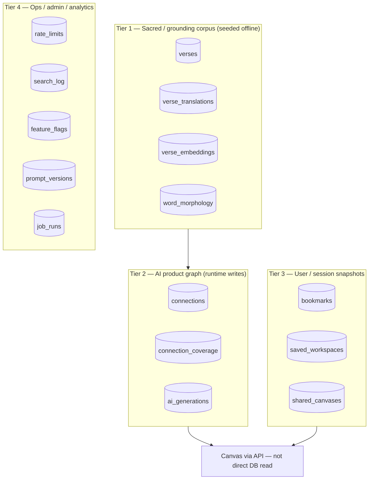
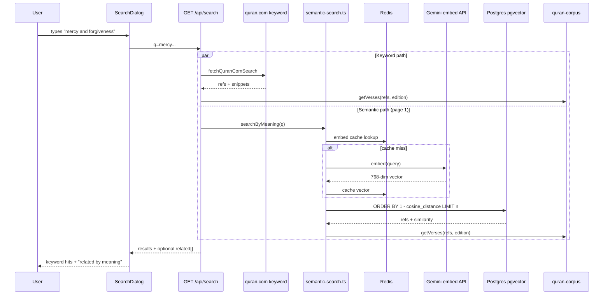

# Phase 9 — Base de données et recherche sémantique

> **Prérequis :** Phases [1](../onboarding-fr/phase-1-what-is-openhikmah.md)–[8](../onboarding-fr/phase-8-state-and-canvas.md)  
> **Étiquettes de preuve :** **FACT** · **INFERENCE** · **UNKNOWN**

La phase 8 parlait de **l'état du canvas dans le navigateur**. La phase 9 parle de la **couche de stockage et de lecture** sous la recherche, la découverte ancrée et le graphe de connexions IA. C'est pour les ingénieurs, pas un cours SQL général.

**Phrase centrale (à mémoriser) :**

> Le texte sacré du Coran et les vecteurs d'ancrage sont **chargés une fois dans Postgres** ; le code **les lit** à l'exécution. Le classement sémantique est **du calcul sur des vecteurs stockés**, pas la mémoire du LLM (grand modèle de langage).

---

## PostgreSQL dans OpenHikmah

**FACT:** L'app utilise **PostgreSQL 16** avec l'extension **pgvector** (recherche par vecteurs) (`docker-compose.yml` → `pgvector/pgvector:pg16`).

**FACT:** La connexion passe par `DATABASE_URL` → `lib/infra/db.ts` :

```typescript
export const db = drizzle(client, { schema });
```

Drizzle (ORM — outil pour parler à la base de données) enveloppe un client `postgres` (postgres-js) avec `max: 10` connexions.

### Niveaux de tables (ce qui compte pour les contributeurs)



| Niveau | Exemples | Qui écrit | Risque pour le contributeur |
| --- | --- | --- | --- |
| **1 — Corpus** | `verses`, `verse_embeddings`, `word_morphology` | Scripts de seed (chargement initial) / jobs admin | **Élevé** — données sacrées + ancrage |
| **2 — Graphe** | `connections`, `ai_generations` | `graph-service` en cas de cache miss | **Élevé** — sortie IA théologique |
| **3 — Utilisateur** | `bookmarks`, `saved_workspaces` | Routes API auth | Moyen |
| **4 — Ops** | `rate_limits`, `search_log`, `feature_flags` | Infra / admin | Moyen–faible |

**À COMPRENDRE MAINTENANT :** Les phases 7–8 ont déjà séparé **`connections` Postgres** des **arêtes du canvas**. La phase 9 ajoute : **`verse_embeddings` et `word_morphology` sont les entrées fixes** pour `discoverCandidates` de la phase 7.

---

## Drizzle ORM — comment ce dépôt l'utilise

**FACT:** Une seule source de schéma : `lib/infra/db/schema.ts` (~660 lignes, toutes les définitions `pgTable` + types `$inferSelect` exportés).

**FACT:** Configuration Drizzle Kit (`drizzle.config.ts`) :

```typescript
schema: "./lib/infra/db/schema.ts",
out: "./lib/infra/db/migrations",
dialect: "postgresql",
```

### Motifs que vous verrez

| Motif | Exemple dans ce dépôt |
| --- | --- |
| Définition de table | `export const verses = pgTable("verses", { ... })` |
| Index | `uniqueIndex`, `index`, index partiels avec `.where(sql`...`)` |
| Colonne pgvector | `vector("embedding", { dimensions: 768 })` |
| Index HNSW | `.using("hnsw", t.embedding.op("vector_cosine_ops"))` |
| Requêtes | `db.select().from(verseEmbeddings).where(...).orderBy(desc(similarity))` |
| SQL brut si besoin | `db.execute(sql`TRUNCATE ...`)` dans les tests d'intégration |

**FACT:** Le code importe `db` depuis `@/lib/infra/db` et les tables depuis `@/lib/infra/db/schema`.

**INFERENCE:** Contrairement au modèle document de Firestore, OpenHikmah préfère **des tables relationnelles + index explicites** pour les refs de versets, les cellules du graphe et la recherche ANN (plus proches voisins) par vecteurs.

---

## Migrations

**FACT:** Les migrations SQL sont dans `lib/infra/db/migrations/` (numérotées `0000` … `0023`+).

| Commande / script | Rôle |
| --- | --- |
| `node scripts/migrate.mjs` | Applique toutes les migrations Drizzle via `drizzle-orm/postgres-js/migrator` |
| `scripts/ensure-tables.mjs` | Bootstrap idempotent `CREATE TABLE IF NOT EXISTS` — tourne au démarrage du conteneur **en plus** des migrations |
| `scripts/migrate-concurrent-indexes.mjs` | Changements d'index hors transaction (ex. index locale connections) |

**FACT:** La migration `0008_semantic_and_morphology.sql` active pgvector et crée `verse_embeddings` + `word_morphology` :

```sql
CREATE EXTENSION IF NOT EXISTS vector;
CREATE TABLE verse_embeddings (ref text PRIMARY KEY, embedding vector(768) NOT NULL, ...);
CREATE INDEX verse_embeddings_hnsw_idx ON verse_embeddings USING hnsw (embedding vector_cosine_ops);
```

**FACT:** Les tests d'intégration lancent `pgvector/pgvector:pg16` via Testcontainers, exécutent `migrate()`, puis appliquent manuellement l'index concurrent de la migration 0020 (`__tests__/integration/global-setup.ts`).

**À COMPRENDRE MAINTENANT :** Un changement de schéma exige une **migration réversible** testée par `bun run test:integration` (AGENTS.md). Ne modifiez pas la base de production à la main sans fichier de migration.

---

## Le corpus local du Coran (`verses`)

**FACT:** La clé primaire est la chaîne canonique `"surah:ayah"` (`ref`).

| Colonne | Source |
| --- | --- |
| `arabicText` | alquran.cloud `quran-uthmani` |
| `translation` | alquran.cloud `en.sahih` (Saheeh International) |
| `surah`, `ayah` | Entiers dénormalisés pour l'ordre |

**FACT:** Chargé par `scripts/seed-quran.mjs` — attend **6236** ayahs ; upsert par lots.

**FACT:** `lib/quran/quran-corpus.ts` lit `verses` (+ `verse_translations` optionnel pour d'autres éditions). C'est la **couche d'hydratation** pour valider les sorties IA et l'affichage.

**FACT:** L'affichage multilingue utilise `verse_translations` (migration `0018`) — chargé séparément via `scripts/seed-translations.mjs`. La recherche peut montrer une édition locale alors que les embeddings restent indexés en anglais (voir plus bas).

---

## Morphologie des mots (`word_morphology`)

**FACT:** Une ligne par **mot avec racine** par verset : `(ref, position, surface, root, lemma)`.

**FACT:** Chargé depuis `data/morphology/*.jsonl` via `scripts/seed-morphology.mjs`.

**FACT:** Index :

| Index | Rôle |
| --- | --- |
| `(ref, position)` unique | Clé d'upsert |
| `(ref)` | Mots d'un verset |
| `(root)` | Versets partageant une racine |

**FACT:** `discoverCandidates(..., "root")` (`lib/ai/connection-discovery.ts`) :

1. Sélectionne les racines distinctes pour le `ref` source
2. Trouve d'autres refs partageant ces racines
3. Classe par `count(distinct root)` DESC
4. Respecte `excludeRefs`

**FACT:** Versets **sans lignes de morphologie** → liste de candidats vide → chemin IA legacy au premier expand (phase 7).

---

## Embeddings (`verse_embeddings`)

### Représentation

| Propriété | Valeur |
| --- | --- |
| Dimensions | **768** (`EMBEDDING_DIMENSIONS` dans `lib/ai/ai.ts`) |
| Modèle | `gemini-embedding-001` (override : `GEMINI_EMBEDDING_MODEL`) |
| Texte source | **`verses.translation`** (Saheeh anglais) |
| Dims natives du modèle | 3072 — réduit via `outputDimensionality: 768` |
| Index | **HNSW** avec `vector_cosine_ops` |

**FACT:** Les embeddings sont **toujours Gemini** — Anthropic n'a pas d'API embeddings (`lib/ai/ai.ts` en-tête). C'est indépendant de `AI_PROVIDER` pour le texte des connexions.

### Hors ligne : charger le corpus

**Script :** `scripts/embed-corpus.mjs`

```text
SELECT verses missing embedding for current model
→ batchEmbedContents (Gemini REST, batch size 100)
→ INSERT ... ON CONFLICT (ref) DO UPDATE
→ idempotent / resumable on 429
```

**FACT:** Nécessite `DATABASE_URL` + `GEMINI_API_KEY`. Relancer est sûr — saute les refs déjà embeddées pour le modèle courant.

### En ligne : embedder les requêtes utilisateur

**Où :** `lib/quran/semantic-search.ts` → `embedQueryCached`

| Étape | Comportement |
| --- | --- |
| Normaliser la requête | `toLowerCase()` |
| Cache Redis | Clé `emb:q:<sha256>`, TTL 7 jours |
| Miss | `embed(query)` → même chemin Gemini REST que le corpus |
| Redis désactivé | Embed direct à chaque fois (`lib/infra/redis.ts` fallback) |

**FACT:** Seules les **requêtes utilisateur** appellent l'embed live + cache Redis. Les vecteurs du corpus ne sont **jamais** recalculés à la demande.

**INFERENCE:** Embeddings indexés en anglais + `verse_translations` par locale signifie qu'une UI turque peut afficher du turc pour des voisins sémantiques indexés en anglais — par conception (`searchByMeaning` docstring).

---

## Requêtes pgvector — comment fonctionne la similarité

**Où :** `lib/quran/semantic-search.ts` → `nearest()`

```typescript
const similarity = sql<number>`1 - (${cosineDistance(verseEmbeddings.embedding, queryVec)})`;
return db
  .select({ ref: verseEmbeddings.ref, similarity })
  .from(verseEmbeddings)
  .where(excludeRefs ? notInArray(...) : undefined)
  .orderBy(desc(similarity))
  .limit(limit);
```

| Concept | Dans ce dépôt |
| --- | --- |
| Métrique de distance | **Distance cosinus** via `cosineDistance` de Drizzle |
| Score de similarité | `1 - cosineDistance` → plus haut = plus proche |
| Index ANN | HNSW — plus proches voisins approximatifs à grande échelle |
| Exclusions | `notInArray(verseEmbeddings.ref, excludeRefs)` |

### Analogie Firestore (bref)

Firestore est fort pour les **recherches exactes** (`where ref == "2:255"`). pgvector résout un autre problème : **« quel verset parmi 6236 est le plus proche en sens de ce vecteur ? »** C'est une recherche de plus proches voisins, pas une égalité indexée.

---

## Surface API de la recherche sémantique

Trois fonctions exportées — même cœur `nearest()` :

| Fonction | Entrée | Sortie | Utilisé par |
| --- | --- | --- | --- |
| `searchByMeaning(query, limit, edition?)` | Texte libre | `SemanticMatch[]` | `GET /api/search` → `relatedByMeaning` |
| `similarVerses(ref, limit, excludeRefs?)` | Ref de verset | `SemanticMatch[]` | `GET /api/verse/.../similar` |
| `semanticCandidates(ref, limit, excludeRefs?)` | Ref de verset | `string[]` refs seulement | `discoverCandidates` thematic/contrast |

**FACT:** `similarVerses` charge l'embedding source depuis la DB ; retourne `[]` si aucun stocké.

**FACT:** Les trois hydratent le texte via `getVerses(refs, edition)` — classement par vecteurs, **texte depuis le corpus local**.

### Route search : mot-clé vs sémantique

**FACT:** `GET /api/search` lance **deux chemins en parallèle** sur la page 1 :

| Chemin | Mécanisme | Persistance |
| --- | --- | --- |
| **Mot-clé** | API quran.com (`fetchQuranComSearch`) → refs → `hydrate()` depuis le corpus local | Index externe ; affichage depuis Postgres |
| **Liés par le sens** | `searchByMeaning` → pgvector | Embeddings dans Postgres ; embed de requête en live |

**FACT:** La section sémantique « related » est **best-effort** — les échecs retournent `related` vide, invisible pour l'utilisateur (`relatedByMeaning` avale les erreurs).

**FACT:** Les deux chemins sont limités par `consume(`search:${clientKey}`)`.

**FACT:** La table `search_log` enregistre les requêtes agrégées (mode `keyword` | `meaning`) quand le budget de log le permet — pas d'attribution utilisateur.

---

## Ce qui est persisté vs calculé à l'exécution

| Donnée | Persisté ? | Où c'est calculé |
| --- | --- | --- |
| Arabe + traduction par défaut | **Oui** — seed | `verses` |
| Traductions alternatives | **Oui** — seed | `verse_translations` |
| Vecteurs d'embedding | **Oui** — seed | `verse_embeddings` |
| Racines de mots | **Oui** — seed | `word_morphology` |
| Arêtes de connexion IA | **Oui** — en cache miss | `connections` |
| Embedding de requête | **En cache** (Redis) ou éphémère | API Gemini |
| Résultats recherche mot-clé | **Non stockés** | quran.com par requête |
| Ordre de classement sémantique | **Calculé** à chaque requête | pgvector `ORDER BY similarity` |
| Layout du canvas | **Client** localStorage / share / workspace | Pas dans `connections` |

---

## Initialisation de la base (modèle mental dev local)

Ordre typique **première fois** :

```text
1. Postgres tourne (docker-compose ou local) avec pgvector
2. node scripts/migrate.mjs          # applique les migrations Drizzle
3. node scripts/seed-quran.mjs       # verses (~6236 lignes)
4. node scripts/seed-morphology.mjs  # word_morphology (depuis data/morphology/)
5. node scripts/embed-corpus.mjs     # verse_embeddings (nécessite GEMINI_API_KEY)
6. Optionnel : seed-translations.mjs   # éditions non anglaises
```

**FACT:** Sans l'étape 5, la recherche sémantique et la découverte thematic/contrast retournent vide — le fallback IA legacy peut encore tourner (phase 7).

**FACT:** Le panneau admin peut lancer des jobs de seed via `lib/admin/job-runner.ts` → enregistre le résultat dans `job_runs`.

**UNKNOWN:** État exact du seed en production sur openhikmah.com — supposez un seed complet en prod ; vérifiez en local.

---

## Stratégie des tests d'intégration

**FACT:** `bun run test:integration` → Vitest avec :

| Paramètre | Valeur |
| --- | --- |
| Config | `vitest.integration.config.ts` |
| Setup global | Testcontainers `pgvector/pgvector:pg16` |
| Pool | `fileParallelism: false` — une DB partagée, fichiers en série |
| Timeout | 30s test / 120s hook |

**FACT:** Les tests **mockent les API externes** (embed, Claude) mais utilisent **Postgres + pgvector réels** :

| Fichier | Prouve |
| --- | --- |
| `semantic-search.integration.test.ts` | Classement cosinus, excludeRefs, requête vide court-circuitée |
| `connection-discovery.integration.test.ts` | Classement SQL racine sur vraies lignes morphologie |
| `graph.integration.test.ts` | Cache miss → persist → cache hit ; rate limits |

**FACT:** Le hook pre-push lance les tests d'intégration (AGENTS.md) — **Docker requis** pour `git push`.

**FACT:** Les tests unitaires mockent `db` entièrement ; les tests d'intégration sont la preuve pour SQL et pgvector.

---

## Index importants (référence contributeur)

| Table | Index | Pourquoi |
| --- | --- | --- |
| `verses` | PK `ref` | Lookup verset O(1) |
| `connections` | UNIQUE `(from_ref, to_ref, kind, locale)` | Persist IA idempotent |
| `connections` | `(from_ref, kind)` | Lecture cache pour une cellule |
| `verse_embeddings` | HNSW sur `embedding` | Requêtes ANN sémantiques |
| `word_morphology` | `(root)` | Jointure découverte racine |
| `bookmarks` | UNIQUE `(user_id, verse_ref)` | Un bookmark par ref par utilisateur |

---

## De bout en bout : requête de recherche sémantique



---

## Récit lent : un classement sémantique

Vous tapez **« patience dans l'épreuve »** dans la recherche.

La recherche par mot-clé demande à l'index quran.com des correspondances littérales — ce chemin ne touche pas pgvector. En parallèle, le serveur embed votre phrase : Redis est vérifié d'abord ; en miss, Gemini retourne un vecteur 768 dimensions pour le sens anglais de votre requête.

Ce vecteur est comparé aux **6236 vecteurs pré-stockés** — un par verset, chacun construit depuis la traduction Saheeh anglaise quand `embed-corpus.mjs` a tourlé. Postgres utilise l'index HNSW pour trouver les refs les plus proches sans scanner chaque ligne.

Les meilleurs matchs reviennent en refs + scores de similarité. L'app hydrate ensuite l'arabe et la traduction depuis `verses` / `verse_translations` — le texte affiché vient toujours du corpus, même si le classement était indexé en anglais.

Si les embeddings n'ont jamais été chargés, toute cette branche retourne rien en silence ; les résultats mot-clé fonctionnent encore.

---

## À COMPRENDRE MAINTENANT

1. **`schema.ts` est le contrat des tables** — migrations + requêtes Drizzle en découlent.
2. **pgvector + HNSW + distance cosinus** alimentent tout le classement sémantique — pas le LLM.
3. **Les embeddings sont toujours Gemini, toujours 768 dim, toujours depuis le texte de traduction anglais** pour les lignes du corpus.
4. **`discoverCandidates` lit `word_morphology` ou `verse_embeddings`** — les scripts de seed comptent pour les connexions ancrées.
5. **`connections` est écrit en cache miss IA** — séparé du canvas et de la recherche par mot-clé.
6. **Les tests d'intégration avec Testcontainers** sont la preuve du dépôt pour SQL/pgvector — les tests unitaires mockent la DB.

---

## UTILE PLUS TARD

- `scripts/prewarm-graph.mjs` — préchauffage offline du graphe (ops admin).
- `scripts/backfill-connections.ts` — génération batch de connexions.
- `lib/infra/rate-limit.ts` — compteurs fenêtre fixe dans Postgres (table `rate_limits`).
- Chargement de `verse_translations` pour une UI non anglaise sans ré-embedder.
- Paramètres de tuning HNSW — non exposés dans le code applicatif aujourd'hui ; valeurs par défaut de Postgres/pgvector.

---

## IGNORER POUR L'INSTANT

- Tables social/challenge/amitié — sans lien avec le pipeline de recherche.
- Cache `name_content` / noms divins — autre motif de cache IA, même idée write-once.
- Internes Redis quand `REDIS_URL` n'est pas défini — le repli in-process suffit pour le dev local.
- Schéma exact de réponse API quran.com — traiter comme index de recherche externe uniquement.

---

## Questions de contrôle — Phase 9

1. Pourquoi les embeddings du corpus et les embeddings de requête doivent-ils utiliser le même modèle et la même dimensionalité ?
2. Quelle table `discoverCandidates("2:255", "root")` interroge-t-il, et que signifie un résultat vide ?
3. En quoi `searchByMeaning` diffère-t-il de la recherche par mot-clé en source de données et persistance ?
4. Qu'est-ce qui prouve que le classement pgvector fonctionne en CI ?
5. Nommez les trois scripts de seed qui peuplent les tables d'ancrage de niveau 1 (hors traductions).

---

**Suite :** [Phase 10 — Lancer l'application localement](./phase-10-run-locally.md) — configuration Bun, `.env.local`, quelles fonctionnalités nécessitent quelles clés, Docker, serveur de dev.

Dites **« continuer vers la Phase 10 »** quand vous êtes prêt, ou demandez un zoom sur un sujet base de données/recherche.

> **Version complète (français B2+) :** [Phase 9](../onboarding-fr/phase-9-database-and-semantic-search.md)
