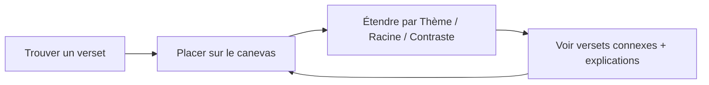
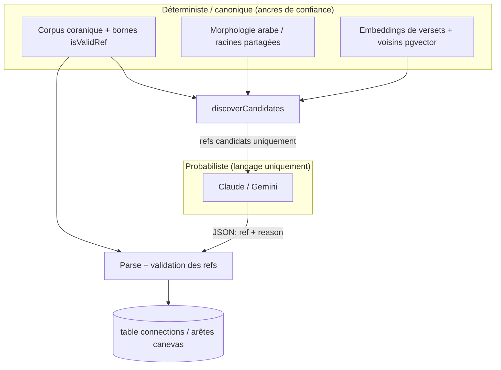

# Phase 1 — Qu'est-ce qu'OpenHikmah ?

> **Statut :** Onboarding en lecture seule · dérivé de la documentation et du code source du dépôt consulté  
> **Balises de preuve :** **FACT** = démontré dans le dépôt · **INFERENCE** = interprétation raisonnable · **UNKNOWN** = pas encore vérifié

---

## Avant le code : une phrase

**FACT :** Open Hikmah est un graphe de connaissances coraniques *ancré dans l'IA* — vous recherchez un verset, le placez sur un canevas infini, l'étendez pour faire apparaître des versets connexes, et lisez des explications générées par l'IA sur *pourquoi* ces relations existent.

Cet adjectif unique — **ancré** (*grounded*) — est le pari central du produit, à la fois technique et théologique.

---

## Ce qu'est OpenHikmah

**FACT :** Le README décrit Open Hikmah comme permettant d'explorer le Coran comme un **graphe connecté** plutôt que de le lire linéairement, page après page.

**FACT :** Les métadonnées de la page d'accueil (`app/page.tsx`) le présentent ainsi : *« Search any verse and map its connections — shared roots, themes, and contrasts — grounded in canonical Qur'an data. »*

**INFERENCE :** « Hikmah » (حكمة, sagesse) désigne ici une connaissance structurée et exploratoire — pas un chatbot qui improvise librement sur le Coran. Le produit ressemble davantage à une carte d'étude interactive qu'à un assistant IA générique.

### Boucle principale (modèle mental du produit)

1. **Trouver un verset** — par référence (`2:255`), mot-clé ou sens en langage naturel.
2. **Le placer sur le canevas** — un espace de travail graphe infini (`@xyflow/react`).
3. **Étendre un nœud** — choisir un *mode* de connexion (thème, racine ou contraste).
4. **Recevoir des arêtes ancrées** — les versets cibles proviennent d'abord de données déterministes ; l'IA explique le lien.
5. **Continuer l'exploration** — partager le canevas via URL, marquer des versets, se connecter optionnellement pour la synchronisation.

**À COMPRENDRE MAINTENANT :** Le canevas est la surface principale de mise en sens. La recherche vous y amène ; le graphe est l'endroit où la compréhension s'accumule.

**UTILE PLUS TARD :** Noms divins (`/names`), Récits prophétiques, séries sociales/défis, espaces de travail, lecture audio, localisation — des fonctionnalités réelles, mais pas nécessaires pour saisir le modèle de confiance central.

**IGNORER POUR L'INSTANT :** Outils admin de backfill, internes du cache Redis, détails PKCE OAuth.

---

## À qui s'adresse-t-il

**FACT :** L'accès invité est pris en charge — vous pouvez explorer, marquer localement et utiliser le canevas sans compte (README Features).

**FACT :** Les utilisateurs connectés (via Quran Foundation OAuth2 PKCE) obtiennent des signets multi-appareils, des espaces de travail nommés, des fonctionnalités sociales et des @mentions.

**INFERENCE :** Le public visé est constitué de musulmans et d'étudiants du Coran qui souhaitent une exploration *relationnelle* — comment les versets font écho, contrastent ou partagent une racine linguistique — et non une simple consultation. L'interface et les textes supposent une révérence pour le texte sacré (voir `DESIGN.md` : les explications IA ne doivent jamais être stylisées comme du texte scripturaire).

---

## Quel problème il résout

### Lecture linéaire vs. compréhension relationnelle

**INFERENCE :** La lecture traditionnelle suit l'ordre sourate/ayah. Les liens théologiques et linguistiques traversent cet ordre : la même racine arabe apparaît dans des sourates éloignées ; les thèmes se répètent ; certains ayahs contrastent délibérément avec d'autres (facilité/difficulté, gratitude/ingratitude).

OpenHikmah fait de ces relations inter-versets des **objets navigables de premier ordre** plutôt que des connaissances qu'il faut déjà posséder ou chercher manuellement.

### Pourquoi la recherche par mot-clé ordinaire est insuffisante

**FACT :** L'application prend en charge la consultation directe par référence et la recherche plein texte par mot-clé (`README.md` Features).

**INFERENCE :** La recherche par mot-clé échoue quand :

- Vous connaissez l'*idée* mais pas la formulation (« versets sur la patience dans l'épreuve »).
- Les versets connexes utilisent un vocabulaire différent, lié uniquement par le sens ou la morphologie arabe partagée.
- Vous voulez des relations de *contraste*, pas de similarité.

**FACT :** La **recherche sémantique par sens** est une fonctionnalité de premier ordre — décrivez un concept avec vos propres mots et récupérez des versets pertinents même sans chevauchement lexical (`README.md` Overview).

Cela nécessite des embeddings + similarité vectorielle (PostgreSQL + pgvector + embeddings Gemini selon README Tech Stack) — un problème de récupération fondamentalement différent de la correspondance exacte de champs. *(Mécanismes détaillés : Phase 2 et Phase 9.)*

---

## Ce que signifie « mise en sens théologique » ici

**FACT :** `CONTRIBUTING.md` qualifie Open Hikmah d'outil de *« theological sensemaking »* pour le Coran.

**FACT :** `AGENTS.md` lie toutes les invites IA et connexions à la **tradition maturidite/hanafite** et exige un **Tanzih strict** — ne jamais impliquer de forme physique, de localisation spatiale ou de ressemblance pour les attributs divins.

En termes produit, la mise en sens théologique signifie :

| Mode d'échec d'une « app Coran IA » ordinaire | Comportement visé par OpenHikmah |
| --- | --- |
| Le modèle invente une référence de verset | Les refs cibles proviennent d'abord du corpus / de la découverte ; les refs sont validées |
| Le modèle présente des liens non fondés comme des faits | Les extrémités des liens sont déterministes ; le modèle rédige la *raison* |
| Le modèle dérive vers un cadrage hétérodoxe | Les invites encodent l'école + Tanzih ; les changements exigent une divulgation |

**FACT :** `DESIGN.md` exige que le texte rédigé par l'IA (raisons de connexion, réflexions) soit **visuellement distinct** du texte canonique des versets — note éditoriale à bordure turquoise, jamais stylisée comme du texte scripturaire.

**À COMPRENDRE MAINTENANT :** Mise en sens = *exploration guidée avec garde-fous*, pas génération ouverte de contenu religieux.

---

## Ce que signifie un « graphe de connaissances coraniques » ici

**FACT :** Les connexions persistées vivent dans PostgreSQL (`lib/ai/graph-service.ts` — *« The persistent knowledge graph. Reads connections from Postgres… »*).

**FACT :** Trois types d'arêtes existent (`types/quran.ts`) :

| Kind | Libellé produit (approx.) | Ce qu'il connecte |
| --- | --- | --- |
| `thematic` | Thème | Versets partageant un thème théologique |
| `root` | Racine | Versets partageant une racine arabe significative |
| `contrast` | Contraste | Versets présentant des concepts théologiques opposés |

**FACT :** Chaque arête porte des métadonnées : `kind`, `label` lisible par l'humain, et une chaîne `reason` générée par l'IA (`CanvasEdge.data` dans `types/quran.ts`).

### Graphe vs. canevas

**INFERENCE :**

- **Graphe de connaissances (persisté) :** `(fromRef, toRef, kind, reason, locale…)` — partagé, mis en cache, auditable.
- **Canevas (session/UI) :** nœuds et arêtes React Flow — disposition, sélection, état d'expansion, sérialisation de partage — votre vue de travail du graphe.

**FACT :** Les canevas partageables se sérialisent dans une URL (`README.md` Features ; `lib/canvas/share-canvas.ts` existe).

Vous revisiterez cette distinction en profondeur en Phase 8. Pour l'instant : **le graphe est la vérité de « quoi est connecté à quoi » ; le canevas est la façon de manipuler et partager une vue.**

---

## Ce que le canevas infini apporte

**FACT :** Le canevas utilise `@xyflow/react` ; le style le traite comme un champ bleu marine plat où les nœuds sont séparés par bordure/surface, pas par élévation (`DESIGN.md`, README Tech Stack).

**INFERENCE :** Le canevas compte parce que les relations coraniques sont **multidirectionnelles et non linéaires**. Une liste de résultats de recherche ne peut pas montrer :

- L'expansion parallèle d'un verset en trois modes (thème / racine / contraste)
- Les chemins qui se croisent (verset A → B et A → C, puis B → D)
- Le regroupement spatial que vous construisez en étudiant

**FACT :** Les couleurs des arêtes sont sémantiquement réservées — thème turquoise, racine or, contraste rouge/ton erreur (`DESIGN.md`).

---

## Racines arabes — pourquoi elles comptent (niveau produit)

**FACT :** Les connexions peuvent être ancrées dans la **morphologie canonique** — racines arabes partagées issues des données `word_morphology` (`lib/ai/connection-discovery.ts`, README Tech Stack).

**INFERENCE :** Les mots arabes dérivent de **racines** trilitères (ou similaires). Les versets qui partagent une racine partagent souvent un ADN conceptuel même quand les traductions anglaises semblent sans lien. C'est un signal linguistique **déterministe** — pas une intuition LLM.

**FACT :** `lib/quran/arabic-morphology.ts` documente l'interactivité au niveau des mots : les entrées morphologiques relient les formes de surface aux racines pour la surbrillance dans le verset.

Détails morphologiques computationnels → **Phase 2**. Pour la Phase 1 : **les racines sont l'un des deux rails d'ancrage majeurs aux côtés des embeddings.**

---

## Recherche sémantique — ce qu'elle ajoute (niveau produit)

**FACT :** `lib/quran/semantic-search.ts` indique que la recherche sémantique :

- Lit des vecteurs **précalculés** depuis `verse_embeddings` (alimentés par `scripts/embed-corpus.mjs`)
- Classe par **similarité cosinus** via pgvector
- Alimente la « recherche par sens », « trouver des versets similaires », et la **récupération de candidats pour les connexions thématiques/contraste**

Exemple conceptuel simple :

> Requête utilisateur : *« gratitude quand les temps sont difficiles »*  
> **FACT :** Le système embed la requête (Gemini), trouve les vecteurs de versets les plus proches dans Postgres, retourne des ayahs classés.  
> **INFERENCE :** Aucun mot-clé anglais/arabe partagé requis entre la requête et le résultat.

Les embeddings sont des vecteurs de **768 dimensions** (`GEMINI_EMBEDDING_MODEL` / `.env.example`).

---

## Quel rôle joue l'IA — et ce qu'elle n'est délibérément PAS autorisée à faire

C'est la distinction la plus importante du dépôt.

### Séparation des pouvoirs (langage architectural officiel)

**FACT :** En-tête de `lib/ai/connection-discovery.ts` :

> *Candidate discovery … the "data discovers" half of the separation of powers … The AI never invents these refs; it only selects among them and explains why.*

**FACT :** En-tête de `lib/ai/connection-generator.ts` :

> *generateGroundedConnections — the preferred "AI articulates" half … Receives REAL candidate verses … asks the model only to SELECT among them and explain why. Returned refs are validated against the candidate set, so the model cannot introduce a verse that wasn't discovered.*

### Trois couches de « ce qui est autorisé sur le canevas »

| Couche | Mécanisme | Source **FACT** |
| --- | --- | --- |
| **1. Préférée (ancrée)** | La découverte produit des refs candidats → l'IA sélectionne un sous-ensemble + rédige les raisons → les refs de sortie doivent être ∈ ensemble candidat | `generateGroundedConnections`, `allowed.has(c.ref)` |
| **2. Repli (legacy)** | Si aucune donnée d'ancrage n'est seedée, l'IA propose des refs depuis la mémoire → chaque ref doit passer `isValidRef` + exister dans le **corpus local** via `getVerses` | `generateConnections` |
| **3. Persistance post-génération** | Les lignes canoniques anglaises stockées dans Postgres ; les locales non anglaises traduisent les raisons, sans re-sélectionner les versets | `graph-service.ts` |

**FACT :** Le chemin legacy ne peut toujours **pas persister des refs hallucinées** — `generateConnections` hydrate uniquement depuis le corpus local ; les lignes corpus manquantes sont supprimées.

**FACT :** Le chemin ancré est plus strict — une ref absente de la liste de découverte est filtrée même si valide dans le corpus.

### Ce que le LLM est autorisé à générer

**FACT :** Pour les connexions, le modèle produit du JSON comme `{ "ref": "surah:ayah", "reason": "…" }` — la **`reason`** est le contenu génératif principal ; la **`ref`** est contrainte.

**FACT :** Les invites incluent le cadrage maturidite/hanafite et ajoutent `TANZIH_CONSTRAINT` via `tanzihDirective()` — les admins ne peuvent pas supprimer le Tanzih en surchargeant seulement les templates (`connection-generator.ts` commentaires).

**FACT :** Fournisseur IA : Anthropic Claude (principal) avec repli Gemini ; embeddings toujours Gemini (`.env.example`, README).

### Ce que le LLM ne doit PAS faire (par conception)

| Interdit | Application |
| --- | --- |
| Inventer des références de versets (chemin ancré) | Appartenance à l'ensemble candidat |
| Inventer des références (chemin legacy) | `isValidRef` + hydratation corpus local |
| Choisir des versets corpus arbitraires sans découverte (ancré) | Invite de sélection : *« Choose ONLY from the candidate references listed above »* |
| Dérive théologique silencieuse | Contrainte Tanzih + revue/divulgation pour les changements d'invites (`AGENTS.md`) |
| Se faire passer pour du texte scripturaire | Règles de design UI (`DESIGN.md`) |

**À COMPRENDRE MAINTENANT :** **Les données découvrent ; l'IA articule.** La crédibilité du produit repose sur cet ordre.

---

## Modèle de confiance central — canonique vs. généré

Utilisez ce tableau comme checklist mentale par défaut en lisant toute fonctionnalité :

| Préoccupation | Ancré / déterministe | Généré / probabiliste |
| --- | --- | --- |
| Cet ayah existe-t-il ? | `isValidRef`, bornes de longueur de sourate, ligne corpus | — |
| Texte arabe et traduction principale | Table `verses` seedée ; `en.sahih` (Saheeh International) | — |
| Quels versets peuvent se connecter ? | Partage de racine (`word_morphology`), voisins d'embeddings (`verse_embeddings`) | — |
| Quels candidats deviennent des arêtes ? | Ancré : l'IA choisit dans la liste ; Legacy : l'IA propose, le corpus filtre | Choix de sélection |
| Pourquoi sont-ils connectés ? | — | `reason` générée par l'IA (forme JSON validée) |
| Texte de raison non anglais | La ligne canonique anglaise est source de vérité | Traduction des raisons (`translateReason`) |
| Noms divins / réflexions | Chaînes anglaises canoniques + données structurées | Réflexions IA avec invites séparées (`app/api/names/...`) |

### Validation des références de versets (niveau élevé)

**FACT :** `lib/quran/quran-corpus.ts` — `isValidRef` vérifie :

- Format `surah:ayah` (orthographe canonique — `"02:255"` rejeté)
- Sourate 1–114, ayah dans les comptes Hafs/Othmani par sourate (`"1:8"` rejeté)

**FACT :** `lib/quran/verse-resolver.ts` — corpus local d'abord ; requête live alquran.cloud en repli ; retourne `null` si introuvable — double porte anti-hallucination.

**FACT :** `AGENTS.md` — ne jamais fabriquer de références coraniques ; ne jamais assouplir la validation pour faire passer des tests.

---

## Pourquoi cette frontière est fondamentale

**INFERENCE :** Pour un texte sacré, le coût d'une mauvaise référence d'ayah n'est pas un bug UI générique — c'est un échec de **confiance et d'intégrité théologique**. Les utilisateurs peuvent traiter les connexions affichées comme un guide savant.

OpenHikmah optimise donc pour :

1. **Intégrité référentielle** — les ayahs sont réels et adossés au corpus avant d'apparaître.
2. **Explicabilité** — chaque arête renvoie à une raison énoncée (README produit : *« Every edge on the canvas links to that explanation »*).
3. **Auditabilité** — générations journalisées dans `ai_generations` ; connexions persistées (`connection-generator.ts`, `graph-service.ts`).
4. **Révisabilité** — changements d'invites/théologie nécessitent une divulgation explicite du contributeur (`CONTRIBUTING.md`, référence template PR).

Comparaison au modèle mental Firebase/Firestore que vous connaissez :

- **Firestore :** vous faites confiance aux IDs de documents parce que *votre app les a écrits*.
- **OpenHikmah :** vous faites confiance aux cibles d'arêtes parce que *des pipelines déterministes et la validation corpus les ont admises* — le LLM ressemble davantage à un commentateur contraint par une liste de lecture fournie.

---

## Contexte technique (seulement ce qui façonne le produit)

**FACT (README Tech Stack) :**

| Préoccupation | Choix |
| --- | --- |
| App | Next.js **16** App Router, React 19, TypeScript strict |
| État canevas | Zustand + `@xyflow/react` |
| Base de données | PostgreSQL + pgvector + Drizzle ORM |
| Auth | Quran Foundation OAuth2 PKCE |
| IA | Claude (+ repli Gemini) ; embeddings Gemini |

**UNKNOWN (pour les phases ultérieures) :** Les patterns exacts Next.js 16 App Router utilisés ici vs. les anciennes suppositions Next — le dépôt recommande de lire `node_modules/next/dist/docs/` localement avant de coder.

---

## Phase 1 — Ce qu'il faut retenir

### À COMPRENDRE MAINTENANT (5 points)

1. OpenHikmah est un **graphe de connaissances coraniques ancré** avec un canevas infini — pas un chatbot Coran libre.
2. **Trois modes de connexion :** thème, racine, contraste — chacun avec des rails de découverte déterministes.
3. **Séparation des pouvoirs :** morphologie + embeddings **découvrent** les versets candidats ; l'IA **sélectionne (quand ancré) et explique**.
4. **La validation est en couches :** syntaxe/bornes → existence corpus → (ancré) appartenance à l'ensemble candidat.
5. **Les contraintes théologiques sont des exigences produit**, encodées dans les invites (`TANZIH_CONSTRAINT`) et les règles contributeur (`AGENTS.md`).

### UTILE PLUS TARD

- Social, espaces de travail, audio, Noms divins, Récits prophétiques, boucle admin de backfill.
- Cache Redis des embeddings, limites de débit, déduplication single-flight.
- Pipeline de localisation (graphe canonique anglais, raisons traduites).

### IGNORER POUR L'INSTANT

- Détails d'implémentation du flux de tokens PKCE.
- Visite champ par champ du schéma Drizzle.
- Organisation des tests E2E.

---

## Incertitudes (lacunes honnêtes après la Phase 1)

| Sujet | Statut |
| --- | --- |
| Quelle part du corpus est pré-seedée vs. récupérée en live dans un setup dev frais | **UNKNOWN** — dépend de l'exécution des scripts seed/migrate (Phase 10) |
| Fréquence du chemin legacy vs. ancré en production | **INFERENCE :** ancré préféré dès que morphologie/embeddings existent ; legacy seulement en cas d'échec |
| Copie UX exacte pour les modes d'expansion sur le canevas | **UNKNOWN** — inspection UI nécessaire (Phase 11) |
| La découverte de contraste utilise-t-elle des vecteurs séparés ou les mêmes voisins que le thème | **FACT :** mêmes voisins sémantiques ; l'IA sélectionne les opposés (`connection-discovery.ts` commentaire) |

---

## Et ensuite

**Phase 2 — Primer du domaine :** modèle sourate/ayah, tables de morphologie, requêtes embeddings/pgvector, persistance graphe vs. canevas — chacun lié à des fichiers concrets.

**Phase 3 — Frontières théologiques et données sacrées :** carte complète de l'emplacement des contraintes (tests, invites, règles de revue).

Quand vous êtes prêt, dites **« continuer vers la Phase 2 »** ou posez des questions sur la Phase 1.

---

## Sources clés du dépôt pour cette phase

| Source | Rôle |
| --- | --- |
| `README.md` | Pitch produit, fonctionnalités, stack |
| `CONTRIBUTING.md` | « Outil de mise en sens théologique » ; attentes de contribution |
| `AGENTS.md` | Normes théologiques, attribution IA |
| `DESIGN.md` | Présentation texte sacré vs. texte IA |
| `lib/ai/connection-discovery.ts` | « Les données découvrent » |
| `lib/ai/connection-generator.ts` | « L'IA articule » ; validation |
| `lib/ai/graph-service.ts` | Graphe persistant + génération sur cache miss |
| `lib/quran/quran-corpus.ts` | `isValidRef`, corpus local |
| `lib/quran/semantic-search.ts` | Rôle de la récupération sémantique |
| `types/quran.ts` | Types d'arêtes, types canevas |
