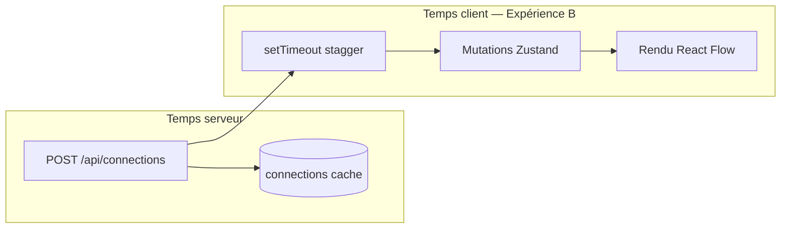

# Phase 12 — Une expérience locale contrôlée

> **Prérequis :** Phases [1](./phase-1-what-is-openhikmah.md)–[11](./phase-11-browser-code-correlation.md) — app en cours d'exécution localement ; exercice phase 11 complété (ou tenté)  
> **Étiquettes de preuve :** **FACT** (fait établi) · **INFERENCE** (inférence) · **UNKNOWN** (inconnu)

La phase 11 était **observer uniquement**. La phase 12 est votre première **mutation contrôlée** — petite, réversible, et choisie pour renforcer quelque chose que vous avez déjà tracé dans le code.

**Rien dans cette phase ne s'exécute automatiquement.** L'expérience A ne nécessite aucun changement de code. L'expérience B nécessite **votre approbation explicite** avant toute modification de fichier.

---

## Règles pour les expériences phase 12

D'après la spec onboarding originale — toujours contraignantes :

| Autorisé | Non autorisé (pour l'instant) |
| --- | --- |
| Timing / présentation UI inoffensifs | Prompts théologiques |
| Observer le runtime sans changement de code | Texte Coran ou fixtures arabes |
| Diffs un fichier, quelques lignes | Garde-fous de validation |
| Revenir après vérification | Flux auth / PKCE |
| | Migrations base de données |

Après toute expérience code : **vérifier → revenir → confirmer git status propre** sauf si vous demandez explicitement de garder le changement.

---

## Expérience A — Cache miss vs hit (lecture seule, pas d'approbation)

**Objectif :** Prouver phase 7/11 en runtime — le premier expand paie le coût IA/DB ; le second expand identique est une lecture cache rapide.

### Hypothèse

**INFERENCE:** Le premier `POST /api/connections` pour `(2:255, thematic, en, excludeRefs=[])` prendra **des secondes** sur une cellule froide ; une seconde requête identique (après vidage canvas mais même DB serveur) se terminera en **millisecondes**.

### Chemin d'exécution

```text
Browser: SearchDialog → addVerseNode(2:255) → runExpansion(thematic)
  → POST /api/connections
Server: getConnections → readActiveRows (miss) → discoverCandidates → AI → INSERT connections
  → JSON response

Repeat (same verse, same kind, empty excludeRefs):
  → readActiveRows (hit) → hydrate → JSON response
```

### Procédure

1. DevTools → Network → Preserve log, filtrer Fetch/XHR.
2. Noter que Postgres a corpus + embeddings chargés (phase 10).
3. Vider le canvas (toolbar Clear, confirmer).
4. Ajouter **2:255** (⌘K) — attendre expand thématique auto.
5. Noter **POST `/api/connections`** : statut, colonne **Time** (ms), longueur tableau réponse.
6. Vider le canvas à nouveau (nœuds partis ; **lignes Postgres `connections` restent**).
7. Ajouter **2:255** à nouveau — expand auto à nouveau.
8. Noter le timing du second POST.

### Résultat prédit

| Requête | Temps (ordre de grandeur) | Chemin serveur |
| --- | --- | --- |
| Première | 2–30+ secondes (IA + découverte embed) | Cache **miss** |
| Seconde | <500 ms typique | Cache **hit** |

### Ce qu'il faut noter

Une phrase répondant : *Le second POST a-t-il manqué la latence IA multi-secondes même si l'UI semblait identique ?*

Si les timings sont **similaires les deux fois**, investiguer avant d'accuser le code :

- La cellule `(fromRef, kind, locale)` identique n'a peut-être pas persisté (vérifier terminal pour `gen_persist_failed`).
- Première requête a renvoyé `[]` ou 502 — pas de lignes en cache.
- Limite de débit ou erreur provider sur le premier appel.

**Aucun changement git.** Passer à l'approbation expérience B uniquement si vous voulez un exercice de mutation code.

---

## Expérience B — Stagger expansion lent (changement code, approbation requise)

**Objectif :** Prouver phase 11 étape 6 — **le timing animation client est du code local**, pas l'API. Changer une constante `setTimeout` ralentit visiblement l'apparition des nœuds après que le POST est déjà revenu.

### Hypothèse

**INFERENCE:** Augmenter le délai par nœud dans `HikmahCanvas.runExpansion` de **350ms** à **900ms** fera apparaître les nœuds ~1,6s plus lent **par nœud** après que la requête réseau se termine, **sans changement** au payload API ni au comportement serveur.

### Chemin d'exécution

```text
POST /api/connections completes (unchanged)
  → runExpansion loop:
       for each connection:
         await setTimeout(900)   // was 350
         addVerseNode / addConnectionEdge
  → React Flow re-render
```

**Où :** `components/canvas/HikmahCanvas.tsx` — dans `runExpansion`, la boucle sur `connections` :

```typescript
await new Promise<void>((resolve) => setTimeout(resolve, 350));
```

### Changement exact (si approuvé)

**Une ligne** dans `components/canvas/HikmahCanvas.tsx` :

```diff
- await new Promise<void>((resolve) => setTimeout(resolve, 350));
+ await new Promise<void>((resolve) => setTimeout(resolve, 900));
```

Aucun autre fichier. Aucun commit sauf demande ultérieure.

### Résultat prédit

| Observation | Avant (350ms) | Après (900ms) |
| --- | --- | --- |
| 3 nouveaux nœuds | ~1s stagger après POST | ~2,7s stagger après POST |
| Durée POST Network | Inchangée | Inchangée |
| JSON réponse | Inchangé | Inchangé |

Vous devriez voir : **Network se termine rapidement** (surtout en cache hit), puis les nœuds continuent d'apparaître lentement — découplage confirmé.

### Comment vérifier

1. Appliquer le diff (après approbation).
2. Sauvegarder le fichier — hot reload Next.js.
3. Vider le canvas.
4. Expand un verset qui renvoie **3** connexions (ex. **2:255** thématique sur DB chargée).
5. Observer : POST se termine dans l'onglet Network **avant** que tous les nœuds soient visibles.
6. Comparer la sensation au comportement pré-changement (ou enregistrement écran / chronomètre).

### Revenir en arrière

```diff
- await new Promise<void>((resolve) => setTimeout(resolve, 900));
+ await new Promise<void>((resolve) => setTimeout(resolve, 350));
```

Ou :

```bash
git checkout -- components/canvas/HikmahCanvas.tsx
```

Confirmer : `git status` propre (ou seulement votre travail non lié).

---

## Point de contrôle approbation (Expérience B)

**N'appliquez pas l'expérience B tant que vous n'avez pas répondu avec approbation.**

Répondez par l'une des options :

| Réponse | Signification |
| --- | --- |
| **"Approve Experiment B"** | L'agent peut appliquer le changement d'une ligne, vous re-testez dans le navigateur, puis revert ensemble |
| **"Experiment A only"** | Rester en lecture seule ; passer à la phase 13 |
| **"Propose a different experiment"** | Dites ce que vous voulez apprendre (doit rester dans le territoire autorisé) |

**UNKNOWN jusqu'à ce que vous l'exécutiez :** Si votre cache local est assez warm pour que POST soit déjà rapide — le changement de stagger reste visible dans tous les cas.

---

## Expérience C optionnelle — Debounce persistance (alternative si B semble trop subtil)

Uniquement si vous refusez B — mêmes règles d'approbation.

| | |
| --- | --- |
| **Hypothèse** | Un debounce autosave plus long retarde la mise à jour `localStorage` après expand |
| **Fichier** | `hooks/useCanvasPersistence.ts` — `800` → `3000` dans debounce `setTimeout` |
| **Vérifier** | Expand → refresh dans 1s → canvas peut **ne pas** se restaurer ; attendre 4s → refresh → se restaure |
| **Risque** | Légèrement plus élevé — affecte l'UX persistance, pas seulement l'animation |
| **Revert** | Restaurer `800` |

L'expérience B est **recommandée** — retour visuel plus clair, rayon d'impact plus petit.

---

## Ce que vous apprenez de la phase 12



| Leçon | Expérience |
| --- | --- |
| Le cache graphe Postgres amortit le coût IA | **A** — timing POST |
| Animation UI ≠ latence serveur | **B** — constante stagger |
| L'onboarding peut faire confiance aux traces code quand le runtime correspond | **A + B** |

---

## À COMPRENDRE MAINTENANT

1. **L'expérience A** ne nécessite pas d'approbation — faites-la quand l'app tourne.
2. **L'expérience B** est une ligne, un fichier, entièrement réversible — mais requiert quand même votre **oui**.
3. **Ne commencez jamais** des edits style phase 12 sur prompts, validation versets, auth ou migrations — ce sont des zones contribution à haut risque (phase 16).
4. **Revenir en arrière fait partie de l'expérience**, pas un nettoyage optionnel — sauf si vous choisissez de garder le changement pour une vraie PR (qui nécessiterait tests et justification de scope).

---

## UTILE PLUS TARD

- Répéter l'expérience A après `TRUNCATE connections` en Postgres local — restaure le comportement chemin miss pour debug.
- Utiliser le même protocole pour votre **première vraie contribution** — hypothèse, chemin, prédiction, diff, vérification.

---

## IGNORER POUR L'INSTANT

- Committer l'expérience B — pas un changement digne de PR en soi.
- Ajouter des traces `console.log` — préférer l'onglet Network + changements de constantes ciblés selon le style code du dépôt.

---

## Questions de contrôle — Phase 12

1. Pourquoi le second expand de l'expérience A reste-t-il rapide même après avoir vidé le canvas ?
2. Quelle ligne unique l'expérience B changerait-elle, et pourquoi n'affecte-t-elle pas l'API ?
3. Que vérifieriez-vous si les timings du premier et second POST sont tous deux lents ?
4. Quelle est la commande revert pour l'expérience B ?

---

**Suite :** [Phase 13 — Modèle mental des tests](./phase-13-testing-mental-model.md) — unit vs integration vs e2e et ce que chacun prouve dans ce dépôt.

**À vous :** Exécutez **l'expérience A** maintenant et notez les timings, puis répondez **"Approve Experiment B"** si vous voulez le changement stagger d'une ligne appliqué, ou **"continue to Phase 13"** pour rester en lecture seule.
