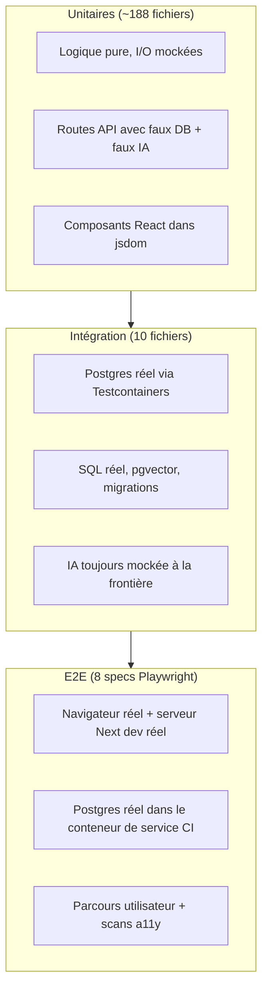
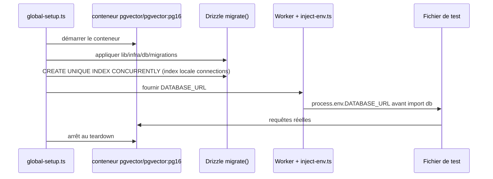

# Phase 13 — Modèle mental des tests

> **Prérequis :** Phases [1](./phase-1-what-is-openhikmah.md)–[12](./phase-12-controlled-experiment.md) — configuration locale (Phase 10) ; chemin d'expansion des Phases 7/11/12 compris  
> **Balises de preuve :** **FACT** (fait vérifié) · **INFERENCE** (déduction) · **UNKNOWN** (inconnu)

Les Phases 6–12 ont tracé le **comportement à l'exécution**. La Phase 13 explique comment ce dépôt **prouve** que ce comportement reste correct — et pourquoi certains échecs ici sont théologiques, pas seulement des bugs fonctionnels.

**Cette phase est en lecture seule.** Vous exécutez les tests existants ; vous n'ajoutez ni ne modifiez encore de code de test.

---

## Pourquoi les tests sont différents ici

La plupart des applications web traitent les tests comme des filets de régression pour l'UX et la logique métier. Open Hikmah ajoute une seconde barre :

| Type d'échec | Exemple | Pourquoi c'est important |
| --- | --- | --- |
| **Fonctionnel** | Le POST d'expansion renvoie 500 | Fonctionnalité cassée |
| **Théologique / intégrité des données** | L'IA renvoie `99:99` et c'est persisté | Violation des données sacrées |
| **Affaiblissement des garde-fous** | Assouplir `isValidRef` pour faire passer un test | Pire qu'un bug — masque une défaillance de confiance |

**FACT:** `AGENTS.md` interdit explicitement d'assouplir la validation théologique ou des références de versets pour faire passer les tests. Corrigez les données ou le prompt à la place.

**INFERENCE:** Lorsque vous contribuez, un CI vert est nécessaire mais pas suffisant — les reviewers demanderont si votre modification de test **renforce** ou **affaiblit** le modèle de confiance de la Phase 7.

---

## Trois couches — ce que chacune prouve



| Couche | Commande | Environnement | Prouve | Ne prouve **pas** |
| --- | --- | --- | --- | --- |
| **Unitaires** | `bun run test` / `bun run test:ci` | jsdom (composants) ou node ; **pas de Docker** | Parsing, validation, orchestration, état UI avec mocks | Plans SQL réels, classement pgvector réel, mise en page navigateur complète |
| **Intégration** | `bun run test:integration` | Node + **Docker** (Testcontainers) | Persistance, SQL de découverte, cache miss/hit contre le schéma réel | UI utilisateur final, OAuth, qualité IA en production |
| **E2E** | `bun run test:e2e` | Chromium + `next dev` sur le port **3100** | Les chemins critiques fonctionnent ensemble ; violations a11y graves bloquées | Chaque cas limite admin, chaque variante de prompt IA |

**FACT:** La config unitaire **exclut** `__tests__/integration/**` et `e2e/**` (`vitest.config.ts`). L'intégration utilise une config séparée (`vitest.integration.config.ts`).

---

## Où vivent les tests

**FACT:** Les tests unitaires reflètent la structure source sous `__tests__/` :

```text
lib/ai/graph-service.ts          → __tests__/lib/ai/graph-service.test.ts
app/api/connections/route.ts     → __tests__/api/connections.test.ts
components/canvas/HikmahCanvas.tsx → __tests__/components/canvas/HikmahCanvas*.test.tsx
store/canvas.ts                  → __tests__/store/canvas.test.ts
```

Les tests d'intégration ne sont **pas** reflétés fichier par fichier — ils se regroupent par **comportement de persistance transversal** :

| Fichier | Ce qu'il exerce |
| --- | --- |
| `graph.integration.test.ts` | `getConnections` miss → mock IA → INSERT → hit (histoire du cache Phases 7/12) |
| `connection-discovery.integration.test.ts` | Classement des racines de `discoverCandidates` sur `word_morphology` réel |
| `semantic-search.integration.test.ts` | Classement cosinus pgvector avec `embed()` mocké |
| `connection-batch.integration.test.ts` | Persistance batch admin |
| `job-runner-lock.integration.test.ts` | Verrou de job inter-processus |
| `name-content-locale.integration.test.ts` | Contenu de noms par locale |
| `root-concordance.integration.test.ts` | SQL de concordance |
| `story-flags.integration.test.ts` | Flags de visibilité des stories en DB |
| `user-tz-offset.integration.test.ts` | Persistance du décalage fuseau horaire |
| `verse-translations.integration.test.ts` | Stockage des traductions |

Les specs E2E vivent dans `e2e/*.spec.ts` — une préoccupation par fichier (`canvas`, `search`, `social`, `admin`, `stories`, `settings`, `a11y`, `mobile-nav-overlap`).

---

## Commandes à exécuter réellement

Depuis la racine du dépôt (après `bun install`) :

```bash
# Tests unitaires interactifs (mode watch) — usage quotidien
bun run test

# Exécution unique — correspond au hook pre-commit
bun run test:ci

# Couverture + seuils — correspond au job CI lint-typecheck-test
bun run test:coverage

# Intégration — Docker doit tourner
bun run test:integration

# E2E — Docker pour Postgres style CI ; en local réutilise le serveur dev si le port 3100 est ouvert
bun run test:e2e
```

Également dans la barre qualité (pas des « tests » mais bloquent le merge) :

```bash
bun run lint
bun run typecheck
bun run format:check
bun run build   # après unitaires + intégration en CI
```

**FACT:** `pre-commit` exécute guards → lint-staged → typecheck → **`test:ci` (unitaires uniquement)**.  
**FACT:** `pre-push` exécute **`test:integration` uniquement** — et **échoue fermement** si Docker ne tourne pas (`.husky/pre-push`).

**INFERENCE:** Vous pouvez committer avec des tests unitaires qui passent mais échouer au push sans Docker — par conception.

---

## Couche 1 — Tests unitaires (Vitest)

### Points clés de la config

**FACT** (`vitest.config.ts`) :

- `environment: "jsdom"` pour les tests de composants
- `pool: "forks"` (compatibilité Bun/Windows)
- `testTimeout: 20000` — les imports App Router lourds ont besoin de marge
- Couverture limitée à `lib/**`, `store/**`, `app/api/**` avec des seuils (~65 % statements/lines)

**FACT** (`vitest.setup.ts`) :

- `@testing-library/jest-dom`
- Polyfill `localStorage` en mémoire (quirk Node ≥22)
- Variables d'env factices pour que les modules API se chargent sans `.env.local`

### Patterns de mock (apprenez-les une fois)

Trois formes récurrentes apparaissent dans ~188 fichiers unitaires :

**1. Mock Drizzle chaînable** — les tests de routes API stubent `db.select()` / `db.insert()` avec un Proxy qui se résout comme une Promise :

```text
__tests__/api/connections.test.ts  → makeDbChain([])
__tests__/lib/quran/quran-corpus.test.ts → makeDbChain(rows)
```

**2. Mock partiel de module** — garder la validation réelle, stubber l'I/O :

```text
vi.mock("@/lib/quran/quran-corpus", async (importOriginal) => ({
  ...actual,
  getVerses: vi.fn(...),
}));
// isValidRef reste RÉEL — les tests imposent toujours les bornes de ref
```

**3. Mocks hoistés** — `vi.hoisted()` pour que les fns mock existent avant l'exécution des factories `vi.mock` (requis pour graph-service / connection-generator).

### Ce que les tests unitaires ancrent pour *votre* parcours d'onboarding

| Sujet | Test représentatif | Ce qu'il verrouille |
| --- | --- | --- |
| Contrat API expand | `__tests__/api/connections.test.ts` | Validation du body POST, rate limit, chemin cache miss avec IA mockée |
| Orchestration graph | `__tests__/lib/ai/graph-service.test.ts` | `getConnections` appelle discovery + generator ; **inspecte les clauses Drizzle `where` réelles** pour `status = active` |
| Parsing sortie IA | `__tests__/lib/ai/connection-generator.test.ts` | Parse JSON, refs invalides rejetées, **texte Tanzih dans chaque prompt** |
| Bornes des versets | `__tests__/lib/quran/quran-corpus.test.ts` | `isValidRef("2:287")` → false ; rejette le zero-padding |
| Détection de refus | `__tests__/lib/ai/refusal.test.ts` | Avertissements du modèle vs prose théologique authentique |
| Stagger canvas | `__tests__/components/canvas/HikmahCanvas.timers.test.tsx` | Écart uniforme de **350 ms** (cible Expérience B Phase 12) |
| Store canvas | `__tests__/store/canvas.test.ts` | `serializeCanvas` / `restoreCanvas` |

**FACT:** Les tests connection-generator utilisent de **l'arabe réel** dans les fixtures (Al-Fatiha 1:1), pas `"lorem ipsum"` — conforme à la règle données sacrées de `AGENTS.md`.

**FACT:** Tanzih est asserté via `expect(prompt).toMatch(/strict tanzih/i)` dans les tests connection-generator — pas par snapshot de prompts entiers.

---

## Couche 2 — Tests d'intégration (Testcontainers)

### Séquence de démarrage



**FACT** (`__tests__/integration/global-setup.ts`) :

- Image : `pgvector/pgvector:pg16` (correspond à Docker local / Postgres CI)
- Exécute les migrations Drizzle complètes, puis applique la migration d'index concurrent que `migrate()` transactionnel saute
- Un conteneur partagé par exécution ; **`fileParallelism: false`** — les tests s'exécutent en série pour éviter les fuites DB inter-fichiers

**FACT** (`__tests__/integration/inject-env.ts`) : injecte l'URL du conteneur **avant** que `lib/infra/db` construise son client.

### Ce que l'intégration ajoute par rapport aux tests unitaires

**Exemple — cache miss/hit (reflète l'Expérience A Phase 12) :**

`__tests__/integration/graph.integration.test.ts` :

1. `TRUNCATE` + seed des versets
2. Premier `getConnections("1:1", "thematic", …)` → mock IA appelé **une fois**, lignes dans `connections`
3. Second appel identique → mock IA **non** rappelé ; lignes servies depuis la DB

**Exemple — découverte sans IA :**

`connection-discovery.integration.test.ts` seed `word_morphology` et asserte le **classement** par chevauchement de racines (`3:3` avant `2:2` quand plus de racines partagées).

**Exemple — recherche sémantique sans réseau :**

`semantic-search.integration.test.ts` insère des vecteurs 768-d fixes et `embed()` mocké — pgvector fait un vrai classement cosinus.

**INFERENCE:** Les tests d'intégration sont le bon endroit quand votre changement touche **SQL, contraintes ou persistance du cache** — pas quand vous ne modifiez que du texte JSX.

### Exigence Docker

| Contexte | Docker requis ? |
| --- | --- |
| `bun run test` / `test:ci` | Non |
| `bun run test:integration` | **Oui** |
| `git push` (hook pre-push) | **Oui** |
| Job CI `integration` | Oui (le runner GitHub-hosted a le daemon) |

Si Docker est arrêté en local, les tests d'intégration échouent immédiatement — comme au push.

---

## Couche 3 — E2E (Playwright)

### Points clés de la config

**FACT** (`playwright.config.ts`) :

- Port **3100** (pas 3000) — évite le conflit avec votre `bun run dev` manuel
- `webServer`: `bun run dev -- -p 3100` — **doit être en mode dev** (le build production désactive le bypass dev-login)
- `workers: 1` — tous les e2e partagent une identité `DEV_AUTH_TOKEN` ; le parallèle provoquerait des collisions sur les données utilisateur
- `retries: 2` en CI uniquement
- Charge `.env.local` via `@next/env` pour que les fixtures voient `DEV_AUTH_TOKEN`

### Bypass auth (pas OAuth)

**FACT** (`e2e/fixtures/auth.ts`) : les tests appellent `window.__devLogin(token)` après hydratation — nécessite `DEV_AUTH_TOKEN` dans l'env (défini dans le workflow CI ; vous en avez besoin en local pour les specs authentifiées).

**INFERENCE:** E2E n'exerce **pas** l'OAuth Quran Foundation — bookmarks/flux oauth sont couverts par des tests unitaires/API avec mocks.

### Ce que couvrent les e2e

| Spec | Périmètre |
| --- | --- |
| `canvas.spec.ts` | Recherche → verset sur canvas → Clear |
| `search.spec.ts` | Comportement page recherche |
| `social.spec.ts` | Surfaces sociales (authentifié) |
| `admin.spec.ts` | Porte admin (utilisateur admin authentifié) |
| `stories.spec.ts` | Navigation stories |
| `settings.spec.ts` | Page paramètres |
| `a11y.spec.ts` | Scan axe-core — **échoue sur violations serious/critical** sur ~15 routes |
| `mobile-nav-overlap.spec.ts` | Régression mise en page mobile |

**FACT:** Le job e2e CI démarre un **conteneur de service Postgres** (`pgvector/pgvector:pg16`), exécute les migrations, puis Playwright — plus proche de la forme DB production que les tests unitaires, mais toujours des clés IA factices.

---

## Carte du pipeline CI

**FACT** (ordre des jobs `.github/workflows/ci.yml`) :

```text
secret-scan (gitleaks)
     │
     ├─ lint-typecheck-test ──► format, eslint, tsc, test:coverage
     │
     ├─ integration ──────────► test:integration (Testcontainers)
     │
     ├─ build (needs unit + integration) ──► next build, size-limit, bundle compare on PRs
     │
     ├─ docker-build ─────────► production Dockerfile smoke build
     │
     └─ e2e (needs unit job) ─► migrate + playwright (Postgres service)
```

**INFERENCE:** Une PR peut échouer dans n'importe quelle couche indépendamment — une typo JSX fait échouer le lint ; une migration SQL cassée fait échouer l'intégration ; un label de bouton manquant fait échouer l'a11y e2e.

---

## Guards pre-commit (avant même les tests)

**FACT** (`scripts/precommit-checks.mjs`) :

1. Bloquer les commits directement sur `main`
2. Bloquer `.only` / `.skip` / `fdescribe` / `xit` dans les fichiers de test stagés
3. Bloquer `debugger` et `console.log` dans le TS stagé (utiliser `console.error`/`warn` ou supprimer)
4. Scan de secrets via gitleaks si installé

**INFERENCE:** Laisser `it.only` dans un fichier de test annulera votre commit même si le test passe.

---

## Comment choisir un type de test pour un changement

Utilisez cet arbre de décision quand vous contribuerez :

```text
Avez-vous changé de la logique pure sans nouveau SQL ?
  └─ OUI → test unitaire dans le chemin __tests__/ reflété

Avez-vous changé une requête Drizzle, contrainte, migration ou sémantique de cache ?
  └─ OUI → test d'intégration (ou étendre un __tests__/integration/*.test.ts existant)

Avez-vous changé l'UX visible sur une route critique ou l'a11y ?
  └─ OUI → envisager e2e (seulement si unitaires/intégration ne peuvent pas le détecter)

Avez-vous changé un prompt IA ou une contrainte théologique ?
  └─ OUI → test unitaire sur le contenu du prompt (Tanzih/refus/refs valides) + décrire dans le template PR
  └─ JAMAIS → affaiblir isValidRef ou sauter les vérifications de ref pour passer au vert
```

**FACT:** La nouvelle logique attend de nouveaux tests dans la même PR (barre de test `AGENTS.md`).

---

## Exercice pratique (à faire maintenant)

Exécutez dans l'ordre ; notez succès/échec et durée :

### Étape 1 — Confiance rapide (sans Docker)

```bash
bun run test:ci
```

Choisissez un fichier que vous connaissez déjà des Phases 7/8/11 et exécutez-le en ciblé :

```bash
bun run test __tests__/lib/ai/graph-service.test.ts
```

**Point de contrôle :** Pouvez-vous nommer une chose que ce fichier mocke vs une chose qu'il garde réelle ?

### Étape 2 — Couche de persistance (Docker requis)

```bash
docker info   # must succeed
bun run test:integration
```

Relisez le premier test dans `graph.integration.test.ts` pendant l'exécution — reliez les lignes à l'Expérience A Phase 12.

**Point de contrôle :** Après que l'intégration passe, croyez-vous à l'histoire du cache hit sans ouvrir le navigateur ?

### Étape 3 — Stack complète optionnelle (plus long)

Seulement si les Étapes 1–2 passent et que vous avez `.env.local` avec au moins des clés factices :

```bash
bun run test:e2e
```

La première exécution télécharge Chromium si absent. La CI utilise le port 3100 ; en local Playwright peut réutiliser un serveur dev existant sur 3100 (`reuseExistingServer: !CI`).

**UNKNOWN:** La durée e2e locale exacte dépend de la machine et du cache navigateur froid — prévoyez plusieurs minutes à la première exécution.

---

## Tests qui encodent les frontières de confiance Phase 7

En lisant les code reviews plus tard, reconnaissez ces familles de tests **non négociables** :

| Garde-fou | Où testé |
| --- | --- |
| Les refs de versets doivent exister dans le corpus | `quran-corpus.test.ts` (`isValidRef`), generator rejette les mauvaises refs |
| Connexions ancrées ⊆ candidats découverts | `graph-service.test.ts`, `connection-generator.test.ts` |
| Tanzih dans les prompts | `connection-generator.test.ts`, `names.test.ts`, `names-ai-validation.test.ts` |
| Refus IA écartés | `refusal.test.ts` + intégration generator |
| Refs de versets stories valides | `stories.test.ts` itère toutes les refs stories via `isValidRef` |
| Pas de résultats de recherche fabriqués | `search.test.ts` commentaire + assertions |

**INFERENCE:** Un « simple correctif de test » qui touche ces fichiers mérite un examen supplémentaire — demandez *quelle propriété de confiance a cassé ?*

---

## À COMPRENDRE MAINTENANT

1. **Trois commandes, trois couches :** `test:ci` (unitaires), `test:integration` (Postgres Docker), `test:e2e` (navigateur).
2. **Pre-push exige Docker** — tests d'intégration, pas unitaires.
3. **L'intégration prouve le comportement cache Phases 7/12** contre du SQL réel — les tests unitaires prouvent l'orchestration avec mocks.
4. **Ne jamais affaiblir `isValidRef` ou les assertions Tanzih** pour passer au vert.
5. **Les tests reflètent la source** sous `__tests__/` — trouvez le fichier de test en changeant le préfixe de chemin.
6. **E2E utilise dev-login**, pas OAuth — et tourne avec **un worker** pour éviter les courses sur les données sociales.

---

## UTILE PLUS TARD

- `bun run test:coverage` avant un gros changement `lib/` — surveillez les seuils dans `vitest.config.ts`.
- `HikmahCanvas.timers.test.tsx` — pattern pour fake timers + mock fetch en touchant l'UX d'expansion.
- `__tests__/test-utils/render-with-intl.tsx` — envelopper les composants qui ont besoin de `next-intl`.
- Les fichiers d'intégration partagent une DB — toujours `TRUNCATE` dans `beforeEach` pour les tables que vous touchez.

---

## IGNORER POUR L'INSTANT

- Écrire de nouveaux tests avant votre première contribution — la Phase 16 cartographie les surfaces d'entrée sûres.
- Viser 100 % de couverture — les seuils existent pour attraper les régressions, pas pour gamifier les métriques.
- Lancer la CI complète en local avant chaque edit — `test:ci` + fichier ciblé suffit pour la plupart des boucles.
- Mocker pgvector en unitaires quand l'intégration couvre déjà le classement — effort dupliqué.

---

## Questions de contrôle Phase 13

1. Pourquoi les tests d'intégration sont exclus de `bun run test:ci` mais requis sur `git push` ?
2. Que prouve `graph.integration.test.ts` que `graph-service.test.ts` ne peut pas ?
3. Pourquoi Playwright définit `workers: 1` ?
4. Nommez deux guards pre-commit sans lien avec les assertions de test.
5. Si un test connection-generator échoue parce que le modèle a renvoyé `50:999`, quelle est la **bonne** correction ?

---

**Suivant :** [Phase 14 — Culture d'ingénierie](./phase-14-engineering-culture.md) — comment les PR, reviews et conventions du dépôt apparaissent dans l'historique git.

**À vous :** Exécutez les **Étapes 1** et **2** de l'exercice pratique, puis répondez **"continue to Phase 14"** — ou collez toute sortie en échec si quelque chose casse.
