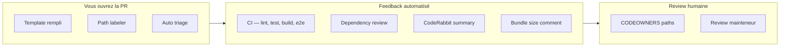

# Phase 14 — Culture d'ingénierie

> **Prérequis :** Phases [1](./phase-1-what-is-openhikmah.md)–[13](./phase-13-testing-mental-model.md) — surtout Phase 3 (frontières théologiques) et Phase 13 (couches de tests)  
> **Balises de preuve :** **FACT** (fait vérifié) · **INFERENCE** (déduction) · **UNKNOWN** (inconnu)

La Phase 13 a expliqué **comment la correction est imposée**. La Phase 14 explique **comment les changements arrivent réellement** — style de commit, forme de PR, attentes de review et normes implicites visibles dans l'historique récent.

**Cette phase est en lecture seule.** Vous étudiez les conventions ; vous n'ouvrez pas encore de PR. (La Phase 15 couvre le workflow fork/upstream ; la Phase 16 cartographie les premières contributions sûres.)

---

## Ce que signifie « culture d'ingénierie » ici

Open Hikmah est une base de code petite et à haute confiance où :

- **Le contenu sacré et les garde-fous IA** reçoivent la même rigueur que les bugs d'auth
- **Les PR sont petites et ciblées** plus souvent que les refactors massifs
- **L'automatisation porte la charge routinière** (CI, labeling, Dependabot, reviews bot) pour que la review humaine se concentre sur les frontières de confiance
- **Les erreurs sont revertées rapidement** quand un merge était faux — pas d'attachement au coût irrécupérable

**FACT:** Sur les 100 dernières PR mergées (échantillon via `gh pr list`), **85** ont été auteurées par `@nazarli-shabnam` et **15** par Dependabot.

**INFERENCE:** La vélocité quotidienne est pilotée par le mainteneur aujourd'hui ; les contributeurs OSS externes sont **accueillis par la doc** (`CONTRIBUTING.md`) mais l'historique de merge reste mince pour les outsiders — votre première PR aura probablement une review attentive et pédagogique plutôt qu'une approbation automatique.

**UNKNOWN:** Délai de réponse exact du mainteneur pour un contributeur externe débutant — `CONTRIBUTING.md` dit « dans quelques jours » mais ce n'est pas mesuré dans le dépôt.

---

## Documents canoniques (lisez-les, pas les blogs)

| Document | Rôle |
| --- | --- |
| [`AGENTS.md`](../../AGENTS.md) | Source unique de vérité — style de code, standards théologiques, attribution IA, garde-fous |
| [`CONTRIBUTING.md`](../../CONTRIBUTING.md) | Parcours humain fork → branche → test → PR |
| [`.github/PULL_REQUEST_TEMPLATE.md`](../../.github/PULL_REQUEST_TEMPLATE.md) | Sections PR requises, surtout **AI / Theological changes** |
| [`.github/CODEOWNERS`](../../.github/CODEOWNERS) | Chemins qui doivent avoir les yeux du mainteneur |
| [`SECURITY.md`](../../SECURITY.md) | Divulgation privée pour vulns — jamais d'issues publiques |

Les fichiers spécifiques aux outils (`.cursor/rules/agents.mdc`, `.github/copilot-instructions.md`, etc.) sont des **miroirs** de `AGENTS.md` — s'ils dérivent, `AGENTS.md` gagne.

---

## Conventions de branche et de commit

### Noms de branches

**FACT** (`AGENTS.md`, `CONTRIBUTING.md`) :

```text
feat/   — nouveau comportement
fix/    — correction de bug
chore/  — outillage, deps, nettoyage non visible utilisateur
docs/   — documentation uniquement
```

Exemples de l'historique récent : `fix/names-locale-meta`, `feat/csp-nonce-infra`, `chore/naming-consistency`.

**FACT:** Les branches opérationnelles ponctuelles utilisent parfois `temp/` (ex. `temp/cleanup-566-ai-content`) — traitées comme **courte durée** ; deux PR de ce type ont été revertées en quelques heures (#600–#603).

### Messages de commit

**FACT:** [Conventional Commits](https://www.conventionalcommits.org/) avec **scope** optionnel :

```text
fix(search): match quran.com keyword search against the user's UI locale
fix(auth,connections): distinguish a timed-out publish from a failed one
feat(security): add per-request CSP nonce infra, still report-only
chore: unify naming spellings, fix a stray color token, disable X-Powered-By
```

**INFERENCE:** Les scopes reflètent les répertoires ou domaines (`admin`, `names`, `connections`, `auth`, `i18n`, `seo`) — en cas de doute, utilisez le dossier que vous avez touché.

**FACT:** Les fixes multi-zones utilisent parfois des **scopes séparés par virgule** dans un commit quand le changement est une unité de review logique (PR #598 : garde test auth + connections).

### Ce que les commits ne doivent **pas** contenir

| Règle | Pourquoi |
| --- | --- |
| Pas de trailers `Co-Authored-By:` | Politique du dépôt — implique une co-auteur humaine qui ne s'applique pas |
| Utiliser le trailer `Generated-By: <tool>` à la place | Pour des fichiers entièrement nouveaux ou ~30+ lignes générées par IA avec édition humaine minimale |
| Pas de commits directs sur `main` | Bloqué par `scripts/precommit-checks.mjs` |

**INFERENCE:** Vous pouvez voir « Generated with Claude Code » dans les **descriptions de PR** sur les PR mainteneur — c'est une divulgation dans le corps de PR ; la **règle de trailer de commit** dans `AGENTS.md` est le mécanisme formel pour les gros blocs générés.

---

## Forme d'une pull request

### Sections du template qui comptent

**FACT** (`.github/PULL_REQUEST_TEMPLATE.md`) :

1. **Summary** — 1–3 puces : quoi + pourquoi
2. **Type of change** — case à cocher
3. **AI / Theological changes** — section d'honnêteté obligatoire pour prompts, noms divins, logique de connexion
4. **Testing** — commandes locales cochées
5. **Checklist** — branche à jour, pas de secrets, `.env.example` / README si besoin

Le template dit explicitement que e2e, axe et bundle-size tournent en CI — vous n'avez pas besoin de tout relancer manuellement en local si unitaires + intégration passent.

### À quoi ressemblent les bons corps de PR

Les PR mainteneur récentes (#611, #598) partagent un pattern à copier :

| Section | Objectif |
| --- | --- |
| **What / Fix** | Énoncé du problème en langage clair |
| **Why (per review)** | Cite le feedback de review en traitant les commentaires |
| **Theological / AI disclosure** | Même en réutilisant des prompts existants — indique ce qui a changé dans le modèle de confiance |
| **Testing** | Commandes exactes + comptages ; note le suivi manuel quand l'automatisation ne peut pas couvrir les backfills staging |

**Exemple — divulgation théologique sans nouveau wording de prompt** (PR #611, paraphrasé) :

> Ajoute un nouveau chemin de traduction IA pour le contenu des noms divins. Réutilise le prompt `translateReason` déjà revu et contraint par Tanzih — mêmes garde-fous que la traduction des raisons de connexion de versets.

C'est la barre : **nommer la surface de confiance**, pas seulement la liste de fichiers.

### Taille et focus de la PR

**INFERENCE de merges récents :**

- **Préférer une préoccupation par PR** — recherche locale (#610) et meta locale des noms (#611) ont atterri en PR séparées même si les deux touchent i18n
- **Des PR de suivi review existent** — `fix(names): address review feedback on locale-meta translation` comme second commit sur le même thème de branche
- **Le durcissement test-only a son propre nom de branche** — `test/graph-service-conflict-status-filter` (#598) a livré des fixes prod *et* des améliorations de mocks de test ensemble car la review exigeait les deux

**INFERENCE:** Une première PR contributeur devrait être **assez petite pour une review en une session** (~200 lignes ou moins est une cible sûre ; beaucoup de fixes mergés sont plus petits).

---

## Culture de review et d'automatisation



### Couches automatisées

| Automatisation | Déclencheur | Ce qu'elle fait |
| --- | --- | --- |
| **CI** (`.github/workflows/ci.yml`) | Chaque push/PR | Barre qualité complète — voir Phase 13 |
| **PR labeler** | Changements de chemins | Ajoute `API`, `db`, `UX/UI`, `tests`, etc. (`.github/labeler.yml`) |
| **Auto triage** | Issue/PR ouverte | Assigne l'auteur, milestone, label de préfixe (`feat`→`enhancement`, `fix`→`bug`) |
| **Dependabot** | Hebdomadaire | Bumps Bun + GitHub Actions, label `dependencies` |
| **Dependency review** | PR | Scan licence/vuln sur changements de dépendances |
| **CodeRabbit** | PR | Walkthrough + release notes (visible sur PR récentes) |
| **Bundle size comment** | Après CI sur PRs | Publie le delta de taille (fork-safe via `workflow_run`) |

**INFERENCE:** Les commentaires bot sont **consultatifs** sauf les checks CI — un CI vert est nécessaire ; les suggestions CodeRabbit sont filtrées par un humain.

### Attentes de review humaine

**FACT** (`CODEOWNERS`) : ces chemins demandent automatiquement `@nazarli-shabnam` :

- `app/api/admin/**`, `lib/admin/**`
- `app/callback/**`, `lib/auth/**`
- `next.config.ts` (CSP / en-têtes de sécurité)
- `.github/workflows/**`

**INFERENCE:** Toucher auth, admin ou CSP n'est pas interdit aux contributeurs — mais attendez-vous à une **review plus lente et plus profonde** et un appel explicite dans le résumé de votre PR.

**FACT:** La PR #598 documente répondre à la review en **citant les mots du reviewer** et en expliquant comment chaque préoccupation a été traitée — y compris faire **échouer un test si une garde est retirée**.

Ce pattern — *« vérifié en local que retirer `eq(connections.status, 'active')` fait échouer le test »* — est un signal culturel : **les tests doivent attraper de vraies régressions**, pas seulement la couverture de lignes.

---

## Workflow des issues

### Quand ouvrir une issue d'abord

**FACT** (`CONTRIBUTING.md`) : pour des changements significatifs — nouveau comportement IA, nouvelles pages, changements flux PKCE — **discuter avant de coder**.

**INFERENCE:** Les corrections de bugs et le polish UI mineur sautent généralement l'issue ; les changements architecturaux ou théologiques non.

### Templates d'issues

| Template | Champ supplémentaire qui compte |
| --- | --- |
| **Bug report** | Étapes de repro, environnement, « reproductible sur openhikmah.com ? » |
| **Feature request** | **Theological considerations** — cadrage requis pour les fonctionnalités de présentation du Coran |

**FACT:** Les issues ouvertes dans le dépôt (échantillon sep. 2026) incluent des chores produit (`chore: add robots.txt…`) et des **findings sécurité** suivis en privé comme issues (`OIDC nonce check skipped…`, `Activity streak day… client-controlled tz`). Le **signalement** sécurité va toujours à security@openhikmah.com selon `SECURITY.md` — les issues semblent être du travail de remédiation suivi par le mainteneur.

---

## Patterns culturels visibles dans l'historique git

### 1. Revert vite, expliquer pourquoi

**FACT:** PRs #600–#603 — scripts de cleanup `TEMP` mergés, puis **revertés le même jour** quand l'approche était fausse :

```text
#600  chore(scripts): TEMP — retroactive cleanup for #566 AI-content guardrails
#601  fix(docker): TEMP — ship cleanup scripts into runner image
#602  Revert #601
#603  Revert #600
```

**INFERENCE:** `TEMP` dans un titre signale **expérimental / opérationnel** — pas un pattern pour les premières contributions. Les reverts sont normaux, pas honteux.

### 2. Documentation des risques acceptés

**FACT:** PR #605 / issue #569 — absence de `aud` JWT documentée comme **risque accepté** avec justification, plutôt qu'ignorer silencieusement l'écart.

**INFERENCE:** Quand la sécurité parfaite ou la théologie parfaite est impraticable, la culture préfère une **acceptation écrite** à une dette non documentée.

### 3. Garde-fous renforcés, pas affaiblis

**FACT:** Issue #561 — `isValidRef accepts zero-padded refs` — suit un durcissement de validation, pas un assouplissement.

Aligné avec Phases 3/13 : les tests qui échouent se corrigent par **données ou code corrects**, pas en affaiblissant `isValidRef`.

### 4. i18n comme préoccupation de premier ordre

Cluster de merges récent (sep. 2026) : locale recherche (#610), meta locale noms (#611), surfaces authed i18n (#607) — la localisation est traitée comme **correction produit**, pas comme passe de polish.

### 5. Les merges Dependabot sont routiniers

**FACT:** ~15 % des merges récents sont des bumps de dépendances — la CI doit rester verte ; la review humaine est souvent légère sauf si une version majeure saute (le revert Next.js #448 montre que les bumps majeurs peuvent être rollback).

---

## Hooks git locaux = culture imposée sur votre machine

| Hook | Impose |
| --- | --- |
| **pre-commit** | Pas de commits sur `main` ; pas de `.only`/`.skip` ; pas de `console.log` dans le TS stagé ; gitleaks si installé ; lint-staged ; typecheck ; **suite unitaire complète** |
| **pre-push** | **Tests d'intégration** — Docker requis |

**INFERENCE:** Le projet **fait confiance mais vérifie** — les hooks reflètent la CI pour que « ça marche sur ma machine » soit plus proche de « ça marche dans GitHub Actions ».

**FACT:** Sauter les hooks (`--no-verify`) est explicitement déconseillé dans `AGENTS.md` sauf instruction contraire d'un mainteneur.

---

## Normes de développement assisté par IA

Ce dépôt est activement développé avec des outils IA (configs Claude Code, Cursor, Copilot existent). Règles culturelles :

| À faire | À ne pas faire |
| --- | --- |
| Divulguer changements prompt/théologiques dans le template PR | Assouplir la validation de versets pour satisfaire le modèle |
| Ajouter `Generated-By:` sur les gros commits générés par IA | Ajouter `Co-Authored-By: Claude` |
| Réutiliser les helpers contraints Tanzih existants (`translateReason`, `tanzihDirective`) | Inventer un wording de prompt parallèle sans review |
| Lancer les suites de tests complètes avant push | Sauter l'intégration parce que les unitaires ont passé |

**INFERENCE:** Utiliser l'IA pour **écrire tests et boilerplate** est aligné avec la pratique mainteneur ; utiliser l'IA pour **changer le cadrage théologique** sans divulgation explicite dans la PR ne l'est pas.

---

## Comment votre première PR sera probablement reçue

**INFERENCE** (de CONTRIBUTING + historique + CODEOWNERS) :

| Si votre PR… | Attendez… |
| --- | --- |
| Corrige une issue déposée avec tests | Chemin le plus fluide |
| Ajoute uniquement de la doc (`docs/onboarding/`) | Faible risque ; format/lint toujours requis si proche du TS |
| Touche les prompts `lib/ai/` | Review théologique + section template IA remplie |
| Touche `lib/auth/` ou admin | Review CODEOWNER, cadrage sécurité |
| Est large / multi-sujet | Demande de split avant review profonde |
| Affaiblit un test garde-fou | Rejet quel que soit le CI vert |

**FACT:** `CONTRIBUTING.md` vous demande de vous assurer que format, lint, typecheck et `test:ci` passent **avant** d'ouvrir — l'intégration tourne au push via le hook.

---

## Exercice — lire l'historique comme un contributeur

Faites ces étapes en lecture seule (pas de changement de code) :

### Étape 1 — Une PR mergée de bout en bout

```bash
gh pr view 611 --web   # or read on GitHub
```

Notez : structure du résumé, section théologique, affirmations de test, labels appliqués.

### Étape 2 — Un fix piloté par review

```bash
gh pr view 598
```

Notez : comment les commentaires de review mappent aux commits et au durcissement des tests.

### Étape 3 — Une paire de revert

```bash
gh pr view 600
gh pr view 603
```

Demandez-vous : quel signal porte `TEMP` dans le titre ?

### Étape 4 — Échantillon de messages de commit

```bash
git log --oneline -20
```

Choisissez trois commits et identifiez **type**, **scope** et **effet visible utilisateur**.

**Point de contrôle :** Pouvez-vous expliquer pourquoi #610 et #611 étaient des PR séparées ?

---

## À COMPRENDRE MAINTENANT

1. **`AGENTS.md` + template PR** sont les docs culturelles contraignantes — la divulgation théologique n'est pas optionnelle pour les changements IA/noms/connexions.
2. **Conventional commits** avec scopes ; **pas de `Co-Authored-By`** ; `Generated-By` pour les gros blocs IA au commit.
3. **PR petites et ciblées** correspondent mieux à l'historique récent que les changements massifs.
4. **Chemins CODEOWNERS** (auth, admin, CSP, CI) reçoivent review mainteneur — appelez-les explicitement.
5. **Culture de revert** — les mauvais merges sont annulés ; les tests doivent prouver que les gardes restent en place.
6. **Issues d'abord** pour les gros comportements ; **security@** pour les vulns — pas de fils de bug publics.
7. **Hooks ≈ CI** — pre-commit (unitaires), pre-push (intégration + Docker).

---

## UTILE PLUS TARD

- Lire les issues ouvertes `#561`, `#563`, `#569` — exemples de suivi dette sécurité/théologie
- Surveiller les PR Dependabot — apprendre quels bumps de dépendances sont routiniers vs risqués
- Résumés CodeRabbit sur grosses PR — bon modèle pour votre propre section « Summary »
- Commits `address review feedback` — pattern pour le round 2 après première review

---

## IGNORER POUR L'INSTANT

- Égaler la vélocité mainteneur (plusieurs PR par jour) — optimisez pour une **première PR correcte**
- Branches `temp/` et scripts de backfill opérationnels — pas le territoire de première contribution
- Débats sur les outils de review bot — CI vert + approbation humaine CODEOWNER est ce qui merge
- Prose de description PR parfaite — clarté et divulgation théologique honnête battent le polish

---

## Questions de contrôle Phase 14

1. Où vivent les standards théologiques, et à quelle section du template PR correspondent-ils ?
2. Pourquoi les PRs #600–#603 ont été mergées puis revertées ?
3. Quels quatre préfixes de chemin déclenchent une review CODEOWNERS ?
4. Quelle est la différence entre `Co-Authored-By` et `Generated-By` dans ce dépôt ?
5. Pourquoi #610 et #611 pourraient être des PR séparées même si les deux concernent la localisation ?

---

**Suivant :** [Phase 15 — Workflow Git OSS](./phase-15-oss-git-workflow.md) — fork, upstream, hygiène de branche et ouverture de votre première PR comme ce dépôt l'attend.

**À vous :** Complétez l'**Exercice** (Étapes 1–4), puis répondez **"continue to Phase 15"** — ou posez des questions sur toute convention qui vous a surpris.
