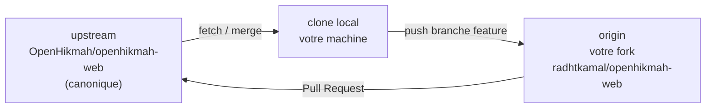

# Phase 15 — Workflow Git OSS

> **Prérequis :** Phases [1](./phase-1-what-is-openhikmah.md)–[14](./phase-14-engineering-culture.md) — configuration locale (Phase 10), tests (Phase 13), conventions PR (Phase 14)  
> **Balises de preuve :** **FACT** (fait vérifié) · **INFERENCE** (déduction) · **UNKNOWN** (inconnu)

La Phase 14 a couvert **comment** les changements sont revus. La Phase 15 couvre **où** vivent vos commits dans git — fork, upstream, branches, push et ouverture d'une PR vers `OpenHikmah/openhikmah-web`.

**Cette phase est surtout en lecture seule** — vous vérifiez vos remotes et parcourez le workflow sur papier. La Phase 16 choisit votre première cible de contribution.

---

## Le modèle mental des trois dépôts



| Remote | URL (votre machine) | Rôle |
| --- | --- | --- |
| **`upstream`** | `https://github.com/OpenHikmah/openhikmah-web.git` | Projet canonique — **lire** les mises à jour ici ; **ne jamais push** directement sauf si vous êtes mainteneur |
| **`origin`** | `https://github.com/radhtkamal/openhikmah-web.git` | **Votre fork** — pusher les branches feature ici |
| **local** | `/Users/eihdar/Documents/ChatGPT/openhikmah-web` | Où vous branchez, committez et exécutez les hooks |

**FACT:** Inspecté sur votre clone (sep. 2026) :

```text
origin   → https://github.com/radhtkamal/openhikmah-web.git
upstream → https://github.com/OpenHikmah/openhikmah-web.git
```

**FACT:** GitHub confirme que `radhtkamal/openhikmah-web` est un **fork** de `OpenHikmah/openhikmah-web`.

**FACT:** Votre `main` est au commit `a472416` et correspond à **`origin/main`** et **`upstream/main`** (0 commits derrière/devant upstream après fetch).

**INFERENCE:** GitHub Desktop a déjà configuré les remotes correctement — vous pouvez sauter le setup « comment ajouter upstream » et vous concentrer sur la boucle continue.

---

## Nommage des branches et où elles vivent

**FACT** (Phase 14) : les branches utilisent `feat/`, `fix/`, `chore/` ou `docs/` + description kebab-case.

**Règle :** Créez les branches feature depuis un **`main` frais**, pas depuis du travail périmé :

```text
upstream/main  ──merge──►  local main  ──branch──►  fix/my-contribution
                                              │
                                              └── push ──► origin/fix/my-contribution
```

**INFERENCE:** Gardez **`main` sur votre fork aligné avec `upstream/main`** — utilisez-le comme branche de sync, pas comme branche de développement longue durée. Tout le travail se fait sur des branches feature nommées.

**FACT:** `scripts/precommit-checks.mjs` **bloque les commits directement sur `main`** — même en local vous devez utiliser une branche feature.

---

## La boucle contributeur (chaque PR)

### 0. Avant de commencer — sync

```bash
git checkout main
git fetch upstream
git merge upstream/main          # or: git rebase upstream/main
git push origin main             # keep fork main current
```

**Pourquoi :** Réduit les conflits de merge et assure que la CI tourne contre le code le plus récent.

**Votre statut maintenant :** Déjà synchronisé à `a472416` — cette étape serait un no-op aujourd'hui.

---

### 1. Créer une branche feature

```bash
git checkout -b fix/short-description
```

Exemples alignés avec l'historique du dépôt :

```text
fix/search-dialog-focus-trap
docs/onboarding-typo
chore/readme-docker-note
```

Choisissez **`fix/`** vs **`feat/`** vs **`chore/`** honnêtement — l'auto-triage mappe les préfixes de titre aux labels (`fix`→`bug`, `feat`→`enhancement`).

---

### 2. Faire les changements + valider

Minimum avant commit (Phases 13 + 14) :

```bash
bun run format:check
bun run lint
bun run typecheck
bun run test:ci
```

Avant le **push** (hook pre-push) :

```bash
docker info                      # must succeed
# hook runs: bun run test:integration
```

**FACT:** Sauter `--no-verify` est déconseillé sauf instruction explicite d'un mainteneur.

---

### 3. Commit

Conventional commit avec scope :

```bash
git add <files>
git commit -m "$(cat <<'EOF'
fix(canvas): prevent duplicate edge on rapid expand

EOF
)"
```

Si un fichier entièrement nouveau ou ~30+ lignes ont été générés par IA avec édition minimale, ajoutez le trailer selon `AGENTS.md` :

```text
Generated-By: Cursor
```

**Pas de `Co-Authored-By`.**

---

### 4. Push vers **votre fork** (`origin`)

```bash
git push -u origin fix/short-description
```

**FACT:** Le premier push d'une branche nécessite `-u` pour que les pushes suivants puissent être un simple `git push`.

**INFERENCE:** Vous pushez vers **`origin`**, jamais vers **`upstream`**, en tant que contributeur externe.

---

### 5. Ouvrir une PR vers **OpenHikmah/main**

Dépôt cible : **`OpenHikmah/openhikmah-web`**, branche de base **`main`**, branche compare **`radhtkamal:fix/short-description`**.

**CLI** (quand prêt) :

```bash
gh pr create \
  --repo OpenHikmah/openhikmah-web \
  --base main \
  --head radhtkamal:fix/short-description \
  --title "fix(canvas): prevent duplicate edge on rapid expand" \
  --body "$(cat <<'EOF'
## Summary

- …

## Type of change

- [x] Bug fix

## AI / Theological changes

- [x] No AI or theological changes in this PR

## Testing

- [x] `bun run test:ci` passes locally
- [x] `bun run typecheck` passes locally
- [x] `bun run lint` passes locally
- [x] `bun run format:check` passes locally
- [x] New tests added for new functionality

## Checklist

- [x] Branch is up to date with `main`
- [x] Conventional commits
- [x] No secrets or real API keys in the diff
EOF
)"
```

**UI GitHub :** Fork → « Contribute » → « Open pull request » → assurez-vous que le dépôt de base est **OpenHikmah/openhikmah-web**, pas votre fork.

**INFERENCE:** Les PR depuis forks ont un `GITHUB_TOKEN` en lecture seule pour certains commentaires bot — la CI tourne pleinement ; les commentaires bundle-size utilisent un workflow de suivi (Phase 14).

---

### 6. Pendant la review — rester à jour

Quand `upstream/main` avance pendant que votre PR est ouverte :

```bash
git checkout fix/short-description
git fetch upstream
git merge upstream/main            # or rebase if you prefer linear history
# resolve conflicts if any
bun run test:ci                    # re-verify
git push origin fix/short-description
```

**INFERENCE:** Les mainteneurs préfèrent souvent **merge commits ou merge-upstream** au force-push pour les contributeurs débutants — demandez si incertain. Évitez `git push --force` sauf si la review demande explicitement rebase + force.

Traitez la review en **nouveaux commits** sur la même branche — pattern de la PR #598 : citer le feedback, corriger, repusher.

---

### 7. Après merge — nettoyer

```bash
git checkout main
git fetch upstream
git merge upstream/main
git push origin main

git branch -d fix/short-description
git push origin --delete fix/short-description   # optional
```

**INFERENCE:** Supprimer les branches mergées garde le fork propre ; GitHub peut auto-supprimer les branches head si vous l'activez dans les paramètres du fork.

---

## GitHub Desktop vs CLI

Vous avez cloné via **GitHub Desktop** — mappings équivalents :

| Intention | GitHub Desktop | CLI |
| --- | --- | --- |
| Sync depuis le canonique | Fetch `upstream`, merge dans `main` | `git fetch upstream && git merge upstream/main` |
| Nouvelle branche | Branch → New branch | `git checkout -b fix/…` |
| Commit | Panneau Commit | `git commit` |
| Push | Push origin | `git push -u origin branch` |
| Ouvrir PR | Branch → Create pull request | `gh pr create --repo OpenHikmah/openhikmah-web …` |

**FACT:** Votre CLI `gh` est authentifié comme **`radhwana`** alors que le remote fork est **`radhtkamal`** — les deux peuvent coexister si `radhwana` a l'accès push à `radhtkamal/openhikmah-web`. Si `gh pr create` échoue avec des erreurs de permission, utilisez `--head radhtkamal:branch` explicitement ou ouvrez la PR dans le navigateur.

**UNKNOWN:** Si le « Create PR » de GitHub Desktop utilise par défaut la base `OpenHikmah/main` — **vérifiez toujours** le dépôt de base avant de soumettre.

---

## Ce qu'il ne faut **pas** faire

| Erreur | Pourquoi c'est nuisible |
| --- | --- |
| PR depuis `main` avec commits non liés mélangés | Difficile à reviewer ; pre-commit bloquait déjà les commits sur main |
| Base PR = `main` de votre fork uniquement | Ne contribue pas upstream — doit cibler **OpenHikmah/openhikmah-web** |
| Push vers `upstream` | Permission refusée (sauf mainteneur) |
| `--no-verify` sur commit/push | Saute les hooks ; la CI peut quand même échouer ; viole les normes du dépôt |
| Force-push `main` | Jamais nécessaire pour le flux OSS normal |
| Commit `.env.local` ou clés API | gitleaks + rejet en review |
| Grosse PR touchant auth + IA + UI | CODEOWNERS + review théologique — split (Phase 14) |

---

## Cas particulier : vos docs d'onboarding

**FACT:** La ligne 46 de `.gitignore` ignore tout le répertoire `docs/` :

```gitignore
docs/
```

Tous les fichiers sous `docs/onboarding/` (Phases 1–15) sont **local uniquement** — ils n'apparaissent pas dans `git status` et **ne peuvent pas être PRés tels quels**.

| Si vous voulez… | Approche |
| --- | --- |
| Garder les docs personnelles | Ne rien faire — le setup actuel convient pour apprendre |
| Contribuer l'onboarding upstream | Ouvrir une **issue d'abord** proposant des docs dans le dépôt ; peut nécessiter un changement `.gitignore` ou déplacer les docs vers un chemin non ignoré (décision mainteneur) |
| Pratique première PR | Choisir une cible **code** de la Phase 16 — pas la série onboarding ignorée |

**INFERENCE:** Traitez l'onboarding comme votre carnet d'étude privé jusqu'à ce que les mainteneurs s'accordent sur une politique de documentation upstream.

---

## Checklist d'hygiène du fork

Exécutez cet exercice de vérification maintenant (lecture seule sauf fetch) :

```bash
# 1. Remotes
git remote -v

# 2. Sync state
git fetch upstream
git status -sb
git rev-list --count main..upstream/main    # should be 0 when current

# 3. Fork relationship
gh repo view radhtkamal/openhikmah-web --json isFork,parent

# 4. Hooks present
test -x .husky/pre-commit && test -x .husky/pre-push && echo "hooks OK"

# 5. Docker (for future push)
docker info >/dev/null && echo "docker OK" || echo "docker NOT running — fix before push"
```

**Attendu sur votre machine aujourd'hui :**

| Vérification | Attendu |
| --- | --- |
| `origin` | `radhtkamal/openhikmah-web` |
| `upstream` | `OpenHikmah/openhikmah-web` |
| Derrière upstream | `0` |
| Working tree | clean |
| `docs/onboarding/` | présent en local, **ignoré par git** |

---

## Dry-run : branche sans committer

Répétition mentale optionnelle — crée une branche, puis la supprime :

```bash
git checkout main
git pull upstream main          # no-op if current
git checkout -b chore/phase15-dry-run
# …would edit files here…
git checkout main
git branch -D chore/phase15-dry-run
```

Pas de push, pas de PR — confirme le workflow de branche sans bruit sur votre fork.

---

## La CI tourne aussi sur votre fork

**FACT:** Pusher une branche vers `origin` déclenche GitHub Actions sur **`radhtkamal/openhikmah-web`** (même fichier workflow qu'upstream).

**INFERENCE:** Vous pouvez voir le CI vert sur votre fork **avant** d'ouvrir la PR upstream — utile pour les premières contributions.

**INFERENCE:** Ouvrez la PR seulement quand le CI du fork passe — économise le temps du mainteneur.

---

## À COMPRENDRE MAINTENANT

1. **`upstream`** = source de lecture canonique ; **`origin`** = votre fork pour les pushes.
2. **Cible PR** = `OpenHikmah/openhikmah-web` **`main`**, head = `radhtkamal:<branch>`.
3. **Ne jamais committer sur `main` local** — branches feature uniquement (imposé par hook).
4. **Boucle de sync :** `fetch upstream` → mettre à jour `main` local → branche → push `origin` → PR → après merge, resync.
5. **pre-push nécessite Docker** — les tests d'intégration tournent avant que le push réussisse.
6. **`docs/onboarding/` est gitignored** — pas partie de votre première PR sauf changement de politique.
7. Votre fork est **déjà configuré et synchronisé** — vous êtes prêt pour une branche feature quand la Phase 16 choisit une cible.

---

## UTILE PLUS TARD

- `gh pr checks` — surveiller la CI sur votre PR
- `gh pr view --web` — commentaires de review
- Activer « Automatically delete head branches » sur votre fork
- `git config pull.rebase false` vs `true` — choisir un style rebase/merge et rester cohérent

---

## IGNORER POUR L'INSTANT

- Contribuer directement à `OpenHikmah` sans fork (mainteneur uniquement)
- Git worktrees / PR empilées — pas utilisées dans l'historique de ce dépôt
- Signature des commits — pas requise sauf changement des paramètres du dépôt
- Publication des docs d'onboarding — décision séparée des contributions code

---

## Questions de contrôle Phase 15

1. Quelle est la différence entre `origin` et `upstream` sur votre clone ?
2. Quel dépôt GitHub doit être la **base** à l'ouverture d'une PR de contribution ?
3. Pourquoi ne pouvez-vous pas PR `docs/onboarding/phase-14-engineering-culture.md` aujourd'hui ?
4. Qu'est-ce qui tourne sur `git push` qui ne tourne **pas** sur `git commit` ?
5. Après le merge de votre PR, quelles trois commandes resynchronisent le `main` de votre fork ?

---

**Suivant :** [Phase 16 — Carte des surfaces de contribution et préparation](./phase-16-contribution-readiness.md) — cibles de première PR classées, risques et checklist de préparation honnête.

**À vous :** Exécutez la **Checklist d'hygiène du fork**, puis répondez **"continue to Phase 16"** — ou demandez si vous voulez un walkthrough d'ouverture d'une PR dry-run avec un commit vide (toujours lecture seule si vous supprimez la branche avant push).
