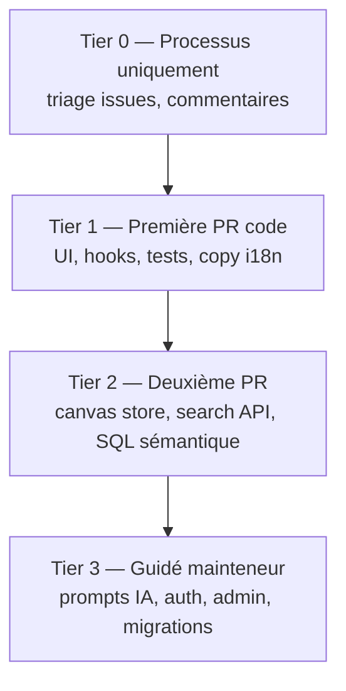

# Phase 16 — Carte des surfaces de contribution et préparation

> **Prérequis :** Phases [1](./phase-1-what-is-openhikmah.md)–[15](./phase-15-oss-git-workflow.md) — complètes ou survolables ; exécution locale de l'app au moins une fois (Phase 10) fortement recommandée  
> **Balises de preuve :** **FACT** (fait vérifié) · **INFERENCE** (déduction) · **UNKNOWN** (inconnu)

C'est la **dernière phase d'onboarding**. Elle cartographie où vous pouvez contribuer en sécurité, classe les premières PR réalistes par rapport aux **issues ouvertes et au code**, et donne une checklist de préparation honnête — pour que votre première PR upstream construise la légitimité, pas le bruit.

**Toujours en lecture seule jusqu'à ce que vous choisissiez une cible et une branche.** Aucune PR n'est ouverte par ce document.

---

## Ce que signifie « contributeur OSS récurrent » ici

**INFERENCE:** Pour Open Hikmah, la légitimité n'est pas « beaucoup de PR mergées ». C'est :

1. **Changements ciblés** qui correspondent à la culture du dépôt (Phase 14)
2. **Tests** qui prouvent le comportement sans affaiblir les garde-fous (Phase 13)
3. **Divulgation honnête dans la PR** en touchant IA, noms ou connexions (Phase 3)
4. **Hygiène git répétable** (Phase 15)

Une excellente petite correction bat cinq corrections bâclées.

**FACT:** Il n'y a **pas** de label `good first issue` ou `help wanted` dans le dépôt aujourd'hui — vous devez juger l'adéquation vous-même à partir du texte des issues, des labels et du risque des chemins.

---

## Carte de complétion de l'onboarding

| Phase | Vous devriez pouvoir… |
| --- | --- |
| **1–2** | Expliquer la boucle principale et pourquoi l'ancrage compte |
| **3** | Nommer Tanzih, le cadrage Maturidi/Hanafi et `isValidRef` — et pourquoi ne pas affaiblir les tests |
| **4–5** | Naviguer `app/`, `lib/`, `components/`, `__tests__/` sans vous perdre |
| **6–8** | Tracer recherche → canvas → expand → Zustand → persistance |
| **7** | Décrire `discoverCandidates` → `generateGroundedConnections` → cache |
| **9–10** | Lancer Postgres, seed, variables d'env, smoke-check expand |
| **11–12** | Corréler l'onglet Network avec `graph-service` ; expérience de timing cache optionnelle |
| **13** | Choisir unitaires vs intégration vs e2e pour un changement |
| **14–15** | Écrire un corps de PR, utiliser fork/upstream, passer les hooks |

Si une ligne est faible, **comblez cet écart avant une PR Tier 1** — ou choisissez d'abord une étape Tier 0 commentaire issue / docs uniquement.

---

## Carte des surfaces de contribution (niveaux de risque)



### Tier 0 — Pas de code (ou commentaire uniquement)

| Action | Exemple | Risque |
| --- | --- | --- |
| Confirmer issues périmées | #561, #562, #608 — voir [Issues périmées](#issues-périmées-ou-partiellement-résolues) | Aucun |
| Demander le périmètre sur le manifest #608 | « PWA voulue ou robots+sitemap uniquement ? » | Aucun |
| Déposer un **bug** avec repro | Utiliser le template d'issue + ref de verset | Faible |

**INFERENCE:** Des commentaires d'issue réfléchis qui citent des **preuves commit/PR** construisent la confiance du mainteneur avant votre première PR code.

---

### Tier 1 — Première PR code recommandée

**Profil :** Diff borné, patterns existants, tests reflétant la source, pas de prompts théologiques, pas de chemins CODEOWNERS.

| Zone | Chemins | Travail typique | Tests |
| --- | --- | --- | --- |
| **Hygiène layout / perf** | `components/layout/Header.tsx`, `ContextSidebar.tsx`, `hooks/useActivityTracker.ts` | Fixes de sélecteurs, deps d'effets (issue #572) | Étendre `__tests__/components/layout/*`, `__tests__/hooks/useActivityTracker.test.ts` |
| **UX recherche / canvas** | `components/search/`, `components/canvas/` (toolbar, empty state, tour) | Focus, a11y, chargement | Tests composants + `e2e/` optionnel |
| **Store canvas** | `store/canvas.ts` | Dédup, cas limites layout | `__tests__/store/canvas.test.ts` |
| **Tests de régression uniquement** | `__tests__/` | Verrouiller un bug corrigé | Autonome |
| **Copy UI (non-théologie)** | `messages/*.json` | Labels boutons, états vides | Tests snapshot/message si présents |
| **SEO / métadonnées statiques** | `app/robots.ts`, `app/sitemap.ts`, futur manifest | Après confirmation du périmètre issue #608 | `__tests__/app/sitemap.test.ts`, tests robots si ajoutés |

**FACT:** La Phase 5 listait ces zones comme « premières contributions plus sûres » — toujours exact.

---

### Tier 2 — Après une PR mergée ou une review solide

| Zone | Chemins | Requiert |
| --- | --- | --- |
| Recherche sémantique | `lib/quran/semantic-search.ts` | Modèle mental pgvector (Phase 9) ; issue #105 |
| API recherche | `app/api/search/route.ts` | Rate limits, double chemins de recherche |
| Persistance canvas | `hooks/useCanvasPersistence.ts` | Courses share vs localStorage (Phase 8) |
| Social / workspaces | `app/api/social/*`, `lib/social/*` | Patterns Auth + Drizzle |

---

### Tier 3 — Ne pas faire seul en première contribution

| Zone | Pourquoi |
| --- | --- |
| `lib/ai/connection-generator.ts`, prompts | Théologie + validation (Phases 3, 7) |
| `lib/ai/theological-constraints.ts` | Texte de contrainte sacré |
| `lib/names/divine-names/data/` | Contenu théologique |
| `lib/auth/`, `app/callback/` | Sécurité — **CODEOWNERS** |
| `app/api/admin/`, `lib/admin/` | Admin fail-closed |
| `lib/infra/db/migrations/` | Schéma réversible + tests d'intégration requis |
| Issues ouvertes **security-vulnerability** (#556, #563, #568, …) | Besoin d'appairage mainteneur ; divulgation privée si exploitable |

**FACT:** `CONTRIBUTING.md` — ouvrir une **issue d'abord** pour nouveau comportement IA, nouvelles pages ou changements PKCE.

---

## Candidats de première PR classés (basés sur des preuves)

Ordonnés par **accessibilité × clarté × alignement mainteneur**. Vérifiez l'état des issues avant de commencer — les labels décalent par rapport aux fixes.

### 1. Issue #572 — Sélecteurs social-store Header (E1) ⭐ meilleure cible code

**FACT:** Le corps de l'issue pointe vers `Header.tsx:217` — destructurer tout `useSocialStore()` sans sélecteurs provoque des re-renders excessifs sur le canvas.

| Champ | Détail |
| --- | --- |
| **Branche** | `fix/header-social-store-selectors` |
| **Périmètre** | Un fichier (+ test si vous ajoutez assertion de render-count ou comportement) |
| **Risque** | Faible — perf, pas de théologie |
| **Compétences** | Sélecteurs Zustand, bases re-render React |
| **Type PR** | Bug fix / refactor |

**INFERENCE:** Correspond aux findings du sweep du mainteneur — probablement accueilli si la PR est petite et testée.

---

### 2. Issue #572 — Deps d'effet `useActivityTracker` (E4)

| Champ | Détail |
| --- | --- |
| **Chemins** | `hooks/useActivityTracker.ts` |
| **Périmètre** | Arrêter de relancer le flush à chaque tick de drag |
| **Risque** | Faible–moyen — comportement tracking activité canvas |
| **Tests** | `__tests__/hooks/useActivityTracker.test.ts` existe — étendre |

Faites **un** finding #572 par PR (Phase 14 : PR petites et ciblées).

---

### 3. Issue #572 — Hydratation `ContextSidebar` (E5)

| Champ | Détail |
| --- | --- |
| **Chemins** | `components/layout/ContextSidebar.tsx` |
| **Périmètre** | Corriger le pattern `matchMedia` dans l'initializer lazy `useState` |
| **Risque** | Faible — mismatch d'hydratation latent |
| **Tests** | `__tests__/components/layout/ContextSidebar.test.tsx` |

---

### 4. Issue #608 — Web manifest (seulement après commentaire de périmètre)

**FACT:** `app/robots.ts` et `app/sitemap.ts` **existent déjà** sur `main` (PR #612). Le corps de l'issue #608 est **partiellement périmé**.

**FACT:** Pas de `manifest.webmanifest` (ni route manifest App Router) trouvé dans le dépôt.

| Champ | Détail |
| --- | --- |
| **Bloqueur** | L'issue demande : PWA intentionnelle ou non ? |
| **Action d'abord** | Commenter sur #608 citant #612 ; demander si fermer la portion robots/sitemap et cadrer manifest uniquement |
| **Si approuvé** | `chore/seo-web-manifest` — métadonnées statiques, pas d'IA |

---

### 5. PR test de régression uniquement

Si vous trouvez un bug en utilisant l'app :

1. Déposer une issue avec repro (template)
2. Branche `test/describe-bug` ou `fix/...` avec test en échec → fix
3. Suivre le pattern des tests DELETE bookmark dans `__tests__/api/bookmarks.test.ts` pour les routes API

**INFERENCE:** Les PR test-only qui **resserrent** les assertions (comme l'inspection Drizzle `where` de la PR #598) correspondent à la culture.

---

### 6. Polish i18n / a11y

| Cible | Notes |
| --- | --- |
| `messages/en.json` (+ tr/ru/az si vous pouvez) | Chaînes UI non théologiques uniquement |
| Avertissements `e2e/a11y.spec.ts` | Violations axe modérées sont loguées mais ne font pas échouer — corriger la cause racine est bien **après** reproduction locale |

**Éviter :** traduire **signification/description** de noms divins sans passer par les chemins `translateReason` / cache existants (Phase 7, pattern PR #611).

---

### Non recommandé en première PR

| Élément | Pourquoi |
| --- | --- |
| **#561** refs zero-padded | **Déjà corrigé** sur `main` (#575, #578) — voir issues périmées |
| **#562** bookmark DELETE | **Déjà corrigé** — trim + delete dual-key dans `app/api/bookmarks/[ref]/route.ts` avec tests |
| **#568, #556, #563** sécurité | CODEOWNERS + expertise sécurité |
| **#567** boucle backfill | Sémantique quota Admin/Gemini — facile à casser |
| **#109–#116** fonctionnalités | Gros produit — discussion issue d'abord |
| **`docs/onboarding/`** | **Gitignored** (`docs/` dans `.gitignore`) — pas committable sans changement de politique |
| **Stagger Expérience B** (Phase 12) | Exercice d'apprentissage uniquement — pas merge-worthy seul |

---

## Issues périmées ou partiellement résolues

Mérite un **commentaire Tier 0** avant de coder :

| Issue | Statut sur `main` (sep. 2026) | Action suggérée |
| --- | --- | --- |
| **#561** | `isValidRef` rejette `02:255` ; tests dans `quran-corpus.test.ts` | Commenter avec liens #575/#578 ; demander fermeture |
| **#562** | DELETE trim + `inArray([ref, verseRef])` ; tests à `bookmarks.test.ts:279+` | Commenter avec refs fichiers ; demander fermeture |
| **#608** | robots + sitemap livrés (#612) ; manifest ouvert | Commenter complétion partielle ; clarifier périmètre manifest |

**INFERENCE:** Fermer des issues périmées aide les mainteneurs et montre que vous avez lu `main` — première interaction valide.

---

## Auto-évaluation de préparation

Notez chaque point **honnêtement** : ✅ confiant · ~ partiel · ✗ pas encore

### Environnement et workflow

| Vérification | ✅ / ~ / ✗ |
| --- | --- |
| `bun run dev` fonctionne ; canvas charge | |
| Postgres seedé ; expand renvoie des connexions (Phase 10) | |
| `bun run test:ci` passe en local | |
| `docker info` OK ; `bun run test:integration` passe | |
| `origin` = votre fork, `upstream` = OpenHikmah ; `main` synchronisé | |
| Lu la boucle fork Phase 15 une fois | |

### Modèle de confiance (non négociable)

| Vérification | ✅ / ~ / ✗ |
| --- | --- |
| Peut expliquer « les données découvrent ; l'IA articule » | |
| Sait ce que protègent `isValidRef` et Tanzih | |
| Corrigerait un test ref en échec par **données/code**, pas en assouplissant la validation | |
| Sait quand la section PR AI/Theological est requise | |

### Navigation code

| Vérification | ✅ / ~ / ✗ |
| --- | --- |
| A tracé expand : `HikmahCanvas` → `/api/connections` → `getConnections` | |
| Sait où ajouter un test unitaire pour un changement layout | |
| Peut nommer un chemin CODEOWNERS à éviter sur PR #1 | |

### Score

| Score | Verdict |
| --- | --- |
| **Tout environnement ✅, ≥2 confiance ✅, ≥2 navigation ✅** | **Prêt pour PR code Tier 1** (choisir un item #572) |
| **Environnement ~, confiance ✅** | Faire d'abord les exercices Phases 10 + 13 |
| **Confiance ~ ou ✗** | Relire Phases 3 + 7 avant tout changement `lib/ai/` ou validation API |
| **Environnement ✗** | Finir le setup local — une PR code gaspillera des cycles de review |

**Votre machine (inspectée Phase 15) :** remotes et sync ✅ · docs onboarding local-only ✅ · auth `gh` comme `radhwana` / fork `radhtkamal` — vérifier le nommage de branche head PR avec la CLI.

---

## Checklist pré-vol (jour où vous ouvrez PR #1)

```bash
# Sync
git checkout main && git fetch upstream && git merge upstream/main && git push origin main

# Branch
git checkout -b fix/header-social-store-selectors   # example

# … edit …

# Quality bar
bun run format:check && bun run lint && bun run typecheck && bun run test:ci

# Push (integration runs here)
docker info && git push -u origin fix/header-social-store-selectors

# PR → OpenHikmah/openhikmah-web main
gh pr create --repo OpenHikmah/openhikmah-web --base main \
  --head radhtkamal:fix/header-social-store-selectors \
  --fill   # or use template body from Phase 15
```

Corps de PR minimum :

- Puces de résumé (quoi + pourquoi)
- Lien **Fixes #572** (ou partie) si applicable
- AI/Theological : **cocher « No AI or theological changes »** pour les cibles Tier 1
- Checklist Testing remplie honnêtement

---

## Chemin 30 jours vers contributeur récurrent

**INFERENCE:** Un rythme réaliste pour quelqu'un avec votre profil (~6 ans React/TS), à temps **partiel** :

| Semaine | Objectif |
| --- | --- |
| **1** | Smoke Phase 10 + tests Phase 13 verts ; commentaires Tier 0 sur #561/#562/#608 |
| **2** | PR #1 : un item #572 (~50–150 lignes) ; répondre à la review sous 48 h |
| **3** | PR #2 : extension de test ou second item #572 ; lire une PR mainteneur mergée (#611 ou #598) |
| **4** | Exploration Tier 2 optionnelle — lire issue #105 ; **ne pas implémenter** jusqu'à engagement mainteneur |

**Marqueurs de légitimité :**

- CI vert sur votre fork avant de demander review
- Pas de `--no-verify`
- Feedback de review traité avec **nouveaux commits** et réponses courtes
- Issues déposées pour bugs non corrigés immédiatement

**UNKNOWN:** Cadence de merge mainteneur pour premières PR externes — prévoir **au minimum un round de review**.

---

## Après l'onboarding — quoi continuer à faire

| Habitude | Pourquoi |
| --- | --- |
| `git fetch upstream` avant chaque branche | Petits diffs |
| Lire `AGENTS.md` en touchant de nouvelles zones | Les mises à jour de politique arrivent là |
| Lancer l'intégration en local avant push | Correspond au hook pre-push |
| Survoler les PR mergées dans `OpenHikmah/openhikmah-web` | La culture reste à jour |
| Garder des notes personnelles dans `docs/onboarding/` en local | Gitignored — ok pour étudier |

**Graduation :** Vous êtes **onboarding-complete** quand vous pouvez (1) choisir une cible Tier 1 sur cette carte, (2) passer la barre de préparation, et (3) ouvrir une PR sans affaiblir les garde-fous Phase 3.

Vous n'avez **pas** besoin de mémoriser les 16 phases — gardez ce fichier et le « si vous avez besoin de X, ouvrez Y » de la Phase 5 comme références de bureau.

---

## À COMPRENDRE MAINTENANT

1. **Tier 1 d'abord** — perf layout (#572), tests, i18n non théologique ; pas prompts IA ni auth.
2. **Pas de label `good first issue`** — utilisez cette carte + texte des issues ouvertes.
3. **Plusieurs bugs ouverts sont déjà corrigés sur `main`** — vérifier avant de coder (#561, #562, #608 partiel).
4. **Une préoccupation par PR** — séparer #572 E1 / E4 / E5.
5. **Les docs d'onboarding sont gitignored** — première PR upstream devrait être du **code**, sauf accord mainteneur pour un-ignore `docs/`.
6. **Contributeur récurrent** = petites corrections fiables + tests + divulgation honnête — pas le volume.

---

## UTILE PLUS TARD

- Surveiller les issues label `bug` sans `security-vulnerability`
- S'appairer avec le mainteneur sur `security-vulnerability` après premier merge
- Proposer de retirer `docs/onboarding/` du `.gitignore` via une issue si vous voulez des guides d'étude upstream

---

## IGNORER POUR L'INSTANT

- Livrer l'Expérience B Phase 12 en PR
- Concurrencer le volume de merges Dependabot
- Grosses issues fonctionnalités (#109–#116) en premier contact
- Assouplir la validation « pour débloquer » les sorties IA

---

## Questions de contrôle Phase 16

1. Quelle est la **meilleure** cible de première PR code dans ce doc, et pourquoi ?
2. Pourquoi commenter sur #608 avant d'implémenter un manifest ?
3. Nommez trois chemins qui requièrent une review CODEOWNERS.
4. Quel score sur le tableau de préparation signifie « prêt pour Tier 1 » ?
5. Pourquoi `docs/onboarding/` n'est pas votre première PR ?

---

## Série terminée

Les Phases **1–16** sont un parcours d'onboarding ingénierie en lecture seule pour **OpenHikmah / `openhikmah-web`**.

**Actions suivantes suggérées (choisir une) :**

1. **Tier 0** — Commenter sur #561, #562 ou #608 avec preuves depuis `main`
2. **Tier 1** — Branche `fix/header-social-store-selectors` pour l'issue #572 E1
3. **Vérifier** — Exécuter les Étapes 1–2 pratiques Phase 13 si pas encore fait
4. **Demander** — « Walk me through opening PR #1 for #572 E1 » et passer de lecture seule à implémentation

Il n'y a pas de Phase 17 dans cette série — la vraie contribution commence quand vous choisissez une cible et une branche.
