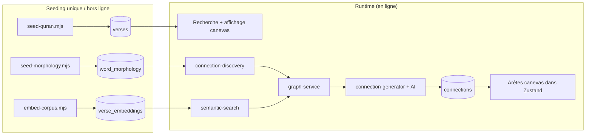
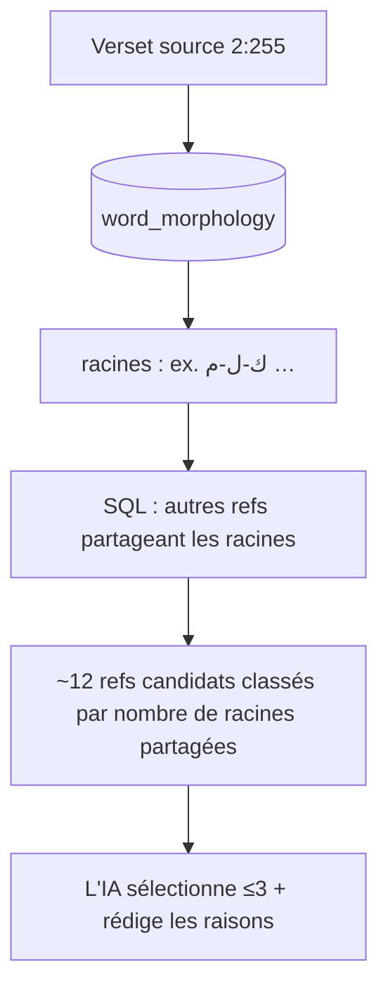
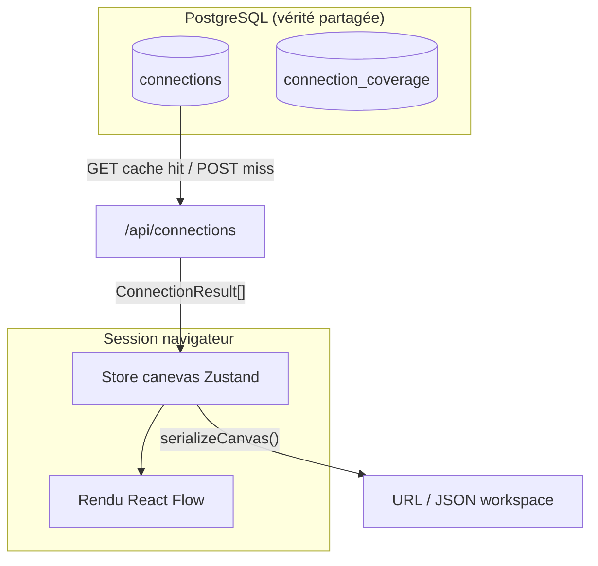
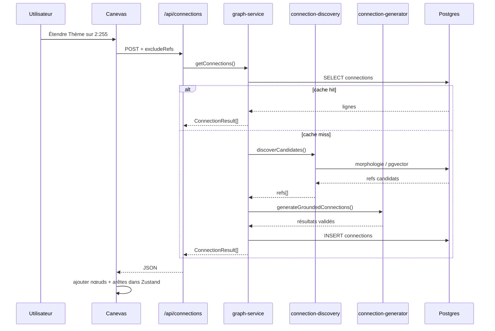

# Phase 2 — Primer du domaine

> **Prérequis :** [Phase 1 — Qu'est-ce qu'OpenHikmah ?](./phase-1-what-is-openhikmah.md)  
> **Balises de preuve :** **FACT** · **INFERENCE** · **UNKNOWN**

La Phase 2 relie les concepts Coran/IA/recherche aux **modules OpenHikmah réels**. Ce n'est pas un cours général sur les embeddings ou la morphologie arabe — chaque section se termine par *où dans ce dépôt* le concept vit.

---

## Cadre narratif

Avant de tracer le code du canevas, gardez ce pipeline en tête :



**À COMPRENDRE MAINTENANT :** Le texte sacré et les rails d'ancrage sont **seedés dans Postgres**. Les chemins runtime les **lisent** ; le LLM intervient seulement après les candidats ou la validation corpus.

---

## 1. Modèle de données Coran

### Références sourate et ayah

**FACT :** Un verset est identifié par une ref chaîne `"surah:ayah"` — ex. `"2:255"` (Ayat al-Kursi).

**FACT :** `isValidRef()` dans `lib/quran/quran-corpus.ts` impose :

| Règle | Exemple |
| --- | --- |
| Format `^\d+:\d+$` uniquement | `"2:255"` ✓ · `"02:255"` ✗ |
| Sourate 1–114 | `"115:1"` ✗ |
| Ayah dans le compte Hafs par sourate | `"1:8"` ✗ (Al-Fatiha a 7 ayahs) |
| Orthographe canonique (pas de zéros initiaux) | `"2:0255"` ✗ |

**FACT :** Les **noms** de sourate ne sont pas stockés par ligne de verset. Ils sont dérivés à la lecture depuis `lib/quran/surah-names.ts` (commentaire `schema.ts` sur la table `verses`).

**INFERENCE :** Pensez à `ref` comme une clé primaire stable — similaire à un ID de document Firestore que vous ne laissez jamais inventer par les utilisateurs, sauf que ici l'espace d'ID est contraint par la structure coranique.

### L'objet `Verse` (type application)

**FACT :** `types/quran.ts` :

```typescript
interface Verse {
  surah: number;
  ayah: number;
  ref: VerseRef;           // "2:255"
  arabicText: string;
  translation: string;
  surahName: string;
  surahNameArabic: string;
}
```

C'est ce dans quoi se transforment les résultats de recherche, les nœuds canevas et les payloads API.

### Corpus local vs. fournisseurs distants

OpenHikmah utilise une stratégie de données **à niveaux** :

| Couche | Source | Rôle |
| --- | --- | --- |
| **Primaire** | Postgres `verses` + `verse_translations` | Tout le texte affiché que l'app fait confiance au quotidien |
| **Seeding** | Récupération Coran entier alquran.cloud | Population unique (`scripts/seed-quran.mjs`) |
| **Recherche de repli** | API alquran.cloud par ayah | Quand la ligne locale manque (`lib/quran/verse-resolver.ts`) |
| **Index de recherche par mot-clé** | quran.com `/api/v4/search` | Trouve des refs par texte ; résultats ré-hydratés depuis le corpus **local** |
| **Localisation des noms de sourate** | quran.com `/api/v4/chapters` | Élargit uniquement la correspondance des noms de sourate (`lib/quran/chapters.ts`) |

**FACT :** `seed-quran.mjs` récupère :

- Arabe : édition `quran-uthmani`
- Traduction : `en.sahih` (Saheeh International)
- Total attendu : **6236** ayahs

**FACT :** Après seeding, `lib/quran/quran-corpus.ts` sert le texte des versets depuis Postgres — *« Pure DB access: callers decide on any fallback. »*

**FACT :** `resolveVerse()` essaie le corpus local d'abord ; en échec journalise et bascule vers alquran.cloud live. Retourne **`null`** si la ref ne se résout nulle part — utilisé comme validation anti-hallucination.

**FACT :** Route de recherche (`app/api/search/route.ts`) pour les requêtes en forme de ref :

```typescript
// A ref-shaped query that isn't a real verse ... is not a result —
// never fabricate a verse card (AGENTS.md: no invented references).
const verse = isValidRef(q) ? await resolveVerse(q, edition) : null;
```

Les hits par mot-clé de quran.com sont aussi **ré-hydratés** via `getVerses()` pour que l'arabe/la traduction correspondent toujours au corpus local, pas au snippet quran.com retourné.

### Éditions de traduction

**FACT :** Traduction par défaut par locale UI (`lib/i18n/config.ts`) :

| Locale | Edition id |
| --- | --- |
| `en` | `en.sahih` |
| `tr` | `tr.diyanet` |
| `ru` | `ru.kuliev` |
| `az` | `az.mammadaliyev` |

**FACT :** La colonne `verses.translation` contient toujours `en.sahih`. Les autres éditions vivent dans `verse_translations` (PK composite : `ref + edition`). Une ligne d'édition manquante retombe sur `en.sahih`.

**FACT :** `AGENTS.md` — attribuer correctement les traductions ; Saheeh International depuis alquran.cloud.

**FACT :** `isValidEdition()` met en liste blanche les valeurs cookie/query — les éditions non reconnues retombent plutôt que d'être interpolées dans les URLs.

### Modes de recherche (comment le produit se mappe au code)

| Intention utilisateur | Route / fonction | Ancrage |
| --- | --- | --- |
| Ref directe `2:255` | `GET /api/search?q=2:255` | `isValidRef` + `resolveVerse` |
| Correspondance exacte nom de sourate | même route | `matchSurahsByQuery` → payload `matchedSurahs` |
| Mot-clé | même route → `keywordSearch()` | recherche quran.com → hydratation locale |
| Connexes par sens (complémentaire) | même route page 1 → `relatedByMeaning()` | `searchByMeaning()` + pgvector |
| Similaire à ce verset | `GET /api/verse/[s]/[a]/similar` | `similarVerses()` |

**FACT :** Les correspondances sémantiques sur la recherche par mot-clé sont **best-effort** et **complémentaires** — les échecs deviennent un tableau `related` vide, invisible pour l'utilisateur (commentaires `app/api/search/route.ts`).

**INFERENCE :** La « recherche par sens » du README se matérialise à la fois dans la section **Related by meaning** de la recherche et dans **Similar verses** depuis la barre latérale du verset — pas nécessairement un mode de recherche séparé.

---

## 2. Ancrage linguistique arabe

### Concepts (minimal)

| Terme | Signification dans ce dépôt |
| --- | --- |
| **Surface form** | Le mot tel qu'il apparaît dans le verset (avec diacritiques) |
| **Root** | Racine arabe trilitère (ou similaire) — ancrage morphologique partagé |
| **Lemma** | Forme lexicale associée à un mot |
| **Position** | Index du mot dans l'ayah |

**INFERENCE :** Les versets partageant une **racine** partagent souvent un ADN conceptuel même quand les traductions anglaises diffèrent. C'est pourquoi « Par racine » est un mode de connexion de premier ordre.

### D'où viennent les données de morphologie

**FACT :** `scripts/seed-morphology.mjs` :

- Lit les fichiers commités sous `data/morphology/*.jsonl`
- Générés depuis un **serveur de morphologie coranique canonique** (`fetch_word_morphology` — selon commentaire du script)
- Stocke **uniquement les mots porteurs de racine**
- Upsert idempotent sur `(ref, position)`

**FACT :** La couverture est **partielle par conception** — les versets sans lignes de morphologie retombent sur la génération IA **legacy** à la demande (en-tête `seed-morphology.mjs`).

### Comment fonctionne la correspondance par racine (déterministe)

**FACT :** `lib/ai/connection-discovery.ts` → `rootCandidates()` :

1. Sélectionne les racines distinctes pour la source `fromRef` depuis `word_morphology`
2. Trouve d'autres refs partageant ces racines
3. Classe par **nombre de racines partagées distinctes** (décroissant)
4. Exclut la ref source et tout `excludeRefs` (pour « en voir plus »)

**FACT :** Aucun LLM impliqué à cette étape.

**FACT :** `lib/quran/arabic-morphology.ts` fournit la tokenisation **UI** — correspondance des tokens du verset aux surfaces morphologiques via arabe normalisé (diacritiques supprimés, variantes alif unifiées). Cela alimente la surbrillance interactive des racines dans le texte du verset, séparément du SQL de découverte de connexions.



**À COMPRENDRE MAINTENANT :** Les connexions par racine sont du **SQL sur morphologie seedée**, pas de la mémoire du modèle — quand les données existent.

---

## 3. Récupération sémantique

### Ce qu'est un embedding *ici*

**FACT :** Chaque verset a un vecteur de **768 dimensions** dans `verse_embeddings.embedding` (`schema.ts`).

**FACT :** Les vecteurs sont produits depuis le texte de **`translation`** du verset (Saheeh anglais au moment du seed), via Gemini `gemini-embedding-001`, réduit à 768 dims avec `outputDimensionality` (`scripts/embed-corpus.mjs`, `.env.example`).

**INFERENCE :** Le classement est **indexé sur le sens anglais** même quand l'UI affiche une traduction turque/russe/azérie — la langue d'affichage et la langue de recherche diffèrent intentionnellement (commentaire `semantic-search.ts` sur `searchByMeaning`).

### pgvector et similarité

**FACT :** La définition de table inclut un index HNSW avec `vector_cosine_ops` :

```typescript
index("verse_embeddings_hnsw_idx").using("hnsw", t.embedding.op("vector_cosine_ops"))
```

**FACT :** `lib/quran/semantic-search.ts` calcule :

```typescript
const similarity = sql`1 - (cosineDistance(verse_embeddings.embedding, queryVec))`;
// ordered desc — higher = closer in meaning
```

Comparaison à Firestore : vous pourriez indexer `where('tag', '==', 'patience')`. pgvector résout le **plus proche voisin dans l'espace du sens** — aucun mot-clé partagé requis.

### Exemple conceptuel (ancré dans les chemins de code)

> L'utilisateur recherche : *« patience dans l'épreuve »*

1. **FACT :** `searchByMeaning()` normalise la requête → `embedQueryCached()` → embed Gemini (ou hit cache Redis, TTL 7 jours).
2. **FACT :** `nearest()` exécute la distance cosinus contre toutes les lignes `verse_embeddings`.
3. **FACT :** Les refs du top s'hydratent via `getVerses(refs, edition)` — l'utilisateur voit l'arabe + sa traduction choisie.
4. **INFERENCE :** Les résultats peuvent inclure des versets dont la traduction anglaise ne contient jamais le mot « patience » mais sont sémantiquement proches dans l'espace d'embeddings.

> L'utilisateur étend le verset `2:153` par **Thème**

1. **FACT :** `semanticCandidates("2:153")` → `similarVerses()` charge le vecteur stocké de cette ref → plus proches voisins (excluant soi + `excludeRefs`).
2. **FACT :** Ces refs deviennent la liste de choix autorisée de l'IA pour la génération thématique ancrée.

### Ce qui est persisté vs. calculé en direct

| Donnée | Persistée ? | Où |
| --- | --- | --- |
| Texte des versets | Oui | `verses`, `verse_translations` |
| Embedding par verset | Oui | `verse_embeddings` (script hors ligne) |
| Embedding de requête | Mis en cache optionnellement | Clé Redis `emb:q:<sha256>` |
| Classement de similarité | Calculé par requête | SQL sur pgvector |
| Raisons de connexion | Oui | `connections.reason` |

**FACT :** `embed-corpus.mjs` est reprenable — saute les refs déjà embedées pour le modèle courant.

---

## 4. Concepts de graphe de connaissances

### Nœud

**Dans le graphe persistant :** une **ref de verset** (ex. `"2:255"`) — pas un id de nœud canevas.

**Sur le canevas :** un nœud React Flow avec :

**FACT :** `store/canvas.ts` :

- `id` : `node-${counter}` généré — **pas** la ref du verset (le même verset peut apparaître une fois selon la politique de position ; les doublons se lient via les arêtes)
- `data` : objet `Verse` complet
- `position` : coordonnées de disposition `{ x, y }`

**INFERENCE :** **Identité** du verset = `ref`. **Identité** du nœud canevas = id opaque `node-N`.

### Arête / connexion

**Persistée (table `connections`) :**

**FACT :** `schema.ts` :

| Column | Signification |
| --- | --- |
| `fromRef`, `toRef` | Paire de versets dirigée |
| `kind` | `thematic` \| `root` \| `contrast` |
| `reason` | Texte d'explication généré par l'IA |
| `locale` | Langue de `reason` (`en` canonique) |
| `model` | LLM qui a écrit cette ligne |
| `status` | `active` \| `flagged` \| `retired` |

Index unique sur `(fromRef, toRef, kind, locale)` — une ligne par arête typée dirigée par locale.

**Sur le canevas (`SavedEdge` / `CanvasEdge`) :**

**FACT :** Stocke les **ids de nœuds** `source`/`target`, plus `kind`, `label`, `reason` dénormalisés pour le rendu — copiés depuis `ConnectionResult` API quand l'utilisateur étend.

### Graphe vs. canevas — la distinction



| | Graphe persistant | État canevas |
| --- | --- | --- |
| **Portée** | Globale — tous les utilisateurs profitent du cache | Par session / partage / workspace |
| **Identité** | Refs de versets | Ids de nœuds + disposition |
| **Arêtes** | Connexions canoniques pour `(fromRef, kind)` | Arêtes visuelles entre nœuds placés |
| **Survit au rafraîchissement** | Oui (Postgres) | Seulement si URL partagée ou workspace sauvegardé |
| **Coût IA** | Payé une fois par cellule, puis gratuit | Le client re-fetch les lignes en cache |

**FACT :** `lib/ai/graph-service.ts` — *« Reads connections from Postgres; only on a miss does it call the AI, then writes the result back so every later reader gets it for free. »*

**FACT :** Les canevas partagés stockent la disposition sérialisée nœuds/arêtes dans `shared_canvases.data` — la **disposition d'exploration**, pas le cache global de connexions (la Phase 8 approfondira).

---

## 5. Ancrage IA — le pipeline de connexion

Cette section est le détail opérationnel derrière la frontière de confiance de la Phase 1. Trace approfondie fichier par fichier → **Phase 7**.

### Étape 0 — Ce qui déclenche une requête

**FACT :** L'utilisateur étend un nœud sur le canevas → `HikmahCanvas.tsx` `runExpansion()` → `POST /api/connections` avec :

```json
{
  "fromRef": "2:255",
  "kind": "thematic",
  "arabicText": "...",
  "translation": "...",
  "excludeRefs": ["3:18", "..."]
}
```

**FACT :** `excludeRefs` = cibles déjà affichées pour ce nœud+kind (`getExpansionRefs`) — alimente **« en voir plus »** sans répéter les arêtes.

### Étape 1 — Lecture du cache

**FACT :** `getConnections()` dans `graph-service.ts` lit les lignes `connections` actives pour `(fromRef, kind, locale)`, excluant `excludeRefs`.

**FACT :** Cache hit → hydratation via `resolveVerse(toRef)` → retour — **pas d'appel IA**.

### Étape 2 — Découverte de candidats (déterministe)

**FACT :** Sur miss, `discoverCandidates(fromRef, kind, limit≈12, excludeRefs)` :

| `kind` | Fonction de découverte |
| --- | --- |
| `root` | SQL sur `word_morphology` |
| `thematic` | `semanticCandidates` → voisins pgvector |
| `contrast` | Mêmes voisins que thematic |

**FACT :** Pour le contraste, la découverte **n'exécute pas** un « détecteur d'opposition » séparé — les voisins sémantiques alimentent le pool ; l'IA sélectionne ceux qui contrastent réellement (commentaire `connection-discovery.ts`).

**FACT :** Une liste de candidats vide signifie soit aucune donnée seedée pour ce verset, soit pool épuisé (si `excludeRefs` non vide).

### Étape 3 — Choix du chemin de génération

**FACT :** `generateConnectionsForCell()` :

```
if candidates.length > 0
  → generateGroundedConnections(candidates)   // preferred
else if excludeRefs.length > 0
  → return []                                 // "get more" exhausted
else
  → generateConnections()                     // legacy fallback
```

**INFERENCE :** Le chemin legacy seulement sur un **premier** miss quand les tables d'ancrage sont vides — pas quand l'utilisateur demande plus et le pool est sec.

### Étape 4 — Ce que reçoit le LLM

**Chemin ancré — FACT :** `SELECTION_FALLBACK_TEMPLATE` dans `connection-generator.ts` :

- Ref du verset source, arabe, traduction
- **Liste numérotée des refs candidats + traductions**
- Tâche : sélectionner jusqu'à 3, expliquer chacune
- Règle : *« Choose ONLY from the candidate references listed above »*
- Ajouté : `tanzihDirective()` + directive de langue locale optionnelle

**Chemin legacy — FACT :** Le modèle est invité à trouver 3 versets depuis la mémoire avec schéma de sortie JSON — toujours Maturidi/Hanafi + Tanzih.

### Étape 5 — Schéma de sortie attendu

**FACT :** Tableau JSON :

```json
[
  { "ref": "3:18", "reason": "One concise theological sentence." }
]
```

Parsé par `parseRawConnections()` — doit trouver `[...]` dans la réponse, types valides, `reason` non vide.

### Étape 6 — Validation post-génération

| Vérification | Ancré | Legacy |
| --- | --- | --- |
| JSON parseable | lance `ConnectionParseError` | idem |
| `ref !== fromRef` | ✓ | ✓ |
| `isValidRef(ref)` | ✓ (via ensemble autorisé) | ✓ filtre explicite |
| Ref ∈ ensemble candidat | **`allowed.has(ref)`** | — |
| Verset dans corpus local | hydratation `getVerses()` | `getVerses()` — supprime les manquants |
| Max 3 résultats | `.slice(0, 3)` | `.slice(0, 3)` |

**FACT :** Filtre ancré :

```typescript
const allowed = new Set(candidates.map((v) => v.ref));
const chosen = parseRawConnections(text)
  .filter((c) => allowed.has(c.ref) && c.ref !== fromRef)
```

### Étape 7 — Comportement en cas d'échec

| Échec | Comportement |
| --- | --- |
| `ConnectionParseError` | **FACT :** la route API retourne 502 — échec de génération transitoire, pas pool vide |
| `[]` bien formé vide | **FACT :** « rien d'approprié » valide — l'API retourne `[]`, le client affiche un avis |
| Limite de débit | **FACT :** `RateLimitError` → 429 |
| Ancrage manquant + legacy propose des refs invalides | **FACT :** Supprimés à l'hydratation corpus — peut donner moins de 3 ou `[]` |
| Échec de journalisation dans `ai_generations` | **FACT :** Journalisé en console ; la génération réussit quand même |

**FACT :** `ConnectionParseError` ne doit **pas** être traité comme pool épuisé (doc de classe `connection-generator.ts` → `connection-batch.ts` s'appuie sur cela).

### Étape 8 — Persistance et locale

**FACT :** Génération anglaise réussie → `INSERT INTO connections ... ON CONFLICT DO NOTHING`.

**FACT :** Locales non `en` : **traduire** les chaînes `reason` anglaises — la sélection de versets n'est **jamais** re-dérivée par locale (en-tête `graph-service.ts`).

**FACT :** Générations auditées dans `ai_generations` (fromRef, kind, model, tokens, promptVersion).

### Diagramme de confiance de bout en bout



---

## 6. Résumé de provenance — qui décide quoi

| Question | Décideur | Module |
| --- | --- | --- |
| `2:255` est-il syntaxiquement valide ? | Code | `isValidRef` |
| Le texte arabe existe-t-il ? | Corpus seedé (+ API de repli) | `quran-corpus`, `verse-resolver` |
| Quelles refs sont candidats thématiques ? | Similarité pgvector | `semantic-search` |
| Quelles refs sont candidats racine ? | SQL morphologie | `connection-discovery` |
| Quelles 3 refs deviennent des arêtes ? | Sélection LLM (ancré) ou proposition (legacy) | `connection-generator` |
| Pourquoi l'arête est valide ? | `reason` LLM (invite théologique + Tanzih) | `connection-generator` |
| Cette arête réapparaîtra-t-elle pour d'autres ? | Cache Postgres | `graph-service` |

---

## Phase 2 — Ce qu'il faut retenir

### À COMPRENDRE MAINTENANT

1. Les **refs** sont `"surah:ayah"` avec validation stricte — les refs mal formées ne deviennent jamais des résultats.
2. Le **corpus local** est autoritaire pour l'affichage ; les APIs externes sont des aides de recherche/seed/repli.
3. **Découverte racine = SQL sur `word_morphology`** ; **découverte thème/contraste = voisins pgvector**.
4. **Les embeddings sont construits depuis le texte de traduction anglais** ; le classement sémantique est indexé anglais ; la traduction UI est séparée.
5. **Graphe persistant** (`connections`) ≠ **disposition canevas** (Zustand) — vérité partagée vs. vue personnelle.
6. **L'IA ancrée** ne peut choisir que parmi les candidats découverts ; le **legacy** exige toujours l'hydratation corpus.

### UTILE PLUS TARD

- Comptabilité admin `connection_coverage.exhaustedAt` pour le backfill
- Économie du cache Redis des embeddings de requête
- Les Noms divins ont un *modèle d'ancrage parallèle* (`name_content`, quran.com search d'abord) — sous-système différent
- Réglage index HNSW, historique des migrations

### IGNORER POUR L'INSTANT

- Tables social/challenge
- Mécaniques de surcharge admin `prompt_versions`
- Audio `SURAH_LENGTHS` sauf usage par `isValidRef`

---

## Incertitudes

| Sujet | Statut |
| --- | --- |
| Pourcentage exact de couverture morphologique dans `data/morphology/` | **UNKNOWN** jusqu'à inspection du répertoire data ou rapport admin de couverture |
| L'UI expose-t-elle une recherche purement sémantique séparée du mot-clé | **INFERENCE :** principalement « Related by meaning » + API similar-verse, pas un flag de mode dédié |
| Rôle de l'API Quran Foundation au-delà auth/signets | **UNKNOWN** — Phase 9/10 |
| Fréquence production legacy vs. ancré | **INFERENCE :** ancré dès que embeddings/morphologie existent pour le verset |

---

## Et ensuite

**Phase 3 — Frontières théologiques et données sacrées :** où Maturidi/Hanafi, Tanzih, vérification des versets, fixtures de test et exigences de divulgation PR sont encodés comme contraintes logicielles — la carte de *ce que vous ne devez jamais corriger à la légère*.

Dites **« continuer vers la Phase 3 »** quand vous êtes prêt.

---

## Fichiers clés (liste de lecture Phase 2)

| Fichier | Sujet |
| --- | --- |
| `lib/quran/quran-corpus.ts` | Validation ref, corpus local |
| `lib/quran/verse-resolver.ts` | Corpus + repli live |
| `app/api/search/route.ts` | Modes de recherche |
| `lib/quran/semantic-search.ts` | Embeddings, requêtes pgvector |
| `lib/ai/connection-discovery.ts` | Candidats racine + sémantiques |
| `lib/ai/connection-generator.ts` | Invites IA, parsing, validation |
| `lib/ai/graph-service.ts` | Cache, chemin miss, persistance |
| `lib/infra/db/schema.ts` | `verses`, `connections`, `word_morphology`, `verse_embeddings` |
| `scripts/seed-quran.mjs` | Provenance corpus |
| `scripts/seed-morphology.mjs` | Provenance morphologie |
| `scripts/embed-corpus.mjs` | Provenance embeddings |
| `store/canvas.ts` | Types canevas vs. graphe |
| `types/quran.ts` | Types de domaine partagés |
