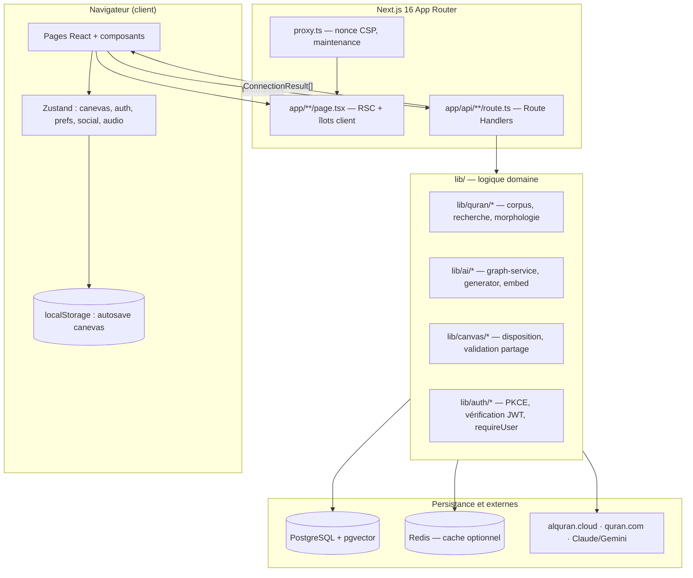
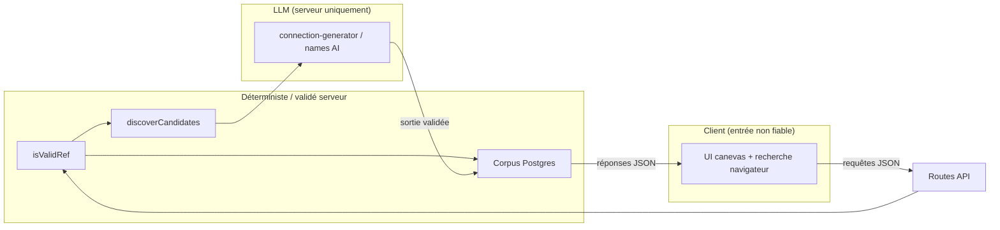

# Phase 4 — Modèle mental d'architecture

> **Prérequis :** [Phase 1](./phase-1-what-is-openhikmah.md) · [Phase 2](./phase-2-domain-primer.md) · [Phase 3](./phase-3-theological-boundaries.md)  
> **Balises de preuve :** **FACT** · **INFERENCE** · **UNKNOWN**

La Phase 4 reconstruit **comment le système est réellement structuré** — pas la lore Next.js générique. Où ce dépôt diffère des anciennes suppositions Next, ces différences sont signalées.

---

## Commencez ici : un parcours utilisateur à travers l'architecture

Imaginez que vous recherchez `2:255`, le déposez sur le canevas, étendez par **Thème**, et lisez trois versets connectés.



**À COMPRENDRE MAINTENANT :** Le navigateur **explore** ; le serveur **valide, génère (sur miss) et persiste** la vérité partagée. Votre disposition canevas est surtout la vôtre jusqu'à ce que vous partagiez ou sauvegardiez un workspace.

---

## Aperçu de la stack (vérifié)

**FACT :** Depuis `README.md` et `package.json` :

| Couche | Choix |
| --- | --- |
| Framework | Next.js **16.2** App Router, React **19**, TypeScript strict |
| i18n | next-intl (`i18n/request.ts`, `messages/*.json`) |
| UI canevas | `@xyflow/react` |
| État client | Zustand (+ `persist` pour signets auth, préférences) |
| Style | Tailwind CSS v4 |
| IA | Anthropic Claude (+ repli Gemini) ; embeddings Gemini |
| DB | PostgreSQL + pgvector + Drizzle ORM |
| Cache optionnel | Redis (`lib/infra/redis.ts`) |
| Auth | Quran Foundation OAuth2 PKCE |
| Tests | Vitest (unit/integration), Playwright (e2e) |
| Gestionnaire de paquets | Bun |

**FACT :** `next.config.ts` définit `typescript.ignoreBuildErrors: true` pour le **build prod OOM** — **la CI exécute toujours `bun run typecheck`** comme porte dure. Ne traitez pas le succès du build comme une sécurité de typage.

**FACT :** Ce dépôt utilise **`proxy.ts`**, pas `middleware.ts`, pour les nonces CSP par requête et le mode maintenance (commentaires d'en-tête `proxy.ts` référencent l'ordre de routage Next 16).

---

## Frontière client vs serveur

### Server Components (par défaut)

**FACT :** Le `app/layout.tsx` racine est un Server Component — charge la locale via `getUiLocale()`, les messages via `getMessages()`, les passe au client `Providers`.

**FACT :** Beaucoup de pages sont des wrappers serveur fins + îlots client, ex. `app/canvas/page.tsx` → `CanvasPageClient` (`"use client"`).

**INFERENCE :** Les Server Components sont utilisés où SEO, cookies et locale initiale comptent ; l'interactivité lourde passe aux enfants client.

### Îlots client uniquement

**FACT :** `HikmahCanvas` est chargé avec `dynamic(..., { ssr: false })` — le canevas React Flow ne fait pas de SSR (`CanvasPageClient.tsx`).

**FACT :** Tous les stores Zustand sont des modules client (`"use client"` dans les fichiers store ou consommés uniquement depuis composants client).

### Route Handlers API = backend

**FACT :** `app/api/**/route.ts` exporte `GET`/`POST`/etc. — c'est le **backend applicatif** pour la SPA. Pas de serveur Express séparé.

**INFERENCE :** Comparaison Firebase : Route Handlers ≈ endpoints HTTP Cloud Functions ; `lib/` ≈ logique de fonctions partagée ; Drizzle + Postgres ≈ couche Firestore/SQL (mais relationnelle + pgvector).

---

## Référence des couches (carte des responsabilités)

Pour chaque couche : **ce qu'elle possède**, **qui l'appelle**, **invariants critiques**.

### 1. Pages et routage (`app/`)

| | |
| --- | --- |
| **Responsabilité** | URL → shell UI ; métadonnées ; préfetch données serveur quand c'est peu coûteux |
| **Entrées** | URL de requête, cookies (`oh_locale`, `oh_edition`), searchParams |
| **Sorties** | HTML + arbre composants client |
| **État possédé** | Aucun de longue durée (par requête) |
| **Appelle** | `lib/quran/*`, `lib/i18n/request-prefs`, composants client |
| **Appelé par** | Navigation navigateur |

**Routes clés (produit central) :**

| Path | Rôle |
| --- | --- |
| `/` | Accueil + Verset du jour |
| `/canvas` | Espace de travail graphe infini |
| `/search` | Page de recherche complète |
| `/names`, `/names/[slug]` | 99 Noms divins |
| `/stories/[slug]` | Récits prophétiques (données statiques) |
| `/bookmarks`, `/workspaces`, `/social` | Fonctionnalités authentifiées |
| `/admin/*` | Console opérateur (liste blanche env) |
| `/callback` | Complétion OAuth PKCE |

**Invariant :** Les liens profonds comme `/canvas?verse=2:255` ou `?surah=18` s'hydratent côté client via fetch API (`CanvasPageClient` `VerseLoader`).

---

### 2. Composants UI (`components/`)

| | |
| --- | --- |
| **Responsabilité** | Présentation, interaction, accessibilité |
| **Entrées** | Props, sélecteurs Zustand, réponses fetch |
| **Sorties** | Événements → mises à jour store / appels API |
| **État possédé** | UI éphémère uniquement (dialogues ouverts, survol) |
| **Appelle** | `store/*`, `fetch('/api/...')` |
| **Appelé par** | Pages `app/*` |

**Clusters principaux :**

| Folder | Rôle |
| --- | --- |
| `components/canvas/` | `HikmahCanvas`, `VerseNode`, `ExpandMenu`, barre d'outils, export |
| `components/search/` | `SearchDialog`, résultats sourate |
| `components/layout/` | En-tête, barre latérale, shell auth |
| `components/admin/` | Backfill, couverture, invites (haut risque) |
| `components/audio/` | Mini lecteur pour récitation |

**Invariant (`DESIGN.md`) :** UI d'explication IA ≠ style scripturaire.

---

### 3. État client (`store/` + `hooks/`)

| Store | Persiste ? | Possède |
| --- | --- | --- |
| `store/canvas.ts` | Via hook → localStorage | nodes, edges, sélection, expand pending, viewport |
| `store/auth.ts` | Signets dans localStorage ; token **mémoire uniquement** | accessToken, état sync signets |
| `store/preferences.ts` | localStorage + cookies | locale, édition par locale, récitateur, prefs canevas |
| `store/social.ts` | Persist partiel | profil, série, compteurs en attente |
| `store/audio.ts` | Session | file de lecture, verset courant |

| Hook | Rôle |
| --- | --- |
| `hooks/useCanvasPersistence.ts` | Restaure URL partage → autosave localStorage ; `buildShareUrl` ; fusion invité→workspace |
| `hooks/useActivityTracker.ts` | Publie activité sociale sur actions canevas |

**Niveaux de persistance canevas (FACT depuis `useCanvasPersistence.ts`) :**

1. **En mémoire** — Zustand (session live)
2. **localStorage** — autosave debounced `open-hikmah-canvas`
3. **URL de partage** — `POST /api/share` → UUID → `/canvas?share=<uuid>` → `GET /api/share/[id]`
4. **Workspace** — `POST /api/workspace` authentifié (Postgres `saved_workspaces`)

**Invariant :** La restauration partage s'exécute **avant** la restauration localStorage ; l'autosave attend la fin de l'hydratation (évite d'effacer le canevas partagé).

---

### 4. Routes API (`app/api/`)

Regroupées par domaine :

| Prefix | Responsabilité | Auth |
| --- | --- | --- |
| `/api/search` | Mot-clé + sémantique connexe | Public (limité en débit) |
| `/api/verse/...`, `/api/verses/...` | Consultation verset, similaire, tafsir | Principalement public |
| `/api/connections` | **Expansion graphe** — cache + miss IA | Public (limité en débit sur chemin IA) |
| `/api/share` | Persister snapshot canevas | Public (limité en débit) |
| `/api/workspace` | Canevas sauvegardés nommés | Bearer token |
| `/api/bookmarks`, `/api/notes` | Données verset utilisateur | Bearer token |
| `/api/auth/*` | Échange PKCE, refresh, signout | Cookie + token |
| `/api/social/*` | Amis, défis, séries, mentions | Bearer token |
| `/api/names/...` | Contenu IA noms (versets, réflexion, associations) | Public (limité en débit) |
| `/api/admin/*` | Invites, backfill, flags, audit | Liste blanche admin |
| `/api/health`, `/api/metrics` | Ops | Public / interne |

**Frontière de confiance (FACT) :** Les routes appellent `isValidRef`, `requireUser`, `requireAdmin` **avant** la logique domaine — voir Phase 3.

---

### 5. Bibliothèques domaine (`lib/`)

#### `lib/quran/` — texte canonique et récupération

| Module | Rôle |
| --- | --- |
| `quran-corpus.ts` | Lectures `verses` locales, `isValidRef` |
| `verse-resolver.ts` | Corpus + repli alquran.cloud |
| `semantic-search.ts` | Requêtes pgvector, cache embed requête |
| `arabic-morphology.ts` | Aides surbrillance tokens |
| `chapters.ts`, `surah-names.ts` | Métadonnées sourate |
| `audio.ts` | URLs récitation / ordre |

**Appelle :** Drizzle → Postgres ; embed Gemini (requêtes) ; Redis optionnel.  
**Appelé par :** Routes API, `lib/ai/graph-service`, scripts.

#### `lib/ai/` — orchestration probabiliste + graphe

| Module | Rôle |
| --- | --- |
| `graph-service.ts` | **Graphe persistant** — lecture cache, génération miss, traduction locale |
| `connection-discovery.ts` | Candidats déterministes (racines / vecteurs) |
| `connection-generator.ts` | **Seul appelant LLM pour connexions** |
| `ai.ts` | Résolution fournisseur, `callAI`, `embed` |
| `translate.ts` | Traduction raisons localisées + validation |
| `connection-batch*.ts` | Backfill admin |
| `prompt-registry.ts` | Versions invite DB avec fallback codé en dur |
| `theological-constraints.ts` | `TANZIH_CONSTRAINT` partagé |

**Invariant :** **Sélection** de versets canonique anglaise ; les locales traduisent les **raisons** uniquement.

#### `lib/canvas/` — disposition et validation partage

| Module | Rôle |
| --- | --- |
| `canvas-layout.ts` | Placement nœuds sans collision |
| `share-canvas.ts` | `isValidNode` pour POST partage |
| `canvas-export.ts` | Export PDF/image |

#### `lib/auth/` — identité

| Module | Rôle |
| --- | --- |
| `pkce.ts` | Construire URL authorize QF (helpers compatibles client) |
| `social-auth.ts` | Vérification JWT (JWKS), `requireUser`, cache token |
| `session-cookie.ts` | Constantes cookie refresh HttpOnly |

**FACT :** Token d'accès en **mémoire** ; refresh via cookie HttpOnly (commentaire `store/auth.ts`).

#### `lib/infra/` — transversal

| Module | Rôle |
| --- | --- |
| `db.ts` + `db/schema.ts` | Client Drizzle + toutes les tables |
| `rate-limit.ts` | Fenêtres de débit Postgres et/ou Redis |
| `redis.ts` | Cache optionnel (requêtes embed, auth L2, limites de débit) |
| `http.ts` | `clientKey` depuis IP transmise |
| `metrics.ts` | Compteurs ops |
| `search-log.ts` | Analytics recherche anonymes |

#### `lib/names/`, `lib/stories/`, `lib/social/`

- **Names :** Données statiques noms divins + cache contenu IA (`name-content.ts`)
- **Stories :** Récits TS statiques (`lib/stories/data/*.ts`) — pas d'IA runtime
- **Social :** Logique séries, amis, défis, publication activité

#### `lib/admin/`

Feature flags, job runner, rapports couverture, auth admin — protégé par **CODEOWNERS**.

---

### 6. PostgreSQL (via Drizzle)

**FACT :** `DATABASE_URL` unique ; schéma Drizzle dans `lib/infra/db/schema.ts`.

**Tables produit principales :**

| Table | Purpose |
| --- | --- |
| `verses`, `verse_translations` | Texte coranique canonique |
| `word_morphology` | Découverte racines |
| `verse_embeddings` | Recherche sémantique + candidats thématiques |
| `connections` | **Arêtes graphe de connaissances partagées** |
| `connection_coverage` | Comptabilité backfill admin |
| `shared_canvases` | Snapshots liens de partage |
| `saved_workspaces` | Canevas nommés utilisateur |
| `users`, `bookmarks`, `verse_notes`, … | Auth + social |
| `ai_generations`, `prompt_versions` | Audit + admin invites |
| `name_content`, `name_verse_reasons` | Cache IA Noms divins |

**Invariant :** Les arêtes du graphe sont **globales** — une génération sert tous les utilisateurs (coût → 0 avec le temps).

---

### 7. Services externes

| Service | Utilisé pour |
| --- | --- |
| **alquran.cloud** | Seed corpus ; repli verset live |
| **quran.com API** | Index recherche mot-clé ; localisation noms sourate ; recherche versets noms |
| **Anthropic / Gemini** | Raisons connexions, contenu noms, traductions |
| **Gemini embeddings** | Recherche sémantique (toujours Gemini) |
| **Quran Foundation OAuth** | Connexion, claims JWT |
| **Google Analytics** | Usage (script avec nonce via CSP) |

---

## Flux de requêtes (niveau architecture)

### Flux A — Étendre un verset sur le canevas

```
VerseNode ExpandMenu
  → HikmahCanvas.runExpansion()
  → POST /api/connections { fromRef, kind, arabicText, translation, excludeRefs }
  → getConnections() [graph-service]
       → SELECT connections (cache hit?) → return
       → discoverCandidates() → generateGroundedConnections() → INSERT connections
  → ConnectionResult[] JSON
  → canvas store addVerseNode + addConnectionEdge
  → useCanvasPersistence debounced localStorage save
```

**Flèche de confiance :** Le LLM est **en aval de** la découverte + validation (Phase 2).

### Flux B — Recherche

```
SearchDialog → GET /api/search?q=...
  → ref path | surah name | keyword (quran.com) + optional semantic related
  → hydrate via getVerses (local corpus)
  → SearchResponse JSON
```

Les budgets mot-clé et sémantique sont des **clés de limite de débit séparées** (`searchkw:` vs `search:`).

### Flux C — Partager le canevas

```
CanvasToolbar → serializeCanvas() → POST /api/share
  → shared_canvases row (UUID)
  → URL /canvas?share=<uuid>
Recipient opens URL → GET /api/share/[id] → restoreCanvas()
```

Disposition uniquement — **pas** le cache global `connections`.

### Flux D — Connexion + sync signets

```
PKCE → /callback → /api/auth/exchange
  → access token (memory) + refresh cookie
  → SessionRestorer → /api/auth/refresh on load
  → loadRemoteBookmarks → merge local pending refs
  → mergeGuestWorkspace (local canvas → cloud workspace once)
```

---

## Architecture de localisation

**FACT :** Deux canaux de préférences parallèles :

| Channel | Storage | Consumed by |
| --- | --- | --- |
| Locale UI | Cookie `oh_locale` (+ miroir localStorage) | Messages next-intl |
| Édition Coran | Cookie `oh_edition` | Hydratation verset/recherche API serveur |

**FACT :** `getUiLocale()` / `getQuranEdition()` valident contre listes blanches (`lib/i18n/request-prefs.ts`) — cookies invalides retombent en sécurité.

**FACT :** Les **raisons** de connexion servies en locale UI quand en cache ; la **sélection** de versets reste canonique anglaise (Phase 2/3).

---

## Audio (périphérique mais réel)

**FACT :** `store/audio.ts` + `components/audio/MiniPlayer.tsx` — lit les versets du canevas dans l'ordre du Coran (fonctionnalité `README`).

**UTILE PLUS TARD :** Préférence récitateur dans `store/preferences.ts` (`DEFAULT_RECITER` depuis `lib/quran/audio.ts`).

---

## Social / défis (périphérique)

**FACT :** Tables : `friendships`, `challenges`, `activity_log`, `note_mentions`, etc.

**FACT :** `hooks/useActivityTracker.ts` publie l'activité quand l'utilisateur ajoute versets/connexions — alimente séries et défis.

**IGNORER POUR L'INSTANT :** Cycle de vie des défis, scoring classement — sauf contribution dans ce domaine.

---

## Admin et opérations

**FACT :** Admin = liste blanche env `ADMIN_QF_IDS` — fail-closed (`lib/admin/admin-auth.ts`).

**FACT :** Le mode maintenance de `proxy.ts` lit le feature flag `maintenance_mode` — exclut admin/auth/health du 503.

**FACT :** Scripts (`scripts/*.mjs`, `scripts/*.ts`) : seed Coran, morphologie, embeddings, migrate, backfill, prewarm.

**FACT :** Le hook pre-push exécute les tests d'intégration (Testcontainers) — nécessite Docker.

---

## Architecture des tests (où vit la preuve)

| Layer | Location | What runs |
| --- | --- | --- |
| Unit | `__tests__/lib/`, `__tests__/api/`, `__tests__/store/` | Vitest, fetch/AI mockés |
| Integration | `__tests__/integration/` | Postgres réel via Testcontainers |
| E2E | `e2e/` | Playwright + axe |
| CI | `.github/workflows/ci.yml` | lint, typecheck, unit, integration, build, e2e |

**INFERENCE :** Les tests unitaires prouvent les contrats de modules ; les tests d'intégration prouvent DB + persistance graphe ; l'e2e prouve les flux utilisateur.

---

## Mermaid — frontières de confiance



Le client peut **suggérer** refs et texte dans les corps POST ; le serveur **re-valide** avant IA et persistance.

---

## Cinq faits architecturaux à mémoriser

1. **Trois niveaux de persistance pour l'exploration :** canevas en mémoire → localStorage → (optionnel) URL partage / workspace — **séparés de** le graphe global `connections` dans Postgres.

2. **`lib/ai/graph-service.ts` est le cerveau du graphe :** cache-first, IA sur miss, arêtes partagées écrites une fois — l'expansion canevas passe toujours par `/api/connections`.

3. **Tous les appels LLM pour connexions de versets vivent dans `lib/ai/connection-generator.ts`**, invoqués uniquement depuis pipelines graphe/noms côté serveur — pas depuis composants React directement.

4. **Les tokens client restent en mémoire ; le refresh utilise des cookies HttpOnly** — les signets persistent localement pour les invités ; les utilisateurs connectés synchronisent via `/api/bookmarks`.

5. **`proxy.ts` (pas `middleware.ts`) + Route Handlers + Drizzle** définissent la forme Next 16 de ce dépôt — ne supposez pas Pages Router ou accès DB côté client.

---

## Différences Next.js à noter

| Ancienne supposition | Réalité OpenHikmah |
| --- | --- |
| `middleware.ts` | **`proxy.ts`** avec `config.matcher` |
| Build = type-safe | **`ignoreBuildErrors: true`** en build prod ; typecheck CI séparé |
| SSR canevas | **`ssr: false`** pour React Flow |
| API dans `pages/api` | **`app/api/**/route.ts`** |
| Env lu n'importe où | Secrets serveur uniquement dans Route Handlers / `lib/` — `NEXT_PUBLIC_*` figé au démarrage dev |

**UNKNOWN pour vous jusqu'à la Phase 10 :** Bootstrap dev local exact (Docker compose, ordre migrate, seed) — documenté dans CONTRIBUTING / Phase 10.

---

## Phase 4 — Ce qu'il faut retenir

### À COMPRENDRE MAINTENANT

- **`app/`** = routes ; **`components/`** = UI ; **`lib/`** = domaine ; **`store/`** = état session client ; **`app/api/`** = backend.
- **État canevas ≠ graphe de connexions** — disposition locale/partageable ; arêtes canoniques dans Postgres.
- **Chemin expansion :** client → `/api/connections` → `graph-service` → (peut-être) IA → DB → JSON → Zustand.
- **Auth :** PKCE + JWT ; admin via liste blanche env ; chemins à haut risque protégés CODEOWNERS.
- **Postgres détient la vérité sacrée + graphe ; Redis est une accélération optionnelle.**

### UTILE PLUS TARD

- Architecture job backfill admin (`connection-batch-loop.ts`)
- Basculement application CSP depuis report-only
- Idempotence `mergeGuestWorkspace`
- File activité sociale (`post-activity.ts`)

### IGNORER POUR L'INSTANT

- Routes génération image OG
- Réglage endpoint rapport CSP
- Détails job CI size-limit

---

## Incertitudes

| Sujet | Statut |
| --- | --- |
| Single-flight multi-instance pour misses graphe | **FACT :** en processus uniquement ; verrou Redis reporté (commentaire `graph-service.ts`) |
| Toutes les pages utilisent RSC vs client | **INFERENCE :** schéma hybride ; canevas/recherche fortement client |
| Hébergement production (Coolify mentionné dans next.config) | **FACT :** sortie standalone ; topologie déploiement complète **UNKNOWN** sans docs ops |

---

## Et ensuite

**Phase 5 — Visite du dépôt :** carte de répertoires ciblée — ce qui va où, quand vous le toucheriez, niveau de risque pour nouveaux contributeurs (pas un dump d'arborescence complet).

Dites **« continuer vers la Phase 5 »** quand vous êtes prêt.

---

## Fichiers clés (liste de lecture Phase 4)

| File | Why |
| --- | --- |
| `app/canvas/CanvasPageClient.tsx` | Séparation client/serveur, liens profonds |
| `components/canvas/HikmahCanvas.tsx` | Expansion → API → store |
| `hooks/useCanvasPersistence.ts` | localStorage + restauration partage |
| `app/api/connections/route.ts` | Frontière API graphe |
| `lib/ai/graph-service.ts` | Orchestration cache + génération |
| `lib/infra/db/schema.ts` | Propriété des tables |
| `store/canvas.ts` | Modèle état canevas |
| `store/auth.ts` | Modèle token + signets |
| `proxy.ts` | Bord requête (CSP, maintenance) |
| `components/providers.tsx` | Restauration session, sync locale |
| `lib/auth/social-auth.ts` | Frontière `requireUser` |
| `lib/ai/ai.ts` | Résolution fournisseur/fonctionnalité |
