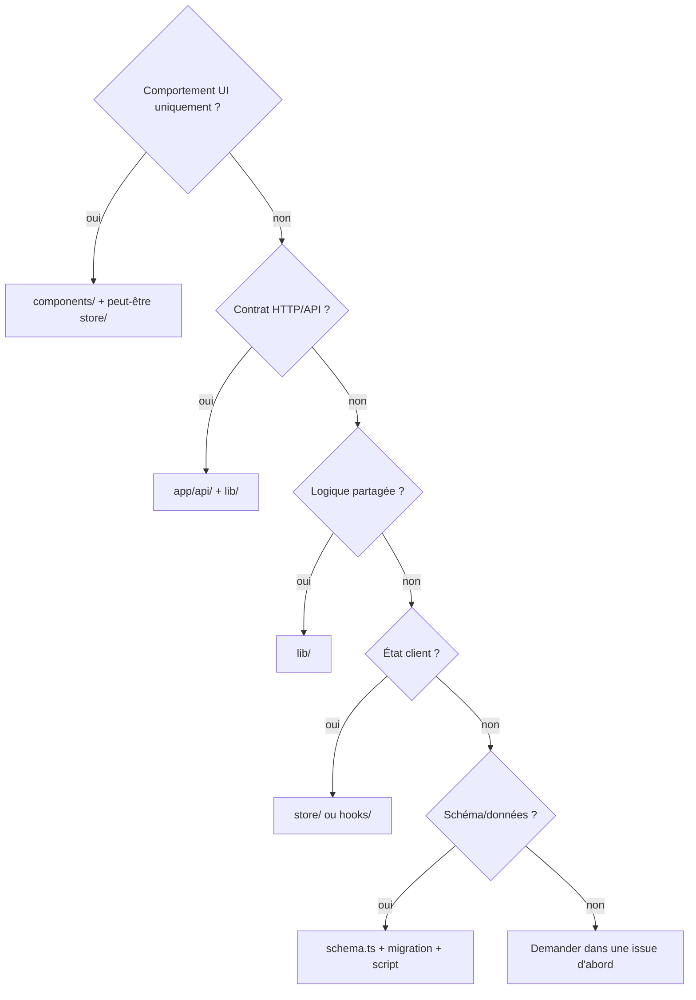

# Phase 5 — Visite du dépôt

> **Prérequis :** [Phase 1](./phase-1-what-is-openhikmah.md) · [Phase 2](./phase-2-domain-primer.md) · [Phase 3](./phase-3-theological-boundaries.md) · [Phase 4](./phase-4-architecture.md)  
> **Tags d'évidence :** **FACT** (fait vérifiable dans le code) · **INFERENCE** (déduction raisonnée) · **UNKNOWN** (non documenté ou incertain)

Ceci est une **carte guidée**, pas un inventaire de répertoires. Chaque zone répond à : qu'est-ce qui vit ici, pourquoi c'est ici, qui le consomme, ce qu'il consomme, quand vous le toucheriez, et quel est le risque pour un nouveau contributeur.

---

## Structure du dépôt (niveau supérieur)

```text
openhikmah-web/
├── app/              # Next.js App Router — pages + API Route Handlers
├── components/       # UI React (regroupée par fonctionnalité)
├── lib/              # Logique domaine + infra (pas de React)
├── store/            # Stores client Zustand
├── hooks/            # Hooks React client
├── types/            # Types TypeScript partagés (domaine)
├── messages/         # JSON de locale next-intl (en, tr, ru, az)
├── i18n/             # Config serveur next-intl
├── __tests__/        # Vitest — reflète lib/, api/, store/, components/
├── e2e/              # Tests end-to-end Playwright
├── scripts/          # Seed offline, migrate, backfill, helpers CI
├── data/             # Données de seed commitées (morphologie JSONL)
├── lib/infra/db/migrations/  # Migrations SQL (Drizzle)
├── public/           # Assets statiques (logo, etc.)
├── docs/onboarding/  # Cette série d'onboarding
├── AGENTS.md         # Règles canoniques agent + contributeur
├── proxy.ts          # Bordure requête (nonce CSP, maintenance) — Next 16
└── next.config.ts    # Build, headers, plugin next-intl
```

**IGNORER POUR L'INSTANT :** `.agents/skills/`, `.cursor/rules/` — copies outillage agent de `AGENTS.md`, pas du code produit runtime.

---

## Conventions de nommage (prouvées par le dépôt)

Dérivées des patterns dominants dans l'arborescence — **suivez-les en ajoutant des fichiers**, pas vos habitudes d'autres dépôts.

| Catégorie | Convention | Exemples | Confiance |
| --- | --- | --- | --- |
| **Modules lib** | `kebab-case.ts` | `graph-service.ts`, `quran-corpus.ts`, `social-auth.ts` | **HIGH** |
| **Composants React** | `PascalCase.tsx` | `HikmahCanvas.tsx`, `SearchDialog.tsx` | **HIGH** |
| **Dossiers composants** | `kebab-case/` ou nom de fonctionnalité | `components/canvas/`, `components/layout/` | **HIGH** |
| **Pages App Router** | `page.tsx`, `layout.tsx`, `loading.tsx`, `error.tsx` | Imposé par le framework | **FRAMEWORK** |
| **Handlers API** | `route.ts` dans un chemin = URL | `app/api/connections/route.ts` | **FRAMEWORK** |
| **Stores Zustand** | `kebab-case.ts`, export `useXxxStore` | `store/canvas.ts` → `useCanvasStore` | **HIGH** |
| **Hooks** | `useCamelCase.ts` | `useCanvasPersistence.ts` | **HIGH** |
| **Fichier types** | Domaine à la racine de `types/` | `types/quran.ts` | **HIGH** |
| **Tests** | Reflète le chemin source + `.test.ts(x)` | `__tests__/lib/ai/graph-service.test.ts` | **HIGH** |
| **E2E** | `kebab-case.spec.ts` | `e2e/canvas.spec.ts` | **HIGH** |
| **Scripts** | `kebab-case.mjs` ou `.ts` | `seed-quran.mjs`, `backfill-connections.ts` | **HIGH** |
| **Imports** | Alias `@/` → racine du dépôt | `import { db } from "@/lib/infra/db"` | **HIGH** |
| **Colonnes DB (Drizzle)** | `camelCase` en TS → `snake_case` en SQL | `fromRef` → `from_ref` | **HIGH** |
| **Littéraux edge kind** | union de chaînes en minuscules | `"thematic" \| "root" \| "contrast"` | **EXTERNAL-CONTRACT** |
| **Refs de versets** | chaîne `"surah:ayah"`, canonique | `"2:255"` pas `"02:255"` | **EXTERNAL-CONTRACT** |
| **Cookies de locale** | `oh_locale`, `oh_edition` | Ne pas renommer sans migration | **EXTERNAL-CONTRACT** |

**Terminologie produit (à utiliser de façon cohérente) :**

| Terme dans le code/docs | Signification |
| --- | --- |
| **Connection** | Arête de graphe persistée (table `connections`) ou API `ConnectionResult` |
| **Canvas edge** | Arête React Flow dans Zustand (inclut les ids de nœuds de layout) |
| **Verse / ref** | Identité canonique `"surah:ayah"` |
| **Kind / EdgeKind** | `thematic`, `root`, `contrast` |
| **Edition** | Id de traduction, ex. `en.sahih` |
| **Locale** | Langue UI : `en`, `tr`, `ru`, `az` |
| **Cell** | Unité `(fromRef, kind, locale)` dans graph-service / backfill |

**Commentaire obsolète connu (ne pas copier aveuglément) :** Certains anciens commentaires disent `lib/quran-corpus.ts` — le vrai chemin est **`lib/quran/quran-corpus.ts`**.

---

## `app/` — routes (UI + backend HTTP)

**Pourquoi ici :** Convention Next.js App Router — structure URL = structure de dossiers.

### Pages utilisateur (`app/<segment>/`)

| Zone | Chemin | Responsabilité | Toucher quand… | Risque |
| --- | --- | --- | --- | --- |
| **Canvas** | `app/canvas/` | Shell de l'espace graphe ; `CanvasPageClient` | Entrée canvas, deep links `?verse=` | Moyen |
| **Search** | `app/search/` | Recherche pleine page | UX recherche | Faible–moyen |
| **Home** | `app/page.tsx` | Landing, Verset du jour | Page d'accueil marketing | Faible |
| **Names** | `app/names/` | Pages détail des 99 Noms | UI Noms, pas les données statiques | Moyen |
| **Stories** | `app/stories/` | Lecteur d'histoires prophétiques | Navigation histoires | Faible–moyen |
| **Lecteur sourate** | `app/surah/[number]/` | Vue sourate complète | UX lecture | Faible |
| **Bookmarks** | `app/bookmarks/` | Versets sauvegardés | UI bookmarks | Faible |
| **Workspaces** | `app/workspaces/` | Canvas sauvegardés (auth) | UX liste workspaces | Moyen |
| **Social** | `app/social/` | Amis, défis | Fonctionnalités sociales | Moyen |
| **Settings** | `app/settings/` | Locale, édition, récitateur | UI préférences | Faible |
| **Callback auth** | `app/callback/` | Complétion OAuth PKCE | **Rarement** — CODEOWNERS | **Élevé** |
| **Admin** | `app/admin/` | Console opérateur UI | Fonctionnalités admin | **Élevé** |

**Pattern (FACT) :** Beaucoup de pages = `page.tsx` mince + `*Client.tsx` avec `"use client"` pour l'interactivité.

**Consomme :** `components/*`, `store/*`, `fetch('/api/...')`.  
**Consommé par :** Navigation navigateur uniquement.

### API Route Handlers (`app/api/`)

**Pourquoi ici :** Backend serveur uniquement pour le SPA — secrets, DB, IA, validation.

| Préfixe | Rôle | Consommateurs clés |
| --- | --- | --- |
| `app/api/search/` | Mot-clé + sémantique related | `SearchDialog`, page recherche |
| `app/api/connections/` | Expansion graphe (cache + IA) | `HikmahCanvas` |
| `app/api/verse/`, `app/api/verses/` | Fetch verset, similar, tafsir, morphologie | Canvas, sidebar, lecteur |
| `app/api/share/` | Persistance/chargement canvas partagé | `useCanvasPersistence`, image OG |
| `app/api/workspace/` | CRUD canvas nommés | `CanvasToolbar`, flux auth |
| `app/api/bookmarks/`, `app/api/notes/` | Données versets utilisateur | Store auth, page bookmarks |
| `app/api/auth/` | Exchange, refresh, signout | `CallbackClient`, `Providers` |
| `app/api/social/` | Amis, défis, streaks, mentions | Pages sociales, activity tracker |
| `app/api/names/` | APIs contenu IA des noms | Composants page Noms |
| `app/api/admin/` | Prompts, jobs, flags, audit | UI admin — **CODEOWNERS** |
| `app/api/health/`, `metrics/`, `csp-report/` | Ops | Monitoring |

**Invariant :** Valider à la frontière de route (`isValidRef`, `requireUser`, `requireAdmin`) avant d'appeler `lib/`.

**Résumé des risques :** Tout sous `app/api/admin/`, `app/api/auth/`, `app/callback/` → **élevé**. APIs produit cœur (`search`, `connections`, `verse`) → **moyen** (théologie + validation). `health` → faible.

---

## `components/` — couche présentation

**Pourquoi ici :** UI réutilisable, regroupée par **fonctionnalité produit**, pas seulement par niveau atomic design.

| Dossier | Contenu | Consommé par | Toucher quand… | Risque |
| --- | --- | --- | --- | --- |
| `components/canvas/` | Nœuds, arêtes, expand, toolbar, export | `app/canvas/` | UX canvas, UI expansion | Moyen |
| `components/search/` | Dialog recherche, items liste sourates | Header, canvas, home | Interaction recherche | Faible–moyen |
| `components/layout/` | Header, sidebar, shell auth, nav | La plupart des pages | Chrome global, a11y | Faible–moyen |
| `components/home/` | Hero landing, previews | `app/page.tsx` | Marketing home | Faible |
| `components/ui/` | Boutons, inputs, tooltip (design system) | Partout | Primitives UI partagées | Faible |
| `components/admin/` | UI backfill, coverage, prompts | `app/admin/` | **Admin uniquement** | **Élevé** |
| `components/social/` | UI amis, défis | Pages sociales | UX sociale | Moyen |
| `components/audio/` | Mini player | `Providers` (global) | Lecture audio | Faible |
| `components/morphology/` | Surlignage arabe interactif | Affichages versets | UI racines | Faible |
| `components/today/` | Cartes Verset du jour | Home, route today | Présentation VOTD | Faible |
| `components/providers.tsx` | Restauration session, i18n, sync locale | Layout racine | Bootstrap auth | Moyen |

**Convention :** Les composants **fetch** ou reçoivent des données — ils n'importent pas `lib/ai/graph-service` directement (chemins serveur uniquement restent dans API/`lib`).

**Règle UI sacrée :** `ReflectionNote`, style des raisons d'arête — texte IA visuellement distinct (`DESIGN.md`).

---

## `lib/` — domaine et infrastructure

**Pourquoi ici :** Logique partagée utilisable depuis routes API, scripts et tests — **pas de React**, pas de `"use client"`.

```text
lib/
├── quran/       # Corpus, recherche, helpers morphologie, audio, métadonnées sourates
├── ai/          # Graph service, générateur de connexions, embeddings, prompts
├── canvas/      # Math layout, validation share, export
├── auth/        # PKCE, vérification JWT, requireUser
├── i18n/        # Lecteurs cookies, config locale (sans framework)
├── names/       # Données noms divins + helpers cache contenu IA
├── stories/     # Contenu statique histoires prophétiques
├── social/      # Streak, amis, défis, file activity
├── admin/       # Auth admin, flags, jobs, coverage, audit
└── infra/       # db, redis, rate-limit, http, metrics, sleep
```

### Guide des modules

| Module | Responsabilité | Appelé par | Risque |
| --- | --- | --- | --- |
| **`lib/quran/quran-corpus.ts`** | `isValidRef`, lectures versets locales | Presque tous les chemins Quran | **Élevé** (validation) |
| **`lib/quran/semantic-search.ts`** | Requêtes pgvector, cache embed requête | API recherche, discovery | Moyen–élevé |
| **`lib/quran/verse-resolver.ts`** | Corpus + fallback live | APIs, hydrate graphe | Moyen |
| **`lib/ai/graph-service.ts`** | Cache graphe persistant + chemin miss | `/api/connections`, backfill | **Élevé** |
| **`lib/ai/connection-generator.ts`** | **Seul appelant LLM pour les connexions** | graph-service | **Élevé** (prompts + théologie) |
| **`lib/ai/connection-discovery.ts`** | Candidats root/sémantiques | graph-service | Moyen |
| **`lib/ai/theological-constraints.ts`** | `TANZIH_CONSTRAINT` | Tous les prompts sensibles | **Élevé** |
| **`lib/ai/ai.ts`** | Résolution provider, `callAI`, `embed` | Generator, names, translate | Moyen |
| **`lib/ai/prompt-registry.ts`** | Versions prompts DB | connection-generator | **Élevé** |
| **`lib/auth/social-auth.ts`** | `requireUser`, JWT/JWKS | APIs protégées | **Élevé** (CODEOWNERS) |
| **`lib/auth/pkce.ts`** | Constructeur URL OAuth | Flux connexion | **Élevé** (CODEOWNERS) |
| **`lib/infra/db/schema.ts`** | Schéma Drizzle — source unique des tables | Partout | **Élevé** |
| **`lib/infra/rate-limit.ts`** | Budgets IA/recherche | Routes API | Moyen |
| **`lib/names/divine-names/`** | Données statiques 99 Noms | Pages/APIs Noms | **Élevé** (contenu) |
| **`lib/stories/data/`** | Récits statiques + verseRefs | Pages Stories | Moyen (contenu) |

**Quand ajouter du nouveau code :** Préférer étendre un module existant plutôt que de nouveaux dossiers top-level. Les helpers ponctuels restent inline sauf s'ils sont réutilisés deux fois.

---

## `store/` + `hooks/` — état client

| Fichier | Possède | Persiste | Risque |
| --- | --- | --- | --- |
| `store/canvas.ts` | nodes, edges, sélection, état expand | via hook → localStorage | Moyen |
| `store/auth.ts` | token (mémoire), sync bookmarks | bookmarks dans localStorage | Moyen |
| `store/preferences.ts` | locale, édition, récitateur, prefs canvas | localStorage + cookies | Faible |
| `store/social.ts` | profil, streak, compteurs pending | persist partiel | Faible |
| `store/audio.ts` | file de lecture | session | Faible |
| `hooks/useCanvasPersistence.ts` | restaure share/localStorage, URL share, merge invité | localStorage | Moyen |
| `hooks/useActivityTracker.ts` | posts activité sociale | file en mémoire | Faible |
| `hooks/useSignIn.ts` | Flux redirect PKCE | — | Moyen |

**Invariant :** Les stores n'appellent pas l'IA ni la DB directement — seulement `fetch('/api/...')`.

---

## `types/` — TypeScript partagé

**FACT :** Actuellement `types/quran.ts` contient les types domaine cœur : `Verse`, `VerseRef`, `EdgeKind`, `ConnectionResult`, `SearchResponse`, `CanvasEdge`, etc.

**Pourquoi séparé :** Importé depuis client et serveur sans tirer React ou Drizzle.

**Quand modifier :** Ajout de champs aux payloads API ou sérialisation canvas — mettre à jour types **et** tests ensemble.

---

## `messages/` + `i18n/`

| Chemin | Rôle |
| --- | --- |
| `messages/en.json`, `tr.json`, `ru.json`, `az.json` | Chaînes UI (next-intl) |
| `i18n/request.ts` | Config serveur next-intl |
| `lib/i18n/config.ts` | Listes blanches locale/édition (importable partout) |
| `lib/i18n/request-prefs.ts` | Lecteurs cookies serveur |

**Toucher quand :** Copie visible utilisateur, labels nav, chaînes d'erreur — **pas** les raisons de connexion générées par IA (elles viennent de l'API/DB).

**Risque :** Faible pour les chaînes UI ; moyen si vous mettez accidentellement du contenu théologique dans messages au lieu des chemins IA validés.

---

## `__tests__/` — tests unitaires + API

**FACT :** `CONTRIBUTING.md` — la structure reflète la source :

```text
__tests__/
├── lib/          # Logique pure (graph, corpus, parsing IA, …)
├── api/          # Route handlers (fetch/IA mockés)
├── store/        # Comportement Zustand
├── components/   # React Testing Library
├── hooks/        # Comportement hooks
├── app/          # Tests niveau page
└── integration/  # Postgres réel (Testcontainers)
```

**Convention :** Nom de fichier = sujet + `.test.ts` ou `.test.tsx`.

**Quand ajouter :** Toute nouvelle logique dans `lib/` ou changement de comportement API/store — même PR que le changement (`AGENTS.md`).

---

## `e2e/` — Playwright

| Spec | Couvre |
| --- | --- |
| `canvas.spec.ts` | Flux canvas |
| `search.spec.ts` | Recherche |
| `a11y.spec.ts` | Accessibilité (axe) |
| `social.spec.ts`, `settings.spec.ts`, `stories.spec.ts`, `admin.spec.ts` | Smoke fonctionnalités |
| `fixtures/auth.ts` | Helpers auth |

**Risque :** Faible à exécuter ; moyen à écrire (nécessite serveur dev + DB). La CI s'exécute automatiquement.

---

## `scripts/` — opérations offline

| Script | Objectif | Quand l'exécuter |
| --- | --- | --- |
| `seed-quran.mjs` | Peupler `verses` depuis alquran.cloud | DB locale fraîche |
| `seed-morphology.mjs` | Charger `data/morphology/*.jsonl` | Après clone / mise à jour morphologie |
| `seed-translations.mjs` | Éditions de traduction supplémentaires | Tests locale |
| `embed-corpus.mjs` | Embeddings Gemini → `verse_embeddings` | Recherche sémantique / thème ancré |
| `migrate.mjs` | Appliquer migrations SQL | Changements schéma |
| `backfill-connections.ts` | Remplissage graphe admin | Ops / travail coverage |
| `prewarm-graph.mjs` | Préchauffer cellules versets populaires | Ops |

**FACT :** Les scripts nécessitent `DATABASE_URL` ; le script d'embedding nécessite `GEMINI_API_KEY`.

**Risque :** **Élevé** pour seed/migrate — affecte tous les environnements. Lire les commentaires d'en-tête du script avant d'exécuter.

---

## `data/` + migrations

| Chemin | Rôle | Risque |
| --- | --- | --- |
| `data/morphology/*.jsonl` | Entrée seed morphologie commitée | **Élevé** (données d'ancrage) |
| `lib/infra/db/schema.ts` | Modèle Drizzle ORM | **Élevé** |
| `lib/infra/db/migrations/*.sql` | Changements schéma versionnés | **Élevé** — doit être réversible, testé en intégration |

**FACT :** Migrations `0006_connection_graph.sql`, `0008_semantic_and_morphology.sql` — les noms suggèrent les piliers produit majeurs.

---

## `public/` + config racine

| Fichier | Rôle |
| --- | --- |
| `public/logo-mark.png` | Assets de marque |
| `app/globals.css` | Tokens design (`@theme`) — **pas de hex codé en dur dans les composants** |
| `proxy.ts` | Nonce CSP, flag maintenance |
| `next.config.ts` | Headers sécurité, next-intl, build standalone |
| `.env.example` | Variables d'env documentées — mettre à jour si vous ajoutez des secrets |
| `AGENTS.md`, `CONTRIBUTING.md` | **Lire avant chaque PR** |

---

## `.github/` — CI et modèles

| Chemin | Rôle |
| --- | --- |
| `.github/workflows/ci.yml` | lint, typecheck, unit, integration, build, e2e |
| `.github/PULL_REQUEST_TEMPLATE.md` | Cases disclosure IA/théologie |
| `.github/CODEOWNERS` | Revue requise : `app/api/admin/`, `lib/auth/`, `app/callback/`, `next.config.ts` |
| `.github/ISSUE_TEMPLATE/` | Bug + feature (champ rationale théologique) |

**FACT :** Le hook pre-push (`.husky/pre-push`) exécute les tests d'intégration — nécessite Docker.

---

## « Où mettre mon changement ? » — arbre de décision



Ajoutez **`__tests__/`** à côté de tout changement non trivial dans `lib/` ou API.

---

## Carte des risques contributeur (nouveau venu)

### Surfaces plus sûres en premier (toujours significatives)

| Zone | Exemple de travail | Pourquoi plus sûr |
| --- | --- | --- |
| `components/search/`, `components/layout/` | Focus, a11y, états de chargement | UI bornée ; pas de théologie |
| `components/canvas/` (UX uniquement) | Toolbar, état vide, tour | Touche l'UX cœur ; éviter la logique graphe |
| `store/canvas.ts` + tests | Correctness layout/dedup | Testable ; pas de prompts |
| `app/search/` + composants recherche | Pagination, états vides | Surtout présentation |
| `__tests__/` | Tests de régression pour bugs corrigés | Haute valeur, périmètre clair |
| `messages/*.json` | Copie UI (non théologique) | Faible risque code |

### Profondeur deuxième / troisième contribution

| Zone | Nécessite |
| --- | --- |
| `lib/quran/semantic-search.ts` | Modèle mental pgvector, embeddings |
| `hooks/useCanvasPersistence.ts` | Sémantique courses share/localStorage |
| `app/api/search/route.ts` | Rate limits, chemins recherche doubles |
| Social / workspaces | Patterns Auth + Drizzle |

### Attendre une meilleure compréhension (Phase 3 s'applique)

| Zone | Pourquoi |
| --- | --- |
| `lib/ai/connection-generator.ts`, prompts | Théologie + validation |
| `lib/ai/theological-constraints.ts` | Texte de contrainte sacré |
| `lib/names/divine-names/data/` | Contenu théologique |
| `lib/auth/`, `app/callback/` | Sécurité — CODEOWNERS |
| `app/api/admin/` | Surface admin fail-closed |
| `lib/infra/db/migrations/` | Irréversible sans précaution |
| `data/morphology/` | Corpus d'ancrage |

---

## Référence croisée : couches Phase 4 → dossiers

| Couche architecturale (Phase 4) | Dossiers principaux |
| --- | --- |
| Pages / routing | `app/` (non-api) |
| Backend API | `app/api/` |
| Logique domaine | `lib/` |
| UI | `components/` |
| État client | `store/`, `hooks/` |
| Schéma persistance | `lib/infra/db/` |
| Ops données offline | `scripts/`, `data/` |
| Preuve | `__tests__/`, `e2e/` |

---

## Phase 5 — Ce qu'il faut retenir

### À COMPRENDRE MAINTENANT

1. **`app/`** = URLs ; **`app/api/`** = backend ; **`lib/`** = logique partagée ; **`components/`** = UI.
2. **Les tests reflètent la source** sous `__tests__/` — ajouter des tests avec les changements de comportement.
3. **Nommage :** kebab-case lib/scripts, PascalCase composants, hooks `useX`, imports `@/`.
4. **Chemins à haut risque :** prompts `lib/ai/*`, `lib/auth/`, admin, migrations, données morphologie.
5. **Les composants n'importent jamais graph-service** — l'expansion va navigateur → API → lib.

### UTILE PLUS TARD

- Carte complète du module admin (`lib/admin/*`)
- `e2e/fixtures/auth.ts` pour tests connectés
- Workflow de numérotation des migrations Drizzle
- `components/layout/nav-items.ts` comme source unique de vérité nav

### IGNORER POUR L'INSTANT

- Copies agent locales `.agents/skills/`
- `scripts/deploy.sh` (ops)
- Historique individuel des fichiers de migration au-delà de « ils existent »

---

## Incertitudes

| Sujet | Statut |
| --- | --- |
| Si les nouvelles zones domaine doivent avoir `lib/<area>/` top-level vs imbrication | **INFERENCE :** suivre les frères existants (`lib/social/`, `lib/canvas/`) |
| Split prévu de `types/quran.ts` à mesure que les types grandissent | **UNKNOWN** — un seul fichier types aujourd'hui |

---

## Et ensuite

**Phase 6 — Parcours runtime cœur :** 3–5 flux tracés avec symboles et chemins de fichiers exacts (recherche, expand, share, bookmark auth).

Dites **« continue to Phase 6 »** quand vous êtes prêt.

---

## Référence rapide — « si j'ai besoin de X, ouvrir Y »

| J'ai besoin de… | Commencer ici |
| --- | --- |
| Changer le comportement expand | `components/canvas/HikmahCanvas.tsx` → `app/api/connections/route.ts` → `lib/ai/graph-service.ts` |
| Corriger une ref invalide qui passe | `lib/quran/quran-corpus.ts` (`isValidRef`) |
| Changer le prompt de connexion | `lib/ai/connection-generator.ts`, `lib/ai/prompt-registry.ts` |
| Changer les résultats de recherche | `app/api/search/route.ts`, `lib/quran/semantic-search.ts` |
| Changer save/share canvas | `hooks/useCanvasPersistence.ts`, `app/api/share/` |
| Changer la connexion | `lib/auth/pkce.ts`, `app/callback/`, `app/api/auth/` |
| Ajouter une colonne DB | `lib/infra/db/schema.ts` + nouvelle migration + test d'intégration |
| Ajouter une chaîne UI | `messages/<locale>.json` |
| Comprendre les tests graphe | `__tests__/integration/graph.integration.test.ts` |
