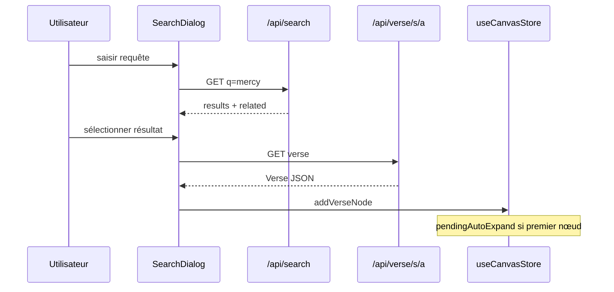
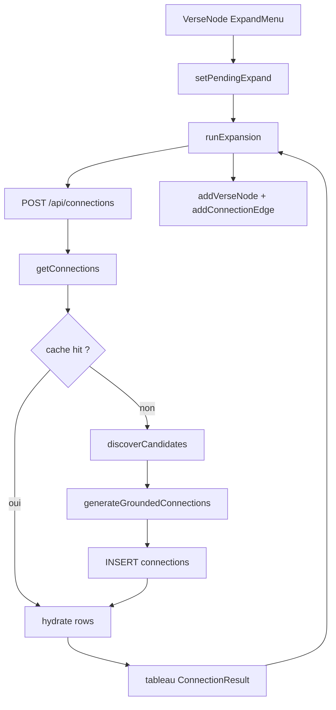

# Phase 6 — Parcours runtime cœur

> **Prérequis :** Phases [1](./phase-1-what-is-openhikmah.md)–[5](./phase-5-repository-tour.md)  
> **Tags d'évidence :** **FACT** (fait vérifiable dans le code) · **INFERENCE** (déduction raisonnée) · **UNKNOWN** (non documenté ou incertain)

Cinq flux qui, ensemble, enseignent la plupart de l'architecture. Chaque étape nomme des **symboles et chemins exacts**. Lisez un flux à la fois ; tracez-le dans le dépôt avant de passer au suivant.

**Légende pour chaque étape :**

| Champ | Signification |
| --- | --- |
| **Where** | Fichier / fonction |
| **Input** | Ce qui arrive |
| **Decision** | Branche prise |
| **Output** | Ce qui change |
| **Next** | Qui s'exécute ensuite |

---

## Flux A — Recherche par référence ou mot-clé

**User story :** Taper `2:255` ou `mercy` dans le dialog de recherche, choisir un résultat, arriver sur le canvas avec un nouveau nœud verset.

### A1 — Le client debounce et choisit le mode de fetch

| | |
| --- | --- |
| **Where** | `components/search/SearchDialog.tsx` — `useEffect` sur `query` (lignes ~121–140) |
| **Input** | Chaîne `query` depuis l'input |
| **Decision** | Si `/^\d+:\d+$/` → `fetchPreview(q)` après 250 ms ; sinon → `fetchSearch(q)` après 420 ms |
| **Output** | AbortController annule les requêtes obsolètes |
| **Next** | `fetchPreview` ou `fetchSearch` |

**FACT :** Une entrée en forme de ref affiche un aperçu inline ; tout le reste lance une recherche complète.

### A2a — Chemin aperçu référence (client)

| | |
| --- | --- |
| **Where** | `SearchDialog.fetchPreview` |
| **Input** | `"2:255"` |
| **Decision** | `GET /api/verse/2/255` |
| **Output** | `previewVerse: Verse` dans l'état du composant |
| **Next** | L'utilisateur appuie sur Entrée ou clique pour sélectionner (utilise le même fetch verset dans `selectResult`) |

### A2b — Chemin recherche mot-clé (client → API)

| | |
| --- | --- |
| **Where** | `SearchDialog.fetchSearch` → `GET /api/search?q=...` |
| **Input** | Requête texte libre |
| **Output** | `SearchResponse` → `searchResults`, `relatedResults`, `totalResults` |
| **Next** | `app/api/search/route.ts` `GET` |

### A3 — Routage API recherche (serveur)

| | |
| --- | --- |
| **Where** | `app/api/search/route.ts` `GET` |
| **Input** | `q`, cookies → `getQuranEdition()`, `getUiLocale()` |
| **Decision tree** | |

```text
1. Correspondance exacte nom de sourate ?     → return { matchedSurahs } (pas de liste ayah)
2. q correspond à /^\d+:\d+$/ ?
   → isValidRef(q)?             → resolveVerse(q) ou résultats vides
3. Sinon chemin mot-clé :
   → consume(`searchkw:...`)   → rate limit
   → Promise.all([
        keywordSearch(...),     → API quran.com → hydrate via getVerses
        relatedByMeaning(...)   → searchByMeaning (page 1 uniquement)
     ])
```

| **Output** | JSON `SearchResponse` avec `results`, `related` optionnel, `matchedSurahs` optionnel |
| **Next** | Le client affiche les listes |

**FACT :** Les hits mot-clé sont trouvés via **quran.com** ; l'arabe/la traduction affichés viennent du **corpus local** (`hydrate()` → `getVerses`).

**FACT :** Ref invalide comme `1:8` ou `02:255` → **résultats vides**, jamais une carte fabriquée.

### A4 — L'utilisateur sélectionne un résultat

| | |
| --- | --- |
| **Where** | `SearchDialog.selectResult` ou `loadSeedVerse` |
| **Input** | `SearchResult.ref` |
| **Decision** | `GET /api/verse/${surah}/${ayah}` |
| **Output** | Objet `Verse` complet |
| **Next** | `mapConnections(verse)` |

### A5 — API verset (barrière serveur)

| | |
| --- | --- |
| **Where** | `app/api/verse/[surah]/[ayah]/route.ts` `GET` |
| **Input** | `ref = "${surah}:${ayah}"` |
| **Decision** | `isValidRef(ref)` → 400 si faux |
| **Algorithm** | `resolveVerse(ref, edition)` — corpus d'abord, fallback alquran.cloud |
| **Output** | JSON `Verse` ou 404 |
| **Next** | Client `mapConnections` |

### A6 — Placer un nœud sur le canvas (état client)

| | |
| --- | --- |
| **Where** | `SearchDialog.mapConnections` |
| **Input** | `Verse`, `nodes` actuels, `viewport` |
| **Algorithm** | Premier nœud → `{x:0,y:0}` + `setPendingAutoExpand(nodeId)` ; sinon `findFreeSlot` + `setPendingPanToNode(nodeId)` |
| **Output** | `useCanvasStore.addVerseNode({ ...verse, isRoot: isFirst }, position)` → nouvel id `node-N` |
| **Next** | Effets `HikmahCanvas` (auto-expand Flux C) + autosave `useCanvasPersistence` |



**À COMPRENDRE MAINTENANT :** La recherche **trouve** les refs ; l'API verset **valide et hydrate** ; le store canvas **possède le layout**, pas la DB graphe.

---

## Flux B — Recherche par sens (couche sémantique)

**User story :** Taper un concept en anglais ; voir des hits « Related by meaning » même quand les mots-clés diffèrent.

Ce n'est **pas** un mode de recherche séparé dans l'UI — il s'exécute **en parallèle** de la recherche mot-clé sur la page 1.

### B1 — Déclenchement (serveur, dans la route search)

| | |
| --- | --- |
| **Where** | `app/api/search/route.ts` → `relatedByMeaning(req, q, edition)` |
| **Input** | Même `q` que la recherche mot-clé, `page === 1` uniquement |
| **Decision** | `consume(`search:${clientKey}`)` — partage le préfixe budget génération IA |
| **Decision** | Timeout 4 s via `AbortController` |
| **Next** | `searchByMeaning(q, limit, edition, signal)` |

**FACT :** Échec → `[]` silencieusement ; l'UI omet la section « Related by meaning ».

### B2 — Embed requête + plus proches voisins

| | |
| --- | --- |
| **Where** | `lib/quran/semantic-search.ts` |
| **Input** | Chaîne requête normalisée |
| **Algorithm** | |

```text
embedQueryCached(q)
  → Redis hit? return vector
  → else embed(q) via Gemini (lib/ai/ai.ts)
  → cache 7 days

nearest(queryVec, limit)
  → SQL: 1 - cosineDistance(verse_embeddings.embedding, queryVec)
  → ORDER BY similarity DESC

hydrate(rows, edition)
  → getVerses(refs, edition)
```

| **Output** | `SemanticMatch[]` avec `verse` + `similarity` |
| **Next** | La route search déduplique contre les refs mot-clé → `response.related` |

### B3 — Affichage client

| | |
| --- | --- |
| **Where** | `SearchDialog` — `setRelatedResults(data.related ?? [])` |
| **Input** | `SearchResult[]` dans `related` |
| **Output** | Section UI séparée « Related by meaning » |
| **Next** | Même `selectResult` → `/api/verse/...` → canvas comme Flux A |

### Connexe : « Versets similaires » depuis la sidebar (entrée différente)

| | |
| --- | --- |
| **Where** | `GET /api/verse/[surah]/[ayah]/similar` → `similarVerses(ref, 5)` |
| **Input** | Ref verset source (doit passer `isValidRef`) |
| **Algorithm** | Charger l'embedding source depuis `verse_embeddings` ; plus proches voisins excluant soi-même |
| **Output** | `{ verse, similarity }[]` — vide si pas d'embedding seedé |

**INFERENCE :** Le classement sémantique est **indexé en anglais** (embeddings construits depuis le texte de traduction) ; l'affichage utilise le cookie **edition** de l'utilisateur.

---

## Flux C — Expand un verset sur le canvas

**User story :** Cliquer **+** sur un nœud → choisir Theme / Root / Contrast → nouveaux nœuds et arêtes apparaissent avec raisons IA.

C'est la **boucle produit centrale** — lisez lentement.

### C1 — L'utilisateur sélectionne le type d'expansion

| | |
| --- | --- |
| **Where** | `components/canvas/VerseNode.tsx` → `handleExpandSelect(kind)` |
| **Input** | `EdgeKind` depuis `ExpandMenu` |
| **Output** | `setPendingExpand({ nodeId, ref: verse.ref, kind })` |
| **Next** | `HikmahCanvas` `useEffect` sur `pendingExpand` |

**FACT :** Le premier nœud de recherche auto-expand **thematic** via `setPendingAutoExpand` → même chemin `runExpansion` avec `kind: "thematic"`.

### C2 — L'effet d'expansion se déclenche

| | |
| --- | --- |
| **Where** | `components/canvas/HikmahCanvas.tsx` lignes ~253–261 |
| **Input** | `pendingExpand` |
| **Algorithm** | Effacer pending ; charger le nœud source ; lire `verse.arabicText`, `verse.translation`, position |
| **Output** | Appelle `runExpansion(nodeId, ref, kind, arabicText, translation, sourcePos)` |
| **Next** | POST réseau |

### C3 — Le client collecte la liste exclude (« get more »)

| | |
| --- | --- |
| **Where** | `runExpansion` → `getExpansionRefs(nodeId, kind)` |
| **Input** | Arêtes canvas actuelles |
| **Algorithm** | Filtrer arêtes où `e.source === nodeId && e.data.kind === kind` → mapper refs versets cibles |
| **Output** | `excludeRefs: string[]` envoyé à l'API |
| **Next** | `POST /api/connections` |

### C4 — Validation frontière API

| | |
| --- | --- |
| **Where** | `app/api/connections/route.ts` `POST` |
| **Input** | Corps JSON |
| **Decisions** | Champs requis présents ; `kind` ∈ ensemble autorisé ; `isValidRef(fromRef)` ; chaque entrée `excludeRefs` valide ; longueur texte ≤ 5000 |
| **Output** | Appelle `getConnections(fromRef, kind, { arabicText, translation }, { clientKey, excludeRefs, locale })` |
| **Next** | `lib/ai/graph-service.ts` |

### C5 — Graph service : chemin cache hit

| | |
| --- | --- |
| **Where** | `getConnections` → `readActiveRows(fromRef, kind, locale, excludeRefs)` |
| **Input** | Clé cellule + locale |
| **Algorithm** | `SELECT * FROM connections WHERE from_ref, kind, locale, status='active', to_ref NOT IN excludeRefs` |
| **Decision** | Si lignes existent et la porte de complétude locale passe → `hydrate(rows, kind)` |
| **Algorithm (hydrate)** | Pour chaque ligne : `resolveVerse(toRef)` → construire `ConnectionResult` |
| **Output** | `ConnectionResult[]` — **pas d'appel IA** |
| **Next** | Réponse JSON au client |

### C6 — Graph service : chemin cache miss (résumé)

| | |
| --- | --- |
| **Where** | Branche miss de `getConnections` |
| **Input** | Même cellule |
| **Decisions** | `consume(`gen:${clientKey}`)` rate limit ; `singleFlight(key, ...)` déduplique requêtes identiques concurrentes |
| **Output** | `generateConnectionsForCell(...)` ou `generateLocalizedCell(...)` pour non-`en` |
| **Next** | La Phase 7 tracera l'IA en détail ; pour la Phase 6 connaître la chaîne : |

```text
discoverCandidates(fromRef, kind, undefined, excludeRefs)
  root     → rootCandidates()        SQL sur word_morphology
  thematic → semanticCandidates()    voisins pgvector
  contrast → semanticCandidates()    même pool ; l'IA choisit les opposés

if candidates.length > 0
  generateGroundedConnections(..., candidateRefs)
else if excludeRefs.length > 0
  return []   // "get more" épuisé
else
  generateConnections(...)   // legacy, validé corpus

INSERT connections ... ON CONFLICT DO NOTHING
return hydrate / map to ConnectionResult[]
```

### C7 — Le client applique les résultats au canvas

| | |
| --- | --- |
| **Where** | Boucle `HikmahCanvas.runExpansion` |
| **Input** | `ConnectionResult[]` |
| **Decision** | `connections.length === 0` → notice erreur (épuisé vs échec première fois) |
| **Per connection** | |

```text
if hasNode(conn.ref)
  → buildConnectionEdge(existingNode) → addConnectionEdge
else
  → radialPos + findFreeSlot → addVerseNode(conn)
  → buildConnectionEdge → addConnectionEdge
```

| **Output** | `nodes`, `edges` mis à jour dans Zustand ; animation échelonnée 350 ms ; `reactFlow.fitView` |
| **Next** | Sauvegarde localStorage debounced `useCanvasPersistence` (~800 ms) |

### C8 — Clic arête → sidebar

| | |
| --- | --- |
| **Where** | `HikmahCanvas.handleEdgeClick` |
| **Input** | `edge` React Flow |
| **Output** | `setSidebarContent({ type: "edge", fromVerse, toVerse, reason, kind, label })` |
| **Next** | `ContextSidebar` affiche la raison IA (stylée éditoriale, pas scripture) |



**À COMPRENDRE MAINTENANT :** `excludeRefs` est comment « expand again » évite de répéter les mêmes cibles. Tableau vide au premier miss ≠ erreur de parse (502 depuis `ConnectionParseError`).

---

## Flux D — Partager un canvas

**User story :** Cliquer Share dans la toolbar → URL copiée → le destinataire ouvre le lien → voit le même layout.

### D1 — Sérialiser et POST

| | |
| --- | --- |
| **Where** | `components/canvas/CanvasToolbar.tsx` `handleShare` |
| **Input** | `nodes`, `edges` depuis Zustand |
| **Algorithm** | `serializeCanvas(nodes, edges)` → `SavedCanvas { v:1, nodes, edges }` |
| **Output** | `buildShareUrl(saved)` |
| **Next** | `hooks/useCanvasPersistence.ts` |

### D2 — Persister le snapshot share

| | |
| --- | --- |
| **Where** | `buildShareUrl` → `POST /api/share` |
| **Input** | Corps JSON |
| **Decisions** | Taille ≤ 512KB ; `v === 1` ; chaque nœud passe `isValidNode()` (ref, surahName, chaînes translation) |
| **Algorithm** | `crypto.randomUUID()` → `INSERT shared_canvases { id, data }` |
| **Output** | `{ id }` → URL `/canvas?share=<uuid>` |
| **Next** | Presse-papiers via `useCopyFeedback.copy` |

**FACT :** Share stocke **layout + snapshots versets**, pas le graphe Postgres `connections`.

### D3 — Le destinataire restaure

| | |
| --- | --- |
| **Where** | Effet mount `useCanvasPersistence` |
| **Input** | `?share=<uuid>` dans l'URL |
| **Algorithm** | Valider regex UUID → `GET /api/share/[id]` → parser JSON |
| **Output** | `restoreCanvas(saved)` dans `store/canvas.ts` |
| **Algorithm (restore)** | `deserializeCanvas` → reset compteur id nœud → incrémenter `restoreToken` |
| **Side effect** | Retirer param `share` de l'URL en cas de succès ; fallback localStorage si fetch échoue |
| **Next** | React Flow affiche le graphe restauré |

### D4 — API GET share

| | |
| --- | --- |
| **Where** | `app/api/share/[id]/route.ts` `GET` |
| **Input** | UUID |
| **Decisions** | Rate limit ; format UUID ; ligne existe |
| **Output** | JSON `SavedCanvas` parsé |

**IGNORER POUR L'INSTANT :** Route image OG `app/api/share/[id]/opengraph-image.tsx` — aperçu social uniquement.

---

## Flux E — Bookmark un verset (invité + connecté)

**User story :** Basculer bookmark sur un verset — fonctionne offline en invité ; synchronise vers Postgres une fois connecté.

### E1 — Toggle client optimiste

| | |
| --- | --- |
| **Where** | `store/auth.ts` → `toggleBookmark(ref)` |
| **Input** | Chaîne ref verset |
| **Algorithm** | Ajout/suppression optimiste dans `bookmarks[]` ; définir `bookmarkBusy[ref]` |
| **Decision** | Pas de `accessToken` → stop (persist local uniquement via Zustand `persist`) |
| **Decision** | Token présent → `POST /api/bookmarks` ou `DELETE /api/bookmarks/[ref]` |
| **Output** | Succès : mettre à jour `pendingBookmarkAdds` ; échec : rollback |
| **Next** | Barrière auth API |

### E2 — API Bookmark

| | |
| --- | --- |
| **Where** | `app/api/bookmarks/route.ts` |
| **Input** | Bearer token + `{ ref }` |
| **Decisions** | `requireUser(req)` → 401 si absent ; `isValidRef(ref)` → 400 |
| **Algorithm** | `INSERT bookmarks ON CONFLICT DO NOTHING` |
| **Output** | `{ ok: true }` |
| **Next** | Le client efface l'état busy |

### E3 — Sync restauration session

| | |
| --- | --- |
| **Where** | `components/providers.tsx` `SessionRestorer` → `loadRemoteBookmarks()` |
| **Input** | Access token depuis `/api/auth/refresh` |
| **Algorithm** | `GET /api/bookmarks` → fusionner refs serveur avec local ; sync `pendingBookmarkAdds` via POSTs concurrents bornés |
| **Output** | `bookmarks[]` unifié ; refs invité uniquement uploadées une fois |
| **Next** | La page Bookmarks lit le même store |

**FACT :** Les bookmarks stockent **refs uniquement** — pas le texte verset complet (texte fetché via `/api/verse/...` à l'affichage).

**Contraste avec workspace (variante Flux D) :** `CanvasToolbar.handleSave` → `POST /api/workspace` avec `serializeCanvas` complet — nécessite auth ; persiste canvas nommé dans `saved_workspaces`.

---

## Comparaison inter-flux

| Flux | Touche graphe Postgres ? | Touche IA ? | Store client principal |
| --- | --- | --- | --- |
| A Search | Non | Uniquement via B `related` | `canvas` (à la sélection) |
| B Semantic | Lit `verse_embeddings` | Embed requête (Gemini) | — |
| C Expand | **Oui** `connections` | Sur cache miss | `canvas` |
| D Share | `shared_canvases` uniquement | Non | `canvas` + URL |
| E Bookmark | `bookmarks` | Non | `auth` |

---

## Comportement d'erreur à connaître

| Symptôme | Cause probable | Où surfacé |
| --- | --- | --- |
| Search 429 | Rate limit `searchkw:` | SearchDialog `searchError: "rateLimited"` |
| Recherche vide pour ref valide en apparence | `isValidRef` ou `resolveVerse` null | Résultats vides, pas erreur |
| Expand « connections failed » | API non-OK ou Error lancée | Notice `HikmahCanvas` |
| Expand « no more connections » | `excludeRefs` non vide + tableau vide | `ExhaustedExpansionError` |
| Expand 502 | `ConnectionParseError` (JSON IA invalide) | Notice échec générique ; retry |
| Share échoue | POST rejeté / réseau | Flash erreur share toolbar |
| Bookmark rollback | POST/DELETE échoué | Ref retirée de la liste locale |

---

## Phase 6 — Ce qu'il faut retenir

### À COMPRENDRE MAINTENANT

1. **Search** = trouver refs (mot-clé/ref/nom sourate) ; **verse API** = valider + hydrater ; **canvas** = layout.
2. **Semantic** = embed requête + pgvector ; complémentaire au mot-clé sur la page 1 de recherche.
3. **Expand** = `pendingExpand` → `runExpansion` → `getConnections` → cache ou discover+IA → `addVerseNode`/`addConnectionEdge`.
4. **Share** = sérialiser layout vers `shared_canvases`, pas le graphe global.
5. **Bookmarks** = liste refs dans le store auth ; invité local, connecté synchronisé.

### UTILE PLUS TARD

- Sémantique merge `appendWorkspace` lors du chargement workspace sauvegardé
- `restoreToken` pour déduplication activity tracker sur restore bulk
- Backfill admin écrivant les mêmes lignes `connections` sans UI

### IGNORER POUR L'INSTANT

- Audio `playGraph` depuis la toolbar
- Pipeline export PNG/PDF

---

## Incertitudes

| Sujet | Statut |
| --- | --- |
| Nombres exacts rate-limit | **FACT :** dans `lib/infra/rate-limit.ts` — lire lors du debug 429 |
| Si le snapshot share inclut l'arabe complet sur tous les nœuds | **FACT :** `SavedNode.verse` est l'objet `Verse` complet au moment de la sérialisation |

---

## Et ensuite

**Phase 7 — Connexions IA ancrées (plongée profonde) :** pipeline complet pour empêcher les refs inventées — le modèle de confiance cœur en détail pas à pas avec son propre diagramme runtime.

Dites **« continue to Phase 7 »** quand vous êtes prêt.

---

## Checklist de trace (à faire vous-même)

Ouvrez ces fichiers côte à côte en relisant un flux :

| Flux | Fichiers à garder ouverts |
| --- | --- |
| A | `SearchDialog.tsx`, `app/api/search/route.ts`, `app/api/verse/.../route.ts`, `store/canvas.ts` |
| B | `app/api/search/route.ts`, `lib/quran/semantic-search.ts`, `lib/ai/ai.ts` |
| C | `VerseNode.tsx`, `HikmahCanvas.tsx`, `app/api/connections/route.ts`, `lib/ai/graph-service.ts` |
| D | `CanvasToolbar.tsx`, `useCanvasPersistence.ts`, `app/api/share/route.ts`, `store/canvas.ts` |
| E | `store/auth.ts`, `app/api/bookmarks/route.ts`, `components/providers.tsx` |
