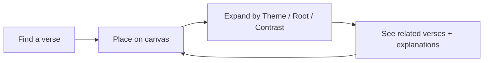
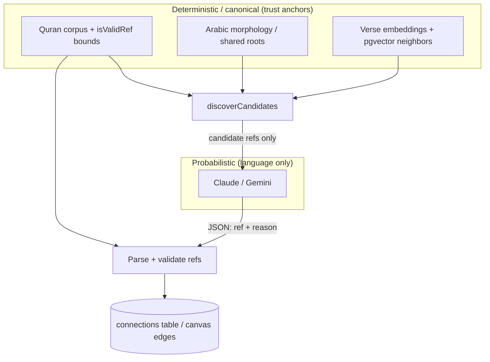

# Phase 1 — What is OpenHikmah?

> **Status:** Read-only onboarding · derived from checked-out repository docs and source  
> **Evidence tags:** **FACT** = demonstrated in repo · **INFERENCE** = reasonable interpretation · **UNKNOWN** = not verified yet

---

## Before the code: one sentence

**FACT:** Open Hikmah is an *AI-grounded* Quran knowledge graph — you search a verse, place it on an infinite canvas, expand it to surface related verses, and read AI-written explanations of *why* those relationships hold.

That single adjective — **grounded** — is the product’s central engineering and theological bet.

---

## What OpenHikmah is

**FACT:** The README describes Open Hikmah as letting you explore the Qur’an as a **connected graph** instead of reading linearly, page by page.

**FACT:** The homepage metadata (`app/page.tsx`) frames it as: *“Search any verse and map its connections — shared roots, themes, and contrasts — grounded in canonical Qur’an data.”*

**INFERENCE:** “Hikmah” (حكمة, wisdom) here means structured, explorable insight — not a chatbot that free-associates about the Qur’an. The product is closer to an interactive study map than to a generic AI assistant.

### Core loop (product mental model)

1. **Find a verse** — by reference (`2:255`), keyword, or natural-language meaning.
2. **Place it on the canvas** — an infinite graph workspace (`@xyflow/react`).
3. **Expand a node** — choose a connection *mode* (theme, root word, or contrast).
4. **Receive grounded edges** — target verses come from deterministic data first; AI explains the link.
5. **Keep exploring** — share the canvas via URL, bookmark verses, optionally sign in for sync.

**MUST UNDERSTAND NOW:** The canvas is the primary sensemaking surface. Search gets you in; the graph is where understanding accumulates.

**USEFUL LATER:** Divine Names (`/names`), Prophetic Stories, social streaks/challenges, workspaces, audio playback, localization — real features, but not required to grasp the core trust model.

**IGNORE FOR NOW:** Admin backfill tooling, Redis caching internals, PKCE OAuth details.

---

## Who it is for

**FACT:** Guest access is supported — you can explore, bookmark locally, and use the canvas without an account (README Features).

**FACT:** Signed-in users (via Quran Foundation OAuth2 PKCE) get cross-device bookmarks, named workspaces, social features, and @mentions.

**INFERENCE:** The audience is Muslims and students of the Qur’an who want *relational* exploration — how verses echo, contrast, or share linguistic DNA — not just lookup. The UI and copy assume reverence for sacred text (see `DESIGN.md`: AI explanations must never be styled like scripture).

---

## What problem it solves

### Linear reading vs. relational understanding

**INFERENCE:** Traditional reading follows surah/ayah order. Theological and linguistic links cut across that order: the same Arabic root appears in distant surahs; themes recur; some ayahs deliberately contrast others (ease/hardship, gratitude/ingratitude).

OpenHikmah makes those cross-verse relationships **first-class, navigable objects** instead of things you must already know or hunt manually.

### Why ordinary keyword search is insufficient

**FACT:** The app supports direct reference lookup and full-text keyword search (`README.md` Features).

**INFERENCE:** Keyword search fails when:

- You know the *idea* but not the wording (“verses about patience in hardship”).
- Related verses use different vocabulary tied only by meaning or shared Arabic morphology.
- You want *contrast* relationships, not similarity.

**FACT:** Semantic **search by meaning** is a first-class feature — describe a concept in your own words and retrieve relevant verses even when no words overlap (`README.md` Overview).

That requires embeddings + vector similarity (PostgreSQL + pgvector + Gemini embeddings per README Tech Stack) — a fundamentally different retrieval problem than exact field match. *(Detailed mechanics: Phase 2 and Phase 9.)*

---

## What “theological sensemaking” means here

**FACT:** `CONTRIBUTING.md` calls Open Hikmah *“a theological sensemaking tool for the Quran.”*

**FACT:** `AGENTS.md` binds all AI prompts and connections to the **Maturidi/Hanafi tradition** and requires **strict Tanzih** — never implying physical form, spatial location, or resemblance for divine attributes.

In product terms, theological sensemaking means:

| Ordinary “AI Quran app” failure mode | OpenHikmah’s intended behavior |
| --- | --- |
| Model invents a verse reference | Target refs come from corpus / discovery first; refs are validated |
| Model states unsupported links as fact | Link endpoints are deterministic; model writes the *reason* |
| Model drifts into heterodox framing | Prompts encode school + Tanzih; changes require disclosure |

**FACT:** `DESIGN.md` requires AI-written text (connection reasons, reflections) to be **visually distinct** from canonical verse text — teal-bordered editorial note, never styled as scripture.

**MUST UNDERSTAND NOW:** Sensemaking = *guided exploration with guardrails*, not open-ended generation of religious content.

---

## What a “Quran knowledge graph” means here

**FACT:** Persisted connections live in PostgreSQL (`lib/ai/graph-service.ts` — *“The persistent knowledge graph. Reads connections from Postgres…”*).

**FACT:** Three edge kinds exist (`types/quran.ts`):

| Kind | Product label (approx.) | What it connects |
| --- | --- | --- |
| `thematic` | Theme | Verses sharing theological theme |
| `root` | Root word | Verses sharing significant Arabic root |
| `contrast` | Contrast | Verses presenting opposing theological concepts |

**FACT:** Each edge carries metadata: `kind`, human-readable `label`, and an AI-generated `reason` string (`CanvasEdge.data` in `types/quran.ts`).

### Graph vs. canvas

**INFERENCE:**

- **Knowledge graph (persisted):** `(fromRef, toRef, kind, reason, locale…)` — shared, cacheable, auditable.
- **Canvas (session/UI):** React Flow nodes and edges — layout, selection, expansion state, share serialization — your working view of the graph.

**FACT:** Shareable canvases serialize to a URL (`README.md` Features; `lib/canvas/share-canvas.ts` exists).

You will revisit this split deeply in Phase 8. For now: **the graph is the truth of “what connects to what”; the canvas is how you manipulate and share a view of it.**

---

## What the infinite canvas contributes

**FACT:** Canvas uses `@xyflow/react`; styling treats it as a flat navy field where nodes are separated by border/surface, not elevation (`DESIGN.md`, README Tech Stack).

**INFERENCE:** The canvas matters because Qur’anic relationships are **multi-way and non-linear**. A list of search results cannot show:

- Parallel expansion from one verse in three modes (theme / root / contrast)
- Overlapping paths (verse A → B and A → C, then B → D)
- Spatial grouping you build as you study

**FACT:** Edge colors are semantically reserved — theme teal, root gold, contrast red/error tone (`DESIGN.md`).

---

## Arabic roots — why they matter (product level)

**FACT:** Connections can be grounded in **canonical morphology** — shared Arabic roots from seeded `word_morphology` data (`lib/ai/connection-discovery.ts`, README Tech Stack).

**INFERENCE:** Arabic words derive from trilateral (or similar) **roots**. Verses that share a root often share conceptual DNA even when English translations look unrelated. That is a **deterministic** linguistic signal — not LLM intuition.

**FACT:** `lib/quran/arabic-morphology.ts` documents word-level interactivity: morphology entries tie surface forms to roots for in-verse highlighting.

Computational morphology details → **Phase 2**. For Phase 1: **roots are one of two major grounding rails alongside embeddings.**

---

## Semantic search — what it adds (product level)

**FACT:** `lib/quran/semantic-search.ts` states semantic search:

- Reads **precomputed** vectors from `verse_embeddings` (seeded by `scripts/embed-corpus.mjs`)
- Ranks by **cosine similarity** via pgvector
- Powers “search by meaning”, “find similar verses”, and **candidate retrieval for thematic/contrast connections**

Simple conceptual example:

> User query: *“gratitude when times are hard”*  
> **FACT:** System embeds the query (Gemini), finds nearest verse vectors in Postgres, returns ranked ayahs.  
> **INFERENCE:** No shared English/Arabic keyword required between query and hit.

Embeddings are **768-dimensional** vectors (`GEMINI_EMBEDDING_MODEL` / `.env.example`).

---

## What role AI plays — and what it is deliberately NOT allowed to do

This is the repository’s most important distinction.

### Separation of powers (official architecture language)

**FACT:** `lib/ai/connection-discovery.ts` header:

> *Candidate discovery … the “data discovers” half of the separation of powers … The AI never invents these refs; it only selects among them and explains why.*

**FACT:** `lib/ai/connection-generator.ts` header:

> *generateGroundedConnections — the preferred “AI articulates” half … Receives REAL candidate verses … asks the model only to SELECT among them and explain why. Returned refs are validated against the candidate set, so the model cannot introduce a verse that wasn't discovered.*

### Three layers of “what is allowed on the canvas”

| Layer | Mechanism | **FACT** source |
| --- | --- | --- |
| **1. Preferred (grounded)** | Discovery yields candidate refs → AI selects subset + writes reasons → output refs must be ∈ candidate set | `generateGroundedConnections`, `allowed.has(c.ref)` |
| **2. Fallback (legacy)** | If no grounding data seeded, AI proposes refs from memory → each ref must pass `isValidRef` + exist in **local corpus** via `getVerses` | `generateConnections` |
| **3. Post-generation persistence** | English canonical rows stored in Postgres; non-English locales translate reasons, not re-select verses | `graph-service.ts` |

**FACT:** Legacy path still **cannot persist hallucinated refs** — `generateConnections` hydrates from local corpus only; missing corpus rows are dropped.

**FACT:** Grounded path is stricter — a ref not in the discovery list is filtered out even if valid in corpus.

### What the LLM is allowed to generate

**FACT:** For connections, the model outputs JSON like `{ "ref": "surah:ayah", "reason": "…" }` — the **`reason`** is the primary generative content; **`ref`** is constrained.

**FACT:** Prompts include Maturidi/Hanafi framing and append `TANZIH_CONSTRAINT` via `tanzihDirective()` — admins cannot remove Tanzih by overriding templates alone (`connection-generator.ts` comments).

**FACT:** AI provider: Anthropic Claude (primary) with Gemini fallback; embeddings always Gemini (`.env.example`, README).

### What the LLM must NOT do (by design)

| Forbidden | Enforcement |
| --- | --- |
| Invent verse references (grounded path) | Candidate set membership |
| Invent references (legacy path) | `isValidRef` + local corpus hydration |
| Choose arbitrary corpus verses without discovery (grounded) | Selection prompt: *“Choose ONLY from the candidate references listed above”* |
| Silent theological drift | Tanzih constraint + review/disclosure for prompt changes (`AGENTS.md`) |
| Pass as scripture | UI design rules (`DESIGN.md`) |

**MUST UNDERSTAND NOW:** **Data discovers; AI articulates.** The product’s credibility rests on that ordering.

---

## Central trust model — canonical vs. generated

Use this table as your default mental checklist when reading any feature:

| Concern | Grounded / deterministic | Generated / probabilistic |
| --- | --- | --- |
| Does this ayah exist? | `isValidRef`, surah length bounds, corpus row | — |
| Arabic text & primary translation | Seeded `verses` table; `en.sahih` (Saheeh International) | — |
| Which verses can connect? | Root sharing (`word_morphology`), embedding neighbors (`verse_embeddings`) | — |
| Which candidates become edges? | Grounded: AI picks from list; Legacy: AI proposes, corpus filters | Selection choice |
| Why are they connected? | — | AI-generated `reason` (validated JSON shape) |
| Non-English reason text | English canonical row is source of truth | Translation of reasons (`translateReason`) |
| Divine Names / reflections | Canonical English strings + structured data | AI reflections with separate prompts (`app/api/names/...`) |

### Verse reference validation (high level)

**FACT:** `lib/quran/quran-corpus.ts` — `isValidRef` checks:

- Format `surah:ayah` (canonical spelling — `"02:255"` rejected)
- Surah 1–114, ayah within per-surah Hafs/Uthmani counts (`"1:8"` rejected)

**FACT:** `lib/quran/verse-resolver.ts` — local corpus first; live alquran.cloud fetch as fallback; returns `null` if nowhere — doubles as anti-hallucination gate.

**FACT:** `AGENTS.md` — never fabricate Quran references; never loosen validation to pass tests.

---

## Why this boundary is fundamental

**INFERENCE:** For sacred text, the cost of a wrong ayah reference is not a generic UI bug — it is a **trust and theological integrity** failure. Users may treat surfaced connections as scholarly guidance.

So OpenHikmah optimizes for:

1. **Referential integrity** — ayahs are real and corpus-backed before they appear.
2. **Explainability** — every edge links to a stated reason (product README: *“Every edge on the canvas links to that explanation”*).
3. **Auditability** — generations logged to `ai_generations`; connections persisted (`connection-generator.ts`, `graph-service.ts`).
4. **Reviewability** — prompt/theology changes need explicit contributor disclosure (`CONTRIBUTING.md`, PR template reference).

Compare to Firebase/Firestore mental model you know:

- **Firestore:** you trust document IDs because *your app wrote them*.
- **OpenHikmah:** you trust edge targets because *deterministic pipelines and corpus validation admitted them* — the LLM is more like a commentator constrained to a provided reading list.

---

## Tech context (only what shapes the product)

**FACT (README Tech Stack):**

| Concern | Choice |
| --- | --- |
| App | Next.js **16** App Router, React 19, TypeScript strict |
| Canvas state | Zustand + `@xyflow/react` |
| Database | PostgreSQL + pgvector + Drizzle ORM |
| Auth | Quran Foundation OAuth2 PKCE |
| AI | Claude (+ Gemini fallback); Gemini embeddings |

**UNKNOWN (for later phases):** Exact Next.js 16 App Router patterns used here vs. older Next assumptions — repo warns to read local `node_modules/next/dist/docs/` before coding.

---

## Phase 1 — What to remember

### MUST UNDERSTAND NOW (5 bullets)

1. OpenHikmah is a **grounded Quran knowledge graph** with an infinite canvas — not a free-form Quran chatbot.
2. **Three connection modes:** theme, root, contrast — each with deterministic discovery rails.
3. **Separation of powers:** morphology + embeddings **discover** candidate verses; AI **selects (when grounded) and explains**.
4. **Validation is layered:** syntax/bounds → corpus existence → (grounded) candidate-set membership.
5. **Theological constraints are product requirements**, encoded in prompts (`TANZIH_CONSTRAINT`) and contributor rules (`AGENTS.md`).

### USEFUL LATER

- Social, workspaces, audio, Divine Names, Prophetic Stories, admin backfill loop.
- Redis embedding cache, rate limits, single-flight deduplication.
- Localization pipeline (English-canonical graph, translated reasons).

### IGNORE FOR NOW

- PKCE token flow implementation details.
- Drizzle schema field-by-field tour.
- E2E test layout.

---

## Uncertainties (honest gaps after Phase 1)

| Topic | Status |
| --- | --- |
| How much of the corpus is pre-seeded vs. live-fetched in a fresh dev setup | **UNKNOWN** — depends on running seed/migrate scripts (Phase 10) |
| Frequency of legacy vs. grounded path in production | **INFERENCE:** grounded preferred whenever morphology/embeddings exist; legacy only on miss |
| Exact UX copy for expand modes on canvas | **UNKNOWN** — need UI inspection (Phase 11) |
| Whether contrast discovery uses separate vectors or same neighbors as theme | **FACT:** same semantic neighbors; AI selects opposing ones (`connection-discovery.ts` comment) |

---

## What comes next

**Phase 2 — Domain primer:** surah/ayah model, morphology tables, embeddings/pgvector queries, graph persistence vs. canvas — each tied to concrete files.

**Phase 3 — Theological and sacred-data boundaries:** full map of where constraints live (tests, prompts, review rules).

When you are ready, say **“continue to Phase 2”** or ask questions about Phase 1.

---

## Key repository sources for this phase

| Source | Role |
| --- | --- |
| `README.md` | Product pitch, features, stack |
| `CONTRIBUTING.md` | “Theological sensemaking tool”; contribution expectations |
| `AGENTS.md` | Theological standards, AI attribution |
| `DESIGN.md` | Sacred vs. AI text presentation |
| `lib/ai/connection-discovery.ts` | “Data discovers” |
| `lib/ai/connection-generator.ts` | “AI articulates”; validation |
| `lib/ai/graph-service.ts` | Persistent graph + cache miss generation |
| `lib/quran/quran-corpus.ts` | `isValidRef`, local corpus |
| `lib/quran/semantic-search.ts` | Semantic retrieval role |
| `types/quran.ts` | Edge kinds, canvas types |
